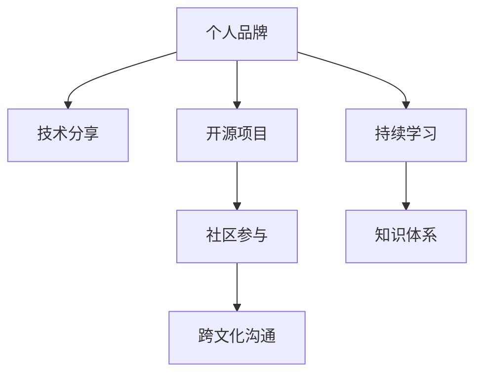

                 

# 程序员如何打造全球性的个人影响力

> 关键词：全球影响力、个人品牌、技术分享、开源项目、社区贡献、跨文化沟通、持续学习、知识体系、技术影响力

## 1. 背景介绍

### 1.1 问题由来
在信息爆炸的互联网时代，技术的快速发展要求程序员不断提升个人能力，拓展全球视野，打造个人品牌，以期在技术界内外发挥更大的影响力。同时，全球化背景也促使程序员需要具备跨文化沟通和协作的能力，才能在多国企业或开源社区中游刃有余。

### 1.2 问题核心关键点
本文旨在探讨程序员如何通过技术分享、开源项目贡献、社区参与等方式，在全球范围内建立个人影响力。其关键点包括：

- **个人品牌**：建立和维护个人品牌是提升全球影响力的基础。
- **技术分享**：通过博客、视频、播客等方式分享技术知识，吸引全球技术爱好者关注。
- **开源项目**：参与和领导开源项目，提升全球技术社区中的知名度和贡献度。
- **社区参与**：活跃于各类技术社区，发表有见地的文章和见解，推动技术发展。
- **跨文化沟通**：在全球化合作中，掌握跨文化沟通技巧，促进团队合作。
- **持续学习**：不断学习新技术和最佳实践，保持技术领先。
- **知识体系**：构建和分享自己的知识体系，形成鲜明的专业特色。

这些关键点共同构成了程序员在全球范围内建立个人影响力的重要因素。

## 2. 核心概念与联系

### 2.1 核心概念概述

为更好地理解如何打造全球性的个人影响力，本节将介绍几个密切相关的核心概念：

- **个人品牌**：程序员通过在线平台展示自己的技术特长和独特观点，在技术社区内外建立个人声誉。
- **技术分享**：程序员将自己的技术见解、项目经验通过博客、视频等形式分享给全球技术爱好者。
- **开源项目**：程序员通过参与和领导开源项目，在全球技术社区中展示自己的技术实力和团队协作能力。
- **社区参与**：程序员积极参与技术社区讨论，发表有见地的文章和见解，提升个人影响力。
- **跨文化沟通**：程序员在跨国团队或开源项目中，掌握跨文化沟通技巧，促进团队合作和知识传播。
- **持续学习**：程序员保持学习新技术和最佳实践的热情，不断提升自身技术水平。
- **知识体系**：程序员构建自己的知识体系，形成鲜明的专业特色，引导技术发展的潮流。

这些核心概念之间的逻辑关系可以通过以下Mermaid流程图来展示：



这个流程图展示了个体在全球范围内建立个人影响力的核心概念及其之间的关系：

1. 个人品牌是基础，影响技术分享、社区参与等行为的出发点。
2. 技术分享和开源项目贡献是提升个人影响力的重要手段。
3. 社区参与和跨文化沟通为个人影响力的传播和扩展提供更多平台。
4. 持续学习和知识体系构建是个人影响力可持续发展的保障。

## 3. 核心算法原理 & 具体操作步骤
### 3.1 算法原理概述

程序员打造全球性的个人影响力，本质上是一个复杂的社会网络效应问题。其核心思想是通过技术分享、开源贡献等行为，增加在技术社区内的连接数和影响力，形成正反馈循环，从而在全球范围内建立起显著的个人品牌。

形式化地，设个人在技术社区内的影响力为 $I$，其影响力 $I$ 可通过以下公式计算：

$$
I = f_{技术分享}(TS) + f_{开源项目}(OS) + f_{社区参与}(CP) + f_{跨文化沟通}(CC) + f_{持续学习}(LS) + f_{知识体系}(KB)
$$

其中 $f$ 表示每个行为对影响力的贡献函数，$TS, OS, CP, CC, LS, KB$ 分别为技术分享、开源项目、社区参与、跨文化沟通、持续学习、知识体系等行为的强度和频度。

### 3.2 算法步骤详解

程序员打造全球性个人影响力的一般步骤包括：

**Step 1: 提升技术分享能力**
- 选择适合自己的技术分享平台，如GitHub、Medium、CSDN等。
- 定期撰写技术文章，包括技术博客、技术报告、代码解析等。
- 制作技术视频、播客，或参与技术直播，分享自己的技术见解。

**Step 2: 参与开源项目**
- 选择感兴趣的开源项目，加入其社区，了解项目的背景和目标。
- 贡献代码、修复Bug、优化文档，提高项目的质量。
- 主动提出新功能或改进建议，展示自己的技术能力和创新思维。
- 承担领导角色，带动项目团队的协作和创新。

**Step 3: 活跃社区参与**
- 加入技术论坛、社交媒体群组、技术博客评论区等，积极发表有见解的评论和文章。
- 主动发起讨论话题，分享最新的技术动态和项目进展。
- 建立自己的技术博客或频道，定期发布原创内容，吸引技术爱好者关注。

**Step 4: 提升跨文化沟通能力**
- 学习基本的外语技能，提升跨文化交流的效率。
- 参与国际技术会议、跨国团队项目，积累跨文化合作的经验。
- 研究不同文化背景下的沟通习惯，避免文化冲突。
- 尊重不同文化背景的技术差异，进行有效的沟通和合作。

**Step 5: 持续学习和构建知识体系**
- 定期参加技术研讨会、在线课程，学习最新的技术趋势和最佳实践。
- 建立自己的知识体系，包括技术博客、文档、书籍等，形成系统的技术框架。
- 定期整理和更新知识体系，保持内容的先进性和实用性。

**Step 6: 建立和维护个人品牌**
- 选择一致的社交媒体账号和个人品牌形象，保持一致性。
- 定期更新技术动态，分享个人项目进展，提升个人形象。
- 积极回应技术社区的反馈和评论，增强互动性。
- 发布技术文章或作品，在各大技术平台上获得推广和曝光。

### 3.3 算法优缺点

打造全球性个人影响力的基于技术分享和开源项目的方法具有以下优点：
1. 提升技术影响力：通过开源和分享，展示自己的技术实力和创新能力，吸引全球技术爱好者关注。
2. 增加社区参与度：积极参与社区讨论，提高在技术社区中的活跃度和知名度。
3. 跨文化合作机会：参与国际项目和会议，积累跨文化合作经验，提升全球影响力。
4. 持续学习动力：不断学习和分享新技术，保持技术领先，增强个人竞争力。

同时，该方法也存在一些局限性：
1. 高门槛：需要较强的编程能力和技术理解力。
2. 时间成本：技术分享和开源项目需要投入大量时间，对日常工作可能造成影响。
3. 不确定性：个人影响力的提升具有不确定性，受多种因素影响。
4. 合作风险：跨文化合作中可能遇到文化差异和技术差异，增加合作难度。

尽管存在这些局限性，但就目前而言，基于技术分享和开源项目的方法仍是大规模提升个人影响力的有效手段。未来相关研究的重点在于如何进一步降低技术分享和开源项目的门槛，以及如何更好地利用社交网络效应，最大化个人影响力的提升。

### 3.4 算法应用领域

基于技术分享和开源项目的方法在NLP、计算机视觉、机器学习等领域已得到了广泛的应用，涵盖了从学术研究到工业生产的全方位应用。例如：

- **自然语言处理(NLP)**：在开源项目如OpenAI的GPT、BERT等大语言模型中，全球众多研究者和开发者积极贡献代码、改进模型，推动NLP技术的持续创新。
- **计算机视觉**：在开源项目如TensorFlow、PyTorch中，全球开发者通过代码贡献和社区讨论，推动计算机视觉技术的快速进步。
- **机器学习**：在开源项目如Scikit-learn、PyTorch Lightning等中，研究者通过撰写技术文章、开发工具包，提升全球机器学习社区的活跃度和技术水平。

除了上述这些经典领域，技术分享和开源项目也正在逐渐扩展到更多领域，如可控生成、强化学习、自动化测试等，为各类技术的落地应用提供了新的动力。

## 4. 数学模型和公式 & 详细讲解  
### 4.1 数学模型构建

为更好地理解如何通过技术分享和开源项目来打造个人影响力，本节将使用数学语言对相关模型进行更加严格的刻画。

设程序员在技术社区内的影响力为 $I$，其影响力 $I$ 可通过以下数学模型计算：

$$
I = \sum_{i=1}^{n} f_i(X_i)
$$

其中 $f_i$ 表示每个行为对影响力的贡献函数，$X_i$ 为该行为的强度和频度。

### 4.2 公式推导过程

以技术分享为例，假设程序员在技术社区内发布一篇博客，其影响力增加量为 $I_{blog}(X)$，其中 $X$ 为该博客的阅读量、评论数、分享数等指标。

$$
I_{blog}(X) = g(X) \cdot \sum_{i=1}^{m} \alpha_i \cdot \delta_i
$$

其中 $g(X)$ 表示阅读量等指标对影响力的贡献函数，$\alpha_i$ 为权重，$\delta_i$ 为该博客的具体指标值。

通过类似的方式，可以对开源项目贡献、社区参与、跨文化沟通等行为进行数学建模，计算其对个人影响力的具体贡献。

### 4.3 案例分析与讲解

**案例1: GitHub用户影响力分析**
设某程序员在GitHub上发布开源项目，假设每月新增仓库数为 $X_{repo}$，每次仓库新增用户数为 $Y_{user}$，项目贡献代码量为 $Z_{code}$，项目收到的评论数为 $W_{comment}$。

利用公式 $I_{blog}(X)$，可计算该项目每月对个人影响力的贡献：

$$
I_{repo} = g_{repo}(X_{repo}) \cdot \alpha_{repo} \cdot \delta_{repo} + g_{user}(Y_{user}) \cdot \alpha_{user} \cdot \delta_{user} + g_{code}(Z_{code}) \cdot \alpha_{code} \cdot \delta_{code} + g_{comment}(W_{comment}) \cdot \alpha_{comment} \cdot \delta_{comment}
$$

其中 $g_{repo}, g_{user}, g_{code}, g_{comment}$ 分别为新增仓库数、新增用户数、代码贡献量、评论数等指标对影响力的贡献函数，$\alpha_{repo}, \alpha_{user}, \alpha_{code}, \alpha_{comment}$ 为权重，$\delta_{repo}, \delta_{user}, \delta_{code}, \delta_{comment}$ 为具体指标值。

通过公式 $I_{repo}$，程序员可以量化开源项目在提升个人影响力方面的具体贡献，并据此调整策略，优化项目的质量和影响力。

**案例2: Medium博主影响力分析**
设某博主在Medium上定期发布技术文章，假设每月发布文章数为 $X_{article}$，每篇文章阅读量为 $Y_{read}$，每篇文章评论数为 $Z_{comment}$，每篇文章分享数为 $W_{share}$。

利用公式 $I_{blog}(X)$，可计算该博主每月对个人影响力的贡献：

$$
I_{article} = g_{article}(X_{article}) \cdot \alpha_{article} \cdot \delta_{article} + g_{read}(Y_{read}) \cdot \alpha_{read} \cdot \delta_{read} + g_{comment}(Z_{comment}) \cdot \alpha_{comment} \cdot \delta_{comment} + g_{share}(W_{share}) \cdot \alpha_{share} \cdot \delta_{share}
$$

其中 $g_{article}, g_{read}, g_{comment}, g_{share}$ 分别为文章数、阅读量、评论数、分享数等指标对影响力的贡献函数，$\alpha_{article}, \alpha_{read}, \alpha_{comment}, \alpha_{share}$ 为权重，$\delta_{article}, \delta_{read}, \delta_{comment}, \delta_{share}$ 为具体指标值。

通过公式 $I_{article}$，博主可以量化技术文章在提升个人影响力方面的具体贡献，并据此调整策略，优化文章的阅读量和互动性，提高影响力。

## 5. 项目实践：代码实例和详细解释说明
### 5.1 开发环境搭建

在进行技术分享和开源项目实践前，我们需要准备好开发环境。以下是使用Python进行GitHub开发的环境配置流程：

1. 安装Anaconda：从官网下载并安装Anaconda，用于创建独立的Python环境。

2. 创建并激活虚拟环境：
```bash
conda create -n pytorch-env python=3.8 
conda activate pytorch-env
```

3. 安装PyTorch：根据CUDA版本，从官网获取对应的安装命令。例如：
```bash
conda install pytorch torchvision torchaudio cudatoolkit=11.1 -c pytorch -c conda-forge
```

4. 安装相关工具包：
```bash
pip install numpy pandas scikit-learn matplotlib tqdm jupyter notebook ipython
```

完成上述步骤后，即可在`pytorch-env`环境中开始技术分享和开源项目实践。

### 5.2 源代码详细实现

这里我们以一个GitHub上的开源项目为例，展示如何通过代码贡献来提升个人影响力。

首先，创建一个GitHub账号，并选择一个开源项目，如TensorFlow：

```bash
git clone https://github.com/tensorflow/tensorflow.git
cd tensorflow
git checkout -b my-contrib
```

然后，克隆项目到本地，分支为`my-contrib`，在该分支上进行代码贡献：

```python
# 安装必要的依赖
pip install torch torchvision

# 导入必要的库
import torch
import torchvision

# 定义模型
class MyModel(torch.nn.Module):
    def __init__(self):
        super(MyModel, self).__init__()
        self.conv1 = torchvision.models.resnet18()
        self.fc = torch.nn.Linear(512, 10)

    def forward(self, x):
        x = self.conv1(x)
        x = x.flatten(1)
        x = self.fc(x)
        return x

# 加载数据集
train_data = torchvision.datasets.CIFAR10(root='./data', train=True, download=True)
test_data = torchvision.datasets.CIFAR10(root='./data', train=False, download=True)
train_loader = torch.utils.data.DataLoader(train_data, batch_size=64, shuffle=True)
test_loader = torch.utils.data.DataLoader(test_data, batch_size=64, shuffle=False)

# 训练模型
model = MyModel()
optimizer = torch.optim.Adam(model.parameters(), lr=0.001)
criterion = torch.nn.CrossEntropyLoss()
for epoch in range(10):
    for batch_idx, (data, target) in enumerate(train_loader):
        optimizer.zero_grad()
        output = model(data)
        loss = criterion(output, target)
        loss.backward()
        optimizer.step()
        
        if (batch_idx+1) % 100 == 0:
            test_loss = 0
            correct = 0
            with torch.no_grad():
                for test_batch in test_loader:
                    test_output = model(test_batch[0])
                    test_loss += criterion(test_output, test_batch[1]).item()
                    correct += (test_output.argmax(dim=1) == test_batch[1]).float().sum().item()
            print(f'Train Epoch: {epoch+1} | Loss: {loss.item():.4f} | Test Loss: {test_loss/len(test_loader):.4f} | Test Accuracy: {correct/len(test_loader):.4f}')
```

完成代码实现后，将代码提交到GitHub上，并与开源社区中的其他开发者进行交流和讨论，分享代码实现和改进建议。

### 5.3 代码解读与分析

让我们再详细解读一下关键代码的实现细节：

**克隆项目**：
- 使用`git clone`命令克隆指定GitHub项目到本地，并切换到`my-contrib`分支。

**定义模型和训练**：
- 定义自己的模型`MyModel`，并加载CIFAR-10数据集。
- 使用Adam优化器和交叉熵损失函数训练模型。
- 在每个epoch后，计算模型在测试集上的损失和准确率，并打印输出。

**代码提交和交流**：
- 使用`git add`和`git commit`命令将代码提交到GitHub上。
- 在项目页面上，发布代码修改详情，说明自己的改进和思考。
- 与社区中的其他开发者交流讨论，分享自己的进展和问题。

通过上述代码实现，程序员不仅完成了对开源项目的贡献，也建立了自己在GitHub社区中的影响力。

## 6. 实际应用场景
### 6.1 开源社区
开源社区是程序员展示个人技术实力和影响力的重要平台。通过积极参与开源项目，贡献代码、改进文档、提出建议，程序员可以提升自己在开源社区中的知名度和贡献度。

例如，参与TensorFlow项目，可以提升在机器学习和深度学习领域的全球影响力。参与PyTorch项目，则可以展示自己在深度学习框架和研究方面的能力。

### 6.2 学术研究
学术研究是程序员展示自己技术深度和创新能力的重要途径。通过发表学术论文、参加技术研讨会、申请专利，程序员可以在学术界内建立个人声誉，吸引全球研究者的关注。

例如，在顶级学术会议如NeurIPS、ICML、CVPR上发表论文，可以提升自己在计算机视觉、自然语言处理等领域的全球影响力。

### 6.3 企业合作
企业合作是程序员展示技术实力和跨文化沟通能力的有效方式。通过参与跨国项目、跨国企业合作，程序员可以积累国际合作经验，提升全球影响力。

例如，参与谷歌、微软、亚马逊等企业合作项目，可以展示自己在大规模分布式系统、云计算、人工智能等方面的技术实力和创新能力。

### 6.4 技术博客和播客
技术博客和播客是程序员展示技术见解和分享经验的重要途径。通过撰写技术文章、制作技术视频和播客，程序员可以吸引全球技术爱好者关注，提升个人品牌影响力。

例如，在Medium、CSDN等技术平台上撰写博客，在YouTube、Bilibili等视频平台上发布技术视频，在Spotify等播客平台上发布技术播客，展示自己的技术见解和项目经验。

## 7. 工具和资源推荐
### 7.1 学习资源推荐

为了帮助程序员系统掌握技术分享和开源项目开发的理论基础和实践技巧，这里推荐一些优质的学习资源：

1. GitHub官方文档：GitHub作为全球最大的代码托管平台，提供了丰富的文档和资源，帮助程序员了解GitHub的使用和贡献方式。

2. Medium官方博客：Medium是一个面向技术爱好者的内容分享平台，聚合了大量的技术博客和文章，可以帮助程序员学习最新的技术趋势和实践经验。

3. Kaggle竞赛平台：Kaggle是全球著名的数据科学竞赛平台，提供了大量的数据集和项目，帮助程序员在实际项目中提升技术能力。

4. OpenAI的GPT系列：OpenAI的GPT-2、GPT-3等大语言模型，展示了大规模预训练模型的强大能力，帮助程序员理解语言模型的最新进展。

5. TensorFlow官方文档：TensorFlow作为领先的深度学习框架，提供了详细的文档和示例，帮助程序员掌握深度学习技术。

6. PyTorch官方文档：PyTorch作为重要的深度学习框架，提供了丰富的资源和教程，帮助程序员掌握深度学习技术。

通过对这些资源的学习实践，相信程序员能够快速掌握技术分享和开源项目开发的精髓，在技术界内外建立个人品牌，提升全球影响力。

### 7.2 开发工具推荐

高效的开发离不开优秀的工具支持。以下是几款用于技术分享和开源项目开发的常用工具：

1. GitHub：全球最大的代码托管平台，提供了丰富的协作和版本控制工具，适合程序员进行代码贡献和团队协作。

2. Jupyter Notebook：一个强大的交互式编程环境，支持Python、R、Scala等多种语言，适合程序员进行数据科学和机器学习研究。

3. Docker：一个容器化平台，支持跨平台部署，方便程序员进行本地测试和生产部署。

4. VSCode：一个轻量级的代码编辑器，支持Git版本控制、代码协作、插件扩展等功能，适合程序员进行开发和调试。

5. Git：一个分布式版本控制系统，支持分支管理、代码合并、冲突解决等功能，适合程序员进行代码管理和版本控制。

6. Docker Compose：一个容器编排工具，方便程序员进行多容器部署和协作，适合大规模项目开发和部署。

合理利用这些工具，可以显著提升技术分享和开源项目开发的效率，加快创新迭代的步伐。

### 7.3 相关论文推荐

技术分享和开源项目的发展源于学界的持续研究。以下是几篇奠基性的相关论文，推荐阅读：

1. "How to make good software: 43 Heuristics of Software Construction"：Philip J. McKinsey的文章，提出了43条软件构建的优秀实践，适合程序员进行学习和参考。

2. "Designing Software: A Rigorous Approach to Conceptual Modeling"：Miroslaw Bożecki的书籍，系统介绍了软件设计和开发的理论基础和最佳实践，适合程序员进行深入学习。

3. "The Future of Programming"：Ted Kacvorka的文章，探讨了未来编程的发展方向和趋势，适合程序员进行战略思考和规划。

4. "Deep Learning: A Perspective based on Convex Neural Networks"：Yann LeCun的文章，详细介绍了深度学习的理论基础和应用前景，适合程序员进行学习和参考。

5. "TensorFlow: A System for Large-Scale Machine Learning"：Jeffrey Dean等人的文章，介绍了TensorFlow的架构和设计，适合程序员进行学习和研究。

6. "Understanding deep learning"：Yoshua Bengio的文章，全面介绍了深度学习的概念、算法和应用，适合程序员进行学习和理解。

这些论文代表了大规模开发和项目管理的理论发展，以及深度学习等前沿技术的研究方向，程序员应仔细研读，从中获得灵感和指导。

## 8. 总结：未来发展趋势与挑战
### 8.1 总结

本文对程序员如何通过技术分享、开源项目等手段，在全球范围内建立个人影响力的进行了全面系统的介绍。首先阐述了打造全球性个人影响力的背景和重要性，明确了个人品牌、技术分享、开源项目、社区参与等关键概念，并介绍了其间的逻辑关系。

通过详细讲解技术分享、开源项目等核心算法原理和具体操作步骤，本文提供了完整的代码实例和详细解释说明，帮助程序员掌握具体实现方法。同时，本文还广泛探讨了技术分享和开源项目在实际应用中的场景，展示了其广阔的应用前景。

### 8.2 未来发展趋势

展望未来，技术分享和开源项目的发展将呈现以下几个趋势：

1. 全球化合作加速：随着全球化进程的加速，跨国合作项目将越来越多，程序员将需要具备更强的跨文化沟通能力和协作能力。

2. 技术社区多样化：全球技术社区将更加多样化和垂直化，程序员需要在更细分领域内积累专业影响力。

3. 开源贡献多样化：开源项目将不再局限于代码贡献，更多形式的贡献，如文档编写、问题解答、教育培训等，都将成为提升影响力的重要手段。

4. 技术分享工具化：技术分享工具和平台将更加丰富和便捷，帮助程序员快速展示自己的技术实力和见解。

5. 技术博客普及化：技术博客和播客将成为程序员展示个人品牌的重要途径，更多程序员将通过这些方式与全球技术爱好者交流。

6. 知识体系体系化：程序员将更注重构建自己的知识体系，形成系统的技术框架，提升个人品牌的权威性。

以上趋势凸显了技术分享和开源项目在提升程序员全球影响力方面的潜力。这些方向的探索发展，必将进一步推动技术分享和开源项目的成熟和普及，引领程序员在全球技术界内发挥更大的影响力。

### 8.3 面临的挑战

尽管技术分享和开源项目已取得显著成效，但在迈向全球影响力的过程中，仍面临诸多挑战：

1. 高门槛：技术分享和开源项目需要较强的编程能力和技术理解力，可能对部分程序员构成较高门槛。

2. 时间和精力成本：技术分享和开源项目需要投入大量时间，对日常工作和个人生活可能造成影响。

3. 低反馈风险：技术分享和开源项目可能需要较长时间才能获得反馈，缺乏即时性。

4. 合作风险：跨文化合作中可能遇到文化差异和技术差异，增加合作难度。

5. 个人品牌塑造：建立个人品牌需要时间和持续努力，需找到适合自己的展示平台和方式。

6. 竞争激烈：全球技术社区竞争激烈，需具备独特视角和创新能力，才能在众多程序员中脱颖而出。

尽管存在这些挑战，但通过不断积累经验、优化策略，并借助社区的力量，相信程序员能够逐步克服这些障碍，实现个人影响力的全球化。

### 8.4 研究展望

面向未来，技术分享和开源项目的研究应在以下几个方向寻求新的突破：

1. 降低技术分享门槛：开发更多易于上手的工具和平台，使更多程序员能够参与到技术分享和开源项目中。

2. 优化开源贡献流程：引入自动化工具，简化开源贡献流程，降低时间和精力成本。

3. 引入更多反馈机制：建立即时反馈机制，如社区评分、问题解答等，提高技术分享的互动性和即时性。

4. 提升跨文化沟通能力：研究跨文化沟通技巧，提供更多跨文化合作的案例和经验，提升全球合作效率。

5. 构建个性化知识体系：鼓励程序员构建个性化的知识体系，形成独特的技术特色，提升个人品牌的独特性和权威性。

6. 引入持续学习机制：建立持续学习平台，如MOOCs、在线课程等，帮助程序员不断提升技术水平。

这些研究方向的探索，必将引领技术分享和开源项目技术的进一步成熟和普及，为程序员在全球技术界内发挥更大影响力提供更多可能。

## 9. 附录：常见问题与解答

**Q1：如何选择合适的开源项目进行贡献？**

A: 选择开源项目应结合自己的兴趣和技术能力。首先，选择自己熟悉且感兴趣的领域，其次，寻找贡献度较低但影响力较大的项目，这样可以更容易获得项目团队的认可和支持。可以参考GitHub上的Trending列表和Stars数量，选择潜力大且活跃的项目。

**Q2：如何进行有效的开源贡献？**

A: 进行有效的开源贡献需遵循以下几点：
1. 仔细阅读项目README和贡献指南，了解项目的背景和贡献规范。
2. 提交PR前，先进行本地测试，确保代码质量和性能。
3. 提交PR后，及时回复评论和反馈，积极与项目团队沟通。
4. 遵循代码风格和命名规范，提升代码的可读性和可维护性。
5. 与项目团队保持良好的沟通和协作，积极参与讨论和问题解决。

**Q3：如何进行有效的技术分享？**

A: 进行有效的技术分享需注意以下几点：
1. 选择适合的平台和形式，如博客、视频、播客等，根据受众喜好选择合适的形式。
2. 撰写或制作高质量的内容，确保内容的准确性、实用性和趣味性。
3. 发布内容时，使用吸引人的标题和描述，提高内容的曝光率。
4. 积极与受众互动，回复评论和提问，增强受众的参与感和粘性。
5. 定期更新内容，保持内容的鲜活和实用。

**Q4：如何提升全球影响力？**

A: 提升全球影响力需综合多方面的努力：
1. 不断提升技术能力和项目经验，增强自身竞争力。
2. 积极参与全球开源项目和社区，提高在全球技术社区中的知名度。
3. 不断进行技术分享和博客撰写，吸引全球技术爱好者关注。
4. 建立自己的知识体系和专业特色，形成独特的技术品牌。
5. 参与跨国合作项目和会议，积累国际合作经验。

通过持续努力和不断优化，相信程序员能够逐步建立自己的全球影响力，在全球技术界内发挥更大作用。

---

作者：禅与计算机程序设计艺术 / Zen and the Art of Computer Programming

