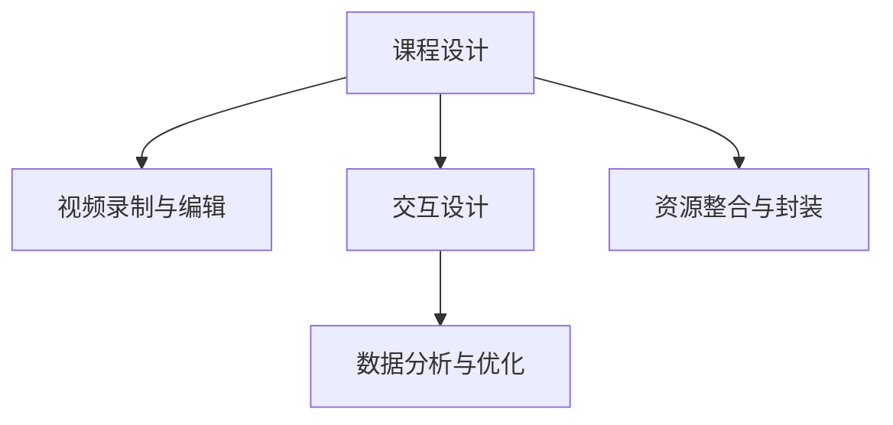

                 

## 1. 背景介绍

在数字化教育的浪潮中，在线视频课程已成为全球教育者推动知识传播的重要手段。面对不断扩大的受众基础和日益复杂的学习需求，打造高质量的在线视频课程变得愈发重要。通过系统的规划、精心的设计、先进的技术手段，程序员可以在线视频课程的开发上大有可为，为教育者提供全新的教学解决方案，同时为广大学习者带来更优质的学习体验。

### 1.1 问题由来
随着互联网技术的普及和教育产业的数字化转型，在线视频课程逐渐成为教育行业的核心要素。然而，高质量的在线视频课程并不好找，其关键在于如何结合教育学理论、心理学原理和技术工具，打造出兼具趣味性、系统性、互动性和个性化的学习内容。传统的视频教学往往依赖于教师的个人魅力，难以通过数据驱动的方式实现大规模定制化教学。

因此，如何利用编程技术打造出既符合教育学原理，又贴合技术发展的优质视频课程，成为了教育技术领域的一个重大挑战。本文将详细介绍基于编程技术打造高质量在线视频课程的核心要素、具体方法和实际应用场景。

## 2. 核心概念与联系

### 2.1 核心概念概述
构建高质量的在线视频课程，涉及多个核心概念和技术手段，以下将逐一介绍：

- **课程设计**：基于教学目标和用户需求，系统性地设计课程内容、结构和逻辑。
- **视频录制与编辑**：通过专业的录制和编辑工具，确保视频内容清晰、流畅、专业。
- **交互设计**：通过引入互动元素，提升学习者的参与感和学习效果。
- **数据分析与优化**：利用数据分析工具，追踪学习者的学习行为，及时优化课程内容。
- **资源整合与封装**：将课程内容进行结构化处理，便于后续扩展和集成。

### 2.2 核心概念原理和架构的 Mermaid 流程图


## 3. 核心算法原理 & 具体操作步骤

### 3.1 算法原理概述

构建高质量的在线视频课程，首先需要明确教育学原理和心理学原理，将其与编程技术有机结合，从而形成完整的课程框架和实现路径。

教育学原理告诉我们，课程设计应遵循系统的、结构化的思路，引导学习者循序渐进地掌握知识；心理学原理则强调学习者在获取知识时应保持高度的参与感和即时反馈，以提升学习效率。而编程技术的介入，可以高效地实现课程的个性化和适应性调整，确保学习体验的灵活性和可扩展性。

### 3.2 算法步骤详解

基于上述原理，我们设计了以下五个关键步骤，详细说明如何通过编程技术打造高质量的在线视频课程：

**Step 1: 需求分析和课程设计**
- 与课程开发者进行沟通，明确课程目标和用户需求。
- 根据目标和需求，设计课程大纲，包括各个模块、子模块及知识点。

**Step 2: 视频录制与编辑**
- 选择合适的视频录制和编辑软件（如Adobe Premiere Pro、Final Cut Pro等）。
- 进行专业的视频录制，包括声音、画面、字幕等元素。
- 利用视频编辑软件进行剪辑、特效添加、字幕同步等操作，确保视频内容的专业性和观看体验。

**Step 3: 交互设计**
- 引入互动元素，如问题测试、代码实现、实验操作等。
- 使用编程技术（如HTML、CSS、JavaScript等）实现互动功能。
- 通过数据分析工具，收集学习者反馈，不断优化互动设计。

**Step 4: 数据分析与优化**
- 部署分析工具（如Google Analytics、Hotjar等）追踪学习者的行为。
- 分析学习者的观看习惯、课程进度、互动反馈等数据。
- 基于分析结果，优化课程内容及互动设计。

**Step 5: 资源整合与封装**
- 将课程内容结构化处理，如使用Markdown或XML格式。
- 利用编程技术封装课程资源，确保课程的可扩展性和兼容性。
- 提供API接口，便于集成到其他学习平台和应用中。

### 3.3 算法优缺点

**优点**
- 编程技术使得课程内容高度灵活，可以根据学习者的反馈进行动态调整和优化。
- 可以实时追踪学习者行为，通过数据驱动的方式提升课程质量和用户体验。
- 利用编程技术，可以实现高效的视频录制和编辑，确保课程内容的专业性。
- 资源封装和API接口设计，使得课程易于扩展和集成，支持跨平台应用。

**缺点**
- 课程设计和开发需要较高的技术门槛，需要编程技能和教育学知识的结合。
- 课程的交互设计可能较为复杂，需要协调多种编程工具和技术。
- 数据分析和优化需要较为详细的学习者行为数据，数据获取和分析过程可能较为耗时。
- 资源整合和封装需要系统性的规划，可能涉及较大的工作量。

### 3.4 算法应用领域

基于编程技术打造的在线视频课程，适用于多种应用场景：

- **在线教育平台**：如Coursera、Udacity、edX等，通过编程实现课程的交互和分析功能。
- **企业培训**：公司内部培训课程，通过编程技术实现个性化学习路径和实时反馈。
- **职业认证**：编程技术支持的学习平台，提供交互式的编程实践和认证考试。
- **个性化学习**：通过数据分析和编程技术，定制化个性化的学习计划和资源。
- **跨平台应用**：编程技术实现的课程资源封装和API接口，方便课程集成到其他应用中。

## 4. 数学模型和公式 & 详细讲解 & 举例说明

### 4.1 数学模型构建

在线视频课程的优化目标，可以通过以下数学模型进行描述：

$$
\text{Optimize} \quad F(\mathbf{C},\mathbf{I},\mathbf{A},\mathbf{R},\mathbf{E})
$$

其中：
- $\mathbf{C}$ 代表课程内容，包括视频、文本、代码等。
- $\mathbf{I}$ 代表互动设计，如问题测试、编程实验等。
- $\mathbf{A}$ 代表数据分析，追踪学习者行为和反馈。
- $\mathbf{R}$ 代表资源封装，包括课程结构化和API设计。
- $\mathbf{E}$ 代表编程技术，确保所有功能模块的实现和集成。

### 4.2 公式推导过程

为了最大化在线视频课程的效果，我们可以构建以下优化目标函数：

$$
\begin{aligned}
&\text{Minimize} \quad L(\mathbf{C},\mathbf{I},\mathbf{A},\mathbf{R},\mathbf{E}) \\
&\text{subject to} \quad G_1(\mathbf{C},\mathbf{I},\mathbf{A},\mathbf{R},\mathbf{E}) \leq 0 \\
&\quad \quad G_2(\mathbf{C},\mathbf{I},\mathbf{A},\mathbf{R},\mathbf{E}) \leq 0
\end{aligned}
$$

其中，$L$ 为课程效果的度量函数，$G_1$ 和 $G_2$ 为约束条件函数。

### 4.3 案例分析与讲解

以Python编程入门课程为例，详细分析如何通过编程技术实现高质量的在线视频课程：

1. **课程设计**：
   - 目标：使学习者掌握Python编程基础。
   - 设计：包括变量、数据类型、控制流、函数、异常处理、面向对象编程等模块。

2. **视频录制与编辑**：
   - 录制：由经验丰富的讲师录制高质量的视频，讲解Python基础和实战应用。
   - 编辑：使用Adobe Premiere Pro进行剪辑，添加字幕、背景音乐和注释，确保视频内容清晰流畅。

3. **交互设计**：
   - 引入互动元素：在视频中加入代码实现环节，学习者可以通过实际操作掌握代码知识。
   - 编程实现：使用JavaScript编写交互界面，实现代码运行、错误提示、运行结果展示等功能。

4. **数据分析与优化**：
   - 部署Hotjar，追踪学习者的观看行为和互动反馈。
   - 分析结果：根据学习者停留时长、点击率、完成率等数据，优化课程内容和互动设计。

5. **资源整合与封装**：
   - 结构化处理：使用Markdown格式编写课程大纲和知识点。
   - 资源封装：将课程内容转换为API接口，方便集成到其他学习平台。

## 5. 项目实践：代码实例和详细解释说明

### 5.1 开发环境搭建

进行项目实践前，需要搭建良好的开发环境：

1. 安装Python 3.8及以上版本，使用Anaconda进行环境管理。
2. 安装必要的开发工具：如Git、Visual Studio Code、Adobe Premiere Pro等。
3. 安装数据分析工具：如Pandas、NumPy、Scikit-learn、Matplotlib等。
4. 安装编程技术栈：如Flask、Django、React、Vue等。

### 5.2 源代码详细实现

下面以Python编程入门课程为例，展示具体的代码实现过程：

1. **视频录制与编辑**：
   - 使用Adobe Premiere Pro录制高质量的视频内容。
   - 导出视频文件，如使用`ffmpeg`工具转换为MP4格式。

2. **交互设计**：
   - 编写HTML、CSS和JavaScript代码，实现代码运行、结果展示和错误提示功能。
   - 使用Flask框架实现后台服务，提供数据收集和分析功能。

3. **数据分析与优化**：
   - 部署Hotjar，收集学习者的行为数据。
   - 使用Pandas和NumPy进行数据分析，生成报告和优化建议。

4. **资源整合与封装**：
   - 将课程内容转换为Markdown格式，方便文档管理。
   - 封装课程API接口，使用Django框架实现。

### 5.3 代码解读与分析

- **视频录制与编辑**：
  - 代码实现示例：
  ```bash
  ffmpeg -i input.mp4 -c:v libx264 -crf 28 output.mp4
  ```
  - 功能解释：
    - `ffmpeg`：音频视频处理工具。
    - `-c:v libx264`：使用H.264编码。
    - `-crf 28`：设置编码质量。

- **交互设计**：
  - 代码实现示例：
  ```javascript
  document.addEventListener('DOMContentLoaded', () => {
    const codeEditor = ace.editor('codeEditor');
    codeEditor.setTheme('ace/theme/eclipse');
    codeEditor.getSession().setMode('ace/mode/python');
    codeEditor.on('change', function() {
      // 执行代码并展示结果
    });
  });
  ```
  - 功能解释：
    - `ace.editor`：ACE代码编辑器。
    - `setTheme`：设置编辑器主题。
    - `setMode`：设置代码模式。
    - `on('change')`：监听代码变化事件。

- **数据分析与优化**：
  - 代码实现示例：
  ```python
  import pandas as pd
  import matplotlib.pyplot as plt
  
  data = pd.read_csv('user_feedback.csv')
  plt.hist(data['time_spent'], bins=10)
  plt.xlabel('Time Spent')
  plt.ylabel('Frequency')
  plt.title('Time Spent Distribution')
  plt.show()
  ```
  - 功能解释：
    - `pandas`：数据处理库。
    - `matplotlib`：数据可视化库。
    - `hist`：绘制直方图。

- **资源整合与封装**：
  - 代码实现示例：
  ```python
  import flask
  app = flask.Flask(__name__)
  @app.route('/api/content/<filename>')
  def get_content(filename):
      with open('content/' + filename, 'r') as file:
          content = file.read()
      return content
  ```
  - 功能解释：
    - `flask`：Web框架。
    - `@app.route`：定义API接口。
    - `open`：读取文件内容。

### 5.4 运行结果展示

运行上述代码，可以展示以下效果：
- 高质量的视频内容。
- 交互式的编程实践环节。
- 实时数据分析和优化建议。
- 系统化的课程内容资源管理。

## 6. 实际应用场景

基于编程技术打造的在线视频课程，已在多个实际应用场景中取得了显著成果：

- **企业培训**：公司内部使用Python基础课程，提升员工编程技能，提高工作效率。
- **在线教育平台**：Coursera使用编程技术实现Python入门课程的互动和优化，提升学习者体验。
- **职业认证**：Codecademy通过编程技术实现编程实践和认证考试，帮助学习者获取专业认证。
- **个性化学习**：Udacity使用数据分析和编程技术，提供个性化学习路径，满足不同学习者的需求。

## 7. 工具和资源推荐

### 7.1 学习资源推荐

为了帮助开发者系统掌握编程技术在课程开发中的应用，以下是一些推荐的学习资源：

1. **Python编程基础**：
   - 《Python编程：从入门到实践》：由Eric Matthes撰写，适合初学者入门。
   - Codecademy的Python课程：通过互动练习提升编程技能。

2. **视频录制与编辑**：
   - Adobe Premiere Pro官方文档：详细教程和操作指南。
   - YouTube的Adobe Premiere Pro教程频道：丰富的视频资源。

3. **交互设计**：
   - React官方文档：前端框架的详细使用指南。
   - Vue官方文档：另一个流行前端框架的使用指南。

4. **数据分析与优化**：
   - Python数据分析基础：由Jake VanderPlas撰写，介绍Pandas和NumPy的使用。
   - Hotjar官方文档：数据分析工具的详细操作指南。

5. **编程技术栈**：
   - Flask官方文档：Web框架的详细使用指南。
   - Django官方文档：另一个流行的Web框架的使用指南。

### 7.2 开发工具推荐

选择合适的开发工具是项目成功的关键，以下是一些推荐的工具：

1. **视频录制与编辑**：
   - Adobe Premiere Pro：功能强大的视频编辑工具。
   - Final Cut Pro：Mac平台的视频编辑工具。

2. **交互设计**：
   - React：流行的前端框架，支持构建动态和交互式的用户界面。
   - Vue：另一个流行的前端框架，具有类似的特性。

3. **数据分析与优化**：
   - Google Analytics：网站分析工具，追踪用户行为。
   - Hotjar：网站热图分析工具，收集用户互动数据。

4. **编程技术栈**：
   - Flask：轻量级的Web框架，易于学习和使用。
   - Django：功能强大的Web框架，适合大型应用开发。

### 7.3 相关论文推荐

为了深入理解编程技术在在线视频课程中的应用，以下是一些推荐的论文：

1. **编程教育研究**：
   - "The Impact of Programming Education on Problem-Solving Abilities" by Chris Brooks：探讨编程教育对解决问题的积极影响。
   - "Programming by Doing: Impacts of Programming Education on Students' Conceptual Understanding of Programming" by Shelley Cormack和Kathleen Tschann：研究编程教学方法对学生理解编程概念的影响。

2. **在线课程设计**：
   - "Designing Effective Online Courses: Best Practices for K-12 Virtual Learning" by Catherine Brabham和Lynne Slavin：探讨在线课程设计原则和最佳实践。
   - "Designing Effective Online Courses" by Randy Weyand：提供在线课程设计的实用指南。

3. **编程技术应用**：
   - "Programming by Example: Learning to Program through Practice and Problem-Solving" by Steven G. Krantz：通过实例编程提升学习者技能。
   - "The Role of Programming Education in Developing Students' Computational Thinking Skills" by Andreas Reinhart和Helmut Wagner：研究编程教育对计算思维的影响。

## 8. 总结：未来发展趋势与挑战

### 8.1 研究成果总结

通过编程技术打造的在线视频课程，已取得显著成效，帮助学习者高效掌握编程技能，推动了教育行业的数字化转型。然而，面对技术发展和社会需求，仍有许多挑战需要克服：

1. **技术门槛**：课程开发需要跨领域的知识和技能，这对许多教育者构成了挑战。
2. **互动设计**：复杂的互动设计需要专业的技术和深入的理解。
3. **数据分析**：准确的数据分析需要高效的工具和方法。
4. **资源整合**：系统性的资源管理需要细致的规划。

### 8.2 未来发展趋势

未来，编程技术在在线视频课程中的应用将更加广泛和深入：

1. **智能化教学**：通过AI技术实现个性化学习路径和即时反馈。
2. **混合学习模式**：结合线上线下教学，提升学习效果。
3. **跨平台应用**：实现多终端、多设备的无缝学习和互动。
4. **实时协作**：支持多人实时协作学习，提高学习效率。
5. **虚拟现实**：利用VR技术创建沉浸式学习环境，提升学习体验。

### 8.3 面临的挑战

尽管编程技术在在线视频课程中已取得一定成果，但仍面临以下挑战：

1. **技术复杂性**：编程技术的应用需要较高的技术门槛，难以大规模普及。
2. **交互设计复杂**：复杂的交互设计需要专业的技术和深入的理解。
3. **数据隐私**：收集和分析学习者数据需要严格的数据隐私保护。
4. **资源管理**：系统性的资源管理需要细致的规划和维护。

### 8.4 研究展望

为了克服上述挑战，未来的研究需要在以下方向进行突破：

1. **简化技术门槛**：开发易于上手的使用工具和模板，降低编程技术的使用门槛。
2. **优化交互设计**：研究和推广交互设计的最佳实践，提高课程的参与度。
3. **数据隐私保护**：研究数据隐私保护技术，确保学习者的数据安全。
4. **资源管理优化**：开发高效的系统化资源管理工具，提升课程开发效率。

## 9. 附录：常见问题与解答

### Q1: 如何选择合适的编程语言和技术栈？

A: 根据课程内容和目标受众，选择合适的编程语言和技术栈。Python、JavaScript等都是流行的编程语言，适用于各类应用场景。

### Q2: 如何高效进行视频录制和编辑？

A: 使用专业的视频录制和编辑工具，如Adobe Premiere Pro、Final Cut Pro等。录制前进行充分的准备和规划，确保视频内容清晰流畅。

### Q3: 如何进行有效的互动设计？

A: 引入互动元素，如问题测试、代码实现、实验操作等。使用编程技术（如HTML、CSS、JavaScript等）实现互动功能。收集学习者反馈，不断优化互动设计。

### Q4: 如何实现数据分析和优化？

A: 部署数据分析工具，如Google Analytics、Hotjar等，收集学习者的行为数据。使用数据分析工具（如Pandas、NumPy等）进行分析，生成报告和优化建议。

### Q5: 如何进行资源整合与封装？

A: 将课程内容结构化处理，如使用Markdown或XML格式。利用编程技术封装课程资源，确保课程的可扩展性和兼容性。提供API接口，便于集成到其他学习平台和应用中。

通过以上详细介绍，希望能帮助程序员更好地理解如何利用编程技术打造高质量的在线视频课程。掌握这些关键技术，不仅可以提升学习者的学习体验，还能推动教育技术的创新和发展。

---

作者：禅与计算机程序设计艺术 / Zen and the Art of Computer Programming

