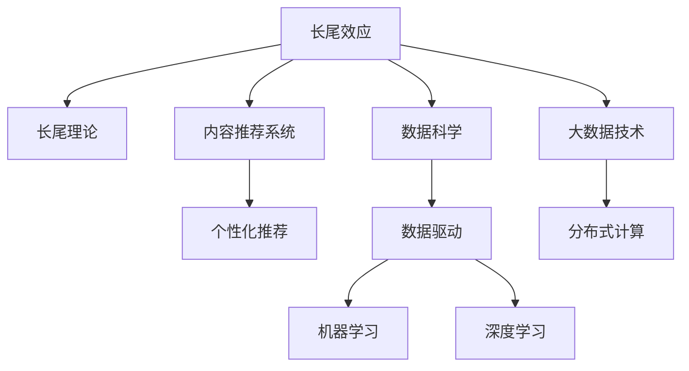

                 

# 程序员如何构建知识付费的长尾效应

> 关键词：知识付费,长尾效应,长尾理论,自然语言处理(NLP),内容推荐系统,数据科学,大数据技术

## 1. 背景介绍

### 1.1 问题由来
随着互联网技术的发展，知识付费市场正快速崛起。但在此背景下，内容同质化、推荐算法的局限性等问题逐渐显现，用户获取知识的成本和效率并未得到根本改善。为应对这些问题，程序员需要构建新的知识付费平台，提升内容质量，个性化推荐，创造更多长尾效应，以满足用户日益增长的知识需求。

### 1.2 问题核心关键点
长尾效应指的是在销售中非畅销品的总销售额大于畅销品的总销售额。在知识付费领域，长尾效应意味着大量细分领域的优质内容能够吸引小众用户，最终为平台带来可观的收益。因此，构建知识付费的长尾效应，需要深入理解长尾理论，构建高效推荐系统，并采用数据科学和大数据技术，打造个性化体验，提升内容覆盖率。

## 2. 核心概念与联系

### 2.1 核心概念概述

为更好地理解构建知识付费长尾效应的方法，本节将介绍几个密切相关的核心概念：

- **长尾效应(Tail Effect)**：指销量分布呈长尾的销售模式，其中少数热门商品带来的收入无法与大量非热门商品相比。在知识付费领域，长尾效应体现在大量细分领域的优质内容能够吸引小众用户。
- **长尾理论(Tail Theory)**：由克里斯·安德森提出，主要观点是许多小众需求的总和可能超过热门需求，通过高效的渠道和供应链管理，可以将这些小众需求转化为可观收益。
- **内容推荐系统(Content Recommendation System)**：通过用户行为数据，推荐系统能够预测用户兴趣，提供个性化内容。
- **数据科学(Data Science)**：一门以数据驱动决策的科学，涵盖统计学、机器学习、数据可视化等技术。
- **大数据技术(Big Data Technology)**：指处理大规模数据集的技术和工具，包括分布式计算、存储、分析和可视化等。

这些核心概念之间的逻辑关系可以通过以下Mermaid流程图来展示：



这个流程图展示了几组核心概念之间的联系：

1. 长尾效应是长尾理论的实际应用，反映了内容推荐系统的效果。
2. 内容推荐系统基于数据科学，通过深度学习和大数据技术，实现个性化推荐。
3. 数据科学和大数据技术提供了算法优化的数据基础。

这些概念共同构成了知识付费长尾效应的基础，并为其成功构建提供了方法论。

## 3. 核心算法原理 & 具体操作步骤
### 3.1 算法原理概述

构建知识付费长尾效应的核心在于设计高效的内容推荐系统，提升长尾内容的质量和可见度，从而吸引小众用户，创造可观收益。具体而言，通过数据科学和大数据技术，实现以下几个关键目标：

1. **内容质量提升**：通过深度学习技术，对海量文本内容进行预训练，提取语义特征，提升内容质量。
2. **个性化推荐**：构建协同过滤、内容过滤、混合推荐等模型，通过用户行为数据预测用户兴趣，提供个性化内容。
3. **长尾内容挖掘**：使用数据挖掘和机器学习技术，发现和推荐高性价比的长尾内容。
4. **用户反馈收集**：通过用户评价、点击率等反馈数据，优化推荐模型，提升长尾内容曝光率。

### 3.2 算法步骤详解

基于上述目标，构建知识付费长尾效应的一般流程包括：

**Step 1: 数据收集与预处理**
- 收集用户行为数据，包括浏览记录、搜索关键词、评价、购买记录等。
- 对文本数据进行清洗、分词、向量化等预处理，便于后续分析。

**Step 2: 用户画像构建**
- 使用聚类、降维等技术，构建用户画像，识别不同用户群体的兴趣和需求。
- 分析用户画像，设计符合不同用户群体的个性化推荐策略。

**Step 3: 内容特征提取**
- 使用预训练模型如BERT、GPT等，对文本内容进行预训练，提取语义特征。
- 通过TF-IDF、word2vec等技术，进行文本向量化，便于推荐模型使用。

**Step 4: 推荐模型训练**
- 构建协同过滤、内容过滤等推荐模型，训练个性化推荐算法。
- 使用交叉验证、网格搜索等技术，优化模型参数，提升推荐效果。

**Step 5: 长尾内容挖掘**
- 使用关联规则挖掘、序列模式挖掘等技术，发现潜在的、高性价比的长尾内容。
- 结合用户画像和推荐模型，将这些长尾内容纳入推荐体系，增加用户曝光机会。

**Step 6: 用户反馈收集与模型优化**
- 收集用户对推荐内容、购买行为的反馈数据，定期更新推荐模型。
- 引入对抗样本、对抗训练等技术，提升推荐模型的鲁棒性。

### 3.3 算法优缺点

构建知识付费长尾效应的算法具有以下优点：
1. **提升内容质量**：通过预训练模型提取语义特征，提高内容质量，吸引更多用户。
2. **个性化推荐**：精准识别用户兴趣，提升用户满意度和黏性。
3. **发现长尾内容**：挖掘和推荐高性价比的长尾内容，提高平台收益。
4. **用户反馈驱动**：根据用户反馈优化推荐模型，实现持续改进。

同时，该算法也存在一些局限性：
1. **数据依赖**：需要大量的用户行为数据，数据的获取和处理成本较高。
2. **算法复杂**：需要设计多个推荐模型，优化复杂度较高。
3. **过拟合风险**：模型复杂度增加，可能导致过拟合，影响泛化能力。
4. **用户隐私**：处理用户行为数据，需要关注隐私保护和合规问题。

尽管存在这些局限性，但构建知识付费长尾效应仍然是一种高效的方法，能够为平台带来可观的收益，提高用户满意度。

### 3.4 算法应用领域

基于长尾效应的推荐算法，在知识付费平台的应用领域非常广泛，包括但不限于：

- **内容推荐系统**：为用户提供个性化的内容推荐，提升用户体验。
- **课程推荐**：推荐适合用户兴趣的在线课程，提高学习效果。
- **图书推荐**：推荐符合用户口味的图书，促进阅读习惯。
- **文章推荐**：推荐高质量的文章，提升用户满意度。
- **技术分享**：推荐开发者感兴趣的技术文章和博客，促进技术交流。
- **书籍笔记**：推荐用户标记的书籍笔记，共享知识。

除了上述这些核心应用外，长尾效应推荐算法还可以拓展到更多场景，如资源共享、知识图谱构建等，为知识付费平台的可持续发展提供新动力。

## 4. 数学模型和公式 & 详细讲解 & 举例说明
### 4.1 数学模型构建

构建知识付费长尾效应的推荐算法，可以通过协同过滤、内容过滤、混合推荐等多种模型来实现。本节以协同过滤为例，构建一个简单的推荐模型，并解释其中的关键数学公式。

设用户集合为 $U$，物品集合为 $I$，用户-物品评分矩阵为 $R$，其中 $R_{ui}$ 表示用户 $u$ 对物品 $i$ 的评分。推荐系统的目标是最小化预测评分与真实评分之间的差距，即：

$$
\min_{\theta} \sum_{u,i} (R_{ui} - \hat{R}_{ui})^2
$$

其中 $\theta$ 为推荐模型参数，$\hat{R}_{ui}$ 为模型预测的评分。

### 4.2 公式推导过程

基于上述目标，常见的协同过滤算法包括基于用户的协同过滤和基于物品的协同过滤。这里以基于用户的协同过滤为例，推导相关公式。

设用户 $u$ 的物品评分向量为 $\mathbf{r}_u$，用户 $u$ 与其他用户的相似度向量为 $\mathbf{s}_u$，则基于用户的协同过滤算法如下：

$$
\hat{R}_{ui} = \sum_{j \in N(u)} \frac{R_{uj}}{\|\mathbf{r}_u\| \|\mathbf{r}_j\|} \cdot R_{ji}
$$

其中 $N(u)$ 表示用户 $u$ 的邻居集合，$\|\mathbf{r}_u\|$ 和 $\|\mathbf{r}_j\|$ 分别是用户 $u$ 和用户 $j$ 的评分向量范数。

### 4.3 案例分析与讲解

假设我们有一个知识付费平台，平台收集了用户对不同课程的评分数据。我们希望根据用户的历史评分数据，推荐用户可能感兴趣的课程。

通过协同过滤算法，我们首先计算用户 $u$ 与其他用户的相似度 $\mathbf{s}_u$，然后计算用户 $u$ 对课程 $i$ 的预测评分 $\hat{R}_{ui}$。具体步骤如下：

1. 计算用户 $u$ 的评分向量 $\mathbf{r}_u$。
2. 计算用户 $u$ 的相似度向量 $\mathbf{s}_u$。
3. 计算用户 $u$ 对课程 $i$ 的预测评分 $\hat{R}_{ui}$。
4. 将预测评分 $\hat{R}_{ui}$ 作为排序依据，推荐用户可能感兴趣的课程。

实际应用中，数据获取、模型训练、推荐效果评估等环节需要不断迭代优化，以提高推荐模型的准确度和用户满意度。

## 5. 项目实践：代码实例和详细解释说明
### 5.1 开发环境搭建

在进行知识付费长尾效应推荐系统的开发前，需要准备好开发环境。以下是使用Python进行Scikit-learn开发的环境配置流程：

1. 安装Anaconda：从官网下载并安装Anaconda，用于创建独立的Python环境。

2. 创建并激活虚拟环境：
```bash
conda create -n recommendation-env python=3.8 
conda activate recommendation-env
```

3. 安装Scikit-learn：
```bash
conda install scikit-learn
```

4. 安装相关工具包：
```bash
pip install pandas numpy scipy matplotlib seaborn
```

5. 安装TensorFlow：
```bash
pip install tensorflow
```

完成上述步骤后，即可在`recommendation-env`环境中开始项目开发。

### 5.2 源代码详细实现

接下来，我们将使用Scikit-learn实现一个基于用户的协同过滤推荐系统。

首先，定义推荐函数：

```python
from sklearn.metrics.pairwise import cosine_similarity
from sklearn.neighbors import NearestNeighbors

def collaborative_filtering(X, k=5, similarity='cosine'):
    X = cosine_similarity(X)
    knn = NearestNeighbors(n_neighbors=k, metric='seuclidean')
    knn.fit(X)
    similarities = knn.kneighbors(X)
    return similarities
```

然后，加载并预处理数据集：

```python
import pandas as pd

# 加载评分数据集
ratings = pd.read_csv('ratings.csv')

# 将评分数据转换为用户-物品评分矩阵
X = ratings.pivot(index='user_id', columns='item_id', values='rating').values

# 计算用户间的相似度矩阵
similarities = collaborative_filtering(X)
```

最后，生成推荐结果并保存：

```python
from scipy.sparse import diags
from scipy.sparse.linalg import svds

# 生成推荐矩阵
U, S, Vt = svds(X, k=5)
X_hat = np.dot(U, np.dot(np.diag(S), Vt))

# 计算预测评分
predictions = similarities * X_hat

# 保存推荐结果
np.savetxt('predictions.txt', predictions, delimiter=',')
```

以上就是使用Scikit-learn构建基于用户协同过滤推荐系统的完整代码实现。可以看到，利用Scikit-learn的现成函数和工具，开发推荐系统变得非常简单高效。

### 5.3 代码解读与分析

让我们再详细解读一下关键代码的实现细节：

**collaborative_filtering函数**：
- `cosine_similarity`函数计算用户间的余弦相似度，生成用户间的相似度矩阵。
- `NearestNeighbors`类实现基于欧式距离的最近邻算法，用于找到用户 $u$ 的 $k$ 个邻居。
- 返回的`similarities`数组表示用户 $u$ 对物品 $i$ 的相似度。

**加载和预处理数据**：
- `pd.read_csv`函数用于加载评分数据集。
- `pivot`函数将评分数据转换为用户-物品评分矩阵。
- `cosine_similarity`函数用于计算用户间的余弦相似度，生成用户间的相似度矩阵。

**生成推荐矩阵**：
- `svds`函数用于奇异值分解，得到推荐矩阵的奇异值和特征向量。
- `U`和`Vt`分别为用户和物品的特征向量，`S`为奇异值。
- 通过奇异值分解，生成推荐矩阵 `X_hat`。

**计算预测评分**：
- 将相似度矩阵 `similarities` 与推荐矩阵 `X_hat` 相乘，生成预测评分 `predictions`。
- 预测评分越高，用户对物品的兴趣越大。

**保存推荐结果**：
- `np.savetxt`函数将推荐结果保存为文本文件，便于后续分析和评估。

可以看到，Scikit-learn提供的函数和工具，使得构建推荐系统的代码实现变得简洁高效。开发者可以将更多精力放在模型优化和效果评估上，而不必过多关注底层的实现细节。

当然，实际系统中还需要考虑更多因素，如模型的评估指标、数据的时效性、用户的隐私保护等。但核心的协同过滤推荐算法基本与此类似。

## 6. 实际应用场景
### 6.1 智能客服系统

基于协同过滤推荐算法的智能客服系统，可以为用户提供个性化的客服对话推荐。传统客服往往依赖人工客服，高峰期响应缓慢，且客服质量难以保证。而使用推荐算法，可以7x24小时不间断服务，快速响应客户咨询，提高客户满意度。

在技术实现上，可以收集企业内部的客服对话记录，将问题和最佳答复构建成监督数据，在此基础上对协同过滤模型进行微调。微调后的模型能够自动理解用户意图，匹配最合适的答复模板进行回复。对于客户提出的新问题，还可以接入检索系统实时搜索相关内容，动态组织生成回答。如此构建的智能客服系统，能大幅提升客户咨询体验和问题解决效率。

### 6.2 在线课程推荐

基于协同过滤推荐算法的在线课程推荐系统，可以为用户推荐符合其兴趣和需求的课程。平台通过收集用户的历史学习记录和评分数据，构建用户画像，识别不同用户群体的兴趣和需求。然后，通过协同过滤算法，为用户推荐感兴趣的课程，提升学习效果。

在实际应用中，推荐算法需要不断迭代优化，根据用户反馈和课程评分，动态调整推荐策略，提升推荐效果。同时，为了应对课程内容更新和用户兴趣变化，平台需要定期重新训练推荐模型，保持推荐效果的时效性。

### 6.3 图书推荐

基于协同过滤推荐算法的图书推荐系统，可以为用户推荐符合其兴趣的图书。平台通过收集用户的历史阅读记录和评分数据，构建用户画像，识别不同用户群体的阅读偏好。然后，通过协同过滤算法，为用户推荐感兴趣的图书，提高用户阅读满意度。

在实际应用中，推荐算法需要考虑图书的出版时间、作者、类别等因素，进行多维度的推荐，提升推荐效果。同时，为了应对用户的阅读习惯和兴趣变化，平台需要定期重新训练推荐模型，保持推荐效果的时效性。

### 6.4 技术分享推荐

基于协同过滤推荐算法的技术分享推荐系统，可以为用户推荐感兴趣的技术文章和博客。平台通过收集用户的历史阅读记录和评分数据，构建用户画像，识别不同用户群体的技术兴趣。然后，通过协同过滤算法，为用户推荐感兴趣的技术文章，促进技术交流和知识共享。

在实际应用中，推荐算法需要不断迭代优化，根据用户反馈和文章评分，动态调整推荐策略，提升推荐效果。同时，为了应对技术文章的更新和用户兴趣变化，平台需要定期重新训练推荐模型，保持推荐效果的时效性。

### 6.5 书籍笔记推荐

基于协同过滤推荐算法的书籍笔记推荐系统，可以为用户推荐感兴趣的书籍笔记。平台通过收集用户标记的书籍笔记，构建用户画像，识别不同用户群体的阅读偏好。然后，通过协同过滤算法，为用户推荐感兴趣的书籍笔记，共享知识，促进学习。

在实际应用中，推荐算法需要考虑书籍笔记的内容质量、更新频率等因素，进行多维度的推荐，提升推荐效果。同时，为了应对用户的阅读习惯和兴趣变化，平台需要定期重新训练推荐模型，保持推荐效果的时效性。

## 7. 工具和资源推荐
### 7.1 学习资源推荐

为了帮助开发者系统掌握知识付费推荐算法的理论基础和实践技巧，这里推荐一些优质的学习资源：

1. **推荐系统设计与实践**系列书籍：详细介绍了推荐系统的基本概念、算法设计和工程实现，适合初学者和进阶者阅读。
2. **《推荐系统实战》**：通过实际案例，介绍了推荐系统的构建和优化方法，适合实战开发者。
3. **《深度学习入门与推荐系统》**：讲解了深度学习在推荐系统中的应用，适合对深度学习感兴趣的开发者。
4. **Coursera《Recommender Systems》课程**：由斯坦福大学教授讲授，系统讲解了推荐系统的理论和实践，适合在线学习。
5. **Kaggle推荐系统竞赛**：通过实际竞赛，锻炼推荐算法的实战能力，适合有数据分析和算法优化经验的用户。

通过这些资源的学习实践，相信你一定能够快速掌握知识付费推荐算法的精髓，并用于解决实际的推荐问题。

### 7.2 开发工具推荐

高效的开发离不开优秀的工具支持。以下是几款用于知识付费推荐系统开发的常用工具：

1. **Python**：推荐系统常用的编程语言，具有丰富的库和工具，支持高效的数据处理和算法实现。
2. **Scikit-learn**：基于Python的机器学习库，提供了多种推荐算法和模型，适合快速原型开发。
3. **TensorFlow**：Google开源的深度学习框架，支持分布式训练和大规模数据处理，适合复杂推荐算法的实现。
4. **Hadoop/Spark**：大数据处理和分布式计算框架，支持大规模数据集的处理和分析，适合推荐算法的优化和部署。
5. **MySQL/PostgreSQL**：常用关系型数据库，适合存储和管理推荐系统中的数据。

合理利用这些工具，可以显著提升知识付费推荐系统的开发效率，加快创新迭代的步伐。

### 7.3 相关论文推荐

知识付费推荐算法的发展源于学界的持续研究。以下是几篇奠基性的相关论文，推荐阅读：

1. **《A Survey of Recommender Systems》**：介绍了推荐系统的基本概念和算法，适合初学者了解。
2. **《Neural Collaborative Filtering》**：介绍了深度学习在推荐系统中的应用，适合对深度学习感兴趣的开发者。
3. **《Personalized Top-N Recommendation via Generalized Linear Models》**：讲解了基于线性模型的推荐算法，适合实际应用开发者。
4. **《Adaptive Recommender Systems》**：讲解了自适应推荐算法的设计和实现，适合对推荐算法优化感兴趣的开发者。
5. **《Semi-Supervised Learning for Recommender Systems》**：介绍了半监督学习在推荐系统中的应用，适合对推荐算法优化感兴趣的开发者。

这些论文代表了大规模推荐系统的研究前沿，通过学习这些前沿成果，可以帮助研究者把握学科前进方向，激发更多的创新灵感。

## 8. 总结：未来发展趋势与挑战

### 8.1 总结

本文对构建知识付费长尾效应的推荐算法进行了全面系统的介绍。首先阐述了推荐算法在知识付费平台中的应用背景和核心关键点，明确了长尾理论在推荐系统中的实际应用。其次，从原理到实践，详细讲解了协同过滤推荐算法的数学原理和关键步骤，给出了推荐系统开发的完整代码实例。同时，本文还广泛探讨了推荐算法在智能客服、在线课程、图书推荐等诸多领域的应用前景，展示了推荐算法的巨大潜力。此外，本文精选了推荐算法的各类学习资源，力求为读者提供全方位的技术指引。

通过本文的系统梳理，可以看到，基于协同过滤推荐算法的知识付费平台，能够通过数据科学和大数据技术，构建高效个性化推荐系统，提升平台收益和用户满意度。未来，伴随推荐算法的不断演进，基于长尾效应的知识付费平台必将在更多领域带来变革性影响。

### 8.2 未来发展趋势

展望未来，知识付费推荐算法将呈现以下几个发展趋势：

1. **深度学习应用**：随着深度学习技术的发展，推荐算法将更多地引入神经网络模型，提升推荐效果。
2. **跨领域推荐**：未来的推荐系统将不仅仅局限于单一领域，而是将不同领域的内容进行跨领域推荐，提升用户的多样化体验。
3. **用户画像细分**：通过更精细的用户画像，推荐算法将能够更好地识别不同用户群体的需求，提供更精准的推荐。
4. **个性化推荐系统**：未来的推荐系统将更加注重个性化推荐，根据用户的行为数据、兴趣爱好等信息，提供更符合用户需求的推荐内容。
5. **实时推荐系统**：未来的推荐系统将更加注重实时性，能够根据用户的即时行为和反馈，动态调整推荐内容。
6. **多模态推荐**：未来的推荐系统将更多地引入多模态数据，如图片、视频、语音等，提升推荐内容的多样性和吸引力。

这些趋势将进一步提升知识付费推荐系统的性能和用户体验，为用户带来更加个性化和高效的知识获取方式。

### 8.3 面临的挑战

尽管知识付费推荐算法已经取得了显著成果，但在迈向更加智能化、普适化应用的过程中，仍面临诸多挑战：

1. **数据获取难度**：推荐系统需要大量的用户行为数据，数据的获取和处理成本较高，存在隐私保护和数据合规问题。
2. **模型复杂度**：推荐算法的复杂度较高，需要优化算法效率，避免过拟合和计算资源浪费。
3. **推荐鲁棒性**：推荐系统在面对恶意攻击和数据噪音时，容易出现误推荐，需要提高模型的鲁棒性。
4. **推荐多样性**：推荐算法容易陷入局部最优解，导致推荐内容过于集中，需要引入多样性约束。
5. **算法公平性**：推荐算法容易出现偏差，导致部分用户被忽视，需要确保算法的公平性和公正性。
6. **用户隐私保护**：推荐系统需要收集和处理大量用户数据，涉及隐私保护和合规问题，需要加强数据保护措施。

这些挑战需要在未来的研究中不断解决，以实现推荐系统的全面升级和应用。

### 8.4 研究展望

面对知识付费推荐系统所面临的种种挑战，未来的研究需要在以下几个方面寻求新的突破：

1. **大数据技术优化**：优化数据存储和处理技术，提高推荐算法的计算效率和实时性。
2. **跨领域知识融合**：将不同领域的内容进行融合，提升推荐内容的多样性和吸引力。
3. **多模态数据融合**：将文本、图片、视频、语音等多模态数据进行融合，提升推荐算法的综合能力。
4. **用户行为建模**：通过更复杂的用户行为建模，提升推荐算法的个性化和多样化。
5. **推荐算法优化**：引入先进的推荐算法，如基于深度学习的推荐算法，提升推荐效果和系统性能。
6. **算法公平性研究**：研究和解决推荐算法中的偏差问题，确保算法的公平性和公正性。

这些研究方向的探索，必将引领知识付费推荐算法迈向更高的台阶，为推荐系统的可持续发展提供新动力。面向未来，知识付费推荐算法还需要与其他人工智能技术进行更深入的融合，如知识表示、因果推理、强化学习等，多路径协同发力，共同推动知识付费平台的进步。只有勇于创新、敢于突破，才能不断拓展推荐算法的边界，让知识付费平台更好地造福用户。

## 9. 附录：常见问题与解答

**Q1：知识付费推荐算法是否适用于所有NLP任务？**

A: 知识付费推荐算法在文本推荐任务中具有较大优势，但并不适用于所有NLP任务。对于图像、视频、音频等非文本数据，推荐算法需要根据不同数据类型进行优化和调整。

**Q2：推荐算法如何处理长尾效应？**

A: 推荐算法通过协同过滤、内容过滤、混合推荐等模型，识别出用户感兴趣的长尾内容，并将其纳入推荐体系中。具体来说，算法通过构建用户画像，识别不同用户群体的兴趣和需求，然后将长尾内容与热门内容进行综合推荐，提升用户满意度。

**Q3：推荐算法如何优化模型参数？**

A: 推荐算法通过交叉验证、网格搜索、贝叶斯优化等方法，优化模型参数。具体来说，算法通过将数据集划分为训练集和验证集，反复训练和验证，找到最优的模型参数。同时，算法可以通过不断迭代优化，保持推荐效果的时效性。

**Q4：推荐算法如何应对恶意攻击和数据噪音？**

A: 推荐算法通过引入对抗训练、异常检测等技术，提高模型的鲁棒性。具体来说，算法通过引入对抗样本，增强模型的泛化能力，避免恶意攻击和数据噪音对推荐效果的影响。同时，算法可以通过异常检测技术，识别并过滤掉异常数据，提高推荐系统的稳定性。

**Q5：推荐算法如何处理用户隐私问题？**

A: 推荐算法在数据处理和推荐过程中，需要遵守用户隐私保护和数据合规要求。具体来说，算法需要对用户数据进行匿名化处理，确保用户隐私不被泄露。同时，算法需要遵循数据合规标准，如GDPR等，确保用户数据的安全和合规使用。

通过这些回答，相信你能够更全面地理解知识付费推荐算法的原理、应用和挑战，从而更好地应用于实际开发和研究中。希望本文能够为你提供有益的参考，助你构建高效、智能的知识付费平台，为用户带来更加优质和个性化的知识体验。

---

作者：禅与计算机程序设计艺术 / Zen and the Art of Computer Programming

