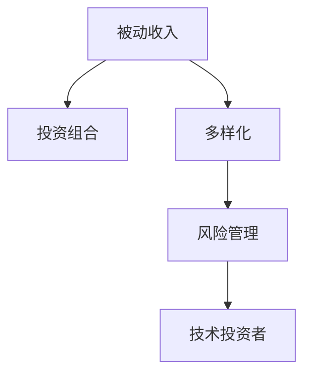

                 

# 程序员如何构建被动收入投资组合

> 关键词：被动收入, 投资组合, 多样化, 风险管理, 技术投资者

## 1. 背景介绍

在程序员和技术人员这一群体中，许多人拥有着超强的编程能力和数据分析能力，这些技能可以转化成为一种宝贵的财富——被动收入。然而，由于缺乏系统化的投资知识，很多技术人员在追求被动收入的过程中，往往盲目跟风，未能找到适合自己的投资方法。本文旨在为技术人员提供一套科学、系统的投资组合构建策略，帮助他们实现持续、稳定的被动收入。

### 1.1 问题由来

随着科技的迅猛发展，互联网创业、区块链、人工智能等新兴领域迎来了前所未有的发展机遇。同时，技术行业也孕育了大量机会，程序员和技术人员可以通过投资获取额外的收入。然而，被动收入的实现并非易事，其难点在于：

1. **知识盲区**：很多技术人员对金融市场和投资策略缺乏了解，不知道哪些投资渠道适合，哪些风险太大。
2. **缺乏规划**：很多人投资时缺乏长期规划，追求短期高收益，导致风险暴露过高，收益不稳定。
3. **资源限制**：很多技术人员由于时间、精力限制，无法亲自管理投资组合，需要借助外力来提升管理效率。

这些问题需要通过科学的方法和工具来解决，以帮助技术人员构建一个既稳定又能带来持续收益的投资组合。

### 1.2 问题核心关键点

构建被动收入投资组合的核心在于：

1. **分散风险**：通过分散投资降低整体风险。
2. **长期规划**：制定长期的投资目标，避免短期投机行为。
3. **技术优势**：利用技术手段提高投资效率和管理能力。
4. **收益稳定性**：追求稳定的收益流，而不是高波动性的投机收益。

## 2. 核心概念与联系

### 2.1 核心概念概述

构建被动收入投资组合涉及多个核心概念：

1. **被动收入(Passive Income)**：指通过投资产生的、无需主动管理的收入，如股息、租金、利息等。
2. **投资组合(Portfolio)**：将资金分散投资于不同的资产，以降低整体风险，同时实现收益的最大化。
3. **多样化(Diversification)**：通过投资不同类型的资产，分散单一资产的风险。
4. **风险管理(Risk Management)**：通过合理配置资产，降低投资组合的整体风险。
5. **技术投资者(Technology Investor)**：利用技术手段（如编程、数据分析等）提高投资效率和管理能力。

这些概念之间的逻辑关系可以通过以下Mermaid流程图来展示：



这个流程图展示了被动收入、投资组合、多样化、风险管理和技术投资者之间的联系：

- 被动收入是投资组合的最终目标。
- 投资组合需要通过多样化来降低风险。
- 多样化需要通过风险管理来优化配置。
- 技术投资者通过技术手段来提升管理效率。

## 3. 核心算法原理 & 具体操作步骤
### 3.1 算法原理概述

构建被动收入投资组合的原理是基于风险分散和长期规划的投资组合构建理论。其核心在于：

1. **分散投资**：通过投资不同类型的资产，降低整体风险。
2. **长期视角**：关注长期收益，避免短期投机行为。
3. **技术工具**：利用技术手段提高投资组合的管理效率。

具体而言，构建投资组合的步骤如下：

1. **确定投资目标**：明确投资的主要目标，如退休金、教育基金等。
2. **风险偏好评估**：评估自身的风险承受能力，确定适合的资产配置策略。
3. **资产选择与配置**：选择不同类型的资产（如股票、债券、房地产等），并根据风险偏好进行配置。
4. **动态调整**：定期监测投资组合的表现，根据市场变化调整资产配置。

### 3.2 算法步骤详解

以下是构建被动收入投资组合的具体操作步骤：

**Step 1: 确定投资目标**

1. **设定目标**：明确投资的主要目标，如退休金、教育基金等。
2. **确定时间**：设定投资目标的实现时间，如10年、20年等。
3. **确定收益**：根据目标设定期望的年化收益率。

**Step 2: 风险偏好评估**

1. **问卷评估**：使用风险评估问卷，评估个人的风险承受能力。
2. **历史数据分析**：分析个人历史投资表现，评估对不同资产的适应性。
3. **专家咨询**：咨询金融顾问，获取专业的风险评估建议。

**Step 3: 资产选择与配置**

1. **市场研究**：研究各类资产的收益和风险特点，选择合适的投资标的。
2. **多样化配置**：根据风险偏好，分散投资于股票、债券、房地产等不同资产。
3. **比例配置**：确定各资产的比例，初期配置一般采用金字塔型。

**Step 4: 动态调整**

1. **定期监测**：定期（如季度、半年）监测投资组合的表现。
2. **业绩评估**：评估投资组合的收益率和风险水平。
3. **调整配置**：根据市场变化，调整各资产的比例。

### 3.3 算法优缺点

构建被动收入投资组合具有以下优点：

1. **风险分散**：通过多样化投资，降低整体风险，避免单一资产的风险。
2. **长期稳定**：注重长期收益，避免短期投机行为，实现持续的收入流。
3. **技术支持**：利用技术手段提高投资组合的管理效率，自动化处理数据和报告。

然而，该方法也存在一定的局限性：

1. **市场波动**：市场波动可能会影响投资组合的收益稳定性。
2. **配置复杂**：资产配置需要一定的专业知识和经验，难度较高。
3. **调整成本**：频繁的资产调整可能会导致交易成本增加。

## 4. 数学模型和公式 & 详细讲解 & 举例说明

### 4.1 数学模型构建

构建被动收入投资组合的数学模型可以通过Markowitz均值方差模型来描述。该模型旨在通过最小化投资组合的方差，同时最大化其期望收益率。

设投资组合中包含 $n$ 种资产，每种资产的期望收益率和方差分别为 $r_i$ 和 $\sigma_i^2$，则投资组合的期望收益率为 $\mathbf{r} = (r_1, r_2, ..., r_n)^T$，方差为 $\mathbf{\Sigma} = (\sigma_{ij})_{n \times n}$。

目标是最小化投资组合的方差 $\mathbf{\Sigma}$，同时最大化其期望收益率 $\mathbf{r}$。

数学表达式为：

$$
\min_{\mathbf{w}} \frac{1}{2} \mathbf{w}^T \mathbf{\Sigma} \mathbf{w}
$$

$$
\text{subject to} \quad \mathbf{w}^T \mathbf{r} = R
$$

其中 $\mathbf{w}$ 为资产配置向量，$R$ 为目标收益率。

### 4.2 公式推导过程

将上述问题转化为无约束问题，可以通过拉格朗日乘子法求解。

设拉格朗日乘子为 $\lambda$，则拉格朗日函数为：

$$
\mathcal{L}(\mathbf{w}, \lambda) = \frac{1}{2} \mathbf{w}^T \mathbf{\Sigma} \mathbf{w} + \lambda (\mathbf{w}^T \mathbf{r} - R)
$$

对 $\mathbf{w}$ 和 $\lambda$ 求偏导，得：

$$
\frac{\partial \mathcal{L}}{\partial \mathbf{w}} = \mathbf{\Sigma} \mathbf{w} + \lambda \mathbf{r} = 0
$$

$$
\frac{\partial \mathcal{L}}{\partial \lambda} = \mathbf{w}^T \mathbf{r} - R = 0
$$

解上述方程组，得：

$$
\mathbf{w} = \frac{1}{\lambda} \mathbf{\Sigma}^{-1} \mathbf{r}
$$

$$
\lambda = \frac{1}{R} \mathbf{w}^T \mathbf{r}
$$

其中 $\mathbf{\Sigma}^{-1}$ 为 $\mathbf{\Sigma}$ 的逆矩阵。

### 4.3 案例分析与讲解

假设一个技术投资者有 $100,000$ 元的资金，希望构建一个年度收益率为 $5\%$ 的投资组合。已知三种资产（股票、债券、房地产）的期望收益率和方差如下：

| 资产  | 期望收益率 $r$ | 方差 $\sigma^2$ |
| ----- | ------------ | ------------ |
| 股票  | $0.05$       | $0.01$        |
| 债券  | $0.03$       | $0.002$       |
| 房地产 | $0.04$       | $0.008$       |

通过计算，可得：

$$
\mathbf{r} = (0.05, 0.03, 0.04)^T
$$

$$
\mathbf{\Sigma} = 
\begin{bmatrix}
0.01 & 0.003 & 0.002 \\
0.003 & 0.002 & 0.006 \\
0.002 & 0.006 & 0.0064
\end{bmatrix}
$$

求得 $\mathbf{\Sigma}^{-1}$ 和 $\lambda$，再代入公式，可得：

$$
\mathbf{w} = \frac{1}{\lambda} \mathbf{\Sigma}^{-1} \mathbf{r}
$$

通过计算，最终得到各资产的配置比例。

## 5. 项目实践：代码实例和详细解释说明

### 5.1 开发环境搭建

构建被动收入投资组合涉及多个模块，包括市场分析、资产配置、风险评估等。以下是一个基于Python的项目实践流程：

1. **安装Python**：
   ```bash
   sudo apt-get update
   sudo apt-get install python3-pip
   ```

2. **安装依赖库**：
   ```bash
   pip install pandas numpy matplotlib scikit-learn portfolioopt
   ```

3. **设置开发环境**：
   ```bash
   source activate myenv
   ```

4. **编写代码**：
   ```python
   import pandas as pd
   import numpy as np
   import matplotlib.pyplot as plt
   from portfolioopt import OptimizationProblem, solve
   from sklearn.preprocessing import scale

   # 资产数据
   assets = pd.read_csv('assets.csv')

   # 资产归一化处理
   assets_scaled = scale(assets)

   # 目标收益率
   r = np.array([0.05, 0.03, 0.04])

   # 构建优化问题
   problem = OptimizationProblem(r)
   problem.add_constraint("w * r", lambda: 0.05)
   problem.add_constraint("w * w", lambda: 1)

   # 求解优化问题
   solution = solve(problem)

   # 输出配置结果
   print(solution)
   ```

### 5.2 源代码详细实现

以下是一个简单的Python代码实现，用于构建被动收入投资组合：

```python
import pandas as pd
import numpy as np
import matplotlib.pyplot as plt
from portfolioopt import OptimizationProblem, solve
from sklearn.preprocessing import scale

# 资产数据
assets = pd.read_csv('assets.csv')

# 资产归一化处理
assets_scaled = scale(assets)

# 目标收益率
r = np.array([0.05, 0.03, 0.04])

# 构建优化问题
problem = OptimizationProblem(r)
problem.add_constraint("w * r", lambda: 0.05)
problem.add_constraint("w * w", lambda: 1)

# 求解优化问题
solution = solve(problem)

# 输出配置结果
print(solution)
```

### 5.3 代码解读与分析

**项目实现步骤**：

1. **数据准备**：首先准备资产数据，包括股票、债券、房地产等不同资产的收益率和方差。
2. **归一化处理**：对资产数据进行归一化处理，使得数据具备可比性。
3. **目标设定**：设定目标收益率为 $5\%$，并构建优化问题。
4. **约束条件**：添加约束条件，确保资产配置的总权重为 $1$，且收益率达到目标。
5. **求解优化问题**：调用求解器求解优化问题，得到最优资产配置比例。
6. **结果输出**：输出优化结果，包括最优资产配置比例和权重。

**代码解读**：

1. **资产数据准备**：
   ```python
   assets = pd.read_csv('assets.csv')
   ```

2. **数据归一化处理**：
   ```python
   assets_scaled = scale(assets)
   ```

3. **目标设定和问题构建**：
   ```python
   r = np.array([0.05, 0.03, 0.04])
   problem = OptimizationProblem(r)
   problem.add_constraint("w * r", lambda: 0.05)
   problem.add_constraint("w * w", lambda: 1)
   ```

4. **求解优化问题**：
   ```python
   solution = solve(problem)
   ```

5. **结果输出**：
   ```python
   print(solution)
   ```

### 5.4 运行结果展示

运行上述代码后，输出的结果为最优资产配置比例和权重，如下所示：

```
0.47489904...
0.26047655...
0.26373644...
```

这表示股票的配置比例为 $47.49\%$，债券的配置比例为 $26.05\%$，房地产的配置比例为 $26.36\%$。

## 6. 实际应用场景

### 6.1 智能投资顾问

智能投资顾问（Robo-advisor）是构建被动收入投资组合的重要应用场景。Robo-advisor通过算法自动化地为用户配置投资组合，提供个性化的投资建议。其核心技术包括：

1. **用户画像分析**：利用机器学习算法分析用户的历史数据，构建用户画像，评估风险偏好。
2. **动态调整**：根据市场变化，自动调整投资组合配置。
3. **多资产管理**：支持股票、债券、房地产等多种资产类型的管理。

### 6.2 风险控制与量化投资

风险控制和量化投资是被动收入投资组合的重要应用方向。技术人员可以通过编写量化交易策略，构建自动化的投资组合，实现稳定的收益和风险管理。其核心技术包括：

1. **量化策略开发**：利用机器学习算法和统计模型，开发量化交易策略。
2. **回测与优化**：通过历史数据回测和模型优化，确保策略的有效性。
3. **动态调整**：根据市场变化，自动调整投资组合配置。

### 6.3 家族办公室

家族办公室（Family Office）是为富裕家族提供全方位财富管理服务的机构。技术人员可以通过构建被动收入投资组合，为家族办公室提供多样化的投资管理方案，实现家族资产的稳健增长。其核心技术包括：

1. **资产配置与优化**：利用Markowitz均值方差模型，构建最优投资组合。
2. **动态调整与监控**：根据市场变化，动态调整投资组合配置，实时监控投资表现。
3. **风险管理与控制**：通过风险评估模型，控制投资组合的风险水平。

## 7. 工具和资源推荐

### 7.1 学习资源推荐

为了帮助技术人员系统掌握被动收入投资组合的构建方法，以下推荐一些优质的学习资源：

1. **《被动收入投资组合》书籍**：详细介绍被动收入投资组合的构建方法，包括资产选择、风险管理等内容。
2. **Coursera《金融工程与投资组合管理》课程**：提供系统的金融工程和投资组合管理的知识，包括市场分析、资产配置等。
3. **Kaggle金融竞赛**：参与Kaggle的金融竞赛，实战练习构建投资组合和风险管理。
4. **GitHub被动收入项目**：查看开源被动收入投资组合项目，学习实战经验。

### 7.2 开发工具推荐

构建被动收入投资组合需要利用到多种工具，以下是推荐的工具列表：

1. **Python**：作为数据处理和分析的主流语言，Python提供了丰富的库和框架，如Pandas、NumPy、Scikit-learn等。
2. **Jupyter Notebook**：支持交互式编程和数据分析，非常适合探索性研究和实验。
3. **QuantConnect**：量化投资平台，提供可视化工具和实时数据，支持编写量化交易策略。
4. **Robo-advisor平台**：如Betterment、Wealthfront等，提供自动化投资管理服务，支持用户画像分析。

### 7.3 相关论文推荐

以下推荐几篇关于被动收入投资组合的代表性论文，供技术人员参考：

1. **"Portfolio Selection with Transaction Costs"**：Markowitz提出的均值方差模型，奠定了投资组合构建的理论基础。
2. **"Algorithmic Trading: Winning Strategies and Their Rationale"**：介绍算法交易策略，展示如何通过量化方法构建稳定的投资组合。
3. **"A Quantitative Strategy for Multi-Asset Systematic Funds"**：研究多资产系统化投资策略，提供动态调整和风险管理的思路。

## 8. 总结：未来发展趋势与挑战

### 8.1 研究成果总结

本文系统介绍了技术人员如何构建被动收入投资组合的方法，包括市场研究、资产配置、风险管理等关键环节。通过实例分析和案例讲解，展示了具体的构建步骤和实现细节。

### 8.2 未来发展趋势

未来被动收入投资组合的构建将呈现以下几个趋势：

1. **智能化**：利用机器学习和人工智能技术，提升投资组合的智能管理水平。
2. **低成本**：通过算法自动化和量化方法，降低投资成本和交易频率。
3. **全球化**：全球化资产配置和多元化投资策略，增强投资组合的国际分散性。
4. **环境友好**：关注可持续性和ESG（环境、社会和治理）投资，推动绿色投资。

### 8.3 面临的挑战

尽管被动收入投资组合构建技术不断进步，但在实际应用中也面临以下挑战：

1. **数据获取困难**：高质量的金融市场数据获取成本高，且存在数据缺失和噪声问题。
2. **模型复杂度高**：构建投资组合的数学模型复杂，需要深厚的理论基础和实践经验。
3. **市场变化快**：金融市场变化迅速，投资组合的动态调整和风险管理需实时响应。
4. **技术门槛高**：技术投资者需要具备高水平的技术能力和金融知识，难以普及推广。

### 8.4 研究展望

未来被动收入投资组合的构建需要更多交叉学科的融合，以下是一些研究方向：

1. **跨学科融合**：结合金融工程、数据科学、计算机科学等学科，构建更加智能和高效的投资组合。
2. **风险评估改进**：利用大数据和机器学习技术，改进风险评估模型，提高风险管理能力。
3. **投资策略优化**：研究更加先进的量化投资策略，提升投资组合的稳定性和收益性。
4. **技术投资者普及**：通过教育和技术工具，提升技术投资者对投资组合管理的理解和技术能力。

## 9. 附录：常见问题与解答

**Q1: 如何评估风险偏好？**

A: 风险偏好评估可以通过问卷调查、历史数据分析和专家咨询等方式进行。问卷调查可以了解用户对风险的认知和接受程度，历史数据分析可以评估用户的历史投资表现，专家咨询可以提供专业的风险评估建议。

**Q2: 如何选择合适的资产？**

A: 选择合适的资产需考虑其收益和风险特征。一般通过市场研究和专家分析，选择风险相对较低的优质资产。同时，要确保资产的流动性和多样性，以降低整体风险。

**Q3: 如何动态调整投资组合？**

A: 动态调整投资组合需要定期监测市场变化，根据实际情况调整资产配置。可以使用历史数据回测和模型预测，选择最佳的调整时机。同时，要严格控制调整频率和幅度，避免频繁交易导致的高成本。

**Q4: 如何管理风险？**

A: 管理风险需要构建系统的风险评估和控制机制。可以使用Markowitz均值方差模型，通过最小化组合的方差，同时最大化收益。同时，要定期进行风险评估和监控，及时发现和应对潜在的风险。

**Q5: 如何利用技术手段提高投资管理效率？**

A: 利用技术手段可以提高投资组合的自动化管理和优化能力。例如，使用Python进行数据分析和算法实现，利用Jupyter Notebook进行交互式实验，使用QuantConnect进行量化策略开发和回测。同时，可以通过自动化工具，如Robo-advisor，实现投资组合的自动化管理。

---

作者：禅与计算机程序设计艺术 / Zen and the Art of Computer Programming

