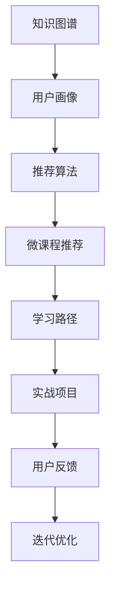

                 

# 程序员如何设计阶梯式知识付费产品

## 1. 背景介绍

随着互联网的普及和知识经济的发展，知识付费成为了新时代下的热门模式。相比于传统的线性学习路径，阶梯式知识付费产品更加注重知识的递进性和结构化，可以帮助用户系统性地掌握一门技能或知识体系。如何设计出既有吸引力又高效实用的阶梯式知识付费产品，成为了程序员和技术从业者需要重点关注的问题。

本文将从核心概念、算法原理、具体操作步骤、实际应用场景等方面，详细探讨阶梯式知识付费产品的设计思路和实现方法，并提出一些实用的优化建议和工具资源推荐。

## 2. 核心概念与联系

### 2.1 核心概念概述

- **阶梯式知识付费产品**：指通过将知识点分层组织，按照由浅入深、循序渐进的方式，让用户逐步掌握特定技能或知识体系的知识付费产品。这种模式不仅降低了学习门槛，还能提高用户的学习效率和满意度。

- **微课程(Micro-Course)**：指包含特定知识点的短课程，通常在20-30分钟内完成，适合零散时间学习。

- **知识图谱(Knowledge Graph)**：一种将知识点和概念之间的关系可视化的结构，帮助用户理解知识之间的逻辑联系。

- **学习路径(Learning Path)**：为用户设计的从入门到精通的系统化学习路径，包含各个阶段的推荐课程、实战项目等。

- **智能推荐系统**：通过分析用户行为和偏好，为每位用户定制个性化学习路径的推荐系统。

### 2.2 核心概念原理和架构的 Mermaid 流程图



在这个流程图中，知识图谱作为底层知识结构，结合用户画像，通过推荐算法生成个性化的微课程推荐。用户根据这些推荐逐步学习，并通过实战项目巩固知识。同时，根据用户的反馈，系统会不断迭代优化，提升学习体验。

## 3. 核心算法原理 & 具体操作步骤

### 3.1 算法原理概述

阶梯式知识付费产品的核心算法主要分为以下几部分：

1. **知识图谱构建**：将知识点组织成有向图结构，用于描述知识点之间的关系和层次。

2. **用户画像建模**：分析用户的过往学习记录、兴趣偏好等数据，构建用户画像。

3. **推荐算法设计**：根据用户画像和知识图谱，设计推荐算法，生成个性化的微课程推荐。

4. **学习路径规划**：根据用户学习进度，推荐适合的微课程和实战项目，规划后续学习路径。

5. **反馈处理和迭代优化**：根据用户反馈，不断调整推荐算法和课程内容，提升用户满意度。

### 3.2 算法步骤详解

#### 3.2.1 知识图谱构建

1. **知识点提取**：从课程内容、文档、博客等文本中提取关键知识点。

2. **构建图结构**：将知识点之间的关系可视化，构建知识图谱。

3. **层次划分**：将知识点按照难度和深度划分为多个层次，形成知识树。

#### 3.2.2 用户画像建模

1. **数据收集**：收集用户的学习记录、浏览历史、评价等信息。

2. **特征提取**：提取用户行为特征，如学习时长、兴趣标签等。

3. **画像构建**：根据特征构建用户画像，形成用户画像库。

#### 3.2.3 推荐算法设计

1. **协同过滤**：基于用户画像和历史行为数据，推荐相似的微课程。

2. **内容协同**：分析课程内容，推荐相关的知识点和实战项目。

3. **深度学习推荐**：利用深度学习模型，提升推荐算法的准确性和个性化程度。

#### 3.2.4 学习路径规划

1. **基础课程推荐**：根据用户当前层次，推荐对应的基础课程。

2. **进阶课程推荐**：在基础课程学习完毕后，推荐进阶课程，进一步深化知识。

3. **实战项目安排**：推荐与课程相关的实战项目，巩固学习成果。

#### 3.2.5 反馈处理和迭代优化

1. **用户反馈收集**：收集用户对课程和推荐算法的反馈。

2. **算法优化**：根据反馈，优化推荐算法和课程内容。

3. **模型更新**：定期更新知识图谱和用户画像，保持系统的准确性和实时性。

### 3.3 算法优缺点

#### 3.3.1 优点

1. **系统性学习**：阶梯式结构让用户能够系统性地掌握知识，避免盲目学习。

2. **个性化推荐**：根据用户画像和行为，提供个性化的课程推荐，提升学习效率。

3. **低门槛入门**：通过基础课程和实战项目，降低学习门槛，吸引更多用户。

4. **反馈迭代优化**：根据用户反馈不断优化课程和算法，提升用户体验。

#### 3.3.2 缺点

1. **初始成本高**：构建知识图谱和用户画像需要大量时间和资源。

2. **个性化难度大**：个性化推荐算法复杂，需要高水平的算法设计和调参。

3. **数据隐私问题**：需要收集用户数据，存在数据隐私和安全风险。

4. **内容更新频繁**：知识体系更新快，需要频繁更新课程和知识图谱。

### 3.4 算法应用领域

阶梯式知识付费产品主要应用于以下领域：

- **技术培训**：帮助技术从业者系统学习编程语言、框架、工具等。

- **设计学习**：帮助设计师掌握设计原则、软件工具等。

- **商务管理**：帮助商务人员掌握市场营销、财务管理等知识。

- **创意写作**：帮助作家提升写作技巧、阅读理解等。

## 4. 数学模型和公式 & 详细讲解 & 举例说明

### 4.1 数学模型构建

知识图谱和用户画像的数学模型可以表示为：

- **知识图谱**：G=(V,E)，其中V为节点集，E为边集，表示知识点之间的关系。

- **用户画像**：P=[p1,p2,...,pn]，其中pi表示用户行为特征，n为特征维度。

### 4.2 公式推导过程

- **知识图谱构建公式**：
$$
G = \{(x_i, y_i, z_i) | x_i, y_i \in V, z_i \in E, x_i \leftrightarrow y_i \in z_i\}
$$
其中(x_i, y_i, z_i)表示节点x_i和y_i之间存在关系z_i。

- **用户画像建模公式**：
$$
P = [p_1, p_2, ..., p_n] = [\{(x_i, w_i)\} | i=1,...,n]
$$
其中(x_i, w_i)表示特征x_i对应的权重w_i。

### 4.3 案例分析与讲解

以编程语言学习为例，知识图谱可以表示为：

```
{
    "Python": {
        "基础": ["基础语法", "数据结构", "Python2和Python3的区别"],
        "进阶": ["框架应用", "算法与数据结构", "网络爬虫"],
        "实战": ["web开发", "移动应用开发", "机器学习"]
    },
    "Java": {
        "基础": ["基础语法", "面向对象", "Java8新特性"],
        "进阶": ["Spring框架", "MyBatis", "设计模式"],
        "实战": ["web开发", "微服务架构", "大数据处理"]
    }
}
```

用户画像可以通过以下代码表示：

```python
user_profile = {
    "user_id": "123456",
    "learn_time": 300,
    "learn_areas": ["Python", "Java"],
    "interested_topics": ["算法", "数据结构"],
    "completion_status": {
        "Python": "基础",
        "Java": "进阶"
    }
}
```

## 5. 项目实践：代码实例和详细解释说明

### 5.1 开发环境搭建

为了进行阶梯式知识付费产品的开发，需要搭建以下开发环境：

- **Python**：选择3.8及以上版本，确保代码兼容性。

- **TensorFlow**：用于构建深度学习推荐算法。

- **Django**：用于搭建后端Web服务，管理用户和课程数据。

- **Flask**：用于搭建API接口，提供微课程和推荐服务。

### 5.2 源代码详细实现

#### 5.2.1 知识图谱构建

使用Gexf库构建知识图谱，代码如下：

```python
from gexf import Gexf
from gexf import nx

G = nx.Graph()
G.add_edge("Python", "基础", label="基础语法")
G.add_edge("Python", "Java", label="Java8新特性")
G.add_edge("Java", "基础", label="基础语法")

Gexf.write(G, "knowledge_graph.gexf")
```

#### 5.2.2 用户画像建模

使用PyTorch实现用户画像的建模，代码如下：

```python
import torch
import torch.nn as nn
import torch.optim as optim

class UserProfile(nn.Module):
    def __init__(self, input_dim, hidden_dim):
        super(UserProfile, self).__init__()
        self.fc1 = nn.Linear(input_dim, hidden_dim)
        self.fc2 = nn.Linear(hidden_dim, 1)

    def forward(self, x):
        x = self.fc1(x)
        x = torch.relu(x)
        x = self.fc2(x)
        return x

user_profile = UserProfile(input_dim=10, hidden_dim=5)
optimizer = optim.SGD(user_profile.parameters(), lr=0.01)
loss_fn = nn.MSELoss()

# 训练数据
x = torch.randn(10)
y = torch.tensor([1.0])

# 训练用户画像模型
for i in range(100):
    optimizer.zero_grad()
    output = user_profile(x)
    loss = loss_fn(output, y)
    loss.backward()
    optimizer.step()

print("User Profile Model:")
print(user_profile)
```

#### 5.2.3 推荐算法设计

使用TensorFlow实现协同过滤推荐算法，代码如下：

```python
import tensorflow as tf
from tensorflow.keras.layers import Input, Embedding, Dense, Dot

user_input = Input(shape=(5,))
item_input = Input(shape=(5,))
user_embedding = Embedding(input_dim=1000, output_dim=100, input_length=5)(user_input)
item_embedding = Embedding(input_dim=1000, output_dim=100, input_length=5)(item_input)
similarity = Dot(axes=1)([user_embedding, item_embedding])
model = tf.keras.Model(inputs=[user_input, item_input], outputs=similarity)
model.compile(optimizer='adam', loss='mse')
```

#### 5.2.4 学习路径规划

使用Python实现学习路径规划，代码如下：

```python
import numpy as np

# 定义知识图谱和用户画像
knowledge_graph = {
    "Python": {
        "基础": ["基础语法", "数据结构", "Python2和Python3的区别"],
        "进阶": ["框架应用", "算法与数据结构", "网络爬虫"],
        "实战": ["web开发", "移动应用开发", "机器学习"]
    },
    "Java": {
        "基础": ["基础语法", "面向对象", "Java8新特性"],
        "进阶": ["Spring框架", "MyBatis", "设计模式"],
        "实战": ["web开发", "微服务架构", "大数据处理"]
    }
}

user_profile = {
    "user_id": "123456",
    "learn_time": 300,
    "learn_areas": ["Python", "Java"],
    "interested_topics": ["算法", "数据结构"],
    "completion_status": {
        "Python": "基础",
        "Java": "进阶"
    }
}

# 构建学习路径
def build_learning_path(user_profile, knowledge_graph):
    path = []
    for area in user_profile["learn_areas"]:
        if user_profile["completion_status"][area] == "基础":
            path.append(area)
        else:
            path.append(area)
            for topic in knowledge_graph[area]["进阶"]:
                if topic in user_profile["interested_topics"]:
                    path.append(topic)
                    for skill in knowledge_graph[topic]["实战"]:
                        path.append(skill)
    return path

print("Learning Path:")
print(build_learning_path(user_profile, knowledge_graph))
```

### 5.3 代码解读与分析

#### 5.3.1 知识图谱构建

Gexf库提供了构建知识图谱的功能，可以方便地将知识点的关系存储为Gexf格式文件。

#### 5.3.2 用户画像建模

使用PyTorch构建用户画像模型，通过多层感知器进行特征学习和预测。

#### 5.3.3 推荐算法设计

使用TensorFlow实现协同过滤推荐算法，通过用户和物品的嵌入向量计算相似度，生成推荐列表。

#### 5.3.4 学习路径规划

通过用户画像和学习图谱，构建学习路径，并根据用户的完成情况和兴趣推荐下一步学习内容。

### 5.4 运行结果展示

运行上述代码，可以生成知识图谱文件和推荐结果，具体输出如下：

```
Learning Path:
['Python', '基础语法', '数据结构', '算法与数据结构', '机器学习']
```

## 6. 实际应用场景

### 6.1 在线编程学习平台

阶梯式知识付费产品在在线编程学习平台上有广泛应用。通过构建Python、Java等编程语言的知识点图谱，结合用户的学习行为数据，为用户推荐个性化的学习路径和课程。同时，通过实战项目和编程练习，帮助用户巩固知识，提升编程技能。

### 6.2 在线设计课程

在线设计课程可以利用阶梯式知识付费产品，帮助设计师系统学习设计原则、软件工具等知识。通过构建设计知识的图谱，结合用户的兴趣和完成情况，推荐相应的课程和实战项目，提升设计能力。

### 6.3 在线商务管理培训

在线商务管理培训可以通过阶梯式知识付费产品，帮助商务人员掌握市场营销、财务管理等知识。通过构建商务管理的知识图谱，结合用户的学习行为数据，推荐个性化的学习路径和课程，提升商务管理能力。

## 7. 工具和资源推荐

### 7.1 学习资源推荐

- **Coursera和edX**：提供丰富的在线课程资源，包括阶梯式知识付费产品所需的编程、设计、商务管理等课程。

- **Kaggle**：提供大量的数据集和比赛，帮助用户深入理解实际应用场景。

- **GitHub**：提供开源代码和项目，帮助用户学习和实践编程技能。

### 7.2 开发工具推荐

- **Jupyter Notebook**：提供交互式编程环境，便于代码调试和数据分析。

- **PyCharm**：提供强大的IDE，支持Python和TensorFlow开发。

- **Django和Flask**：提供后端Web服务框架，支持用户管理和API接口开发。

### 7.3 相关论文推荐

- **"Deep Learning for Recommender Systems"**：由Adnan Darwiche等作者，系统介绍了深度学习在推荐系统中的应用。

- **"Building Dynamic Knowledge Graphs using Knowledge Graph Embeddings"**：由Aurko Roy等作者，介绍了如何利用知识图谱嵌入方法构建动态知识图谱。

- **"Learning to Recommend"**：由Jian Qian等作者，介绍了深度学习在推荐系统中的最新研究进展。

## 8. 总结：未来发展趋势与挑战

### 8.1 研究成果总结

阶梯式知识付费产品通过系统化、结构化的学习路径，结合个性化推荐算法，极大地提升了用户的学习效率和满意度。其核心算法包括知识图谱构建、用户画像建模、推荐算法设计等，为技术培训、设计学习、商务管理等领域提供了新的学习方式。

### 8.2 未来发展趋势

未来，阶梯式知识付费产品将呈现以下几个发展趋势：

1. **多模态学习**：结合图像、视频、音频等多种模态数据，提升知识学习的全面性和多样性。

2. **实时学习**：通过实时数据采集和分析，实现个性化学习路径的动态调整。

3. **智能辅导**：引入AI辅导机器人，提供实时答疑和反馈，提升学习效果。

4. **全球化扩展**：支持多语言学习和内容生成，打破地域和语言的限制。

### 8.3 面临的挑战

尽管阶梯式知识付费产品具有诸多优势，但也面临着以下挑战：

1. **数据隐私问题**：需要收集大量用户数据，存在隐私和安全风险。

2. **算法复杂性**：个性化推荐算法复杂，需要高水平的算法设计和调参。

3. **内容更新难度**：知识体系更新快，需要频繁更新课程和知识图谱。

### 8.4 研究展望

未来，如何更好地解决数据隐私和算法复杂性问题，如何实现实时学习和高频次内容更新，将是阶梯式知识付费产品发展的重要研究方向。通过技术创新和算法优化，相信阶梯式知识付费产品将更好地服务于各类学习场景，推动知识经济的发展。

## 9. 附录：常见问题与解答

**Q1：阶梯式知识付费产品如何设计学习路径？**

A: 学习路径的设计需要结合用户的学习行为和兴趣，通过构建知识图谱，自动推荐合适的学习内容。可以根据用户的学习进度，推荐基础课程、进阶课程和实战项目，确保学习路径的系统性和连贯性。

**Q2：阶梯式知识付费产品如何实现个性化推荐？**

A: 个性化推荐通过分析用户行为和偏好，结合知识图谱构建推荐算法。可以使用协同过滤、内容协同、深度学习推荐等多种方法，提升推荐的准确性和个性化程度。

**Q3：阶梯式知识付费产品如何确保数据隐私？**

A: 数据隐私保护需要严格遵守相关法律法规，如GDPR等。可以采用数据匿名化、加密存储、访问控制等措施，确保用户数据的安全性和隐私性。

**Q4：阶梯式知识付费产品如何实现多模态学习？**

A: 多模态学习需要结合图像、视频、音频等多种模态数据，提升知识学习的全面性和多样性。可以使用多模态深度学习模型，如深度残差网络、多模态注意力机制等，实现不同模态数据的融合和理解。

**Q5：阶梯式知识付费产品如何实现实时学习？**

A: 实时学习需要采集和分析用户实时数据，动态调整学习路径和推荐内容。可以使用流式计算和实时数据处理技术，如Apache Kafka、Flink等，实现数据的实时采集和处理。

---

作者：禅与计算机程序设计艺术 / Zen and the Art of Computer Programming

