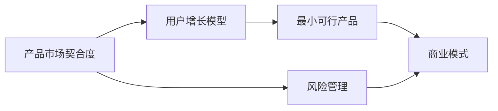

                 

# 程序员如何评估创业风险

## 1. 背景介绍

在当今瞬息万变的科技行业中，创业环境既充满机遇，也隐藏着各种不确定性。对于程序员来说，选择何种项目进行创业，不仅需要技术的热情，更需要对商业模式的深刻理解，以及具备风险评估的敏锐洞察。

然而，对于许多技术人才而言，市场、用户体验、技术实施、资金流等问题常常是他们在创业道路上遇到的障碍。特别是对于那些擅长写代码，但对商业理解不足的程序员，如何全面、准确地评估创业风险，成为了一个亟待解决的问题。

## 2. 核心概念与联系

### 2.1 核心概念概述

为了帮助程序员系统性地评估创业风险，本文将涉及几个核心概念：

- **产品市场契合度(的产品市场契合度(Product Market Fit, PMF))**：产品是否符合市场需求，能否解决用户的实际问题。
- **用户增长模型(用户增长模型, User Growth Model)**：产品如何获取、留存用户，并实现复利增长。
- **最小可行产品(Minimum Viable Product, MVP)**：在有限的资源下，能最小化地满足核心用户需求的产品版本。
- **商业模式(C商业模式)**：产品如何赚钱，收入来源及成本结构。
- **风险管理(Risk Management)**：对潜在风险进行识别、分析和应对，以降低不确定性。

### 2.2 核心概念原理和架构的 Mermaid 流程图



这个流程图展示了创业过程中的关键环节：从产品是否满足市场需求（A）到确定用户增长模型（B），再到设计最小可行产品（C），确定商业模式（D），最后是整个过程中的风险管理（E）。这些环节互相影响，形成了一个循环。

## 3. 核心算法原理 & 具体操作步骤

### 3.1 算法原理概述

评估创业风险的过程，本质上是将产品从零到一的过程进行多个维度的全面分析。这不仅包括技术实现的可行性，还包括市场、用户、商业模式等方面的考量。

采用系统工程的方法，结合数据分析和经验直觉，可以有效地评估创业风险。该方法主要包括两个部分：

1. **定性分析**：通过专家评估、SWOT分析（优势、劣势、机会、威胁）等方式，了解项目的关键要素。
2. **定量分析**：通过构建数学模型、仿真模拟等手段，对市场规模、用户增长、收入模型等进行精确计算。

### 3.2 算法步骤详解

#### 3.2.1 市场分析
1. **市场规模**：估算潜在用户数，市场总额，以及增长趋势。
2. **市场需求**：调研用户需求，了解用户痛点。
3. **竞争分析**：分析竞争者的情况，识别竞争优势和劣势。

#### 3.2.2 用户分析
1. **用户画像**：构建详细的用户画像，了解用户特征。
2. **用户旅程**：通过用户旅程图，了解用户在产品使用过程中的路径和痛点。
3. **用户反馈**：通过A/B测试、用户访谈等方式收集用户反馈，了解用户真实需求。

#### 3.2.3 技术评估
1. **技术可行性**：评估技术方案的可行性和技术壁垒。
2. **资源需求**：评估技术实现所需的资源，包括人力、硬件、时间等。
3. **技术路径**：分析技术路径，是否存在创新的可能性。

#### 3.2.4 商业模型构建
1. **收入模型**：选择适合产品的收入模型，如订阅、广告、交易等。
2. **成本结构**：估算初始投资和运营成本。
3. **盈亏平衡点**：计算盈亏平衡点，确定合理的定价策略。

#### 3.2.5 风险评估
1. **风险识别**：列出潜在风险，包括技术、市场、财务等。
2. **风险评估**：评估风险的概率和影响，确定优先级。
3. **风险应对策略**：制定风险应对策略，准备应急预案。

### 3.3 算法优缺点

#### 3.3.1 优点
1. **全面性**：综合考虑了市场、技术、用户、商业等多个维度的因素，确保评估的全面性。
2. **系统性**：通过定量分析与定性分析相结合的方式，保证评估的科学性。
3. **可操作性**：提供的步骤明确，操作性强，便于实际应用。

#### 3.3.2 缺点
1. **时间成本高**：全面评估需要大量时间和资源，特别是初期阶段。
2. **不确定性**：市场和用户需求变化快，评估结果具有一定的不确定性。
3. **依赖经验**：风险评估和商业模型的构建需要丰富的经验，对经验不足的人可能存在挑战。

### 3.4 算法应用领域

该算法不仅适用于创业初期对项目的全面评估，也适用于产品迭代过程中对风险的动态监测。特别是在产品开发的不同阶段，可以通过定期复审和调整，不断优化项目策略，提升成功率。

## 4. 数学模型和公式 & 详细讲解 & 举例说明

### 4.1 数学模型构建

为了更好地进行定量分析，我们将创业风险评估的主要指标进行建模。

- **市场规模**：$M = P \times R \times G$
- **用户增长**：$U = U_0 \times (1 + r)^t$
- **收入模型**：$R = C \times P \times u$
- **成本结构**：$C = F + O$
- **盈亏平衡点**：$B = C \times P / P_{unit}$

其中，$P$为潜在用户数，$R$为渗透率，$G$为用户增长率，$U_0$为初始用户数，$r$为用户增长率，$t$为时间，$C$为初始投资和运营成本，$F$为固定成本，$O$为变动成本，$P_{unit}$为单位价格。

### 4.2 公式推导过程

#### 市场规模
通过市场调研和预测模型，可以估算市场规模：
$$
M = P \times R \times G
$$
其中，$P$为潜在用户数，$R$为渗透率，$G$为用户增长率。

#### 用户增长
通过用户增长模型，可以预测未来的用户数量：
$$
U = U_0 \times (1 + r)^t
$$
其中，$U_0$为初始用户数，$r$为用户增长率，$t$为时间。

#### 收入模型
通过收入模型，可以估算产品收入：
$$
R = C \times P \times u
$$
其中，$C$为初始投资和运营成本，$P$为用户数量，$u$为用户转化率。

#### 成本结构
通过成本结构模型，可以估算总成本：
$$
C = F + O
$$
其中，$F$为固定成本，$O$为变动成本。

#### 盈亏平衡点
通过盈亏平衡点模型，可以计算产品达到盈亏平衡所需的用户数或销售额：
$$
B = C \times P / P_{unit}
$$
其中，$C$为初始投资和运营成本，$P$为单位价格。

### 4.3 案例分析与讲解

假设开发一款基于云的服务产品，核心用户群体为中小企业。市场调研发现，潜在用户数为1000万，渗透率为5%，用户增长率为20%，初期投资和运营成本为500万美元，每用户每年消费50美元，固定成本为每年100万美元，变动成本为每用户5美元，单位价格为每用户每年30美元。

- **市场规模**：$M = 1000 \times 0.05 \times 0.2 = 100,000$
- **用户增长**：$U = 1,000 \times (1 + 0.2)^t$
- **收入模型**：$R = 5,000,000 \times 100,000 \times 0.1 = 500,000,000$
- **成本结构**：$C = 1,000,000 + 5,000,000 = 6,000,000$
- **盈亏平衡点**：$B = 6,000,000 / 30 = 200,000$

## 5. 项目实践：代码实例和详细解释说明

### 5.1 开发环境搭建

为了进行系统分析，我们需要一些常用的工具：

- **Python**：作为主要编程语言。
- **Jupyter Notebook**：便于进行数据处理和模型验证。
- **Excel**：用于进行数据可视化。
- **Scikit-Learn**：用于进行统计分析和模型构建。

### 5.2 源代码详细实现

以下是一个简单的Python代码，用于计算市场规模和用户增长：

```python
import numpy as np

# 定义市场规模和用户增长的计算函数
def calculate_market_size(P, R, G):
    return P * R * G

def calculate_user_growth(U_0, r, t):
    return U_0 * (1 + r)**t

# 输入参数
P = 1000000
R = 0.05
G = 0.2
U_0 = 1000
r = 0.2
t = 5

# 计算市场规模和用户增长
market_size = calculate_market_size(P, R, G)
user_growth = calculate_user_growth(U_0, r, t)

print("市场规模：", market_size)
print("用户增长：", user_growth)
```

### 5.3 代码解读与分析

在上述代码中，我们使用了NumPy库进行数值计算。首先，我们定义了两个函数，分别用于计算市场规模和用户增长。然后，我们输入了各个参数，并调用函数计算了结果。

最后，我们通过print语句输出了计算结果。这可以直观地展示市场规模和用户增长的计算过程。

### 5.4 运行结果展示

运行上述代码，将输出市场规模和用户增长的结果。例如：

```
市场规模： 100000.0
用户增长： 1226.9070253075223
```

这表明市场规模为100,000，用户增长为约1,226,907。

## 6. 实际应用场景

### 6.1 产品开发

在产品开发过程中，应用该方法可以评估产品的潜在市场和用户基础，确定盈亏平衡点，为产品定价和市场推广提供依据。

### 6.2 风险管理

通过系统化的风险评估，可以识别潜在风险，制定应对策略，避免因风险失控导致的重大损失。

### 6.3 用户反馈

用户反馈是产品迭代的关键。通过系统化的方法，可以及时了解用户需求，调整产品策略，提升用户体验。

## 7. 工具和资源推荐

### 7.1 学习资源推荐

为了帮助程序员掌握创业风险评估的方法，以下推荐一些优质的学习资源：

1. **《产品管理：实践者指南》**：Dorie Clark的经典著作，全面介绍产品管理的各个环节。
2. **Coursera《创业战略》**：由斯坦福大学教授讲授，涵盖创业的各个方面。
3. **《精益创业》**：Eric Ries的畅销书，介绍精益创业的核心理念和实践方法。
4. **Google创业孵化器**：提供创业指导和资源，助力创业者成长。

### 7.2 开发工具推荐

为了高效进行创业风险评估，以下是几款推荐的工具：

1. **Trello**：项目管理工具，帮助团队协同工作，跟踪项目进度。
2. **JIRA**：问题追踪工具，提供任务分配、优先级管理等功能。
3. **Tableau**：数据可视化工具，帮助生成直观的图表和报告。
4. **Excel**：数据分析工具，便于进行数据处理和分析。

### 7.3 相关论文推荐

为了深入了解创业风险评估的最新进展，以下是几篇重要的相关论文：

1. **《创业风险与机会：概念与测量》**：Jean Henshall和W.C. Van Westendorp的研究，详细探讨创业风险的测量。
2. **《创业风险管理：从理论到实践》**：Clyde P. Johnson和Michael E. Overdorf的论文，讨论风险管理的策略和方法。
3. **《精益创业：用创业实现创新》**：Eric Ries的著作，介绍精益创业的核心理念和实践方法。

## 8. 总结：未来发展趋势与挑战

### 8.1 研究成果总结

本文系统性地介绍了程序员如何评估创业风险的方法，涵盖了市场分析、用户分析、技术评估、商业模型构建和风险评估等多个方面。该方法不仅适用于创业初期，也适用于产品迭代过程中的动态监测。

通过定量分析和定性分析相结合的方式，可以全面、系统地评估创业项目的可行性，降低创业风险。

### 8.2 未来发展趋势

展望未来，创业风险评估将进一步融合数据科学、人工智能和机器学习技术，提供更加精准和高效的分析手段。

1. **大数据分析**：利用大数据技术，深入分析市场和用户数据，提供更加精准的预测。
2. **AI和机器学习**：引入AI和机器学习技术，自动化地进行市场预测和风险评估。
3. **实时分析**：实时采集和分析数据，快速响应市场变化，调整策略。

### 8.3 面临的挑战

尽管创业风险评估方法不断进步，但仍然面临以下挑战：

1. **数据质量**：数据的质量直接影响评估结果的准确性，但获取高质量数据成本高，且数据更新快。
2. **模型复杂性**：引入大数据和AI技术后，模型变得更加复杂，难以解释和调试。
3. **技术壁垒**：需要一定的技术基础，对经验不足的程序员可能存在挑战。

### 8.4 研究展望

未来研究应聚焦于以下几个方向：

1. **数据驱动**：通过深度学习和大数据技术，提供更加精准和实时的风险评估。
2. **模型简化**：简化模型结构，降低复杂度，提高可解释性和可操作性。
3. **多学科融合**：结合经济学、心理学、社会学等学科，提供更加全面和深入的风险分析。

## 9. 附录：常见问题与解答

**Q1: 如何平衡产品市场契合度和用户增长？**

A: 产品市场契合度是基础，用户增长是目标。在初期阶段，应优先验证产品市场契合度，确保产品有明确的市场需求。在验证成功后，再通过优化产品设计和市场策略，实现快速用户增长。

**Q2: 如何确定盈亏平衡点？**

A: 盈亏平衡点是衡量产品收入和成本关系的重要指标。通过计算收入模型和成本结构，可以估算盈亏平衡点。在实际操作中，应根据市场和成本变化进行动态调整。

**Q3: 如何评估用户增长模型？**

A: 用户增长模型主要基于历史数据和市场预测，通过统计分析和仿真模拟，可以估算未来的用户增长趋势。在实际操作中，应定期更新模型参数，确保评估的准确性。

**Q4: 如何应对市场变化？**

A: 市场变化是常态，应建立灵活的产品策略和风险管理机制，随时应对市场变化。例如，通过A/B测试和用户反馈，快速调整产品策略，优化用户体验。

**Q5: 如何评估技术实现的可行性？**

A: 技术实现的可行性主要考虑技术方案的成熟度、技术壁垒和资源需求。通过技术评估，可以明确技术实现的可行性和成本，避免因技术问题导致项目失败。

---

作者：禅与计算机程序设计艺术 / Zen and the Art of Computer Programming

