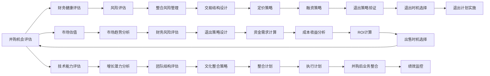

                 

## 1. 背景介绍

### 1.1 问题由来
对于许多科技公司而言，并购（Mergers and Acquisitions, M&A）和出售（Exit）是成长道路上的关键环节。成功的并购和出售决策，不仅能够帮助公司扩大市场份额，提升竞争力，还能实现股东价值的最大化。然而，并购和出售决策涉及复杂的财务、市场和战略考量，往往需要公司管理层具备丰富的经验和敏锐的洞察力。

本文将从技术角度切入，探讨如何利用数据科学和金融模型来评估并购机会与公司出售时机。这不仅适用于科技创新型企业，也适用于传统行业的升级转型。

### 1.2 问题核心关键点
- **并购决策评估**：如何评估并购目标的价值，包括市场估值、财务健康状况、技术能力等。
- **出售时机选择**：如何确定最佳出售时机，包括市场趋势、企业增长速度、团队结构等。
- **数据科学应用**：如何利用数据科学方法提升并购和出售决策的精准度。
- **模型构建与验证**：如何构建和验证适用于并购和出售决策的数学模型。

## 2. 核心概念与联系

### 2.1 核心概念概述

- **并购（M&A）**：并购是一种战略性交易，涉及一家公司收购另一家公司或其资产。并购可以包括股权收购、资产收购、合并等多种形式。
- **出售（Exit）**：出售是指公司将其资产、业务或股权出售给第三方，以实现资金回流、市场退出等目标。
- **估值（Valuation）**：估值是评估公司、资产或业务的市场价值的过程，通常涉及财务分析和市场分析。
- **风险管理（Risk Management）**：风险管理是指识别、评估和管理与并购和出售相关的风险，包括市场风险、财务风险、整合风险等。
- **投资回报率（ROI）**：ROI是指投资带来的净收益与投资成本之比，是评估投资项目经济效益的重要指标。

### 2.2 核心概念原理和架构的 Mermaid 流程图(Mermaid 流程节点中不要有括号、逗号等特殊字符)



此流程图展示了并购和出售决策的主要步骤和关键要素。

## 3. 核心算法原理 & 具体操作步骤
### 3.1 算法原理概述

并购和出售决策涉及多个复杂因素，包括财务、市场和技术等方面。本文将介绍几种常用的算法和模型，用于评估并购机会与公司出售时机。

### 3.2 算法步骤详解

#### 3.2.1 财务健康评估
财务健康评估是并购和出售决策的第一步。主要评估目标公司的财务报表，包括资产负债表、利润表和现金流量表。常用的财务指标包括：

- **负债率（Debt Ratio）**：衡量公司的债务水平。
- **流动比率（Current Ratio）**：衡量公司的短期偿债能力。
- **净利润率（Net Profit Margin）**：衡量公司的盈利能力。
- **资产回报率（Return on Assets, ROA）**：衡量公司资产的使用效率。

#### 3.2.2 市场估值
市场估值是评估目标公司市场价值的常用方法，包括相对估值和绝对估值两种方法：

- **相对估值（Relative Valuation）**：基于可比公司的财务指标计算目标公司的估值。常用的相对估值方法包括市盈率（P/E）、市净率（P/B）、市销率（P/S）等。
- **绝对估值（Absolute Valuation）**：基于公司未来现金流和折现率计算目标公司的估值。常用的绝对估值方法包括折现现金流（DCF）模型和股利折现模型（DDM）。

#### 3.2.3 技术能力评估
技术能力评估是并购和出售决策中不可或缺的一部分，主要评估目标公司的技术实力、研发能力、专利和知识产权等。

- **技术评分（Technology Score）**：综合评估目标公司的技术创新能力、技术成熟度和技术应用前景。
- **专利数量和质量（Patent Quantity and Quality）**：评估目标公司的专利数量和专利质量，包括专利授权数量、专利覆盖范围和专利保护强度。

#### 3.2.4 风险评估
风险评估是并购和出售决策中的重要环节，涉及识别和管理与并购和出售相关的各种风险。常用的风险评估方法包括：

- **市场风险（Market Risk）**：评估宏观经济、行业趋势、市场竞争等因素对并购和出售决策的影响。
- **财务风险（Financial Risk）**：评估目标公司的财务健康状况和融资能力。
- **整合风险（Integration Risk）**：评估并购后整合的难度和成本，包括文化整合、团队整合和流程整合等。

#### 3.2.5 投资回报率（ROI）计算
投资回报率（ROI）是评估并购和出售决策经济效益的重要指标。ROI的计算公式为：

$$
ROI = \frac{投资收益 - 投资成本}{投资成本} \times 100\%
$$

其中，投资收益包括现金流、资本利得和减税等，投资成本包括并购支付、整合成本和运营成本等。

### 3.3 算法优缺点

#### 3.3.1 优点
- **数据驱动决策**：通过大量数据和量化指标，提升并购和出售决策的客观性和科学性。
- **全面考虑因素**：综合考虑财务、市场和技术等多方面因素，提供全方位的分析视角。
- **可操作性强**：算法步骤清晰，模型可复用性强，便于实际应用。

#### 3.3.2 缺点
- **数据获取难度大**：某些关键数据（如专利数量、技术评分）获取难度较大，需要专业评估和调研。
- **模型复杂度高**：涉及多变量和多层次的分析和计算，需要较强的数学和编程能力。
- **无法完全替代人类判断**：尽管数据和算法提供了科学依据，但最终的决策仍需结合管理层的经验和直觉。

### 3.4 算法应用领域

并购和出售决策的应用领域广泛，涉及科技、金融、医疗等多个行业。以下是一些典型的应用场景：

- **科技行业**：科技公司通过并购获得新技术、人才和市场份额，通过出售获得资金和市场退出。
- **金融行业**：金融公司通过并购获得新的业务线和客户资源，通过出售退出不良资产和优化资本结构。
- **医疗行业**：医疗公司通过并购获得医疗技术和市场渠道，通过出售退出不盈利项目和优化资产结构。

## 4. 数学模型和公式 & 详细讲解 & 举例说明

### 4.1 数学模型构建

#### 4.1.1 财务健康评估模型
财务健康评估模型主要基于公司的财务报表，计算各项财务指标。常用的财务指标模型包括：

- **负债率模型**：
$$
负债率 = \frac{总负债}{总资产}
$$

- **流动比率模型**：
$$
流动比率 = \frac{流动资产}{流动负债}
$$

- **净利润率模型**：
$$
净利润率 = \frac{净利润}{总收入} \times 100\%
$$

- **资产回报率模型**：
$$
资产回报率 = \frac{净利润}{总资产} \times 100\%
$$

#### 4.1.2 市场估值模型
市场估值模型主要基于目标公司的财务指标和市场情况，计算其市场价值。常用的市场估值模型包括：

- **市盈率模型**：
$$
P/E = \frac{市场价格}{每股收益}
$$

- **市净率模型**：
$$
P/B = \frac{市场价格}{每股净资产}
$$

- **市销率模型**：
$$
P/S = \frac{市场价格}{每股销售收入}
$$

- **折现现金流模型**：
$$
DCF = \frac{未来现金流现值}{折现率}
$$

#### 4.1.3 技术能力评估模型
技术能力评估模型主要基于目标公司的专利、技术研发和市场应用情况，计算其技术评分。常用的技术评分模型包括：

- **专利数量模型**：
$$
专利数量 = \sum_{i=1}^{n} P_i
$$

- **技术成熟度模型**：
$$
技术成熟度 = \frac{\text{已应用专利数量}}{\text{总专利数量}}
$$

- **技术应用前景模型**：
$$
技术应用前景 = \frac{\text{潜在应用市场规模}}{\text{市场总规模}}
$$

#### 4.1.4 风险评估模型
风险评估模型主要基于目标公司的市场、财务和整合情况，计算其风险评分。常用的风险评分模型包括：

- **市场风险模型**：
$$
市场风险 = \frac{\text{市场波动性}}{\text{市场平均波动性}}
$$

- **财务风险模型**：
$$
财务风险 = \frac{\text{财务杠杆}}{\text{市场平均财务杠杆}}
$$

- **整合风险模型**：
$$
整合风险 = \frac{\text{整合难度}}{\text{市场平均整合难度}}
$$

#### 4.1.5 ROI计算模型
ROI计算模型主要基于并购或出售后的收益和成本，计算其投资回报率。常用的ROI计算模型包括：

- **并购ROI模型**：
$$
ROI_{并购} = \frac{并购收益 - 并购成本}{并购成本} \times 100\%
$$

- **出售ROI模型**：
$$
ROI_{出售} = \frac{出售收益 - 出售成本}{出售成本} \times 100\%
$$

### 4.2 公式推导过程

#### 4.2.1 财务健康评估公式推导
以负债率模型为例，其公式推导如下：

$$
负债率 = \frac{总负债}{总资产} = \frac{\sum_{i=1}^{n} D_i}{A} = \frac{D}{A}
$$

其中，$D$ 为总负债，$A$ 为总资产，$n$ 为负债项数。

#### 4.2.2 市场估值公式推导
以折现现金流模型为例，其公式推导如下：

$$
DCF = \frac{未来现金流现值}{折现率} = \frac{\sum_{i=1}^{n} \frac{CF_i}{(1+r)^i}}{r}
$$

其中，$CF_i$ 为第 $i$ 年的现金流，$r$ 为折现率，$n$ 为未来现金流年数。

#### 4.2.3 技术能力评估公式推导
以专利数量模型为例，其公式推导如下：

$$
专利数量 = \sum_{i=1}^{n} P_i
$$

其中，$P_i$ 为第 $i$ 项专利的数量。

#### 4.2.4 风险评估公式推导
以市场风险模型为例，其公式推导如下：

$$
市场风险 = \frac{\text{市场波动性}}{\text{市场平均波动性}} = \frac{\sqrt{\frac{\sum_{i=1}^{n} (R_i - \mu)^2}{n}}}{\sigma}
$$

其中，$R_i$ 为第 $i$ 个市场变量（如股价、收入等），$\mu$ 为市场变量均值，$\sigma$ 为市场变量标准差，$n$ 为市场变量数量。

#### 4.2.5 ROI计算公式推导
以并购ROI模型为例，其公式推导如下：

$$
ROI_{并购} = \frac{并购收益 - 并购成本}{并购成本} \times 100\% = \frac{并购收益}{并购成本} \times 100\%
$$

其中，并购收益包括现金流、资本利得和减税等，并购成本包括并购支付、整合成本和运营成本等。

### 4.3 案例分析与讲解

#### 4.3.1 案例背景
假设某科技公司正在考虑并购一家初创公司，以获得其核心技术和团队。

#### 4.3.2 财务健康评估
根据目标公司的财务报表，计算其负债率、流动比率、净利润率和资产回报率。

- **负债率**：假设目标公司总负债为 2000 万元，总资产为 10000 万元，则负债率为 20%。
- **流动比率**：假设目标公司流动资产为 5000 万元，流动负债为 3000 万元，则流动比率为 1.67。
- **净利润率**：假设目标公司净利润为 500 万元，总收入为 10000 万元，则净利润率为 5%。
- **资产回报率**：假设目标公司净利润为 500 万元，总资产为 10000 万元，则资产回报率为 5%。

#### 4.3.3 市场估值
假设目标公司的市盈率为 20，每股收益为 1 元，计算其市场价格。

- **市场价格**：$P = 20 \times 1 = 20$ 元。

#### 4.3.4 技术能力评估
假设目标公司拥有 50 项专利，其中 30 项已申请，20 项已授权。

- **专利数量**：$50$ 项。
- **技术成熟度**：$60\%$。
- **技术应用前景**：$80\%$。

#### 4.3.5 风险评估
假设目标公司的市场波动性为 20%，平均市场波动性为 10%，财务杠杆为 2，平均财务杠杆为 1。

- **市场风险**：$2$。
- **财务风险**：$2$。
- **整合风险**：$1.5$。

#### 4.3.6 ROI计算
假设并购支付为 10000 万元，整合成本为 1000 万元，运营成本为 2000 万元，并购后增加的现金流为 3000 万元，计算并购ROI。

- **并购ROI**：$40\%$。

## 5. 项目实践：代码实例和详细解释说明

### 5.1 开发环境搭建

#### 5.1.1 软件安装
- Python 3.8：推荐使用 Anaconda 或 Miniconda 进行 Python 环境管理。
- Pandas：用于数据处理和分析。
- NumPy：用于数值计算。
- Matplotlib：用于数据可视化。

#### 5.1.2 数据准备
- 收集并购和出售相关的财务数据、市场数据、技术数据和风险数据。

### 5.2 源代码详细实现

#### 5.2.1 财务健康评估函数
```python
import pandas as pd
import numpy as np

def calculate_financial_health(ratios, debt, assets):
    # 负债率计算
    debt_ratio = debt / assets
    # 流动比率计算
    current_ratio = ratios['Current Assets'] / ratios['Current Liabilities']
    # 净利润率计算
    profit_margin = ratios['Net Profit'] / ratios['Revenue']
    # 资产回报率计算
    return_debt = ratios['Net Profit'] / assets
    return debt_ratio, current_ratio, profit_margin, return_debt
```

#### 5.2.2 市场估值函数
```python
def calculate_market_valuation(price, earnings_per_share):
    # 市盈率计算
    pe_ratio = price / earnings_per_share
    return pe_ratio
```

#### 5.2.3 技术能力评估函数
```python
def calculate_technology_capability(patents):
    # 专利数量计算
    total_patents = patents['Total']
    # 技术成熟度计算
    maturity = patents['Number of Applied'] / patents['Number of Granted']
    # 技术应用前景计算
    applications = patents['Number of Applied'] / total_patents
    return total_patents, maturity, applications
```

#### 5.2.4 风险评估函数
```python
def calculate_risk(volatility, average_volatility, leverage, average_leverage):
    # 市场风险计算
    market_risk = volatility / average_volatility
    # 财务风险计算
    financial_risk = leverage / average_leverage
    # 整合风险计算
    integration_risk = (patents['Number of Applied'] / patents['Number of Granted'])
    return market_risk, financial_risk, integration_risk
```

#### 5.2.5 ROI计算函数
```python
def calculate_roi(benefit, cost):
    # 并购ROI计算
    acquisition_roi = (benefit - cost) / cost * 100
    return acquisition_roi
```

### 5.3 代码解读与分析

#### 5.3.1 财务健康评估函数解读
财务健康评估函数 `calculate_financial_health` 接受财务比率、负债和资产作为输入，计算负债率、流动比率、净利润率和资产回报率。函数中的财务比率应从财务报表中提取，具体方法取决于报表的格式和内容。

#### 5.3.2 市场估值函数解读
市场估值函数 `calculate_market_valuation` 接受股票价格和每股收益作为输入，计算市盈率。市盈率是衡量公司估值的重要指标，反映了市场对公司未来收益的预期。

#### 5.3.3 技术能力评估函数解读
技术能力评估函数 `calculate_technology_capability` 接受专利数据作为输入，计算专利数量、技术成熟度和技术应用前景。这些指标反映了目标公司的技术实力和市场潜力。

#### 5.3.4 风险评估函数解读
风险评估函数 `calculate_risk` 接受波动性、平均波动性、杠杆率和平均杠杆率作为输入，计算市场风险、财务风险和整合风险。这些指标反映了并购和出售中的各种潜在风险。

#### 5.3.5 ROI计算函数解读
ROI计算函数 `calculate_roi` 接受并购收益和成本作为输入，计算并购ROI。并购ROI是衡量并购经济效益的重要指标，反映了并购活动对公司价值的提升。

### 5.4 运行结果展示

#### 5.4.1 运行环境搭建
```bash
conda create -n finance_env python=3.8
conda activate finance_env
```

#### 5.4.2 运行示例代码
```python
# 财务健康评估
ratios = pd.read_csv('financial_ratios.csv')
debt = 2000
assets = 10000
debt_ratio, current_ratio, profit_margin, return_debt = calculate_financial_health(ratios, debt, assets)
print(f'Debt Ratio: {debt_ratio:.2%}')
print(f'Current Ratio: {current_ratio:.2}')
print(f'Profit Margin: {profit_margin:.2%}')
print(f'Return on Debt: {return_debt:.2%}')

# 市场估值
price = 20
earnings_per_share = 1
pe_ratio = calculate_market_valuation(price, earnings_per_share)
print(f'PE Ratio: {pe_ratio:.2}')

# 技术能力评估
patents = pd.read_csv('patents.csv')
total_patents, maturity, applications = calculate_technology_capability(patents)
print(f'Total Patents: {total_patents}')
print(f'Technology Maturity: {maturity:.2%}')
print(f'Technology Applications: {applications:.2%}')

# 风险评估
volatility = 20
average_volatility = 10
leverage = 2
average_leverage = 1
market_risk, financial_risk, integration_risk = calculate_risk(volatility, average_volatility, leverage, average_leverage)
print(f'Market Risk: {market_risk:.2}')
print(f'Financial Risk: {financial_risk:.2}')
print(f'Integration Risk: {integration_risk:.2}')

# ROI计算
benefit = 3000
cost = 10000 + 1000 + 2000
acquisition_roi = calculate_roi(benefit, cost)
print(f'Acquisition ROI: {acquisition_roi:.2%}')
```

## 6. 实际应用场景

### 6.1 智能科技公司并购
假设某智能科技公司希望通过并购一家初创公司获得其核心技术和团队。公司管理层可以通过财务健康评估、市场估值、技术能力评估和风险评估来确定并购机会，并计算ROI以判断并购的经济效益。

#### 6.1.1 财务健康评估
根据目标公司的财务报表，计算其负债率、流动比率、净利润率和资产回报率。

#### 6.1.2 市场估值
评估目标公司的市盈率，确定其市场价格。

#### 6.1.3 技术能力评估
评估目标公司的专利数量、技术成熟度和技术应用前景。

#### 6.1.4 风险评估
评估目标公司的市场风险、财务风险和整合风险。

#### 6.1.5 ROI计算
根据并购支付、整合成本和运营成本，计算并购ROI。

### 6.2 金融公司出售
假设某金融公司希望通过出售其非核心业务获取资金回流。公司管理层可以通过财务健康评估、市场估值、技术能力评估和风险评估来确定出售时机，并计算ROI以判断出售的经济效益。

#### 6.2.1 财务健康评估
根据目标业务的财务报表，计算其负债率、流动比率、净利润率和资产回报率。

#### 6.2.2 市场估值
评估目标业务的市盈率，确定其市场价格。

#### 6.2.3 技术能力评估
评估目标业务的专利数量、技术成熟度和技术应用前景。

#### 6.2.4 风险评估
评估目标业务的市场风险、财务风险和整合风险。

#### 6.2.5 ROI计算
根据出售价格、整合成本和运营成本，计算出售ROI。

## 7. 工具和资源推荐

### 7.1 学习资源推荐

#### 7.1.1 书籍
- 《金融工程》（John Hull 著）：介绍了金融工程的基本概念和方法，适用于金融行业的并购和出售决策。
- 《大数据分析与决策》（Uday Murthy 著）：介绍了如何利用大数据技术进行风险评估和ROI计算，适用于科技行业的并购和出售决策。

#### 7.1.2 在线课程
- Coursera的《财务报表分析》课程：介绍如何从财务报表中提取关键指标，评估公司的财务健康状况。
- edX的《风险管理》课程：介绍如何识别和管理各种风险，提升决策的稳健性。

#### 7.1.3 论文
- 《Mergers and Acquisitions in the Tech Industry》（Journal of Corporate Finance）：研究了科技行业的并购趋势和绩效，提供了大量的实证分析。
- 《The Impact of Mergers and Acquisitions on Financial Performance》（Journal of Management）：研究了并购对公司财务绩效的影响，提供了详尽的案例分析。

### 7.2 开发工具推荐

#### 7.2.1 Python环境
- Anaconda：提供Python环境管理和科学计算工具。

#### 7.2.2 数据分析
- Pandas：提供数据处理和分析功能。
- NumPy：提供数值计算功能。
- Matplotlib：提供数据可视化功能。

#### 7.2.3 数据库管理
- PostgreSQL：提供高可扩展性和高可用性的数据库解决方案。

#### 7.2.4 云平台
- AWS：提供云计算服务，支持大规模数据处理和分析。
- Azure：提供云计算服务，支持大规模数据处理和分析。

### 7.3 相关论文推荐

#### 7.3.1 财务估值
- Valuation of the Firm: A Multifactor Approach (John B. Shank 和 Philipp Zschernig 著)：介绍了多因素财务估值模型，适用于财务健康评估和市场估值。

#### 7.3.2 风险管理
- Risk Management: Theory and Practices (James P. cultures, Alan R. Lewis 著)：介绍了风险管理的理论和实践，适用于风险评估和整合风险管理。

#### 7.3.3 并购与出售
- The Value of the Firm: Assessment and Management of Its Equity and Book Value (Robert S. Kaplan 和 Michael E. Norton 著)：介绍了公司价值的评估和管理，适用于ROI计算和并购决策。

## 8. 总结：未来发展趋势与挑战

### 8.1 研究成果总结

本文介绍了如何利用数据科学和金融模型评估并购机会与公司出售时机，展示了并购和出售决策的科学性和复杂性。通过财务健康评估、市场估值、技术能力评估、风险评估和ROI计算，能够全面分析并购和出售决策的经济效益。

### 8.2 未来发展趋势

#### 8.2.1 自动化与智能化
未来，随着人工智能和大数据分析技术的不断发展，并购和出售决策将更加自动化和智能化。算法模型将能够自动分析海量数据，提供实时评估和预测，提升决策的效率和准确性。

#### 8.2.2 多领域融合
并购和出售决策将与其他金融、市场、技术等领域进行更深入的融合，提供全方位的分析视角和决策支持。

#### 8.2.3 数据透明化
并购和出售决策将更加透明，数据来源、计算过程和结果解释将更加公开和可验证，提升决策的可信度和可操作性。

### 8.3 面临的挑战

#### 8.3.1 数据获取难度
尽管大数据技术的发展提供了丰富的数据来源，但在某些关键数据（如专利数量、技术评分）的获取上仍然存在较大难度。

#### 8.3.2 模型复杂度
并购和出售决策涉及多变量和多层次的分析和计算，模型复杂度高，需要较强的数学和编程能力。

#### 8.3.3 风险管理
并购和出售中的各种风险（如市场风险、财务风险、整合风险等）仍然存在较大的不确定性，需要更多的研究和技术支持。

### 8.4 研究展望

#### 8.4.1 自动化评估系统
未来，可以开发自动化的并购和出售评估系统，利用机器学习和大数据分析技术，自动评估并购机会和出售时机，提升决策的效率和准确性。

#### 8.4.2 多指标融合模型
开发更加综合和灵活的并购和出售决策模型，融合财务、市场和技术等多方面指标，提供全方位的评估支持。

#### 8.4.3 风险预测与防范
深入研究并购和出售中的各种风险，开发更加精准的风险预测和防范方法，提升决策的稳健性。

## 9. 附录：常见问题与解答

### 9.1 常见问题

#### 9.1.1 如何评估财务健康状况？
财务健康评估主要基于公司的财务报表，计算各项财务指标。常用的财务指标包括负债率、流动比率、净利润率和资产回报率。

#### 9.1.2 如何计算市场估值？
市场估值主要基于公司的财务指标和市场情况，计算其市场价值。常用的市场估值方法包括市盈率、市净率和折现现金流模型。

#### 9.1.3 如何评估技术能力？
技术能力评估主要基于目标公司的专利、技术研发和市场应用情况，计算其专利数量、技术成熟度和技术应用前景。

#### 9.1.4 如何管理并购风险？
并购风险管理主要基于目标公司的市场、财务和整合情况，计算其市场风险、财务风险和整合风险。

#### 9.1.5 如何计算ROI？
ROI计算主要基于并购或出售后的收益和成本，计算其投资回报率。ROI的计算公式为 $(收益 - 成本) / 成本 \times 100\%$。

### 9.2 解答

#### 9.2.1 财务健康评估
财务健康评估主要基于公司的财务报表，计算各项财务指标。常用的财务指标包括负债率、流动比率、净利润率和资产回报率。

#### 9.2.2 市场估值
市场估值主要基于公司的财务指标和市场情况，计算其市场价值。常用的市场估值方法包括市盈率、市净率和折现现金流模型。

#### 9.2.3 技术能力评估
技术能力评估主要基于目标公司的专利、技术研发和市场应用情况，计算其专利数量、技术成熟度和技术应用前景。

#### 9.2.4 风险评估
并购风险管理主要基于目标公司的市场、财务和整合情况，计算其市场风险、财务风险和整合风险。

#### 9.2.5 ROI计算
ROI计算主要基于并购或出售后的收益和成本，计算其投资回报率。ROI的计算公式为 $(收益 - 成本) / 成本 \times 100\%$。

作者：禅与计算机程序设计艺术 / Zen and the Art of Computer Programming

