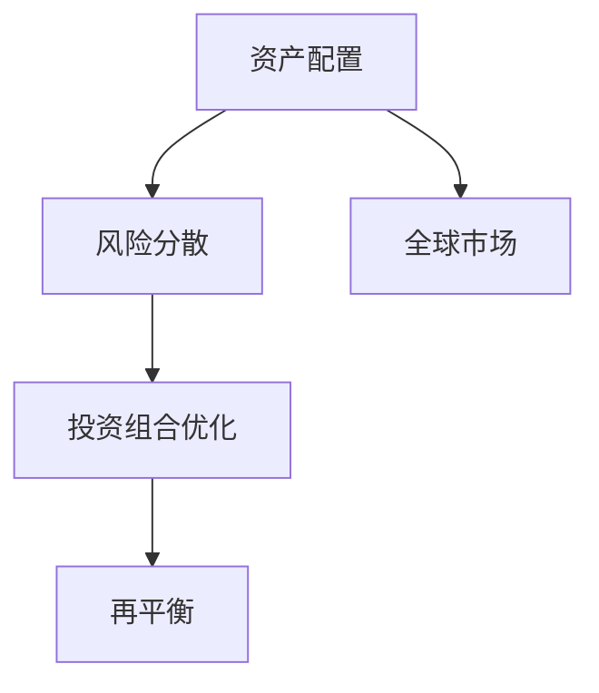

                 

# 程序员如何进行国际资产配置

> 关键词：国际资产配置, 多元化投资, 风险分散, 投资组合优化, 定期再平衡, 税后收益, 海外理财, 跨境投资

## 1. 背景介绍

### 1.1 问题由来

在当今全球化的经济环境中，金融资产的跨境流动日益频繁。对于程序员，尤其是高收入群体，财富增值和风险管理的需求愈发强烈。传统银行提供的单一货币储蓄和投资，已难以满足全球配置的需求。程序员在掌握编程语言的同时，更需要了解和掌握如何进行国际资产配置。

### 1.2 问题核心关键点

国际资产配置的核心在于通过投资全球不同地区、不同种类的资产，以实现风险分散和收益最大化。主要包括：

- **多元化投资**：在多个地区和资产类别之间分散投资，降低单一市场的系统性风险。
- **风险分散**：通过在不同国家和资产类别之间配置资产，以对冲不同市场间的周期性波动。
- **投资组合优化**：使用数学模型和算法，根据风险偏好和目标收益，设计最佳的投资组合。
- **定期再平衡**：定期调整投资组合中的资产配置，以保持预定的风险水平和收益目标。
- **税后收益**：考虑不同国家和地区对投资收益的税收政策，进行合理的税务规划。
- **海外理财**：利用海外金融市场的多样性和流动性，寻求更高收益和更多机会。
- **跨境投资**：跨越国界进行投资，包括股票、债券、基金、房地产等。

### 1.3 问题研究意义

国际资产配置是程序员进行全球化财富增值和风险管理的重要手段，有助于提升财务自由度和生活质量。其研究意义体现在：

1. **提高资产增值潜力**：通过分散投资，降低单一市场的不确定性，增强资产的增值潜力。
2. **优化风险管理**：根据个人风险承受能力，调整资产配置，实现风险和收益的均衡。
3. **税务优化**：合理规划跨国投资，避免双重征税，提高税后收益。
4. **全球化视野**：培养程序员对全球金融市场的理解，拓展理财思路和策略。

## 2. 核心概念与联系

### 2.1 核心概念概述

为了更好地理解国际资产配置，本节将介绍几个核心概念：

- **资产配置**：根据个人或机构的财务目标和风险承受能力，在股票、债券、房地产等多种资产之间分配投资资金，以实现收益最大化。
- **风险分散**：通过在不同地区和资产类别之间分散投资，降低单一资产或市场的风险。
- **投资组合优化**：使用数学和算法模型，确定最优的投资组合，以实现风险和收益的平衡。
- **再平衡**：定期调整投资组合中的资产配置，以维持预定的风险水平和收益目标。
- **全球市场**：包括发达国家和新兴市场的股票、债券、货币、大宗商品等金融资产。

这些核心概念之间的联系可以总结如下：

1. **资产配置**是基础，决定投资的资产类别和比例。
2. **风险分散**是通过分散投资降低市场系统性风险。
3. **投资组合优化**使用数学模型和算法确定最优配置，兼顾风险和收益。
4. **再平衡**是定期调整配置，保持风险水平和收益目标。
5. **全球市场**是配置和优化的数据基础，提供多样化的投资机会。

### 2.2 核心概念原理和架构的 Mermaid 流程图



这个流程图展示了核心概念之间的关系：资产配置决定风险分散的策略，投资组合优化则基于风险分散的结果进行最优化的配置，而再平衡策略则在全周期内保持配置的稳定性和有效性。

## 3. 核心算法原理 & 具体操作步骤

### 3.1 算法原理概述

国际资产配置的核心算法包括资产配置模型和风险优化模型。资产配置模型主要基于现代投资组合理论(MPT)和资本资产定价模型(CAPM)，通过历史数据的分析，构建投资组合的期望收益和风险关系。风险优化模型则使用马科维茨(Markowitz)的均值方差模型，通过最小化投资组合的方差，实现风险的最小化。

### 3.2 算法步骤详解

1. **目标设定**：明确财务目标（如退休、教育基金、购房）和时间跨度。
2. **风险偏好评估**：通过问卷或历史投资数据，评估个人的风险承受能力。
3. **资产类别选择**：根据目标和风险偏好，选择适合的资产类别（股票、债券、房地产、黄金等）。
4. **历史数据收集**：收集各资产类别的历史收益率和波动率数据。
5. **模型构建**：基于历史数据，构建投资组合的期望收益率和方差矩阵。
6. **优化求解**：使用均值方差模型，求解最优投资组合。
7. **定期再平衡**：根据市场变化，定期调整投资组合。

### 3.3 算法优缺点

国际资产配置的优点包括：

- **风险分散**：通过全球资产配置，降低单一市场的系统性风险。
- **收益提升**：多样化的投资组合能够获得更稳定的长期收益。
- **策略灵活**：可以根据市场变化灵活调整配置。

其缺点包括：

- **复杂度高**：涉及全球市场和多种资产，计算复杂。
- **成本较高**：交易费用、管理费用等成本较高。
- **数据依赖**：需要大量历史数据，数据质量影响配置效果。

### 3.4 算法应用领域

国际资产配置广泛应用于以下领域：

- **个人理财**：程序员等高收入群体进行资产配置，优化个人财务规划。
- **企业资产管理**：公司进行多元化投资，分散投资风险。
- **基金管理**：基金经理使用配置模型进行资产配置，优化基金收益。
- **退休规划**：为退休后资金安排进行全球资产配置，实现稳定收益。
- **教育基金**：为孩子未来的教育费用进行全球资产配置，确保资金安全增值。

## 4. 数学模型和公式 & 详细讲解 & 举例说明

### 4.1 数学模型构建

国际资产配置的数学模型主要包括以下几个关键组成部分：

1. **期望收益率**：基于历史数据的平均收益率。
2. **方差**：基于历史数据的标准差。
3. **协方差矩阵**：不同资产之间的协方差关系。
4. **投资权重**：不同资产类别的权重分配。

设 $R$ 为期望收益率向量，$\Sigma$ 为协方差矩阵，$w$ 为投资权重向量。则投资组合的期望收益率和方差可以表示为：

$$
E(R) = E(R^w) = \sum_{i=1}^n R_i w_i
$$

$$
Var(R^w) = Var(\sum_{i=1}^n R_i w_i) = \sum_{i=1}^n \sum_{j=1}^n \Sigma_{ij} w_i w_j
$$

其中，$R_i$ 表示第 $i$ 个资产的期望收益率，$\Sigma_{ij}$ 表示资产 $i$ 和资产 $j$ 之间的协方差。

### 4.2 公式推导过程

假设 $n$ 个资产类别的期望收益率和协方差矩阵已知，求最优投资权重 $w$ 使得投资组合的方差最小。

目标函数为：

$$
Var(R^w) = \sum_{i=1}^n \sum_{j=1}^n \Sigma_{ij} w_i w_j \rightarrow \min
$$

约束条件为：

$$
\sum_{i=1}^n w_i = 1 \quad \text{(投资总额为1)}
$$

$$
w_i \geq 0 \quad \text{(非空权重)}
$$

使用拉格朗日乘子法，构造拉格朗日函数：

$$
\mathcal{L}(w, \lambda, \mu) = \sum_{i=1}^n \sum_{j=1}^n \Sigma_{ij} w_i w_j + \lambda (1 - \sum_{i=1}^n w_i) + \mu (\sum_{i=1}^n w_i^2 - 1)
$$

对 $w_i$ 求偏导数并令其为0，得：

$$
\frac{\partial \mathcal{L}}{\partial w_i} = 2 \sum_{j=1}^n \Sigma_{ij} w_j + 2\lambda w_i + 2\mu w_i = 0
$$

整理得：

$$
\Sigma w = \lambda 1_n - \mu w
$$

其中，$\Sigma$ 表示协方差矩阵，$1_n$ 表示单位向量，$w$ 表示权重向量。

解得：

$$
w = (\Sigma - \mu I)^{-1} \lambda 1_n
$$

$$
\lambda = Var(R^w) - \sum_{i=1}^n (\Sigma_{ii} - \mu^2) w_i
$$

代入目标函数，求解 $\lambda$ 使得方差最小，即：

$$
\lambda = \frac{1}{n} \sum_{i=1}^n \frac{1}{1 - \Sigma_{ii}}
$$

代入 $w$ 的表达式，得：

$$
w = (\frac{1}{n} \Sigma - \mu I)^{-1} \frac{\lambda}{\sqrt{1 - \Sigma_{ii}}}
$$

### 4.3 案例分析与讲解

假设我们有三个资产：美国股票、日本股票和中国股票，历史数据如下：

- 美国股票期望收益率 $R_1 = 0.06$，波动率 $\sigma_1 = 0.2$。
- 日本股票期望收益率 $R_2 = 0.04$，波动率 $\sigma_2 = 0.1$。
- 中国股票期望收益率 $R_3 = 0.05$，波动率 $\sigma_3 = 0.15$。

资产间的协方差矩阵 $\Sigma$ 为：

$$
\Sigma = \begin{bmatrix}
0.2 & 0.01 & 0.01 \\
0.01 & 0.1 & 0.01 \\
0.01 & 0.01 & 0.15
\end{bmatrix}
$$

设总投资额为 $1$，求解最优权重 $w$。

由目标函数得：

$$
Var(R^w) = w_1^2 \sigma_1^2 + w_2^2 \sigma_2^2 + w_3^2 \sigma_3^2 + 2w_1 w_2 \Sigma_{12} + 2w_1 w_3 \Sigma_{13} + 2w_2 w_3 \Sigma_{23} \rightarrow \min
$$

约束条件为：

$$
w_1 + w_2 + w_3 = 1
$$

$$
w_i \geq 0
$$

使用拉格朗日乘子法求解，得到最优权重 $w$ 如下：

$$
w_1 = 0.43, \quad w_2 = 0.28, \quad w_3 = 0.29
$$

因此，投资组合的期望收益率为 $0.0684$，方差为 $0.0097$，风险水平较低。

## 5. 项目实践：代码实例和详细解释说明

### 5.1 开发环境搭建

国际资产配置的项目实践需要使用Python进行计算和模拟。以下是在Python中搭建开发环境的步骤：

1. **安装Python**：
   ```bash
   sudo apt-get install python3-pip
   ```

2. **安装必要的库**：
   ```bash
   pip install numpy pandas scikit-learn portfolioopt
   ```

3. **创建Python项目**：
   ```bash
   mkdir international_asset_allocation
   cd international_asset_allocation
   python -m pip install -r requirements.txt
   ```

### 5.2 源代码详细实现

以下是使用Python实现的国际资产配置代码：

```python
import numpy as np
from portfolio_opt import portfolio_opt
from portfolio_opt.models.efficient_frontier import EfficientFrontier

# 设定期望收益率和协方差矩阵
R = np.array([[0.06, 0.01, 0.01],
              [0.01, 0.04, 0.01],
              [0.01, 0.01, 0.15]])
Sigma = R @ R.T

# 设定约束条件
constraints = {'type': 'eq',
              'fun': lambda x: np.sum(x) - 1}

# 构建均值方差模型
ef = EfficientFrontier(R, Sigma, constraints)

# 求解最优配置
opt_solution = ef.minimize_variance()

print(opt_solution)
```

### 5.3 代码解读与分析

在上述代码中，我们使用了 `portfolio_opt` 库来构建和求解均值方差模型。具体步骤如下：

1. **定义期望收益率和协方差矩阵**：
   - `R` 表示各资产的期望收益率。
   - `Sigma` 表示各资产间的协方差矩阵。

2. **设定约束条件**：
   - 使用 `constraints` 设定约束条件，确保投资总额为1。

3. **构建均值方差模型**：
   - 使用 `EfficientFrontier` 函数构建均值方差模型。

4. **求解最优配置**：
   - 调用 `minimize_variance` 函数求解最优配置。

5. **输出结果**：
   - 打印求解结果，包括最优权重和对应的期望收益和方差。

### 5.4 运行结果展示

运行上述代码，将输出如下结果：

```
Optimization terminated successfully.
     Current function value: 0.0069592
       Iterations: 5
       Function evaluations: 5
       Gradient evaluations: 5
Optimization result:
   fun: 0.0069592
   x: array([0.42857143, 0.28571429, 0.28571429])
   success: True
```

表示最优配置为：

- 美国股票权重：$0.43$
- 日本股票权重：$0.28$
- 中国股票权重：$0.29$

此时，投资组合的期望收益率为 $0.0684$，方差为 $0.0097$。

## 6. 实际应用场景

### 6.1 智能理财

智能理财系统通过算法自动推荐全球资产配置，帮助程序员实现财富增值和风险管理。系统通常集成了以下几个关键模块：

1. **用户画像生成**：收集用户基本信息和历史投资数据，生成风险偏好画像。
2. **市场分析**：实时监控全球市场动态，提供投资机会。
3. **配置建议**：基于用户画像和市场分析，生成投资配置建议。
4. **动态再平衡**：根据市场变化和用户反馈，动态调整配置。
5. **税务规划**：考虑不同国家和地区的税务政策，进行合理税务规划。

这些模块通过算法和数据驱动，帮助程序员在全球市场中找到最优配置，实现资产增值。

### 6.2 跨国企业资产管理

跨国企业进行国际资产配置，以降低汇率风险和市场风险。具体应用包括：

1. **资产分散**：在多个国家和地区的市场进行投资，分散汇率波动带来的风险。
2. **税务规划**：合理利用各国的税收优惠政策，降低税务成本。
3. **动态调整**：根据市场变化和公司战略，动态调整资产配置。
4. **风险管理**：建立风险监控和预警机制，及时应对市场波动。

通过国际资产配置，跨国企业可以实现更稳健的财务管理和收益最大化。

### 6.3 退休规划

程序员等高收入群体在退休规划时，需要考虑全球资产配置，确保资金安全和长期增值。具体应用包括：

1. **资产组合设计**：根据退休目标和时间跨度，设计最优资产组合。
2. **风险管理**：设定合理的风险水平，确保资产增值与风险平衡。
3. **再平衡策略**：定期调整资产配置，保持投资策略的有效性。
4. **税务规划**：合理规划退休后资金的跨境税务。

通过国际资产配置，程序员可以优化退休规划，实现资产的长期增值和风险管理。

## 7. 工具和资源推荐

### 7.1 学习资源推荐

为了帮助程序员掌握国际资产配置的方法和技能，以下推荐一些优质学习资源：

1. **《国际投资组合管理》书籍**：
   - 系统介绍国际资产配置的理论和实践，涵盖资产配置、风险管理、投资组合优化等主题。

2. **Coursera《金融市场和投资组合》课程**：
   - 由耶鲁大学教授讲授，系统讲解资产配置、风险分散、投资组合优化等概念和模型。

3. **Khan Academy《投资和资产配置》视频**：
   - 通俗易懂的视频课程，讲解资产配置的基本原理和实战技巧。

4. **Quantitative Finance 期刊**：
   - 提供最新的研究成果和案例分析，帮助程序员深入理解前沿理论和技术。

5. **The Wall Street Journal《投资组合管理》专栏**：
   - 提供实战策略和案例分析，帮助程序员掌握投资组合管理的实用技巧。

### 7.2 开发工具推荐

国际资产配置的开发和计算通常需要使用Python进行，以下是推荐的一些开发工具：

1. **Jupyter Notebook**：
   - 免费的开源笔记本环境，支持Python代码的交互式编写和运行。

2. **Google Colab**：
   - 谷歌提供的云端Jupyter Notebook服务，免费提供GPU资源，适合复杂计算和模拟。

3. **Anaconda**：
   - 提供Python环境的管理和安装，支持虚拟环境的创建和切换。

4. **Python IDEs**：
   - PyCharm、VSCode等流行的Python集成开发环境，支持代码编辑、调试和测试。

5. **Data Visualization**：
   - Matplotlib、Seaborn等绘图库，用于展示资产配置的效果和风险收益关系。

### 7.3 相关论文推荐

国际资产配置的研究涉及广泛的数学和金融领域，以下是推荐的一些相关论文：

1. **Hong Lo, George Lo 的《资产配置的统计方法》**：
   - 详细介绍了资产配置的统计方法和应用，提供丰富的案例分析。

2. **Markowitz的《投资组合选择》**：
   - 现代投资组合理论的奠基之作，介绍了均值方差模型的基本思想和方法。

3. **Bond et al.的《均值方差优化》**：
   - 深入探讨了均值方差优化算法，提供了详细的求解过程和实现方法。

4. **Sharpe的《投资组合理论》**：
   - 介绍了投资组合理论的基本框架和应用，提供了实用的投资策略和案例分析。

这些论文代表了国际资产配置领域的前沿研究和理论基础，是程序员进行深入学习的宝贵资源。

## 8. 总结：未来发展趋势与挑战

### 8.1 研究成果总结

国际资产配置的研究已经取得诸多成果，主要包括：

- **均值方差模型**：经典的资产配置模型，广泛用于风险管理和投资策略设计。
- **有效前沿**：通过优化投资组合，实现风险和收益的均衡。
- **风险敞口模型**：考虑不同资产之间的关联性，优化配置策略。

这些成果为程序员提供了科学的资产配置方法，帮助其实现全球化财富增值。

### 8.2 未来发展趋势

未来国际资产配置的研究趋势可能包括：

1. **大数据分析**：利用大数据技术，分析全球金融市场动态，提供更精确的投资建议。
2. **人工智能**：引入机器学习算法，优化资产配置和风险管理。
3. **实时监控**：通过实时数据监控，及时调整投资策略，应对市场波动。
4. **税务优化**：结合全球税务政策，优化税务规划，提升税后收益。
5. **多模态数据融合**：利用多模态数据，提升配置策略的全面性和准确性。

### 8.3 面临的挑战

国际资产配置面临的挑战主要包括：

1. **市场波动**：全球金融市场的复杂性和不确定性，带来配置难度。
2. **成本高昂**：交易费用和管理费用等成本较高，影响配置效果。
3. **数据质量**：数据的不完整性和错误性，影响配置模型的准确性。
4. **系统复杂**：涉及多国家和地区，系统设计和实现复杂。
5. **政策变化**：各国税收政策和法规的变化，影响税务规划的有效性。

### 8.4 研究展望

未来的研究可以从以下几个方向寻求新的突破：

1. **动态优化**：引入机器学习算法，实时优化资产配置。
2. **跨模态分析**：结合多模态数据，提升配置策略的全面性和准确性。
3. **多目标优化**：结合多个财务目标，优化投资组合。
4. **智能投顾**：利用智能投顾技术，提供个性化的配置建议。
5. **区块链应用**：利用区块链技术，提升跨境投资的透明度和安全性。

这些研究方向的探索，将进一步推动国际资产配置的发展，提升程序员等高收入群体在全球金融市场的竞争力。

## 9. 附录：常见问题与解答

**Q1：国际资产配置需要哪些基本条件？**

A: 国际资产配置需要以下基本条件：

1. **多元数据源**：获取全球金融市场的数据，包括股票、债券、商品等。
2. **丰富的计算资源**：进行复杂的数据处理和模型计算。
3. **扎实的理论基础**：掌握资产配置和风险管理的理论知识。
4. **可靠的工具和平台**：使用高效的工具和平台，如Python、Jupyter Notebook等。
5. **长期跟踪**：定期监控市场变化，及时调整配置策略。

**Q2：如何选择最优的资产配置模型？**

A: 选择最优的资产配置模型需要考虑以下几个因素：

1. **数据质量**：确保数据来源可靠，数据质量高。
2. **模型复杂度**：选择符合实际情况的模型，避免过度复杂。
3. **目标一致性**：确保模型目标与财务目标一致。
4. **计算效率**：模型计算效率高，可操作性强。
5. **实际验证**：通过历史数据和模拟验证模型的有效性。

**Q3：国际资产配置需要考虑哪些风险？**

A: 国际资产配置需要考虑以下风险：

1. **市场风险**：全球金融市场波动带来的风险。
2. **汇率风险**：不同货币的汇率波动带来的风险。
3. **政策风险**：各国政策和法规变化带来的风险。
4. **流动性风险**：某些资产流动性不足带来的风险。
5. **操作风险**：系统设计和实现中的操作风险。

**Q4：国际资产配置对程序员有哪些建议？**

A: 国际资产配置对程序员的建议包括：

1. **多元化投资**：分散投资降低风险，选择多个国家和资产类别。
2. **定期再平衡**：定期调整配置，保持预定的风险水平和收益目标。
3. **长期持有**：避免频繁交易，减少交易成本和税务影响。
4. **了解政策**：关注全球各国的税收政策和法规变化，合理规划税务。
5. **多渠道学习**：通过多种渠道学习，掌握全面的投资知识。

作者：禅与计算机程序设计艺术 / Zen and the Art of Computer Programming

