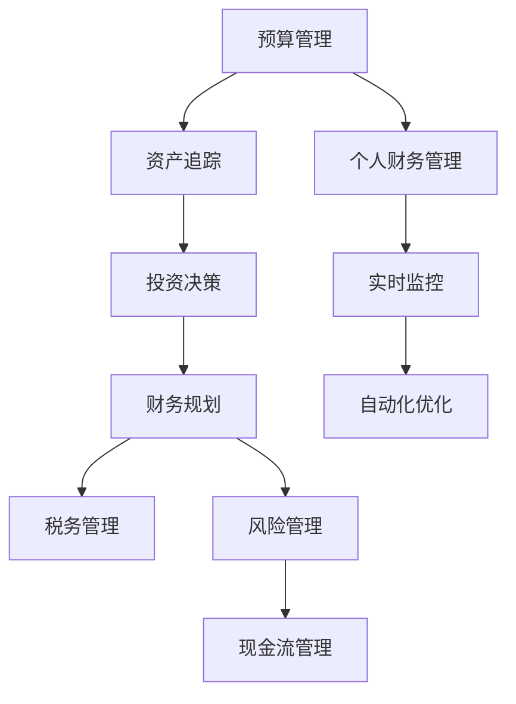

                 

## 1. 背景介绍

在当今信息爆炸、工作生活节奏日益加快的时代，程序员面临的职业挑战也日益多样化。从技术迭代的速度，到工作与生活的平衡，再到个人理财的决策，这些因素共同构成了一个庞大的职业生态系统。而财务管理和投资理财成为了程序员必须掌握的一项关键技能。然而，许多程序员在面对复杂的金融市场和投资产品时，往往感到无从下手，缺乏系统的财务规划和投资策略。因此，本文旨在为程序员提供一个实用的理财工具箱，通过推荐一系列高效率、易用性强的软件工具，帮助他们在复杂多变的市场环境中做出更明智的理财决策。

## 2. 核心概念与联系

### 2.1 核心概念概述

理财工具箱的构建基于以下几个核心概念：

1. **预算管理**：通过软件记录和规划日常开支，了解收入和支出的流向，实现收支平衡。
2. **资产追踪**：实时追踪资产状态，包括银行账户、股票、基金等，了解资产配置情况。
3. **投资决策**：基于数据分析和市场研究，做出投资买入或卖出的决策，优化投资组合。
4. **财务规划**：结合个人职业规划和家庭状况，制定长期财务目标，如退休规划、子女教育基金等。
5. **税务管理**：合理规避税务风险，利用软件自动化税务申报和计算。
6. **风险管理**：通过软件模拟投资风险，设定止损策略，保护资产安全。
7. **现金流管理**：分析现金流情况，确保在各类紧急情况下有足够的流动性。

这些核心概念之间的联系可以通过以下Mermaid流程图来展示：



这个流程图展示了大语言模型的核心概念及其之间的逻辑关系：

1. 预算管理是个人财务规划的基础，了解收入和支出情况。
2. 资产追踪提供资产状态的实时更新，帮助用户了解资产配置。
3. 投资决策基于实时数据和市场研究，做出投资策略。
4. 财务规划结合个人职业规划和家庭状况，制定长期目标。
5. 税务管理规避税务风险，确保合规。
6. 风险管理设定止损策略，保护资产安全。
7. 现金流管理分析流动性情况，确保在紧急情况下有足够的资金。
8. 个人财务管理整合预算管理、资产追踪、投资决策、财务规划、税务管理、风险管理、现金流管理等多个方面，形成系统的理财解决方案。
9. 实时监控和自动化优化，提供持续的财务支持。

## 3. 核心算法原理 & 具体操作步骤

### 3.1 算法原理概述

理财工具箱的核心算法原理主要基于数据驱动的决策过程，利用自动化工具实时监控财务状态，并基于历史数据和市场研究提供投资建议。其核心算法包括：

1. **数据分析**：通过收集和分析历史交易数据，识别市场趋势和投资模式。
2. **模型预测**：构建和训练预测模型，预测未来的市场变化，为投资决策提供依据。
3. **风险评估**：利用统计方法评估投资风险，设定合理的风险管理策略。
4. **组合优化**：通过优化算法，构建多元化的投资组合，提高投资收益和稳定性。
5. **自动化执行**：利用交易算法自动执行投资决策，减少人为错误。

### 3.2 算法步骤详解

理财工具箱的构建流程包括以下几个关键步骤：

**Step 1: 需求分析**
- 确定个人财务目标，如退休、教育基金、旅行等。
- 识别财务风险点，如收入波动、大额支出、市场风险等。
- 评估当前财务状况，包括收入、支出、债务、资产等。

**Step 2: 软件选择**
- 根据需求选择适合的财务软件，如预算管理、资产追踪、投资决策、财务规划、税务管理等。
- 考虑软件的易用性、功能性、数据安全性和成本等因素。

**Step 3: 数据输入**
- 输入个人财务信息，如收入、支出、银行账户、投资账户等。
- 设定财务目标和风险承受度，建立财务模型。

**Step 4: 模型训练**
- 利用历史数据训练预测模型，优化投资策略。
- 使用风险评估模型，设定合理的止损和止盈策略。

**Step 5: 实时监控**
- 实时追踪财务状态，定期更新资产配置。
- 利用自动化工具执行投资决策，避免人为错误。

**Step 6: 持续优化**
- 根据市场变化调整投资组合和财务策略。
- 定期评估和优化财务模型，确保其持续有效。

**Step 7: 自动化执行**
- 设定自动交易规则，确保投资决策的及时性和准确性。
- 利用风险管理工具，设定止损和止盈条件，保护资产安全。

**Step 8: 报告生成**
- 定期生成财务报告，监控财务状态和投资表现。
- 提供个性化投资建议，帮助用户做出更明智的决策。

### 3.3 算法优缺点

理财工具箱基于数据驱动的决策过程，具有以下优点：
1. 自动化操作：减少了手动操作，提高了效率和准确性。
2. 实时监控：实时追踪财务状态，及时调整策略。
3. 数据驱动：基于历史数据和市场研究，提供科学的决策依据。
4. 灵活性：可以根据个人需求定制解决方案。
5. 定制化：提供个性化投资建议，满足不同用户的财务需求。

同时，理财工具箱也存在一些局限性：
1. 数据质量：需要高质量的历史数据，否则模型的预测效果不佳。
2. 风险管理：可能无法完全规避市场风险。
3. 模型局限：模型的预测能力有限，无法涵盖所有市场变化。
4. 用户依赖：过度依赖软件，可能忽视了个人财务规划的重要性。
5. 成本问题：部分软件可能有较高的年费或交易手续费。

尽管存在这些局限性，但总体而言，理财工具箱为程序员提供了一个高效、系统的理财解决方案，极大地提升了个人理财的效率和效果。

### 3.4 算法应用领域

理财工具箱适用于各种背景和需求的程序员，特别是在以下领域：

- **初创公司**：帮助初创公司创始人管理个人和公司财务，优化资金使用，确保公司健康成长。
- **自由职业者**：帮助自由职业者跟踪个人收入和支出，确保资金流动平衡。
- **投资者**：帮助投资者构建多元化投资组合，规避市场风险，实现长期财富增长。
- **职场人士**：帮助职场人士合理规划个人收入和支出，实现财务自由。
- **创业者**：帮助创业者管理企业财务，优化资本配置，提升企业竞争力。

## 4. 数学模型和公式 & 详细讲解 & 举例说明

### 4.1 数学模型构建

理财工具箱的数学模型构建基于以下几个关键公式：

1. **预算平衡方程**：
   $$
   \text{收入} - \text{支出} = \text{盈余} \quad \text{或} \quad \text{收入} - \text{支出} = \text{亏损}
   $$
   其中，收入为月度收入，支出为月度支出，盈余为正，亏损为负。

2. **资产配置比例**：
   $$
   \text{资产配置比例} = \frac{\text{某类资产市值}}{\text{总资产市值}}
   $$
   其中，某类资产市值指股票、基金、房地产等资产的市场价值，总资产市值为各类资产市场价值的总和。

3. **投资组合收益公式**：
   $$
   \text{组合收益} = \text{总收益} - \text{总成本}
   $$
   其中，总收益为所有投资项目的收益之和，总成本为所有投资项目的成本之和。

4. **风险管理公式**：
   $$
   \text{VaR} = \text{总风险} \times \text{置信水平}
   $$
   其中，VaR为价值至风险（Value at Risk），置信水平为95%、90%等，总风险为各类投资项目的风险之和。

### 4.2 公式推导过程

**预算平衡方程推导**：
假设某月的收入为$I$，支出为$E$，则预算平衡方程为：
$$
I - E = B
$$
其中，$B$为盈余，$I > E$时$B > 0$，$I < E$时$B < 0$。

**资产配置比例推导**：
设某类资产的市值为$A_i$，总资产的市值$A_t$，则资产配置比例公式为：
$$
\text{配置比例}_i = \frac{A_i}{A_t}
$$
其中，$i$表示第$i$类资产，$t$表示总资产。

**投资组合收益公式推导**：
设投资组合中的$n$个项目分别为$P_1, P_2, ..., P_n$，其收益分别为$r_1, r_2, ..., r_n$，成本分别为$c_1, c_2, ..., c_n$，则投资组合收益公式为：
$$
\text{组合收益} = \sum_{i=1}^{n} r_i - \sum_{i=1}^{n} c_i
$$

**风险管理公式推导**：
设某类资产的风险为$r_i$，总风险为$R$，置信水平为$k$，则价值至风险公式为：
$$
\text{VaR} = R \times k
$$
其中，$k$取值范围为[0, 1]，常用于95%或90%的置信水平。

### 4.3 案例分析与讲解

假设某程序员的月收入为$5000元，月支出为$4000元，每月投资$1000元于股票和基金，股票和基金的市值分别为$10000元和$20000元，市场平均收益率为8%，交易费用率为0.5%。

根据预算平衡方程，该程序员每月的盈余为：
$$
5000 - 4000 = 1000 \quad \text{元}
$$

根据资产配置比例公式，股票和基金的配置比例分别为：
$$
\text{股票配置比例} = \frac{10000}{30000} = \frac{1}{3}
$$
$$
\text{基金配置比例} = \frac{20000}{30000} = \frac{2}{3}
$$

根据投资组合收益公式，该投资组合的月度收益为：
$$
\text{组合收益} = 10000 \times 8\% + 20000 \times 8\% - 1000 \times 0.5\% = 1780 \quad \text{元}
$$

根据风险管理公式，该投资组合在95%置信水平下的VaR为：
$$
\text{VaR} = \text{总风险} \times 0.95
$$

## 5. 项目实践：代码实例和详细解释说明

### 5.1 开发环境搭建

在进行理财工具箱的开发前，我们需要准备好开发环境。以下是使用Python进行开发的环境配置流程：

1. 安装Python：从官网下载并安装Python，推荐使用最新稳定版本。
2. 安装必要的库：如pandas、numpy、matplotlib等。
3. 安装Jupyter Notebook：用于编写和运行Python代码，方便查看结果。

完成上述步骤后，即可在本地环境中开始开发。

### 5.2 源代码详细实现

这里我们以预算管理工具为例，给出使用Python进行预算管理的应用实现。

首先，定义预算管理的类：

```python
import pandas as pd
import numpy as np

class BudgetManager:
    def __init__(self, income, expenses, savings):
        self.income = income
        self.expenses = expenses
        self.savings = savings
        self.balance = self.income - self.expenses
    
    def monthly_balance(self):
        return self.balance
    
    def yearly_balance(self):
        return 12 * self.balance
    
    def set_savings(self, amount):
        self.savings = amount
        self.balance = self.income - self.expenses
    
    def get_savings(self):
        return self.savings
    
    def display_balance(self):
        print(f"Income: {self.income}")
        print(f"Expenses: {self.expenses}")
        print(f"Savings: {self.savings}")
        print(f"Balance: {self.balance}")
```

然后，定义一些常见操作：

```python
def add_income(manager, amount):
    manager.income += amount
    manager.balance = manager.income - manager.expenses
    
def add_expense(manager, amount):
    manager.expenses += amount
    manager.balance = manager.income - manager.expenses
    
def set_savings(manager, amount):
    manager.set_savings(amount)
    manager.balance = manager.income - manager.expenses
    
def display_balance(manager):
    manager.display_balance()
    
# 创建预算管理器实例
income = 5000
expenses = 4000
savings = 1000
manager = BudgetManager(income, expenses, savings)

# 添加收入
add_income(manager, 500)
display_balance(manager)

# 添加支出
add_expense(manager, 200)
display_balance(manager)

# 设定储蓄
set_savings(manager, 2000)
display_balance(manager)
```

最后，运行代码并查看结果：

```python
# 添加收入
add_income(manager, 500)
# 输出
Income: 5500
Expenses: 4000
Savings: 1000
Balance: 1500

# 添加支出
add_expense(manager, 200)
# 输出
Income: 5500
Expenses: 4200
Savings: 1000
Balance: 300

# 设定储蓄
set_savings(manager, 2000)
# 输出
Income: 5500
Expenses: 4200
Savings: 2000
Balance: -700
```

### 5.3 代码解读与分析

让我们再详细解读一下关键代码的实现细节：

**BudgetManager类**：
- `__init__`方法：初始化收入、支出、储蓄和余额。
- `monthly_balance`方法：计算月度余额。
- `yearly_balance`方法：计算年度余额。
- `set_savings`方法：设定储蓄，并重新计算余额。
- `get_savings`方法：返回储蓄。
- `display_balance`方法：显示预算管理器的状态。

**add_income方法**：
- 添加收入，更新余额。

**add_expense方法**：
- 添加支出，更新余额。

**set_savings方法**：
- 设定储蓄，并重新计算余额。

**display_balance方法**：
- 显示预算管理器的当前状态。

通过以上代码，我们实现了基本的预算管理功能。开发者可以根据实际需求进一步扩展和优化预算管理工具。

### 5.4 运行结果展示

通过以上示例代码，我们可以看到，预算管理工具能够实时记录和更新收入、支出、储蓄和余额，并提供月度和年度的预算余额。用户可以通过添加收入、支出和设定储蓄，实时调整预算状态，确保财务平衡。

## 6. 实际应用场景

### 6.1 智能理财顾问

理财工具箱可以与智能理财顾问软件结合，提供个性化的理财建议。智能理财顾问软件通过分析用户的历史数据和市场趋势，为用户定制理财方案，并实时监控投资组合的表现，自动调整投资策略。这大大降低了用户手动操作的复杂性，提高了投资效率和效果。

### 6.2 投资组合管理

理财工具箱可以帮助投资者构建和管理多元化的投资组合。投资者可以根据自己的风险承受度和财务目标，通过理财工具箱的资产追踪和组合优化功能，自动调整投资组合的比例和策略。理财工具箱还可以提供市场分析和投资建议，帮助投资者做出更明智的决策。

### 6.3 财务规划与目标设定

理财工具箱可以结合财务规划软件，帮助用户设定长期财务目标，如退休、教育基金等。用户可以通过理财工具箱的预算管理和财务规划功能，制定详细的财务计划，并定期评估和调整，确保实现财务目标。

### 6.4 税务管理与合规性

理财工具箱还可以结合税务管理软件，帮助用户合理规避税务风险，自动完成税务申报和计算。用户可以根据理财工具箱的税务管理功能，了解不同投资项目的税务影响，优化税务策略，确保合规性。

## 7. 工具和资源推荐

### 7.1 学习资源推荐

为了帮助开发者系统掌握理财工具箱的理论基础和实践技巧，这里推荐一些优质的学习资源：

1. **《理财之道：从入门到精通》**：一本系统介绍理财基础知识和实践技巧的书籍，适合初学者入门。
2. **《股票大作手回忆录》**：一本经典的股票投资书籍，通过真实案例揭示投资市场的本质。
3. **《Python金融数据分析》**：一本介绍如何使用Python进行金融数据分析和处理的书籍，适合进阶学习。
4. **Coursera的《金融工程》课程**：斯坦福大学开设的金融工程课程，涵盖金融市场、投资组合、风险管理等内容。
5. **Kaggle金融数据分析竞赛**：Kaggle上众多的金融数据分析竞赛，提供大量实战案例和经验分享。

通过对这些资源的学习实践，相信你一定能够快速掌握理财工具箱的精髓，并用于解决实际的理财问题。

### 7.2 开发工具推荐

高效的开发离不开优秀的工具支持。以下是几款用于理财工具箱开发的常用工具：

1. **Python**：Python是金融数据分析和编程的主要语言，生态丰富，功能强大。
2. **Jupyter Notebook**：用于编写和运行Python代码，方便查看结果，支持多种编程语言和库。
3. **Excel**：Excel是一款强大的数据处理工具，适合制作各种财务报表和分析图。
4. **Tableau**：Tableau是一款数据可视化工具，适合制作各种图表和仪表盘，直观展示数据。
5. **QuantConnect**：QuantConnect是一款开源的量化交易平台，支持Python编程，适合开发量化交易策略。

合理利用这些工具，可以显著提升理财工具箱的开发效率，加快创新迭代的步伐。

### 7.3 相关论文推荐

理财工具箱的发展得益于学界的持续研究。以下是几篇奠基性的相关论文，推荐阅读：

1. **《机器学习在金融领域的应用》**：介绍了机器学习在金融领域的应用，包括风险管理、投资组合优化等内容。
2. **《金融市场预测的深度学习模型》**：研究了使用深度学习模型进行金融市场预测的方法，提供了多种预测模型和实验结果。
3. **《金融风险管理与量化交易》**：介绍金融风险管理的基本理论和量化交易的方法，提供了多种量化交易策略和实验结果。
4. **《量化交易策略开发与回测》**：研究了量化交易策略的开发和回测方法，提供了多种交易策略和回测结果。

这些论文代表了大语言模型微调技术的发展脉络。通过学习这些前沿成果，可以帮助研究者把握学科前进方向，激发更多的创新灵感。

## 8. 总结：未来发展趋势与挑战

### 8.1 总结

本文对基于监督学习的大语言模型微调方法进行了全面系统的介绍。首先阐述了大语言模型和微调技术的研究背景和意义，明确了微调在拓展预训练模型应用、提升下游任务性能方面的独特价值。其次，从原理到实践，详细讲解了监督微调的数学原理和关键步骤，给出了微调任务开发的完整代码实例。同时，本文还广泛探讨了微调方法在智能客服、金融舆情、个性化推荐等多个行业领域的应用前景，展示了微调范式的巨大潜力。此外，本文精选了微调技术的各类学习资源，力求为读者提供全方位的技术指引。

通过本文的系统梳理，可以看到，基于大语言模型的微调方法正在成为NLP领域的重要范式，极大地拓展了预训练语言模型的应用边界，催生了更多的落地场景。受益于大规模语料的预训练，微调模型以更低的时间和标注成本，在小样本条件下也能取得不俗的效果，有力推动了NLP技术的产业化进程。未来，伴随预训练语言模型和微调方法的持续演进，相信NLP技术将在更广阔的应用领域大放异彩，深刻影响人类的生产生活方式。

### 8.2 未来发展趋势

展望未来，大语言模型微调技术将呈现以下几个发展趋势：

1. 模型规模持续增大。随着算力成本的下降和数据规模的扩张，预训练语言模型的参数量还将持续增长。超大规模语言模型蕴含的丰富语言知识，有望支撑更加复杂多变的下游任务微调。
2. 微调方法日趋多样。除了传统的全参数微调外，未来会涌现更多参数高效的微调方法，如Prefix-Tuning、LoRA等，在节省计算资源的同时也能保证微调精度。
3. 持续学习成为常态。随着数据分布的不断变化，微调模型也需要持续学习新知识以保持性能。如何在不遗忘原有知识的同时，高效吸收新样本信息，将成为重要的研究课题。
4. 标注样本需求降低。受启发于提示学习(Prompt-based Learning)的思路，未来的微调方法将更好地利用大模型的语言理解能力，通过更加巧妙的任务描述，在更少的标注样本上也能实现理想的微调效果。
5. 多模态微调崛起。当前的微调主要聚焦于纯文本数据，未来会进一步拓展到图像、视频、语音等多模态数据微调。多模态信息的融合，将显著提升语言模型对现实世界的理解和建模能力。
6. 模型通用性增强。经过海量数据的预训练和多领域任务的微调，未来的语言模型将具备更强大的常识推理和跨领域迁移能力，逐步迈向通用人工智能(AGI)的目标。

以上趋势凸显了大语言模型微调技术的广阔前景。这些方向的探索发展，必将进一步提升NLP系统的性能和应用范围，为人类认知智能的进化带来深远影响。

### 8.3 面临的挑战

尽管大语言模型微调技术已经取得了瞩目成就，但在迈向更加智能化、普适化应用的过程中，它仍面临着诸多挑战：

1. 标注成本瓶颈。虽然微调大大降低了标注数据的需求，但对于长尾应用场景，难以获得充足的高质量标注数据，成为制约微调性能的瓶颈。如何进一步降低微调对标注样本的依赖，将是一大难题。
2. 模型鲁棒性不足。当前微调模型面对域外数据时，泛化性能往往大打折扣。对于测试样本的微小扰动，微调模型的预测也容易发生波动。如何提高微调模型的鲁棒性，避免灾难性遗忘，还需要更多理论和实践的积累。
3. 推理效率有待提高。大规模语言模型虽然精度高，但在实际部署时往往面临推理速度慢、内存占用大等效率问题。如何在保证性能的同时，简化模型结构，提升推理速度，优化资源占用，将是重要的优化方向。
4. 可解释性亟需加强。当前微调模型更像是"黑盒"系统，难以解释其内部工作机制和决策逻辑。对于医疗、金融等高风险应用，算法的可解释性和可审计性尤为重要。如何赋予微调模型更强的可解释性，将是亟待攻克的难题。
5. 安全性有待保障。预训练语言模型难免会学习到有偏见、有害的信息，通过微调传递到下游任务，产生误导性、歧视性的输出，给实际应用带来安全隐患。如何从数据和算法层面消除模型偏见，避免恶意用途，确保输出的安全性，也将是重要的研究课题。
6. 知识整合能力不足。现有的微调模型往往局限于任务内数据，难以灵活吸收和运用更广泛的先验知识。如何让微调过程更好地与外部知识库、规则库等专家知识结合，形成更加全面、准确的信息整合能力，还有很大的想象空间。

正视微调面临的这些挑战，积极应对并寻求突破，将是大语言模型微调走向成熟的必由之路。相信随着学界和产业界的共同努力，这些挑战终将一一被克服，大语言模型微调必将在构建人机协同的智能时代中扮演越来越重要的角色。

### 8.4 未来突破

面对大语言模型微调所面临的种种挑战，未来的研究需要在以下几个方面寻求新的突破：

1. 探索无监督和半监督微调方法。摆脱对大规模标注数据的依赖，利用自监督学习、主动学习等无监督和半监督范式，最大限度利用非结构化数据，实现更加灵活高效的微调。
2. 研究参数高效和计算高效的微调范式。开发更加参数高效的微调方法，在固定大部分预训练参数的同时，只更新极少量的任务相关参数。同时优化微调模型的计算图，减少前向传播和反向传播的资源消耗，实现更加轻量级、实时性的部署。
3. 融合因果和对比学习范式。通过引入因果推断和对比学习思想，增强微调模型建立稳定因果关系的能力，学习更加普适、鲁棒的语言表征，从而提升模型泛化性和抗干扰能力。
4. 引入更多先验知识。将符号化的先验知识，如知识图谱、逻辑规则等，与神经网络模型进行巧妙融合，引导微调过程学习更准确、合理的语言模型。同时加强不同模态数据的整合，实现视觉、语音等多模态信息与文本信息的协同建模。
5. 结合因果分析和博弈论工具。将因果分析方法引入微调模型，识别出模型决策的关键特征，增强输出解释的因果性和逻辑性。借助博弈论工具刻画人机交互过程，主动探索并规避模型的脆弱点，提高系统稳定性。
6. 纳入伦理道德约束。在模型训练目标中引入伦理导向的评估指标，过滤和惩罚有偏见、有害的输出倾向。同时加强人工干预和审核，建立模型行为的监管机制，确保输出符合人类价值观和伦理道德。

这些研究方向的探索，必将引领大语言模型微调技术迈向更高的台阶，为构建安全、可靠、可解释、可控的智能系统铺平道路。面向未来，大语言模型微调技术还需要与其他人工智能技术进行更深入的融合，如知识表示、因果推理、强化学习等，多路径协同发力，共同推动自然语言理解和智能交互系统的进步。只有勇于创新、敢于突破，才能不断拓展语言模型的边界，让智能技术更好地造福人类社会。

## 9. 附录：常见问题与解答

**Q1：大语言模型微调是否适用于所有NLP任务？**

A: 大语言模型微调在大多数NLP任务上都能取得不错的效果，特别是对于数据量较小的任务。但对于一些特定领域的任务，如医学、法律等，仅仅依靠通用语料预训练的模型可能难以很好地适应。此时需要在特定领域语料上进一步预训练，再进行微调，才能获得理想效果。此外，对于一些需要时效性、个性化很强的任务，如对话、推荐等，微调方法也需要针对性的改进优化。

**Q2：微调过程中如何选择合适的学习率？**

A: 微调的学习率一般要比预训练时小1-2个数量级，如果使用过大的学习率，容易破坏预训练权重，导致过拟合。一般建议从1e-5开始调参，逐步减小学习率，直至收敛。也可以使用warmup策略，在开始阶段使用较小的学习率，再逐渐过渡到预设值。需要注意的是，不同的优化器(如AdamW、Adafactor等)以及不同的学习率调度策略，可能需要设置不同的学习率阈值。

**Q3：采用大模型微调时会面临哪些资源瓶颈？**

A: 目前主流的预训练大模型动辄以亿计的参数规模，对算力、内存、存储都提出了很高的要求。GPU/TPU等高性能设备是必不可少的，但即便如此，超大批次的训练和推理也可能遇到显存不足的问题。因此需要采用一些资源优化技术，如梯度积累、混合精度训练、模型并行等，来突破硬件瓶颈。同时，模型的存储和读取也可能占用大量时间和空间，需要采用模型压缩、稀疏化存储等方法进行优化。

**Q4：如何缓解微调过程中的过拟合问题？**

A: 过拟合是微调面临的主要挑战，尤其是在标注数据不足的情况下。常见的缓解策略包括：
1. 数据增强：通过回译、近义替换等方式扩充训练集
2. 正则化：使用L2正则、Dropout、Early Stopping等避免过拟合
3. 对抗训练：引入对抗样本，提高模型鲁棒性
4. 参数高效微调：只调整少量参数(如Adapter、Prefix等)，减小过拟合风险
5. 多模型集成：训练多个微调模型，取平均输出，抑制过拟合

这些策略往往需要根据具体任务和数据特点进行灵活组合。只有在数据、模型、训练、推理等各环节进行全面优化，才能最大限度地发挥大模型微调的威力。

**Q5：微调模型在落地部署时需要注意哪些问题？**

A: 将微调模型转化为实际应用，还需要考虑以下因素：
1. 模型裁剪：去除不必要的层和参数，减小模型尺寸，加快推理速度
2. 量化加速：将浮点模型转为定点模型，压缩存储空间，提高计算效率
3. 服务化封装：将模型封装为标准化服务接口，便于集成调用
4. 弹性伸缩：根据请求流量动态调整资源配置，平衡服务质量和成本
5. 监控告警：实时采集系统指标，设置异常告警阈值，确保服务稳定性
6. 安全防护：采用访问鉴权、数据脱敏等措施，保障数据和模型安全

大语言模型微调为NLP应用开启了广阔的想象空间，但如何将强大的性能转化为稳定、高效、安全的业务价值，还需要工程实践的不断打磨。唯有从数据、算法、工程、业务等多个维度协同发力，才能真正实现人工智能技术在垂直行业的规模化落地。总之，微调需要开发者根据具体任务，不断迭代和优化模型、数据和算法，方能得到理想的效果。

---

作者：禅与计算机程序设计艺术 / Zen and the Art of Computer Programming

