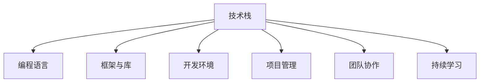

                 

# 程序员的职业生涯规划：30年路线图

> 关键词：程序员成长, 职业生涯规划, 技术栈更新, 软件开发, 项目管理, 团队协作

## 1. 背景介绍

### 1.1 问题由来
在快速变化的科技行业，程序员的职业发展面临着前所未有的挑战与机遇。如何规划职业生涯，持续保持技术竞争力，成为每位从业者必须面对的问题。本文将从技术栈、项目管理、团队协作等多个维度，为程序员的30年职业生涯规划提供一个系统性的指南。

## 2. 核心概念与联系

### 2.1 核心概念概述

为更好地理解程序员职业生涯的发展路径，本节将介绍几个核心概念及其之间的关系：

- **技术栈(Tech Stack)**：指程序员掌握的各种编程语言、框架、工具的集合。掌握多种技术栈能够提升程序员的灵活性和适应性。
- **编程语言(Programming Language)**：程序员最基础的开发工具，不同的应用场景选择不同的语言。例如，Web开发常用JavaScript、Python，而系统编程常用C++、Rust。
- **框架与库(Library/Framework)**：为简化编程工作，提高开发效率，程序员常使用各种框架与库，如Web框架的Flask、Django，后端处理的SQLAlchemy、Redis等。
- **开发环境(Development Environment)**：指程序员进行开发、测试、调试的集成环境。例如，IDE（如Visual Studio Code、PyCharm）、版本控制工具（如Git）、容器技术（如Docker）。
- **项目管理(Project Management)**：指对软件开发过程的管理，包括需求分析、任务分配、进度跟踪、质量保证等。常用的项目管理工具如JIRA、Trello、Confluence等。
- **团队协作(Collaboration)**：指多个人协同开发，共同完成任务。常用的协作工具如Slack、Zoom、GitHub等。
- **持续学习(Lifelong Learning)**：指程序员在职业生涯中不断学习新知识、新技能，以保持技术竞争力。

这些概念之间的联系可以通过以下Mermaid流程图来展示：



这个流程图展示了几大核心概念的相互关系：

1. **技术栈**是程序员能力的基础，通过学习不同的技术栈提升自身的多样性和适应性。
2. **编程语言**、**框架与库**、**开发环境**等都是为了更好地进行编程工作而诞生的工具。
3. **项目管理**和**团队协作**是程序员在团队中的必备技能，提高项目的效率和质量。
4. **持续学习**贯穿整个职业生涯，保持技术竞争力和职业发展的可持续性。

## 3. 核心算法原理 & 具体操作步骤
### 3.1 算法原理概述

程序员职业生涯的规划，本质上是一个动态调整的过程，需要在技术栈、项目管理、团队协作等多个维度进行优化。其核心思想是：结合自身兴趣、市场需求和行业发展趋势，持续学习、实践和创新，以最大化职业满意度、发展潜力和社会价值。

### 3.2 算法步骤详解

**Step 1: 自我认知**

- **兴趣探索**：了解自身兴趣所在，是从事前端、后端、全栈开发，还是专注于数据科学、人工智能等领域。
- **能力评估**：通过编码测试、项目实践等方式，评估自身技术能力和项目经验，了解技术盲点和提升空间。
- **价值观匹配**：思考自己在职业发展中追求什么，是技术深度、职业稳定性，还是创新与成就感。

**Step 2: 职业规划**

- **长期目标设定**：根据自身兴趣和市场需求，设定5年、10年的职业目标，如成为技术专家、团队负责人、公司CTO等。
- **中期任务分解**：将长期目标分解为阶段性任务，如掌握新技能、完成重要项目、参加行业会议等。
- **短期执行计划**：制定年度、季度、月度执行计划，明确每阶段的行动路径和预期成果。

**Step 3: 技术栈更新**

- **学习与实践**：选择符合未来趋势的技术栈，进行系统学习，并通过项目实践巩固所学知识。
- **技术社区参与**：积极参与开源社区、技术论坛，关注最新的技术动态和社区讨论。
- **技术交流与合作**：与其他程序员交流经验，分享知识，促进共同进步。

**Step 4: 项目管理与团队协作**

- **项目管理工具**：学习使用项目管理工具，如JIRA、Trello、Confluence，提高项目管理和团队协作效率。
- **领导力培养**：通过导师制、团队协作等方式，提升领导力，学习如何更好地管理和协调团队。
- **跨团队协作**：积极参与跨部门项目，了解不同领域的工作流程和业务需求，提升综合能力。

**Step 5: 持续学习与创新**

- **新技能学习**：根据行业发展趋势，学习新兴技术栈，如区块链、人工智能、云计算等。
- **自我驱动创新**：通过阅读学术论文、参加技术会议，掌握最新研究进展，推动技术创新。
- **反馈与迭代**：定期回顾职业发展路径，总结经验教训，调整目标和策略。

### 3.3 算法优缺点

基于上述规划算法的优点包括：

- **系统性**：全面考虑技术栈、项目管理、团队协作等多个维度，避免单一技能的局限性。
- **可执行性**：将职业目标分解为具体任务和计划，确保执行的可行性和效率。
- **灵活性**：能够根据市场需求和个人发展情况，动态调整职业规划，保持竞争力。

同时，该算法也存在一定的局限性：

- **适应性**：对某些特定技术栈的快速迭代和变动适应能力有待提升。
- **可量化性**：对职业目标的设定和评估缺乏量化的标准和方法。
- **个性化**：每个人的职业兴趣和发展路径差异较大，统一化的规划可能不够个性化。

尽管存在这些局限性，但就目前而言，这种系统性的规划方法仍是程序员职业发展的重要参考，尤其在技术更新迭代快的行业尤其适用。

### 3.4 算法应用领域

基于上述规划算法，程序员的职业生涯规划可以应用于多个领域，包括但不限于：

- **软件开发**：通过掌握多种技术栈，提升开发效率和质量，成为多面手开发者。
- **数据科学**：深入学习数据处理、机器学习等技术，成为数据分析师、数据科学家。
- **人工智能**：探索深度学习、自然语言处理等技术，从事智能算法、产品开发等工作。
- **云计算**：掌握云平台技术，从事云架构、运维管理工作。
- **区块链**：学习区块链技术，从事智能合约、共识算法等开发。

此外，在教育、医疗、金融等行业，程序员的职业规划同样具有广阔的应用前景。

## 4. 数学模型和公式 & 详细讲解 & 举例说明

### 4.1 数学模型构建

本节将使用数学语言对程序员职业生涯规划的过程进行更加严格的刻画。

记程序员的职业目标为 $O$，当前状态为 $C$，技能集为 $S$，掌握程度为 $P$。设职业目标 $O$ 的分解为 $O_1, O_2, ..., O_n$，当前状态 $C$ 的评估为 $C_1, C_2, ..., C_m$，技能集 $S$ 包含 $s_1, s_2, ..., s_k$。

定义当前状态 $C$ 到职业目标 $O$ 的路径为 $P_{OC}$，技能掌握度 $P_{s_k}$ 为 $P_k$。则在职业规划模型中，目标函数为：

$$
\max_{P} \sum_{i=1}^{n} \lambda_i \left( \prod_{j=1}^{m} \alpha_j^{C_j} \prod_{k=1}^{k} \beta_k^{P_k} \right)
$$

其中 $\lambda_i$ 为职业目标 $O_i$ 的权重，$\alpha_j$ 为状态 $C_j$ 的权重，$\beta_k$ 为技能 $s_k$ 的掌握度权重。

在实际应用中，可通过构建图论模型，对上述优化问题进行求解，寻找最优路径。

### 4.2 公式推导过程

以下是基于上述数学模型的职业目标路径推导过程：

1. **状态空间**：定义职业目标 $O$ 和当前状态 $C$ 的空间，如 $O=\{O_1, O_2, ..., O_n\}$，$C=\{C_1, C_2, ..., C_m\}$。
2. **目标路径**：设定职业目标路径 $P_{OC}$ 的优先级，即 $\lambda_i$ 的值。
3. **权重分配**：对当前状态 $C$ 和技能掌握度 $P$ 进行权重分配，即 $\alpha_j$ 和 $\beta_k$ 的值。
4. **路径优化**：通过求解最优化问题，找到最优的职业路径 $P_{OC}$。

例如，对于一个Web开发者的职业规划，可设定职业目标 $O=\{前端专家、后端专家、全栈开发者\}$，当前状态 $C=\{初级开发者、中级开发者、高级开发者\}$，技能集 $S=\{JavaScript、React、Node.js\}$。通过设定相应的权重和优先级，可以找到最优的职业发展路径。

### 4.3 案例分析与讲解

以一个Java开发者的职业生涯规划为例：

1. **自我认知**：明确兴趣在于技术深度和创新，希望未来成为技术架构师。
2. **职业规划**：设定长期目标为5年内成为技术架构师，中期目标为2年内掌握Spring框架，短期目标为每月学习一项新技术。
3. **技术栈更新**：学习Kubernetes、微服务、DevOps等技术，并通过项目实践提升能力。
4. **项目管理与团队协作**：使用JIRA管理项目，加入DevOps团队，提升领导力和协作能力。
5. **持续学习与创新**：定期参加技术会议，阅读学术论文，掌握最新技术动态。

通过上述步骤，该Java开发者能够有针对性地提升自己的技术栈、项目管理能力和团队协作能力，逐步向技术架构师的目标迈进。

## 5. 项目实践：代码实例和详细解释说明
### 5.1 开发环境搭建

在进行职业规划的实践前，我们需要准备好开发环境。以下是使用Python进行职业规划实践的环境配置流程：

1. 安装Anaconda：从官网下载并安装Anaconda，用于创建独立的Python环境。

2. 创建并激活虚拟环境：
```bash
conda create -n career-env python=3.8 
conda activate career-env
```

3. 安装Python常用库：
```bash
pip install pandas numpy matplotlib sklearn jupyter notebook
```

4. 安装JIRA API客户端：
```bash
pip install pyjira
```

5. 安装Git版本控制工具：
```bash
conda install git
```

完成上述步骤后，即可在`career-env`环境中开始职业规划实践。

### 5.2 源代码详细实现

下面以Java开发者的职业规划为例，给出使用Python进行职业规划的代码实现。

首先，定义职业目标和当前状态的类：

```python
class CareerPath:
    def __init__(self, career goals, current status):
        self.career_goals = career_goals
        self.current_status = current_status
        self.paths = []
        
    def add_path(self, path):
        self.paths.append(path)
```

然后，定义技能掌握度的类：

```python
class SkillLevel:
    def __init__(self, skill_name, level):
        self.skill_name = skill_name
        self.level = level
        
    def __repr__(self):
        return f"{self.skill_name}: {self.level}"
```

接着，定义职业路径类，用于求解最短路径：

```python
import networkx as nx
from itertools import product

class CareerPathSolver:
    def __init__(self, graph):
        self.graph = graph
        
    def find_shortest_path(self, start, end):
        path = nx.shortest_path(self.graph, start, end)
        return path
```

最后，定义一个简单的示例，展示如何使用上述类进行职业规划：

```python
# 定义职业目标和当前状态
goals = ["前端专家", "后端专家", "全栈开发者"]
status = ["初级开发者", "中级开发者", "高级开发者"]

# 定义技能集和掌握度
skills = ["JavaScript", "React", "Node.js"]
skill_levels = [SkillLevel(skill, 1) for skill in skills]  # 假设当前掌握度为1

# 构建图
graph = nx.DiGraph()
graph.add_nodes_from(skills)
graph.add_node("职业目标")
for skill in skills:
    graph.add_edge(skill, "职业目标", weight=1)

# 添加状态节点
for status in status:
    graph.add_node(status)
    for skill in skills:
        graph.add_edge(skill, status, weight=1)
        graph.add_edge(status, skill, weight=1)

# 添加目标节点
for goal in goals:
    graph.add_edge("职业目标", goal, weight=1)

# 求解最短路径
solver = CareerPathSolver(graph)
path = solver.find_shortest_path("初级开发者", "全栈开发者")
print(path)
```

### 5.3 代码解读与分析

让我们再详细解读一下关键代码的实现细节：

**CareerPath类**：
- `__init__`方法：初始化职业目标和当前状态，并创建一个空的职业路径列表。
- `add_path`方法：向职业路径列表中添加新的路径。

**SkillLevel类**：
- `__init__`方法：初始化技能名称和掌握度，提供友好的字符串表示。

**CareerPathSolver类**：
- `__init__`方法：初始化图结构，构建职业规划的图形模型。
- `find_shortest_path`方法：使用网络X库的`shortest_path`函数，求解从当前状态到职业目标的最短路径。

**示例代码**：
- 定义职业目标、当前状态和技能集，创建技能掌握度的列表。
- 构建图，添加节点和边，表示技能与状态之间的连接。
- 求解从“初级开发者”到“全栈开发者”的最短路径，并输出结果。

通过上述步骤，可以看出如何使用Python实现一个简单的职业规划模型，帮助Java开发者找到最优的职业发展路径。

## 6. 实际应用场景
### 6.1 软件开发团队管理

基于职业规划的开发团队管理，可以显著提升团队的协作效率和项目成功率。传统管理方式往往依赖于经验，缺乏系统性和科学性，难以应对快速变化的需求和技术栈。

在实践过程中，可以按照以下步骤进行团队规划：

1. **需求调研**：通过问卷调查、会议讨论等方式，了解团队成员的职业兴趣和目标。
2. **目标设定**：根据调研结果，设定团队短期、中期和长期目标，确保团队成员的兴趣和目标一致。
3. **路径规划**：根据目标，制定详细的职业路径，明确每个阶段需要掌握的技能和达到的状态。
4. **资源分配**：根据团队成员的当前状态和技能掌握度，合理分配项目任务，提升团队整体能力。
5. **持续评估**：定期回顾职业规划，调整目标和策略，确保团队持续成长。

通过这种系统化的管理方式，团队成员能够有方向性地提升自身技能，团队也能够高效应对项目需求，提升项目的成功率。

### 6.2 教育行业的人才培养

在教育行业中，职业规划对于人才的培养具有重要意义。通过职业规划，教师和学生能够明确自己的职业目标，制定相应的学习计划，提高学习的针对性和效率。

在实际应用中，可以按照以下步骤进行人才培养：

1. **学生兴趣调研**：通过问卷调查、职业指导等方式，了解学生的兴趣和职业目标。
2. **目标设定**：根据学生调研结果，设定学业和职业发展的短期、中期和长期目标。
3. **路径规划**：制定详细的学习和技能提升路径，明确每个阶段需要掌握的知识和技能。
4. **资源支持**：提供必要的学习资源和指导，如参加相关课程、实验室、实习机会等。
5. **持续反馈**：定期与学生沟通，提供职业指导和反馈，调整学习路径。

通过这种系统化的培养方式，学生能够明确自己的职业目标，制定合理的学习计划，提高学习的针对性和效率，为未来的职业发展打下坚实基础。

### 6.3 企业内部的知识传承

职业规划在企业内部的知识传承中也具有重要作用。通过系统化的职业规划，企业能够培养一批具备高技能的员工，确保知识的传承和创新。

在实践过程中，可以按照以下步骤进行知识传承：

1. **知识调研**：了解企业内部的技术栈和知识体系，明确需要传承的关键技能。
2. **目标设定**：设定知识传承的短期、中期和长期目标，确保知识传承的有效性。
3. **路径规划**：制定详细的知识传承路径，明确每个阶段需要掌握的知识和技能。
4. **导师制**：建立导师制，由资深员工指导年轻员工，传授关键技能和经验。
5. **持续评估**：定期评估知识传承的效果，调整传承策略和路径。

通过这种系统化的知识传承方式，企业能够培养一批具备高技能的员工，确保知识的有效传承和创新，提升企业的技术竞争力。

### 6.4 未来应用展望

随着技术的发展和职业生态的变化，基于职业规划的方法将在更多领域得到应用，为各个行业带来变革性影响。

在智慧医疗领域，基于职业规划的人才培养和团队管理，能够提升医疗服务的专业性和效率，为患者提供更优质的医疗服务。

在智能制造领域，基于职业规划的员工培训和知识传承，能够提升生产效率和质量，推动制造业的数字化转型。

在智慧城市治理中，基于职业规划的城市管理团队，能够提高城市管理的自动化和智能化水平，构建更安全、高效的未来城市。

此外，在金融、教育、环保等多个领域，基于职业规划的技术应用也将不断涌现，为各行各业提供新的发展动力。相信随着技术的日益成熟，职业规划方法将成为企业组织发展的关键工具，推动人工智能技术在各行业的广泛应用。

## 7. 工具和资源推荐
### 7.1 学习资源推荐

为了帮助程序员系统掌握职业规划的理论基础和实践技巧，这里推荐一些优质的学习资源：

1. **《程序员职业发展手册》**：一本系统介绍程序员职业规划的书籍，涵盖了职业目标设定、技能提升、项目管理等多个方面。

2. **Coursera《软件工程师职业发展课程》**：由Coursera提供的职业发展课程，涵盖职业规划、团队协作、领导力培养等多个主题。

3. **LinkedIn Learning**：提供大量与职业规划相关的课程，涵盖技术栈、项目管理、团队协作等多个方面。

4. **Github Jobs**：提供最新的招聘信息和职业发展建议，帮助程序员了解市场需求和职业发展方向。

5. **Mindtree 职业发展系列讲座**：Mindtree公司提供的职业发展讲座，涵盖技术栈更新、项目管理、领导力培养等多个主题。

通过对这些资源的学习实践，相信你一定能够快速掌握职业规划的精髓，并用于解决实际的职业发展问题。

### 7.2 开发工具推荐

高效的开发离不开优秀的工具支持。以下是几款用于职业规划开发的常用工具：

1. **GitHub**：全球最大的开源代码托管平台，提供版本控制、协作开发、项目管理等多种功能。

2. **JIRA**：流行的项目管理工具，支持敏捷开发、任务分配、进度跟踪等功能。

3. **Confluence**：协作文档工具，支持文档编辑、知识管理、团队协作等功能。

4. **Zoom**：在线视频会议工具，支持多人视频、屏幕共享、聊天等功能。

5. **Slack**：团队协作工具，支持即时消息、频道、文件共享等功能。

6. **VS Code**：流行的代码编辑器，支持多种编程语言、调试工具、扩展库等。

合理利用这些工具，可以显著提升职业规划任务的开发效率，加快创新迭代的步伐。

### 7.3 相关论文推荐

职业规划的发展源于学界的持续研究。以下是几篇奠基性的相关论文，推荐阅读：

1. **《软件工程师职业发展模型》**：提出了一种基于图论的职业发展模型，帮助软件工程师系统化地规划职业路径。

2. **《软件工程师团队管理》**：研究了基于职业规划的团队管理方法，探讨了如何提升团队协作效率和项目成功率。

3. **《教育行业人才培养框架》**：提出了一种基于职业规划的教育人才培养框架，帮助学生明确职业目标，制定合理的学习路径。

4. **《企业内部知识传承机制》**：探讨了基于职业规划的知识传承方法，确保企业知识的有效传承和创新。

这些论文代表了大语言模型微调技术的发展脉络。通过学习这些前沿成果，可以帮助研究者把握学科前进方向，激发更多的创新灵感。

## 8. 总结：未来发展趋势与挑战

### 8.1 研究成果总结

本文对程序员职业生涯规划的过程进行了系统性的介绍，涵盖技术栈、项目管理、团队协作等多个方面。通过构建数学模型和代码实现，展示了职业规划的实际应用，帮助程序员更好地规划职业生涯，持续提升技术竞争力。

通过本文的系统梳理，可以看到，职业规划在程序员的职业发展中具有重要意义，能够帮助程序员系统化地提升技能、优化项目管理和团队协作，提升职业满意度和发展潜力。

### 8.2 未来发展趋势

展望未来，职业规划技术将呈现以下几个发展趋势：

1. **智能化**：利用人工智能技术，进行职业目标的智能推荐和路径优化，提高职业规划的个性化和准确性。
2. **社交化**：通过社交网络分析，进行职业路径的社交化推荐，帮助程序员找到合适的导师和团队。
3. **动态化**：根据市场需求和技术趋势，动态调整职业规划，保持职业发展的持续性和前瞻性。
4. **国际化**：提供全球化的职业规划建议，帮助程序员在全球范围内进行职业发展。
5. **全栈化**：涵盖技术栈、项目管理、团队协作、知识传承等多个方面，提供全面的职业发展支持。

以上趋势凸显了职业规划技术的广阔前景，这些方向的探索发展，必将进一步提升职业规划的精准性和实用性，为程序员提供更好的职业发展指导。

### 8.3 面临的挑战

尽管职业规划技术已经取得了不小的进展，但在迈向更加智能化、系统化应用的过程中，它仍面临诸多挑战：

1. **个性化推荐**：职业规划需要兼顾通用性和个性化，如何在满足多数需求的同时，提供定制化的职业路径，是一个重要挑战。
2. **数据隐私**：在职业规划中，需要处理大量的个人数据，如何保障数据隐私和安全，是一个必须解决的难题。
3. **长期效果评估**：职业规划的效果评估需要长期跟踪，如何设计合理的评估指标，是一个重要的研究课题。
4. **社会认同**：职业规划需要社会各界的认同和支持，如何推广和普及职业规划理念，是一个长期的任务。

尽管存在这些挑战，但通过不断的技术创新和实践探索，相信这些挑战终将一一被克服，职业规划技术必将在职业发展中扮演越来越重要的角色。

### 8.4 研究展望

面对职业规划面临的种种挑战，未来的研究需要在以下几个方面寻求新的突破：

1. **智能化推荐算法**：利用机器学习、深度学习等技术，进行职业目标和路径的智能化推荐，提高职业规划的个性化和准确性。
2. **数据隐私保护**：采用区块链、联邦学习等技术，保障职业规划过程中数据隐私和安全。
3. **长期效果评估模型**：开发长效评估模型，对职业规划的效果进行长期跟踪和评估，提供科学的职业发展建议。
4. **社会认同机制**：通过社区建设、政策引导等方式，推广和普及职业规划理念，提升社会各界的认同和支持。

这些研究方向的探索，必将引领职业规划技术迈向更高的台阶，为程序员提供更好的职业发展指导，推动人工智能技术在各行业的广泛应用。面向未来，职业规划技术还需要与其他人工智能技术进行更深入的融合，如知识表示、因果推理、强化学习等，多路径协同发力，共同推动自然语言理解和智能交互系统的进步。只有勇于创新、敢于突破，才能不断拓展职业规划技术的边界，让智能技术更好地造福人类社会。

## 9. 附录：常见问题与解答

**Q1：职业规划是否适用于所有职业领域？**

A: 职业规划对于大多数职业领域都具有广泛的适用性，尤其是对于快速变化和技术密集型的职业，如软件开发、数据科学、人工智能等。对于一些相对稳定的职业，如教师、医生、公务员等，职业规划同样能够帮助其进行职业发展方向的调整和提升。

**Q2：职业规划是否需要一次性规划所有职业路径？**

A: 职业规划是一个动态调整的过程，不是一成不变的。在职业生涯中，个人的兴趣、市场的需求和技术的变化都会影响职业目标和路径。因此，建议定期进行职业规划的回顾和调整，以确保职业路径与个人发展目标一致。

**Q3：如何选择合适的职业目标？**

A: 选择合适的职业目标需要结合个人兴趣、市场需求和技术趋势进行综合考虑。可以通过职业调研、行业分析等方式，了解当前和未来的职业趋势，选择具有成长潜力的目标。同时，可以设定多个职业目标，根据实际情况进行优先级排序和调整。

**Q4：职业规划是否需要大量的前期投入？**

A: 职业规划的投入主要体现在时间和精力的投入，如学习新技能、参加培训、获取认证等。这些投入虽然有一定的前期成本，但长期来看能够显著提升职业竞争力和发展潜力。同时，可以通过参与开源社区、技术会议等方式，获取免费的资源和支持。

**Q5：职业规划是否会影响工作和生活平衡？**

A: 合理的职业规划能够帮助程序员在职业发展与生活平衡之间找到平衡点。通过设定合理的职业目标和路径，可以避免盲目追求高薪或高职位，而是在兴趣和需求之间找到最优的平衡点。同时，职业规划能够帮助程序员更好地规划工作和生活，提升整体生活质量。

通过本文的系统梳理，可以看到，职业规划在程序员的职业发展中具有重要意义，能够帮助程序员系统化地提升技能、优化项目管理和团队协作，提升职业满意度和发展潜力。未来，伴随技术的日益成熟，职业规划方法将成为程序员职业发展的关键工具，推动人工智能技术在各行业的广泛应用。相信随着技术的不断发展，职业规划技术将不断进步，为程序员提供更好的职业发展指导，推动人工智能技术的深入应用。

