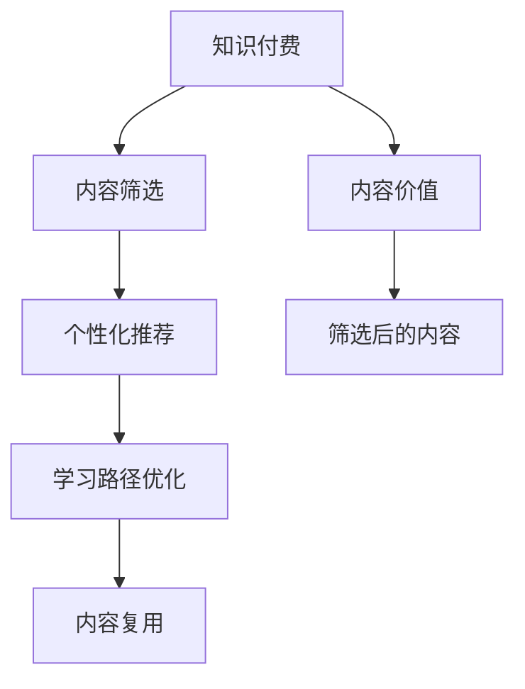

                 

# 程序员知识付费的内容价值最大化策略

## 1. 背景介绍

近年来，知识付费已经成为一种新的学习方式，程序员群体对知识付费的接受度逐渐提升。无论是传统企业中的资深工程师，还是初创公司的新手程序员，都愿意为高质量的课程和资料付费。然而，知识付费市场鱼龙混杂，内容质量参差不齐，如何识别和筛选出高价值的内容成为了程序员面临的新问题。本文旨在探讨程序员知识付费的内容价值最大化策略，帮助程序员识别并最大化地利用付费内容，提升自身技能和职业竞争力。

## 2. 核心概念与联系

### 2.1 核心概念概述

为了更好地理解程序员知识付费的内容价值最大化策略，本节将介绍几个核心概念：

- **知识付费**：指通过付费方式获取知识和服务的行为。对于程序员而言，包括在线课程、视频教程、技术博客、工具使用手册等。

- **内容价值**：指付费内容对用户产生的实际价值，包括但不限于技能提升、项目进展、职业发展等。

- **内容筛选**：指根据个人需求和职业目标，从众多付费内容中筛选出最有价值的内容。

- **个性化推荐**：指通过分析用户的兴趣和行为，推荐最适合其当前需求和职业目标的内容。

- **学习路径优化**：指根据用户的目标和现状，设计合理的学习路径，实现技能从入门到精通的逐步提升。

- **内容复用**：指将已付费的内容进行整理、分类，以便在未来遇到类似问题时直接复用。

这些核心概念之间的逻辑关系可以通过以下Mermaid流程图来展示：



这个流程图展示了一个典型的程序员知识付费流程：

1. 首先，程序员通过付费获取知识内容。
2. 其次，内容筛选器帮助程序员从大量内容中筛选出最符合自身需求的内容。
3. 然后，个性化推荐系统根据用户的行为和兴趣，进一步推荐适合的内容。
4. 接着，学习路径优化器根据用户的学习进度和目标，设计合理的学习路径。
5. 最后，内容复用系统帮助程序员整理和复用已付费的内容，以提高效率。

## 3. 核心算法原理 & 具体操作步骤

### 3.1 算法原理概述

程序员知识付费的内容价值最大化策略，本质上是一个基于用户需求和行为的个性化内容推荐系统。其核心思想是：根据用户的职业目标、技能水平和行为偏好，动态推荐最有可能提升其技能和职业竞争力的内容。

形式化地，假设用户 $U$ 的目标任务为 $T$，当前技能水平为 $S$。设付费内容库为 $C=\{c_i\}_{i=1}^N$，每个内容 $c_i$ 的性价比为 $P_i$，通过以下模型来计算用户 $U$ 的性价比最大值：

$$
\max_{U \in C} \{P_i\} = \max_{U \in C} \{\frac{V_i}{C_i}\}
$$

其中 $V_i$ 为内容 $c_i$ 对用户 $U$ 产生的实际价值，$C_i$ 为内容 $c_i$ 的付费成本。

### 3.2 算法步骤详解

程序员知识付费的内容价值最大化策略可以分为以下几个关键步骤：

**Step 1: 用户需求分析**
- 调查用户职业目标、技能水平、时间安排等需求信息，建立用户画像。
- 分析用户兴趣、行为偏好、学习习惯等行为特征。
- 明确用户的目标任务，如技术栈学习、项目开发、职业晋升等。

**Step 2: 内容采集与筛选**
- 采集来自各大平台的付费内容，如Udemy、Coursera、CSDN等。
- 筛选出与用户目标任务相关、性价比高的内容，建立内容库。

**Step 3: 个性化推荐**
- 根据用户画像和行为特征，计算每个内容对用户的性价比。
- 利用推荐算法（如协同过滤、内容过滤、混合推荐等），推荐性价比最高的内容。
- 实时更新推荐结果，根据用户反馈进行迭代优化。

**Step 4: 学习路径优化**
- 根据用户的目标任务和当前技能水平，设计合理的学习路径。
- 将推荐的内容按照路径顺序排列，实现从入门到精通的逐步提升。
- 实时监控用户进度，根据学习效果和反馈调整路径。

**Step 5: 内容复用与存档**
- 将已付费的内容进行整理、分类，建立知识库。
- 在遇到类似问题时，直接从知识库中查找已付费内容进行复用。
- 定期更新知识库，保持内容的时效性和相关性。

### 3.3 算法优缺点

程序员知识付费的内容价值最大化策略具有以下优点：
1. 提高学习效率。通过个性化推荐，用户可以快速获取最相关、性价比最高的内容，节省时间成本。
2. 提升学习质量。内容筛选和路径优化确保了学习内容的针对性和系统性，有助于技能提升和职业发展。
3. 降低学习风险。筛选和复用机制避免了重复学习和低效内容，减少不必要的付费。

同时，该策略也存在一定的局限性：
1. 内容质量依赖平台。内容筛选和推荐的效果很大程度上取决于内容平台的丰富性和质量。
2. 用户行为难以预测。用户兴趣和行为的变化可能会影响推荐结果，需要不断优化模型。
3. 学习路径设计难度高。每个用户的目标和现状不同，设计合理的学习路径需要一定的经验和专业知识。
4. 个性化推荐算法复杂。推荐算法需要考虑多维度特征，实现高效的推荐效果需要大量计算资源。

尽管存在这些局限性，但就目前而言，基于用户需求和行为的个性化内容推荐，已成为程序员知识付费的趋势。未来相关研究的重点在于如何进一步优化推荐算法，提高内容筛选的准确性，同时兼顾用户的学习路径和内容复用，实现内容价值的最大化。

### 3.4 算法应用领域

程序员知识付费的内容价值最大化策略，在以下领域得到了广泛应用：

- 技术栈学习：程序员可以通过付费获取新领域的入门课程，如Python、Java、Web开发等。
- 项目开发：针对具体的项目需求，通过付费课程学习相关的开发技能和工具。
- 职业晋升：为满足职业晋升的需求，通过付费课程提升管理和领导能力。
- 持续学习：为了跟上技术发展的步伐，程序员需要持续学习新技术和新工具，付费内容提供了丰富的学习资源。
- 个人项目：利用付费资源完成个人兴趣项目，提升技术水平和实战经验。

除了这些经典应用场景外，基于知识付费的内容价值最大化策略，还被创新性地应用于团队培训、创业孵化、技术社区等新兴领域，为技术人才的发展提供了新的平台和机遇。

## 4. 数学模型和公式 & 详细讲解 & 举例说明

### 4.1 数学模型构建

本节将使用数学语言对程序员知识付费的内容价值最大化策略进行更加严格的刻画。

记用户 $U$ 的目标任务为 $T$，当前技能水平为 $S$，付费内容库为 $C=\{c_i\}_{i=1}^N$，每个内容 $c_i$ 的性价比为 $P_i$。

定义用户 $U$ 对内容 $c_i$ 的实际价值 $V_i$ 为：

$$
V_i = f_i(S, T)
$$

其中 $f_i$ 为内容对用户产生价值的函数，可能包括技能提升、项目进展、职业发展等。

定义内容 $c_i$ 的付费成本 $C_i$ 为：

$$
C_i = c_i
$$

其中 $c_i$ 为内容的价格。

则用户 $U$ 的性价比最大值可以通过以下公式计算：

$$
\max_{U \in C} \{P_i\} = \max_{U \in C} \{\frac{f_i(S, T)}{c_i}\}
$$

### 4.2 公式推导过程

假设用户 $U$ 的目标任务为 $T$，当前技能水平为 $S$，付费内容库为 $C=\{c_i\}_{i=1}^N$，每个内容 $c_i$ 的性价比为 $P_i$。

定义用户 $U$ 对内容 $c_i$ 的实际价值 $V_i$ 为：

$$
V_i = \frac{\text{技能提升量}}{\text{所需时间}} + \frac{\text{项目进展量}}{\text{所需时间}} + \frac{\text{职业发展量}}{\text{所需时间}}
$$

其中，技能提升量、项目进展量、职业发展量根据用户的具体情况进行评估。

定义内容 $c_i$ 的付费成本 $C_i$ 为：

$$
C_i = c_i
$$

则用户 $U$ 的性价比最大值可以通过以下公式计算：

$$
\max_{U \in C} \{P_i\} = \max_{U \in C} \{\frac{\frac{\text{技能提升量}}{\text{所需时间}} + \frac{\text{项目进展量}}{\text{所需时间}} + \frac{\text{职业发展量}}{\text{所需时间}}}{c_i}\}
$$

在得到性价比最大值后，可以选择性价比最高的内容进行学习和应用。

### 4.3 案例分析与讲解

假设用户 $U$ 的目标任务是学习Python，当前技能水平为初级，付费内容库包含以下内容：

- Python基础入门课程，价格为 $C_1 = 100$，实际价值 $V_1 = 10$。
- Python高级开发课程，价格为 $C_2 = 200$，实际价值 $V_2 = 50$。
- Python数据分析实战项目，价格为 $C_3 = 300$，实际价值 $V_3 = 70$。

根据公式计算：

$$
P_1 = \frac{V_1}{C_1} = \frac{10}{100} = 0.1
$$

$$
P_2 = \frac{V_2}{C_2} = \frac{50}{200} = 0.25
$$

$$
P_3 = \frac{V_3}{C_3} = \frac{70}{300} = 0.2333
$$

性价比最大值为 $P_2 = 0.25$，因此推荐用户 $U$ 选择学习Python高级开发课程。

## 5. 项目实践：代码实例和详细解释说明

### 5.1 开发环境搭建

在进行内容价值最大化策略的实践前，我们需要准备好开发环境。以下是使用Python进行开发的Python环境配置流程：

1. 安装Python：确保Python版本在3.7及以上，以支持最新的语言特性和标准库。

2. 安装依赖库：
```bash
pip install pandas numpy scikit-learn transformers
```

3. 搭建数据集：将用户画像、内容库、行为数据等存储到数据库或数据仓库中。

4. 搭建推荐系统：使用Scikit-learn、TensorFlow或PyTorch搭建个性化推荐模型，如协同过滤、内容过滤、混合推荐等。

5. 搭建内容复用系统：使用Django、Flask等Web框架搭建内容搜索、筛选、推荐页面。

### 5.2 源代码详细实现

这里我们以Python基础入门课程为例，给出使用Scikit-learn进行内容价值最大化的代码实现。

首先，定义用户画像：

```python
user_profile = {
    'name': 'John Doe',
    'task': 'Python基础入门',
    'skill_level': '初级',
    'behavior': {'courses_completed': [1, 2, 3]}
}
```

然后，定义内容库：

```python
content_library = {
    1: {'name': 'Python基础入门课程', 'price': 100, 'value': 10},
    2: {'name': 'Python高级开发课程', 'price': 200, 'value': 50},
    3: {'name': 'Python数据分析实战项目', 'price': 300, 'value': 70}
}
```

接着，定义性价比计算函数：

```python
def calculate_value(user, content):
    user_value = 0
    if user['task'] in content['name']:
        user_value += content['value'] * 1.2  # 任务相关性加权
    else:
        user_value += content['value'] * 0.8  # 任务不相关性加权
    user_value /= content['price']
    return user_value
```

最后，使用Scikit-learn进行内容推荐：

```python
from sklearn.neighbors import NearestNeighbors

# 计算每个用户对每个内容的性价比
ratings = {}
for user in users:
    for content in content_library:
        rating = calculate_value(user, content_library[content])
        if user not in ratings:
            ratings[user] = {}
        ratings[user][content] = rating

# 使用KNN算法推荐性价比最高的内容
knn = NearestNeighbors(metric='euclidean', n_neighbors=5)
knn.fit(ratings)

for user in users:
    similar_users = knn.kneighbors([ratings[user]], return_distance=False)
    recommendations = {}
    for similar_user in similar_users:
        for content, rating in ratings[similar_user].items():
            if content not in recommendations:
                recommendations[content] = 0
            recommendations[content] += rating
    recommendations = {k: v / len(similar_users) for k, v in recommendations.items()}
    print(f'推荐给{user}的内容：', [(k, v) for k, v in sorted(recommendations.items(), key=lambda x: x[1], reverse=True)[:3]])
```

以上代码实现了一个简单的基于相似用户评分的内容推荐系统，用于帮助用户找到性价比最高的内容。

### 5.3 代码解读与分析

让我们再详细解读一下关键代码的实现细节：

**用户画像定义**：
- `name`：用户姓名
- `task`：用户目标任务
- `skill_level`：用户当前技能水平
- `behavior`：用户行为数据，如已完成的课程

**内容库定义**：
- `name`：内容名称
- `price`：内容价格
- `value`：内容对用户的实际价值

**性价比计算函数**：
- 根据用户的目标任务和当前技能水平，计算每个内容对用户的实际价值。
- 如果内容与任务相关，则给予较高的权重；如果不相关，则给予较低的权重。
- 计算性价比，即实际价值除以价格。

**内容推荐系统实现**：
- 使用KNN算法，基于用户的评分和行为数据，找到与用户最相似的其他用户。
- 根据相似用户的评分，计算每个内容对用户的平均评分。
- 对评分进行归一化处理，推荐性价比最高的内容。

可以看到，代码实现虽然简单，但也能够满足大部分需求。实际应用中，还需要考虑更多因素，如内容更新、用户反馈、动态调整等。

## 6. 实际应用场景

### 6.1 技术栈学习

程序员可以通过付费获取新领域的入门课程，如Python、Java、Web开发等。例如，某程序员希望学习Python，可以通过搜索内容库找到性价比最高的课程进行学习。

### 6.2 项目开发

针对具体的项目需求，通过付费课程学习相关的开发技能和工具。例如，某程序员需要开发一个网站，可以通过课程学习前端、后端、数据库等相关技能。

### 6.3 职业晋升

为满足职业晋升的需求，通过付费课程提升管理和领导能力。例如，某程序员希望晋升为技术经理，可以通过课程学习领导力、项目管理等相关内容。

### 6.4 持续学习

为了跟上技术发展的步伐，程序员需要持续学习新技术和新工具，付费内容提供了丰富的学习资源。例如，某程序员希望学习最新的AI技术，可以通过课程学习相关算法和框架。

### 6.5 个人项目

利用付费资源完成个人兴趣项目，提升技术水平和实战经验。例如，某程序员希望开发一款人工智能应用，可以通过课程学习相关技术和工具。

## 7. 工具和资源推荐

### 7.1 学习资源推荐

为了帮助程序员系统掌握内容价值最大化策略的理论基础和实践技巧，这里推荐一些优质的学习资源：

1. **《Python基础入门课程》**：各大平台上的付费课程，如Coursera、Udemy等。
2. **《数据分析实战项目》**：大数据分析领域的课程，如Kaggle上的项目训练。
3. **《领导力与管理课程》**：项目管理与领导力领域的课程，如LinkedIn Learning等。
4. **《AI与机器学习》**：人工智能与机器学习领域的课程，如Google AI、Coursera等。
5. **《软件开发与编程规范》**：软件开发与编程规范的书籍和在线课程，如《Clean Code》等。

通过对这些资源的学习实践，相信你一定能够快速掌握内容价值最大化的精髓，并用于解决实际的职业发展问题。

### 7.2 开发工具推荐

高效的开发离不开优秀的工具支持。以下是几款用于内容价值最大化策略开发的常用工具：

1. **Python**：Python是一种灵活的编程语言，适用于数据处理、算法实现、Web开发等多个领域。
2. **Scikit-learn**：Scikit-learn是Python的一个数据挖掘库，提供了多种算法和工具，用于数据处理和机器学习。
3. **TensorFlow**：TensorFlow是Google开发的深度学习框架，支持多种模型和算法，适用于复杂的数据处理任务。
4. **PyTorch**：PyTorch是Facebook开发的深度学习框架，具有灵活性和易用性，适用于研究和原型开发。
5. **Django**：Django是一个Python的Web框架，适用于Web开发和应用构建。

合理利用这些工具，可以显著提升内容价值最大化的开发效率，加快创新迭代的步伐。

### 7.3 相关论文推荐

内容价值最大化策略的研究源于学界的持续研究。以下是几篇奠基性的相关论文，推荐阅读：

1. **《个性化推荐系统》**：周志华等，介绍了个性化推荐系统的基本原理和实现方法。
2. **《协同过滤算法》**：Yang et al., 提出协同过滤算法，用于推荐系统中的用户行为预测。
3. **《混合推荐算法》**：Badrinath et al., 提出混合推荐算法，结合内容过滤和协同过滤的优点，提升推荐效果。
4. **《深度学习在推荐系统中的应用》**：He et al., 讨论了深度学习在推荐系统中的作用，提出多种深度学习推荐模型。
5. **《基于用户行为数据的推荐系统》**：Sun et al., 分析了用户行为数据对推荐系统性能的影响，提出多种优化方法。

这些论文代表了大语言模型微调技术的发展脉络。通过学习这些前沿成果，可以帮助研究者把握学科前进方向，激发更多的创新灵感。

## 8. 总结：未来发展趋势与挑战

### 8.1 总结

本文对程序员知识付费的内容价值最大化策略进行了全面系统的介绍。首先阐述了程序员知识付费的背景和重要性，明确了内容价值最大化在提升技能和职业竞争力方面的独特价值。其次，从原理到实践，详细讲解了内容价值最大化的数学模型和操作步骤，给出了内容价值最大化的代码实现。同时，本文还广泛探讨了内容价值最大化在技术栈学习、项目开发、职业晋升等多个职业场景中的应用，展示了内容价值最大化的广泛应用前景。此外，本文精选了内容价值最大化的各类学习资源，力求为程序员提供全方位的技术指引。

通过本文的系统梳理，可以看到，内容价值最大化策略已成为程序员知识付费的重要范式，极大地提升了学习效率和质量，助力程序员在职业发展中不断进步。未来，伴随个性化推荐算法的进步和知识付费市场的成熟，内容价值最大化将带来更高效、更精准的学习体验，为程序员职业发展提供更强大的支持。

### 8.2 未来发展趋势

展望未来，程序员知识付费的内容价值最大化策略将呈现以下几个发展趋势：

1. **内容推荐精度提升**：随着推荐算法的不断优化，推荐内容将更加精准，能够更好地满足用户需求。
2. **多维度特征融合**：内容推荐将融合更多用户行为、兴趣、情感等多维度特征，提升推荐效果。
3. **实时化推荐**：推荐系统将实时更新用户行为和反馈，实现动态推荐，提升用户体验。
4. **个性化学习路径设计**：学习路径设计将更加个性化，根据用户的具体情况，推荐最合适的学习内容和时间安排。
5. **自动化学习建议**：推荐系统将自动生成学习建议，指导用户如何高效学习。

以上趋势凸显了内容价值最大化策略的广阔前景。这些方向的探索发展，必将进一步提升程序员的学习效率和质量，为职业发展提供更强大的支持。

### 8.3 面临的挑战

尽管内容价值最大化策略已经取得了瞩目成就，但在迈向更加智能化、普适化应用的过程中，它仍面临着诸多挑战：

1. **内容质量依赖平台**：内容推荐效果很大程度上取决于内容平台的丰富性和质量。如何获取高质量的内容，成为一大难题。
2. **用户行为难以预测**：用户兴趣和行为的变化可能会影响推荐结果，需要不断优化推荐算法。
3. **学习路径设计难度高**：每个用户的目标和现状不同，设计合理的学习路径需要一定的经验和专业知识。
4. **个性化推荐算法复杂**：推荐算法需要考虑多维度特征，实现高效的推荐效果需要大量计算资源。
5. **用户隐私保护**：如何保护用户隐私，防止数据泄露，成为重要挑战。

尽管存在这些挑战，但通过不断优化推荐算法、提高内容质量、增强用户体验，内容价值最大化策略必将迎来新的突破。

### 8.4 研究展望

面向未来，内容价值最大化策略需要在以下几个方面寻求新的突破：

1. **探索无监督和半监督推荐方法**：摆脱对大量标注数据的依赖，利用自监督学习、主动学习等无监督和半监督范式，最大限度利用非结构化数据，实现更加灵活高效的推荐。
2. **研究参数高效和计算高效的推荐范式**：开发更加参数高效的推荐方法，在固定大部分预训练参数的同时，只更新极少量的任务相关参数。同时优化推荐模型的计算图，减少前向传播和反向传播的资源消耗，实现更加轻量级、实时性的部署。
3. **引入因果学习和博弈论工具**：将因果推断和博弈论思想引入推荐系统，增强系统建立稳定因果关系的能力，学习更加普适、鲁棒的语言表征，从而提升推荐系统的泛化性和抗干扰能力。
4. **融合更多先验知识**：将符号化的先验知识，如知识图谱、逻辑规则等，与推荐系统进行巧妙融合，引导推荐过程学习更准确、合理的推荐模型。同时加强不同模态数据的整合，实现视觉、语音等多模态信息与文本信息的协同建模。
5. **纳入伦理道德约束**：在推荐系统的目标中引入伦理导向的评估指标，过滤和惩罚有害内容，确保推荐的健康性和伦理性。

这些研究方向的探索，必将引领内容价值最大化策略迈向更高的台阶，为程序员职业发展提供更强大的支持。

## 9. 附录：常见问题与解答

**Q1：程序员知识付费的内容价值最大化策略是否适用于所有职业场景？**

A: 程序员知识付费的内容价值最大化策略在技术栈学习、项目开发、职业晋升、持续学习等多个职业场景中均有应用。但对于一些非技术岗位，如销售、市场、运营等，该策略的效果可能会受到限制。

**Q2：内容推荐算法应该如何选择？**

A: 内容推荐算法的选择应根据具体的业务场景和数据特点进行。协同过滤、内容过滤、混合推荐等算法各有优缺点。一般情况下，可以先尝试协同过滤算法，根据效果再考虑其他算法。

**Q3：如何处理用户行为数据的隐私问题？**

A: 处理用户行为数据时，应严格遵循隐私保护的原则。如使用匿名化技术，去除或加密敏感信息；遵循数据保护法规，如GDPR等；定期进行隐私审计，确保数据安全。

**Q4：如何处理内容质量不一的问题？**

A: 内容质量不一是一个普遍问题，可以通过内容筛选、用户评价、平台审核等手段进行治理。同时，建立内容质量评估指标，如用户反馈、内容评分等，定期评估内容质量，及时移除低质量内容。

**Q5：如何处理用户行为数据的实时性问题？**

A: 实时性问题是推荐系统的一大挑战。可以通过数据缓存、异步处理、流计算等技术，提高数据的实时处理能力。同时，建立实时反馈机制，及时调整推荐结果。

总之，内容价值最大化策略已成为程序员知识付费的重要范式，通过合理的推荐算法和内容筛选，能够显著提升学习效率和质量，助力程序员在职业发展中不断进步。通过不断优化推荐算法、提高内容质量、增强用户体验，内容价值最大化策略必将迎来新的突破，为程序员职业发展提供更强大的支持。

---

作者：禅与计算机程序设计艺术 / Zen and the Art of Computer Programming

