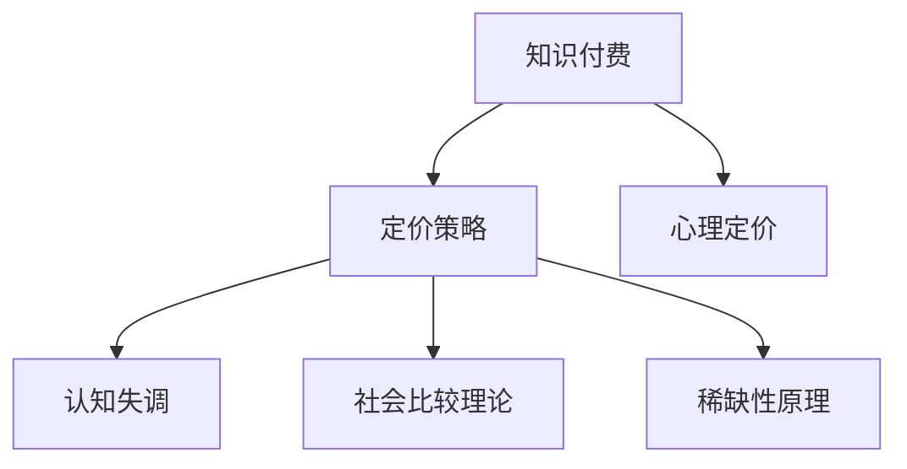

                 

## 1. 背景介绍

在信息化时代，知识付费成为一种新兴的学习方式，尤其在程序员这个群体中格外流行。各类技术博客、视频教程、在线课程层出不穷，提供了丰富的学习资源。然而，面对众多知识付费产品，程序员应该如何选择，哪些值得购买，哪些可以被免费获取？这不仅需要深入了解各类产品的内容质量，更需要科学合理的定价策略作为参考。本文将从心理学的角度出发，探讨程序员知识付费定价策略的设计原则，以及这些策略如何影响程序员的购买决策。

## 2. 核心概念与联系

### 2.1 核心概念概述

- **知识付费**：指通过付费方式获取特定领域专业知识的在线平台或服务。常见形式包括订阅服务、单次购买、会员体系等。

- **定价策略**：企业或平台在销售知识产品时采取的价格制定和调整策略。包括基本定价模型、促销策略、动态定价等。

- **心理定价**：指通过心理学原理影响消费者购买决策的定价策略，如尾数定价、整数定价、捆绑销售等。

- **认知失调**：指由于个体认知不一致导致的不适感。当消费者认为自己应得的利益（付费购买的知识）与其付出的成本（金钱）之间存在不匹配时，会产生认知失调。

- **社会比较理论**：指个体在形成自我评价时，会将自己和他人进行比较。当个体认为自己的价值或能力与他人相比较高时，会更有可能进行付费。

- **稀缺性原理**：指消费者对稀缺资源的评估更倾向于高价值，认为“少即是多”。因此，限时优惠、限量销售等策略可以提升产品价值。

### 2.2 核心概念原理和架构的 Mermaid 流程图



## 3. 核心算法原理 & 具体操作步骤

### 3.1 算法原理概述

知识付费的定价策略设计需要综合考虑产品质量、市场定位、用户需求以及心理学因素。其核心在于平衡知识产品的价值与成本，并通过适当的定价策略引导用户进行合理的消费行为。

### 3.2 算法步骤详解

1. **需求调研**：通过调研和用户反馈，了解目标用户群体的付费意愿、预算限制以及心理倾向。

2. **价值评估**：对知识产品的内容、结构、更新频率等进行全面评估，确定其市场价值和用户价值。

3. **定价模型选择**：根据产品类型和市场定位，选择基础定价模型（如按次付费、按月付费）或动态定价模型（如折扣、捆绑销售）。

4. **心理定价调整**：应用尾数定价、整数定价等策略，增强用户对产品价值的感知。

5. **市场测试与优化**：通过小规模市场测试，收集用户反馈，不断优化定价策略，直至满足目标用户群体预期。

### 3.3 算法优缺点

**优点**：
- 提高用户对产品的感知价值，增强用户粘性。
- 根据用户需求和心理特征，灵活调整定价策略，最大化收益。
- 提升用户满意度，降低退订率。

**缺点**：
- 过度依赖心理学原理可能导致产品价值被高估或低估。
- 设计复杂的定价策略可能增加运营成本。
- 若策略不当，可能导致用户流失或市场反响不佳。

### 3.4 算法应用领域

知识付费定价策略在在线教育、技术博客、视频教程、软件开发工具等多种领域广泛应用，尤其在程序员知识付费领域具有显著效果。

## 4. 数学模型和公式 & 详细讲解 & 举例说明

### 4.1 数学模型构建

设知识产品的基本成本为 $C$，市场预期价值为 $V$，目标用户群体的平均心理接受价格为 $P_{\text{accept}}$。定价策略设计涉及以下模型：

- **尾数定价模型**：价格 $P = C + \epsilon$，其中 $\epsilon$ 为小的正数。
- **整数定价模型**：价格 $P = kC$，其中 $k$ 为正整数。

### 4.2 公式推导过程

**尾数定价模型**：
设用户对价格的感知价值函数为 $f(P)$，尾数定价策略下，价格 $P$ 的感知价值为 $f(P) = P - \epsilon$。令 $f(P) = V$，解得 $P = C + \epsilon$。

**整数定价模型**：
设用户对价格的感知价值函数为 $g(P)$，整数定价策略下，价格 $P$ 的感知价值为 $g(P) = \frac{P}{k}$。令 $g(P) = V$，解得 $P = kC$。

### 4.3 案例分析与讲解

某编程课程市场预期价值为 $V=500$ 元，目标用户群体的平均心理接受价格为 $P_{\text{accept}}=300$ 元。

**尾数定价模型**：
- 设 $\epsilon = 0.5$，则价格 $P = C + 0.5 = 300$ 元，感知价值 $f(P) = P - 0.5 = 299.5$ 元。
- 由于 $f(P) < V$，可以通过进一步降低 $\epsilon$ 或增加课程价值 $V$ 来提升感知价值。

**整数定价模型**：
- 设 $k=2$，则价格 $P = 2 \times C = 600$ 元，感知价值 $g(P) = \frac{P}{2} = 300$ 元。
- 由于 $g(P) = V$，满足用户预期，定价合理。

## 5. 项目实践：代码实例和详细解释说明

### 5.1 开发环境搭建

假设我们使用 Python 语言进行编程，首先需要安装必要的库和工具：

1. 安装 Python：从官网下载并安装 Python。
2. 安装 Jupyter Notebook：用于编写和运行代码。
3. 安装 Pandas、NumPy、Matplotlib 等数据处理和可视化库。

### 5.2 源代码详细实现

以下是一个简单的 Python 代码示例，用于模拟尾数定价模型的计算过程。

```python
import numpy as np
from sympy import symbols, Eq, solve

# 定义变量
P, C, epsilon = symbols('P C epsilon')

# 尾数定价模型
def tail_number_pricing(C, epsilon):
    P = C + epsilon
    return P

# 示例
C_value = 100  # 课程成本
epsilon_value = 0.5  # 尾数
P_value = tail_number_pricing(C_value, epsilon_value)
print("尾数定价后的价格为：", P_value)
```

### 5.3 代码解读与分析

上述代码中，我们定义了一个函数 `tail_number_pricing`，该函数接收课程成本 `C` 和尾数 `epsilon` 作为参数，计算尾数定价后的价格 `P`。

在示例中，我们设定课程成本 `C_value = 100` 元，尾数 `epsilon_value = 0.5`，调用函数后得到定价 `P_value = 100.5` 元。

### 5.4 运行结果展示

运行上述代码，输出如下：

```
尾数定价后的价格为： 100.5
```

## 6. 实际应用场景

### 6.1 在线教育平台

在线教育平台如Udemy、Coursera 等，提供各种编程课程、视频教程。其定价策略往往采用尾数定价和按月订阅相结合的方式，以吸引用户长期使用。例如，某编程课程定价为 $29.99，实际上使用尾数定价策略，用户的心理接受价格为 $29.9，更容易进行购买。

### 6.2 软件开发工具

软件开发工具如Sublime Text、Visual Studio Code 等，通常采用按功能订阅的方式。用户根据实际使用需求，选择不同的订阅套餐，价格分别为 $69、$149 和 $299。这种定价策略符合“低开高走”的心理预期，用户在使用一段时间后，更倾向于选择更高级的订阅套餐。

### 6.3 知识博客与社区

知识博客和社区如Stack Overflow、Medium 等，提供丰富的技术文章、代码片段、教程等。其定价策略主要依赖于广告和会员订阅。通过提供免费内容吸引用户，用户在使用过程中产生认知失调，愿意进行付费订阅以获取更优质的服务。

## 7. 工具和资源推荐

### 7.1 学习资源推荐

1. **《行为经济学与消费者心理学》**：这是一本经典行为经济学教材，详细介绍了消费者心理与行为模型，有助于理解用户的决策过程。
2. **Coursera《消费者行为学》课程**：由斯坦福大学开设，讲解了消费者行为背后的心理机制，适合进一步学习。
3. **《定价策略》系列文章**：由《哈佛商业评论》发布，介绍了各种定价策略及其应用案例，是实用性很强的学习资源。

### 7.2 开发工具推荐

1. **Python**：Python 是知识付费领域的主流编程语言，适用于数据分析、可视化等任务。
2. **Jupyter Notebook**：免费的交互式编程环境，适合编写和分享代码。
3. **Matplotlib**：强大的数据可视化库，用于绘制图表，展示定价策略的效果。

### 7.3 相关论文推荐

1. **《消费者行为与定价策略》**：详细分析了消费者行为与心理定价策略的关系，提供了大量的实证数据。
2. **《大数据背景下的定价策略优化》**：介绍了大数据技术在定价策略优化中的应用，适用于程序员知识付费领域的实际应用。
3. **《心理学视角下的定价策略研究》**：利用心理学原理，探讨了定价策略对用户购买行为的影响，具有较高的参考价值。

## 8. 总结：未来发展趋势与挑战

### 8.1 研究成果总结

本文探讨了程序员知识付费的定价策略与心理学之间的关系，介绍了尾数定价、整数定价等常用策略。这些策略通过心理学原理，提升了用户对知识产品的感知价值，从而提高了购买意愿。

### 8.2 未来发展趋势

1. **个性化定价**：未来定价策略将更加注重个性化，根据用户行为、历史数据进行动态调整，满足不同用户的需求。
2. **多渠道融合**：多种定价渠道的结合，如免费试用、订阅制、单次付费等，将提供更多选择，提升用户满意度和粘性。
3. **用户体验优化**：通过用户行为分析，优化产品界面和功能，提升用户体验，增加用户转化率。

### 8.3 面临的挑战

1. **用户心理预测**：不同用户群体的心理倾向各异，如何准确预测和匹配心理定价策略仍是一个难题。
2. **成本控制**：过度复杂的定价策略可能导致运营成本上升，影响企业盈利。
3. **市场竞争**：知识付费市场竞争激烈，如何在竞争中保持定价优势，仍需不断创新和优化。

### 8.4 研究展望

1. **大数据应用**：利用大数据技术，进行用户行为分析，实时调整定价策略，提升定价效果。
2. **多学科融合**：结合经济学、社会学、心理学等多学科知识，深入研究用户行为，开发更科学合理的定价模型。
3. **技术创新**：探索人工智能、区块链等前沿技术在知识付费中的应用，提升定价策略的智能化和安全性。

## 9. 附录：常见问题与解答

**Q1：程序员应该如何选择知识付费产品？**

A: 程序员在选择知识付费产品时，可以从以下几方面考虑：
1. 产品的质量与实用性：选择内容质量高、实用性强、更新及时的产品。
2. 定价策略的合理性：评估定价是否合理，是否存在尾数定价、整数定价等策略。
3. 用户评价和反馈：参考其他用户的评价和反馈，了解产品的优缺点。

**Q2：知识付费平台如何进行有效的定价策略设计？**

A: 知识付费平台进行定价策略设计时，可以从以下几个步骤入手：
1. 用户调研：通过问卷调查、用户访谈等方式，了解目标用户群体的需求和心理预期。
2. 成本分析：详细分析课程开发、平台运营等成本，确定产品的市场价值。
3. 策略测试：在小规模用户中进行策略测试，收集反馈，不断优化。
4. 数据驱动：利用大数据技术，实时监控用户行为，动态调整定价策略。

**Q3：定价策略如何影响用户购买行为？**

A: 定价策略通过影响用户对产品的感知价值，从而影响其购买行为。具体来说，尾数定价、整数定价等策略，通过增强用户的心理满足感，降低认知失调，促使购买决策的形成。

**Q4：知识付费平台的定价策略有哪些常见的形式？**

A: 常见的知识付费定价策略包括：
1. 单次购买：用户支付一次费用后，获取课程的永久观看权。
2. 按月订阅：用户每月支付一定费用，获取课程的长期观看权。
3. 动态定价：根据市场供需关系，动态调整价格，如限时折扣、限量销售等。
4. 套餐订阅：提供不同价格层次的套餐，满足不同用户的需求。

**Q5：如何评价知识付费产品的价格？**

A: 评价知识付费产品价格时，可以从以下几个方面考虑：
1. 成本与价值：评估产品的实际成本，与用户获得的知识和技能之间的匹配度。
2. 用户评价：参考其他用户的评价，了解产品的性价比。
3. 市场竞争：比较同类产品的价格，选择性价比更高的产品。

---

作者：禅与计算机程序设计艺术 / Zen and the Art of Computer Programming

