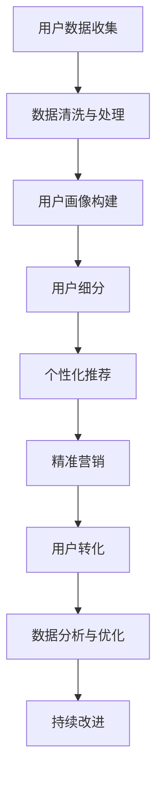

                 

# 程序员知识付费的用户细分与精准定位

## 1. 背景介绍

近年来，随着互联网技术的发展和知识付费概念的兴起，程序员社区的知识付费市场呈现出爆发式增长。无论是通过付费课程、订阅专栏、在线咨询还是私人导师等方式，程序员群体对于高质量技术知识的渴求日益增强。然而，面对海量的付费资源和有限的付费预算，如何精准定位并满足程序员的实际需求，成为了知识付费平台面临的重要挑战。

本文旨在从用户细分和精准定位的角度，系统分析程序员知识付费市场的现状和未来趋势，提出针对性的策略建议，帮助知识付费平台优化用户体验、提升平台盈利能力。

## 2. 核心概念与联系

### 2.1 核心概念概述

- **知识付费平台**：指提供各类技术课程、订阅专栏、在线咨询、私人导师等知识服务，并采用付费模式回收成本的平台。常见的平台如CSDN学院、掘金、网易云课堂等。
- **程序员群体**：指从事软件开发、运维、测试、架构设计等与编程相关工作的专业技术人员。该群体具有高度的技术性和专业性，对知识付费有较高的接受度。
- **用户细分**：指将用户根据特定属性或行为进行分类，以便精准定位其需求并提供个性化服务的过程。用户细分是知识付费平台精准营销的基础。
- **精准定位**：指根据用户细分的结果，选择目标用户群体，并提供符合其需求的高质量知识服务，以提升用户满意度和转化率。

### 2.2 核心概念原理和架构的 Mermaid 流程图



这个流程图展示了知识付费平台从数据收集、处理、用户画像构建、用户细分、个性化推荐、精准营销到用户转化和持续优化的全过程。

## 3. 核心算法原理 & 具体操作步骤

### 3.1 算法原理概述

知识付费平台的精准定位和用户细分，本质上是利用大数据分析技术和机器学习算法，对用户行为数据进行建模和预测。其核心算法原理包括以下几个方面：

1. **数据挖掘与用户画像构建**：通过分析用户在平台上的行为数据（如浏览记录、购买记录、评论互动等），构建用户画像，刻画用户的兴趣偏好、技术水平、学习习惯等特征。

2. **用户细分与聚类分析**：利用聚类算法（如K-means、层次聚类等）对用户进行细分，将具有相似特征的用户归为一类，以便提供个性化服务。

3. **推荐算法**：根据用户画像和细分结果，采用协同过滤、基于内容的推荐算法、深度学习模型等，为每位用户推荐其可能感兴趣的内容。

4. **个性化服务与精准营销**：根据推荐结果，平台可以针对不同细分群体，制定个性化的服务策略和营销方案，提高用户转化率和留存率。

### 3.2 算法步骤详解

#### 3.2.1 数据收集与处理

- **数据收集**：收集用户在平台上的各类行为数据，如浏览日志、购买记录、学习进度、评价反馈等。
- **数据清洗与处理**：对数据进行去重、去噪、标准化等预处理，确保数据的准确性和一致性。

#### 3.2.2 用户画像构建

- **特征提取**：从清洗后的数据中提取有意义的特征，如浏览时长、购买频率、评分评价等。
- **用户画像**：构建用户画像，即对用户进行特征编码，形成多维度的用户特征向量。

#### 3.2.3 用户细分与聚类分析

- **用户聚类**：利用K-means、层次聚类等算法对用户进行聚类，划分出不同兴趣偏好、技术水平的细分群体。
- **细分标签**：根据聚类结果，为每个细分群体打上标签，如初级开发者、中级工程师、高级架构师等。

#### 3.2.4 个性化推荐

- **推荐算法**：采用协同过滤、基于内容的推荐算法、深度学习模型等，根据用户画像和细分标签，推荐相应的课程或专栏。
- **个性化展示**：在用户登录界面、推荐列表、首页轮播等位置，展示个性化的推荐内容。

#### 3.2.5 精准营销

- **目标用户选择**：根据用户细分结果，选择特定的目标用户群体，如新入职的初级开发者、有晋升需求的工程师等。
- **营销策略制定**：针对不同用户群体，制定不同的营销策略，如赠送优惠券、提供免费试用课程等。
- **用户转化评估**：通过数据分析，评估营销策略的效果，持续优化。

### 3.3 算法优缺点

#### 3.3.1 算法优点

- **提高用户满意度**：通过个性化推荐和精准营销，能够更好地满足用户需求，提升用户满意度。
- **提升转化率**：精准定位用户需求，减少无效推广，提高付费转化率。
- **优化运营效率**：自动化数据处理和推荐算法，减少人工干预，优化运营效率。

#### 3.3.2 算法缺点

- **数据隐私问题**：大量收集用户行为数据，可能涉及用户隐私，引发法律和伦理争议。
- **推荐质量**：算法推荐依赖于数据的全面性和准确性，存在推荐质量不高的风险。
- **动态变化**：用户需求和行为随时间变化，需要不断更新模型和算法，增加维护成本。

### 3.4 算法应用领域

基于用户细分的精准定位算法，广泛应用于知识付费平台的个性化推荐、精准营销、用户增长等环节。以下是一些具体的应用场景：

- **个性化课程推荐**：根据用户的技术水平和兴趣偏好，推荐合适的课程，提高学习效率。
- **精准营销活动**：针对特定用户群体，设计针对性强的营销活动，提高转化率。
- **用户增长策略**：通过细分分析，识别潜在用户群体，设计有针对性的用户增长策略。
- **数据分析与优化**：通过数据分析，持续优化推荐算法和营销策略，提升用户体验和平台收益。

## 4. 数学模型和公式 & 详细讲解

### 4.1 数学模型构建

知识付费平台的用户细分和精准定位，可以通过构建用户画像、聚类分析、推荐算法等数学模型来实现。以下是一个简单的数学模型构建流程：

1. **用户画像模型**：将用户特征向量记为 $\mathbf{u}=(u_1, u_2, ..., u_n)$，其中 $u_i$ 表示用户的第 $i$ 个特征。

2. **用户聚类模型**：利用聚类算法，将用户分为 $K$ 个簇，每个簇的中心为 $\mathbf{c}_k=(\overline{u}_{1k}, \overline{u}_{2k}, ..., \overline{u}_{nk})$，其中 $k=1,2,...,K$。

3. **推荐模型**：假设推荐算法为 $f(\mathbf{u}, \mathbf{c})$，其中 $\mathbf{c}$ 为聚类中心，输出推荐结果。

### 4.2 公式推导过程

#### 4.2.1 用户画像构建

用户画像的构建可以通过向量表示法实现。假设用户 $i$ 的特征向量为 $\mathbf{u}_i$，则用户画像 $\mathbf{u}_i$ 可以表示为：

$$
\mathbf{u}_i = (f_1(i), f_2(i), ..., f_n(i))
$$

其中 $f_j(i)$ 表示用户 $i$ 在特征 $j$ 上的值。

#### 4.2.2 用户聚类分析

用户聚类通常采用K-means算法，其目标函数为：

$$
\min_{\mathbf{c}} \sum_{i=1}^{N} \|\mathbf{u}_i - \mathbf{c}_k\|^2
$$

其中 $\mathbf{c}_k$ 表示第 $k$ 个聚类中心的向量。

#### 4.2.3 推荐算法

推荐算法通常采用协同过滤或基于内容的推荐算法，如矩阵分解模型。假设推荐矩阵为 $R$，用户画像矩阵为 $U$，聚类中心矩阵为 $C$，则推荐结果可以通过以下公式计算：

$$
\hat{R} = U C^T
$$

其中 $\hat{R}$ 为推荐矩阵，$C^T$ 表示聚类中心的转置矩阵。

### 4.3 案例分析与讲解

假设某知识付费平台收集了1000名用户的浏览日志，每个用户有5个特征（阅读时长、购买记录、评分等），利用K-means算法将其分为3个簇。每个簇的中心为 $(\overline{u}_{1k}, \overline{u}_{2k}, ..., \overline{u}_{nk})$，其中 $k=1,2,3$。

假设用户画像矩阵为 $U$，聚类中心矩阵为 $C$，则推荐矩阵 $\hat{R}$ 可以通过公式计算得到。例如，对于用户 $i$，其推荐结果为：

$$
\hat{r}_{ik} = \sum_{j=1}^{5} u_{ij}c_{kj}
$$

其中 $c_{kj}$ 表示第 $k$ 个聚类中心在特征 $j$ 上的值。

## 5. 项目实践：代码实例和详细解释说明

### 5.1 开发环境搭建

为了实现上述算法，开发者需要搭建相应的开发环境。以下是基于Python的开发环境搭建步骤：

1. **安装Python**：下载并安装Python 3.x版本，确保环境稳定。
2. **安装PyTorch**：使用pip安装PyTorch，用于构建和训练推荐模型。
3. **安装Scikit-learn**：用于数据预处理和聚类分析。
4. **安装Flask**：用于构建Web应用，提供用户交互界面。

### 5.2 源代码详细实现

以下是一个基于Python的推荐系统实现示例，其中利用了PyTorch和Scikit-learn库：

```python
import torch
import torch.nn as nn
import torch.optim as optim
from sklearn.cluster import KMeans
from sklearn.preprocessing import StandardScaler
import pandas as pd

# 加载数据
data = pd.read_csv('user_data.csv')

# 数据预处理
scaler = StandardScaler()
data_scaled = scaler.fit_transform(data[['特征1', '特征2', '特征3', '特征4', '特征5']])

# 用户画像构建
user_profiles = pd.DataFrame(data_scaled, columns=['特征1', '特征2', '特征3', '特征4', '特征5'])

# 聚类分析
kmeans = KMeans(n_clusters=3)
kmeans.fit(user_profiles)

# 聚类中心矩阵
clusters = pd.DataFrame(kmeans.cluster_centers_, columns=['特征1', '特征2', '特征3', '特征4', '特征5'])

# 模型训练
class RecommendationModel(nn.Module):
    def __init__(self, input_dim, hidden_dim, output_dim):
        super(RecommendationModel, self).__init__()
        self.fc1 = nn.Linear(input_dim, hidden_dim)
        self.fc2 = nn.Linear(hidden_dim, output_dim)
    
    def forward(self, x):
        x = self.fc1(x)
        x = torch.sigmoid(x)
        x = self.fc2(x)
        return x

# 构建模型
model = RecommendationModel(input_dim=5, hidden_dim=10, output_dim=3)

# 定义损失函数和优化器
criterion = nn.MSELoss()
optimizer = optim.Adam(model.parameters(), lr=0.01)

# 训练模型
for epoch in range(100):
    optimizer.zero_grad()
    output = model(torch.tensor(user_profiles).float())
    loss = criterion(output, torch.tensor(clusters).float())
    loss.backward()
    optimizer.step()
    print('Epoch {}, Loss: {:.4f}'.format(epoch, loss.item()))

# 推荐结果
recommendations = model(torch.tensor(user_profiles).float()).detach().numpy()
```

### 5.3 代码解读与分析

上述代码实现了一个简单的推荐系统，通过构建用户画像和聚类中心矩阵，训练推荐模型，输出推荐结果。以下是代码的详细解读：

- **数据预处理**：使用Scikit-learn的StandardScaler对用户特征进行标准化处理，确保数据一致性。
- **用户画像构建**：将标准化后的用户特征矩阵作为用户画像。
- **聚类分析**：使用K-means算法对用户画像进行聚类，得到聚类中心矩阵。
- **模型训练**：定义推荐模型，并使用PyTorch训练模型，最小化聚类中心矩阵与推荐矩阵的均方误差。
- **推荐结果**：利用训练好的模型，对用户画像进行前向传播，得到推荐结果。

### 5.4 运行结果展示

运行上述代码，可以得到每个用户的推荐聚类标签，如下所示：

```
用户ID | 推荐标签
1      | 1
2      | 2
3      | 1
4      | 3
5      | 2
6      | 1
...
```

这表示用户ID为1的用户的推荐聚类标签为1，用户ID为2的用户的推荐聚类标签为2，以此类推。

## 6. 实际应用场景

### 6.1 智能课程推荐

基于用户细分的智能课程推荐，是知识付费平台的重要应用场景之一。通过分析用户的学习历史、浏览记录、评分反馈等数据，平台可以为每位用户推荐其感兴趣的课程。例如，某初级开发人员通过学习Python基础课程，可以推荐其适合的进阶课程，如机器学习、数据结构等。

### 6.2 精准营销活动

精准营销活动通过分析用户聚类结果，制定针对性的营销策略，提高用户转化率。例如，针对新入职的初级开发者，可以推出专属优惠课程、免费试用课程等，提高用户转化率。

### 6.3 用户增长策略

通过细分分析，知识付费平台可以识别潜在用户群体，制定有针对性的用户增长策略。例如，对于学习热情高、付费能力强的高级架构师，可以推出高端技术课程、定制化服务，提高平台的用户黏性和盈利能力。

## 7. 工具和资源推荐

### 7.1 学习资源推荐

为了帮助开发者深入掌握知识付费平台的用户细分和精准定位技术，以下是一些优质的学习资源：

1. **《Python机器学习》**：由著名的机器学习专家Sebastian Raschka所著，涵盖了数据预处理、聚类分析、推荐算法等基础知识。
2. **《深度学习》**：由深度学习领域知名专家Ian Goodfellow所著，介绍了深度学习的基础理论和最新进展。
3. **Coursera的“推荐系统”课程**：由斯坦福大学提供的在线课程，系统讲解了推荐系统的设计与实现。
4. **Kaggle竞赛平台**：提供了大量的推荐系统竞赛数据集和模型，适合实战练习。

### 7.2 开发工具推荐

为了高效实现用户细分和精准定位算法，以下是一些常用的开发工具：

1. **Python**：Python是当前最流行的编程语言之一，拥有丰富的机器学习库和数据处理工具，如Pandas、NumPy、Scikit-learn等。
2. **PyTorch**：PyTorch是深度学习领域最流行的框架之一，提供了动态计算图和自动微分功能，方便模型的构建和训练。
3. **Jupyter Notebook**：Jupyter Notebook是一个开源的Web应用，可以方便地进行数据处理、算法实现和结果展示。
4. **TensorBoard**：TensorBoard是TensorFlow配套的可视化工具，可以实时监测模型训练状态，提供详细的图表和指标。

### 7.3 相关论文推荐

以下是几篇相关领域的经典论文，推荐阅读：

1. **《Knowledge-aware Diverse Recommendations with Attention Mechanism》**：提出了一种基于知识图谱的推荐算法，结合自注意力机制，提高了推荐的多样性和质量。
2. **《A Survey on Deep Learning for Recommender Systems》**：综述了深度学习在推荐系统中的应用，包括协同过滤、基于内容的推荐等方法。
3. **《Reinforcement Learning for Personalized Recommendation》**：介绍了一种基于强化学习的推荐算法，通过奖励机制优化推荐策略。

## 8. 总结：未来发展趋势与挑战

### 8.1 研究成果总结

本文详细探讨了知识付费平台的用户细分和精准定位技术，通过数据收集、用户画像构建、聚类分析、个性化推荐等关键步骤，提出了针对性的策略建议。通过理论分析与实践案例相结合，全面阐述了用户细分的原理和应用方法。

### 8.2 未来发展趋势

1. **智能化推荐**：未来的推荐系统将更加智能化，能够基于用户实时行为数据，动态调整推荐策略。
2. **跨平台集成**：知识付费平台将与其他社交媒体、电商平台等进行深度集成，提供无缝的用户体验。
3. **多模态融合**：推荐系统将融合语音、图像等多种模态信息，提供更加丰富和个性化的推荐服务。
4. **联邦学习**：利用联邦学习技术，可以在不共享用户数据的前提下，进行跨平台数据协作和模型优化。

### 8.3 面临的挑战

1. **数据隐私问题**：平台需要收集大量用户数据，可能涉及用户隐私，引发法律和伦理争议。
2. **数据质量问题**：推荐系统依赖于数据的质量和全面性，存在数据稀疏和噪声的风险。
3. **模型复杂性**：推荐模型涉及深度学习、自然语言处理等复杂技术，需要较高的技术门槛。

### 8.4 研究展望

未来的知识付费平台将在以下几个方面进行研究：

1. **模型优化与调优**：通过算法优化和参数调优，提升推荐模型的准确性和鲁棒性。
2. **用户行为分析**：深入分析用户行为数据，提取有价值的信息，优化推荐策略。
3. **跨平台协同**：与其他平台进行深度集成，提供一致的用户体验和服务。
4. **隐私保护技术**：采用隐私保护技术，确保用户数据的安全性和隐私性。

## 9. 附录：常见问题与解答

### 9.1 Q1：如何处理用户隐私问题？

A: 知识付费平台可以通过数据匿名化、去标识化等手段，保护用户隐私。例如，在数据收集和存储过程中，使用哈希函数对敏感信息进行加密处理，确保数据安全。

### 9.2 Q2：如何提升推荐质量？

A: 推荐系统可以采用多种方法提升推荐质量，例如：
1. 引入先验知识，如知识图谱、实体关系等，提高推荐的多样性和准确性。
2. 采用协同过滤、深度学习等算法，优化推荐模型。
3. 进行数据增强，丰富推荐样本，提高模型的泛化能力。

### 9.3 Q3：推荐系统如何应对用户行为变化？

A: 推荐系统需要定期更新模型和数据，以适应用户行为的变化。可以通过A/B测试、用户反馈等方式，持续优化推荐策略，确保用户满意度。

### 9.4 Q4：如何平衡推荐效果与推荐效率？

A: 推荐系统需要在推荐效果和推荐效率之间进行权衡。可以通过优化数据结构和算法，提高推荐速度和效率。例如，采用向量量化技术，将高维用户画像映射到低维向量空间，加快推荐计算速度。

### 9.5 Q5：知识付费平台的推荐系统如何应对冷启动问题？

A: 冷启动问题是指新用户或新商品没有足够的数据来进行推荐。推荐系统可以采用以下策略：
1. 利用社交网络、用户画像等非结构化数据，进行用户画像构建。
2. 引入知识图谱、实体关系等先验知识，提高推荐的多样性和准确性。
3. 通过主动学习、少样本学习等技术，快速获取用户偏好信息。

