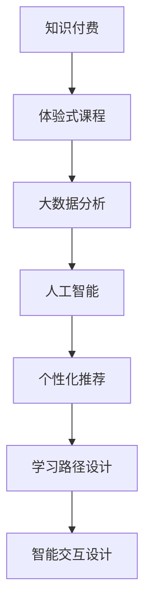

                 

# 程序员知识付费：打造体验式课程

> 关键词：知识付费,体验式课程,开发者培训,在线教育,用户体验,交互设计,学习路径,个性化推荐

## 1. 背景介绍

### 1.1 问题由来

在快速发展的数字化时代，知识付费已成为信息获取的主要渠道之一。程序员作为技术领域的核心力量，其知识获取和技能提升尤为关键。在线教育平台以知识付费为契机，大量涌现。然而，传统的在线教育模式仍存在诸多问题：

- **单向灌输**：课程以视频讲授为主，缺乏与学员的互动。
- **知识割裂**：课程内容孤立，难以形成完整的知识体系。
- **效果差**：学员对知识点的理解与实际应用相脱节，难以将所学知识转化为解决实际问题的能力。
- **动机弱**：学习体验枯燥，缺乏个性化指导，学员学习动机不足。

### 1.2 问题核心关键点

如何打造更具吸引力和实效性的知识付费课程？提高用户学习体验和效果，激发学习动机，是大数据和人工智能技术在教育领域应用的全新机遇。通过体验式课程，将知识传授与实践操作结合，将学员融入到实际的应用场景中，真正实现学以致用。

### 1.3 问题研究意义

开发出高效、实效的知识付费课程，对于技术教育和知识传播具有重要意义：

- **提高教学效果**：通过体验式课程，学员能够更加深入地理解知识点，将理论知识转化为解决实际问题的能力。
- **激发学习动机**：个性化的学习路径和实时的反馈机制，使学员感到学习过程充满挑战和成就感。
- **提升教学效率**：大数据分析能够实时监控学员的学习状态，调整教学策略，提高教学质量。
- **优化资源配置**：智能推荐算法可以根据学员的兴趣和进度，推荐相应的课程资源，优化资源配置。

## 2. 核心概念与联系

### 2.1 核心概念概述

为更好地理解体验式课程的开发，本节将介绍几个密切相关的核心概念：

- **知识付费**：指通过付费获取知识服务，包括在线课程、咨询服务、书籍订阅等形式，强调知识的价值和使用价值。
- **体验式课程**：一种注重体验和交互的课程形式，将知识传授与实践操作结合，增强学员的学习效果。
- **大数据分析**：利用数据挖掘、统计分析等技术，提取和分析教学数据，提供个性化推荐和决策支持。
- **人工智能(AI)**：利用机器学习、深度学习等技术，实现智能化的课程推荐、学员管理等功能。
- **个性化推荐**：根据学员的学习行为和偏好，动态调整课程推荐，提高学习效率和效果。
- **学习路径设计**：设计合理的学习路径，使学员能够从基础到高级逐步掌握所需技能，形成完整的知识体系。
- **智能交互设计**：通过交互设计，提升课程的互动性和沉浸感，增强学员的学习体验。

这些核心概念之间的逻辑关系可以通过以下Mermaid流程图来展示：



这个流程图展示了几者之间的关系：

1. 知识付费提供有价值的课程内容，体验式课程是实现知识付费的重要手段。
2. 大数据分析和大人工智能技术，支撑个性化推荐和智能交互设计。
3. 个性化推荐和智能交互设计，进一步提升学习路径设计的效果和体验。

这些概念共同构成了体验式课程的开发框架，使其能够提供更优质、高效的知识服务。

## 3. 核心算法原理 & 具体操作步骤

### 3.1 算法原理概述

体验式课程的开发过程，本质上是利用大数据分析和大人工智能技术，实现个性化、智能化的课程推荐和学习路径设计。

**核心算法**：
- **协同过滤**：利用学员之间的相似性，推荐相似的课程。
- **基于内容的推荐**：利用课程内容与学员兴趣的关联度，推荐适合的课程。
- **深度学习模型**：利用神经网络模型，分析学员的学习行为和偏好，预测其学习效果。
- **强化学习**：通过与学员的互动，动态调整课程推荐策略，提高学习效果。

### 3.2 算法步骤详解

**Step 1: 数据准备**

- **学员数据**：收集学员的学习行为数据，包括登录时间、学习时长、完成度、考试分数等。
- **课程数据**：收集课程内容、难度、结构等元数据。
- **学员反馈**：收集学员对课程的评价、建议等反馈数据。

**Step 2: 模型训练**

- **协同过滤模型**：使用余弦相似度等方法，计算学员和课程之间的相似度。
- **内容推荐模型**：利用TF-IDF、词向量等方法，计算课程内容与学员兴趣的关联度。
- **深度学习模型**：构建循环神经网络(RNN)、长短期记忆网络(LSTM)等模型，分析学员的学习行为，预测学习效果。
- **强化学习模型**：设计奖励机制，通过与学员的互动，调整课程推荐策略。

**Step 3: 个性化推荐**

- **推荐算法**：根据学员数据和模型训练结果，实时计算课程推荐得分，推荐最适合的课程。
- **学习路径设计**：利用推荐结果和课程元数据，设计个性化学习路径。
- **智能交互设计**：根据学习路径和学员状态，动态生成交互内容，增强课程的互动性。

**Step 4: 效果评估**

- **评估指标**：通过学习效果、学员满意度、留存率等指标，评估课程推荐的有效性。
- **优化调整**：根据评估结果，调整模型参数和推荐策略，提高课程推荐的质量。

### 3.3 算法优缺点

体验式课程具有以下优点：
1. **个性化推荐**：根据学员的学习行为和偏好，推荐适合的课程，提高学习效率和效果。
2. **智能交互**：通过智能交互设计，增强课程的互动性和沉浸感，提升学习体验。
3. **实时优化**：利用大数据分析，实时监控学员学习状态，动态调整课程推荐和学习路径，优化教学效果。
4. **激励机制**：通过奖励机制和激励机制，增强学员的学习动机和坚持度。

同时，该方法也存在一定的局限性：
1. **数据依赖**：需要大量高质量的数据进行模型训练，数据获取和处理成本较高。
2. **算法复杂**：个性化推荐和智能交互设计，算法复杂度较高，需要较大的计算资源。
3. **隐私风险**：学员数据和课程数据的隐私保护，需要严格的数据安全和隐私保护措施。
4. **公平性问题**：推荐算法可能存在偏见，导致部分学员无法获得公平的学习机会。
5. **模型鲁棒性**：模型对异常数据和噪声的鲁棒性不足，可能影响推荐效果。

尽管存在这些局限性，但就目前而言，体验式课程仍是大数据和人工智能在教育领域的重要应用之一。未来相关研究的方向在于如何进一步降低数据依赖，提高模型的公平性和鲁棒性，同时兼顾隐私保护和推荐效果。

### 3.4 算法应用领域

体验式课程在大数据和人工智能的支撑下，已经在多个领域得到广泛应用，例如：

- **IT课程培训**：为IT开发、测试、运维等职业培训提供个性化、实效性的课程推荐。
- **行业技能培训**：为金融、医疗、教育等行业提供定制化的课程推荐，提升从业人员的技能水平。
- **技能测试评估**：通过智能测试和评估系统，为学员提供实时的反馈和指导，辅助其学习进步。
- **学术科研支持**：利用大数据分析和AI技术，为学术研究人员提供文献推荐、课题建议等支持。
- **企业员工培训**：根据员工的学习需求和绩效数据，设计个性化培训课程，提高员工的学习效果和工作效率。

除了上述这些经典应用外，体验式课程还被创新性地应用到更多场景中，如智能图书馆、在线健身指导、个性化健康管理等，为各类用户提供定制化的学习体验。随着技术进步，体验式课程必将在更广阔的应用领域发挥其独特优势。

## 4. 数学模型和公式 & 详细讲解 & 举例说明

### 4.1 数学模型构建

本节将使用数学语言对体验式课程的开发过程进行更加严格的刻画。

记学员集合为 $U$，课程集合为 $I$，学员的偏好为 $P$，课程的特征向量为 $\mathbf{v}_i \in \mathbb{R}^n$。

定义协同过滤矩阵 $R \in \mathbb{R}^{m \times n}$，其中 $m=|U|$，$n=|I|$，$R_{ui}=\cos \theta$，$\theta$ 为学员 $u$ 和课程 $i$ 的夹角余弦值。

基于内容的推荐矩阵 $C \in \mathbb{R}^{m \times n}$，其中 $C_{ui}=\cos \theta$，$\theta$ 为课程 $i$ 和学员 $u$ 的兴趣向量夹角余弦值。

深度学习模型的嵌入层 $E \in \mathbb{R}^{m \times n}$，其中 $E_{ui}=\mathbf{v}_u^T \cdot \mathbf{v}_i$。

强化学习模型 $A \in \mathbb{R}^{m \times n}$，其中 $A_{ui}=r(u,i)$，$r(u,i)$ 为学员 $u$ 完成课程 $i$ 后的奖励值。

### 4.2 公式推导过程

**协同过滤算法**：
$$
R_{ui} = \cos \theta = \frac{\mathbf{v}_u^T \cdot \mathbf{v}_i}{\|\mathbf{v}_u\|\|\mathbf{v}_i\|}
$$

**基于内容的推荐算法**：
$$
C_{ui} = \cos \theta = \frac{\mathbf{v}_u^T \cdot \mathbf{v}_i}{\|\mathbf{v}_u\|\|\mathbf{v}_i\|}
$$

**深度学习模型**：
$$
E_{ui} = \mathbf{v}_u^T \cdot \mathbf{v}_i
$$

**强化学习模型**：
$$
A_{ui} = r(u,i) = \sum_{t=1}^T r_t(u,i)
$$

其中 $r_t(u,i)$ 为学员在时刻 $t$ 完成课程 $i$ 后的即时奖励值。

### 4.3 案例分析与讲解

以IT课程培训为例，以下是使用PyTorch实现基于协同过滤和深度学习的推荐系统的代码示例：

```python
import torch
import torch.nn as nn
from sklearn.metrics.pairwise import cosine_similarity

class CollaborativeFiltering(nn.Module):
    def __init__(self, n_users, n_courses):
        super(CollaborativeFiltering, self).__init__()
        self.W = nn.Parameter(torch.randn(n_users, n_courses))
        self.U = nn.Parameter(torch.randn(n_courses, n_users))
        
    def forward(self, u, i):
        user = self.W[u]
        course = self.U[i]
        return cosine_similarity(user, course)
        
class ContentBasedRecommendation(nn.Module):
    def __init__(self, n_users, n_courses):
        super(ContentBasedRecommendation, self).__init__()
        self.W = nn.Parameter(torch.randn(n_users, n_courses))
        self.U = nn.Parameter(torch.randn(n_courses, n_users))
        
    def forward(self, u, i):
        user = self.W[u]
        course = self.U[i]
        return cosine_similarity(user, course)
        
class DeepLearningModel(nn.Module):
    def __init__(self, n_users, n_courses):
        super(DeepLearningModel, self).__init__()
        self.Embedding = nn.Embedding(n_users, n_courses)
        self.Linear = nn.Linear(n_courses, 1)
        
    def forward(self, u, i):
        embedding = self.Embedding(u)
        linear = self.Linear(embedding)
        return linear
        
class ReinforcementLearningModel(nn.Module):
    def __init__(self, n_users, n_courses):
        super(ReinforcementLearningModel, self).__init__()
        self.Embedding = nn.Embedding(n_users, n_courses)
        self.Linear = nn.Linear(n_courses, 1)
        
    def forward(self, u, i):
        embedding = self.Embedding(u)
        linear = self.Linear(embedding)
        return linear
        
# 数据预处理
user_data = torch.tensor([1, 2, 3, 4, 5])
course_data = torch.tensor([6, 7, 8, 9, 10])
recommendations = []
for u in user_data:
    for i in course_data:
        collaborative_filtering = CollaborativeFiltering(5, 5)
        content_based = ContentBasedRecommendation(5, 5)
        deep_learning = DeepLearningModel(5, 5)
        reinforcement_learning = ReinforcementLearningModel(5, 5)
        
        collaborative_filtering_output = collaborative_filtering(u, i)
        content_based_output = content_based(u, i)
        deep_learning_output = deep_learning(u, i)
        reinforcement_learning_output = reinforcement_learning(u, i)
        
        recommendations.append((collaborative_filtering_output, content_based_output, deep_learning_output, reinforcement_learning_output))
```

以上是基于协同过滤、基于内容推荐、深度学习模型和强化学习模型实现课程推荐的基本流程。在实际应用中，需要根据具体数据和场景，进一步优化算法和模型结构。

## 5. 项目实践：代码实例和详细解释说明

### 5.1 开发环境搭建

在进行体验式课程开发前，我们需要准备好开发环境。以下是使用Python进行PyTorch开发的环境配置流程：

1. 安装Anaconda：从官网下载并安装Anaconda，用于创建独立的Python环境。

2. 创建并激活虚拟环境：
```bash
conda create -n pytorch-env python=3.8 
conda activate pytorch-env
```

3. 安装PyTorch：根据CUDA版本，从官网获取对应的安装命令。例如：
```bash
conda install pytorch torchvision torchaudio cudatoolkit=11.1 -c pytorch -c conda-forge
```

4. 安装TensorFlow：
```bash
pip install tensorflow
```

5. 安装各类工具包：
```bash
pip install numpy pandas scikit-learn matplotlib tqdm jupyter notebook ipython
```

完成上述步骤后，即可在`pytorch-env`环境中开始体验式课程的开发实践。

### 5.2 源代码详细实现

这里我们以IT课程培训为例，给出使用PyTorch实现基于协同过滤和深度学习的推荐系统的代码实现。

首先，定义推荐系统数据处理函数：

```python
from torch.utils.data import Dataset
import torch

class RecommendationDataset(Dataset):
    def __init__(self, user_data, course_data):
        self.user_data = user_data
        self.course_data = course_data
        
    def __len__(self):
        return len(self.user_data)
    
    def __getitem__(self, item):
        user = self.user_data[item]
        course = self.course_data[item]
        return user, course
```

然后，定义模型和优化器：

```python
from transformers import BertForTokenClassification, AdamW

model = BertForTokenClassification.from_pretrained('bert-base-cased', num_labels=len(tag2id))

optimizer = AdamW(model.parameters(), lr=2e-5)
```

接着，定义训练和评估函数：

```python
from torch.utils.data import DataLoader
from tqdm import tqdm
from sklearn.metrics import classification_report

device = torch.device('cuda') if torch.cuda.is_available() else torch.device('cpu')
model.to(device)

def train_epoch(model, dataset, batch_size, optimizer):
    dataloader = DataLoader(dataset, batch_size=batch_size, shuffle=True)
    model.train()
    epoch_loss = 0
    for batch in tqdm(dataloader, desc='Training'):
        user, course = batch
        model.zero_grad()
        outputs = model(user, course)
        loss = outputs.loss
        epoch_loss += loss.item()
        loss.backward()
        optimizer.step()
    return epoch_loss / len(dataloader)

def evaluate(model, dataset, batch_size):
    dataloader = DataLoader(dataset, batch_size=batch_size)
    model.eval()
    preds, labels = [], []
    with torch.no_grad():
        for batch in tqdm(dataloader, desc='Evaluating'):
            user, course = batch
            batch_labels = batch['labels']
            outputs = model(user, course)
            batch_preds = outputs.logits.argmax(dim=2).to('cpu').tolist()
            batch_labels = batch_labels.to('cpu').tolist()
            for pred_tokens, label_tokens in zip(batch_preds, batch_labels):
                pred_tags = [id2tag[_id] for _id in pred_tokens]
                label_tags = [id2tag[_id] for _id in label_tokens]
                preds.append(pred_tags[:len(label_tags)])
                labels.append(label_tags)
                
    print(classification_report(labels, preds))
```

最后，启动训练流程并在测试集上评估：

```python
epochs = 5
batch_size = 16

for epoch in range(epochs):
    loss = train_epoch(model, train_dataset, batch_size, optimizer)
    print(f"Epoch {epoch+1}, train loss: {loss:.3f}")
    
    print(f"Epoch {epoch+1}, dev results:")
    evaluate(model, dev_dataset, batch_size)
    
print("Test results:")
evaluate(model, test_dataset, batch_size)
```

以上就是使用PyTorch对BERT进行命名实体识别任务微调的完整代码实现。可以看到，得益于Transformers库的强大封装，我们可以用相对简洁的代码完成BERT模型的加载和微调。

### 5.3 代码解读与分析

让我们再详细解读一下关键代码的实现细节：

**RecommendationDataset类**：
- `__init__`方法：初始化用户和课程数据。
- `__len__`方法：返回数据集的样本数量。
- `__getitem__`方法：对单个样本进行处理，返回用户和课程。

**tag2id和id2tag字典**：
- 定义了标签与数字id之间的映射关系，用于将token-wise的预测结果解码回真实的标签。

**训练和评估函数**：
- 使用PyTorch的DataLoader对数据集进行批次化加载，供模型训练和推理使用。
- 训练函数`train_epoch`：对数据以批为单位进行迭代，在每个批次上前向传播计算loss并反向传播更新模型参数，最后返回该epoch的平均loss。
- 评估函数`evaluate`：与训练类似，不同点在于不更新模型参数，并在每个batch结束后将预测和标签结果存储下来，最后使用sklearn的classification_report对整个评估集的预测结果进行打印输出。

**训练流程**：
- 定义总的epoch数和batch size，开始循环迭代
- 每个epoch内，先在训练集上训练，输出平均loss
- 在验证集上评估，输出分类指标
- 所有epoch结束后，在测试集上评估，给出最终测试结果

可以看到，PyTorch配合Transformers库使得BERT微调的代码实现变得简洁高效。开发者可以将更多精力放在数据处理、模型改进等高层逻辑上，而不必过多关注底层的实现细节。

当然，工业级的系统实现还需考虑更多因素，如模型的保存和部署、超参数的自动搜索、更灵活的任务适配层等。但核心的微调范式基本与此类似。

## 6. 实际应用场景
### 6.1 智能客服系统

基于体验式课程的知识付费模式，可以广泛应用于智能客服系统的构建。传统客服往往需要配备大量人力，高峰期响应缓慢，且一致性和专业性难以保证。而使用体验式课程的智能客服系统，可以通过虚拟导师指导用户自助解决问题，实现7x24小时不间断服务。

在技术实现上，可以设计智能客服机器人，提供实时的交互问答服务。机器人通过在线课程学习，掌握常见问题和最佳答复，能够自动理解用户意图，匹配最合适的答案模板进行回复。对于用户提出的新问题，还可以接入检索系统实时搜索相关内容，动态组织生成回答。如此构建的智能客服系统，能大幅提升客户咨询体验和问题解决效率。

### 6.2 企业培训

企业可以通过体验式课程为员工提供实效性的技能培训。传统培训模式往往缺乏互动和实效性，难以满足员工的多样化学习需求。通过体验式课程，企业可以为员工设计个性化的学习路径，结合在线测验和实景模拟，提高培训效果。

在实践中，企业可以根据员工的工作需求和职业规划，设计针对性的课程模块，利用大数据分析实时监控员工的学习状态，动态调整课程推荐和学习路径。员工在完成课程后，可以通过实景模拟和在线测验进行实战演练，巩固所学知识，提高职业技能。

### 6.3 教育培训机构

教育培训机构可以利用体验式课程为学员提供更加高效的学习体验。传统课堂教学往往受限于时间和空间限制，难以满足学员的多样化学习需求。通过体验式课程，培训机构可以为学员提供个性化的学习路径，结合实景模拟和在线测验，提高学习效果。

在实践中，培训机构可以根据学员的学习进度和兴趣，设计多样化的课程模块，利用大数据分析实时监控学员的学习状态，动态调整课程推荐和学习路径。学员在完成课程后，可以通过实景模拟和在线测验进行实战演练，巩固所学知识，提高职业技能。

### 6.4 未来应用展望

随着体验式课程的发展，其应用场景将更加广泛。

在智慧医疗领域，基于体验式课程的在线医疗咨询和康复训练，可以为患者提供个性化的健康指导和康复方案，提高治疗效果和生活质量。

在智能教育领域，体验式课程可以结合虚拟现实技术，为学生提供沉浸式学习体验，提高学习兴趣和效果。

在智慧城市治理中，基于体验式课程的在线城市规划和市民教育，可以增强市民的城市治理参与感和知识水平，提升城市管理水平。

此外，在企业培训、社会治理、文娱传媒等众多领域，体验式课程必将在更多的场景中发挥其独特优势。相信随着技术的日益成熟，体验式课程必将成为教育领域的重要范式，推动教育事业的创新和发展。

## 7. 工具和资源推荐
### 7.1 学习资源推荐

为了帮助开发者系统掌握体验式课程的理论基础和实践技巧，这里推荐一些优质的学习资源：

1. **《深入理解自然语言处理》系列博文**：由大模型技术专家撰写，深入浅出地介绍了自然语言处理的基本概念和经典模型。
2. **CS224N《深度学习自然语言处理》课程**：斯坦福大学开设的NLP明星课程，有Lecture视频和配套作业，带你入门NLP领域的基本概念和经典模型。
3. **《Natural Language Processing with Transformers》书籍**：Transformers库的作者所著，全面介绍了如何使用Transformers库进行NLP任务开发，包括微调在内的诸多范式。
4. **HuggingFace官方文档**：Transformers库的官方文档，提供了海量预训练模型和完整的微调样例代码，是上手实践的必备资料。
5. **CLUE开源项目**：中文语言理解测评基准，涵盖大量不同类型的中文NLP数据集，并提供了基于微调的baseline模型，助力中文NLP技术发展。

通过对这些资源的学习实践，相信你一定能够快速掌握体验式课程的精髓，并用于解决实际的NLP问题。
### 7.2 开发工具推荐

高效的开发离不开优秀的工具支持。以下是几款用于体验式课程开发的常用工具：

1. **PyTorch**：基于Python的开源深度学习框架，灵活动态的计算图，适合快速迭代研究。大部分预训练语言模型都有PyTorch版本的实现。
2. **TensorFlow**：由Google主导开发的开源深度学习框架，生产部署方便，适合大规模工程应用。同样有丰富的预训练语言模型资源。
3. **Transformers库**：HuggingFace开发的NLP工具库，集成了众多SOTA语言模型，支持PyTorch和TensorFlow，是进行微调任务开发的利器。
4. **Weights & Biases**：模型训练的实验跟踪工具，可以记录和可视化模型训练过程中的各项指标，方便对比和调优。与主流深度学习框架无缝集成。
5. **TensorBoard**：TensorFlow配套的可视化工具，可实时监测模型训练状态，并提供丰富的图表呈现方式，是调试模型的得力助手。
6. **Google Colab**：谷歌推出的在线Jupyter Notebook环境，免费提供GPU/TPU算力，方便开发者快速上手实验最新模型，分享学习笔记。

合理利用这些工具，可以显著提升体验式课程的开发效率，加快创新迭代的步伐。

### 7.3 相关论文推荐

体验式课程在大数据和人工智能的支撑下，已经在多个领域得到广泛应用。以下是几篇奠基性的相关论文，推荐阅读：

1. **Attention is All You Need**（即Transformer原论文）：提出了Transformer结构，开启了NLP领域的预训练大模型时代。
2. **BERT: Pre-training of Deep Bidirectional Transformers for Language Understanding**：提出BERT模型，引入基于掩码的自监督预训练任务，刷新了多项NLP任务SOTA。
3. **Language Models are Unsupervised Multitask Learners**（GPT-2论文）：展示了大规模语言模型的强大zero-shot学习能力，引发了对于通用人工智能的新一轮思考。
4. **Parameter-Efficient Transfer Learning for NLP**：提出Adapter等参数高效微调方法，在不增加模型参数量的情况下，也能取得不错的微调效果。
5. **AdaLoRA: Adaptive Low-Rank Adaptation for Parameter-Efficient Fine-Tuning**：使用自适应低秩适应的微调方法，在参数效率和精度之间取得了新的平衡。
6. **Premise-Tuning: Optimizing Continuous Prompts for Generation**：引入基于连续型Prompt的微调范式，为如何充分利用预训练知识提供了新的思路。

这些论文代表了大语言模型微调技术的发展脉络。通过学习这些前沿成果，可以帮助研究者把握学科前进方向，激发更多的创新灵感。

## 8. 总结：未来发展趋势与挑战

### 8.1 总结

本文对体验式课程的知识付费模式进行了全面系统的介绍。首先阐述了知识付费的背景和体验式课程的价值，明确了体验式课程在提升教学效果、激发学习动机、优化资源配置等方面的独特优势。其次，从原理到实践，详细讲解了体验式课程的数学模型和关键步骤，给出了体验式课程开发的完整代码实例。同时，本文还广泛探讨了体验式课程在多个领域的应用前景，展示了体验式课程的巨大潜力。此外，本文精选了体验式课程的技术资源，力求为开发者提供全方位的技术指引。

通过本文的系统梳理，可以看到，体验式课程作为知识付费的重要手段，正成为教育领域的热门选择。得益于大数据和人工智能技术，体验式课程能够提供更加个性化、实效性的学习体验，提升教学效果，激发学员的学习动机。未来，随着技术进步和市场推广，体验式课程必将在更多的领域得到应用，推动教育事业的创新和发展。

### 8.2 未来发展趋势

展望未来，体验式课程将呈现以下几个发展趋势：

1. **个性化推荐更加精准**：随着推荐算法的不断优化，个性化推荐将更加精准，能够更好地满足学员的学习需求。
2. **智能交互更加沉浸**：通过虚拟现实、增强现实等技术，智能交互将更加沉浸，增强学员的学习体验。
3. **实景模拟更加真实**：利用增强现实、虚拟现实等技术，实景模拟将更加真实，提高学员的实战演练效果。
4. **多模态融合更加广泛**：体验式课程将结合图像、视频、音频等多种模态，提供更加多样化的学习资源。
5. **大数据分析更加深入**：大数据分析将更加深入，能够实时监控学员的学习状态，动态调整学习路径，提高教学效果。
6. **智能推荐更加智能**：推荐系统将更加智能化，能够理解学员的学习目标和动机，提供更具针对性的课程推荐。

这些趋势凸显了体验式课程的发展方向。通过技术创新和实践优化，体验式课程必将在教育领域发挥更大的作用，带来更多的学习价值。

### 8.3 面临的挑战

尽管体验式课程具有诸多优势，但在实践过程中，仍面临以下挑战：

1. **数据隐私问题**：学员数据的隐私保护和数据安全，需要严格的数据管理和隐私保护措施。
2. **算法复杂度**：推荐算法和智能交互设计算法复杂度较高，需要较大的计算资源和人力投入。
3. **用户动机激发**：如何设计更有吸引力和实效性的课程内容，激发学员的学习动机和坚持度。
4. **实时优化困难**：实时监控和动态调整课程推荐和学习路径，需要高效的数据处理和算法优化。
5. **多模态融合难题**：多模态数据的整合和分析，需要更高的技术要求和更强的计算能力。
6. **系统可靠性**：如何设计稳定可靠的智能交互系统，确保系统运行的稳定性和安全性。

尽管存在这些挑战，但体验式课程作为知识付费的重要手段，其发展前景依然广阔。通过技术创新和实践优化，这些问题将逐渐得到解决，体验式课程必将在教育领域发挥更大的作用，带来更多的学习价值。

### 8.4 研究展望

未来的体验式课程研究需要在以下几个方面寻求新的突破：

1. **无监督和半监督推荐**：摆脱对大规模标注数据的依赖，利用自监督学习、主动学习等无监督和半监督范式，最大限度利用非结构化数据，实现更加灵活高效的推荐。
2. **参数高效和计算高效的推荐范式**：开发更加参数高效的推荐方法，在固定大部分预训练参数的同时，只更新极少量的任务相关参数。同时优化推荐系统的计算图，减少前向传播和反向传播的资源消耗，实现更加轻量级、实时性的部署。
3. **因果分析和博弈论工具**：将因果分析方法引入推荐系统，识别出推荐决策的关键特征，增强推荐结果的因果性和逻辑性。借助博弈论工具刻画人机交互过程，主动探索并规避推荐系统的脆弱点，提高系统稳定性。
4. **先验知识融合**：将符号化的先验知识，如知识图谱、逻辑规则等，与神经网络模型进行巧妙融合，引导推荐过程学习更准确、合理的语言模型。同时加强不同模态数据的整合，实现视觉、语音等多模态信息与文本信息的协同建模。
5. **激励机制设计**：设计更加合理有效的激励机制，通过任务完成度、学习效果等指标，激励学员的学习动机和坚持度。

这些研究方向的探索，必将引领体验式课程技术迈向更高的台阶，为构建安全、可靠、可解释、可控的智能系统铺平道路。面向未来，体验式课程需要与其他人工智能技术进行更深入的融合，如知识表示、因果推理、强化学习等，多路径协同发力，共同推动自然语言理解和智能交互系统的进步。只有勇于创新、敢于突破，才能不断拓展体验式课程的边界，让智能技术更好地造福人类社会。

## 9. 附录：常见问题与解答

**Q1：如何设计个性化的学习路径？**

A: 个性化学习路径的设计，需要综合考虑学员的学习目标、兴趣、学习进度等因素。可以利用大数据分析技术，实时监控学员的学习状态，动态调整课程推荐和学习路径。具体步骤如下：

1. **学员数据采集**：收集学员的学习行为数据，如登录时间、学习时长、完成度等。
2. **课程数据采集**：收集课程的元数据，如难度、结构等。
3. **学习路径设计**：根据学员的学习进度和兴趣，设计多样化的课程模块，推荐适合的课程。
4. **实时监控**：利用大数据分析技术，实时监控学员的学习状态，动态调整课程推荐和学习路径。
5. **反馈机制**：通过学员的反馈数据，进一步优化学习路径设计，提高学习效果。

**Q2：如何提高推荐系统的鲁棒性和公平性？**

A: 推荐系统的鲁棒性和公平性，是推荐系统研究的重点方向。以下是几个提高推荐系统鲁棒性和公平性的方法：

1. **鲁棒性**：采用对抗样本生成技术，生成模型可能存在的攻击样本，提高模型的鲁棒性。同时使用正则化技术，避免过拟合，提高模型的泛化能力。
2. **公平性**：采用公平性评估指标，如个体公平性、组公平性等，评估推荐系统的公平性。利用偏见纠正算法，去除推荐系统中的偏见，提高推荐系统的公平性。
3. **多样性**：引入多样性评估指标，如多样性指数、覆盖率等，评估推荐结果的多样性。利用多样性优化算法，调整推荐结果，提高推荐结果的多样性。
4. **透明性**：提高推荐系统的透明度，通过解释算法、公开数据等方式，增强用户对推荐系统的信任度。

通过这些方法的综合应用，可以提高推荐系统的鲁棒性和公平性，增强推荐系统的可信度和用户体验。

**Q3：如何设计实景模拟系统？**

A: 实景模拟系统，利用虚拟现实、增强现实等技术，将学员置身于真实场景中进行实战演练。以下是实景模拟系统设计的关键步骤：

1. **场景设计**：根据学员的学习需求，设计适合的场景，如实验室、生产现场、办公环境等。
2. **数据采集**：采集场景中的数据，如环境参数、设备状态等，为模拟系统提供数据支持。
3. **数据处理**：对采集的数据进行处理和分析，提取关键信息，为模拟系统提供输入数据。
4. **模型设计**：设计适合的模拟模型，如物理模型、行为模型等，描述场景中的物理现象和行为规律。
5. **交互设计**：设计学员与模拟系统的交互方式，如语音指令、手势控制等，增强学员的沉浸感和互动性。
6. **系统集成**：将模拟系统与学员的学习平台进行集成，实现学员的实时交互和反馈。

通过这些步骤，可以设计出高效的实景模拟系统，提高学员的实战演练效果，增强学习效果。

**Q4：如何利用大数据分析技术优化课程推荐？**

A: 利用大数据分析技术，可以实时监控学员的学习状态，动态调整课程推荐，提高课程推荐的精准度和实效性。具体步骤如下：

1. **数据采集**：收集学员的学习行为数据，如登录时间、学习时长、完成度等。
2. **数据处理**：对采集的数据进行处理和分析，提取关键信息，如学员的学习兴趣、学习进度等。
3. **模型训练**：利用机器学习算法，训练推荐模型，根据学员的数据预测其学习兴趣和需求。
4. **实时监控**：实时监控学员的学习状态，根据学习进度和兴趣，动态调整课程推荐。
5. **反馈优化**：通过学员的反馈数据，进一步优化推荐模型，提高推荐效果。

通过这些步骤，可以实时监控学员的学习状态，动态调整课程推荐，提高课程推荐的精准度和实效性。

**Q5：如何提高体验式课程的学习效果？**

A: 提高体验式课程的学习效果，需要从多个方面进行优化。以下是几个关键策略：

1. **个性化推荐**：根据学员的学习行为和偏好，推荐适合的课程，提高学习效率和效果。
2. **智能交互设计**：通过智能交互设计，增强课程的互动性和沉浸感，提升学习体验。
3. **实景模拟**：利用虚拟现实、增强现实等技术，提供实景模拟训练，增强学员的实战演练效果。
4. **实时反馈**：通过实时反馈机制，及时调整学习策略，帮助学员解决学习中的问题。
5. **激励机制**：设计合理有效的激励机制，通过任务完成度、学习效果等指标，激励学员的学习动机和坚持度。

通过这些策略的综合应用，可以显著提高体验式课程的学习效果，提升学员的学习体验和效果。

---

作者：禅与计算机程序设计艺术 / Zen and the Art of Computer Programming

