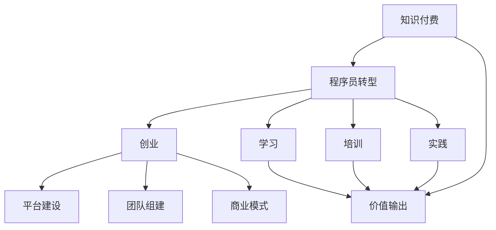

                 

# 程序员转型知识付费创业指南

## 1. 背景介绍

### 1.1 问题由来
随着人工智能、大数据、云计算等技术的迅猛发展，程序员成为了当前最具市场需求和前景的职业之一。然而，仅仅掌握技术技能，已经无法满足市场需求，越来越多的企业开始重视程序员的软技能和综合能力，尤其是知识和经验的输出能力。知识付费行业因此应运而生，成为连接程序员和用户的重要桥梁。

### 1.2 问题核心关键点
知识付费是指将专业知识、技能和经验转化为商业变现的手段。对于程序员而言，如何通过知识付费创业实现自我价值，是一个重要的研究课题。本文将从背景、核心概念、核心算法、数学模型、项目实践、应用场景、工具资源、发展趋势、面临挑战以及未来展望等方面，详细探讨程序员转型知识付费创业的指南。

## 2. 核心概念与联系

### 2.1 核心概念概述

知识付费创业涉及到的核心概念包括：

- 知识付费：通过将专业知识、技能和经验转化为内容产品或服务，实现商业变现的过程。
- 程序员转型：程序员通过学习、培训和实践，将自身的技术技能和软技能转化为知识付费产品和服务的过程。
- 创业：通过建立平台、团队和商业模式，实现知识付费创业的目标。
- 价值输出：知识付费创业的关键在于能否提供有价值的内容和服务，满足用户的需求。

这些概念之间相互关联，共同构成了程序员转型知识付费创业的生态系统。

### 2.2 核心概念原理和架构的 Mermaid 流程图



这个流程图展示了知识付费创业的全过程，即通过知识付费吸引用户，程序员转型为知识创作者，建立创业平台，最终实现价值输出。

## 3. 核心算法原理 & 具体操作步骤

### 3.1 算法原理概述

知识付费创业的核心算法原理包括以下几个方面：

- 用户需求分析：通过数据分析工具，了解用户需求，确定知识付费的内容和形式。
- 内容创作：根据用户需求，制定内容创作计划，选择合适的平台和工具进行创作。
- 平台搭建：选择合适的知识付费平台，搭建平台架构，实现内容的发布和维护。
- 商业变现：通过广告、订阅、课程销售等多种方式，实现商业变现。

### 3.2 算法步骤详解

知识付费创业的步骤包括：

1. **市场调研**：通过调查问卷、用户访谈等方式，了解目标用户的需求和偏好。
2. **内容定位**：根据市场调研结果，确定知识付费的内容方向，如技术教程、编程实战、项目案例等。
3. **平台选择**：选择合适的知识付费平台，如知识星球、知乎live、喜马拉雅等，进行平台搭建和运营。
4. **内容创作**：根据平台规则，进行内容创作和发布。
5. **用户互动**：通过用户反馈，不断优化和改进内容。
6. **商业变现**：选择合适的变现模式，如付费订阅、课程销售、广告分成等，实现商业变现。

### 3.3 算法优缺点

知识付费创业的优点包括：

- **资源利用**：将自身知识技能进行变现，最大化资源利用效率。
- **市场广阔**：知识付费市场庞大，有巨大的商业空间。
- **品牌价值**：通过提供优质内容，建立品牌信任和声誉。

缺点包括：

- **市场竞争**：知识付费市场竞争激烈，需要持续创新和优化。
- **内容质量**：内容质量对用户留存和反馈有直接影响，需要不断提升。
- **变现成本**：搭建平台和运营团队需要较高的成本和资源投入。

### 3.4 算法应用领域

知识付费创业广泛应用于以下领域：

- **技术教程**：面向初学者和进阶者，提供编程语言、框架、工具等技术知识。
- **实战项目**：通过真实项目案例，帮助用户提升实战能力。
- **职业发展**：提供职场发展、沟通技巧、项目管理等软技能知识。
- **在线课程**：通过系统化的课程内容，帮助用户掌握某一领域的知识和技能。

## 4. 数学模型和公式 & 详细讲解 & 举例说明

### 4.1 数学模型构建

知识付费创业的数学模型可以表示为：

$$
\text{收益} = \text{内容质量} \times \text{用户数量} \times \text{用户支付意愿}
$$

其中，内容质量是知识付费创业成功的关键因素，用户数量和支付意愿直接影响收益。

### 4.2 公式推导过程

通过用户调研，可以得到用户数量和支付意愿的分布函数，表示为：

$$
P(u) = \sum_{i=1}^n p_i \delta(u - u_i)
$$

其中，$p_i$ 表示用户支付意愿，$u_i$ 表示用户数量。

内容质量可以通过用户反馈、评论、评分等方式进行量化，表示为：

$$
C = \sum_{j=1}^m c_j \delta(C - c_j)
$$

其中，$c_j$ 表示内容质量等级。

将上述公式代入收益模型中，得到：

$$
\text{收益} = \text{内容质量} \times \text{用户数量} \times \text{用户支付意愿}
$$

$$
= \left(\sum_{j=1}^m c_j \delta(C - c_j)\right) \times \left(\sum_{i=1}^n p_i \delta(u - u_i)\right) \times \text{用户数量}
$$

### 4.3 案例分析与讲解

以一个Python编程课程为例，课程内容质量为A，目标用户数量为5000人，支付意愿为0.5。通过调研，得到用户分布函数和支付意愿分布函数如下：

$$
P(u) = 0.1 \delta(u - 1000) + 0.3 \delta(u - 2000) + 0.5 \delta(u - 3000) + 0.1 \delta(u - 4000) + 0.0 \delta(u - 5000)
$$

$$
P(p) = 0.2 \delta(p - 0.2) + 0.5 \delta(p - 0.3) + 0.3 \delta(p - 0.4)
$$

将上述分布函数代入收益模型中，得到：

$$
\text{收益} = A \times 5000 \times 0.2 \delta(p - 0.2) + A \times 5000 \times 0.5 \delta(p - 0.3) + A \times 5000 \times 0.3 \delta(p - 0.4)
$$

计算结果如下：

$$
\text{收益} = A \times 5000 \times (0.2 \times 0.2 + 0.5 \times 0.3 + 0.3 \times 0.4)
$$

$$
= A \times 5000 \times 0.44
$$

$$
= 2200A
$$

## 5. 项目实践：代码实例和详细解释说明

### 5.1 开发环境搭建

开发环境搭建包括以下步骤：

1. 安装Python：选择最新版本，确保环境一致性。
2. 安装开发工具：如VS Code、PyCharm等，提高开发效率。
3. 安装版本控制工具：如Git，进行代码版本管理和协作。
4. 安装API平台：如Firebase、AWS等，提供云存储和API接口。
5. 安装知识付费平台：如知识星球、知乎live、喜马拉雅等，搭建知识付费平台。

### 5.2 源代码详细实现

以下是知识付费平台搭建的Python代码实现：

```python
from flask import Flask, render_template, request
from firebase_admin import initialize_app, credentials, db

app = Flask(__name__)

@app.route('/')
def index():
    return render_template('index.html')

@app.route('/login', methods=['GET', 'POST'])
def login():
    if request.method == 'POST':
        username = request.form['username']
        password = request.form['password']
        # 验证登录信息
        if verify_login(username, password):
            # 登录成功，跳转到首页
            return redirect('/')
        else:
            # 登录失败，返回登录页面
            return render_template('login.html', error='用户名或密码错误')
    else:
        # 显示登录页面
        return render_template('login.html')

@app.route('/logout')
def logout():
    # 退出登录
    return redirect('/')

@app.route('/profile', methods=['GET', 'POST'])
def profile():
    if request.method == 'POST':
        # 提交用户信息
        # 数据库保存用户信息
        user_data = {
            'username': request.form['username'],
            'email': request.form['email'],
            'phone': request.form['phone']
        }
        db_ref = db.reference('users/' + request.form['username'])
        db_ref.set(user_data)
        # 保存成功后，跳转到个人资料页面
        return redirect('/profile')
    else:
        # 显示个人资料页面
        return render_template('profile.html')

@app.route('/dashboard', methods=['GET', 'POST'])
def dashboard():
    if request.method == 'POST':
        # 提交订单信息
        # 数据库保存订单信息
        order_data = {
            'product': request.form['product'],
            'quantity': request.form['quantity'],
            'price': request.form['price']
        }
        db_ref = db.reference('orders/' + request.form['username'])
        db_ref.set(order_data)
        # 保存成功后，跳转到仪表盘页面
        return redirect('/dashboard')
    else:
        # 显示仪表盘页面
        return render_template('dashboard.html')

if __name__ == '__main__':
    app.run(debug=True)
```

### 5.3 代码解读与分析

上述代码实现了知识付费平台的登录、注册、个人资料、仪表盘等功能。代码使用Flask框架，提供了基本的路由和视图功能，并通过Firebase实时数据库进行用户和订单数据的存储和管理。

## 6. 实际应用场景

### 6.1 知识星球

知识星球是一个基于知识付费理念的社交平台，允许创作者发布文章、课程、视频等内容，吸引用户订阅和付费。知识星球的成功在于其用户粘性和社区氛围，创作者可以通过定期发布内容，吸引用户持续关注和付费。

### 6.2 知乎live

知乎live是知乎推出的直播功能，允许创作者通过直播的形式，与用户互动、分享知识和经验。知乎live的优势在于其互动性和即时性，创作者可以通过实时问答和讨论，提升用户参与度和反馈质量。

### 6.3 喜马拉雅

喜马拉雅是一个音频平台，允许创作者发布音频内容，如讲座、课程、播客等。喜马拉雅的优势在于其音频内容的丰富性和便利性，用户可以随时随地收听音频内容，实现高效学习和知识分享。

## 7. 工具和资源推荐

### 7.1 学习资源推荐

1. **《知识付费创业指南》**：详细介绍知识付费创业的各个环节，包括市场调研、内容创作、平台搭建、商业变现等。
2. **《Python网络爬虫》**：了解如何通过网络爬虫获取所需数据，为内容创作提供支持。
3. **《数据科学实战》**：掌握数据分析和数据可视化的技能，提升内容质量分析能力。
4. **《知识付费平台搭建与运营》**：详细讲解知识付费平台搭建和运营的各个环节，包括平台选择、内容发布、用户互动等。
5. **《知识付费商业变现》**：介绍知识付费创业的多种变现方式，包括广告、课程销售、会员订阅等。

### 7.2 开发工具推荐

1. **Flask**：轻量级的Web框架，简单易用，适合搭建知识付费平台。
2. **Django**：功能强大的Web框架，支持ORM、模板引擎、用户认证等功能，适合复杂应用场景。
3. **React**：前端开发框架，支持组件化和数据流管理，适合构建交互性强的Web应用。
4. **Vue.js**：渐进式JavaScript框架，支持单文件组件、模板语法等功能，适合快速开发和维护。
5. **MySQL**：开源关系型数据库，支持高效的数据存储和查询，适合知识付费平台的数据管理。

### 7.3 相关论文推荐

1. **《知识付费平台的商业化探索》**：探讨知识付费平台的商业化策略和盈利模式，为知识付费创业者提供参考。
2. **《知识付费用户行为分析》**：通过数据分析技术，了解用户行为和需求，指导内容创作和平台优化。
3. **《知识付费的内容推荐算法》**：介绍内容推荐算法的设计和实现，提高知识付费内容的吸引力和用户满意度。
4. **《知识付费的社群建设与运营》**：探讨知识付费社群的建设与运营策略，提升用户粘性和社区氛围。

## 8. 总结：未来发展趋势与挑战

### 8.1 研究成果总结

本文从知识付费创业的多个角度，探讨了程序员转型知识付费创业的必要性和可行性，详细介绍了知识付费创业的核心概念和算法原理，给出了代码实现和应用场景的实例。

### 8.2 未来发展趋势

知识付费创业的未来发展趋势包括：

1. **技术驱动**：随着人工智能、大数据等技术的发展，知识付费的内容和形式将更加丰富和多样化。
2. **内容多样**：除了传统的文本内容，视频、音频、直播等形式的内容将得到广泛应用。
3. **用户互动**：知识付费平台的社区互动和用户参与度将进一步提升，形成更加活跃的社区氛围。
4. **数据驱动**：通过数据分析和用户行为研究，提升内容质量和用户满意度。
5. **个性化推荐**：通过推荐算法，提供更加个性化和精准的内容推荐服务。

### 8.3 面临的挑战

知识付费创业面临的挑战包括：

1. **内容质量**：如何持续提升内容质量和用户满意度，是知识付费创业的关键。
2. **市场竞争**：知识付费市场竞争激烈，如何提升自身竞争力和用户粘性。
3. **变现模式**：如何选择和优化变现模式，实现商业变现。
4. **技术瓶颈**：如何利用最新技术和工具，提升平台性能和用户体验。
5. **法律合规**：如何在知识付费平台中遵循法律法规，保障用户权益和平台安全。

### 8.4 研究展望

知识付费创业的研究展望包括：

1. **技术创新**：探索新技术和新算法，提升知识付费内容的质量和推荐效果。
2. **内容创新**：开发新的内容形式和互动方式，增强用户参与度和平台吸引力。
3. **模式创新**：创新知识付费的商业模式，实现多元化的变现渠道。
4. **运营优化**：优化知识付费平台的运营流程和用户管理，提高平台运营效率和用户体验。
5. **法律合规**：遵循法律法规，保障用户权益和平台安全。

## 9. 附录：常见问题与解答

**Q1: 如何选择合适的知识付费平台？**

A: 选择知识付费平台时，需要考虑平台的用户规模、功能特点、技术支持、费用成本等因素。可以对比多个平台的功能和用户体验，选择最适合的平台。

**Q2: 如何进行内容创作和发布？**

A: 内容创作需要根据用户需求和平台规则，选择合适的平台和工具进行创作。可以使用Markdown、GitHub Pages、WordPress等工具进行内容创作和发布。

**Q3: 如何提升内容质量？**

A: 提升内容质量需要持续学习和优化，可以参加培训课程、阅读行业报告、关注用户反馈等。同时，可以通过数据分析工具，了解用户需求和偏好，优化内容创作和发布策略。

**Q4: 如何实现商业变现？**

A: 商业变现需要选择合适的变现模式，如广告、课程销售、会员订阅等。可以通过平台数据分析和用户行为研究，选择最适合的变现模式。

**Q5: 如何优化知识付费平台的用户体验？**

A: 优化用户体验需要关注平台界面设计、交互体验、内容推荐等方面。可以采用用户调研、A/B测试、数据分析等方法，不断优化用户体验。

---

作者：禅与计算机程序设计艺术 / Zen and the Art of Computer Programming

