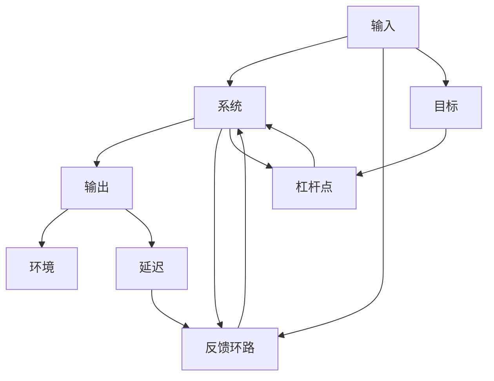

                 

# 系统思考在战略规划中的应用

> 关键词：系统思考,战略规划,复杂系统,组织管理,领导力

## 1. 背景介绍

在当今快速变化和不确定性增加的商业环境中，企业必须采用更加灵活和适应性强的战略规划方法。系统思考(Systemic Thinking)作为一门综合理论，提供了一种理解复杂系统并为其制定有效战略的全新视角。本文旨在探讨系统思考在战略规划中的应用，帮助企业领导者识别系统中的关键因素，理解系统行为和潜在的非线性影响，从而制定出更加稳健和可持续的战略。

## 2. 核心概念与联系

### 2.1 核心概念概述

系统思考是一种思考方式，强调将问题视为一个整体系统，探索系统各部分之间的相互关系，理解系统结构和动态。系统思考的关键概念包括：

- **系统**：一个由相互作用元素组成的整体，具有明确的边界和功能。
- **输入和输出**：系统与环境之间的能量和信息交换。
- **反馈环路**：系统内部或系统与环境之间的信息循环，影响系统行为。
- **延迟**：系统内部变化与结果之间的时滞。
- **杠杆点**：能够对系统行为产生显著影响的关键控制点。

系统思考与战略规划密切相关，通过深入分析系统的动态和结构，帮助决策者发现和利用系统的杠杆点，制定出具有全局视角的战略规划。

### 2.2 核心概念原理和架构的 Mermaid 流程图



这个流程图展示了系统思考在战略规划中的基本框架：输入、系统、输出、反馈环路、杠杆点和延迟。这些元素相互作用，共同塑造了系统的行为和输出。

## 3. 核心算法原理 & 具体操作步骤

### 3.1 算法原理概述

系统思考在战略规划中的应用，主要围绕以下几个步骤展开：

1. **系统建模**：建立系统的模型，识别系统的关键要素和它们之间的关系。
2. **分析反馈环路**：理解系统内部的反馈机制，识别和分析系统的动态行为。
3. **识别杠杆点**：发现系统中的关键控制点，可以显著影响系统行为的元素。
4. **设定目标**：根据系统分析和杠杆点识别，设定战略目标。
5. **制定战略措施**：针对杠杆点制定具体的战略措施，以实现目标。
6. **实施与监控**：执行战略措施，并持续监控系统行为，及时调整策略。

### 3.2 算法步骤详解

#### 步骤1：系统建模

系统建模是理解系统的第一步，通过绘制系统的结构图，识别系统的关键要素和它们之间的关系。常用的系统建模工具包括：

- **因果图**：显示系统中的因果关系，帮助理解输入和输出之间的动态关系。
- **稳态图**：表示系统在稳态（平衡状态）下的状态和相互作用。
- **动态图**：展示系统随时间变化的行为，强调反馈环路和延迟的影响。

#### 步骤2：分析反馈环路

反馈环路是系统行为的重要组成部分，理解反馈环路可以帮助预测系统的未来行为。分析反馈环路的方法包括：

- **正反馈和负反馈**：识别反馈环路是增强系统行为还是抑制系统行为。
- **延迟分析**：理解延迟如何影响系统响应，预测延迟后的系统行为。
- **灵敏度分析**：评估系统对不同输入的响应程度。

#### 步骤3：识别杠杆点

杠杆点（Leverage Points）是系统中的关键控制点，通过改变这些点可以显著影响系统行为。识别杠杆点的方法包括：

- **控制点分析**：识别系统中的可控因素。
- **瓶颈分析**：确定系统中的瓶颈环节。
- **模型敏感性分析**：评估不同参数对系统行为的影响。

#### 步骤4：设定目标

根据系统分析和杠杆点识别，设定战略目标。设定目标时应考虑：

- **SMART原则**：目标应具体、可测量、可达成、相关性强、时限性。
- **层次分析**：将目标分解为多个子目标，形成层次结构。
- **目标优先级**：根据系统的重要性和紧急性，确定目标的优先级。

#### 步骤5：制定战略措施

根据杠杆点制定具体的战略措施，以实现目标。制定战略措施时应考虑：

- **干预策略**：针对杠杆点制定具体的干预措施。
- **资源分配**：评估资源分配，确保关键措施得到充分支持。
- **风险管理**：评估潜在风险，制定应对措施。

#### 步骤6：实施与监控

执行战略措施，并持续监控系统行为，及时调整策略。实施与监控的步骤包括：

- **战略执行**：按计划实施战略措施。
- **效果评估**：评估战略措施的效果，确保目标达成。
- **反馈调整**：根据监控结果，调整战略措施。

### 3.3 算法优缺点

系统思考在战略规划中的优点包括：

- **系统视角**：提供全局视角，帮助领导者理解系统的整体行为。
- **动态分析**：理解系统的动态变化，预测未来趋势。
- **非线性思考**：考虑系统中的非线性关系，避免线性思维的局限。

系统思考也存在一些缺点：

- **复杂性**：系统思考需要深入理解系统的复杂性，对于初学者可能较为困难。
- **抽象性**：系统思考涉及抽象的模型和概念，难以直观理解。
- **实施难度**：系统思考的战略规划需要跨部门合作，实施难度较大。

### 3.4 算法应用领域

系统思考在战略规划中的应用领域广泛，包括但不限于：

- **企业战略规划**：帮助企业领导者理解市场动态，制定适应性强的战略。
- **组织管理**：理解组织内部的动态，优化资源配置和流程。
- **领导力发展**：提升领导者的系统思维能力，培养全局视野。
- **社会创新**：理解社会系统的复杂性，制定可持续的社会创新战略。
- **环境管理**：理解生态系统的动态，制定环境友好的管理策略。

## 4. 数学模型和公式 & 详细讲解 & 举例说明

### 4.1 数学模型构建

系统思考的数学模型构建通常包括以下几个步骤：

1. **状态方程**：描述系统状态的数学表达式。
2. **输入输出关系**：系统输入和输出之间的数学关系。
3. **反馈方程**：系统内部反馈的数学表达。
4. **目标函数**：系统目标的数学表达式。

### 4.2 公式推导过程

以一个简单的系统为例，假设系统状态为 $x$，输入为 $u$，输出为 $y$，系统内部有反馈机制 $f$。系统状态方程为：

$$
\dot{x} = f(x,u)
$$

输入输出关系为：

$$
y = g(x)
$$

反馈方程为：

$$
f(x,u) = h(x,y)
$$

目标函数为：

$$
J = \int_{t_0}^{t_f} g(x(t)) dt + \int_{t_0}^{t_f} l(x(t),u(t)) dt
$$

其中，$J$ 为目标函数，$l$ 为成本函数。

### 4.3 案例分析与讲解

考虑一个简单的生产系统，假设生产量 $x$ 受到生产成本 $u$ 的影响，生产量 $x$ 和产品质量 $y$ 之间的关系为 $y = g(x)$，其中 $g$ 为质量函数。系统内部反馈机制为 $f(x,u) = h(x,y)$，其中 $h$ 为反馈函数。目标是最大化利润 $J$。

## 5. 项目实践：代码实例和详细解释说明

### 5.1 开发环境搭建

为了进行系统思考的实践，需要搭建一个包括数据收集、系统建模和仿真分析的环境。建议使用 Python 和相关的开源工具，如：

- **Pandas**：数据处理和分析。
- **Matplotlib**：数据可视化。
- **NumPy**：数值计算。
- **Sympy**：符号计算。
- **SimPy**：系统仿真。

### 5.2 源代码详细实现

以下是一个简单的生产系统的仿真示例，使用 Matplotlib 和 NumPy 进行可视化：

```python
import numpy as np
import matplotlib.pyplot as plt

# 系统参数
delta = 0.01  # 状态变化率
alpha = 0.5  # 生产成本系数
beta = 0.2  # 质量反馈系数
gamma = 0.8  # 目标利润
u = 10  # 生产成本

# 系统状态方程
def system_eq(x):
    return delta * (x[1] - alpha * x[0])

# 系统目标函数
def objective(x):
    return -(x[1] - beta * x[0]) + gamma

# 仿真
dt = 0.01
t_max = 100
x0 = np.array([10, 0])  # 初始状态为生产量 10, 利润 0

x = np.zeros((int(t_max / dt), len(x0)))
for i in range(int(t_max / dt)):
    x[i] = x0 + dt * np.array(system_eq(x0))
    x0 = x[i]

# 绘制仿真图
plt.figure()
plt.plot(x[:, 0], label='生产量')
plt.plot(x[:, 1], label='利润')
plt.legend()
plt.show()
```

### 5.3 代码解读与分析

上述代码使用 NumPy 和 Matplotlib 进行系统仿真。首先定义了系统参数，包括状态变化率、生产成本系数、质量反馈系数和目标利润。然后定义了系统状态方程和目标函数，最后通过迭代计算，绘制了生产量和利润随时间的变化图。

## 6. 实际应用场景

### 6.1 企业战略规划

在系统思考的应用中，企业战略规划是最常见的场景之一。通过系统思考，企业可以理解市场的动态变化，识别关键影响因素，制定适应性强的战略。

**案例**：一家制造企业面临市场需求变化，需要进行战略调整。通过系统思考，企业识别了市场需求、供应链成本、生产效率等关键因素，构建了系统的因果图，分析了系统的动态行为，最终制定了优化供应链和提高生产效率的战略措施。

### 6.2 组织管理

系统思考在组织管理中的应用，主要体现在优化流程、资源配置和团队协作等方面。

**案例**：一家金融公司需要进行流程优化，通过系统思考，识别了数据处理、客户服务、风险控制等关键环节，分析了流程中的反馈环路，最终优化了数据处理流程，提升了客户服务质量。

### 6.3 领导力发展

系统思考在领导力发展中的应用，主要体现在提升领导者的系统思维能力和全局视野。

**案例**：一位领导者面临多项目管理，通过系统思考，理解了各项目之间的动态关系，识别了关键控制点，优化了资源分配，提升了项目管理的整体效率。

## 7. 工具和资源推荐

### 7.1 学习资源推荐

1. **《系统思考：一种新的管理工具》**：这本书介绍了系统思考的基本概念和应用方法，适合初学者学习。
2. **《系统动力学基础》**：这是一门介绍系统动力学基本原理和模型的课程，适合进阶学习。
3. **Simulink**：这是一个用于系统仿真的软件工具，可以帮助可视化复杂系统的动态行为。

### 7.2 开发工具推荐

1. **Python**：Python 是目前最流行的编程语言之一，适合系统思考和仿真分析。
2. **SimPy**：SimPy 是一个用于系统仿真的开源库，适合进行复杂系统的仿真。
3. **Vensim**：Vensim 是一个可视化系统仿真软件，适合进行动态系统的建模和仿真。

### 7.3 相关论文推荐

1. **《系统思考与组织管理》**：这篇论文探讨了系统思考在组织管理中的应用，适合了解系统思考在实际中的应用案例。
2. **《系统思考与领导力》**：这篇论文探讨了系统思考在领导力发展中的应用，适合了解系统思考对领导力提升的作用。
3. **《系统思考与战略规划》**：这篇论文探讨了系统思考在战略规划中的应用，适合了解系统思考在战略规划中的实际应用。

## 8. 总结：未来发展趋势与挑战

### 8.1 研究成果总结

系统思考在战略规划中的应用，已经在多个领域取得了显著成果。系统思考提供了一种全局视角，帮助企业领导者理解系统的动态行为，制定适应性强的战略。然而，系统思考也存在一些挑战，如复杂性高、实施难度大等。

### 8.2 未来发展趋势

未来，系统思考在战略规划中的应用将更加广泛和深入。随着技术的发展，系统思考的实施工具和模型将更加先进，应用领域也将不断扩展。

### 8.3 面临的挑战

系统思考在战略规划中的应用面临一些挑战：

1. **复杂性高**：系统思考需要深入理解系统的复杂性，对于初学者可能较为困难。
2. **实施难度大**：系统思考的战略规划需要跨部门合作，实施难度较大。
3. **数据需求高**：系统思考需要大量的数据支持，数据的获取和处理可能成为瓶颈。

### 8.4 研究展望

未来，系统思考在战略规划中的应用将继续深化。如何结合大数据、人工智能等技术，提高系统思考的实施效率和精度，是一个重要的研究方向。同时，如何构建更加智能化的系统思考工具，也是未来的一个重要趋势。

## 9. 附录：常见问题与解答

**Q1：系统思考和传统方法相比有哪些优势？**

A: 系统思考的优势在于其全局视角和动态分析能力。传统方法往往只关注局部和静态因素，无法理解系统各部分之间的相互关系。系统思考通过整体分析和动态建模，能够更全面地理解系统的行为和影响因素。

**Q2：如何选择合适的系统建模工具？**

A: 选择合适的系统建模工具应考虑其适用性、易用性和扩展性。常用的系统建模工具包括因果图、稳态图和动态图等。根据具体的应用场景和需求，选择合适的工具进行建模。

**Q3：系统思考在实施过程中需要注意哪些问题？**

A: 系统思考在实施过程中需要注意以下问题：

1. **跨部门协作**：系统思考需要跨部门协作，建立共同的愿景和目标。
2. **数据质量**：系统思考需要大量的数据支持，确保数据的准确性和完整性。
3. **动态调整**：系统是动态的，需要持续监控和调整策略。

**Q4：系统思考在战略规划中的应用步骤是什么？**

A: 系统思考在战略规划中的应用步骤包括：

1. **系统建模**：建立系统的模型，识别系统的关键要素和它们之间的关系。
2. **分析反馈环路**：理解系统内部的反馈机制，识别和分析系统的动态行为。
3. **识别杠杆点**：发现系统中的关键控制点，可以显著影响系统行为的元素。
4. **设定目标**：根据系统分析和杠杆点识别，设定战略目标。
5. **制定战略措施**：针对杠杆点制定具体的战略措施，以实现目标。
6. **实施与监控**：执行战略措施，并持续监控系统行为，及时调整策略。

---

作者：禅与计算机程序设计艺术 / Zen and the Art of Computer Programming

