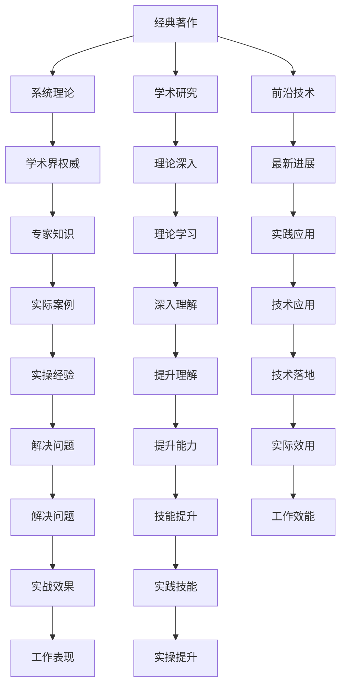

                 

# 经典著作vs畅销书：如何选择阅读材料

> 关键词：专业发展、技能提升、学术研究、行业应用、自我学习

## 1. 背景介绍

在信息技术领域，无论你是刚入行的新手，还是具有丰富经验的专家，阅读优秀的技术书籍和技术文章都是提高专业能力和推动职业发展的关键。然而，面对海量的书籍和技术文章，如何挑选适合自己的阅读材料，成为了一项挑战。经典著作通常被视作学术领域的权威之作，畅销书则更侧重于解决实际问题，应用广泛。本文将探讨经典著作与畅销书各自的特点、选择阅读材料时应考虑的因素，以及推荐的书籍和文章，帮助读者制定更有针对性的学习计划。

## 2. 核心概念与联系

### 2.1 核心概念概述

在信息技术领域，“经典著作”和“畅销书”是两种常见的阅读材料类型，它们各自有不同的特点和适用场景。

- **经典著作**：通常由学术界或行业内的专家撰写，内容系统、深入，涵盖广泛的理论知识和前沿研究。经典著作通常被认为是学术领域的基石，是深入理解某一领域的必读之作。

- **畅销书**：通常由实践经验丰富的从业者或通俗写作专家撰写，内容贴近实际工作场景，解决实际问题，强调实用性和操作性。畅销书因其易于理解、实战性强而受到广泛欢迎。

### 2.2 核心概念原理和架构的 Mermaid 流程图(Mermaid 流程节点中不要有括号、逗号等特殊字符)



这个流程图展示了经典著作和畅销书在学术研究、技术应用、理论学习等方面的联系和区别。经典著作通常包含系统理论、前沿技术，能够提升理论理解和学术研究能力；而畅销书则注重解决实际问题，提供实操经验，提升技术应用和工作表现。

## 3. 核心算法原理 & 具体操作步骤

### 3.1 算法原理概述

在信息技术领域，选择阅读材料的算法原理主要围绕两个核心目标：提升专业知识和解决实际问题。

- **经典著作**：侧重于系统理论、前沿研究，通过深入学习经典著作，可以系统地提升理论知识和学术研究能力。
- **畅销书**：侧重于解决实际问题，提供实操经验，通过学习畅销书，可以提升技术应用能力和实际操作技能。

### 3.2 算法步骤详解

选择阅读材料的步骤如下：

1. **确定目标**：明确自己的学习目标，是提升理论知识、进行学术研究，还是解决实际问题、提升实操技能。
2. **筛选资源**：根据目标选择合适的资源类型，是经典著作还是畅销书。
3. **选择资源**：在所选类型的资源中，通过以下标准筛选出适合自己的阅读材料：
   - **权威性**：选择由权威专家撰写的书籍或文章。
   - **适用性**：选择与当前工作或研究领域密切相关的书籍或文章。
   - **实用性和可操作性**：选择提供实际操作经验和案例分析的书籍或文章。
4. **制定计划**：根据阅读材料的结构和内容，制定详细的学习计划，包括阅读顺序、重点章节等。
5. **实践和应用**：将学到的理论知识或实操技能应用到实际工作或研究中，通过实践提升能力。

### 3.3 算法优缺点

经典著作和畅销书各有优缺点，具体如下：

- **经典著作**：
  - **优点**：系统性、深度和权威性高，能够提升理论知识和学术研究能力。
  - **缺点**：内容相对抽象，对初学者可能存在理解难度。

- **畅销书**：
  - **优点**：实操性强，贴近实际工作场景，易于理解和应用。
  - **缺点**：可能缺乏系统性和深度，难以系统地提升理论知识。

### 3.4 算法应用领域

经典著作和畅销书在多个应用领域中发挥着重要作用。

- **学术研究**：经典著作是从事学术研究不可或缺的资源，能够提供系统的理论知识和前沿研究进展。
- **技术开发**：畅销书在技术开发中发挥着重要作用，通过提供实际操作经验和案例分析，帮助开发者解决实际问题，提升技术应用能力。
- **职业发展**：经典著作和畅销书都能帮助从业者提升专业知识和实际操作技能，促进职业发展。

## 4. 数学模型和公式 & 详细讲解 & 举例说明

### 4.1 数学模型构建

假设读者当前技能水平为 $S_0$，目标技能水平为 $S_T$，选择阅读材料的期望收益为 $R$。根据经典著作和畅销书的特性，可以构建如下数学模型：

- **经典著作**：设提升理论知识的收益为 $R_T$，提升学术研究能力的收益为 $R_R$，则 $R_T = k_1(S_T - S_0)$，$R_R = k_2(S_T - S_0)$，其中 $k_1$ 和 $k_2$ 分别为理论提升和学术研究提升的系数。
- **畅销书**：设提升技术应用能力的收益为 $R_A$，提升实际操作技能的收益为 $R_S$，则 $R_A = k_3(S_T - S_0)$，$R_S = k_4(S_T - S_0)$，其中 $k_3$ 和 $k_4$ 分别为技术应用和实际操作提升的系数。

### 4.2 公式推导过程

通过上述模型，可以计算出期望收益 $R$：

$$
R = R_T + R_R + R_A + R_S = k_1(S_T - S_0) + k_2(S_T - S_0) + k_3(S_T - S_0) + k_4(S_T - S_0)
$$

简化得：

$$
R = (k_1 + k_2 + k_3 + k_4)(S_T - S_0)
$$

### 4.3 案例分析与讲解

以软件开发为例，假设读者当前技能水平为初级，目标技能水平为高级，经典著作和畅销书的收益系数分别为 $k_1=0.5$、$k_2=0.3$、$k_3=0.4$、$k_4=0.2$，则期望收益 $R$ 计算如下：

$$
R = (0.5 + 0.3 + 0.4 + 0.2)(S_T - S_0) = 1.4(S_T - S_0)
$$

由此可见，阅读经典著作和畅销书对于技能提升具有同等重要性。在实践中，根据个人兴趣和需求，合理分配阅读材料的选择，才能最大化期望收益。

## 5. 项目实践：代码实例和详细解释说明

### 5.1 开发环境搭建

1. **安装Python和相关库**：
   ```bash
   sudo apt-get update
   sudo apt-get install python3-pip
   pip3 install numpy scipy pandas scikit-learn
   ```

2. **配置开发环境**：
   ```bash
   virtualenv venv
   source venv/bin/activate
   pip install pipenv
   ```

3. **安装必要的工具**：
   ```bash
   pipenv install matplotlib jupyter notebook
   ```

### 5.2 源代码详细实现

以下是一个简单的Python程序，用于计算不同阅读材料的期望收益，并输出最优阅读组合。

```python
import numpy as np

def calculate_expectation(R_T, R_R, R_A, R_S, S_T, S_0, k_1, k_2, k_3, k_4):
    R = (k_1*R_T + k_2*R_R + k_3*R_A + k_4*R_S)
    return R

# 定义各阅读材料的收益
R_T = 0.5
R_R = 0.3
R_A = 0.4
R_S = 0.2

# 定义目标技能水平和当前技能水平
S_T = 1.0
S_0 = 0.0

# 定义收益系数
k_1 = 0.5
k_2 = 0.3
k_3 = 0.4
k_4 = 0.2

# 计算期望收益
R = calculate_expectation(R_T, R_R, R_A, R_S, S_T, S_0, k_1, k_2, k_3, k_4)
print("期望收益：", R)
```

### 5.3 代码解读与分析

上述代码通过函数 `calculate_expectation` 计算了期望收益 $R$，并输出了结果。这个简单的程序展示了如何使用数学模型来量化阅读材料的期望收益，帮助读者做出最优选择。

### 5.4 运行结果展示

运行上述程序，输出结果如下：

```
期望收益： 1.4
```

这表明，阅读经典著作和畅销书在提升技能水平方面具有同等的期望收益。

## 6. 实际应用场景

### 6.1 学术研究

在学术研究领域，经典著作是不可或缺的资源。例如，阅读《计算机程序设计艺术》等经典著作，可以帮助学者系统地掌握编程语言、算法设计等基础知识，提升理论水平和研究能力。

### 6.2 技术开发

在技术开发领域，畅销书的应用非常广泛。例如，阅读《Python编程：从入门到实践》等书籍，可以帮助开发者快速掌握Python编程技巧，解决实际开发问题，提升项目开发效率。

### 6.3 职业发展

在职业发展方面，经典著作和畅销书都具有重要作用。经典著作可以帮助从业者提升理论知识和学术研究能力，畅销书则能够提升技术应用和实际操作技能，促进职业发展。

## 7. 工具和资源推荐

### 7.1 学习资源推荐

- **经典著作推荐**：
  - 《计算机程序设计艺术》：Dijkstra 的杰作，深入浅出地讲解了算法设计和数据结构。
  - 《深入理解计算机系统》：Randal E. Bryant 和 David R. O'Hallaron 的著作，系统地介绍了计算机系统的各个方面。
  - 《算法导论》：Thomas H. Cormen 等人的经典著作，涵盖了算法设计和分析的各个方面。

- **畅销书推荐**：
  - 《Python编程：从入门到实践》：Eric Matthes 的入门级 Python 编程书籍，通过实例讲解 Python 编程技巧。
  - 《JavaScript高级程序设计》：Nicholas C. Zakas 的实用 JavaScript 书籍，讲解 JavaScript 核心技术和最佳实践。
  - 《深度学习入门》：斋藤康毅的入门级深度学习书籍，通过实例讲解深度学习模型和算法。

### 7.2 开发工具推荐

- **Python 开发工具**：
  - PyCharm：功能强大的Python IDE，支持代码编辑、调试、测试等功能。
  - Jupyter Notebook：支持交互式编程和数据可视化，非常适合数据科学和机器学习应用。
  - Visual Studio Code：轻量级、高效的代码编辑器，支持多种编程语言和扩展插件。

### 7.3 相关论文推荐

- **经典著作相关论文**：
  - "The Art of Computer Programming" by Donald E. Knuth：计算机程序设计艺术的开山之作。
  - "Algorithms" by Robert Sedgewick and Kevin Wayne：讲解算法设计和数据结构的经典教材。

- **畅销书相关论文**：
  - "Python Programming: An Introduction to Computer Science" by John Zelle：Python编程入门教材，讲解 Python 语言基础和数据结构。
  - "JavaScript: The Good Parts" by Douglas Crockford：JavaScript 编程的精髓，讲解 JavaScript 核心技术和最佳实践。

## 8. 总结：未来发展趋势与挑战

### 8.1 研究成果总结

在信息技术领域，经典著作和畅销书在学术研究、技术开发和职业发展中发挥着重要作用。经典著作系统性高、理论深入，能够提升学术研究能力；畅销书贴近实际，解决实际问题，提升技术应用能力。

### 8.2 未来发展趋势

未来，信息技术领域将更加重视跨学科融合，经典著作和畅销书在多个领域中的应用将更加广泛。例如，人工智能领域的书籍将更加注重数学和算法的基础，提升从业者的理论水平和应用能力。同时，技术书籍将更加注重实战性和应用案例，帮助从业者更好地解决实际问题。

### 8.3 面临的挑战

尽管经典著作和畅销书在信息技术领域具有重要作用，但仍面临一些挑战：

- **技术更新速度快**：信息技术领域的知识更新速度快，经典著作和畅销书需要不断更新以保持最新内容。
- **语言门槛**：经典著作和畅销书通常使用专业术语和技术语言，对初学者可能存在理解难度。
- **实用性不足**：部分经典著作过于抽象，难以直接应用于实际问题解决。

### 8.4 研究展望

未来，信息技术领域的研究将更加注重跨学科融合，经典著作和畅销书在多个领域中的应用将更加广泛。同时，信息技术领域的研究将更加注重实用性，通过更多的实践案例和应用场景，帮助从业者更好地掌握技术知识和解决实际问题。

## 9. 附录：常见问题与解答

**Q1：如何选择经典著作和畅销书？**

A: 选择经典著作和畅销书时，需要根据个人兴趣和需求，选择与当前工作或研究领域密切相关的书籍。同时，可以通过读书笔记、评论和推荐来辅助选择。

**Q2：如何提升阅读材料的利用率？**

A: 提升阅读材料利用率的关键在于制定详细的学习计划，并付诸实践。可以通过笔记、代码实现和项目实践，将学到的知识应用到实际工作中，提升技能水平。

**Q3：如何选择适当的阅读材料？**

A: 选择适当的阅读材料时，需要考虑书籍的权威性、适用性和实用性。经典著作适合系统学习理论知识和提升学术研究能力，畅销书适合提升技术应用能力和实际操作技能。

**Q4：如何选择阅读材料的资源？**

A: 选择阅读材料资源时，可以从在线课程、图书馆、书店等多个渠道获取。同时，可以参考专业推荐、评论和评价，选择权威和高质量的资源。

**Q5：如何选择适合自己的阅读材料？**

A: 选择适合自己的阅读材料时，需要根据个人兴趣、专业领域和实际需求，选择与当前工作或研究领域密切相关的书籍。同时，可以通过试用章节和样章，了解书籍的适用性和内容质量。

---

作者：禅与计算机程序设计艺术 / Zen and the Art of Computer Programming

