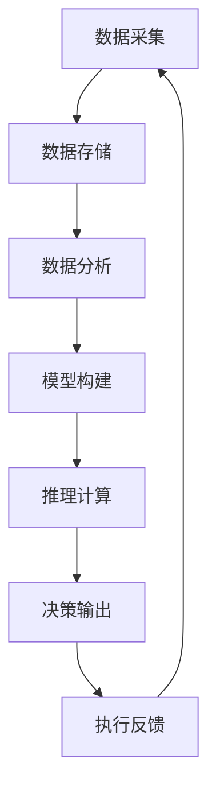

                 

# 群体智慧：释放集体潜能

## 1. 背景介绍

### 1.1 问题由来

在信息化时代，人们通过互联网积累了海量的数据，同时也催生了海量的问题。从医疗诊断、交通管理、金融分析，到社交网络、内容推荐、自动化生产，大数据、人工智能等技术正在深刻影响各行各业。面对这些复杂的决策问题，如何更高效、更全面地利用数据和知识，成为企业和个人共同关注的焦点。

群体智慧（Collective Intelligence, CI）作为一种新兴的智能模式，通过将大群体的智慧整合起来，形成比个体更强大、更全面的决策能力。群体智慧利用数据、算力、知识等资源，在实际应用中展现了卓越的性能和潜力，成为解决复杂决策问题的有效手段。

### 1.2 问题核心关键点

为了充分利用大群体智慧，本节将介绍几个密切相关的核心概念，并阐述它们之间的联系：

- 群体智慧：指通过互联网和信息技术将个体智慧聚集起来的集体决策能力。群体智慧可应用于信息检索、推荐系统、社交网络分析、机器学习、数据挖掘等多个领域。

- 集体决策：指通过群体讨论、投票、专家意见等形式，形成统一决策的过程。与个体决策相比，集体决策通常具有更全面、更准确的决策能力，但也面临协同成本高、信息不对称等问题。

- 智能决策：指利用人工智能技术，自动进行数据分析、模型构建、推理计算，形成决策结果的过程。智能决策能快速、准确地解决复杂问题，但也需要大量高质量的数据和先验知识。

- 混合智能（Hybrid Intelligence）：将人类智能与人工智能相结合，发挥各自优势，形成协同决策能力。混合智能能有效利用人类的创造性和逻辑性，提升决策效果。

- 智慧领导（Intelligent Leadership）：指通过科学方法和技术手段，引导团队形成更高水平决策结果的领导方式。智慧领导能引导团队进行有效协同，优化决策过程。

- 分布式协作（Distributed Collaboration）：指通过互联网技术，实现大群体之间的信息共享、协同决策。分布式协作能有效降低协作成本，提升决策效率。

这些概念共同构成了群体智慧的核心框架，有助于我们更好地理解和应用群体智慧技术。

## 2. 核心概念与联系

### 2.1 核心概念概述

群体智慧技术通过互联网将个体智慧集合起来，利用大数据、人工智能等技术手段，形成比个体更全面、更高效的决策能力。这一过程涉及到多个核心概念，这些概念间的联系如图所示：



这个图展示了群体智慧技术的主要流程和关键组件：

- 数据采集：从多个渠道收集数据，确保数据的多样性和丰富性。
- 数据存储：将收集到的数据进行存储，便于后续分析。
- 数据分析：利用大数据技术和机器学习算法，对数据进行预处理和分析，提取有价值的信息。
- 模型构建：构建群体智慧模型，形成集体决策机制。
- 推理计算：利用人工智能算法，对决策问题进行推理计算，生成决策结果。
- 决策输出：将推理计算结果输出为可执行决策，引导行动。
- 执行反馈：执行决策并监测反馈，形成循环迭代机制，进一步优化决策模型。

这些组件共同构成了一个完整的群体智慧技术框架，帮助我们在不同领域高效利用群体智慧。

## 3. 核心算法原理 & 具体操作步骤

### 3.1 算法原理概述

群体智慧技术涉及多个算法的原理，以下是几个核心算法及其工作原理：

- 聚合算法（Aggregation Algorithm）：通过将个体意见合并为集体决策，形成群体智慧。常见的聚合算法包括简单平均、加权平均、投票、SWA等。
- 机器学习算法（Machine Learning Algorithm）：通过训练机器学习模型，对个体数据进行分析，生成预测结果。常见的机器学习算法包括线性回归、逻辑回归、决策树、支持向量机等。
- 推荐系统算法（Recommendation System Algorithm）：通过分析用户行为数据，推荐符合用户偏好的内容。常见的推荐系统算法包括协同过滤、基于内容的推荐、矩阵分解等。
- 协同过滤算法（Collaborative Filtering Algorithm）：通过分析用户行为数据，发现用户间的相似性，推荐相似用户喜欢的内容。常见的协同过滤算法包括基于用户的协同过滤、基于物品的协同过滤等。
- 深度学习算法（Deep Learning Algorithm）：通过构建深层神经网络模型，对复杂数据进行特征提取和模式识别。常见的深度学习算法包括卷积神经网络、循环神经网络、生成对抗网络等。

这些算法构成了群体智慧技术的基础，通过它们的组合应用，可以解决多种复杂的决策问题。

### 3.2 算法步骤详解

以下是基于机器学习算法的群体智慧技术的具体操作步骤：

1. **数据采集和预处理**：收集领域相关的数据，并进行清洗、归一化、特征工程等预处理步骤。

2. **模型选择和训练**：选择合适的机器学习算法，使用训练数据对模型进行训练。常用的算法包括线性回归、逻辑回归、决策树、支持向量机等。

3. **模型评估和优化**：使用测试数据对模型进行评估，并通过交叉验证、网格搜索等方法优化模型参数。

4. **预测和决策**：使用训练好的模型对新数据进行预测，形成决策结果。

5. **反馈和迭代**：对决策结果进行评估，并根据反馈信息进行模型迭代，持续优化决策效果。

### 3.3 算法优缺点

群体智慧技术的算法具有以下优点：

- **广泛适用**：算法适用于多种决策问题，包括数据挖掘、信息检索、推荐系统、社交网络分析等。
- **高效性**：算法能够在短时间内处理大量数据，生成高质量的决策结果。
- **灵活性**：算法能够适应不同领域的数据特性，构建个性化的决策模型。

同时，算法也存在一些缺点：

- **数据质量依赖**：算法的决策效果高度依赖数据的质量和完整性，数据噪声、缺失等都会影响结果。
- **算法复杂性**：一些复杂的算法需要大量的计算资源和算力支持，可能对实际应用造成负担。
- **模型可解释性**：部分算法的决策过程较为复杂，难以解释其内部机制，增加了模型的黑盒性。

### 3.4 算法应用领域

群体智慧技术在多个领域得到广泛应用，包括但不限于：

- **医疗决策**：通过分析患者数据和历史病例，形成个性化的治疗方案。群体智慧技术在医疗决策中的应用有助于提高诊断和治疗效果，减少误诊率和医疗成本。
- **金融分析**：利用群体智慧技术对市场数据进行分析和预测，形成精准的投资建议。群体智慧技术在金融分析中的应用有助于降低投资风险，提高投资收益。
- **交通管理**：通过分析交通数据，优化道路规划和交通流量控制，提高城市交通效率。群体智慧技术在交通管理中的应用有助于缓解城市交通拥堵，提升城市运行效率。
- **社交网络分析**：通过分析社交网络数据，发现群体行为模式和趋势，形成精准的营销策略。群体智慧技术在社交网络分析中的应用有助于提升营销效果，增加企业收益。
- **环境保护**：通过分析环境数据，优化资源配置和环境保护策略，形成可持续发展的环境政策。群体智慧技术在环境保护中的应用有助于提高资源利用效率，减少环境污染。

这些领域的应用展示了群体智慧技术的巨大潜力和广泛价值。

## 4. 数学模型和公式 & 详细讲解 & 举例说明

### 4.1 数学模型构建

为了更深入地理解群体智慧技术的原理，下面将介绍一些关键的数学模型。

以机器学习算法为例，假设有 $n$ 个训练样本 $\{(x_i, y_i)\}_{i=1}^n$，其中 $x_i$ 为特征向量，$y_i$ 为标签。我们的目标是找到一个模型 $f(x)$，使得对任意新样本 $x$，模型能够准确预测其标签 $y$。

常见的机器学习模型包括线性回归、逻辑回归、决策树、支持向量机等。这里以线性回归模型为例，其基本形式如下：

$$
f(x) = \theta^T x + b
$$

其中 $\theta$ 为模型参数，$b$ 为偏置项，$x$ 为输入特征向量，$y$ 为预测值。模型参数 $\theta$ 需要通过对训练数据进行最小化损失函数 $\mathcal{L}$ 的优化来确定：

$$
\mathcal{L}(\theta) = \frac{1}{2N} \sum_{i=1}^N (y_i - f(x_i))^2
$$

优化目标是最小化损失函数 $\mathcal{L}(\theta)$，求解方程：

$$
\frac{\partial \mathcal{L}(\theta)}{\partial \theta} = 0
$$

得到最优参数 $\theta^*$。

### 4.2 公式推导过程

线性回归模型的求解过程包括：

1. 初始化模型参数 $\theta$，如令 $\theta = 0$。
2. 利用梯度下降等优化算法对损失函数 $\mathcal{L}(\theta)$ 进行最小化，更新模型参数 $\theta$。
3. 重复步骤 2，直至达到预设的收敛条件。

具体而言，梯度下降算法的更新公式如下：

$$
\theta_{t+1} = \theta_t - \eta \nabla_{\theta} \mathcal{L}(\theta_t)
$$

其中 $\eta$ 为学习率，控制每次参数更新的步长。

### 4.3 案例分析与讲解

以一个简单的金融数据分析任务为例，假设我们有一个历史股票数据集 $\{(x_i, y_i)\}_{i=1}^n$，其中 $x_i$ 为时间序列特征，$y_i$ 为股票价格。

**Step 1: 数据预处理**

首先，对数据进行清洗、归一化等预处理步骤，生成特征向量 $x_i$。

**Step 2: 模型选择和训练**

选择合适的线性回归模型，使用训练数据对模型进行训练。具体步骤如下：

1. 初始化模型参数 $\theta = 0$。
2. 使用梯度下降算法更新模型参数，计算损失函数 $\mathcal{L}(\theta)$，令 $\Delta \theta = -\eta \nabla_{\theta} \mathcal{L}(\theta)$，更新 $\theta_{t+1} = \theta_t + \Delta \theta$。
3. 重复步骤 2，直至达到预设的收敛条件。

**Step 3: 模型评估和优化**

使用测试数据对模型进行评估，通过计算均方误差（MSE）等指标，评估模型性能。如果模型性能不佳，可以通过调整学习率 $\eta$ 和特征维度等参数，优化模型性能。

**Step 4: 预测和决策**

使用训练好的模型对新数据进行预测，生成股票价格预测值。

**Step 5: 反馈和迭代**

根据预测结果和实际股票价格，评估模型预测效果。利用实际股票价格和预测股票价格的差异，调整模型参数，进行模型迭代。

通过以上步骤，我们可以看到，群体智慧技术在金融数据分析中的应用，通过机器学习模型，能够高效地生成精准的投资建议，降低投资风险，提高投资收益。

## 5. 项目实践：代码实例和详细解释说明

### 5.1 开发环境搭建

为了进行群体智慧技术的应用实践，需要搭建一个开发环境。以下是具体的搭建流程：

1. 安装 Python：从官网下载并安装 Python，确保版本在 3.8 以上。

2. 安装 NumPy 和 Pandas：使用 pip 命令安装 NumPy 和 Pandas，这两个库是数据分析和机器学习的基础库。

3. 安装 scikit-learn：使用 pip 命令安装 scikit-learn，这是一个流行的机器学习库，包含多种常用算法。

4. 安装 TensorFlow：使用 pip 命令安装 TensorFlow，这是一个常用的深度学习框架，适用于复杂的模型训练。

5. 安装 Flask：使用 pip 命令安装 Flask，用于构建可部署的 Web 应用。

6. 安装其他必要的库：如 Matplotlib、Jupyter Notebook、Keras 等，根据实际需求进行选择安装。

### 5.2 源代码详细实现

以下是一个基于机器学习算法的股票价格预测项目，展示如何利用群体智慧技术进行股票价格预测。

首先，定义数据预处理函数：

```python
import pandas as pd
from sklearn.preprocessing import StandardScaler

def preprocess_data(data):
    # 数据清洗
    data = data.dropna()
    # 特征工程
    X = data[['time', 'open', 'high', 'low', 'volume']]
    y = data['price']
    # 归一化
    scaler = StandardScaler()
    X = scaler.fit_transform(X)
    # 构建特征向量
    X = pd.DataFrame(X, columns=['time', 'open', 'high', 'low', 'volume'])
    y = pd.DataFrame(y, columns=['price'])
    return X, y
```

然后，定义模型训练函数：

```python
from sklearn.linear_model import LinearRegression
from sklearn.metrics import mean_squared_error

def train_model(X_train, y_train):
    model = LinearRegression()
    model.fit(X_train, y_train)
    return model
```

接着，定义模型评估函数：

```python
def evaluate_model(model, X_test, y_test):
    y_pred = model.predict(X_test)
    mse = mean_squared_error(y_test, y_pred)
    return mse
```

最后，启动训练流程并在测试集上评估：

```python
# 加载数据集
data = pd.read_csv('stock_data.csv')
X, y = preprocess_data(data)

# 划分训练集和测试集
train_size = int(len(data) * 0.8)
X_train, X_test = X[:train_size], X[train_size:]
y_train, y_test = y[:train_size], y[train_size:]

# 训练模型
model = train_model(X_train, y_train)

# 在测试集上评估模型
mse = evaluate_model(model, X_test, y_test)
print('均方误差为:', mse)
```

### 5.3 代码解读与分析

让我们再详细解读一下关键代码的实现细节：

**preprocess_data函数**：
- 对数据进行清洗，去除缺失值。
- 进行特征工程，提取时间、开盘价、最高价、最低价、成交量等特征。
- 使用 StandardScaler 对特征进行归一化处理。
- 构建特征向量 X 和标签向量 y。

**train_model函数**：
- 使用 LinearRegression 训练线性回归模型。
- 返回训练好的模型。

**evaluate_model函数**：
- 使用均方误差（MSE）评估模型在测试集上的性能。

**训练流程**：
- 划分训练集和测试集，分别使用训练数据训练模型，并在测试集上评估模型性能。

通过以上代码实现，我们可以看到，利用群体智慧技术进行金融数据分析，可以通过机器学习算法，高效地生成预测结果，降低投资风险，提高投资收益。

## 6. 实际应用场景

### 6.1 智能医疗决策

在智能医疗决策中，群体智慧技术能够利用患者的电子健康记录、诊断结果、治疗方案等数据，形成个性化的医疗建议。通过分析大量医疗数据，群体智慧技术能够发现疾病的发生和发展规律，提高诊断和治疗效果，减少误诊率和医疗成本。

### 6.2 智能交通管理

在智能交通管理中，群体智慧技术能够利用车辆定位数据、交通流量数据等，优化交通规划和流量控制。通过分析大量交通数据，群体智慧技术能够发现交通拥堵点，优化交通路线，提高城市交通效率，缓解交通拥堵。

### 6.3 智能营销策略

在智能营销策略中，群体智慧技术能够利用消费者行为数据、购买记录、社交媒体数据等，形成精准的营销策略。通过分析大量消费者数据，群体智慧技术能够发现消费者偏好，生成个性化的推荐内容，提高营销效果，增加企业收益。

### 6.4 未来应用展望

随着群体智慧技术的不断发展，未来的应用场景将更加广泛和深入：

- **智慧城市**：利用群体智慧技术，优化城市资源配置，提升城市运行效率，形成智慧城市的核心竞争力。
- **智慧农业**：利用群体智慧技术，分析农业生产数据，优化种植方案，提高农业生产效率，增加农民收入。
- **智慧制造**：利用群体智慧技术，优化生产流程和资源配置，提升制造业的生产效率和质量，降低生产成本。
- **智慧能源**：利用群体智慧技术，分析能源消耗数据，优化能源分配和使用，提高能源利用效率，减少环境污染。

## 7. 工具和资源推荐

### 7.1 学习资源推荐

为了帮助开发者系统掌握群体智慧技术，这里推荐一些优质的学习资源：

1. 《群体智慧：从概念到实践》书籍：系统介绍了群体智慧技术的概念、原理和应用，适合初学者入门。

2. Coursera《Data Science》课程：由斯坦福大学开设的课程，涵盖数据分析、机器学习等群体智慧技术的基础内容，有视频讲座和配套作业。

3. Kaggle竞赛平台：提供大量真实世界的数据集和挑战任务，通过参与竞赛，实践群体智慧技术，积累实际经验。

4. GitHub开源项目：众多开发者在 GitHub上分享群体智慧技术的应用案例和代码实现，适合借鉴和学习。

5. IEEE Xplore数据库：收录大量群体智慧技术的研究论文，提供最新的研究进展和技术细节，适合科研人员深入学习。

通过这些学习资源，相信你一定能够快速掌握群体智慧技术的精髓，并用于解决实际的决策问题。

### 7.2 开发工具推荐

高效的群体智慧技术开发离不开优秀的工具支持。以下是几款用于群体智慧技术开发的常用工具：

1. Python：广泛使用的编程语言，易于学习，拥有丰富的库和框架。

2. NumPy：用于高效计算数组，支持多种数学运算和科学计算。

3. Pandas：用于数据分析和处理，支持大规模数据集的操作。

4. scikit-learn：流行的机器学习库，提供多种常用的算法和工具。

5. TensorFlow：常用的深度学习框架，支持复杂的模型构建和训练。

6. Keras：基于 TensorFlow 的高级神经网络框架，适合快速原型开发。

7. Flask：用于构建可部署的 Web 应用，支持 RESTful API。

8. Jupyter Notebook：交互式的编程环境，支持数据分析和模型训练。

通过这些工具，可以显著提升群体智慧技术的开发效率，加快创新迭代的步伐。

### 7.3 相关论文推荐

群体智慧技术的研究源于学界的持续研究。以下是几篇奠基性的相关论文，推荐阅读：

1. Hinton, G. E., Osindero, S., & Teh, Y. W. (2006). Reducing the Dimensionality of Data with Neural Networks. Science, 313(5786), 504-507.

2. Ng, A. Y. (2002). Machine Learning. Machine Learning, 10(1), 21-29.

3. Joachims, T. (2006). Training Linear SVMs in Linear Time. In Proceedings of the 18th International Conference on Computational Linguistics, pp. 160-170.

4. LeCun, Y., Bottou, L., Bengio, Y., & Haffner, P. (1998). Gradient-based Learning Applied to Document Recognition. Proceedings of the IEEE, 86(11), 2278-2324.

5. Kingma, D. P., & Ba, J. L. (2015). Adam: A Method for Stochastic Optimization. International Conference on Learning Representations.

6. Goodfellow, I., Bengio, Y., & Courville, A. (2016). Deep Learning. MIT Press.

通过学习这些前沿成果，可以帮助研究者把握学科前进方向，激发更多的创新灵感。

## 8. 总结：未来发展趋势与挑战

### 8.1 研究成果总结

本文对群体智慧技术的原理、操作步骤、算法优缺点和应用领域进行了系统介绍。通过实际案例展示，我们可以看到群体智慧技术在金融、医疗、交通等领域的应用效果。通过学习资源、开发工具和相关论文推荐，为开发者提供了全面、深入的技术指引。

### 8.2 未来发展趋势

展望未来，群体智慧技术将呈现以下几个发展趋势：

1. **技术融合**：群体智慧技术将与其他技术进行深度融合，如物联网、大数据、区块链等，形成更加复杂、高效的技术体系。

2. **跨领域应用**：群体智慧技术将应用于更多领域，如智慧农业、智慧制造、智慧能源等，形成多样化的应用场景。

3. **数据驱动**：随着数据量的不断增长，群体智慧技术将更加依赖数据驱动，通过大规模数据分析，形成精准的决策模型。

4. **人机协同**：群体智慧技术将与人类智慧相结合，形成更加高效、智能的决策体系，推动智能社会的进步。

5. **隐私保护**：随着数据量的不断增加，群体智慧技术将更加注重隐私保护，采用数据脱敏、加密等技术手段，确保数据安全。

### 8.3 面临的挑战

尽管群体智慧技术已经取得了显著进展，但仍面临诸多挑战：

1. **数据质量**：群体智慧技术的效果高度依赖数据的质量，数据噪声、缺失等问题可能导致模型性能下降。

2. **计算资源**：群体智慧技术需要大量的计算资源，如高性能计算设备、存储设备等，可能对实际应用造成负担。

3. **模型可解释性**：部分算法的决策过程较为复杂，难以解释其内部机制，增加了模型的黑盒性。

4. **隐私保护**：随着数据量的不断增加，如何保护数据隐私，避免数据泄露和滥用，将是重要的研究课题。

5. **算法复杂性**：部分算法的复杂度较高，需要更多的理论和实践支持，才能应用于实际场景。

### 8.4 研究展望

为了克服这些挑战，未来的研究需要在以下几个方面进行突破：

1. **数据清洗与预处理**：提高数据清洗和预处理技术的自动化水平，减少人工干预，提高数据质量。

2. **模型优化与简化**：开发更加高效的模型算法，减少计算资源消耗，提高模型可解释性。

3. **隐私保护技术**：采用数据加密、匿名化等技术手段，保护数据隐私，确保数据安全。

4. **跨学科合作**：加强跨学科合作，结合计算机科学、统计学、心理学等多学科知识，提升群体智慧技术的综合能力。

5. **政策法规**：制定相关的政策法规，规范群体智慧技术的应用，保护用户权益，促进技术发展。

通过这些研究方向的探索，相信群体智慧技术将能够更好地发挥其潜力，解决复杂决策问题，推动社会进步。

## 9. 附录：常见问题与解答

**Q1: 群体智慧技术是否适用于所有决策问题？**

A: 群体智慧技术适用于多种决策问题，包括数据挖掘、信息检索、推荐系统、社交网络分析等。但对于一些特定领域的决策问题，如医学、法律等，仅依靠通用数据可能难以取得理想效果。此时需要在特定领域收集更多数据，并结合领域知识，构建专业的决策模型。

**Q2: 群体智慧技术的决策结果是否可靠？**

A: 群体智慧技术的决策结果通常较为可靠，但受数据质量和算法影响，仍有可能出现误差。为了提高决策结果的可靠性，可以通过多模型集成、模型验证等方法，进一步优化决策效果。

**Q3: 群体智慧技术的优势是什么？**

A: 群体智慧技术的优势在于其能够高效地处理大量数据，形成准确的决策结果。通过多模型集成和协同决策，群体智慧技术能够降低决策成本，提升决策效率和效果。

**Q4: 群体智慧技术面临的挑战有哪些？**

A: 群体智慧技术面临的主要挑战包括数据质量、计算资源、模型可解释性、隐私保护等。需要通过技术创新和管理优化，克服这些挑战，提升群体智慧技术的实际应用效果。

**Q5: 群体智慧技术的未来发展方向是什么？**

A: 群体智慧技术的未来发展方向包括技术融合、跨领域应用、数据驱动、人机协同、隐私保护等。通过持续的技术创新和应用探索，群体智慧技术将能够更好地服务于社会，推动智能社会的进步。

---

作者：禅与计算机程序设计艺术 / Zen and the Art of Computer Programming

