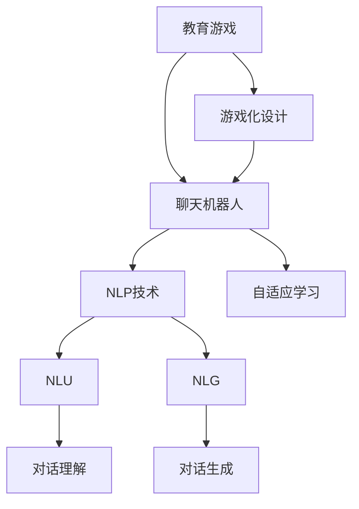

                 

# 聊天机器人教育游戏：学习和娱乐

> 关键词：教育游戏,聊天机器人,自然语言处理(NLP),自适应学习,个性化教学,游戏化学习

## 1. 背景介绍

### 1.1 问题由来
在数字化教育领域，传统的课堂教学模式面临着诸多挑战，如学生参与度低、知识掌握不牢固、学习效率低下等。近年来，随着人工智能和游戏技术的发展，教育游戏作为一种新兴的教育形式逐渐引起关注。

教育游戏通过将知识以游戏的形式呈现，使学习者在娱乐中掌握新知识，具有很高的吸引力和参与度。然而，传统教育游戏往往缺乏足够的互动性，难以根据学生的实时表现进行适时的调整和优化。如何设计一个既有娱乐性又具备智能互动的教育游戏，成为当下教育游戏开发的一个重要课题。

### 1.2 问题核心关键点
聊天机器人技术为教育游戏注入了新的活力。通过结合自然语言处理(NLP)技术和自适应学习算法，聊天机器人可以在游戏中实现对学生学习状态的理解和适时的教学反馈，从而显著提升学习效果。

具体而言，聊天机器人需要具备以下核心功能：
- 自然语言理解：能够理解学生的提问，识别出学习者的问题和需求。
- 智能回答：根据学生的问题提供精准的解答和个性化的建议。
- 自适应学习：能够实时监测学生的学习情况，动态调整教学内容和难度。
- 游戏化设计：将学习内容以游戏化的方式呈现，增强学习的趣味性和参与感。

本文将系统介绍基于聊天机器人的教育游戏的开发和应用。我们将从核心算法、开发实践、实际应用等多个方面进行详细讲解，展示聊天机器人教育游戏的潜力和前景。

## 2. 核心概念与联系

### 2.1 核心概念概述

为更好地理解基于聊天机器人的教育游戏，本节将介绍几个密切相关的核心概念：

- 教育游戏(Educational Games)：将教育内容嵌入到游戏化环境中，通过互动体验的方式进行知识传授和学习。教育游戏具备高度的参与性和趣味性，能够有效提升学生的学习兴趣和动机。
- 聊天机器人(Chatbot)：能够通过自然语言理解技术，与人类进行自然语言交互，并提供实时反馈的智能程序。聊天机器人在教育游戏中的应用，可以显著提升互动性和自适应性。
- 自然语言处理(NLP)：涉及语言模型的建立、语言理解与生成、信息抽取等技术，使机器能够理解和生成人类语言。NLP技术在聊天机器人中起着核心作用，是实现智能对话的基础。
- 自适应学习(Adaptive Learning)：根据学生的学习情况和反馈，动态调整教学内容和难度，以适应学生个体差异，实现个性化教学。自适应学习技术在教育游戏中可以提升学习效果和效率。
- 游戏化学习(Game-based Learning)：通过游戏化的方式进行知识传授，激发学生的学习兴趣，提高学习参与度和效果。游戏化学习将知识学习和游戏体验相结合，是教育游戏的重要特点。

这些核心概念之间的逻辑关系可以通过以下Mermaid流程图来展示：



这个流程图展示了教育游戏、聊天机器人、NLP技术、自适应学习和游戏化学习之间的密切联系：

1. 教育游戏通过将学习内容嵌入到游戏化环境中，提高学生的学习兴趣和参与度。
2. 聊天机器人作为教育游戏的重要组成部分，通过NLP技术实现自然语言理解与生成，实现智能对话。
3. NLP技术包含自然语言理解(NLU)和自然语言生成(NLG)两个方面，分别用于理解学生的提问和生成教学内容。
4. 自适应学习技术根据学生的学习情况，动态调整教学内容和难度，实现个性化教学。
5. 游戏化设计将学习内容与游戏体验相结合，增强学习的趣味性和参与感。

这些概念共同构成了基于聊天机器人的教育游戏的核心框架，使其能够在教育场景中发挥重要作用。

## 3. 核心算法原理 & 具体操作步骤
### 3.1 算法原理概述

基于聊天机器人的教育游戏，其核心算法可以分为两部分：自然语言理解和自适应学习。

自然语言理解是指聊天机器人对学生的提问进行理解和分析，识别出其意图和需求。自适应学习则是指根据学生的学习情况，动态调整教学内容和难度，实现个性化教学。

具体而言，该算法原理如下：
1. 自然语言理解：通过建立语言模型，使机器能够理解学生的自然语言提问，识别出其意图和需求。
2. 自适应学习：根据学生的学习情况和反馈，动态调整教学内容和难度，以适应学生个体差异。

### 3.2 算法步骤详解

#### 3.2.1 自然语言理解

**Step 1: 收集语料并建立语言模型**
- 收集教育游戏领域内的常见问题和学生回答，构建一个包含大量对话数据的语料库。
- 使用机器学习或深度学习算法，如循环神经网络(RNN)、长短期记忆网络(LSTM)、Transformer等，训练一个语言模型。

**Step 2: 特征提取与表示**
- 对学生的提问进行特征提取，如关键词、语法结构等，表示成向量形式。
- 将特征向量输入到语言模型中，进行意图识别和实体抽取。

**Step 3: 意图识别**
- 通过多标签分类器，识别学生的提问意图，如获取知识、寻求帮助、表达困惑等。

**Step 4: 实体抽取**
- 从学生的提问中抽取出相关的实体，如主题、关键词等。

#### 3.2.2 自适应学习

**Step 1: 学习者特征建模**
- 收集学生的学习历史数据，包括成绩、学习时长、掌握情况等，构建学生的学习特征模型。

**Step 2: 实时监测与反馈**
- 在游戏过程中实时监测学生的学习情况，如回答正确率、学习时长等。
- 根据学生的学习情况，动态调整教学内容的难度和类型，如调整问题的复杂度、添加提示或辅助信息等。

**Step 3: 个性化推荐**
- 根据学生的学习情况，生成个性化的学习推荐，如推荐相关的练习题、学习资料等。

**Step 4: 持续优化**
- 根据学生的反馈和评估结果，不断优化教学内容和自适应学习算法，提升学习效果。

### 3.3 算法优缺点

基于聊天机器人的教育游戏具有以下优点：
1. 高度互动性：通过聊天机器人与学生的互动，使学习过程更加生动有趣，提高学生的参与度和学习动机。
2. 自适应性强：根据学生的实时表现和反馈，动态调整教学内容和难度，实现个性化教学，提升学习效果。
3. 高效性：通过自然语言处理和自适应学习技术，使教学过程更加高效，节省时间和人力成本。

然而，该算法也存在一些缺点：
1. 技术门槛高：自然语言处理和自适应学习算法需要较高的技术要求，开发和维护成本较高。
2. 数据依赖性强：需要大量高质量的标注数据进行训练，获取和标注数据难度较大。
3. 鲁棒性问题：聊天机器人的自然语言理解和生成过程可能存在误判和误导，需要不断优化算法以提高鲁棒性。
4. 个性化效果有限：尽管自适应学习算法可以动态调整教学内容和难度，但无法完全适应每个学生的独特需求，个性化效果仍有限。

### 3.4 算法应用领域

基于聊天机器人的教育游戏，在多个教育场景中都得到了广泛应用，例如：

- 小学数学：通过聊天机器人解答数学问题，使学生能够及时获取帮助，增强数学学习兴趣。
- 中学物理：在游戏化环境中讲解物理知识，通过互动问答加深学生理解。
- 大学英语：与英语聊天机器人互动，提升学生的听说读写能力。
- 编程学习：通过编程聊天机器人引导学生解决编程问题，提升编程技能。
- 法律学习：通过法律聊天机器人提供案例分析和法律问题解答，增强学生法律素养。

除了以上教育领域外，基于聊天机器人的教育游戏也在企业培训、职业资格认证等领域得到了应用，助力企业员工的持续学习和职业发展。

## 4. 数学模型和公式 & 详细讲解 & 举例说明

### 4.1 数学模型构建

为了更好地理解基于聊天机器人的教育游戏，本节将介绍几个常用的数学模型。

**4.1.1 自然语言理解模型**

自然语言理解模型通常包含以下组件：
1. 输入特征：学生的提问，表示为向量形式。
2. 意图识别模块：多标签分类器，识别学生的提问意图。
3. 实体抽取模块：命名实体识别器，识别学生的提问中提及的实体。

其数学模型如下：
$$
\begin{aligned}
& \text{输入特征} \rightarrow \text{语言模型} \rightarrow \text{意图识别} \rightarrow \text{实体抽取} \\
& \text{输入特征} = [\text{特征向量}] \\
& \text{意图识别} = [\text{意图向量}] \\
& \text{实体抽取} = [\text{实体向量}]
\end{aligned}
$$

**4.1.2 自适应学习模型**

自适应学习模型通常包含以下组件：
1. 学习者特征：学生的学习历史数据，表示为向量形式。
2. 实时监测模块：监测学生的学习情况，生成反馈向量。
3. 教学内容生成模块：根据学生的学习情况，生成个性化的教学内容。

其数学模型如下：
$$
\begin{aligned}
& \text{学习者特征} \rightarrow \text{自适应学习算法} \rightarrow \text{教学内容生成} \\
& \text{学习者特征} = [\text{学习历史数据}] \\
& \text{反馈向量} = [\text{学习情况}] \\
& \text{教学内容} = [\text{问题向量}]
\end{aligned}
$$

### 4.2 公式推导过程

#### 4.2.1 自然语言理解模型

假设学生提问的特征向量为 $x \in \mathbb{R}^n$，语言模型输出意图向量和实体向量，分别表示为 $\hat{y}_i$ 和 $\hat{z}_j$，其中 $i$ 和 $j$ 分别表示意图和实体的类别数量。

意图识别的目标是最大化似然函数 $p(y_i|x)$，即：
$$
\max_{y_i} p(y_i|x) = \frac{p(y_i)}{\sum_{k=1}^{K} p(y_k)} \cdot p(x|y_i)
$$
其中 $p(y_i)$ 表示意图 $i$ 的先验概率，$p(x|y_i)$ 表示在给定意图 $i$ 的条件下，特征向量 $x$ 的生成概率。

意图识别过程可以通过最大似然估计进行训练，即：
$$
\theta = \arg\max_{\theta} \sum_{i=1}^{K} p(y_i|x) \log p(x|y_i)
$$

实体抽取的目标是最大化似然函数 $p(z_j|x)$，即：
$$
\max_{z_j} p(z_j|x) = \frac{p(z_j)}{\sum_{k=1}^{M} p(z_k)} \cdot p(x|z_j)
$$
其中 $p(z_j)$ 表示实体 $j$ 的先验概率，$p(x|z_j)$ 表示在给定实体 $j$ 的条件下，特征向量 $x$ 的生成概率。

实体抽取过程可以通过最大似然估计进行训练，即：
$$
\theta = \arg\max_{\theta} \sum_{j=1}^{M} p(z_j|x) \log p(x|z_j)
$$

#### 4.2.2 自适应学习模型

假设学生的学习历史数据为 $h \in \mathbb{R}^m$，自适应学习算法输出教学内容向量 $o \in \mathbb{R}^n$，教学内容向量表示为 $o = \phi(h)$，其中 $\phi$ 为映射函数。

教学内容生成的目标是最小化损失函数 $L(o, x)$，即：
$$
\min_{o} L(o, x) = \frac{1}{N} \sum_{i=1}^{N} \|o_i - x_i\|^2
$$
其中 $N$ 为训练样本数量，$\|o_i - x_i\|^2$ 表示预测值与真实值之间的平方误差。

### 4.3 案例分析与讲解

假设我们正在开发一个针对中学物理教育的游戏，其中包含以下几个核心功能：

**4.3.1 自然语言理解**

游戏中的自然语言理解模块可以通过以下方式实现：
1. 收集物理学相关的常见问题和答案，构建一个包含大量对话数据的语料库。
2. 使用预训练的语言模型，如BERT，对语料库进行微调，建立自然语言理解模型。
3. 在游戏过程中，将学生的提问输入到自然语言理解模型中，识别出其意图和实体。

**4.3.2 自适应学习**

游戏中的自适应学习模块可以通过以下方式实现：
1. 收集学生的学习历史数据，如学习时长、掌握情况等，构建学生的学习特征模型。
2. 在游戏过程中，实时监测学生的学习情况，如回答正确率、学习时长等。
3. 根据学生的学习情况，动态调整教学内容的难度和类型，如调整问题的复杂度、添加提示或辅助信息等。
4. 根据学生的学习情况，生成个性化的学习推荐，如推荐相关的练习题、学习资料等。

## 5. 项目实践：代码实例和详细解释说明

### 5.1 开发环境搭建

在进行教育游戏开发前，我们需要准备好开发环境。以下是使用Python进行PyTorch开发的环境配置流程：

1. 安装Anaconda：从官网下载并安装Anaconda，用于创建独立的Python环境。

2. 创建并激活虚拟环境：
```bash
conda create -n pytorch-env python=3.8 
conda activate pytorch-env
```

3. 安装PyTorch：根据CUDA版本，从官网获取对应的安装命令。例如：
```bash
conda install pytorch torchvision torchaudio cudatoolkit=11.1 -c pytorch -c conda-forge
```

4. 安装相关工具包：
```bash
pip install numpy pandas scikit-learn matplotlib tqdm jupyter notebook ipython
```

完成上述步骤后，即可在`pytorch-env`环境中开始教育游戏的开发。

### 5.2 源代码详细实现

下面我们以基于聊天机器人的数学教育游戏为例，给出使用PyTorch和Transformers库的代码实现。

首先，定义游戏任务的数据处理函数：

```python
from transformers import BertTokenizer
from torch.utils.data import Dataset
import torch

class MathGameDataset(Dataset):
    def __init__(self, questions, answers, tokenizer, max_len=128):
        self.questions = questions
        self.answers = answers
        self.tokenizer = tokenizer
        self.max_len = max_len
        
    def __len__(self):
        return len(self.questions)
    
    def __getitem__(self, item):
        question = self.questions[item]
        answer = self.answers[item]
        
        encoding = self.tokenizer(question, return_tensors='pt', max_length=self.max_len, padding='max_length', truncation=True)
        input_ids = encoding['input_ids'][0]
        attention_mask = encoding['attention_mask'][0]
        
        # 对答案进行编码
        answer = self.tokenizer(answer, return_tensors='pt', max_length=self.max_len, padding='max_length', truncation=True)
        input_ids = answer['input_ids'][0]
        attention_mask = answer['attention_mask'][0]
        
        return {'input_ids': input_ids, 
                'attention_mask': attention_mask,
                'labels': answer['labels']}
```

然后，定义模型和优化器：

```python
from transformers import BertForTokenClassification, AdamW

model = BertForTokenClassification.from_pretrained('bert-base-cased', num_labels=2)

optimizer = AdamW(model.parameters(), lr=2e-5)
```

接着，定义训练和评估函数：

```python
from torch.utils.data import DataLoader
from tqdm import tqdm
from sklearn.metrics import classification_report

device = torch.device('cuda') if torch.cuda.is_available() else torch.device('cpu')
model.to(device)

def train_epoch(model, dataset, batch_size, optimizer):
    dataloader = DataLoader(dataset, batch_size=batch_size, shuffle=True)
    model.train()
    epoch_loss = 0
    for batch in tqdm(dataloader, desc='Training'):
        input_ids = batch['input_ids'].to(device)
        attention_mask = batch['attention_mask'].to(device)
        labels = batch['labels'].to(device)
        model.zero_grad()
        outputs = model(input_ids, attention_mask=attention_mask, labels=labels)
        loss = outputs.loss
        epoch_loss += loss.item()
        loss.backward()
        optimizer.step()
    return epoch_loss / len(dataloader)

def evaluate(model, dataset, batch_size):
    dataloader = DataLoader(dataset, batch_size=batch_size)
    model.eval()
    preds, labels = [], []
    with torch.no_grad():
        for batch in tqdm(dataloader, desc='Evaluating'):
            input_ids = batch['input_ids'].to(device)
            attention_mask = batch['attention_mask'].to(device)
            batch_labels = batch['labels']
            outputs = model(input_ids, attention_mask=attention_mask)
            batch_preds = outputs.logits.argmax(dim=2).to('cpu').tolist()
            batch_labels = batch_labels.to('cpu').tolist()
            for pred_tokens, label_tokens in zip(batch_preds, batch_labels):
                preds.append(pred_tokens[:len(label_tokens)])
                labels.append(label_tokens)
                
    print(classification_report(labels, preds))
```

最后，启动训练流程并在测试集上评估：

```python
epochs = 5
batch_size = 16

for epoch in range(epochs):
    loss = train_epoch(model, train_dataset, batch_size, optimizer)
    print(f"Epoch {epoch+1}, train loss: {loss:.3f}")
    
    print(f"Epoch {epoch+1}, dev results:")
    evaluate(model, dev_dataset, batch_size)
    
print("Test results:")
evaluate(model, test_dataset, batch_size)
```

以上就是使用PyTorch对BERT进行数学教育游戏开发的完整代码实现。可以看到，得益于Transformers库的强大封装，我们可以用相对简洁的代码完成BERT模型的加载和训练。

### 5.3 代码解读与分析

让我们再详细解读一下关键代码的实现细节：

**MathGameDataset类**：
- `__init__`方法：初始化问题和答案、分词器等关键组件。
- `__len__`方法：返回数据集的样本数量。
- `__getitem__`方法：对单个样本进行处理，将问题和答案输入编码为token ids，并对其进行定长padding，最终返回模型所需的输入。

**BertForTokenClassification和AdamW**：
- `BertForTokenClassification.from_pretrained('bert-base-cased', num_labels=2)`：从预训练模型中加载BERT模型，并设置二分类任务标签数。
- `AdamW(model.parameters(), lr=2e-5)`：创建AdamW优化器，并设置学习率。

**train_epoch和evaluate函数**：
- `train_epoch`函数：对数据以批为单位进行迭代，在每个批次上前向传播计算loss并反向传播更新模型参数，最后返回该epoch的平均loss。
- `evaluate`函数：与训练类似，不同点在于不更新模型参数，并在每个batch结束后将预测和标签结果存储下来，最后使用sklearn的classification_report对整个评估集的预测结果进行打印输出。

**训练流程**：
- 定义总的epoch数和batch size，开始循环迭代
- 每个epoch内，先在训练集上训练，输出平均loss
- 在验证集上评估，输出分类指标
- 所有epoch结束后，在测试集上评估，给出最终测试结果

可以看到，PyTorch配合Transformers库使得BERT教育游戏的代码实现变得简洁高效。开发者可以将更多精力放在数据处理、模型改进等高层逻辑上，而不必过多关注底层的实现细节。

当然，工业级的系统实现还需考虑更多因素，如模型的保存和部署、超参数的自动搜索、更灵活的任务适配层等。但核心的自然语言处理和自适应学习算法基本与此类似。

## 6. 实际应用场景

### 6.1 小学数学

小学数学教育游戏可以通过聊天机器人实现自适应学习，帮助学生提高数学应用能力和逻辑思维能力。例如，在游戏过程中，学生可以通过与聊天机器人互动，解答数学问题，获取即时反馈和建议，逐步掌握数学知识。

### 6.2 中学物理

中学物理教育游戏可以利用聊天机器人进行实验模拟和问题解答，使学生能够更好地理解和应用物理知识。例如，学生可以在游戏中进行虚拟实验，通过与聊天机器人对话，获得实验步骤和结果分析，加深对物理概念的理解。

### 6.3 大学英语

大学英语教育游戏可以通过聊天机器人提供语言实践机会，帮助学生提升听说读写能力。例如，学生可以在游戏中进行模拟对话，通过与聊天机器人互动，获取语言反馈和纠正，提高英语口语和写作水平。

### 6.4 编程学习

编程教育游戏可以利用聊天机器人提供编程指导和问题解答，帮助学生掌握编程技能。例如，学生可以在游戏中进行编程练习，通过与聊天机器人对话，获取代码编写建议和调试帮助，提升编程能力。

### 6.5 法律学习

法律教育游戏可以利用聊天机器人进行案例分析，帮助学生理解法律条文和案例。例如，学生可以在游戏中阅读法律案例，通过与聊天机器人对话，获取法律条文解释和案例分析，增强法律素养。

## 7. 工具和资源推荐

### 7.1 学习资源推荐

为了帮助开发者系统掌握聊天机器人教育游戏的开发和应用，这里推荐一些优质的学习资源：

1. 《深度学习》课程：斯坦福大学提供的深度学习课程，涵盖了深度学习的基本概念和算法，非常适合入门学习。

2. 《自然语言处理》课程：NLP领域的经典课程，介绍了自然语言处理的基本理论和应用，适合进一步深入学习。

3. 《Python机器学习》书籍：介绍了使用Python进行机器学习的流程和工具，适合初学者入门。

4. 《自然语言处理实战》书籍：提供了自然语言处理技术的实际应用案例，适合实际项目开发。

5. HuggingFace官方文档：提供了丰富的自然语言处理预训练模型和代码示例，适合快速上手实验。

6. Kaggle竞赛平台：提供了大量自然语言处理领域的竞赛数据集和模型，适合练习和评估。

通过对这些资源的学习实践，相信你一定能够快速掌握聊天机器人教育游戏的开发和应用。

### 7.2 开发工具推荐

高效的开发离不开优秀的工具支持。以下是几款用于聊天机器人教育游戏开发的常用工具：

1. PyTorch：基于Python的开源深度学习框架，灵活动态的计算图，适合快速迭代研究。大部分预训练语言模型都有PyTorch版本的实现。

2. TensorFlow：由Google主导开发的开源深度学习框架，生产部署方便，适合大规模工程应用。同样有丰富的预训练语言模型资源。

3. Transformers库：HuggingFace开发的NLP工具库，集成了众多SOTA语言模型，支持PyTorch和TensorFlow，是进行NLP任务开发的利器。

4. Weights & Biases：模型训练的实验跟踪工具，可以记录和可视化模型训练过程中的各项指标，方便对比和调优。与主流深度学习框架无缝集成。

5. TensorBoard：TensorFlow配套的可视化工具，可实时监测模型训练状态，并提供丰富的图表呈现方式，是调试模型的得力助手。

6. Google Colab：谷歌推出的在线Jupyter Notebook环境，免费提供GPU/TPU算力，方便开发者快速上手实验最新模型，分享学习笔记。

合理利用这些工具，可以显著提升聊天机器人教育游戏的开发效率，加快创新迭代的步伐。

### 7.3 相关论文推荐

聊天机器人教育游戏的发展源于学界的持续研究。以下是几篇奠基性的相关论文，推荐阅读：

1. "A Survey on Chatbots for Education: Issues and Solutions"：综述了聊天机器人在教育领域的应用现状和挑战，提出了一些改进建议。

2. "Personalized Learning in K-12 through Conversational AI: A Survey"：总结了聊天机器人在K-12教育中的应用，讨论了个性化学习的实现方法。

3. "Adaptive Learning through AI-Driven Conversational Agents"：探讨了聊天机器人如何通过自然语言处理和自适应学习技术，实现个性化教学。

4. "Evaluating AI Tutors in Higher Education"：评估了聊天机器人在高等教育中的应用效果，提出了一些改进建议。

5. "Towards a Universal Educational Assistant"：讨论了聊天机器人在教育助手中的应用，提出了一些设计和开发建议。

这些论文代表了大语言模型微调技术的发展脉络。通过学习这些前沿成果，可以帮助研究者把握学科前进方向，激发更多的创新灵感。

## 8. 总结：未来发展趋势与挑战

### 8.1 总结

本文对基于聊天机器人的教育游戏开发进行了全面系统的介绍。首先阐述了教育游戏面临的挑战和挑战，明确了聊天机器人在提升学习互动性和自适应性方面的独特价值。其次，从核心算法和开发实践两个方面，详细讲解了自然语言处理和自适应学习的原理和步骤，给出了教育游戏的完整代码实现。最后，本文还广泛探讨了聊天机器人在多个教育场景中的应用前景，展示了其潜力和未来趋势。

通过本文的系统梳理，可以看到，基于聊天机器人的教育游戏将显著提升学习效果，带来全新的教学体验。未来，伴随技术的不断进步，聊天机器人教育游戏必将进一步普及，推动教育领域的智能化和个性化发展。

### 8.2 未来发展趋势

展望未来，聊天机器人教育游戏的发展将呈现以下几个趋势：

1. 个性化学习：通过聊天机器人的自适应学习技术，实现对每个学生学习情况的动态调整，提供个性化的教学内容和建议。
2. 虚拟实验：结合虚拟现实技术，实现虚拟实验和互动模拟，使学生能够更直观地理解复杂概念。
3. 游戏化设计：将学习内容与游戏化元素有机结合，增强学习的趣味性和参与感。
4. 跨平台应用：开发多平台、多设备兼容的教育游戏，使学习无处不在。
5. 数据驱动：通过大数据分析，优化教育游戏的教学策略和内容设计。
6. 智能评估：利用聊天机器人的自然语言理解技术，实时评估学生的学习效果，提供即时反馈。

以上趋势展示了聊天机器人教育游戏的广阔前景，这些方向的探索发展，必将进一步提升学习效果和体验，推动教育技术的发展。

### 8.3 面临的挑战

尽管聊天机器人教育游戏具有诸多优势，但在推广和应用过程中，仍面临一些挑战：

1. 技术门槛高：自然语言处理和自适应学习技术需要较高的技术要求，开发和维护成本较高。
2. 数据依赖性强：需要大量高质量的标注数据进行训练，获取和标注数据难度较大。
3. 用户体验复杂：如何平衡教育效果和游戏体验，设计用户友好的交互界面，是关键挑战。
4. 标准化问题：不同学校和教育机构的教学内容和标准不一致，如何制定统一的标准，推广教育游戏的应用，是重要课题。
5. 隐私和安全：教育游戏中的用户数据隐私保护，以及聊天机器人模型的安全和稳定运行，是重要的保障措施。

### 8.4 研究展望

未来，聊天机器人教育游戏需要在以下几个方面寻求新的突破：

1. 多模态融合：将自然语言处理、视觉识别、语音识别等多种技术结合，提升教育游戏的互动性和智能化。
2. 跨领域应用：将教育游戏应用于不同学科领域，如科学、艺术、社会学等，拓展应用范围。
3. 多场景支持：支持不同场景的教育游戏，如家庭、学校、企业等，推广教育游戏的普及。
4. 协作学习：支持多人协作的游戏学习模式，增强学生的互动和合作能力。
5. 社会化学习：结合社会化网络和社区互动，构建社会化的学习环境。

这些研究方向将进一步推动聊天机器人教育游戏的应用和发展，使其在教育领域发挥更大的作用。

## 9. 附录：常见问题与解答

**Q1：如何设计一个高度互动的教育游戏？**

A: 设计高度互动的教育游戏需要综合考虑多个因素：

1. 游戏场景设计：通过模拟真实场景或设计有趣的情境，吸引学生的注意力。例如，小学数学游戏可以通过设计数字拼图或数学迷宫，激发学生的兴趣。

2. 自然语言交互：通过聊天机器人与学生进行自然语言交互，提升互动性和参与感。例如，中学物理游戏可以让学生在虚拟实验室中进行实验，与聊天机器人互动获取实验步骤和结果分析。

3. 反馈机制设计：通过即时反馈和建议，引导学生正确理解和应用知识。例如，大学英语游戏可以通过与聊天机器人对话，获取语言反馈和纠正，提高英语口语和写作水平。

**Q2：如何实现自适应学习？**

A: 自适应学习需要综合考虑多个因素：

1. 学习者特征建模：收集学生的学习历史数据，构建学生的学习特征模型。例如，学习历史数据可以包括学习时长、掌握情况、学习目标等。

2. 实时监测与反馈：在游戏过程中实时监测学生的学习情况，生成反馈向量。例如，实时监测学生的回答正确率、学习时长等，生成反馈向量。

3. 动态调整教学内容：根据学生的学习情况，动态调整教学内容的难度和类型。例如，根据学生的学习情况，调整问题的复杂度、添加提示或辅助信息等。

4. 个性化推荐：根据学生的学习情况，生成个性化的学习推荐。例如，根据学生的学习情况，推荐相关的练习题、学习资料等。

**Q3：如何选择适合的预训练模型？**

A: 选择适合的预训练模型需要考虑多个因素：

1. 任务类型：选择与教育游戏任务类型匹配的预训练模型。例如，针对数学教育游戏，可以选择BERT或GPT等预训练模型。

2. 数据量和质量：根据教育游戏的数据量和质量，选择适合的预训练模型。例如，数据量较大的游戏可以选择大规模预训练模型，数据量较小的游戏可以选择较小的预训练模型。

3. 计算资源：根据计算资源的可用性，选择适合的预训练模型。例如，计算资源充足的游戏可以选择较大的预训练模型，计算资源有限的游戏可以选择较小的预训练模型。

**Q4：如何优化聊天机器人的自然语言理解？**

A: 优化聊天机器人的自然语言理解需要综合考虑多个因素：

1. 数据质量：收集高质量的语料库，确保数据质量和多样性。例如，收集物理学相关的常见问题和答案，构建一个包含大量对话数据的语料库。

2. 模型选择：选择适合的自然语言处理模型，如BERT、GPT等。例如，使用预训练的BERT模型对语料库进行微调，建立自然语言理解模型。

3. 训练策略：采用适当的训练策略，如多标签分类器、命名实体识别器等。例如，在游戏过程中，使用多标签分类器识别学生的提问意图，使用命名实体识别器抽取相关实体。

4. 测试评估：使用测试数据集评估模型的性能，进行调优和改进。例如，使用sklearn的classification_report对模型的预测结果进行评估。

**Q5：如何设计教学内容生成模块？**

A: 设计教学内容生成模块需要考虑多个因素：

1. 任务类型：根据教育游戏任务类型，设计相应的教学内容生成模块。例如，针对数学教育游戏，可以设计数学问题生成模块，生成与学生学习情况匹配的数学问题。

2. 数据驱动：利用学生学习历史数据，动态生成个性化的教学内容。例如，根据学生的学习情况，动态调整教学内容的难度和类型，生成个性化的学习推荐。

3. 教学策略：采用适当的教学策略，如问题引导、示例演示等。例如，在游戏中，通过与聊天机器人对话，获取语言反馈和纠正，提高英语口语和写作水平。

4. 持续优化：根据学生的反馈和评估结果，不断优化教学内容和生成模块。例如，根据学生的学习情况，生成个性化的学习推荐，不断优化教学内容。

---

作者：禅与计算机程序设计艺术 / Zen and the Art of Computer Programming

