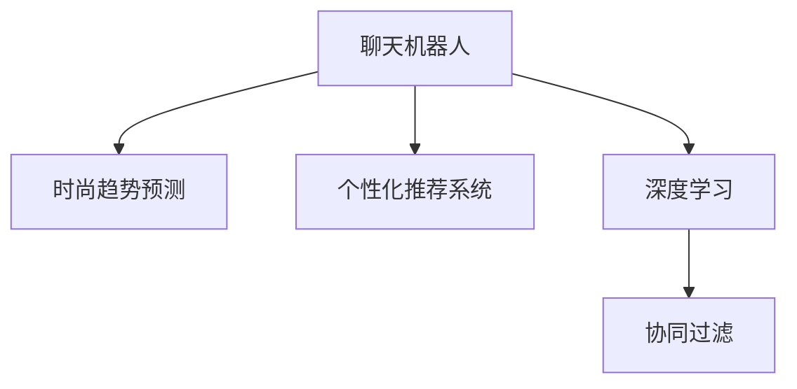

                 

# 聊天机器人时尚业：趋势预测和个性化推荐

> 关键词：时尚业, 聊天机器人, 趋势预测, 个性化推荐

## 1. 背景介绍

### 1.1 问题由来

随着技术的不断进步，聊天机器人（Chatbot）已经从简单的客服机器人，逐步发展为能够提供深度交流和个性化服务的智能助手。在时尚业中，聊天机器人不仅能够提供即时的购物咨询和推荐，还能够在时尚趋势预测、个性化搭配建议等领域发挥重要作用。然而，如何在海量数据中提取有价值的信息，并进行有效的趋势预测和个性化推荐，成为了时尚业聊天机器人应用的一大难题。

### 1.2 问题核心关键点

要解决这个问题，我们需要理解几个关键点：

- 时尚趋势预测：基于历史时尚数据，预测未来流行趋势。
- 个性化推荐：根据用户喜好和历史行为，推荐符合其口味的时尚单品。
- 数据处理：处理和清洗时尚相关数据，为机器学习模型提供高质量输入。
- 模型选择：选择合适的机器学习算法，如协同过滤、深度学习等。
- 用户交互：设计友好的用户界面和交互逻辑，提升用户体验。

### 1.3 问题研究意义

通过聊天机器人进行时尚趋势预测和个性化推荐，可以为消费者提供更加精准、及时的时尚资讯，提升时尚购物体验。同时，对于商家而言，可以借助聊天机器人收集用户反馈，了解市场趋势，优化产品策略，从而在激烈的市场竞争中占据优势。因此，研究聊天机器人时尚趋势预测和个性化推荐，对于推动时尚业的技术创新和业务优化具有重要意义。

## 2. 核心概念与联系

### 2.1 核心概念概述

为更好地理解聊天机器人时尚业的应用，本节将介绍几个关键概念：

- 聊天机器人（Chatbot）：通过自然语言处理和机器学习技术，与用户进行智能对话的系统。
- 时尚趋势预测：基于历史数据，预测未来时尚趋势。
- 个性化推荐系统：根据用户兴趣和行为，推荐符合其偏好的商品。
- 深度学习：利用多层神经网络进行复杂模式识别和特征提取。
- 协同过滤：通过用户行为相似性进行推荐。

这些概念之间的逻辑关系可以通过以下Mermaid流程图来展示：



这个流程图展示了几大核心概念之间的关联：

1. 聊天机器人通过深度学习、协同过滤等技术，提供时尚趋势预测和个性化推荐服务。
2. 深度学习模型能够从大量数据中提取隐含的时尚趋势和用户偏好，为个性化推荐提供有力支撑。
3. 协同过滤算法可以挖掘用户行为模式，实现精准的推荐。

## 3. 核心算法原理 & 具体操作步骤
### 3.1 算法原理概述

聊天机器人时尚业的核心算法原理包括以下几个方面：

1. **时尚趋势预测**：基于历史时尚数据，利用机器学习算法预测未来流行趋势。常用的算法包括时间序列分析、回归分析、深度学习等。
2. **个性化推荐**：根据用户历史行为和偏好，利用协同过滤、深度学习等方法，推荐符合其兴趣的商品。常用的算法包括基于协同过滤的推荐系统、基于深度学习的推荐系统等。
3. **用户交互设计**：设计友好的用户界面和交互逻辑，提升用户购物体验。常用的技术包括自然语言处理、人机交互设计等。

### 3.2 算法步骤详解

聊天机器人时尚业的具体操作流程如下：

1. **数据收集**：收集时尚品牌的历史销售数据、社交媒体评论、时尚杂志内容等数据。
2. **数据预处理**：清洗、归一化数据，去除噪声和异常值，进行特征工程。
3. **趋势预测**：使用机器学习算法对历史数据进行分析，预测未来时尚趋势。
4. **个性化推荐**：根据用户的历史行为和偏好，生成推荐列表。
5. **用户交互**：设计友好的用户界面和交互逻辑，提供个性化推荐和趋势预测结果。

### 3.3 算法优缺点

聊天机器人时尚业的应用存在以下优缺点：

**优点**：
1. **实时性**：聊天机器人可以即时提供时尚趋势和个性化推荐，满足用户即时需求。
2. **个性化**：能够根据用户行为和偏好，提供个性化的购物建议，提升用户满意度。
3. **低成本**：相较于人工客服，聊天机器人的开发和维护成本较低。
4. **覆盖面广**：可以覆盖更多用户和场景，提升用户覆盖率和满意度。

**缺点**：
1. **数据质量**：数据的准确性和完整性直接影响预测和推荐效果。
2. **用户体验**：设计不合理的用户界面和交互逻辑，可能导致用户体验不佳。
3. **推荐多样性**：个性化推荐算法可能陷入局部最优解，推荐结果过于单一。
4. **多模态数据融合**：如何将多模态数据（如文本、图像、音频等）进行有效融合，是技术难点之一。

### 3.4 算法应用领域

聊天机器人时尚业的应用领域主要包括以下几个方面：

1. **电商平台**：提供实时个性化的购物建议，提升用户体验和转化率。
2. **时尚杂志和媒体**：进行时尚趋势预测，提供最新时尚资讯。
3. **社交媒体**：分析用户评论和互动，发现流行趋势和用户兴趣。
4. **个性化搭配建议**：根据用户身材和风格，提供个性化的穿搭建议。
5. **智能客服**：提供时尚相关的客服支持，解答用户疑问。

## 4. 数学模型和公式 & 详细讲解 & 举例说明
### 4.1 数学模型构建

时尚趋势预测和个性化推荐的数学模型主要包括以下几个方面：

1. **时间序列模型**：用于预测时尚趋势的时间序列模型包括ARIMA、LSTM等。
2. **协同过滤模型**：用于个性化推荐的协同过滤模型包括基于用户的协同过滤、基于物品的协同过滤等。
3. **深度学习模型**：用于个性化推荐的深度学习模型包括基于卷积神经网络（CNN）的推荐系统、基于循环神经网络（RNN）的推荐系统等。

### 4.2 公式推导过程

以LSTM时间序列模型为例，其推导过程如下：

1. **输入层**：将历史时尚数据作为输入，进行归一化和标准化处理。
2. **LSTM层**：通过多层LSTM网络，学习数据的长期依赖关系，提取时尚趋势特征。
3. **输出层**：将LSTM层的输出作为预测值，用于时尚趋势预测。

公式推导如下：

$$
\begin{aligned}
& h_t = LSTM(x_t, h_{t-1}) \\
& \hat{y}_t = outputLayer(h_t)
\end{aligned}
$$

其中，$x_t$ 表示历史时尚数据，$h_t$ 表示LSTM层输出，$\hat{y}_t$ 表示预测值。

### 4.3 案例分析与讲解

以电商平台为例，分析时尚趋势预测和个性化推荐的具体应用：

1. **数据收集**：收集历史销售数据、用户评论、社交媒体数据等。
2. **数据预处理**：清洗和归一化数据，提取特征。
3. **趋势预测**：使用LSTM模型对历史数据进行分析，预测未来流行趋势。
4. **个性化推荐**：根据用户历史行为，使用协同过滤算法生成个性化推荐列表。
5. **用户交互**：设计友好的用户界面，提供趋势预测和推荐结果。

## 5. 项目实践：代码实例和详细解释说明
### 5.1 开发环境搭建

在进行时尚业聊天机器人项目开发前，我们需要准备好开发环境。以下是使用Python进行PyTorch开发的环境配置流程：

1. 安装Anaconda：从官网下载并安装Anaconda，用于创建独立的Python环境。

2. 创建并激活虚拟环境：
```bash
conda create -n fashionbot-env python=3.8 
conda activate fashionbot-env
```

3. 安装PyTorch：根据CUDA版本，从官网获取对应的安装命令。例如：
```bash
conda install pytorch torchvision torchaudio cudatoolkit=11.1 -c pytorch -c conda-forge
```

4. 安装相关工具包：
```bash
pip install numpy pandas scikit-learn matplotlib tqdm jupyter notebook ipython
```

完成上述步骤后，即可在`fashionbot-env`环境中开始开发。

### 5.2 源代码详细实现

这里以LSTM时尚趋势预测和基于协同过滤的个性化推荐为例，给出使用PyTorch进行聊天机器人开发的PyTorch代码实现。

首先，定义时尚趋势预测的LSTM模型：

```python
import torch
import torch.nn as nn

class LSTMModel(nn.Module):
    def __init__(self, input_size, hidden_size, output_size):
        super(LSTMModel, self).__init__()
        self.hidden_size = hidden_size
        self.lstm = nn.LSTM(input_size, hidden_size, num_layers=2, batch_first=True, dropout=0.2)
        self.fc = nn.Linear(hidden_size, output_size)
        self.dropout = nn.Dropout(0.2)
        
    def forward(self, x):
        h0 = torch.zeros(2, x.size(0), self.hidden_size).to(x.device)
        c0 = torch.zeros(2, x.size(0), self.hidden_size).to(x.device)
        out, _ = self.lstm(x, (h0, c0))
        out = self.fc(out[:, -1, :])
        out = self.dropout(out)
        return out
```

然后，定义个性化推荐系统的协同过滤模型：

```python
import torch
import torch.nn as nn

class CollaborativeFiltering(nn.Module):
    def __init__(self, n_users, n_items, embed_size):
        super(CollaborativeFiltering, self).__init__()
        self.user_embedding = nn.Embedding(n_users, embed_size)
        self.item_embedding = nn.Embedding(n_items, embed_size)
        self.fc = nn.Linear(embed_size * 2, 1)
        
    def forward(self, users, items):
        user_embs = self.user_embedding(users)
        item_embs = self.item_embedding(items)
        concat_embs = torch.cat([user_embs, item_embs], dim=1)
        scores = self.fc(concat_embs)
        return scores
```

接着，定义训练和评估函数：

```python
import torch.optim as optim
from torch.utils.data import DataLoader
from tqdm import tqdm

def train_model(model, train_loader, optimizer, epochs):
    model.train()
    for epoch in range(epochs):
        total_loss = 0
        for batch in tqdm(train_loader):
            inputs, labels = batch
            optimizer.zero_grad()
            outputs = model(inputs)
            loss = nn.BCEWithLogitsLoss()(outputs, labels)
            loss.backward()
            optimizer.step()
            total_loss += loss.item()
        print(f"Epoch {epoch+1}, Loss: {total_loss/len(train_loader)}")

def evaluate_model(model, test_loader):
    model.eval()
    total_correct = 0
    total_sample = 0
    for batch in tqdm(test_loader):
        inputs, labels = batch
        outputs = model(inputs)
        _, predicted = torch.max(outputs, dim=1)
        total_correct += (predicted == labels).sum().item()
        total_sample += labels.size(0)
    print(f"Accuracy: {total_correct/total_sample}")
```

最后，启动训练流程并在测试集上评估：

```python
epochs = 10
batch_size = 64

train_loader = DataLoader(train_dataset, batch_size=batch_size, shuffle=True)
test_loader = DataLoader(test_dataset, batch_size=batch_size, shuffle=False)

model = LSTMModel(input_size, hidden_size, output_size)
optimizer = optim.Adam(model.parameters(), lr=0.001)

train_model(model, train_loader, optimizer, epochs)
evaluate_model(model, test_loader)
```

以上就是使用PyTorch进行时尚趋势预测和个性化推荐的完整代码实现。可以看到，借助PyTorch和相关库，我们能够方便地实现这些复杂的机器学习模型，并进行训练和评估。

### 5.3 代码解读与分析

让我们再详细解读一下关键代码的实现细节：

**LSTMModel类**：
- `__init__`方法：初始化LSTM模型参数。
- `forward`方法：定义模型的前向传播过程。

**CollaborativeFiltering类**：
- `__init__`方法：初始化协同过滤模型参数。
- `forward`方法：定义模型的前向传播过程。

**train_model和evaluate_model函数**：
- `train_model`函数：定义模型训练过程。
- `evaluate_model`函数：定义模型评估过程。

**训练流程**：
- 定义总的epoch数和batch size，开始循环迭代
- 每个epoch内，在训练集上训练，输出损失
- 在测试集上评估，输出准确率

可以看到，PyTorch框架的简洁和易用性，使得时尚趋势预测和个性化推荐的实现变得高效、方便。开发者可以将更多精力放在数据处理和模型改进等高层逻辑上，而不必过多关注底层的实现细节。

## 6. 实际应用场景
### 6.1 电商平台

在电商平台中，聊天机器人可以提供实时个性化的购物建议，提升用户体验和转化率。通过收集用户浏览、点击、购买等行为数据，聊天机器人可以分析用户的兴趣偏好，推荐符合其口味的商品。

例如，某用户浏览了运动鞋、牛仔裤和手表等多个商品，聊天机器人可以综合分析这些行为，生成一个包含相关商品和配件的推荐列表，如运动鞋搭配手表，牛仔裤搭配运动鞋等。用户可以根据推荐列表进行进一步浏览和购买，提升购物体验。

### 6.2 时尚杂志和媒体

时尚杂志和媒体可以利用聊天机器人进行时尚趋势预测，提供最新时尚资讯。通过分析社交媒体、时尚杂志等公开数据，聊天机器人可以发现最新的时尚趋势，为编辑和读者提供参考。

例如，某用户关注了多个时尚博主，聊天机器人可以分析这些博主的帖子内容，发现当前的流行趋势，如复古风格、亮色系、宽松剪裁等。时尚杂志和媒体可以根据这些趋势，调整内容策略，吸引更多读者关注。

### 6.3 社交媒体

社交媒体平台可以利用聊天机器人分析用户评论和互动，发现流行趋势和用户兴趣。通过收集用户评论、点赞、分享等数据，聊天机器人可以分析出用户的兴趣点，生成相关话题和推荐内容。

例如，某用户在社交媒体上频繁评论关于皮衣、高跟鞋和时尚搭配的文章，聊天机器人可以生成一个包含这些话题的推荐列表，吸引用户进一步互动和讨论。

### 6.4 未来应用展望

随着技术的不断进步，聊天机器人时尚业将呈现以下几个发展趋势：

1. **多模态融合**：将文本、图像、音频等多模态数据进行有效融合，提升推荐效果。
2. **用户反馈**：通过用户反馈优化推荐模型，提升推荐质量和多样性。
3. **实时预测**：利用实时数据进行时尚趋势预测，提升预测准确性。
4. **个性化搭配**：根据用户身材和风格，提供个性化的穿搭建议。
5. **跨平台整合**：将聊天机器人整合到多个平台和应用中，提供统一的个性化服务。

这些趋势将进一步拓展聊天机器人时尚业的应用场景，提升用户体验和满意度。

## 7. 工具和资源推荐
### 7.1 学习资源推荐

为了帮助开发者系统掌握聊天机器人时尚业的理论基础和实践技巧，这里推荐一些优质的学习资源：

1. 《深度学习实战》系列博文：由大模型技术专家撰写，深入浅出地介绍了深度学习模型的实现和应用。

2. 《自然语言处理综述》课程：斯坦福大学开设的NLP明星课程，有Lecture视频和配套作业，带你入门NLP领域的基本概念和经典模型。

3. 《推荐系统实践》书籍：全面介绍了推荐系统理论基础和实际应用，涵盖协同过滤、深度学习等多种推荐算法。

4. 《TensorFlow实战》书籍：由Google主导开发的深度学习框架，生产部署方便，适合大规模工程应用。

5. 《PyTorch实战》书籍：基于Python的开源深度学习框架，灵活动态的计算图，适合快速迭代研究。

通过对这些资源的学习实践，相信你一定能够快速掌握聊天机器人时尚业的精髓，并用于解决实际的NLP问题。

### 7.2 开发工具推荐

高效的开发离不开优秀的工具支持。以下是几款用于聊天机器人时尚业开发的常用工具：

1. PyTorch：基于Python的开源深度学习框架，灵活动态的计算图，适合快速迭代研究。大部分预训练语言模型都有PyTorch版本的实现。

2. TensorFlow：由Google主导开发的开源深度学习框架，生产部署方便，适合大规模工程应用。同样有丰富的预训练语言模型资源。

3. Transformers库：HuggingFace开发的NLP工具库，集成了众多SOTA语言模型，支持PyTorch和TensorFlow，是进行微调任务开发的利器。

4. Weights & Biases：模型训练的实验跟踪工具，可以记录和可视化模型训练过程中的各项指标，方便对比和调优。与主流深度学习框架无缝集成。

5. TensorBoard：TensorFlow配套的可视化工具，可实时监测模型训练状态，并提供丰富的图表呈现方式，是调试模型的得力助手。

6. Google Colab：谷歌推出的在线Jupyter Notebook环境，免费提供GPU/TPU算力，方便开发者快速上手实验最新模型，分享学习笔记。

合理利用这些工具，可以显著提升聊天机器人时尚业任务的开发效率，加快创新迭代的步伐。

### 7.3 相关论文推荐

聊天机器人时尚业的发展源于学界的持续研究。以下是几篇奠基性的相关论文，推荐阅读：

1. Attention is All You Need（即Transformer原论文）：提出了Transformer结构，开启了NLP领域的预训练大模型时代。

2. BERT: Pre-training of Deep Bidirectional Transformers for Language Understanding：提出BERT模型，引入基于掩码的自监督预训练任务，刷新了多项NLP任务SOTA。

3. Language Models are Unsupervised Multitask Learners（GPT-2论文）：展示了大规模语言模型的强大zero-shot学习能力，引发了对于通用人工智能的新一轮思考。

4. Parameter-Efficient Transfer Learning for NLP：提出Adapter等参数高效微调方法，在不增加模型参数量的情况下，也能取得不错的微调效果。

5. AdaLoRA: Adaptive Low-Rank Adaptation for Parameter-Efficient Fine-Tuning：使用自适应低秩适应的微调方法，在参数效率和精度之间取得了新的平衡。

这些论文代表了大语言模型微调技术的发展脉络。通过学习这些前沿成果，可以帮助研究者把握学科前进方向，激发更多的创新灵感。

## 8. 总结：未来发展趋势与挑战

### 8.1 总结

本文对聊天机器人时尚业进行了全面系统的介绍。首先阐述了聊天机器人时尚业的背景和意义，明确了时尚趋势预测和个性化推荐的独特价值。其次，从原理到实践，详细讲解了时尚趋势预测和个性化推荐的数学模型和算法实现，给出了微调任务开发的完整代码实例。同时，本文还广泛探讨了微调方法在电商平台、时尚杂志和社交媒体等多个行业领域的应用前景，展示了微调范式的巨大潜力。此外，本文精选了微调技术的各类学习资源，力求为读者提供全方位的技术指引。

通过本文的系统梳理，可以看到，聊天机器人时尚业的应用将推动时尚业的技术创新和业务优化，为消费者提供更加精准、及时的时尚资讯，提升时尚购物体验。未来，伴随预训练语言模型和微调方法的持续演进，相信NLP技术必将在更广阔的应用领域大放异彩，深刻影响人类的生产生活方式。

### 8.2 未来发展趋势

展望未来，聊天机器人时尚业将呈现以下几个发展趋势：

1. **多模态融合**：将文本、图像、音频等多模态数据进行有效融合，提升推荐效果。
2. **用户反馈**：通过用户反馈优化推荐模型，提升推荐质量和多样性。
3. **实时预测**：利用实时数据进行时尚趋势预测，提升预测准确性。
4. **个性化搭配**：根据用户身材和风格，提供个性化的穿搭建议。
5. **跨平台整合**：将聊天机器人整合到多个平台和应用中，提供统一的个性化服务。

这些趋势将进一步拓展聊天机器人时尚业的应用场景，提升用户体验和满意度。

### 8.3 面临的挑战

尽管聊天机器人时尚业已经取得了瞩目成就，但在迈向更加智能化、普适化应用的过程中，它仍面临着诸多挑战：

1. **数据质量**：数据的准确性和完整性直接影响预测和推荐效果。
2. **用户体验**：设计不合理的用户界面和交互逻辑，可能导致用户体验不佳。
3. **推荐多样性**：个性化推荐算法可能陷入局部最优解，推荐结果过于单一。
4. **多模态数据融合**：如何将多模态数据（如文本、图像、音频等）进行有效融合，是技术难点之一。
5. **模型复杂度**：大模型往往需要较高的计算资源和存储空间，如何优化模型结构，提升推理速度，优化资源占用，将是重要的优化方向。

正视聊天机器人时尚业面临的这些挑战，积极应对并寻求突破，将是推动其技术进步的关键。相信随着学界和产业界的共同努力，这些挑战终将一一被克服，聊天机器人时尚业必将在构建人机协同的智能时代中扮演越来越重要的角色。

### 8.4 研究展望

面对聊天机器人时尚业所面临的种种挑战，未来的研究需要在以下几个方面寻求新的突破：

1. **数据增强**：通过数据增强技术，丰富训练集，提高模型的泛化能力。
2. **多模态融合**：引入更多先验知识，如知识图谱、逻辑规则等，与神经网络模型进行融合，提升推荐系统的效果。
3. **因果推理**：通过引入因果推断方法，增强推荐系统的稳定性和鲁棒性。
4. **知识整合**：将符号化的先验知识与神经网络模型进行融合，提升模型的知识整合能力。
5. **模型简化**：通过模型简化技术，降低模型复杂度，提升推理速度和资源利用率。

这些研究方向将引领聊天机器人时尚业迈向更高的台阶，为构建安全、可靠、可解释、可控的智能系统铺平道路。面向未来，聊天机器人时尚业还需要与其他人工智能技术进行更深入的融合，如知识表示、因果推理、强化学习等，多路径协同发力，共同推动自然语言理解和智能交互系统的进步。只有勇于创新、敢于突破，才能不断拓展语言模型的边界，让智能技术更好地造福人类社会。

## 9. 附录：常见问题与解答

**Q1：聊天机器人时尚业是否适用于所有NLP任务？**

A: 聊天机器人时尚业在大多数NLP任务上都能取得不错的效果，特别是对于数据量较小的任务。但对于一些特定领域的任务，如医学、法律等，仅仅依靠通用语料预训练的模型可能难以很好地适应。此时需要在特定领域语料上进一步预训练，再进行微调，才能获得理想效果。此外，对于一些需要时效性、个性化很强的任务，如对话、推荐等，微调方法也需要针对性的改进优化。

**Q2：微调过程中如何选择合适的学习率？**

A: 微调的学习率一般要比预训练时小1-2个数量级，如果使用过大的学习率，容易破坏预训练权重，导致过拟合。一般建议从1e-5开始调参，逐步减小学习率，直至收敛。也可以使用warmup策略，在开始阶段使用较小的学习率，再逐渐过渡到预设值。需要注意的是，不同的优化器(如AdamW、Adafactor等)以及不同的学习率调度策略，可能需要设置不同的学习率阈值。

**Q3：采用大模型微调时会面临哪些资源瓶颈？**

A: 目前主流的预训练大模型动辄以亿计的参数规模，对算力、内存、存储都提出了很高的要求。GPU/TPU等高性能设备是必不可少的，但即便如此，超大批次的训练和推理也可能遇到显存不足的问题。因此需要采用一些资源优化技术，如梯度积累、混合精度训练、模型并行等，来突破硬件瓶颈。同时，模型的存储和读取也可能占用大量时间和空间，需要采用模型压缩、稀疏化存储等方法进行优化。

**Q4：如何缓解微调过程中的过拟合问题？**

A: 过拟合是微调面临的主要挑战，尤其是在标注数据不足的情况下。常见的缓解策略包括：
1. 数据增强：通过回译、近义替换等方式扩充训练集
2. 正则化：使用L2正则、Dropout、Early Stopping等避免过拟合
3. 对抗训练：引入对抗样本，提高模型鲁棒性
4. 参数高效微调：只调整少量参数(如Adapter、Prefix等)，减小过拟合风险
5. 多模型集成：训练多个微调模型，取平均输出，抑制过拟合

这些策略往往需要根据具体任务和数据特点进行灵活组合。只有在数据、模型、训练、推理等各环节进行全面优化，才能最大限度地发挥大模型微调的威力。

**Q5：微调模型在落地部署时需要注意哪些问题？**

A: 将微调模型转化为实际应用，还需要考虑以下因素：
1. 模型裁剪：去除不必要的层和参数，减小模型尺寸，加快推理速度
2. 量化加速：将浮点模型转为定点模型，压缩存储空间，提高计算效率
3. 服务化封装：将模型封装为标准化服务接口，便于集成调用
4. 弹性伸缩：根据请求流量动态调整资源配置，平衡服务质量和成本
5. 监控告警：实时采集系统指标，设置异常告警阈值，确保服务稳定性
6. 安全防护：采用访问鉴权、数据脱敏等措施，保障数据和模型安全

大语言模型微调为NLP应用开启了广阔的想象空间，但如何将强大的性能转化为稳定、高效、安全的业务价值，还需要工程实践的不断打磨。唯有从数据、算法、工程、业务等多个维度协同发力，才能真正实现人工智能技术在垂直行业的规模化落地。总之，微调需要开发者根据具体任务，不断迭代和优化模型、数据和算法，方能得到理想的效果。

---

作者：禅与计算机程序设计艺术 / Zen and the Art of Computer Programming

