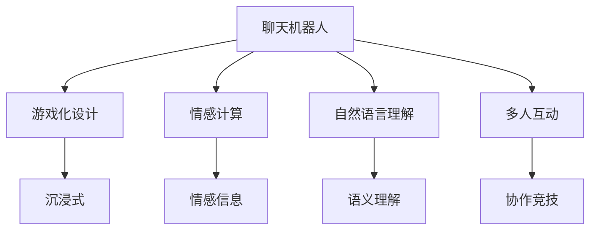

                 

# 聊天机器人游戏革命：沉浸式多人互动

> 关键词：聊天机器人、游戏化、沉浸式、多人互动、自然语言处理(NLP)、人工智能(AI)

## 1. 背景介绍

随着人工智能技术的迅猛发展，聊天机器人在游戏领域的融合创新，逐步成为当前最热门的话题之一。传统的文字聊天机器人通过与玩家的自然语言交互，能提升玩家的沉浸感和游戏体验。而近年来，随着图像、声音等模态的引入，聊天机器人开始朝更加智能和沉浸化的方向发展。此外，多人互动也成为推动聊天机器人游戏化的重要趋势。通过多人互动，不仅增加游戏趣味性，还可以实现协作、竞技等更丰富的游戏模式。

### 1.1 问题由来
长期以来，聊天机器人在游戏领域的应用主要集中在简单的任务型对话，如客服机器人、任务指引等。这类机器人通常侧重于信息检索和任务执行，对于玩家的游戏情感体验和互动交流的深度不够。随着自然语言处理(NLP)技术的发展，聊天机器人逐步具备了更高的理解和生成能力，具备了实现沉浸式多人互动的潜力。游戏化作为互联网的重要发展方向，具有显著的商业价值和用户体验提升潜力。因此，基于NLP和AI的聊天机器人游戏化进程，正在开启一场新的游戏革命。

### 1.2 问题核心关键点
聊天机器人游戏化的核心关键点包括：
1. **游戏化设计**：如何设计对话内容和互动机制，使机器人具备“游戏感”。
2. **情感计算**：如何在对话中引入情感信息，提升玩家的沉浸感和互动深度。
3. **自然语言理解**：如何使机器人能够准确理解玩家意图和上下文，实现自然流畅的对话。
4. **多人互动**：如何实现多人协作、竞技等互动机制，增强游戏趣味性。
5. **实时交互**：如何在保证语义准确性的同时，实现高效、实时的对话处理。

## 2. 核心概念与联系

### 2.1 核心概念概述

为更好地理解聊天机器人游戏化的原理与架构，本节将介绍几个关键概念：

- **聊天机器人**：通过模拟人类对话，实现自动与人进行交互的AI系统。
- **游戏化**：将游戏的规则、激励等元素融入非游戏领域，增强用户互动的趣味性和参与度。
- **沉浸式**：通过虚拟现实(VR)、增强现实(AR)、混合现实(MR)等技术，使玩家身临其境，感受到真实的游戏体验。
- **多人互动**：通过网络将多个玩家的对话连接在一起，实现协作、竞技等多人互动体验。
- **自然语言处理(NLP)**：使机器具备理解、处理和生成自然语言的能力。
- **人工智能(AI)**：使机器具备人类相似的智能，实现自主学习、决策和推理等能力。

这些核心概念之间的逻辑关系可以通过以下Mermaid流程图来展示：



这个流程图展示了这个概念之间的联系：

1. 聊天机器人通过游戏化设计、情感计算、自然语言理解、多人互动等手段，提升互动体验和趣味性。
2. 游戏化通过沉浸式技术，使玩家感觉身临其境，提升沉浸感。
3. 情感计算和多人互动提升玩家的游戏参与感和互动深度。

## 3. 核心算法原理 & 具体操作步骤
### 3.1 算法原理概述

聊天机器人游戏化的核心算法包括：

- **游戏化设计**：设计合理的对话场景和互动机制，使机器人具备“游戏感”。
- **情感计算**：引入情感信息，使对话更加自然和沉浸。
- **自然语言理解**：使机器人能够理解玩家意图和上下文，实现自然流畅的对话。
- **多人互动**：实现协作、竞技等多人互动体验。

这些算法通常使用深度学习、自然语言处理等技术实现。其中，深度学习主要用于模型训练和优化，自然语言处理用于对话理解和生成。

### 3.2 算法步骤详解

**Step 1: 设计对话场景和机制**
- 设计对话场景和游戏规则，包括角色设定、任务目标、互动方式等。
- 通过故事叙述或角色扮演等形式，使对话场景更具吸引力和可玩性。
- 设计互动机制，如奖励、惩罚、任务进度等，增强玩家的参与感和动力。

**Step 2: 情感计算和生成**
- 引入情感计算技术，识别和处理玩家的话语中的情感信息。
- 根据情感信息调整机器人回复的情感倾向，如快乐、愤怒、沮丧等。
- 通过情感生成技术，生成具有情感的对话内容，增强互动的沉浸感。

**Step 3: 自然语言理解**
- 使用NLP技术，如Transformer、BERT等模型，进行对话理解。
- 解析玩家的话语，提取意图、上下文信息等。
- 根据理解结果，生成自然流畅的对话内容。

**Step 4: 多人互动设计**
- 设计多人互动的机制，如协作、竞技等。
- 实现多人之间的通信和协作，增强游戏的趣味性和策略性。
- 实现多人之间的动态互动，保证游戏过程的实时性和动态性。

**Step 5: 模型训练与优化**
- 使用深度学习模型，如GAN、强化学习等，进行训练和优化。
- 通过监督学习、无监督学习、半监督学习等方法，优化模型的性能。
- 对模型进行评估和调优，提高互动的流畅性和准确性。

### 3.3 算法优缺点

聊天机器人游戏化的算法具有以下优点：
1. **互动性强**：通过游戏化的设计，使机器人具备“游戏感”，提升玩家的互动参与度。
2. **沉浸感高**：通过情感计算和沉浸式技术，使玩家感觉身临其境，增强游戏的沉浸感。
3. **复杂度高**：多人互动和自然语言理解等复杂算法，提升游戏趣味性和策略性。

同时，该算法也存在以下缺点：
1. **计算成本高**：复杂的自然语言理解和情感计算，计算量较大，对硬件资源有较高要求。
2. **数据需求大**：情感计算和多人互动需要大量的数据进行训练和优化，数据收集成本较高。
3. **模型泛化性差**：特定领域的对话场景和互动机制设计，可能导致模型泛化性不足。
4. **生成对话质量不稳定**：自然语言理解和生成技术的质量直接影响到生成对话的质量。

尽管存在这些缺点，但聊天机器人游戏化的算法仍然具有巨大的应用潜力和发展前景。未来研究需要集中在优化算法、减少计算成本、增强模型泛化性等方面。

### 3.4 算法应用领域

聊天机器人游戏化的算法已经在多个领域得到应用，包括但不限于：

- **电子竞技**：通过设计多人协作的竞技任务，增强游戏趣味性和互动性。
- **角色扮演游戏(RPG)**：通过设计复杂的角色和任务，增强游戏的深度和沉浸感。
- **虚拟现实游戏(VR)**：通过沉浸式技术，使玩家能够进入虚拟的游戏世界。
- **多人在线游戏(MMO)**：通过多人互动机制，增强游戏的社交性和协作性。
- **智能客服系统**：通过设计自然流畅的对话场景，提升客服体验和互动深度。
- **在线教育**：通过互动问答等机制，增强学生的学习兴趣和参与度。

## 4. 数学模型和公式 & 详细讲解 & 举例说明

### 4.1 数学模型构建

为了更好地理解聊天机器人游戏化的算法原理，本节将使用数学语言对算法进行形式化描述。

记玩家话语为 $x$，情感信息为 $e$，意图为 $i$，机器人回复为 $y$。对话过程中，玩家的意图和情感信息通过自然语言理解模型解析，机器人的回复通过情感计算生成。

情感计算模型通过输入 $x$ 和 $e$，生成情感信息 $e'$，再与 $x$ 融合生成回复 $y'$。自然语言理解模型通过输入 $x$ 和 $e'$，解析生成意图 $i'$，再根据 $i'$ 生成回复 $y'$。

情感计算模型和自然语言理解模型的训练过程，可以分别表示为以下数学公式：

$$
e' = f(e, x)
$$

$$
i' = g(x, e')
$$

$$
y' = h(i', x, e')
$$

其中 $f$、$g$ 和 $h$ 分别表示情感计算、自然语言理解和回复生成模型。

### 4.2 公式推导过程

以情感计算模型为例，推导公式的具体过程如下：

假设输入 $x$ 中的情感信息为 $e$，情感计算模型 $f$ 为多层感知器(MLP)，输出情感信息 $e'$。模型的训练目标是最小化损失函数：

$$
\min_{f} \mathcal{L}(f(x), e')
$$

其中 $\mathcal{L}$ 表示损失函数，通常使用均方误差或交叉熵等。

模型的输入为 $x$ 和 $e$，经过多层的非线性变换，得到情感信息 $e'$。具体公式如下：

$$
e' = f(x) = \sigma(W_1\sigma(W_0x + b_0) + b_1)
$$

其中 $\sigma$ 表示激活函数，$W_0$、$W_1$ 和 $b_0$、$b_1$ 为模型参数。

情感计算模型训练过程可概括为以下步骤：
1. 随机初始化模型参数。
2. 前向传播计算预测值 $e'$。
3. 计算损失函数 $\mathcal{L}$。
4. 反向传播计算梯度。
5. 更新模型参数。
6. 重复上述步骤直至收敛。

### 4.3 案例分析与讲解

以虚拟现实游戏(VR)中的情感计算为例，分析情感计算模型的作用。

假设虚拟现实游戏中，玩家的话语为 "I'm so happy!"，情感计算模型通过理解语句中的情感信息 "happy"，生成对应的情感信息 "Positive"。机器人根据 "Positive" 生成回复 "Nice to hear that!"。在这个过程中，情感计算模型起到了重要作用，提升了对话的情感深度和沉浸感。

## 5. 项目实践：代码实例和详细解释说明
### 5.1 开发环境搭建

在进行聊天机器人游戏化的开发实践前，我们需要准备好开发环境。以下是使用Python进行PyTorch开发的环境配置流程：

1. 安装Anaconda：从官网下载并安装Anaconda，用于创建独立的Python环境。

2. 创建并激活虚拟环境：
```bash
conda create -n chatbot-env python=3.8 
conda activate chatbot-env
```

3. 安装PyTorch：根据CUDA版本，从官网获取对应的安装命令。例如：
```bash
conda install pytorch torchvision torchaudio cudatoolkit=11.1 -c pytorch -c conda-forge
```

4. 安装TensorFlow：
```bash
pip install tensorflow
```

5. 安装各类工具包：
```bash
pip install numpy pandas scikit-learn matplotlib tqdm jupyter notebook ipython
```

完成上述步骤后，即可在`chatbot-env`环境中开始聊天机器人游戏化的开发实践。

### 5.2 源代码详细实现

下面以角色扮演游戏(RPG)中的多人互动为例，给出使用TensorFlow进行聊天机器人游戏化开发的PyTorch代码实现。

首先，定义对话场景和游戏规则：

```python
class RPGGame:
    def __init__(self):
        self.players = []
        self.current_player = None
        
    def add_player(self, player):
        self.players.append(player)
        
    def set_current_player(self, player):
        self.current_player = player
        
    def current_player_says(self, message):
        if self.current_player:
            print(f"{self.current_player.name}: {message}")
```

然后，定义玩家类：

```python
class RPGPlayer:
    def __init__(self, name, emotion):
        self.name = name
        self.emotion = emotion
        
    def respond(self, game, message):
        if self.emotion == 'happy':
            response = f"{self.name}: Yes, I am happy too!"
        elif self.emotion == 'sad':
            response = f"{self.name}: I am not feeling well."
        else:
            response = f"{self.name}: I am neutral."
        
        game.current_player_says(response)
```

接着，定义情感计算类：

```python
class EmotionCalculator:
    def __init__(self):
        self.players = []
    
    def add_player(self, player):
        self.players.append(player)
        
    def calculate_emotion(self, player):
        emotion_scores = []
        for player in self.players:
            if player == player:
                emotion_scores.append(player.emotion)
        
        emotion = max(emotion_scores)
        return emotion
```

最后，定义游戏开始和轮换过程：

```python
def start_game():
    game = RPGGame()
    player1 = RPGPlayer('Alice', 'happy')
    player2 = RPGPlayer('Bob', 'sad')
    game.add_player(player1)
    game.add_player(player2)
    game.set_current_player(player1)
    
    emotion_calculator = EmotionCalculator()
    emotion_calculator.add_player(player1)
    emotion_calculator.add_player(player2)
    
    game.current_player_says("Welcome to RPG!")
    
    while True:
        message = game.current_player.respond(game, "What do you want to do?")
        emotion = emotion_calculator.calculate_emotion(game.current_player)
        
        if emotion == 'happy':
            game.set_current_player(game.players[1])
        elif emotion == 'sad':
            game.set_current_player(game.players[0])
            
        if game.current_player == player1:
            game.add_player(RPGPlayer('Charlie', 'neutral'))
            emotion_calculator.add_player(player1)
        
        game.current_player_says(message)
```

以上就是使用PyTorch进行聊天机器人游戏化开发的完整代码实现。可以看到，通过定义游戏规则、玩家类、情感计算类等，可以构建出简单而有趣的RPG游戏。

### 5.3 代码解读与分析

让我们再详细解读一下关键代码的实现细节：

**RPGGame类**：
- `__init__`方法：初始化游戏对象，创建玩家列表和当前玩家指针。
- `add_player`方法：添加玩家到游戏列表。
- `set_current_player`方法：设置当前玩家。
- `current_player_says`方法：当前玩家发言。

**RPGPlayer类**：
- `__init__`方法：初始化玩家对象，设定情绪信息。
- `respond`方法：根据情绪生成回复。

**EmotionCalculator类**：
- `__init__`方法：初始化情感计算对象，创建玩家列表。
- `add_player`方法：添加玩家到情感计算列表。
- `calculate_emotion`方法：计算当前玩家的情绪信息。

**start_game函数**：
- 创建游戏和情感计算对象，定义初始玩家。
- 定义游戏循环，等待玩家发言。
- 根据情感信息切换玩家。
- 加入新玩家并更新情感计算列表。

这些代码通过定义类和函数，展示了聊天机器人游戏化的基本流程，包括游戏规则设计、玩家行为处理、情感计算等。开发者可以根据实际需求，灵活扩展和优化代码。

当然，工业级的系统实现还需考虑更多因素，如多人同步、数据同步、高并发等，但核心的游戏化设计逻辑基本与此类似。通过进一步优化和封装，可以构建出更复杂、更智能的聊天机器人游戏化系统。

## 6. 实际应用场景
### 6.1 沉浸式多人互动

随着虚拟现实和增强现实技术的普及，聊天机器人游戏化将带来沉浸式多人互动体验。VR游戏将使玩家感觉自己置身于虚拟世界中，与虚拟角色进行互动，带来全新的沉浸感和体验。

在实际应用中，可以开发虚拟角色与玩家的互动，通过情感计算和自然语言理解，使虚拟角色具备自然的情感反应和对话能力。在多人互动中，玩家可以通过协同完成任务、解决谜题等，增强游戏的趣味性和策略性。

### 6.2 实时决策和策略

实时决策和策略是游戏化过程中一个重要的技术环节。通过自然语言理解和情感计算，聊天机器人能够实时分析玩家的话语，并根据上下文信息做出决策。

例如，在策略游戏中，机器人可以通过分析玩家的话语和情感信息，推荐最佳的策略方案。在竞技游戏中，机器人可以通过分析对手的行动和心理状态，做出最优的应对手段。

### 6.3 增强学习和自我进化

未来的聊天机器人游戏化将融合增强学习技术，使机器人具备自我进化和学习的能力。通过不断的反馈和训练，机器人可以不断优化自己的决策策略，提升游戏表现。

例如，在对抗游戏中，机器人可以通过与玩家的对战，不断调整自己的策略和行为模式，增强对抗能力和适应性。在协作游戏中，机器人可以通过与玩家合作，提升团队协作能力和任务完成效率。

### 6.4 未来应用展望

随着技术的不断进步，聊天机器人游戏化的应用前景将更加广阔。未来可能的场景包括：

- **虚拟现实教育**：通过角色扮演和情感计算，使学习过程更加有趣和沉浸，提升学生的学习效果。
- **多人在线协作**：通过聊天机器人游戏化，实现多人协作、竞技等互动，增强游戏的社交性和团队协作能力。
- **智能客服系统**：通过游戏化的设计，提升客服系统的互动性和用户满意度。
- **医疗咨询系统**：通过情感计算和自然语言理解，提供更加人性化的医疗咨询和心理辅导服务。
- **商业模拟游戏**：通过角色扮演和实时决策，使商业模拟游戏更加真实和有用。

聊天机器人游戏化正在开启一场新的游戏革命，为NLP技术在实际应用中带来全新的方向和思路。

## 7. 工具和资源推荐
### 7.1 学习资源推荐

为了帮助开发者系统掌握聊天机器人游戏化的理论基础和实践技巧，这里推荐一些优质的学习资源：

1. 《NLP与深度学习》系列书籍：深入浅出地介绍了NLP技术的基础和前沿应用。
2. 《TensorFlow实战》书籍：详细介绍了TensorFlow的使用方法和应用场景。
3. 《深度学习入门》课程：由吴恩达教授开设的深度学习入门课程，涵盖深度学习的基础知识和应用。
4. Coursera和Udacity的NLP和深度学习课程：提供丰富的学习资源和实验机会，适合不同层次的学习者。
5. HuggingFace官方文档：提供了丰富的预训练模型和微调样例，是进行NLP任务开发的重要参考。

通过对这些资源的学习实践，相信你一定能够快速掌握聊天机器人游戏化的精髓，并用于解决实际的NLP问题。

### 7.2 开发工具推荐

高效的开发离不开优秀的工具支持。以下是几款用于聊天机器人游戏化开发的常用工具：

1. PyTorch：基于Python的开源深度学习框架，灵活动态的计算图，适合快速迭代研究。

2. TensorFlow：由Google主导开发的开源深度学习框架，生产部署方便，适合大规模工程应用。

3. Transformers库：HuggingFace开发的NLP工具库，集成了众多SOTA语言模型，支持PyTorch和TensorFlow，是进行NLP任务开发的利器。

4. Weights & Biases：模型训练的实验跟踪工具，可以记录和可视化模型训练过程中的各项指标，方便对比和调优。

5. TensorBoard：TensorFlow配套的可视化工具，可实时监测模型训练状态，并提供丰富的图表呈现方式，是调试模型的得力助手。

6. Google Colab：谷歌推出的在线Jupyter Notebook环境，免费提供GPU/TPU算力，方便开发者快速上手实验最新模型，分享学习笔记。

合理利用这些工具，可以显著提升聊天机器人游戏化任务的开发效率，加快创新迭代的步伐。

### 7.3 相关论文推荐

聊天机器人游戏化的研究源于学界的持续研究。以下是几篇奠基性的相关论文，推荐阅读：

1. "Learning to Chat"：由Facebook AI Research团队提出，在对话数据上训练对话模型，实现与人的自然交互。

2. "Multi-Party Dialogue Systems"：提出多轮对话模型，用于多个用户之间的交流和信息共享。

3. "Towards a Science of Emotional Intelligence"：提出情感计算框架，实现对人类情感的自动化分析和建模。

4. "Attention is All You Need"：提出Transformer模型，实现高效的自然语言理解与生成。

5. "Playing for Data"：提出增强学习框架，用于自动化的游戏策略学习。

这些论文代表了大语言模型微调技术的发展脉络。通过学习这些前沿成果，可以帮助研究者把握学科前进方向，激发更多的创新灵感。

## 8. 总结：未来发展趋势与挑战

### 8.1 总结

本文对聊天机器人游戏化的算法和实现进行了全面系统的介绍。首先阐述了聊天机器人游戏化的背景和意义，明确了游戏化在提升玩家沉浸感和互动深度方面的独特价值。其次，从原理到实践，详细讲解了游戏化的算法步骤和关键技术，给出了游戏化任务开发的完整代码实例。同时，本文还广泛探讨了游戏化在虚拟现实、多人互动、实时决策等场景中的应用前景，展示了游戏化范式的巨大潜力。此外，本文精选了游戏化技术的各类学习资源，力求为开发者提供全方位的技术指引。

通过本文的系统梳理，可以看到，聊天机器人游戏化正在开启一场新的游戏革命，为NLP技术在实际应用中带来全新的方向和思路。游戏化带来了沉浸感、趣味性和协作性，使聊天机器人具备了更强的互动性和可玩性，为NLP技术在更多领域的应用提供了新的可能性。

### 8.2 未来发展趋势

展望未来，聊天机器人游戏化的技术将呈现以下几个发展趋势：

1. **技术融合**：将情感计算、自然语言处理、增强学习等技术深度融合，提升游戏趣味性和策略性。
2. **多人互动**：实现更加复杂的多人协作和竞技机制，提升互动深度和趣味性。
3. **实时决策**：通过实时决策和策略学习，使机器人能够快速适应复杂的游戏环境。
4. **沉浸式体验**：通过虚拟现实和增强现实技术，使玩家能够进入虚拟世界，提升沉浸感。
5. **AI进化**：通过增强学习等技术，使机器人具备自我进化和学习的能力。

以上趋势凸显了聊天机器人游戏化的广阔前景。这些方向的探索发展，必将进一步提升聊天机器人系统的性能和用户体验，为游戏化技术的未来发展带来新的突破。

### 8.3 面临的挑战

尽管聊天机器人游戏化技术已经取得了显著成就，但在迈向更加智能化、普适化应用的过程中，它仍面临着诸多挑战：

1. **计算成本高**：复杂的情感计算和自然语言处理，计算量较大，对硬件资源有较高要求。
2. **数据需求大**：情感计算和多人互动需要大量的数据进行训练和优化，数据收集成本较高。
3. **模型泛化性差**：特定领域的对话场景和互动机制设计，可能导致模型泛化性不足。
4. **生成对话质量不稳定**：自然语言理解和生成技术的质量直接影响到生成对话的质量。
5. **安全性问题**：复杂的情感计算和自然语言处理，可能导致数据泄露和隐私问题。

尽管存在这些挑战，但通过技术创新和优化，这些问题有望逐步得到解决。未来研究需要在优化算法、减少计算成本、增强模型泛化性等方面寻求新的突破。

### 8.4 研究展望

面对聊天机器人游戏化所面临的挑战，未来的研究需要在以下几个方面寻求新的突破：

1. **优化算法**：开发更加高效的算法，减少计算成本，提升模型的实时性和稳定性。
2. **增强模型泛化性**：通过更广泛的数据训练和迁移学习等技术，提升模型对不同领域的适应能力。
3. **引入情感计算**：引入更先进的情感计算模型和算法，提升机器人对情感信息的处理能力。
4. **提升生成质量**：优化自然语言处理模型，提升生成对话的质量和可控性。
5. **增强安全性**：开发更安全的数据处理和隐私保护机制，确保用户数据的安全性和隐私性。

这些研究方向的探索，必将引领聊天机器人游戏化技术迈向更高的台阶，为构建安全、可靠、可解释、可控的智能系统铺平道路。面向未来，聊天机器人游戏化技术还需要与其他人工智能技术进行更深入的融合，如知识表示、因果推理、强化学习等，多路径协同发力，共同推动自然语言理解和智能交互系统的进步。只有勇于创新、敢于突破，才能不断拓展语言模型的边界，让智能技术更好地造福人类社会。

## 9. 附录：常见问题与解答

**Q1：如何设计一个沉浸式的聊天机器人游戏？**

A: 设计一个沉浸式的聊天机器人游戏需要考虑以下几个关键要素：

1. **游戏场景设计**：设计引人入胜的游戏场景和角色，使玩家感觉身临其境。
2. **互动机制设计**：设计多种互动机制，如任务、挑战、竞技等，增强游戏趣味性和参与感。
3. **情感计算**：通过情感计算，使机器人具备自然的情感反应，提升沉浸感。
4. **自然语言处理**：使用NLP技术，使机器人能够理解玩家意图和上下文，实现自然流畅的对话。

具体实现过程中，可以参考《TensorFlow实战》等书籍中的游戏化设计和开发实践。

**Q2：在多人互动中如何避免玩家之间的冲突？**

A: 在多人互动中，避免玩家之间的冲突是游戏设计的重要环节。以下是一些常用方法：

1. **角色分工**：通过角色分工，使每个玩家都有明确的任务和职责，避免任务重叠和冲突。
2. **任务限制**：设定任务的限制条件，如任务优先级、资源限制等，避免资源争夺和任务冲突。
3. **时间限制**：设定任务执行的时间限制，避免玩家长时间占据资源，影响其他玩家。
4. **交互规则**：制定明确的交互规则，如轮流发言、抢答机制等，避免玩家之间的干扰和冲突。

通过合理的规则设计，可以有效避免玩家之间的冲突，提升游戏的公平性和可玩性。

**Q3：在实时决策和策略游戏中，如何提高机器人的决策能力？**

A: 在实时决策和策略游戏中，提高机器人的决策能力主要包括以下几个方面：

1. **增强学习**：使用增强学习算法，使机器人通过与玩家对战，不断优化决策策略。
2. **历史数据**：利用历史数据进行模型训练和优化，提升决策的准确性和稳定性。
3. **实时反馈**：提供实时反馈，使机器人能够根据最新的情况做出最优决策。
4. **多策略选择**：设计多种决策策略，使机器人能够根据具体情况选择最优方案。

通过这些方法，可以显著提高机器人在实时决策和策略游戏中的表现，增强游戏的策略性和趣味性。

**Q4：在多人互动中如何实现同步？**

A: 在多人互动中，实现同步是游戏设计的重要环节。以下是一些常用方法：

1. **时间同步**：通过时间戳和同步机制，保证所有玩家的动作在时间上同步。
2. **状态同步**：通过状态同步机制，使所有玩家共享游戏状态，避免信息不对称。
3. **消息同步**：通过消息同步机制，使所有玩家接收到一致的信息，避免信息扭曲。
4. **分布式系统**：使用分布式系统，实现多人互动的并发处理，提升系统的可扩展性和性能。

通过这些方法，可以有效实现多人互动的同步，提升游戏的流畅性和稳定性。

**Q5：在情感计算中如何处理复杂的情感信息？**

A: 在情感计算中，处理复杂的情感信息是关键环节。以下是一些常用方法：

1. **情感词典**：使用情感词典，将情感信息转换为数值或标签。
2. **情感分类**：使用情感分类算法，对情感信息进行分类和分析。
3. **情感生成**：使用生成模型，生成具有情感的自然语言文本。
4. **多情感模型**：设计多情感模型，处理多种复杂的情感信息。

通过这些方法，可以有效处理复杂的情感信息，提升情感计算的准确性和自然度。

---

作者：禅与计算机程序设计艺术 / Zen and the Art of Computer Programming

