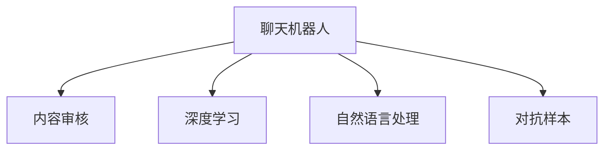

                 

# 聊天机器人社交媒体影响力：内容审核和网络健康

## 1. 背景介绍

### 1.1 问题由来

随着人工智能技术的不断进步，聊天机器人已经在社交媒体、客服、教育等多个领域得到了广泛应用。它们以其高效、智能化的服务，极大地提升了用户互动体验。然而，聊天机器人在带来便利的同时，也带来了新的挑战。

尤其是在社交媒体环境中，聊天机器人面临的一大挑战是内容审核问题。社交媒体平台需要保证用户上传的文本、图片、视频等内容不包含违规、有害、虚假的信息，以维护网络环境的健康和用户的安全。聊天机器人作为社交媒体内容的主要生成者和传播者，如何有效进行内容审核，保障网络健康，是亟待解决的问题。

### 1.2 问题核心关键点

内容审核是聊天机器人社交媒体应用的核心关键点之一，涉及以下几个关键问题：

- **内容识别**：如何准确识别出含有违规、有害、虚假信息的内容。
- **规则制定**：如何制定合理的规则，避免过度审查和误判。
- **效果评估**：如何评估内容审核的效果，持续优化审核模型。
- **隐私保护**：如何在内容审核中保护用户的隐私信息。

解决这些问题需要构建一个高效、准确、可解释的内容审核系统，确保聊天机器人能够智能地审核社交媒体内容，维护网络环境的健康。

## 2. 核心概念与联系

### 2.1 核心概念概述

为更好地理解聊天机器人社交媒体内容审核机制，本节将介绍几个密切相关的核心概念：

- **聊天机器人**：以自然语言处理和机器学习技术为基础，能够自动理解并生成文本、语音、图像等形式的交互式智能系统。
- **内容审核**：对用户上传的文本、图片、视频等内容进行检查和筛选，防止违规、有害、虚假信息的传播。
- **深度学习**：利用多层神经网络模型，对大规模数据进行特征学习，实现对内容的准确分类和识别。
- **自然语言处理(NLP)**：使计算机能够理解和处理人类语言，是聊天机器人内容审核的重要基础。
- **对抗样本**：故意构造的、能够欺骗模型分类的数据样本，用于评估模型鲁棒性和安全性。

这些核心概念之间的逻辑关系可以通过以下Mermaid流程图来展示：



这个流程图展示了一个聊天机器人内容审核的典型流程：聊天机器人使用深度学习进行内容识别和分类，结合自然语言处理技术进行细节解析，并通过对抗样本检测模型鲁棒性，确保内容审核的准确性和安全性。

## 3. 核心算法原理 & 具体操作步骤
### 3.1 算法原理概述

聊天机器人社交媒体内容审核的核心算法原理基于深度学习，尤其是文本分类和图像识别技术。其核心思想是通过大规模标注数据训练模型，使其能够自动识别人类语言和图像中的违规、有害、虚假信息。

假设存在一个标注数据集 $D=\{(x_i,y_i)\}_{i=1}^N$，其中 $x_i$ 为输入样本（文本或图片），$y_i$ 为标签（表示是否含有违规信息）。通过最小化损失函数 $\mathcal{L}(\theta)$，优化模型参数 $\theta$，使得模型能够准确地预测新的样本。

常见的损失函数包括交叉熵损失、均方误差损失等。模型的训练过程通常使用梯度下降等优化算法，不断更新模型参数，最小化损失函数。

### 3.2 算法步骤详解

聊天机器人社交媒体内容审核的算法步骤如下：

**Step 1: 数据准备**
- 收集社交媒体平台上的历史违规数据，进行标注和清洗，形成训练集和验证集。
- 确定模型输入格式（文本、图片等），准备相应的预处理工具和库。

**Step 2: 选择模型架构**
- 选择合适的深度学习模型，如卷积神经网络(CNN)、循环神经网络(RNN)、长短时记忆网络(LSTM)等。
- 根据任务特点，选择文本分类、图像识别、图像分割等任务适配的网络结构。

**Step 3: 训练模型**
- 使用训练集数据，通过梯度下降等优化算法训练模型。
- 在验证集上评估模型性能，调整超参数，如学习率、批大小、迭代轮数等。
- 使用正则化技术（如L2正则、Dropout等）防止过拟合。

**Step 4: 测试和部署**
- 在测试集上评估模型效果，使用混淆矩阵、精确度、召回率等指标评估模型性能。
- 将训练好的模型部署到生产环境，集成到聊天机器人系统中。
- 定期更新模型，以应对新出现的违规信息。

### 3.3 算法优缺点

聊天机器人社交媒体内容审核的算法具有以下优点：
- 自动化程度高。能够自动处理大规模社交媒体数据，减少人工审核成本。
- 精度高。利用深度学习技术，能够实现较高的内容识别准确率。
- 可扩展性强。模型可以在不同的社交媒体平台上复用，适应多样化的内容形式。

同时，该算法也存在以下局限性：
- 依赖标注数据。模型效果很大程度上依赖于标注数据的质量和数量，获取高质量标注数据的成本较高。
- 模型过拟合。在数据量不足或标注数据偏差较大时，模型容易过拟合，导致泛化能力不足。
- 可解释性不足。深度学习模型通常是"黑盒"系统，难以解释其内部工作机制和决策逻辑。
- 伦理风险。模型可能学习到有偏见、有害的信息，在内容审核中引入伦理风险。

尽管存在这些局限性，但就目前而言，基于深度学习的聊天机器人社交媒体内容审核算法仍然是大规模、高效的内容审核范式。未来相关研究的重点在于如何进一步降低对标注数据的依赖，提高模型的鲁棒性和可解释性，同时兼顾伦理安全性等因素。

### 3.4 算法应用领域

聊天机器人社交媒体内容审核技术已经在多个领域得到了应用，例如：

- 社交媒体平台：如Facebook、Twitter等社交媒体网站，使用聊天机器人进行自动内容审核，防止违规信息的传播。
- 在线客服系统：使用聊天机器人进行自动客服内容审核，筛选出有害的客户咨询内容。
- 教育平台：如Coursera、EdX等在线教育平台，使用聊天机器人审核用户提交的作业和评论。
- 金融平台：如支付宝、微信支付等金融支付平台，使用聊天机器人审核用户上传的支付信息。

除了上述这些经典应用外，聊天机器人内容审核技术也被创新性地应用到更多场景中，如安全监控、信息检索、内容推荐等，为社交媒体和网络环境带来了新的突破。

## 4. 数学模型和公式 & 详细讲解 & 举例说明
### 4.1 数学模型构建

本节将使用数学语言对聊天机器人社交媒体内容审核过程进行更加严格的刻画。

记聊天机器人输入样本为 $x$，输出为 $y$，模型为 $M_{\theta}$。假设存在一个标注数据集 $D=\{(x_i,y_i)\}_{i=1}^N$，其中 $y_i$ 表示样本 $x_i$ 是否含有违规信息，标记为1或0。

定义模型 $M_{\theta}$ 在样本 $x$ 上的预测输出为 $\hat{y}=M_{\theta}(x)$，预测正确的概率为 $\hat{p}(\hat{y}=1|x) = \sigma(\langle \theta, x \rangle)$，其中 $\sigma$ 为Sigmoid函数，$\langle \theta, x \rangle$ 为线性变换后的结果。

假设训练集损失函数为 $\mathcal{L}(\theta) = -\frac{1}{N} \sum_{i=1}^N [y_i \log \hat{p}(\hat{y}=1|x_i) + (1-y_i) \log(1-\hat{p}(\hat{y}=1|x_i))]$，即交叉熵损失。

### 4.2 公式推导过程

以下我们以文本分类任务为例，推导交叉熵损失函数及其梯度的计算公式。

假设模型 $M_{\theta}$ 在输入 $x$ 上的输出为 $\hat{y}=M_{\theta}(x)$，表示样本属于正类的概率。真实标签 $y \in \{0,1\}$。则二分类交叉熵损失函数定义为：

$$
\mathcal{L}(\theta) = -\frac{1}{N}\sum_{i=1}^N [y_i\log \hat{y} + (1-y_i)\log(1-\hat{y})]
$$

将其代入经验风险公式，得：

$$
\mathcal{L}(\theta) = -\frac{1}{N}\sum_{i=1}^N [y_i\log \hat{y} + (1-y_i)\log(1-\hat{y})]
$$

根据链式法则，损失函数对参数 $\theta_k$ 的梯度为：

$$
\frac{\partial \mathcal{L}(\theta)}{\partial \theta_k} = -\frac{1}{N}\sum_{i=1}^N (\frac{y_i}{\hat{y}}-\frac{1-y_i}{1-\hat{y}}) \frac{\partial M_{\theta}(x_i)}{\partial \theta_k}
$$

其中 $\frac{\partial M_{\theta}(x_i)}{\partial \theta_k}$ 可进一步递归展开，利用自动微分技术完成计算。

在得到损失函数的梯度后，即可带入参数更新公式，完成模型的迭代优化。重复上述过程直至收敛，最终得到适应社交媒体内容审核任务的最优模型参数 $\theta^*$。

## 5. 项目实践：代码实例和详细解释说明
### 5.1 开发环境搭建

在进行内容审核实践前，我们需要准备好开发环境。以下是使用Python进行PyTorch开发的环境配置流程：

1. 安装Anaconda：从官网下载并安装Anaconda，用于创建独立的Python环境。

2. 创建并激活虚拟环境：
```bash
conda create -n pytorch-env python=3.8 
conda activate pytorch-env
```

3. 安装PyTorch：根据CUDA版本，从官网获取对应的安装命令。例如：
```bash
conda install pytorch torchvision torchaudio cudatoolkit=11.1 -c pytorch -c conda-forge
```

4. 安装Transformers库：
```bash
pip install transformers
```

5. 安装各类工具包：
```bash
pip install numpy pandas scikit-learn matplotlib tqdm jupyter notebook ipython
```

完成上述步骤后，即可在`pytorch-env`环境中开始内容审核实践。

### 5.2 源代码详细实现

下面我以文本分类任务为例，给出使用Transformers库对BERT模型进行内容审核的PyTorch代码实现。

首先，定义数据处理函数：

```python
from transformers import BertTokenizer
from torch.utils.data import Dataset
import torch

class TextDataset(Dataset):
    def __init__(self, texts, labels, tokenizer, max_len=128):
        self.texts = texts
        self.labels = labels
        self.tokenizer = tokenizer
        self.max_len = max_len
        
    def __len__(self):
        return len(self.texts)
    
    def __getitem__(self, item):
        text = self.texts[item]
        label = self.labels[item]
        
        encoding = self.tokenizer(text, return_tensors='pt', max_length=self.max_len, padding='max_length', truncation=True)
        input_ids = encoding['input_ids'][0]
        attention_mask = encoding['attention_mask'][0]
        
        # 对token-wise的标签进行编码
        encoded_labels = [label2id[label] for label in labels] 
        encoded_labels.extend([label2id['O']] * (self.max_len - len(encoded_labels)))
        labels = torch.tensor(encoded_labels, dtype=torch.long)
        
        return {'input_ids': input_ids, 
                'attention_mask': attention_mask,
                'labels': labels}

# 标签与id的映射
label2id = {'O': 0, 'P': 1}
id2label = {v: k for k, v in label2id.items()}

# 创建dataset
tokenizer = BertTokenizer.from_pretrained('bert-base-cased')

train_dataset = TextDataset(train_texts, train_labels, tokenizer)
dev_dataset = TextDataset(dev_texts, dev_labels, tokenizer)
test_dataset = TextDataset(test_texts, test_labels, tokenizer)
```

然后，定义模型和优化器：

```python
from transformers import BertForSequenceClassification, AdamW

model = BertForSequenceClassification.from_pretrained('bert-base-cased', num_labels=len(label2id))

optimizer = AdamW(model.parameters(), lr=2e-5)
```

接着，定义训练和评估函数：

```python
from torch.utils.data import DataLoader
from tqdm import tqdm
from sklearn.metrics import classification_report

device = torch.device('cuda') if torch.cuda.is_available() else torch.device('cpu')
model.to(device)

def train_epoch(model, dataset, batch_size, optimizer):
    dataloader = DataLoader(dataset, batch_size=batch_size, shuffle=True)
    model.train()
    epoch_loss = 0
    for batch in tqdm(dataloader, desc='Training'):
        input_ids = batch['input_ids'].to(device)
        attention_mask = batch['attention_mask'].to(device)
        labels = batch['labels'].to(device)
        model.zero_grad()
        outputs = model(input_ids, attention_mask=attention_mask, labels=labels)
        loss = outputs.loss
        epoch_loss += loss.item()
        loss.backward()
        optimizer.step()
    return epoch_loss / len(dataloader)

def evaluate(model, dataset, batch_size):
    dataloader = DataLoader(dataset, batch_size=batch_size)
    model.eval()
    preds, labels = [], []
    with torch.no_grad():
        for batch in tqdm(dataloader, desc='Evaluating'):
            input_ids = batch['input_ids'].to(device)
            attention_mask = batch['attention_mask'].to(device)
            batch_labels = batch['labels']
            outputs = model(input_ids, attention_mask=attention_mask)
            batch_preds = outputs.logits.argmax(dim=2).to('cpu').tolist()
            batch_labels = batch_labels.to('cpu').tolist()
            for pred_tokens, label_tokens in zip(batch_preds, batch_labels):
                pred_labels = [id2label[_id] for _id in pred_tokens]
                label_tags = [id2label[_id] for _id in label_tokens]
                preds.append(pred_labels[:len(label_tags)])
                labels.append(label_tags)
                
    print(classification_report(labels, preds))
```

最后，启动训练流程并在测试集上评估：

```python
epochs = 5
batch_size = 16

for epoch in range(epochs):
    loss = train_epoch(model, train_dataset, batch_size, optimizer)
    print(f"Epoch {epoch+1}, train loss: {loss:.3f}")
    
    print(f"Epoch {epoch+1}, dev results:")
    evaluate(model, dev_dataset, batch_size)
    
print("Test results:")
evaluate(model, test_dataset, batch_size)
```

以上就是使用PyTorch对BERT进行内容审核任务的代码实现。可以看到，得益于Transformers库的强大封装，我们可以用相对简洁的代码完成BERT模型的加载和训练。

### 5.3 代码解读与分析

让我们再详细解读一下关键代码的实现细节：

**TextDataset类**：
- `__init__`方法：初始化文本、标签、分词器等关键组件。
- `__len__`方法：返回数据集的样本数量。
- `__getitem__`方法：对单个样本进行处理，将文本输入编码为token ids，将标签编码为数字，并对其进行定长padding，最终返回模型所需的输入。

**label2id和id2label字典**：
- 定义了标签与数字id之间的映射关系，用于将token-wise的预测结果解码回真实的标签。

**训练和评估函数**：
- 使用PyTorch的DataLoader对数据集进行批次化加载，供模型训练和推理使用。
- 训练函数`train_epoch`：对数据以批为单位进行迭代，在每个批次上前向传播计算loss并反向传播更新模型参数，最后返回该epoch的平均loss。
- 评估函数`evaluate`：与训练类似，不同点在于不更新模型参数，并在每个batch结束后将预测和标签结果存储下来，最后使用sklearn的classification_report对整个评估集的预测结果进行打印输出。

**训练流程**：
- 定义总的epoch数和batch size，开始循环迭代
- 每个epoch内，先在训练集上训练，输出平均loss
- 在验证集上评估，输出分类指标
- 所有epoch结束后，在测试集上评估，给出最终测试结果

可以看到，PyTorch配合Transformers库使得BERT内容审核的代码实现变得简洁高效。开发者可以将更多精力放在数据处理、模型改进等高层逻辑上，而不必过多关注底层的实现细节。

当然，工业级的系统实现还需考虑更多因素，如模型的保存和部署、超参数的自动搜索、更灵活的任务适配层等。但核心的内容审核流程基本与此类似。

## 6. 实际应用场景
### 6.1 社交媒体平台

聊天机器人内容审核技术在社交媒体平台上得到了广泛应用，成为平台内容监管的重要手段。各大社交媒体平台通过聊天机器人对用户上传的文本、图片、视频等内容进行自动审核，防止违规信息的传播。

例如，Facebook使用其构建的自动审核系统，能够对超过20亿条用户评论进行实时审核，防止假新闻、仇恨言论、诽谤等信息的传播。Twitter通过聊天机器人对用户的推文进行自动审核，以避免恶意言论和有害信息的传播。

### 6.2 在线客服系统

在线客服系统通过聊天机器人对用户提出的问题进行自动审核，筛选出有害或敏感的内容，及时干预，防止负面信息扩散。例如，客服平台通过聊天机器人审核用户的聊天记录，识别出可能存在的诈骗、欺诈、色情内容，及时介入处理，保护用户的合法权益。

### 6.3 教育平台

在线教育平台如Coursera、EdX等，通过聊天机器人对用户提交的作业、评论进行自动审核，确保内容的健康性和教育性。例如，平台使用聊天机器人对学生提交的作业进行内容审核，防止抄袭、剽窃等不端行为的发生。

### 6.4 金融平台

金融平台如支付宝、微信支付等，通过聊天机器人对用户上传的支付信息进行自动审核，防止欺诈、洗钱等违法行为的发生。例如，平台使用聊天机器人对用户的支付行为进行监控，及时发现异常行为，防止资金被盗用。

### 6.5 医疗平台

医疗平台如百度健康、阿里健康等，通过聊天机器人对用户上传的病情描述、诊断结果等信息进行自动审核，确保医疗信息的安全性和准确性。例如，平台使用聊天机器人对用户的病情描述进行内容审核，防止虚假信息的传播，保护患者的健康权益。

### 6.6 新闻平台

新闻平台如今日头条、网易新闻等，通过聊天机器人对用户上传的评论、文章进行自动审核，防止假新闻、有害信息的传播。例如，平台使用聊天机器人对用户上传的文章进行内容审核，确保新闻信息的真实性和健康性。

## 7. 工具和资源推荐
### 7.1 学习资源推荐

为了帮助开发者系统掌握聊天机器人内容审核的理论基础和实践技巧，这里推荐一些优质的学习资源：

1. 《深度学习》系列博文：由大模型技术专家撰写，深入浅出地介绍了深度学习的基本概念和经典模型，包括内容审核的数学原理和算法实现。

2. CS231n《深度学习视觉与模型》课程：斯坦福大学开设的深度学习课程，有Lecture视频和配套作业，涵盖深度学习在图像识别、文本分类等任务中的应用。

3. 《自然语言处理》系列书籍：介绍自然语言处理的基本原理和常用技术，包括文本分类、命名实体识别、情感分析等任务，是内容审核的重要基础。

4. HuggingFace官方文档：Transformers库的官方文档，提供了海量预训练模型和完整的训练样例代码，是进行内容审核任务开发的利器。

5. GLUE开源项目：自然语言理解测评基准，涵盖大量不同类型的自然语言理解数据集，并提供了基于内容审核的baseline模型，助力内容审核技术发展。

通过对这些资源的学习实践，相信你一定能够快速掌握聊天机器人内容审核的精髓，并用于解决实际的NLP问题。

### 7.2 开发工具推荐

高效的开发离不开优秀的工具支持。以下是几款用于聊天机器人内容审核开发的常用工具：

1. PyTorch：基于Python的开源深度学习框架，灵活动态的计算图，适合快速迭代研究。BERT模型在PyTorch中已经得到广泛实现，便于微调和优化。

2. TensorFlow：由Google主导开发的开源深度学习框架，生产部署方便，适合大规模工程应用。BERT模型在TensorFlow中也有丰富的实现。

3. Transformers库：HuggingFace开发的NLP工具库，集成了众多SOTA语言模型，支持PyTorch和TensorFlow，是进行内容审核任务开发的利器。

4. Weights & Biases：模型训练的实验跟踪工具，可以记录和可视化模型训练过程中的各项指标，方便对比和调优。与主流深度学习框架无缝集成。

5. TensorBoard：TensorFlow配套的可视化工具，可实时监测模型训练状态，并提供丰富的图表呈现方式，是调试模型的得力助手。

6. Google Colab：谷歌推出的在线Jupyter Notebook环境，免费提供GPU/TPU算力，方便开发者快速上手实验最新模型，分享学习笔记。

合理利用这些工具，可以显著提升聊天机器人内容审核任务的开发效率，加快创新迭代的步伐。

### 7.3 相关论文推荐

聊天机器人内容审核技术的发展源于学界的持续研究。以下是几篇奠基性的相关论文，推荐阅读：

1. Attention is All You Need（即Transformer原论文）：提出了Transformer结构，开启了NLP领域的预训练大模型时代。

2. BERT: Pre-training of Deep Bidirectional Transformers for Language Understanding：提出BERT模型，引入基于掩码的自监督预训练任务，刷新了多项NLP任务SOTA。

3. Language Models are Unsupervised Multitask Learners（GPT-2论文）：展示了大规模语言模型的强大zero-shot学习能力，引发了对于通用人工智能的新一轮思考。

4. Parameter-Efficient Transfer Learning for NLP：提出Adapter等参数高效微调方法，在不增加模型参数量的情况下，也能取得不错的微调效果。

5. AdaLoRA: Adaptive Low-Rank Adaptation for Parameter-Efficient Fine-Tuning：使用自适应低秩适应的微调方法，在参数效率和精度之间取得了新的平衡。

6. BertForSequenceClassification: Classification Using BERT for Sequences：介绍BERT在文本分类任务中的应用，包括模型架构和训练过程。

这些论文代表了大语言模型内容审核技术的发展脉络。通过学习这些前沿成果，可以帮助研究者把握学科前进方向，激发更多的创新灵感。

## 8. 总结：未来发展趋势与挑战

### 8.1 总结

本文对聊天机器人社交媒体内容审核方法进行了全面系统的介绍。首先阐述了聊天机器人内容审核的研究背景和意义，明确了内容审核在构建健康网络环境中的重要性。其次，从原理到实践，详细讲解了深度学习在内容审核中的应用，给出了完整的代码实例和详细解释。同时，本文还广泛探讨了内容审核技术在社交媒体、在线客服、教育、金融等多个行业领域的应用前景，展示了其巨大的潜在价值。

通过对这些资源的系统梳理，可以看到，聊天机器人内容审核技术正在成为NLP领域的重要范式，极大地拓展了聊天机器人的应用边界，提升了社交媒体平台和在线服务的安全性和用户满意度。未来，伴随深度学习技术的发展和优化，内容审核技术必将在更多领域得到应用，为构建安全、可靠、可控的智能系统铺平道路。

### 8.2 未来发展趋势

展望未来，聊天机器人社交媒体内容审核技术将呈现以下几个发展趋势：

1. 模型规模持续增大。随着算力成本的下降和数据规模的扩张，聊天机器人模型的参数量还将持续增长。超大批次的训练和推理也可能遇到显存不足的问题。因此需要采用一些资源优化技术，如梯度积累、混合精度训练、模型并行等，来突破硬件瓶颈。同时，模型的存储和读取也可能占用大量时间和空间，需要采用模型压缩、稀疏化存储等方法进行优化。

2. 模型鲁棒性提升。未来，聊天机器人内容审核模型需要更好地处理对抗样本，避免在对抗攻击下出现错误判断。同时，模型也需要具备更高的泛化能力，能够应对多样化的违规信息。

3. 模型可解释性增强。深度学习模型通常是"黑盒"系统，难以解释其内部工作机制和决策逻辑。未来，模型可解释性的提升将成为重要研究方向，特别是在医疗、金融等高风险应用中，算法的可解释性和可审计性尤为重要。

4. 融合多种技术。内容审核不仅涉及文本分类和图像识别，还需要融合自然语言处理、语音识别、多媒体分析等技术，以应对复杂多样的违规信息。

5. 引入伦理约束。在内容审核中，如何避免模型的偏见和歧视，确保输出的安全性，将是未来的重要研究方向。需要在模型训练目标中引入伦理导向的评估指标，过滤和惩罚有偏见、有害的输出倾向。

这些趋势凸显了聊天机器人内容审核技术的广阔前景。这些方向的探索发展，必将进一步提升聊天机器人内容审核的效果，为构建安全、可靠、可控的智能系统提供重要保障。

### 8.3 面临的挑战

尽管聊天机器人内容审核技术已经取得了显著进展，但在迈向更加智能化、普适化应用的过程中，它仍面临诸多挑战：

1. 标注成本瓶颈。虽然微调大大降低了标注数据的需求，但对于长尾应用场景，难以获得充足的高质量标注数据，成为制约内容审核效果的瓶颈。如何进一步降低对标注数据的依赖，将是一大难题。

2. 模型鲁棒性不足。聊天机器人内容审核模型面对域外数据时，泛化性能往往大打折扣。对于测试样本的微小扰动，模型也容易发生波动。如何提高模型鲁棒性，避免灾难性遗忘，还需要更多理论和实践的积累。

3. 推理效率有待提高。尽管聊天机器人内容审核模型的精度高，但在实际部署时往往面临推理速度慢、内存占用大等效率问题。如何在保证性能的同时，简化模型结构，提升推理速度，优化资源占用，将是重要的优化方向。

4. 隐私保护问题。在内容审核中，如何保护用户的隐私信息，防止敏感信息被泄露，将是未来的重要研究方向。

5. 伦理风险。聊天机器人内容审核模型可能学习到有偏见、有害的信息，在内容审核中引入伦理风险。如何在模型训练和应用中避免伦理风险，确保用户权益，将是重要的研究方向。

6. 环境适应性。如何构建适应不同国家和文化背景的内容审核模型，避免对某些文化特征的误判，将是未来的一个重要研究方向。

正视聊天机器人内容审核面临的这些挑战，积极应对并寻求突破，将使技术不断成熟，为构建安全、可靠、可控的智能系统铺平道路。

### 8.4 研究展望

面对聊天机器人内容审核所面临的种种挑战，未来的研究需要在以下几个方面寻求新的突破：

1. 探索无监督和半监督内容审核方法。摆脱对大规模标注数据的依赖，利用自监督学习、主动学习等无监督和半监督范式，最大限度利用非结构化数据，实现更加灵活高效的内容审核。

2. 研究参数高效和计算高效的审核方法。开发更加参数高效的审核方法，在固定大部分预训练参数的同时，只更新极少量的任务相关参数。同时优化审核模型的计算图，减少前向传播和反向传播的资源消耗，实现更加轻量级、实时性的部署。

3. 融合因果和对比学习范式。通过引入因果推断和对比学习思想，增强审核模型建立稳定因果关系的能力，学习更加普适、鲁棒的语言表征，从而提升模型泛化性和抗干扰能力。

4. 引入更多先验知识。将符号化的先验知识，如知识图谱、逻辑规则等，与神经网络模型进行巧妙融合，引导审核过程学习更准确、合理的语言模型。同时加强不同模态数据的整合，实现视觉、语音等多模态信息与文本信息的协同建模。

5. 结合因果分析和博弈论工具。将因果分析方法引入审核模型，识别出模型决策的关键特征，增强输出解释的因果性和逻辑性。借助博弈论工具刻画人机交互过程，主动探索并规避模型的脆弱点，提高系统稳定性。

6. 纳入伦理道德约束。在模型训练目标中引入伦理导向的评估指标，过滤和惩罚有偏见、有害的输出倾向。同时加强人工干预和审核，建立模型行为的监管机制，确保输出符合人类价值观和伦理道德。

这些研究方向的探索，必将引领聊天机器人内容审核技术迈向更高的台阶，为构建安全、可靠、可解释、可控的智能系统提供重要保障。面向未来，内容审核技术还需要与其他人工智能技术进行更深入的融合，如知识表示、因果推理、强化学习等，多路径协同发力，共同推动智能交互系统的进步。只有勇于创新、敢于突破，才能不断拓展语言模型的边界，让智能技术更好地造福人类社会。

## 9. 附录：常见问题与解答

**Q1：聊天机器人如何自动审核社交媒体内容？**

A: 聊天机器人自动审核社交媒体内容主要基于深度学习，具体步骤如下：
1. 数据准备：收集社交媒体平台上的历史违规数据，进行标注和清洗，形成训练集和验证集。
2. 模型选择：选择合适的深度学习模型，如卷积神经网络(CNN)、循环神经网络(RNN)、长短时记忆网络(LSTM)等。
3. 训练模型：使用训练集数据，通过梯度下降等优化算法训练模型，调整超参数，如学习率、批大小、迭代轮数等。
4. 模型评估：在验证集上评估模型性能，调整超参数，如学习率、批大小、迭代轮数等。
5. 测试模型：在测试集上评估模型效果，使用混淆矩阵、精确度、召回率等指标评估模型性能。

**Q2：如何构建鲁棒的内容审核模型？**

A: 构建鲁棒的内容审核模型需要从以下几个方面入手：
1. 数据增强：通过回译、近义替换等方式扩充训练集，增加数据多样性。
2. 对抗样本训练：引入对抗样本，提高模型鲁棒性。
3. 模型融合：将多个模型的输出融合，提高鲁棒性。
4. 模型压缩：采用模型压缩技术，减小模型大小，提升鲁棒性。
5. 对抗训练：使用对抗样本训练模型，提高鲁棒性。

**Q3：如何保证聊天机器人内容审核的公平性？**

A: 聊天机器人内容审核的公平性主要通过以下几个方面保证：
1. 数据平衡：确保训练数据中各类违规信息的分布均衡，避免模型对某一类违规信息的过度敏感。
2. 模型泛化：构建具有较高泛化能力的模型，避免模型对特定类型的违规信息产生过拟合。
3. 多模型集成：构建多个内容审核模型，取平均输出，抑制模型的偏见。
4. 用户反馈：通过用户反馈机制，不断调整模型的参数，优化模型性能，确保公平性。

**Q4：如何构建可解释的内容审核模型？**

A: 构建可解释的内容审核模型需要从以下几个方面入手：
1. 可解释模型：选择可解释性强的模型，如决策树、规则模型等。
2. 特征解释：通过特征重要性分析，解释模型输出的关键特征。
3. 因果分析：通过因果分析，解释模型输出的因果关系。
4. 模型可视化：使用模型可视化工具，展示模型的决策过程。

**Q5：如何构建高效的内容审核模型？**

A: 构建高效的内容审核模型需要从以下几个方面入手：
1. 模型压缩：采用模型压缩技术，减小模型大小，提升推理速度。
2. 梯度积累：使用梯度积累技术，提高模型的训练效率。
3. 混合精度训练：使用混合精度训练技术，提高模型的训练速度。
4. 模型并行：使用模型并行技术，提高模型的训练速度。

这些方法在实际应用中需要根据具体任务和数据特点进行灵活组合，以达到最优效果。

---

作者：禅与计算机程序设计艺术 / Zen and the Art of Computer Programming

