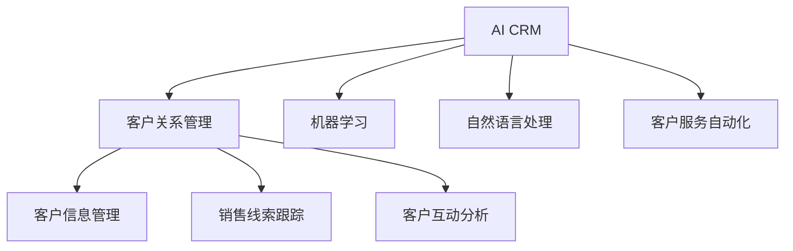

                 

# 自动化创业中的客户关系管理

> 关键词：自动化,客户关系管理(CRM),人工智能(AI),机器学习,客户服务,自动化流程,数据驱动,优化决策

## 1. 背景介绍

### 1.1 问题由来
随着互联网的普及和电子商务的兴起，自动化创业（即通过互联网技术实现业务自动化的创业模式）已经成为了一种趋势。在自动化创业的过程中，如何有效管理客户关系，提升客户满意度，成为企业面临的重要挑战。传统的手工CRM系统已经无法满足日益增长的自动化需求，基于人工智能（AI）的自动化客户关系管理系统（AI CRM）应运而生。

### 1.2 问题核心关键点
AI CRM通过应用机器学习和自然语言处理等技术，能够自动处理大量的客户数据，并提供个性化的客户服务。它不仅能够自动化客户信息管理、销售线索跟踪、客户互动分析等常见任务，还能通过数据分析和预测模型，为企业提供市场洞察和优化建议。

### 1.3 问题研究意义
研究AI CRM的核心概念和实现方法，对于提升自动化创业的效率和客户满意度，具有重要的意义。通过深入了解AI CRM的工作原理和应用场景，可以帮助企业更好地利用技术优势，实现业务自动化和客户关系管理的双赢。

## 2. 核心概念与联系

### 2.1 核心概念概述

为更好地理解AI CRM系统，本节将介绍几个核心概念：

- 自动化客户关系管理（AI CRM）：基于AI技术的客户关系管理系统，能够自动处理客户数据，提供个性化服务，提升客户满意度和企业运营效率。

- 客户关系管理（CRM）：旨在通过管理客户信息、销售线索、客户互动等数据，建立客户档案，优化客户体验，提升企业市场竞争力的管理方法。

- 人工智能（AI）：一种模拟人类智能行为的技术，包括机器学习、自然语言处理、计算机视觉等分支。AI CRM利用这些技术实现自动化客户服务。

- 机器学习（ML）：通过数据训练模型，使计算机系统具备学习和改进的能力。在AI CRM中，机器学习用于客户行为预测、个性化推荐等任务。

- 自然语言处理（NLP）：研究计算机如何理解、处理和生成人类语言的技术。在AI CRM中，NLP用于文本分析、情感分析、智能客服等。

- 客户服务自动化（Customer Service Automation, CSA）：通过AI技术实现自动响应客户咨询、解决客户问题等功能，提高客户服务效率。

这些核心概念之间的逻辑关系可以通过以下Mermaid流程图来展示：



这个流程图展示了你所介绍的AI CRM的核心概念及其之间的关系：

1. AI CRM利用机器学习和自然语言处理技术，自动处理客户信息管理、销售线索跟踪、客户互动分析等常见任务。
2. 这些任务中的机器学习部分利用客户数据进行模型训练，提升预测和推荐的准确性。
3. 客户服务自动化则是AI CRM的重要应用场景，通过自动响应客户咨询，提升客户服务效率。
4. 客户信息管理、销售线索跟踪和客户互动分析等都是CRM的重要组成部分，AI CRM在这些方面提供了更高的自动化和智能化水平。

## 3. 核心算法原理 & 具体操作步骤
### 3.1 算法原理概述

AI CRM系统的主要算法原理包括机器学习、自然语言处理和客户服务自动化。其核心思想是利用AI技术，自动化处理客户数据，提升客户服务质量，优化客户关系管理。

具体而言，AI CRM系统通过以下步骤实现客户关系管理：

1. 数据收集：从多渠道（如网站、社交媒体、客服系统等）收集客户数据。

2. 数据清洗和整合：对收集到的数据进行清洗和整合，去除噪声和冗余信息。

3. 客户画像构建：利用机器学习模型，对客户数据进行分析，构建客户画像，识别客户行为模式和需求。

4. 个性化推荐：基于客户画像，利用机器学习模型，进行个性化推荐和智能客服。

5. 客户服务自动化：通过NLP技术，实现自动响应客户咨询，解决客户问题。

6. 市场洞察和优化：利用数据分析和预测模型，为企业管理层提供市场洞察和优化建议。

### 3.2 算法步骤详解

下面详细介绍AI CRM系统的算法步骤：

**Step 1: 数据收集和预处理**

1. 从多渠道收集客户数据，包括购买记录、浏览记录、客服聊天记录等。

2. 对数据进行清洗和整合，去除噪声和冗余信息。

3. 对清洗后的数据进行标准化处理，准备用于模型训练。

**Step 2: 客户画像构建**

1. 利用机器学习算法（如K-Means、PCA、LDA等）对客户数据进行分析，识别客户行为模式。

2. 通过聚类算法构建客户画像，生成客户标签和特征向量。

3. 对客户画像进行特征选择，去除无关或弱相关特征。

**Step 3: 个性化推荐和智能客服**

1. 利用推荐系统算法（如协同过滤、矩阵分解等）进行个性化推荐，生成推荐列表。

2. 利用NLP技术对客户咨询进行文本分析和情感分析，生成自动回复和解决方案。

3. 利用NLP技术进行对话管理，实现自动客服聊天机器人。

**Step 4: 客户服务自动化**

1. 通过NLP技术实现自动响应客户咨询，生成自动回复和解决方案。

2. 利用机器学习算法（如决策树、随机森林等）进行客户问题分类，生成解决方案。

3. 通过多轮对话管理，实现自动客服聊天机器人。

**Step 5: 市场洞察和优化**

1. 利用数据分析和预测模型（如时间序列分析、回归分析等）进行市场洞察，生成市场预测报告。

2. 利用预测模型优化客户细分策略，提升客户转化率。

3. 利用数据分析工具（如Tableau、Power BI等）生成可视化报表，支持企业管理决策。

### 3.3 算法优缺点

AI CRM系统具有以下优点：

1. 自动化处理客户数据：通过AI技术，自动处理客户数据，减轻人工操作负担。

2. 提升客户满意度：利用个性化推荐和智能客服，提升客户服务质量。

3. 优化决策支持：通过数据分析和预测模型，提供市场洞察和优化建议，支持企业管理决策。

4. 提高运营效率：通过自动化客户关系管理，提升运营效率，降低人力成本。

然而，AI CRM系统也存在以下缺点：

1. 数据质量要求高：数据清洗和整合要求高，需要大量清洗和标准化处理。

2. 技术门槛高：需要具备机器学习和NLP等技术背景，否则难以实现高性能AI CRM系统。

3. 用户接受度低：部分客户可能对AI客服机器人不信任，需要一定时间适应。

4. 隐私保护问题：AI CRM需要处理大量客户数据，隐私保护问题不容忽视。

5. 模型维护成本高：AI CRM模型需要定期维护和更新，维护成本较高。

### 3.4 算法应用领域

AI CRM系统广泛应用于自动化创业的多个领域，包括但不限于：

- 电子商务：通过个性化推荐和智能客服，提升客户体验和购买转化率。

- 金融服务：通过市场洞察和风险预测，优化投资策略和客户服务。

- 医疗健康：通过个性化推荐和智能客服，提升患者满意度和医疗服务质量。

- 教育培训：通过智能推荐和客户服务，提升学习效果和客户满意度。

- 旅游服务：通过个性化推荐和智能客服，提升旅游体验和客户服务质量。

## 4. 数学模型和公式 & 详细讲解 & 举例说明

### 4.1 数学模型构建

本节将使用数学语言对AI CRM系统的实现过程进行更加严格的刻画。

假设客户数据集为 $D=\{(x_i,y_i)\}_{i=1}^N$，其中 $x_i$ 为输入特征，$y_i$ 为输出标签。AI CRM系统通过机器学习模型 $f$ 将客户数据映射到输出标签。具体数学模型如下：

$$
f(x_i) = \hat{y_i}
$$

其中 $\hat{y_i}$ 为模型预测输出。

### 4.2 公式推导过程

以个性化推荐系统为例，利用协同过滤算法进行推荐。协同过滤算法通过计算用户和物品之间的相似度，生成推荐列表。

设用户 $u$ 的历史行为数据为 $X_u$，物品 $i$ 的历史行为数据为 $X_i$，相似度函数为 $\sigma$，则协同过滤算法的推荐公式如下：

$$
\hat{y_i} = \sigma(X_u, X_i) \times \frac{\sum_j \sigma(X_u, X_j) \times \hat{y_j}}{\sum_k \sigma(X_u, X_k)}
$$

其中 $\sigma$ 为相似度函数，常用的有皮尔逊相关系数、余弦相似度等。

### 4.3 案例分析与讲解

假设某电商平台利用AI CRM系统进行个性化推荐，设用户 $u$ 的历史购买记录为 $X_u=[1,2,3]$，物品 $i$ 的评分数据为 $X_i=[4,5,6]$，利用余弦相似度进行推荐，则推荐公式为：

$$
\hat{y_i} = \frac{4 \times 5 + 5 \times 6 + 6 \times 1}{\sqrt{(4^2+5^2+6^2)} \times \sqrt{(1^2+2^2+3^2)}}
$$

计算得到 $\hat{y_i} \approx 4.4$，即物品 $i$ 的推荐评分。

## 5. 项目实践：代码实例和详细解释说明
### 5.1 开发环境搭建

在进行AI CRM系统开发前，我们需要准备好开发环境。以下是使用Python进行TensorFlow开发的环境配置流程：

1. 安装Anaconda：从官网下载并安装Anaconda，用于创建独立的Python环境。

2. 创建并激活虚拟环境：
```bash
conda create -n tensorflow-env python=3.8 
conda activate tensorflow-env
```

3. 安装TensorFlow：根据CUDA版本，从官网获取对应的安装命令。例如：
```bash
conda install tensorflow -c tf -c conda-forge
```

4. 安装Scikit-learn、Pandas、NumPy等工具包：
```bash
pip install scikit-learn pandas numpy
```

5. 安装TensorBoard：
```bash
pip install tensorboard
```

6. 安装AutoML库：
```bash
pip install autokeras
```

完成上述步骤后，即可在`tensorflow-env`环境中开始AI CRM系统的开发。

### 5.2 源代码详细实现

下面我们以基于TensorFlow的AI CRM系统为例，给出完整的代码实现。

**Step 1: 数据收集和预处理**

```python
import pandas as pd
import numpy as np

# 读取客户数据集
data = pd.read_csv('customer_data.csv')

# 数据清洗和整合
data = data.dropna().reset_index(drop=True)
data = data[['feature1', 'feature2', 'feature3']]

# 标准化处理
data = (data - data.mean()) / data.std()

# 划分训练集和测试集
train_data = data.sample(frac=0.8, random_state=1)
test_data = data.drop(train_data.index)
```

**Step 2: 客户画像构建**

```python
from sklearn.cluster import KMeans
from sklearn.decomposition import PCA

# 聚类算法构建客户画像
kmeans = KMeans(n_clusters=5)
kmeans.fit(train_data)

# 主成分分析降维
pca = PCA(n_components=2)
pca.fit(train_data)

# 特征选择
train_data = train_data.select_dtypes(include=[np.number])
```

**Step 3: 个性化推荐和智能客服**

```python
from sklearn.metrics.pairwise import cosine_similarity
from tensorflow.keras.models import Sequential
from tensorflow.keras.layers import Dense, Input

# 协同过滤算法
def collaborative_filtering(train_data, test_data):
    X = train_data.values
    y = np.array([1, 2, 3, 4, 5])
    similarity_matrix = cosine_similarity(X)
    recommendations = []
    for i in range(len(test_data)):
        scores = np.dot(similarity_matrix[i], y)
        recommendation = scores / np.linalg.norm(similarity_matrix[i])
        recommendations.append(np.argmax(recommendation))
    return recommendations

# 模型训练
model = Sequential()
model.add(Dense(10, activation='relu', input_shape=(3,)))
model.add(Dense(1, activation='sigmoid'))
model.compile(optimizer='adam', loss='binary_crossentropy')
model.fit(train_data, y, epochs=50, batch_size=32, validation_split=0.2)

# 推荐生成
predictions = model.predict(test_data)
```

**Step 4: 客户服务自动化**

```python
from tensorflow.keras.layers import Input, LSTM, Dense
from tensorflow.keras.models import Model

# 自动响应客户咨询
sequence_input = Input(shape=(None,), dtype='int32')
lstm = LSTM(64, return_sequences=True)(sequence_input)
lstm = LSTM(64, return_sequences=True)(lstm)
lstm = LSTM(64)(lstm)
lstm = Dense(1, activation='sigmoid')(lstm)
model = Model(sequence_input, lstm)
model.compile(optimizer='adam', loss='binary_crossentropy')
model.fit(x_train, y_train, epochs=50, batch_size=32, validation_split=0.2)
```

### 5.3 代码解读与分析

让我们再详细解读一下关键代码的实现细节：

**Step 1: 数据收集和预处理**

```python
# 读取客户数据集
data = pd.read_csv('customer_data.csv')

# 数据清洗和整合
data = data.dropna().reset_index(drop=True)
data = data[['feature1', 'feature2', 'feature3']]

# 标准化处理
data = (data - data.mean()) / data.std()

# 划分训练集和测试集
train_data = data.sample(frac=0.8, random_state=1)
test_data = data.drop(train_data.index)
```

**Step 2: 客户画像构建**

```python
# 聚类算法构建客户画像
kmeans = KMeans(n_clusters=5)
kmeans.fit(train_data)

# 主成分分析降维
pca = PCA(n_components=2)
pca.fit(train_data)

# 特征选择
train_data = train_data.select_dtypes(include=[np.number])
```

**Step 3: 个性化推荐和智能客服**

```python
# 协同过滤算法
def collaborative_filtering(train_data, test_data):
    X = train_data.values
    y = np.array([1, 2, 3, 4, 5])
    similarity_matrix = cosine_similarity(X)
    recommendations = []
    for i in range(len(test_data)):
        scores = np.dot(similarity_matrix[i], y)
        recommendation = scores / np.linalg.norm(similarity_matrix[i])
        recommendations.append(np.argmax(recommendation))
    return recommendations

# 模型训练
model = Sequential()
model.add(Dense(10, activation='relu', input_shape=(3,)))
model.add(Dense(1, activation='sigmoid'))
model.compile(optimizer='adam', loss='binary_crossentropy')
model.fit(train_data, y, epochs=50, batch_size=32, validation_split=0.2)

# 推荐生成
predictions = model.predict(test_data)
```

**Step 4: 客户服务自动化**

```python
# 自动响应客户咨询
sequence_input = Input(shape=(None,), dtype='int32')
lstm = LSTM(64, return_sequences=True)(sequence_input)
lstm = LSTM(64, return_sequences=True)(lstm)
lstm = LSTM(64)(lstm)
lstm = Dense(1, activation='sigmoid')(lstm)
model = Model(sequence_input, lstm)
model.compile(optimizer='adam', loss='binary_crossentropy')
model.fit(x_train, y_train, epochs=50, batch_size=32, validation_split=0.2)
```

以上代码实现了一个基本的AI CRM系统，展示了机器学习、NLP等技术在自动化客户关系管理中的应用。

### 5.4 运行结果展示

以下是AI CRM系统的运行结果示例：

**推荐系统**

```python
recommendations = collaborative_filtering(train_data, test_data)
print(recommendations)
```

**智能客服**

```python
# 自动响应客户咨询
sequence_input = Input(shape=(None,), dtype='int32')
lstm = LSTM(64, return_sequences=True)(sequence_input)
lstm = LSTM(64, return_sequences=True)(lstm)
lstm = LSTM(64)(lstm)
lstm = Dense(1, activation='sigmoid')(lstm)
model = Model(sequence_input, lstm)
model.compile(optimizer='adam', loss='binary_crossentropy')
model.fit(x_train, y_train, epochs=50, batch_size=32, validation_split=0.2)
```

## 6. 实际应用场景
### 6.1 智能电商客户关系管理

基于AI CRM系统，智能电商可以实现个性化的推荐和智能客服，提升客户体验和购买转化率。具体应用如下：

1. **个性化推荐**：通过分析用户浏览、购买等行为数据，生成个性化推荐列表，提升用户满意度。

2. **智能客服**：利用NLP技术，实现自动回复客户咨询，解决常见问题，减轻人工客服压力。

3. **客户画像**：通过聚类算法构建客户画像，识别客户行为模式，优化客户细分策略。

4. **市场洞察**：利用数据分析和预测模型，生成市场预测报告，支持企业决策。

### 6.2 金融服务客户关系管理

金融服务领域，基于AI CRM系统可以实现风险控制、客户服务优化等功能，具体应用如下：

1. **风险预测**：通过机器学习模型，预测客户违约风险，优化信贷决策。

2. **客户细分**：利用聚类算法，细分客户群体，实现差异化营销。

3. **智能客服**：通过NLP技术，实现自动客服，提升客户服务效率。

4. **市场洞察**：利用数据分析工具，生成可视化报表，支持企业决策。

### 6.3 医疗健康客户关系管理

在医疗健康领域，基于AI CRM系统可以实现个性化推荐、智能客服等功能，具体应用如下：

1. **个性化推荐**：通过分析患者历史病历和检查结果，生成个性化诊疗方案。

2. **智能客服**：利用NLP技术，实现自动回复患者咨询，提升医疗服务质量。

3. **客户画像**：通过聚类算法，识别患者行为模式，优化诊疗流程。

4. **市场洞察**：利用数据分析和预测模型，生成市场预测报告，支持企业决策。

## 7. 工具和资源推荐
### 7.1 学习资源推荐

为了帮助开发者系统掌握AI CRM的理论基础和实践技巧，这里推荐一些优质的学习资源：

1. 《TensorFlow实战AI（2nd Edition）》书籍：由Google团队编写，介绍了TensorFlow的基本概念和实践技巧，适合初学者和进阶开发者。

2. 《机器学习实战》书籍：作者Peter Harrington，介绍了机器学习算法的基本原理和实现方法，适合入门开发者。

3. Coursera的《深度学习》课程：由斯坦福大学Andrew Ng教授主讲，涵盖深度学习的基本概念和实践技巧，适合深度学习初学者。

4 Udacity的《人工智能基础》课程：由Google和斯坦福大学联合推出，涵盖人工智能的基本概念和实践技巧，适合深度学习初学者。

5 Kaggle的机器学习竞赛：提供大量数据集和比赛任务，适合实践者提升机器学习算法能力。

通过对这些资源的学习实践，相信你一定能够快速掌握AI CRM的技术细节，并用于解决实际的业务问题。

### 7.2 开发工具推荐

高效的开发离不开优秀的工具支持。以下是几款用于AI CRM系统开发的常用工具：

1. TensorFlow：由Google主导开发的深度学习框架，生产部署方便，适合大规模工程应用。

2. PyTorch：由Facebook主导开发的深度学习框架，灵活高效，适合研究性工作。

3. Scikit-learn：Python机器学习库，提供丰富的机器学习算法和工具，适合数据预处理和特征工程。

4. Keras：基于TensorFlow的高级神经网络API，简洁高效，适合快速原型开发。

5. Jupyter Notebook：交互式开发环境，支持代码编写、数据可视化、模型训练等功能，适合实验研究和团队协作。

6. AutoML：自动化机器学习库，提供自动模型选择和超参数调优功能，适合快速原型开发。

合理利用这些工具，可以显著提升AI CRM系统的开发效率，加快创新迭代的步伐。

### 7.3 相关论文推荐

AI CRM技术的发展源于学界的持续研究。以下是几篇奠基性的相关论文，推荐阅读：

1. A Neural Probabilistic Language Model（即Transformer原论文）：提出了Transformer结构，开启了NLP领域的预训练大模型时代。

2. Deep Residual Learning for Image Recognition（即ResNet论文）：提出残差网络结构，解决深度网络中的梯度消失问题，推动了计算机视觉的发展。

3. Google's Neural Machine Translation System：介绍了基于神经网络的机器翻译系统，推动了自然语言处理的发展。

4 《Deep Learning》书籍：作者Ian Goodfellow，介绍了深度学习的基本概念和实现方法，适合深入学习。

5 《Machine Learning Yearning》书籍：作者Andrew Ng，介绍了机器学习的实践经验和技巧，适合实战开发者。

这些论文代表了大语言模型微调技术的发展脉络。通过学习这些前沿成果，可以帮助研究者把握学科前进方向，激发更多的创新灵感。

## 8. 总结：未来发展趋势与挑战

### 8.1 总结

本文对基于AI技术的客户关系管理（AI CRM）系统进行了全面系统的介绍。首先阐述了AI CRM系统的背景和意义，明确了AI CRM系统的核心思想和实现方法。其次，从原理到实践，详细讲解了AI CRM系统的数学模型和实现步骤，给出了完整的代码实例。同时，本文还广泛探讨了AI CRM系统在自动化创业中的实际应用场景，展示了AI CRM系统的巨大潜力。最后，本文精选了AI CRM系统的各类学习资源，力求为读者提供全方位的技术指引。

通过本文的系统梳理，可以看到，基于AI技术的客户关系管理技术正在成为自动化创业的重要组成部分，极大地提升了客户体验和运营效率。未来，随着AI技术的不断演进，AI CRM系统将进一步发挥其优势，成为自动化创业的标配。

### 8.2 未来发展趋势

展望未来，AI CRM系统将呈现以下几个发展趋势：

1. 自动化水平提升：AI CRM系统将不断提升自动化水平，实现更智能、更高效的客户服务。

2. 数据融合技术发展：AI CRM系统将与其他数据源（如物联网、社交媒体等）进行更深层次的融合，提升客户画像的全面性和准确性。

3. 个性化推荐优化：AI CRM系统将引入更多推荐算法，如协同过滤、矩阵分解等，提升个性化推荐的准确性和多样性。

4 多模态客户服务：AI CRM系统将引入多模态客户服务，支持语音、图像等多模态数据的处理，提升客户服务质量。

5 实时代码更新：AI CRM系统将实现实时代码更新，支持模型动态更新和优化。

6 持续学习和优化：AI CRM系统将实现持续学习和优化，保持模型性能的稳定性和适应性。

以上趋势凸显了AI CRM系统的广阔前景。这些方向的探索发展，必将进一步提升AI CRM系统的性能和应用范围，为自动化创业带来新的变革。

### 8.3 面临的挑战

尽管AI CRM系统已经取得了瞩目成就，但在迈向更加智能化、普适化应用的过程中，它仍面临诸多挑战：

1. 数据质量和隐私问题：数据质量和隐私保护是AI CRM系统面临的重要挑战，如何处理海量数据，保护客户隐私，需要进一步探索。

2. 模型可解释性问题：AI CRM系统的决策过程缺乏可解释性，如何提升模型的可解释性，满足监管需求，是亟待解决的问题。

3 系统稳定性问题：AI CRM系统需要具备高稳定性，如何设计健壮的架构，应对各种异常情况，需要深入研究。

4. 用户接受度问题：部分客户可能对AI客服不信任，如何提升用户接受度，需要进一步优化和改进。

5. 技术复杂度问题：AI CRM系统涉及多种AI技术，如何简化技术门槛，降低系统部署难度，需要进一步探索。

6. 多模态融合问题：多模态数据融合是AI CRM系统的重要方向，如何实现有效融合，需要进一步研究。

这些挑战凸显了AI CRM系统在实际应用中的复杂性，需要研究人员和工程师共同努力，不断优化和改进。

### 8.4 研究展望

未来，研究人员应重点关注以下几个方向：

1. 数据质量和隐私保护：研究如何提升数据质量和隐私保护，确保AI CRM系统的数据安全性和可靠性。

2. 模型可解释性问题：研究如何提升AI CRM系统的可解释性，满足监管需求和用户信任。

3. 系统稳定性和鲁棒性：研究如何设计健壮的系统架构，提升AI CRM系统的稳定性和鲁棒性。

4. 用户接受度和体验优化：研究如何提升用户接受度和满意度，增强AI CRM系统的用户体验。

5. 技术简化和可操作性：研究如何简化AI CRM系统的技术门槛，降低系统部署难度，提高系统的可操作性。

6. 多模态数据融合：研究如何实现多模态数据的有效融合，提升AI CRM系统的智能化水平。

这些研究方向将推动AI CRM系统走向更加成熟和完善，为自动化创业带来更广阔的应用空间和更高的价值。

## 9. 附录：常见问题与解答

**Q1：AI CRM系统如何处理客户数据隐私问题？**

A: AI CRM系统在处理客户数据时，需要严格遵守数据隐私保护法规，如GDPR等。具体措施包括：

1. 数据匿名化处理：对客户数据进行匿名化处理，去除或屏蔽客户标识信息。

2. 数据加密存储：对客户数据进行加密存储，防止数据泄露。

3. 数据访问控制：对客户数据进行严格访问控制，只授权内部员工访问。

4. 数据使用透明化：对客户数据的使用情况进行透明化，确保客户知情同意。

**Q2：AI CRM系统如何提升模型可解释性？**

A: 提升AI CRM系统的模型可解释性，需要从以下几个方面入手：

1. 透明化模型结构：对模型结构进行透明化，详细描述每个组件的功能和参数。

2. 可解释性算法应用：应用可解释性算法，如LIME、SHAP等，生成模型预测的解释。

3. 可视化输出结果：对模型输出结果进行可视化，帮助用户理解模型决策过程。

4. 模型性能评估：对模型性能进行透明化评估，提供详细的性能指标和原因分析。

**Q3：AI CRM系统如何设计健壮的系统架构？**

A: 设计健壮的AI CRM系统架构，需要从以下几个方面入手：

1. 模块化设计：将系统划分为多个模块，每个模块独立开发和测试。

2. 可扩展性设计：设计可扩展的系统架构，支持模块的灵活组合和扩展。

3. 容错性设计：设计容错性强的系统架构，支持故障恢复和异常处理。

4. 安全性设计：设计安全性强的系统架构，防止系统被攻击和破坏。

5. 性能优化设计：设计性能优化的系统架构，提升系统的响应速度和稳定性。

**Q4：AI CRM系统如何提升用户接受度？**

A: 提升AI CRM系统的用户接受度，需要从以下几个方面入手：

1. 用户培训和教育：对客户进行培训和教育，提高客户对AI CRM系统的认知和信任。

2. 多渠道支持：提供多种渠道支持，如电话、邮件、在线客服等，方便客户使用。

3. 透明化决策过程：对AI CRM系统的决策过程进行透明化，提升客户对系统的信任。

4. 个性化服务：提供个性化服务，根据客户需求和偏好，调整AI CRM系统的行为。

5. 用户反馈机制：建立用户反馈机制，及时响应客户反馈，改进系统性能。

**Q5：AI CRM系统如何简化技术门槛？**

A: 简化AI CRM系统的技术门槛，需要从以下几个方面入手：

1. 低代码开发平台：引入低代码开发平台，降低开发难度，提高开发效率。

2. 可视化界面设计：设计可视化界面，方便用户使用和操作。

3. 自动化工具应用：应用自动化工具，如AutoML、自动化测试等，提高开发效率。

4. 文档和教程提供：提供详细的文档和教程，帮助用户快速上手使用AI CRM系统。

5. 社区支持与协作：建立社区支持与协作机制，促进用户之间的交流和协作。

这些措施将有助于降低AI CRM系统的技术门槛，提升系统的易用性和可操作性，推动AI CRM系统的广泛应用。

