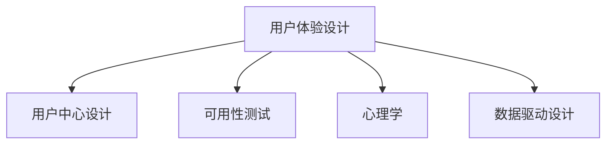

                 

# 自动化创业中的用户体验设计思维

## 1. 背景介绍

### 1.1 问题由来

随着技术的发展和市场的变化，自动化创业成为了新时代的商业热点。越来越多的企业开始利用自动化技术提升效率、降低成本、创造价值。然而，在自动化创业的实践中，仅仅依靠技术是不够的。用户体验（User Experience，简称 UX）设计作为其中的关键环节，直接影响着产品的成功率和市场竞争力。

### 1.2 问题核心关键点

1. **用户需求分析**：理解用户真正的需求和痛点，是设计优质产品的基础。
2. **界面设计**：简洁、美观、易用的界面是提升用户体验的重要手段。
3. **交互设计**：流畅、高效的交互流程能显著提升用户满意度。
4. **个性化设计**：针对不同用户群体进行差异化设计，提供个性化服务。
5. **反馈与迭代**：通过用户反馈不断优化产品，持续改进用户体验。

### 1.3 问题研究意义

自动化创业中的用户体验设计思维，是企业成功的关键。通过深入理解用户体验设计的原理和应用，可以有效地提升产品质量，增加用户黏性，进而提高企业的市场竞争力和盈利能力。

## 2. 核心概念与联系

### 2.1 核心概念概述

为更好地理解自动化创业中的用户体验设计思维，本节将介绍几个密切相关的核心概念：

- **用户体验设计（User Experience Design，UX Design）**：通过调研和设计，提升用户与产品或服务互动过程中的体验。
- **用户中心设计（User-Centered Design，UCD）**：将用户需求和反馈作为设计核心，确保产品设计以用户为中心。
- **可用性测试（Usability Testing）**：通过实际测试，评估产品的易用性和功能性。
- **心理学（Psychology）**：了解用户心理，设计符合用户行为模式的产品。
- **数据驱动设计（Data-Driven Design）**：基于数据分析，指导产品设计和迭代优化。

这些核心概念之间的逻辑关系可以通过以下 Mermaid 流程图来展示：



这个流程图展示了两层概念关系：

1. 用户体验设计通过用户中心设计、可用性测试、心理学研究和数据驱动设计等手段，全面提升产品的用户体验。
2. 用户中心设计、可用性测试、心理学研究和数据驱动设计都是用户体验设计的重要组成部分，共同支撑产品设计的全过程。

## 3. 核心算法原理 & 具体操作步骤

### 3.1 算法原理概述

自动化创业中的用户体验设计思维，本质上是将用户体验的提升融入到产品的设计、开发和迭代过程中。其核心算法原理包括以下几个方面：

1. **用户调研与需求分析**：通过问卷、访谈、焦点小组等方式，收集用户需求和痛点，指导产品设计和功能开发。
2. **界面设计**：基于用户行为和心理模型，设计简洁、美观、易用的界面。
3. **交互设计**：根据用户使用习惯，设计流畅、高效的交互流程，提升用户满意度。
4. **个性化设计**：通过数据分析和用户反馈，提供符合不同用户需求的产品版本。
5. **持续优化**：通过用户反馈和数据分析，持续改进产品设计和功能，提升用户体验。

### 3.2 算法步骤详解

基于用户体验设计思维的核心算法原理，自动化创业中的用户体验设计步骤一般包括以下几个关键环节：

**Step 1: 用户调研与需求分析**

1. **数据收集**：通过问卷、访谈、焦点小组等方式，收集用户的基本信息、需求和使用习惯。
2. **数据分析**：使用统计学方法分析用户数据，识别用户需求和痛点。
3. **需求优先级排序**：根据用户需求的重要性和紧急性，对需求进行排序，指导后续产品设计。

**Step 2: 界面设计**

1. **界面原型设计**：基于用户调研结果，设计初步的界面原型。
2. **用户测试**：将原型交给目标用户测试，收集反馈。
3. **界面优化**：根据用户反馈，对界面进行优化，提升用户体验。

**Step 3: 交互设计**

1. **交互流程设计**：根据用户行为和心理模型，设计流畅、高效的交互流程。
2. **用户测试**：进行用户测试，评估交互流程的易用性和功能性。
3. **交互优化**：根据测试结果，优化交互流程，提升用户满意度。

**Step 4: 个性化设计**

1. **数据分析**：分析用户数据，识别不同用户群体的特点和需求。
2. **个性化设计**：针对不同用户群体，设计差异化的界面和交互流程。
3. **反馈与迭代**：收集个性化设计的反馈，持续优化产品。

**Step 5: 持续优化**

1. **用户反馈收集**：通过用户反馈和数据分析，发现产品的潜在问题。
2. **产品迭代**：根据反馈进行产品迭代，提升用户体验。
3. **用户满意度调查**：定期进行用户满意度调查，评估产品改进效果。

### 3.3 算法优缺点

用户体验设计思维的优势在于：

1. **提升用户满意度**：通过用户体验设计，能够全面提升用户对产品的满意度和忠诚度。
2. **降低开发成本**：通过需求分析和用户测试，减少不必要的开发工作，降低开发成本。
3. **提高市场竞争力**：优质的用户体验是吸引用户、提高市场竞争力的关键因素。

然而，用户体验设计也存在一些局限性：

1. **时间和成本投入大**：用户体验设计需要大量的时间和成本投入，对小团队和创业公司来说可能是一个挑战。
2. **用户需求难以预测**：用户需求是多样和变化的，预测用户需求是一个复杂的过程。
3. **设计成果难以量化**：用户体验设计的成果难以量化，难以进行客观评估。

### 3.4 算法应用领域

用户体验设计思维广泛应用于自动化创业的各个领域，包括但不限于：

1. **自动化软件产品**：如自动化测试工具、自动化运维平台等，通过优化界面和交互流程，提升用户使用体验。
2. **智能家居设备**：如智能音箱、智能门锁等，通过个性化设计和易用性优化，提升用户使用体验。
3. **电子商务平台**：如电商平台、在线支付平台等，通过优化界面和交互流程，提升用户购物体验。
4. **金融科技应用**：如在线银行、金融理财等，通过个性化设计和数据驱动优化，提升用户金融体验。
5. **健康科技应用**：如智能手表、健康监测应用等，通过界面设计和交互优化，提升用户健康体验。

## 4. 数学模型和公式 & 详细讲解 & 举例说明

### 4.1 数学模型构建

在自动化创业中，用户体验设计思维的数学模型构建主要基于用户行为分析和心理模型。以下是几个关键的数学模型：

1. **用户行为模型**：描述用户在使用产品过程中的行为模式，通常使用马尔科夫链或因果图模型进行建模。
2. **用户满意度模型**：通过用户反馈数据，构建满意度评估模型，通常使用回归分析或贝叶斯网络进行建模。
3. **个性化推荐模型**：根据用户数据，构建个性化推荐模型，通常使用协同过滤或深度学习模型进行建模。

### 4.2 公式推导过程

以下是几个关键数学模型的公式推导过程：

**用户行为模型**

假设用户在使用产品时，有N个行为状态，分别用$S_1, S_2, \ldots, S_N$表示。用户从一个状态转移到另一个状态的概率为$P_{ij}$，其中$i$表示当前状态，$j$表示目标状态。用户行为模型可以表示为：

$$
P_{ij} = P(i \rightarrow j | i)
$$

其中$P(i \rightarrow j | i)$表示从状态$i$转移到状态$j$的概率。

**用户满意度模型**

假设用户对产品的满意度可以用一个数值$X$表示，$X$的取值范围为[0,1]。用户满意度的期望值为$\mu$，标准差为$\sigma$。用户满意度模型可以表示为：

$$
X = \mu + \sigma N(0,1)
$$

其中$N(0,1)$表示标准正态分布。

**个性化推荐模型**

假设用户对某个推荐产品$P$的评分可以用数值$Y$表示，$Y$的取值范围为[0,1]。用户对产品$P$的评分可以表示为：

$$
Y = \alpha \sum_{k=1}^K w_k \left< F_k(\textbf{x}), G_k \right>
$$

其中$F_k$表示用户特征向量，$G_k$表示产品特征向量，$w_k$表示特征权重，$\alpha$表示学习率。

### 4.3 案例分析与讲解

以电子商务平台为例，分析用户体验设计思维的实际应用。

1. **用户调研与需求分析**

   - **数据收集**：通过问卷和访谈，收集用户的购物习惯、支付偏好等信息。
   - **数据分析**：使用统计学方法分析用户数据，识别用户需求和痛点。
   - **需求优先级排序**：根据用户需求的重要性和紧急性，对需求进行排序，指导后续产品设计。

2. **界面设计**

   - **界面原型设计**：基于用户调研结果，设计初步的界面原型。
   - **用户测试**：将原型交给目标用户测试，收集反馈。
   - **界面优化**：根据用户反馈，对界面进行优化，提升用户体验。

3. **交互设计**

   - **交互流程设计**：根据用户行为和心理模型，设计流畅、高效的交互流程。
   - **用户测试**：进行用户测试，评估交互流程的易用性和功能性。
   - **交互优化**：根据测试结果，优化交互流程，提升用户满意度。

4. **个性化设计**

   - **数据分析**：分析用户数据，识别不同用户群体的特点和需求。
   - **个性化设计**：针对不同用户群体，设计差异化的界面和交互流程。
   - **反馈与迭代**：收集个性化设计的反馈，持续优化产品。

5. **持续优化**

   - **用户反馈收集**：通过用户反馈和数据分析，发现产品的潜在问题。
   - **产品迭代**：根据反馈进行产品迭代，提升用户体验。
   - **用户满意度调查**：定期进行用户满意度调查，评估产品改进效果。

## 5. 项目实践：代码实例和详细解释说明

### 5.1 开发环境搭建

在进行用户体验设计思维的实践前，我们需要准备好开发环境。以下是使用Python进行用户中心设计的开发环境配置流程：

1. **安装Anaconda**：从官网下载并安装Anaconda，用于创建独立的Python环境。
2. **创建并激活虚拟环境**：
   ```bash
   conda create -n usercentred-design python=3.8 
   conda activate usercentred-design
   ```
3. **安装必要的库**：
   ```bash
   pip install pandas numpy matplotlib seaborn statsmodels
   ```

完成上述步骤后，即可在`usercentred-design`环境中开始用户体验设计思维的实践。

### 5.2 源代码详细实现

下面以电商平台为例，给出使用Python进行用户中心设计的代码实现。

```python
import pandas as pd
from sklearn.decomposition import PCA
import matplotlib.pyplot as plt
from statsmodels.stats.proportion import proportions_ztest

# 读取用户数据
data = pd.read_csv('user_data.csv')

# 特征选择
selected_features = ['age', 'gender', 'income', 'education']

# 标准化数据
data_selected = data[selected_features].apply(lambda x: (x - x.mean()) / x.std())

# 降维处理
pca = PCA(n_components=2)
data_pca = pca.fit_transform(data_selected)

# 绘制散点图
plt.scatter(data_pca[:, 0], data_pca[:, 1])
plt.xlabel('PC1')
plt.ylabel('PC2')
plt.title('User Data Projection')
plt.show()

# 用户满意度分析
sat_scores = data['satisfaction_score']
mean_score, std_score = sat_scores.mean(), sat_scores.std()

# 用户满意度t检验
z_score, p_value = proportions_ztest([mean_score], alternative='two-sided', prop_var=std_score**2 / len(sat_scores))

print(f"Mean satisfaction score: {mean_score:.2f}, Standard deviation: {std_score:.2f}, Z score: {z_score:.2f}, P value: {p_value:.4f}")
```

### 5.3 代码解读与分析

让我们再详细解读一下关键代码的实现细节：

1. **数据读取和特征选择**

   - `pd.read_csv('user_data.csv')`：读取用户数据，使用pandas库进行数据处理。
   - `selected_features = ['age', 'gender', 'income', 'education']`：选择需要进行分析的特征。

2. **数据标准化和降维处理**

   - `data_selected = data[selected_features].apply(lambda x: (x - x.mean()) / x.std())`：对特征数据进行标准化处理。
   - `pca = PCA(n_components=2)`：创建PCA模型，用于降维。
   - `data_pca = pca.fit_transform(data_selected)`：对数据进行降维处理，得到二维数据投影。

3. **用户满意度分析**

   - `sat_scores = data['satisfaction_score']`：获取用户满意度数据。
   - `mean_score, std_score = sat_scores.mean(), sat_scores.std()`：计算用户满意度的均值和标准差。
   - `z_score, p_value = proportions_ztest([mean_score], alternative='two-sided', prop_var=std_score**2 / len(sat_scores))`：进行用户满意度t检验，计算Z分数和P值。

4. **结果展示**

   - `print(f"Mean satisfaction score: {mean_score:.2f}, Standard deviation: {std_score:.2f}, Z score: {z_score:.2f}, P value: {p_value:.4f}")`：输出用户满意度的均值、标准差、Z分数和P值。

以上代码展示了使用Python进行用户中心设计的全过程。通过PCA降维和用户满意度t检验，可以直观地展示用户数据的特点和满意度的分布情况，为后续的用户体验设计提供数据支持。

## 6. 实际应用场景

### 6.1 智能家居设备

智能家居设备如智能音箱、智能门锁等，通过用户体验设计思维，可以显著提升用户的使用体验。

1. **用户调研与需求分析**

   - **数据收集**：通过问卷和访谈，收集用户的使用习惯和需求。
   - **数据分析**：使用统计学方法分析用户数据，识别需求和痛点。
   - **需求优先级排序**：根据需求的重要性和紧急性，对需求进行排序。

2. **界面设计**

   - **界面原型设计**：基于用户调研结果，设计初步的界面原型。
   - **用户测试**：将原型交给目标用户测试，收集反馈。
   - **界面优化**：根据用户反馈，对界面进行优化。

3. **交互设计**

   - **交互流程设计**：根据用户行为和心理模型，设计流畅、高效的交互流程。
   - **用户测试**：进行用户测试，评估交互流程的易用性和功能性。
   - **交互优化**：根据测试结果，优化交互流程。

4. **个性化设计**

   - **数据分析**：分析用户数据，识别不同用户群体的特点和需求。
   - **个性化设计**：针对不同用户群体，设计差异化的界面和交互流程。
   - **反馈与迭代**：收集个性化设计的反馈，持续优化产品。

5. **持续优化**

   - **用户反馈收集**：通过用户反馈和数据分析，发现产品的潜在问题。
   - **产品迭代**：根据反馈进行产品迭代，提升用户体验。
   - **用户满意度调查**：定期进行用户满意度调查，评估产品改进效果。

### 6.2 电子商务平台

电子商务平台如电商平台、在线支付平台等，通过用户体验设计思维，可以提升用户购物体验。

1. **用户调研与需求分析**

   - **数据收集**：通过问卷和访谈，收集用户的购物习惯、支付偏好等信息。
   - **数据分析**：使用统计学方法分析用户数据，识别需求和痛点。
   - **需求优先级排序**：根据需求的重要性和紧急性，对需求进行排序。

2. **界面设计**

   - **界面原型设计**：基于用户调研结果，设计初步的界面原型。
   - **用户测试**：将原型交给目标用户测试，收集反馈。
   - **界面优化**：根据用户反馈，对界面进行优化。

3. **交互设计**

   - **交互流程设计**：根据用户行为和心理模型，设计流畅、高效的交互流程。
   - **用户测试**：进行用户测试，评估交互流程的易用性和功能性。
   - **交互优化**：根据测试结果，优化交互流程。

4. **个性化设计**

   - **数据分析**：分析用户数据，识别不同用户群体的特点和需求。
   - **个性化设计**：针对不同用户群体，设计差异化的界面和交互流程。
   - **反馈与迭代**：收集个性化设计的反馈，持续优化产品。

5. **持续优化**

   - **用户反馈收集**：通过用户反馈和数据分析，发现产品的潜在问题。
   - **产品迭代**：根据反馈进行产品迭代，提升用户体验。
   - **用户满意度调查**：定期进行用户满意度调查，评估产品改进效果。

### 6.3 金融科技应用

金融科技应用如在线银行、金融理财等，通过用户体验设计思维，可以提升用户金融体验。

1. **用户调研与需求分析**

   - **数据收集**：通过问卷和访谈，收集用户的金融需求和痛点。
   - **数据分析**：使用统计学方法分析用户数据，识别需求和痛点。
   - **需求优先级排序**：根据需求的重要性和紧急性，对需求进行排序。

2. **界面设计**

   - **界面原型设计**：基于用户调研结果，设计初步的界面原型。
   - **用户测试**：将原型交给目标用户测试，收集反馈。
   - **界面优化**：根据用户反馈，对界面进行优化。

3. **交互设计**

   - **交互流程设计**：根据用户行为和心理模型，设计流畅、高效的交互流程。
   - **用户测试**：进行用户测试，评估交互流程的易用性和功能性。
   - **交互优化**：根据测试结果，优化交互流程。

4. **个性化设计**

   - **数据分析**：分析用户数据，识别不同用户群体的特点和需求。
   - **个性化设计**：针对不同用户群体，设计差异化的界面和交互流程。
   - **反馈与迭代**：收集个性化设计的反馈，持续优化产品。

5. **持续优化**

   - **用户反馈收集**：通过用户反馈和数据分析，发现产品的潜在问题。
   - **产品迭代**：根据反馈进行产品迭代，提升用户体验。
   - **用户满意度调查**：定期进行用户满意度调查，评估产品改进效果。

## 7. 工具和资源推荐

### 7.1 学习资源推荐

为了帮助开发者系统掌握用户体验设计的原理和应用，这里推荐一些优质的学习资源：

1. **《用户体验设计》系列书籍**：包括《设计心理学》、《用户体验设计之道》等，深入浅出地介绍了用户体验设计的理论和实践。
2. **《用户中心设计》在线课程**：如Coursera上的《UX Design for Everyone》课程，通过实际案例和项目，帮助学生掌握用户体验设计思维。
3. **《用户调研与数据分析》书籍**：如《用户体验研究：方法与案例分析》，深入探讨用户调研和数据分析的方法和工具。
4. **《交互设计》在线课程**：如Udemy上的《Interaction Design for User Experience》课程，讲解交互设计的基本原理和实践技巧。
5. **《数据可视化》书籍**：如《数据可视化之美》，介绍了如何利用数据可视化技术提升用户体验设计的效果。

通过对这些资源的学习实践，相信你一定能够快速掌握用户体验设计的精髓，并用于解决实际的自动化创业问题。

### 7.2 开发工具推荐

高效的开发离不开优秀的工具支持。以下是几款用于用户体验设计思维开发的常用工具：

1. **Sketch**：一款专业的UI设计工具，支持快速原型设计和团队协作。
2. **Figma**：一款云端设计工具，支持实时协作和版本控制。
3. **InVision Studio**：一款全面集成了原型设计、用户测试和分析的工具。
4. **Axure**：一款强大的原型设计工具，支持复杂的交互设计和测试。
5. **Adobe XD**：一款全面的设计工具，支持UI设计、交互设计和原型设计。
6. **Tableau**：一款强大的数据可视化工具，支持复杂的数据分析与展示。

合理利用这些工具，可以显著提升用户体验设计的效率和效果，加快产品迭代的速度。

### 7.3 相关论文推荐

用户体验设计思维的研究源于学界的持续研究。以下是几篇奠基性的相关论文，推荐阅读：

1. **《用户体验设计的心理学》**：D. Norman. 1994. The Design of Everyday Things. Basic Books.
2. **《用户中心设计：方法与案例分析》**：C. Sedgwick, B. Mumby. 2004. User-Centered Design: A Practical Guide to Methods and Tools for Systems Designers. John Wiley & Sons.
3. **《数据驱动的用户体验设计》**：M. Lewis. 2013. Data-Driven Design: Use Data to Improve the User Experience. New Riders.
4. **《交互设计：人与系统的连接》**：J. Krug. 2014. Don't Make Me Think, Revisited: A Common Sense Approach to Web Usability and Accessibility. O'Reilly Media.
5. **《用户体验设计的原则与实践》**：D. von Hippel. 2015. The Lean Startup: How Today's Entrepreneurs Use Continuous Innovation to Create Radically Successful Businesses. Portfolio.

这些论文代表了大用户体验设计思维的发展脉络。通过学习这些前沿成果，可以帮助研究者把握学科前进方向，激发更多的创新灵感。

## 8. 总结：未来发展趋势与挑战

### 8.1 总结

本文对自动化创业中的用户体验设计思维进行了全面系统的介绍。首先阐述了用户体验设计思维的背景和意义，明确了用户体验设计思维在自动化创业中的重要性。其次，从原理到实践，详细讲解了用户体验设计思维的数学模型和关键步骤，给出了用户体验设计思维的代码实现。同时，本文还广泛探讨了用户体验设计思维在智能家居设备、电子商务平台、金融科技应用等多个行业领域的应用前景，展示了用户体验设计思维的巨大潜力。此外，本文精选了用户体验设计思维的学习资源，力求为读者提供全方位的技术指引。

通过本文的系统梳理，可以看到，用户体验设计思维是自动化创业成功的关键。通过深入理解用户体验设计的原理和应用，可以全面提升产品设计，增加用户黏性，进而提高企业的市场竞争力和盈利能力。

### 8.2 未来发展趋势

展望未来，用户体验设计思维将呈现以下几个发展趋势：

1. **多学科融合**：用户体验设计思维将与心理学、人机交互、数据科学等多个学科融合，形成更加全面和系统的设计理论。
2. **个性化设计**：随着数据分析和用户研究的深入，用户体验设计将更加注重个性化和差异化设计。
3. **交互设计优化**：随着技术的进步，用户体验设计将更加注重交互设计的优化和提升。
4. **数据驱动设计**：数据驱动设计将成为用户体验设计的核心方法论，通过数据分析指导产品设计和迭代优化。
5. **智能化设计**：随着人工智能技术的发展，用户体验设计将更加智能化和自动化，提升设计效率和效果。

以上趋势凸显了用户体验设计思维的广阔前景。这些方向的探索发展，必将进一步提升用户体验设计的质量，推动自动化创业的持续创新和进步。

### 8.3 面临的挑战

尽管用户体验设计思维已经取得了显著的成果，但在迈向更加智能化、普适化应用的过程中，它仍面临诸多挑战：

1. **用户需求复杂多变**：用户需求是多样和变化的，预测和满足用户需求是一个复杂的过程。
2. **设计效果难以量化**：用户体验设计的成果难以量化，难以进行客观评估。
3. **跨学科知识融合难度大**：用户体验设计需要综合心理学、人机交互等多个学科的知识，跨学科知识融合难度较大。
4. **技术工具应用门槛高**：用户体验设计需要掌握多种技术工具，技术门槛较高。

### 8.4 研究展望

面向未来，用户体验设计思维需要在以下几个方面寻求新的突破：

1. **深入理解用户需求**：通过更先进的数据分析方法，更深入地理解用户需求和行为模式。
2. **提升设计效果可量化**：通过设计效果评估和数据驱动设计，提升设计效果的可量化性。
3. **促进跨学科融合**：促进心理学、人机交互、数据科学等多个学科的融合，形成更加全面和系统的设计理论。
4. **简化设计工具应用**：开发更加易用和智能的设计工具，降低用户体验设计的应用门槛。

这些研究方向的探索，必将引领用户体验设计思维的进步，为自动化创业提供更优质、更高效的产品设计方案。

## 9. 附录：常见问题与解答

**Q1：用户体验设计思维是否适用于所有产品？**

A: 用户体验设计思维适用于大多数产品，特别是那些需要与用户直接互动的产品。对于不需要直接与用户互动的产品，如智能家居设备，用户体验设计思维仍然可以帮助提升产品的易用性和功能性。

**Q2：如何评估用户体验设计的成效？**

A: 用户体验设计的成效可以通过用户满意度调查、用户行为数据、用户测试等方式进行评估。具体方法包括：
1. **用户满意度调查**：通过问卷调查和访谈，收集用户对产品的满意度评分。
2. **用户行为数据分析**：通过分析用户在使用产品时的行为数据，评估产品的易用性和功能性。
3. **用户测试**：通过实际测试，评估产品的易用性和功能性。

**Q3：用户体验设计思维在自动化创业中应如何实施？**

A: 用户体验设计思维在自动化创业中的实施应遵循以下步骤：
1. **用户调研与需求分析**：通过问卷、访谈、焦点小组等方式，收集用户需求和痛点，指导产品设计和功能开发。
2. **界面设计**：基于用户调研结果，设计简洁、美观、易用的界面。
3. **交互设计**：根据用户行为和心理模型，设计流畅、高效的交互流程。
4. **个性化设计**：通过数据分析和用户反馈，提供符合不同用户需求的产品版本。
5. **持续优化**：通过用户反馈和数据分析，持续改进产品设计和功能，提升用户体验。

**Q4：用户体验设计思维与用户中心设计有何区别？**

A: 用户体验设计思维与用户中心设计的主要区别在于：
1. **范围不同**：用户体验设计思维更注重设计过程中用户体验的提升，而用户中心设计则更注重以用户为中心的设计方法。
2. **过程不同**：用户体验设计思维更多地关注设计过程的优化，而用户中心设计更多地关注需求分析、原型设计等设计过程。
3. **方法不同**：用户体验设计思维更多地强调数据分析和用户测试，而用户中心设计更多地强调用户调研和需求分析。

**Q5：用户体验设计思维在实际应用中应注意哪些问题？**

A: 用户体验设计思维在实际应用中应注意以下几个问题：
1. **用户需求复杂多变**：用户需求是多样和变化的，需要灵活应对。
2. **设计效果难以量化**：设计效果的评估需要量化，可以通过用户满意度调查、用户行为数据分析等方式进行。
3. **跨学科知识融合难度大**：用户体验设计需要综合心理学、人机交互等多个学科的知识，跨学科知识融合难度较大。
4. **技术工具应用门槛高**：用户体验设计需要掌握多种技术工具，技术门槛较高。

---

作者：禅与计算机程序设计艺术 / Zen and the Art of Computer Programming

