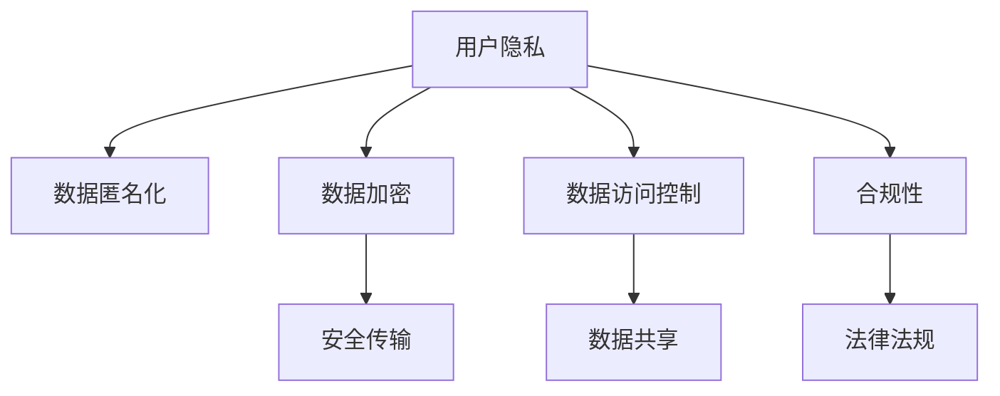

                 

## 1. 背景介绍

在数字化转型不断加速的今天，自动化技术正成为企业提升效率、降低成本、实现业务转型的关键工具。然而，自动化创业过程中不可避免地涉及大量用户数据的使用，用户隐私保护成为项目推进的重要挑战。保护用户隐私不仅能增强用户信任，更是遵循法律法规、维护企业声誉的前提。因此，本文将围绕自动化创业中的用户隐私保护策略展开讨论，从概念、原理到具体措施，全面解析用户隐私保护的实现路径。

## 2. 核心概念与联系

### 2.1 核心概念概述

自动化创业指的是利用先进的信息技术，通过算法和数据驱动，自动化执行企业经营活动的一种新型创业模式。此模式下，用户数据是不可或缺的资源，但随之而来的隐私保护问题也不容忽视。

用户隐私保护涉及对用户个人信息的收集、存储、使用和共享等环节进行严格管控，以防止信息泄露或滥用，确保用户权益得到有效保障。核心概念包括：

- 用户隐私：指个人信息在未经用户同意的情况下不被泄露或用于未经授权的目的。
- 数据匿名化：通过去除或伪装个人信息，使其无法识别特定个体。
- 数据加密：通过加密算法，将数据转化为非可读形式，以保护数据传输过程中的安全性。
- 数据访问控制：对数据访问进行严格授权，仅允许特定角色访问特定数据。
- 合规性：遵循国际和地区法律法规，如GDPR、CCPA等，对用户数据进行合规管理。

这些概念共同构成了用户隐私保护的基础，贯穿于自动化创业的各个环节，从数据收集到数据共享，每一步都需要遵循隐私保护的规范和原则。

### 2.2 核心概念原理和架构的 Mermaid 流程图



此图展示了用户隐私保护的关键环节，数据从收集到传输、共享和合规各个阶段都需要经过严格的管理和保护。

## 3. 核心算法原理 & 具体操作步骤

### 3.1 算法原理概述

用户隐私保护的核心是数据管理和数据处理过程中的隐私保护技术，主要包括数据匿名化、数据加密、访问控制等。这些技术原理和技术手段能够有效减少隐私泄露风险，确保用户数据的私密性和安全性。

### 3.2 算法步骤详解

**步骤1：数据匿名化**
1. 收集数据：通过自动化手段收集用户数据，包括行为数据、交易记录、社交媒体信息等。
2. 数据预处理：去除冗余和无关信息，确保数据质量。
3. 数据匿名化：通过替换、混淆、分段等方法，去除或掩盖用户身份信息。

**步骤2：数据加密**
1. 数据传输加密：使用SSL/TLS等加密协议，对数据传输进行加密保护。
2. 数据存储加密：对存储在数据库中的数据进行加密处理，防止未经授权的访问。

**步骤3：数据访问控制**
1. 角色定义：根据用户角色，定义其对数据的访问权限。
2. 权限管理：使用访问控制列表(ACL)、基于角色的访问控制(RBAC)等技术，限制访问权限。
3. 审计记录：对数据访问进行审计记录，监控访问行为，发现异常。

**步骤4：合规性管理**
1. 法规遵从：定期审核隐私政策和合规性措施，确保符合GDPR、CCPA等法律法规。
2. 用户知情同意：在使用用户数据前，征得用户同意，并告知数据用途。
3. 数据删除：在用户要求下，及时删除其数据。

### 3.3 算法优缺点

**优点：**
1. 提高数据安全性：通过加密和匿名化，有效降低数据泄露的风险。
2. 增强用户信任：用户隐私得到保护，有助于增强用户信任和满意度。
3. 符合法规要求：遵守国际和地区法律法规，避免法律风险。

**缺点：**
1. 技术复杂：隐私保护涉及多种技术手段，技术实现复杂度高。
2. 成本高昂：隐私保护需投入大量资源，如技术研发、设备投入等。
3. 用户教育：用户隐私保护涉及复杂技术，需对用户进行普及和教育。

### 3.4 算法应用领域

用户隐私保护技术广泛应用于金融、医疗、电子商务、智能制造等多个领域。自动化创业中，隐私保护技术在数据采集、数据存储、数据共享和数据销毁等环节均有重要应用，确保数据处理的合规性和安全性。

## 4. 数学模型和公式 & 详细讲解

### 4.1 数学模型构建

用户隐私保护模型的数学基础是差分隐私(Differential Privacy)和数据扰动(Data Disturbance)。

**差分隐私模型：**
设数据集 $D = \{d_1, d_2, ..., d_n\}$，其中 $d_i$ 是数据点的隐私版本。模型对每个数据点进行微扰，从而保证相邻数据点之间的隐私差异无法被检测到。

### 4.2 公式推导过程

**差分隐私公式：**
$$
\epsilon-\text{DP} \text{ defines the privacy} \epsilon \text{ privacy budget} \epsilon > 0
$$

公式中 $\epsilon$ 为隐私保护参数，控制了差分隐私的程度。在数据查询操作中，通过加入随机噪声，确保单个数据点的隐私不被泄露。

### 4.3 案例分析与讲解

**案例1：基于差分隐私的数据分析**
通过差分隐私技术，对医疗数据进行分析，保护患者隐私。

1. 数据收集：收集大量患者医疗记录。
2. 数据预处理：去除敏感信息，如姓名、地址等。
3. 差分隐私：在数据分析过程中，加入随机噪声，确保个体隐私不被泄露。

**案例2：数据扰动**
使用数据扰动技术，保护用户行为数据。

1. 数据收集：收集用户在线行为数据。
2. 数据扰动：对数据进行微扰处理，确保用户行为不被识别。

## 5. 项目实践：代码实例和详细解释说明

### 5.1 开发环境搭建

自动化创业中的用户隐私保护需要构建多层次的安全防护体系，包括数据收集、数据存储、数据处理和数据销毁等多个环节。以下是在Python环境下搭建隐私保护开发环境的步骤：

1. 安装Python环境：使用Anaconda创建虚拟环境，并安装必要的Python库。
2. 数据收集模块：使用Python爬虫或API接口，获取用户数据。
3. 数据存储模块：使用MySQL、MongoDB等数据库进行数据存储。
4. 数据处理模块：使用Pandas、NumPy等数据处理库进行数据清洗和预处理。
5. 数据加密模块：使用AES、RSA等加密算法进行数据加密。
6. 数据访问控制模块：使用Flask框架实现角色和权限管理。
7. 审计记录模块：使用ELK Stack（Elasticsearch、Logstash、Kibana）进行数据审计。

### 5.2 源代码详细实现

**代码1：数据匿名化**
```python
import pandas as pd
from faker import Faker

# 生成匿名化数据
fake = Faker()
data = pd.DataFrame([{'id': '123', 'name': fake.name(), 'email': fake.email()}, {'id': '456', 'name': fake.name(), 'email': fake.email()}])
data = data.replace({'id': 'user_id', 'name': 'anonymized_name', 'email': 'anonymized_email'})
print(data)
```

**代码2：数据加密**
```python
from Crypto.Cipher import AES
import base64

# 加密数据
data = b'Hello, world!'
key = b'This is my key'
cipher = AES.new(key, AES.MODE_ECB)
cipher_text = cipher.encrypt(pad(data, AES.block_size))
print(base64.b64encode(cipher_text).decode('utf-8'))
```

**代码3：数据访问控制**
```python
from flask import Flask, request, jsonify

app = Flask(__name__)

# 定义API接口
@app.route('/user_data', methods=['GET'])
def user_data():
    if request.headers.get('Authorization') == 'Bearer user_token':
        user_data = {'id': '123', 'name': 'John Doe', 'email': 'john@example.com'}
        return jsonify(user_data)
    else:
        return jsonify({'error': 'Unauthorized'}), 401

if __name__ == '__main__':
    app.run(debug=True)
```

### 5.3 代码解读与分析

**代码1解释：**
- 使用Faker生成匿名化数据，替换原始数据中的敏感信息。
- 数据替换后，输出匿名化后的数据表。

**代码2解释：**
- 使用Crypto库进行AES加密，将明文数据转化为密文数据。
- 加密后的数据通过base64编码输出，确保数据的安全性。

**代码3解释：**
- 使用Flask框架实现API接口，确保只有经过授权的用户才能访问用户数据。
- 对用户请求进行验证，通过Authorization头部的Bearer令牌验证用户身份。
- 验证通过后，返回用户数据；否则返回401未授权错误。

### 5.4 运行结果展示

运行以上代码，输出匿名化数据、加密后的数据和API接口的响应结果，以展示隐私保护技术的应用效果。

## 6. 实际应用场景

### 6.1 金融领域

金融领域高度依赖用户数据的隐私保护。银行、保险公司等金融机构在处理客户数据时，必须严格遵守隐私保护标准，防止数据泄露和滥用。

**应用场景：**
1. 客户数据保护：在客户申请贷款或保险时，收集的个人信息必须进行匿名化和加密处理。
2. 交易记录保护：客户交易记录需要被严格保护，防止未授权访问和数据篡改。

### 6.2 医疗领域

医疗领域对用户隐私保护要求极高，患者数据的敏感性和重要性决定了隐私保护的重要性。

**应用场景：**
1. 患者病历保护：患者病历数据必须进行加密处理，确保只有授权医生才能访问。
2. 基因数据保护：基因数据高度敏感，必须采取严格的数据保护措施，防止泄露。

### 6.3 电子商务

电子商务平台大量收集用户购买行为、浏览记录等信息，隐私保护成为平台运营的关键环节。

**应用场景：**
1. 用户行为数据保护：用户浏览记录和购买记录必须进行加密和匿名化处理。
2. 用户交易数据保护：用户交易数据需要严格保护，防止数据泄露和滥用。

## 7. 工具和资源推荐

### 7.1 学习资源推荐

- 《隐私保护技术与实践》：深入介绍隐私保护技术和实践，涵盖差分隐私、数据扰动、访问控制等内容。
- Coursera《数据隐私与安全》课程：由斯坦福大学教授讲授，深入浅出地讲解隐私保护基本原理和实践。
- 《Python隐私保护编程指南》：详细讲解Python中隐私保护的技术实现，包括数据加密、数据匿名化等。

### 7.2 开发工具推荐

- Python：广泛用于数据处理和隐私保护开发，提供丰富的数据处理和加密库。
- Flask：轻量级Web框架，易于实现API接口，支持用户授权和数据访问控制。
- ELK Stack：集中管理日志和审计数据，便于监控和分析隐私保护效果。

### 7.3 相关论文推荐

- Differential Privacy: Privacy-preserving algorithms: https://eprint.iacr.org/2006/386
- Data Differential Privacy: https://www.microsoft.com/en-us/research/publication/data-differential-privacy/

## 8. 总结：未来发展趋势与挑战

### 8.1 研究成果总结

隐私保护技术在自动化创业中起着至关重要的作用，通过差分隐私、数据扰动、数据访问控制等技术手段，有效保护用户数据隐私。隐私保护技术的不断发展，为自动化创业提供了强大的保障，增强了用户信任，推动了业务发展。

### 8.2 未来发展趋势

1. 数据隐私保护技术将更加普及和成熟，成为自动化创业的标准配置。
2. 隐私保护将结合人工智能技术，实现更高效的数据处理和分析。
3. 隐私保护技术将不断演进，引入区块链等新技术，提升数据安全性。

### 8.3 面临的挑战

1. 技术复杂度：隐私保护技术涉及复杂的技术手段，实现难度较大。
2. 成本投入：隐私保护需要投入大量资源，如技术研发、设备投入等。
3. 用户教育：用户对隐私保护技术缺乏了解，需加强用户教育。

### 8.4 研究展望

未来隐私保护技术的发展方向包括：

1. 自动化隐私保护：利用AI技术自动检测和修复数据泄露风险。
2. 隐私保护技术演进：引入区块链、联邦学习等新技术，提升数据保护效果。
3. 隐私保护技术普及：推广隐私保护技术的应用，提升数据安全水平。

## 9. 附录：常见问题与解答

**Q1：自动化创业中，数据收集环节如何保护用户隐私？**

A: 数据收集环节必须遵循隐私保护原则，采用匿名化处理、数据扰动等技术手段，确保数据采集过程中的隐私安全。

**Q2：数据存储环节，如何保证数据安全？**

A: 数据存储环节应使用加密技术，对数据进行加密处理，确保数据在存储过程中的安全性。

**Q3：数据访问控制如何实现？**

A: 数据访问控制通过角色和权限管理实现，对数据访问进行严格授权，确保只有授权人员才能访问数据。

**Q4：数据销毁环节需要注意哪些问题？**

A: 数据销毁环节需要确保数据彻底删除，防止数据残留和泄露。使用数据擦除工具，确保数据不可恢复。

**Q5：自动化创业中，如何应对隐私保护的挑战？**

A: 应对隐私保护的挑战需要综合考虑技术、成本、用户教育等因素，不断优化和改进隐私保护策略。

---

作者：禅与计算机程序设计艺术 / Zen and the Art of Computer Programming

