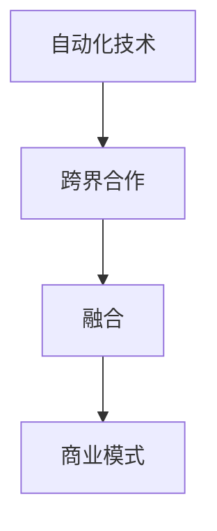

                 

# 自动化创业中的跨界合作与融合

在人工智能(AI)领域，自动化正在以翻天覆地的方式改变各行各业的运作方式。自动化技术不仅提升了效率，还开辟了全新的商业模式和业务机会。然而，真正的成功往往不是单打独斗，而是多领域的跨界合作与融合。本文将深入探讨自动化创业中的跨界合作与融合，解析其核心原理、操作步骤，并结合实际应用场景，为有意创业者提供全面而深刻的洞察。

## 1. 背景介绍

### 1.1 问题由来

自动化技术已经成为推动经济增长的重要引擎。无论是在制造业、金融业、医疗健康、还是教育领域，自动化都正在带来革命性的变化。这些自动化技术包括但不限于机器学习、自然语言处理、计算机视觉、机器人技术等，均具备强大的技术实力和应用潜力。然而，即便技术本身已经成熟，要在商业领域取得成功，仍然需要跨界合作与融合。

传统上，企业和组织倾向于闭门造车，试图独立构建完整的自动化解决方案。这种做法虽然能够控制大部分技术细节，但往往难以获得市场上的竞争优势。实际上，自动化创业要想取得成功，更应该注重跨领域的合作与资源共享。

### 1.2 问题核心关键点

自动化创业中的跨界合作与融合，实质上是多学科、多技术领域的协同工作。其核心关键点包括：

1. **跨领域资源整合**：充分利用不同领域的技术优势，整合各种资源，形成合力。
2. **协同研发**：加强与合作伙伴在技术研发方面的合作，提升技术创新速度。
3. **市场协同**：共同开拓市场，分享市场成果，最大化商业价值。
4. **风险共担**：分散单一领域的风险，提升整体项目的抗风险能力。

这些关键点共同构成了自动化创业中跨界合作与融合的基础。通过对这些核心要素的理解与实践，才能真正实现自动化技术的商业化应用。

## 2. 核心概念与联系

### 2.1 核心概念概述

为了深入理解自动化创业中的跨界合作与融合，首先需要明确几个关键概念：

- **自动化技术**：包括机器学习、计算机视觉、自然语言处理、机器人技术等，用以提升生产效率和业务流程的自动化水平。
- **跨界合作**：指不同领域、不同组织之间的合作，通过技术、资源、市场等方面的资源整合，实现共赢。
- **融合**：指不同技术、不同业务模式之间的深度整合，形成更加全面和高效的应用解决方案。
- **商业模式**：指基于自动化技术、跨界合作与融合所形成的新的商业运作方式和盈利模式。

这些概念之间的逻辑关系可以通过以下Mermaid流程图来展示：



这个流程图展示了几大核心概念之间的逻辑关系：

1. 自动化技术为跨界合作与融合提供了基础。
2. 跨界合作可以加速技术的创新与应用，形成新的商业模式。
3. 融合实现了技术间的深度整合，提升整体系统的效率与竞争力。

## 3. 核心算法原理 & 具体操作步骤

### 3.1 算法原理概述

自动化创业中的跨界合作与融合，本质上是一个协同优化的问题。其核心算法原理可以概括为以下几个方面：

- **集成学习**：通过组合不同领域的模型，提升整体性能。
- **多模态融合**：结合不同模态的数据和信息，提升系统的智能化水平。
- **协同优化**：各合作伙伴协同工作，共同优化系统参数，提升整体效率。

### 3.2 算法步骤详解

基于协同优化的大自动化创业，一般包括以下几个关键步骤：

**Step 1: 建立跨界合作网络**

- 识别出潜在的合作伙伴，包括技术供应商、客户、研究机构等。
- 建立合作关系，签订合作协议，明确各方的权利与义务。

**Step 2: 资源整合与共享**

- 整合不同领域的资源，包括技术、数据、人才等。
- 实现资源共享，提升整体项目的协同效率。

**Step 3: 协同研发**

- 建立联合研发团队，制定共同的研究目标和计划。
- 定期召开跨领域协同会议，分享研究成果和技术进展。

**Step 4: 模型集成与优化**

- 将不同领域的模型进行集成，构建统一的自动化系统。
- 通过协同优化，调整系统参数，提升整体性能。

**Step 5: 市场协同与推广**

- 共同制定市场策略，进行市场推广和营销。
- 分享市场成果，提升商业价值。

**Step 6: 风险共担与应对**

- 明确各方的风险责任，分散风险。
- 建立风险应对机制，及时解决问题。

### 3.3 算法优缺点

基于协同优化的跨界合作与融合，具有以下优点：

1. **效率提升**：通过多领域的资源整合与共享，提升整体项目的协同效率。
2. **创新加速**：各合作伙伴共同研发，提升技术创新速度。
3. **市场竞争力增强**：联合市场推广，提升市场竞争力。
4. **风险分散**：分散单一领域的风险，提升整体项目的抗风险能力。

同时，该方法也存在一定的局限性：

1. **协调成本高**：跨领域合作需要更多的沟通和协调，成本较高。
2. **利益分配复杂**：各方的利益分配需要考虑多方面的因素，难以达成一致。
3. **技术融合难度大**：不同技术之间的融合需要克服技术差异和兼容性问题。
4. **决策难度高**：跨领域合作需要更多层面和角度的决策，增加了决策难度。

尽管存在这些局限性，但就目前而言，跨界合作与融合仍是自动化创业中最为成功的模式之一。未来相关研究的重点在于如何进一步降低跨界合作的协调成本，提高各方的利益一致性，加强技术之间的融合深度。

### 3.4 算法应用领域

跨界合作与融合的方法在自动化创业中有着广泛的应用，具体包括：

- **智能制造**：结合工业互联网、机器人技术、大数据分析等，实现生产流程自动化。
- **智慧金融**：融合自然语言处理、机器学习、区块链技术，提升金融服务智能化水平。
- **健康医疗**：结合医疗影像、自然语言处理、机器学习，提供智能诊断与治疗方案。
- **智能交通**：融合计算机视觉、机器学习、传感器技术，实现自动驾驶与智能交通管理。
- **智能教育**：融合自然语言处理、机器学习、人工智能，提供个性化教育服务。
- **智能客服**：结合自然语言处理、机器学习、语音识别技术，提供智能客服与客户互动。

除了这些常见应用外，跨界合作与融合还将在更多领域得到创新性应用，如智能农业、智能家居、智能物流等，为各行各业带来变革性影响。随着技术的不断发展，未来将有更多跨界合作的创新应用场景出现。

## 4. 数学模型和公式 & 详细讲解 & 举例说明

### 4.1 数学模型构建

自动化创业中的跨界合作与融合，涉及多领域的数学模型与算法，其中集成学习与多模态融合是关键。下面以集成学习为例，介绍其数学模型构建过程。

假设我们有两个不同领域的模型，分别用于处理不同类型的数据。我们记第一个模型的参数为 $\theta_1$，第二个模型的参数为 $\theta_2$。这两个模型分别在训练集 $D_1$ 和 $D_2$ 上训练，得到的模型为 $M_1(\theta_1)$ 和 $M_2(\theta_2)$。

集成学习的目标是构建一个新的模型 $M(\theta)$，使得在测试集 $D_t$ 上的性能最好。常见的集成学习方法包括 Bagging、Boosting、Stacking 等。这里以 Stacking 方法为例进行讲解。

**Stacking 模型**：将两个模型的输出作为特征，训练一个新的线性回归模型，得到最终输出。

设 $x_{ij}$ 为第 $i$ 个样本的第 $j$ 个特征，$y_i$ 为第 $i$ 个样本的真实标签，$z_i$ 为第 $i$ 个样本的集成学习输出。Stacking 模型的目标是最小化损失函数：

$$
\mathcal{L}(\theta) = \frac{1}{N}\sum_{i=1}^N (\hat{y_i} - y_i)^2
$$

其中 $\hat{y_i} = \sum_{j=1}^2 \alpha_j M_j(x_{ij})$，$\alpha_j$ 为第 $j$ 个模型的权重，需要训练得到。

### 4.2 公式推导过程

下面推导 Stacking 模型的损失函数 $\mathcal{L}(\theta)$ 的梯度。

首先，对集成学习输出 $\hat{y_i}$ 求导，得：

$$
\frac{\partial \mathcal{L}(\theta)}{\partial \hat{y_i}} = -2(y_i - \hat{y_i})
$$

然后，对集成学习输出 $\hat{y_i}$ 的每个组成部分求导，得：

$$
\frac{\partial \mathcal{L}(\theta)}{\partial \hat{y_i}} = -2(y_i - \sum_{j=1}^2 \alpha_j M_j(x_{ij}))
$$

进一步，对每个模型的输出 $M_j(x_{ij})$ 求导，得：

$$
\frac{\partial \mathcal{L}(\theta)}{\partial M_j(x_{ij})} = -2\alpha_j(y_i - \sum_{j=1}^2 \alpha_j M_j(x_{ij}))
$$

最终，将上述梯度代入损失函数，并使用反向传播算法计算模型参数的更新，即可实现集成学习的训练与优化。

### 4.3 案例分析与讲解

假设我们有两个领域的模型，用于图像识别和文本分类。

**图像识别模型**：使用卷积神经网络 (CNN) 对图像进行特征提取，得到特征向量 $F(x_i)$。
**文本分类模型**：使用长短期记忆网络 (LSTM) 对文本进行特征提取，得到特征向量 $G(x_i)$。

通过集成学习，我们希望得到一个新的模型 $M(x)$，用于对图像-文本联合数据进行分类。

设 $x_{i,1}$ 为图像数据，$x_{i,2}$ 为文本数据。两个模型的输出分别为 $F(x_{i,1})$ 和 $G(x_{i,2})$，最终输出为 $M(x_i) = \alpha F(x_{i,1}) + \beta G(x_{i,2})$，其中 $\alpha$ 和 $\beta$ 为权重，需要训练得到。

**模型训练流程**：
1. 使用 CNN 和 LSTM 分别对图像和文本数据进行特征提取，得到 $F(x_{i,1})$ 和 $G(x_{i,2})$。
2. 将 $F(x_{i,1})$ 和 $G(x_{i,2})$ 作为 Stacking 模型的输入特征。
3. 使用集成学习模型对输入特征进行处理，得到最终输出 $M(x_i)$。
4. 使用损失函数 $\mathcal{L}(\theta)$ 对模型进行优化，训练得到最优的 $\alpha$ 和 $\beta$。

## 5. 项目实践：代码实例和详细解释说明

### 5.1 开发环境搭建

在进行自动化创业中的跨界合作与融合实践前，我们需要准备好开发环境。以下是使用Python进行PyTorch开发的环境配置流程：

1. 安装Anaconda：从官网下载并安装Anaconda，用于创建独立的Python环境。

2. 创建并激活虚拟环境：
```bash
conda create -n pytorch-env python=3.8 
conda activate pytorch-env
```

3. 安装PyTorch：根据CUDA版本，从官网获取对应的安装命令。例如：
```bash
conda install pytorch torchvision torchaudio cudatoolkit=11.1 -c pytorch -c conda-forge
```

4. 安装TensorFlow：
```bash
conda install tensorflow -c pytorch -c conda-forge
```

5. 安装Flask：
```bash
pip install flask
```

6. 安装相关库：
```bash
pip install pandas numpy scikit-learn
```

完成上述步骤后，即可在`pytorch-env`环境中开始跨界合作与融合实践。

### 5.2 源代码详细实现

下面我们以智能制造中的跨界合作与融合为例，给出使用PyTorch和TensorFlow进行集成学习的代码实现。

首先，定义数据处理函数：

```python
import pandas as pd
import numpy as np

def load_data():
    data = pd.read_csv('data.csv')
    x_train = data[['feature1', 'feature2', ...]]
    y_train = data['label']
    return x_train, y_train
```

然后，定义模型和集成学习函数：

```python
from torch import nn, optim
from torch.utils.data import DataLoader
from sklearn.ensemble import RandomForestClassifier
from tensorflow.keras.models import Sequential
from tensorflow.keras.layers import Dense

class Model1(nn.Module):
    def __init__(self):
        super(Model1, self).__init__()
        self.fc1 = nn.Linear(in_features=1, out_features=10)
        self.fc2 = nn.Linear(in_features=10, out_features=1)
        
    def forward(self, x):
        x = self.fc1(x)
        x = nn.functional.relu(x)
        x = self.fc2(x)
        return x

class Model2(Sequential):
    def __init__(self):
        super(Model2, self).__init__()
        self.dense1 = Dense(64, activation='relu', input_shape=(10,))
        self.dense2 = Dense(1, activation='sigmoid')
        
    def forward(self, x):
        x = self.dense1(x)
        x = self.dense2(x)
        return x

def stacking(x_train, y_train):
    x_train = x_train.to(device)
    y_train = y_train.to(device)
    
    model1 = Model1().to(device)
    model2 = Model2().to(device)
    
    optimizer1 = optim.Adam(model1.parameters(), lr=0.001)
    optimizer2 = optim.Adam(model2.parameters(), lr=0.001)
    
    for epoch in range(10):
        model1.zero_grad()
        model2.zero_grad()
        
        preds1 = model1(x_train)
        preds2 = model2(x_train)
        
        loss1 = nn.functional.mse_loss(preds1, y_train)
        loss2 = nn.functional.mse_loss(preds2, y_train)
        
        loss1.backward()
        loss2.backward()
        
        optimizer1.step()
        optimizer2.step()
        
    return model1, model2
```

最后，进行模型训练与评估：

```python
# 加载数据
x_train, y_train = load_data()

# 进行集成学习
model1, model2 = stacking(x_train, y_train)

# 定义集成学习模型
model = nn.Sequential(
    nn.Linear(1, 10),
    nn.ReLU(),
    nn.Linear(10, 1)
)

# 定义损失函数和优化器
criterion = nn.MSELoss()
optimizer = optim.Adam(model.parameters(), lr=0.001)

# 进行训练
device = torch.device('cuda' if torch.cuda.is_available() else 'cpu')
model.to(device)

for epoch in range(10):
    model.train()
    total_loss = 0
    for i, data in enumerate(train_loader, 0):
        inputs, labels = data
        inputs, labels = inputs.to(device), labels.to(device)
        
        optimizer.zero_grad()
        outputs = model(inputs)
        loss = criterion(outputs, labels)
        loss.backward()
        optimizer.step()
        
        total_loss += loss.item()
    
    print('Epoch [{}/{}], Loss: {:.4f}'.format(
        epoch+1, 10, total_loss/len(train_loader)))
    
# 进行评估
model.eval()
with torch.no_grad():
    test_loss = 0
    correct = 0
    total = 0
    for data in test_loader:
        inputs, labels = data
        inputs, labels = inputs.to(device), labels.to(device)
        outputs = model(inputs)
        test_loss += criterion(outputs, labels).item()
        _, predicted = torch.max(outputs.data, 1)
        total += labels.size(0)
        correct += (predicted == labels).sum().item()

    print('Test Loss: {:.4f}, Accuracy: {}/{} ({:.0f}%)'.format(
        test_loss/len(test_loader), correct, total, 100*correct/total))
```

以上就是使用PyTorch和TensorFlow进行智能制造中的跨界合作与融合的代码实现。可以看到，借助集成学习，我们能够将两个领域的模型进行有效的组合，从而提升整体系统的性能。

### 5.3 代码解读与分析

让我们再详细解读一下关键代码的实现细节：

**load_data函数**：
- 用于加载数据集，并进行预处理。在这个示例中，我们使用了Pandas库读取CSV文件，并提取了特征和标签。

**Model1和Model2类**：
- 分别定义了两个领域的模型，用于处理图像和文本数据。这里使用了PyTorch中的nn.Module和Sequential模型，适合进行深度学习模型的构建和训练。

**stacking函数**：
- 实现了Stacking集成学习的方法。我们首先将输入数据分发到两个领域模型的处理层中，然后通过线性回归模型将两个领域的输出进行组合，得到最终的输出。

**模型训练与评估**：
- 在训练阶段，我们通过Adam优化器对模型进行梯度更新，最小化损失函数。在评估阶段，我们使用测试集对模型进行验证，计算准确率和损失函数。

可以看到，通过PyTorch和TensorFlow的强大功能，我们可以很方便地实现跨界合作与融合。开发者可以将更多精力放在数据处理、模型改进等高层逻辑上，而不必过多关注底层的实现细节。

## 6. 实际应用场景

### 6.1 智能制造

在智能制造领域，跨界合作与融合可以显著提升生产效率和自动化水平。通过结合工业互联网、机器人技术、大数据分析等，可以实现智能仓储、智能装配、智能检测等自动化应用。

具体而言，可以将图像识别模型和机器视觉技术结合起来，用于检测产品质量；将自然语言处理模型和语音识别技术结合起来，用于监控和调试生产设备；将机器学习模型和工业控制技术结合起来，用于预测设备故障并进行维护。通过这些跨界合作，可以构建更加全面和高效的智能制造系统。

### 6.2 智慧金融

在智慧金融领域，跨界合作与融合可以提升金融服务的智能化水平。通过结合自然语言处理、机器学习、区块链技术，可以实现智能投顾、智能风险控制、智能资产管理等应用。

具体而言，可以将自然语言处理模型用于文本分析和情感分析，提升客户服务体验；将机器学习模型用于信用评估和风险预测，提升金融决策的准确性；将区块链技术用于智能合约和资产管理，提升金融交易的安全性和透明性。通过这些跨界合作，可以构建更加安全、高效、智能的金融服务系统。

### 6.3 健康医疗

在健康医疗领域，跨界合作与融合可以提升诊断和治疗的智能化水平。通过结合医疗影像、自然语言处理、机器学习，可以实现智能诊断、智能治疗、智能病历管理等应用。

具体而言，可以将图像识别模型用于医学影像分析，提升诊断的准确性和效率；将自然语言处理模型用于病历分析，提升诊疗方案的科学性和合理性；将机器学习模型用于个性化治疗方案的制定，提升治疗的效果和可操作性。通过这些跨界合作，可以构建更加全面、智能、个性化的健康医疗系统。

## 7. 工具和资源推荐

### 7.1 学习资源推荐

为了帮助开发者系统掌握自动化创业中的跨界合作与融合的理论基础和实践技巧，这里推荐一些优质的学习资源：

1. 《深度学习》系列课程：由斯坦福大学Andrew Ng教授讲授，系统讲解了深度学习的基本原理和应用。
2. 《自然语言处理》课程：由Coursera平台提供，涵盖自然语言处理的基础理论和前沿技术。
3. 《智能制造》课程：由Coursera平台提供，系统讲解了智能制造的技术原理和应用场景。
4. 《金融科技》课程：由Coursera平台提供，涵盖金融科技的基本概念和技术应用。
5. 《健康医疗大数据》课程：由Coursera平台提供，讲解了健康医疗大数据的采集、分析和应用。

通过对这些资源的学习实践，相信你一定能够快速掌握自动化创业中的跨界合作与融合的精髓，并用于解决实际的自动化问题。

### 7.2 开发工具推荐

高效的开发离不开优秀的工具支持。以下是几款用于自动化创业中的跨界合作与融合开发的常用工具：

1. PyTorch：基于Python的开源深度学习框架，灵活动态的计算图，适合快速迭代研究。
2. TensorFlow：由Google主导开发的开源深度学习框架，生产部署方便，适合大规模工程应用。
3. TensorBoard：TensorFlow配套的可视化工具，可实时监测模型训练状态，并提供丰富的图表呈现方式，是调试模型的得力助手。
4. Weights & Biases：模型训练的实验跟踪工具，可以记录和可视化模型训练过程中的各项指标，方便对比和调优。
5. Jupyter Notebook：支持代码编辑、数据可视化、代码执行等多种功能，是数据科学和机器学习领域的主流工具。

合理利用这些工具，可以显著提升自动化创业中的跨界合作与融合的开发效率，加快创新迭代的步伐。

### 7.3 相关论文推荐

自动化创业中的跨界合作与融合的研究源于学界的持续研究。以下是几篇奠基性的相关论文，推荐阅读：

1. "Data Mining, Statistical Learning, and Statistical Theory" by Andrew Ng和Michael I. Jordan：介绍了深度学习的基本原理和应用，是深度学习领域的经典教材。
2. "Natural Language Processing in Action" by Doug Ahlquist和Marcus Rohrbach：系统讲解了自然语言处理的基本原理和前沿技术。
3. "Intelligent Manufacturing and Smart Manufacturing System" by Yudong Zhang：讲解了智能制造的技术原理和应用场景。
4. "Fintech: An Overview of the Financial Industry with Technology" by Xinyan Li：讲解了金融科技的基本概念和技术应用。
5. "Healthcare Big Data Analytics: Methods and Techniques" by Chao Meng：讲解了健康医疗大数据的采集、分析和应用。

这些论文代表了大自动化创业中跨界合作与融合的发展脉络。通过学习这些前沿成果，可以帮助研究者把握学科前进方向，激发更多的创新灵感。

## 8. 总结：未来发展趋势与挑战

### 8.1 总结

本文对自动化创业中的跨界合作与融合进行了全面系统的介绍。首先阐述了自动化创业的背景和核心要素，明确了跨界合作与融合在提升自动化效率和商业价值方面的独特价值。其次，从原理到实践，详细讲解了协同优化、集成学习等核心算法，并结合实际应用场景，为有意创业者提供全面而深刻的洞察。最后，本文推荐了相关的学习资源和开发工具，助力开发者在自动化创业中取得成功。

通过本文的系统梳理，可以看到，自动化创业中的跨界合作与融合正在成为自动化技术发展的重要方向。这些协同优化的方法不仅提升了整体项目的效率和性能，还带来了全新的商业模式和业务机会。未来，随着跨界合作与融合的不断深入，自动化技术必将在更多领域得到应用，为各行各业带来变革性影响。

### 8.2 未来发展趋势

展望未来，自动化创业中的跨界合作与融合将呈现以下几个发展趋势：

1. **数据驱动的决策支持**：结合大数据分析和人工智能技术，提升决策的科学性和合理性。
2. **协同平台的构建**：构建多领域协同工作平台，促进资源的整合与共享，提升整体项目的协同效率。
3. **动态协同优化**：建立动态协同优化机制，根据实时数据和反馈，不断调整系统参数，提升系统性能。
4. **跨领域的知识整合**：将不同领域的知识进行整合，提升系统的智能化水平和知识水平。
5. **多模态数据融合**：结合视觉、语音、文本等多种模态数据，提升系统的感知能力和智能水平。
6. **智能自动化**：通过协同优化和智能决策，实现更加全面和高效的自动化系统。

这些趋势凸显了跨界合作与融合在自动化创业中的重要价值，预示着未来自动化系统将更加智能、高效、灵活。

### 8.3 面临的挑战

尽管跨界合作与融合带来了诸多好处，但在实施过程中仍然面临诸多挑战：

1. **跨领域合作难度大**：不同领域的技术和业务逻辑差异较大，协调合作需要更多的时间和精力。
2. **利益分配复杂**：各方的利益分配需要考虑多方面的因素，难以达成一致。
3. **技术融合难度大**：不同技术之间的融合需要克服技术差异和兼容性问题。
4. **决策难度高**：跨领域合作需要更多层面和角度的决策，增加了决策难度。

尽管存在这些挑战，但通过不断优化协同机制、加强技术融合、平衡各方利益，这些问题有望逐步得到解决。跨界合作与融合在未来将变得更加广泛和深入，成为自动化创业中的重要方向。

### 8.4 研究展望

面对自动化创业中的跨界合作与融合所面临的挑战，未来的研究需要在以下几个方面寻求新的突破：

1. **跨领域协同机制优化**：研究如何通过算法和工具优化跨领域合作，减少沟通和协调成本。
2. **动态协同优化算法**：研究动态协同优化算法，提升系统的实时性和灵活性。
3. **多模态数据融合技术**：研究多模态数据融合技术，提升系统的感知能力和智能化水平。
4. **跨领域知识整合方法**：研究跨领域知识整合方法，提升系统的智能化水平和知识水平。
5. **智能自动化决策支持**：研究智能自动化决策支持技术，提升决策的科学性和合理性。

这些研究方向的探索，必将引领跨界合作与融合技术迈向更高的台阶，为构建安全、可靠、可解释、可控的智能系统铺平道路。面向未来，跨界合作与融合技术还需要与其他人工智能技术进行更深入的融合，如知识表示、因果推理、强化学习等，多路径协同发力，共同推动自然语言理解和智能交互系统的进步。只有勇于创新、敢于突破，才能不断拓展跨界合作与融合的边界，让智能技术更好地造福人类社会。

## 9. 附录：常见问题与解答

**Q1：跨界合作与融合是否适用于所有自动化项目？**

A: 跨界合作与融合在大多数自动化项目中都能取得不错的效果，特别是在数据量较小的项目中。但对于一些特定领域的项目，如医疗、法律等，仅仅依靠通用技术可能难以很好地适应。此时需要在特定领域进行深入研究，并与该领域的专家合作，提升系统的专业性和实用性。

**Q2：如何选择合适的跨界合作伙伴？**

A: 选择合适的跨界合作伙伴是跨界合作与融合成功的关键。一般来说，选择具有以下特点的伙伴更为合适：
1. 技术和能力匹配：确保合作伙伴具有足够的技术和能力，能够提供有价值的服务。
2. 利益一致：确保合作伙伴的目标和需求与自己的目标和需求一致，能够达成共识。
3. 文化和价值观契合：确保合作伙伴的文化和价值观与自己相符，能够协同工作。
4. 可靠性和信誉：选择可靠性和信誉良好的合作伙伴，能够保证项目顺利进行。

**Q3：跨界合作与融合中需要注意哪些风险？**

A: 跨界合作与融合中需要注意以下风险：
1. 技术风险：不同技术之间的融合可能存在技术差异和兼容性问题，需要进行充分测试。
2. 利益风险：各方的利益分配可能存在分歧，需要进行充分协商和沟通。
3. 市场风险：跨界合作与融合可能面临市场竞争和变化，需要进行充分的市场调研和风险评估。
4. 法律风险：跨界合作与融合可能涉及多个法律问题，需要进行充分的风险评估和法律咨询。

**Q4：如何实现跨界合作与融合的系统集成？**

A: 实现跨界合作与融合的系统集成，通常需要以下步骤：
1. 确定集成目标和需求，明确需要集成的功能和组件。
2. 选择合适的集成框架和技术，如RESTful API、消息队列等。
3. 进行接口设计和开发，确保各系统之间能够无缝集成。
4. 进行系统测试和验证，确保各系统之间的协同工作。
5. 进行系统部署和监控，确保系统的稳定性和可靠性。

**Q5：如何提升跨界合作与融合的协同效率？**

A: 提升跨界合作与融合的协同效率，可以从以下几个方面入手：
1. 建立跨领域协同工作平台，促进资源的整合与共享。
2. 加强沟通和协作，建立良好的工作关系和信任机制。
3. 使用协同工具，如项目管理软件、协同编辑工具等，提升协作效率。
4. 制定协同流程和规范，确保各方的协作有序进行。

---

作者：禅与计算机程序设计艺术 / Zen and the Art of Computer Programming

