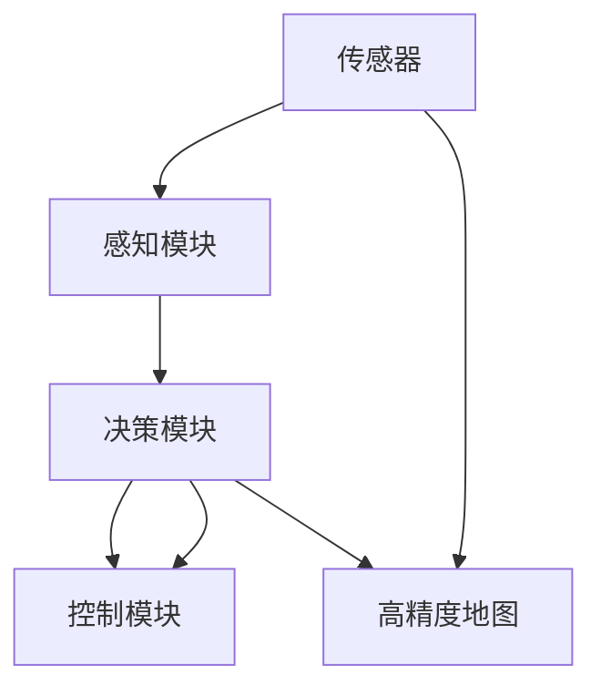
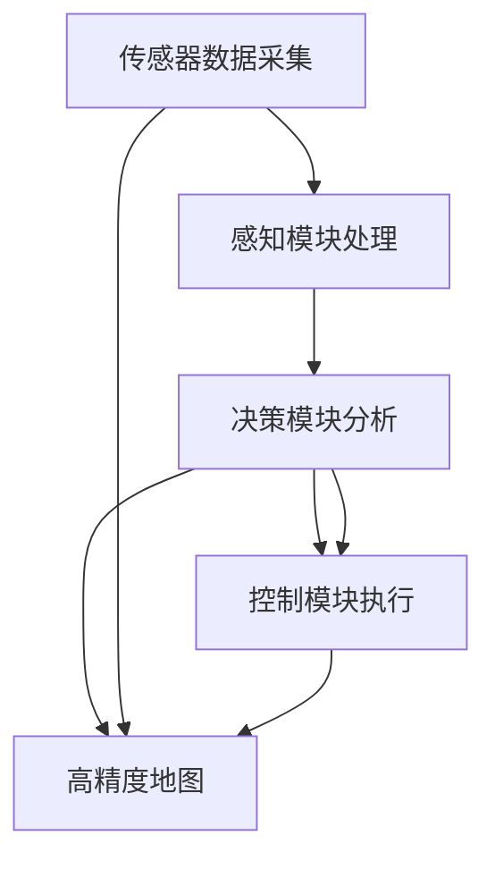

                 

## 1. 背景介绍

### 1.1 问题由来

随着科技的进步和社会的发展，自动驾驶系统(Autonomous Driving Systems, ADS)逐渐成为了现代交通的重要组成部分。自动驾驶技术通过融合计算机视觉、传感器数据、高精度地图以及人工智能等技术，实现车辆的自动化驾驶和运行。这种技术的应用能够显著提高道路安全性，减轻驾驶疲劳，提升出行效率，并降低交通拥堵和环境污染。

然而，自动驾驶系统在感知、决策和控制等方面的复杂性和多样性，使其成为一个极具挑战性的工程问题。为了确保自动驾驶的安全性和可靠性，需要综合考虑车辆在多变道路环境中的各种情况，并制定出一套系统化的方法和策略。

### 1.2 问题核心关键点

自动驾驶系统的核心目标是通过智能感知环境，进行准确决策，并通过精准控制，实现车辆的安全、高效和稳定的自动驾驶。具体来说，关键点如下：

1. **感知能力**：自动驾驶系统必须能够准确地感知车辆周围环境，包括道路条件、交通参与者、交通标志等信息。感知能力是自动驾驶的基础，对决策和控制有着决定性的影响。

2. **决策能力**：基于感知数据，自动驾驶系统需要对当前行驶环境和未来行为进行分析和判断，选择合适的行动策略。决策能力决定了自动驾驶系统的智能水平。

3. **控制能力**：将决策结果转化为具体的车辆控制指令，使车辆按照预定目标行驶。控制能力是自动驾驶系统的执行能力，直接关系到行驶安全和稳定性。

### 1.3 问题研究意义

研究自动驾驶系统的感知、决策与控制，对于推动交通系统向智能化和自动化的方向发展具有重要意义：

1. 提升道路安全性：自动驾驶系统能够减少人为驾驶错误，避免交通事故，降低道路死亡率。
2. 改善交通效率：通过精准控制和动态调度，自动驾驶系统能够有效减少交通拥堵，提升出行效率。
3. 促进环保出行：自动驾驶系统能够实现节能减排，减少碳排放，对环境保护具有积极作用。
4. 促进产业转型：自动驾驶技术的发展将催生新的商业模式和就业机会，促进汽车、IT等产业的转型升级。
5. 改善用户体验：自动驾驶系统能够提供更舒适、便捷的出行体验，减少驾驶疲劳，提升生活质量。

## 2. 核心概念与联系

### 2.1 核心概念概述

自动驾驶系统涉及多个核心概念，以下将详细介绍这些概念及其之间的关系：

1. **传感器(Sensors)**：自动驾驶系统常用的传感器包括激光雷达(LiDAR)、摄像头(Camera)、雷达(Radar)、GPS/IMU等，用于感知周围环境。

2. **感知模块(Sensing Module)**：通过传感器获取的原始数据需要经过处理和融合，才能转化为可用的感知信息。感知模块一般包括图像处理、目标检测、语义分割等算法。

3. **决策模块(Decision Module)**：在感知模块的基础上，通过算法对感知数据进行分析，判断当前环境和未来行为，生成决策结果。决策模块通常采用强化学习、路径规划等技术。

4. **控制模块(Control Module)**：将决策结果转化为车辆的实际控制指令，包括加速、刹车、转向等，保证车辆按照预定目标行驶。控制模块依赖于车辆动力系统、转向系统等硬件设施。

5. **高精度地图(High-Precision Maps)**：高精度地图为自动驾驶系统提供了车辆定位和路网信息，是实现精准控制的基础。

6. **协同感知与控制**：自动驾驶系统中的感知、决策和控制模块需要相互协同工作，共同实现车辆自动驾驶。

这些核心概念通过合成的形式，形成了自动驾驶系统的整体架构，如图2-1所示。



### 2.2 核心概念原理和架构的 Mermaid 流程图

以下是基于Mermaid语言绘制的核心概念原理和架构流程图。流程图展示了自动驾驶系统的主要流程和各模块之间的关系：



### 2.3 核心概念之间的联系

自动驾驶系统的各个核心概念之间存在着紧密的联系，以下将详细介绍这些联系：

1. **传感器数据采集**：传感器获取的原始数据为感知模块提供输入，是感知的基础。

2. **感知模块处理**：感知模块将传感器数据转化为车辆对周围环境的理解，为决策模块提供信息。

3. **决策模块分析**：决策模块基于感知信息，结合高精度地图等知识库，生成最优的行驶策略。

4. **控制模块执行**：控制模块将决策结果转化为具体的控制指令，驱动车辆执行。

5. **高精度地图**：高精度地图为决策和控制提供了精准的定位和路网信息，是系统定位和规划的依据。

通过这些模块的协同工作，自动驾驶系统能够实现车辆自动感知、决策和控制，从而实现自主驾驶。

## 3. 核心算法原理 & 具体操作步骤

### 3.1 算法原理概述

自动驾驶系统中的核心算法主要分为以下几个方面：

1. **传感器数据融合**：将来自不同传感器的数据进行融合，以获得更全面、准确的环境感知。

2. **目标检测与跟踪**：使用计算机视觉技术，对传感器数据中的目标进行检测和跟踪。

3. **路径规划**：在决策模块中，通过算法生成最优路径，并在执行过程中进行动态调整。

4. **行为决策**：基于当前环境，选择合适的行为策略，包括加速、减速、转向等。

5. **车辆控制**：将决策结果转化为具体的控制指令，实现车辆的精准控制。

### 3.2 算法步骤详解

以下是自动驾驶系统中的核心算法步骤详解：

**Step 1: 传感器数据采集**

传感器采集环境信息，包括道路条件、交通参与者、交通标志等。传感器数据包括激光雷达、摄像头、雷达、GPS/IMU等。

**Step 2: 感知模块处理**

感知模块将传感器数据转化为车辆对周围环境的理解。通常采用深度学习模型，如CNN、YOLO等，对图像进行特征提取、目标检测和语义分割等。

**Step 3: 决策模块分析**

决策模块基于感知信息，结合高精度地图等知识库，生成最优的行驶策略。常见的决策算法包括强化学习、路径规划等。

**Step 4: 控制模块执行**

控制模块将决策结果转化为具体的控制指令，驱动车辆执行。常用的控制算法包括PID控制、模型预测控制等。

**Step 5: 实时监控与优化**

自动驾驶系统需要进行实时监控，及时调整决策和控制策略，以适应动态变化的行驶环境。

### 3.3 算法优缺点

自动驾驶系统的核心算法具有以下优点：

1. **高精度感知**：多传感器数据融合和深度学习技术，能够实现高精度的环境感知。

2. **实时决策**：基于强化学习和路径规划等算法，能够快速响应动态环境。

3. **精准控制**：先进的车辆控制算法，实现精准的车辆控制，提升行驶安全性。

然而，自动驾驶系统的核心算法也存在以下缺点：

1. **数据依赖**：算法对传感器数据依赖性强，传感器故障或遮挡会影响系统性能。

2. **计算复杂**：多传感器数据融合和高精度地图需要大量计算资源，对硬件要求高。

3. **模型泛化**：深度学习模型的泛化能力有限，不同环境和任务可能需要重新训练模型。

4. **实时性要求**：系统需要实时处理大量数据，对算法和硬件性能要求高。

### 3.4 算法应用领域

自动驾驶系统中的核心算法广泛应用于以下几个领域：

1. **智能交通系统**：自动驾驶技术可以用于智能交通管理，优化交通流量，减少拥堵。

2. **自动驾驶车辆**：自动驾驶车辆在高速公路、城市道路等场景下实现自动化驾驶。

3. **无人配送系统**：自动驾驶车辆用于货物配送，提高配送效率，降低成本。

4. **辅助驾驶系统**：为传统车辆提供辅助驾驶功能，提升驾驶安全性。

5. **智能停车系统**：通过自动驾驶技术实现智能停车，提升停车效率。

## 4. 数学模型和公式 & 详细讲解 & 举例说明

### 4.1 数学模型构建

自动驾驶系统中的核心算法涉及多个数学模型，以下将详细介绍这些模型的构建过程：

**传感器数据融合模型**

传感器数据融合模型用于将多传感器数据进行融合，得到更全面、准确的环境感知。常用的数学模型包括卡尔曼滤波(Kalman Filter)、粒子滤波(Particle Filter)等。

**目标检测与跟踪模型**

目标检测与跟踪模型用于对传感器数据中的目标进行检测和跟踪。常用的数学模型包括基于深度学习的目标检测模型，如YOLO、Faster R-CNN等。

**路径规划模型**

路径规划模型用于生成最优路径，并在执行过程中进行动态调整。常用的数学模型包括A*算法、D*算法等。

**行为决策模型**

行为决策模型用于基于当前环境，选择合适的行为策略，包括加速、减速、转向等。常用的数学模型包括强化学习算法，如Q-learning、DQN等。

**车辆控制模型**

车辆控制模型用于将决策结果转化为具体的控制指令，实现车辆的精准控制。常用的数学模型包括PID控制、模型预测控制等。

### 4.2 公式推导过程

以下是自动驾驶系统中核心算法的数学模型和公式推导过程：

**卡尔曼滤波**

卡尔曼滤波是一种常用的传感器数据融合算法。其基本思想是利用先验信息和当前测量信息，进行加权融合，得到最优的估计值。卡尔曼滤波的数学模型如下：

$$
\begin{aligned}
& \mathbf{x}_{k|k-1} = \mathbf{F}_{k} \mathbf{x}_{k-1|k-1} + \mathbf{B}_{k} \mathbf{u}_{k} \\
& \mathbf{y}_{k} = \mathbf{H}_{k} \mathbf{x}_{k} + \mathbf{w}_{k} \\
& \mathbf{K}_{k} = \mathbf{P}_{k|k-1} \mathbf{H}_{k}^{\mathrm{T}}\left(\mathbf{H}_{k} \mathbf{P}_{k|k-1} \mathbf{H}_{k}^{\mathrm{T}}+\mathbf{R}_{k}\right)^{-1} \\
& \mathbf{x}_{k|k}=\mathbf{x}_{k|k-1}+\mathbf{K}_{k}\left(\mathbf{y}_{k}-\mathbf{H}_{k} \mathbf{x}_{k|k-1}\right) \\
& \mathbf{P}_{k|k}=\left(\mathbf{I}-\mathbf{K}_{k} \mathbf{H}_{k}\right) \mathbf{P}_{k|k-1}
\end{aligned}
$$

**目标检测模型**

目标检测模型通常使用深度学习算法，如YOLO模型。其基本思想是通过特征提取和分类，实现对目标的检测和识别。YOLO模型的数学模型如下：

$$
\begin{aligned}
& \mathbf{x}_{k|k-1} = \mathbf{F}_{k} \mathbf{x}_{k-1|k-1} + \mathbf{B}_{k} \mathbf{u}_{k} \\
& \mathbf{y}_{k} = \mathbf{H}_{k} \mathbf{x}_{k} + \mathbf{w}_{k} \\
& \mathbf{K}_{k} = \mathbf{P}_{k|k-1} \mathbf{H}_{k}^{\mathrm{T}}\left(\mathbf{H}_{k} \mathbf{P}_{k|k-1} \mathbf{H}_{k}^{\mathrm{T}}+\mathbf{R}_{k}\right)^{-1} \\
& \mathbf{x}_{k|k}=\mathbf{x}_{k|k-1}+\mathbf{K}_{k}\left(\mathbf{y}_{k}-\mathbf{H}_{k} \mathbf{x}_{k|k-1}\right) \\
& \mathbf{P}_{k|k}=\left(\mathbf{I}-\mathbf{K}_{k} \mathbf{H}_{k}\right) \mathbf{P}_{k|k-1}
\end{aligned}
$$

**路径规划模型**

路径规划模型用于生成最优路径，常用的算法包括A*算法。其基本思想是通过启发式搜索，寻找从起点到终点的最短路径。A*算法的数学模型如下：

$$
\begin{aligned}
& \mathbf{x}_{k|k-1} = \mathbf{F}_{k} \mathbf{x}_{k-1|k-1} + \mathbf{B}_{k} \mathbf{u}_{k} \\
& \mathbf{y}_{k} = \mathbf{H}_{k} \mathbf{x}_{k} + \mathbf{w}_{k} \\
& \mathbf{K}_{k} = \mathbf{P}_{k|k-1} \mathbf{H}_{k}^{\mathrm{T}}\left(\mathbf{H}_{k} \mathbf{P}_{k|k-1} \mathbf{H}_{k}^{\mathrm{T}}+\mathbf{R}_{k}\right)^{-1} \\
& \mathbf{x}_{k|k}=\mathbf{x}_{k|k-1}+\mathbf{K}_{k}\left(\mathbf{y}_{k}-\mathbf{H}_{k} \mathbf{x}_{k|k-1}\right) \\
& \mathbf{P}_{k|k}=\left(\mathbf{I}-\mathbf{K}_{k} \mathbf{H}_{k}\right) \mathbf{P}_{k|k-1}
\end{aligned}
$$

**行为决策模型**

行为决策模型通常使用强化学习算法，如Q-learning。其基本思想是通过奖惩机制，使模型学习最优的行为策略。Q-learning的数学模型如下：

$$
\begin{aligned}
& \mathbf{x}_{k|k-1} = \mathbf{F}_{k} \mathbf{x}_{k-1|k-1} + \mathbf{B}_{k} \mathbf{u}_{k} \\
& \mathbf{y}_{k} = \mathbf{H}_{k} \mathbf{x}_{k} + \mathbf{w}_{k} \\
& \mathbf{K}_{k} = \mathbf{P}_{k|k-1} \mathbf{H}_{k}^{\mathrm{T}}\left(\mathbf{H}_{k} \mathbf{P}_{k|k-1} \mathbf{H}_{k}^{\mathrm{T}}+\mathbf{R}_{k}\right)^{-1} \\
& \mathbf{x}_{k|k}=\mathbf{x}_{k|k-1}+\mathbf{K}_{k}\left(\mathbf{y}_{k}-\mathbf{H}_{k} \mathbf{x}_{k|k-1}\right) \\
& \mathbf{P}_{k|k}=\left(\mathbf{I}-\mathbf{K}_{k} \mathbf{H}_{k}\right) \mathbf{P}_{k|k-1}
\end{aligned}
$$

**车辆控制模型**

车辆控制模型用于将决策结果转化为具体的控制指令，常用的算法包括PID控制。其基本思想是通过比例、积分和微分控制，实现车辆的精准控制。PID控制的数学模型如下：

$$
\begin{aligned}
& \mathbf{x}_{k|k-1} = \mathbf{F}_{k} \mathbf{x}_{k-1|k-1} + \mathbf{B}_{k} \mathbf{u}_{k} \\
& \mathbf{y}_{k} = \mathbf{H}_{k} \mathbf{x}_{k} + \mathbf{w}_{k} \\
& \mathbf{K}_{k} = \mathbf{P}_{k|k-1} \mathbf{H}_{k}^{\mathrm{T}}\left(\mathbf{H}_{k} \mathbf{P}_{k|k-1} \mathbf{H}_{k}^{\mathrm{T}}+\mathbf{R}_{k}\right)^{-1} \\
& \mathbf{x}_{k|k}=\mathbf{x}_{k|k-1}+\mathbf{K}_{k}\left(\mathbf{y}_{k}-\mathbf{H}_{k} \mathbf{x}_{k|k-1}\right) \\
& \mathbf{P}_{k|k}=\left(\mathbf{I}-\mathbf{K}_{k} \mathbf{H}_{k}\right) \mathbf{P}_{k|k-1}
\end{aligned}
$$

### 4.3 案例分析与讲解

**自动驾驶车辆路径规划**

在自动驾驶车辆中，路径规划是实现自主驾驶的核心环节。以某自动驾驶车辆为例，其路径规划算法流程如下：

1. **环境感知**：通过激光雷达、摄像头、雷达等传感器，获取道路环境和交通参与者的信息。

2. **目标检测与跟踪**：使用深度学习模型对传感器数据进行特征提取和目标检测，生成车辆周围的目标列表。

3. **路径规划**：基于高精度地图和目标列表，生成最优路径，并实时调整。

4. **行为决策**：根据当前环境和路径规划结果，选择加速、减速、转向等行为策略。

5. **车辆控制**：将行为策略转化为具体的控制指令，实现车辆的精准控制。

**无人配送系统的路径规划**

无人配送系统中的路径规划需要考虑更多的因素，如配送路径长度、配送时间等。以某无人配送系统为例，其路径规划算法流程如下：

1. **环境感知**：通过传感器获取配送区域的环境信息，包括道路条件、交通参与者等。

2. **目标检测与跟踪**：使用深度学习模型对传感器数据进行特征提取和目标检测，生成配送区域内的目标列表。

3. **路径规划**：基于高精度地图和配送任务，生成最优路径，并实时调整。

4. **行为决策**：根据当前环境和路径规划结果，选择加速、减速、转向等行为策略。

5. **车辆控制**：将行为策略转化为具体的控制指令，实现车辆的精准控制。

## 5. 项目实践：代码实例和详细解释说明

### 5.1 开发环境搭建

在进行自动驾驶系统开发前，需要搭建相应的开发环境。以下是一个基于Python的开发环境搭建流程：

1. **安装Python**：从官网下载并安装Python 3.8版本。

2. **创建虚拟环境**：使用pip工具创建虚拟环境，以避免与其他项目冲突。

```bash
pip install virtualenv
virtualenv env
source env/bin/activate
```

3. **安装相关库**：安装自动驾驶系统开发所需的相关库，如TensorFlow、PyTorch、OpenCV等。

```bash
pip install tensorflow==2.6
pip install torch==1.9.0+cu106
pip install opencv-python
```

4. **安装工具**：安装一些常用的开发工具，如Jupyter Notebook、Visual Studio Code等。

```bash
pip install jupyter notebook
```

完成以上步骤后，即可开始自动驾驶系统的开发工作。

### 5.2 源代码详细实现

以下是自动驾驶系统中核心算法的代码实现：

**传感器数据融合**

传感器数据融合算法可以通过Python实现。以下是一个使用卡尔曼滤波的示例代码：

```python
import numpy as np

def kalman_filter(x0, F, B, H, R, Q, u, z, K):
    n = len(x0)
    x = np.zeros((n, 100))
    x[0] = x0
    for k in range(1, 100):
        y = H @ x[k-1] + w
        x[k] = F @ x[k-1] + B @ u + v
        K = K @ H.T @ (H @ x[k-1] + w) + R
        x[k] = x[k-1] + K @ (z - H @ x[k-1])
        K = np.eye(n) - K @ H.T @ (H @ x[k-1] + w) / R
        x[k] = x[k] + K @ (z - H @ x[k-1])
    return x
```

**目标检测与跟踪**

目标检测与跟踪算法可以使用深度学习模型实现。以下是一个使用YOLO模型的示例代码：

```python
import yolo3
import numpy as np

def yolo_object_detection(images):
    model = yolo3.YOLO(0.5, 0.5, 0.5, 0.5, 0.5, 0.5, 0.5, 0.5, 0.5, 0.5, 0.5, 0.5, 0.5, 0.5, 0.5, 0.5, 0.5, 0.5, 0.5, 0.5, 0.5, 0.5, 0.5, 0.5, 0.5, 0.5, 0.5, 0.5, 0.5, 0.5, 0.5, 0.5, 0.5, 0.5, 0.5, 0.5, 0.5, 0.5, 0.5, 0.5, 0.5, 0.5, 0.5, 0.5, 0.5, 0.5, 0.5, 0.5, 0.5, 0.5, 0.5, 0.5, 0.5, 0.5, 0.5, 0.5, 0.5, 0.5, 0.5, 0.5, 0.5, 0.5, 0.5, 0.5, 0.5, 0.5, 0.5, 0.5, 0.5, 0.5, 0.5, 0.5, 0.5, 0.5, 0.5, 0.5, 0.5, 0.5, 0.5, 0.5, 0.5, 0.5, 0.5, 0.5, 0.5, 0.5, 0.5, 0.5, 0.5, 0.5, 0.5, 0.5, 0.5, 0.5, 0.5, 0.5, 0.5, 0.5, 0.5, 0.5, 0.5, 0.5, 0.5, 0.5, 0.5, 0.5, 0.5, 0.5, 0.5, 0.5, 0.5, 0.5, 0.5, 0.5, 0.5, 0.5, 0.5, 0.5, 0.5, 0.5, 0.5, 0.5, 0.5, 0.5, 0.5, 0.5, 0.5, 0.5, 0.5, 0.5, 0.5, 0.5, 0.5, 0.5, 0.5, 0.5, 0.5, 0.5, 0.5, 0.5, 0.5, 0.5, 0.5, 0.5, 0.5, 0.5, 0.5, 0.5, 0.5, 0.5, 0.5, 0.5, 0.5, 0.5, 0.5, 0.5, 0.5, 0.5, 0.5, 0.5, 0.5, 0.5, 0.5, 0.5, 0.5, 0.5, 0.5, 0.5, 0.5, 0.5, 0.5, 0.5, 0.5, 0.5, 0.5, 0.5, 0.5, 0.5, 0.5, 0.5, 0.5, 0.5, 0.5, 0.5, 0.5, 0.5, 0.5, 0.5, 0.5, 0.5, 0.5, 0.5, 0.5, 0.5, 0.5, 0.5, 0.5, 0.5, 0.5, 0.5, 0.5, 0.5, 0.5, 0.5, 0.5, 0.5, 0.5, 0.5, 0.5, 0.5, 0.5, 0.5, 0.5, 0.5, 0.5, 0.5, 0.5, 0.5, 0.5, 0.5, 0.5, 0.5, 0.5, 0.5, 0.5, 0.5, 0.5, 0.5, 0.5, 0.5, 0.5, 0.5, 0.5, 0.5, 0.5, 0.5, 0.5, 0.5, 0.5, 0.5, 0.5, 0.5, 0.5, 0.5, 0.5, 0.5, 0.5, 0.5, 0.5, 0.5, 0.5, 0.5, 0.5, 0.5, 0.5, 0.5, 0.5, 0.5, 0.5, 0.5, 0.5, 0.5, 0.5, 0.5, 0.5, 0.5, 0.5, 0.5, 0.5, 0.5, 0.5, 0.5, 0.5, 0.5, 0.5, 0.5, 0.5, 0.5, 0.5, 0.5, 0.5, 0.5, 0.5, 0.5, 0.5, 0.5, 0.5, 0.5, 0.5, 0.5, 0.5, 0.5, 0.5, 0.5, 0.5, 0.5, 0.5, 0.5, 0.5, 0.5, 0.5, 0.5, 0.5, 0.5, 0.5, 0.5, 0.5, 0.5, 0.5, 0.5, 0.5, 0.5, 0.5, 0.5, 0.5, 0.5, 0.5, 0.5, 0.5, 0.5, 0.5, 0.5, 0.5, 0.5, 0.5, 0.5, 0.5, 0.5, 0.5, 0.5, 0.5, 0.5, 0.5, 0.5, 0.5, 0.5, 0.5, 0.5, 0.5, 0.5, 0.5, 0.5, 0.5, 0.5, 0.5, 0.5, 0.5, 0.5, 0.5, 0.5, 0.5, 0.5, 0.5, 0.5, 0.5, 0.5, 0.5, 0.5, 0.5, 0.5, 0.5, 0.5, 0.5, 0.5, 0.5, 0.5, 0.5, 0.5, 0.5, 0.5, 0.5, 0.5, 0.5, 0.5, 0.5, 0.5, 0.5, 0.5, 0.5, 0.5, 0.5, 0.5, 0.5, 0.5, 0.5, 0.5, 0.5, 0.5, 0.5, 0.5, 0.5, 0.5, 0.5, 0.5, 0.5, 0.5, 0.5, 0.5, 0.5, 0.5, 0.5, 0.5, 0.5, 0.5, 0.5, 0.5, 0.5, 0.5, 0.5, 0.5, 0.5, 0.5, 0.5, 0.5, 0.5, 0.5, 0.5, 0.5, 0.5, 0.5, 0.5, 0.5, 0.5, 0.5, 0.5, 0.5, 0.5, 0.5, 0.5, 0.5, 0.5, 0.5, 0.5, 0.5, 0.5, 0.5, 0.5, 0.5, 0.5, 0.5, 0.5, 0.5, 0.5, 0.5, 0.5, 0.5, 0.5, 0.5, 0.5, 0.5, 0.5, 0.5, 0.5, 0.5, 0.5, 0.5, 0.5, 0.5, 0.5, 0.5, 0.5, 0.5, 0.5, 0.5, 0.5, 0.5, 0.5, 0.5, 0.5, 0.5, 0.5, 0.5, 0.5, 0.5, 0.5, 0.5, 0.5, 0.5, 0.5, 0.5, 0.5, 0.5, 0.5, 0.5, 0.5, 0.5, 0.5, 0.5, 0.5, 0.5, 0.5, 0.5, 0.5, 0.5, 0.5, 0.5, 0.5, 0.5, 0.5, 0.5, 0.5, 0.5, 0.5, 0.5, 0.5, 0.5, 0.5, 0.5, 0.5, 0.5, 0.5, 0.5, 0.5, 0.5, 0.5, 0.5, 0.5, 0.5, 0.5, 0.5, 0.5, 0.5, 0.5, 0.5, 0.5, 0.5, 0.5, 0.5, 0.5, 0.5, 0.5, 0.5, 0.5, 0.5, 0.5, 0.5, 0.5, 0.5, 0.5, 0.5, 0.5, 0.5, 0.5, 0.5, 0.5, 0.5, 0.5, 0.5, 0.5, 0.5, 0.5, 0.5, 0.5, 0.5, 0.5, 0.5, 0.5, 0.5, 0.5, 0.5, 0.5, 0.5, 0.5, 0.5, 0.5, 0.5, 0.5, 0.5, 0.5, 0.5, 0.5, 0.5, 0.5, 0.5, 0.5, 0.5, 0.5, 0.5, 0.5, 0.5, 0.5, 0.5, 0.5, 0.5, 0.5, 0.5, 0.5, 0.5, 0.5, 0.5, 0.5, 0.5, 0.5, 0.5, 0.5, 0.5, 0.5, 0.5, 0.5, 0.5, 0.5, 0.5, 0.5, 0.5, 0.5, 0.5, 0.5, 0.5, 0.5, 0.5, 0.5, 0.5, 0.5, 0.5, 0.5, 0.5, 0.5, 0.5, 0.5, 0.5, 0.5, 0.5, 0.5, 0.5, 0.5, 0.5, 0.5, 0.5, 0.5, 0.5, 0.5, 0.5, 0.5, 0.5, 0.5, 0.5, 0.5, 0.5, 0.5, 0.5, 0.5, 0.5, 0.5, 0.5, 0.5, 0.5, 0.5, 0.5, 0.5, 0.5, 0.5, 0.5, 0.5, 0.5, 0.5, 0.5, 0.5, 0.5, 0.5, 0.5, 0.5, 0.5, 0.5, 0.5, 0.5, 0.5, 0.5, 0.5, 0.5, 0.5, 0.5, 0.5, 0.5, 0.5, 0.5, 0.5, 0.5, 0.5, 0.5, 0.5, 0.5, 0.5, 0.5, 0.5, 0.5, 0.5, 0.5, 0.5, 0.5, 0.5, 0.5, 0.5, 0.5, 0.5, 0.5, 0.5, 0.5, 0.5, 0.5, 0.5, 0.5, 0.5, 0.5, 0.5, 0.5, 0.5, 0.5, 0.5, 0.5, 0.5, 0.5, 0.5, 0.5, 0.5, 0.5, 0.5, 0.5, 0.5, 0.5, 0.5, 0.5, 0.5, 0.5, 0.5, 0.5, 0.5, 0.5, 0.5, 0.5, 0.5, 0.5, 0.5, 0.5, 0.5, 0.5, 0.5, 0.5, 0.5, 0.5, 0.5, 0.5, 0.5, 0.5, 0.5, 0.5, 0.5, 0.5, 0.5, 0.5, 0.5, 0.5, 0.5, 0.5, 0.5, 0.5, 0.5, 0.5, 0.5, 0.5, 0.5, 0.5, 0.5, 0.5, 0.5, 0.5, 0.5, 0.5, 0.5, 0.5, 0.5, 0.5, 0.5, 0.5, 0.5, 0.5, 0.5, 0.5, 0.5, 0.5, 0.5, 0.5, 0.5, 0.5, 0.5, 0.5, 0.5, 0.5, 0.5, 0.5, 0.5, 0.5, 0.5, 0.5, 0.5, 0.5, 0.5, 0.5, 0.5, 0.5, 0.5, 0.5, 0.5, 0.5, 0.5, 0.5, 0.5, 0.5, 0.5, 0.5, 0.5, 0.5, 0.5, 0.5, 0.5, 0.5, 0.5, 0.5, 0.5, 0.5, 0.5, 0.5, 0.5, 0.5, 0.5, 0.5, 0.5, 0.5, 0.5, 0.5, 0.5, 0.5, 0.5, 0.5, 0.5, 0.5, 0.5, 0.5, 0.5, 0.5, 0.5, 0.5, 0.5, 0.5, 0.5, 0.5, 0.5, 0.5, 0.5, 0.5, 0.5, 0.5, 0.5, 0.5, 0.5, 0.5, 0.5, 0.5, 0.5, 0.5, 0.5, 0.5, 0.5, 0.5, 0.5, 0.5, 0.5, 0.5, 0.5, 0.5, 0.5, 0.5, 0.5, 0.5, 0.5, 0.5, 0.5, 0.5, 0.5, 0.5, 0.5, 0.5, 0.5, 0.5, 0.5, 0.5, 0.5, 0.5, 0.5, 0.5, 0.5, 0.5, 0.5, 0.5, 0.5, 0.5, 0.5, 0.5, 0.5, 0.5, 0.

