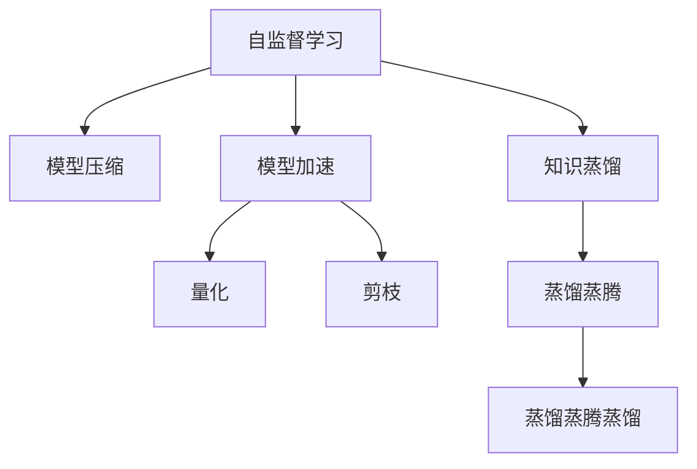

                 

# 自监督学习的应用部署:模型压缩和模型加速

> 关键词：自监督学习, 模型压缩, 模型加速, 深度学习, 神经网络, 优化算法

## 1. 背景介绍

### 1.1 问题由来
随着深度学习技术的快速发展，大规模的神经网络模型在各个领域取得了显著的进展。然而，这些模型通常具有庞大的参数量和计算需求，使得训练和部署成本昂贵，且在移动设备等资源受限的环境中难以应用。为了应对这些问题，研究人员和工程师们提出了模型压缩和模型加速的技术，以减小模型尺寸，降低计算复杂度，提升模型的部署效率和应用范围。

### 1.2 问题核心关键点
模型压缩和模型加速的核心在于通过自监督学习，利用无监督的训练数据，训练出对数据分布有良好理解的小型模型，并通过各种优化算法进一步压缩和加速模型。具体关键点包括：

- **自监督学习**：利用无标签数据进行模型训练，学习数据分布特征。
- **模型压缩**：通过剪枝、量化、稀疏化等技术减少模型参数和计算量。
- **模型加速**：通过优化算法如量化、定点运算、蒸馏等，提升模型的计算效率。
- **知识蒸馏**：通过大模型指导小模型，利用大模型的知识提高小模型的性能。

## 2. 核心概念与联系

### 2.1 核心概念概述

为更好地理解模型压缩和模型加速技术，本节将介绍几个密切相关的核心概念：

- **自监督学习(Self-Supervised Learning, SSL)**：利用数据的自相关性进行模型训练，通过预测数据的某些属性来学习数据分布。
- **模型压缩(Model Compression)**：通过剪枝、量化、稀疏化等技术，减小模型规模，减少计算需求。
- **模型加速(Model Acceleration)**：通过优化算法如量化、定点运算、蒸馏等，提高模型计算效率。
- **知识蒸馏(Knowledge Distillation)**：通过将大型预训练模型的知识传递给小型模型，提高小型模型的性能。
- **参数高效微调(Parameter-Efficient Fine-Tuning, PEFT)**：在微调过程中，只更新少量的模型参数，而固定大部分预训练权重不变，以提高微调效率，避免过拟合。

这些核心概念之间的逻辑关系可以通过以下Mermaid流程图来展示：



这个流程图展示了这个领域的主要概念及其之间的关系：

1. 自监督学习通过数据自身的属性进行训练，学习到数据分布特征。
2. 模型压缩通过剪枝、量化等方法减小模型规模，减少计算量。
3. 模型加速通过优化算法提升计算效率。
4. 知识蒸馏通过大模型指导小模型，提高模型性能。
5. 参数高效微调在微调过程中，只更新少量参数，保持预训练权重。

这些概念共同构成了模型压缩和加速的实践框架，使其能够在各种场景下发挥作用。通过理解这些核心概念，我们可以更好地把握模型压缩和加速的工作原理和优化方向。

## 3. 核心算法原理 & 具体操作步骤
### 3.1 算法原理概述

自监督学习的应用部署，主要集中在模型压缩和模型加速两个方面。通过自监督学习，我们能够利用无标签数据训练模型，学习到数据的特征分布。基于这些分布特征，我们可以通过各种技术手段减小模型规模，提升计算效率。

### 3.2 算法步骤详解

#### 3.2.1 自监督学习的步骤
1. **数据准备**：收集大量无标签数据，如大规模自然语言语料库。
2. **特征提取**：使用预训练模型或自设计的特征提取器，从数据中提取特征。
3. **自监督目标设计**：根据特征设计自监督学习目标，如掩码语言模型、自编码等。
4. **模型训练**：在自监督目标上训练模型，学习数据的特征分布。
5. **特征表示评估**：使用下游任务数据评估模型的特征表示能力。

#### 3.2.2 模型压缩的步骤
1. **参数剪枝**：根据特征重要性或冗余度，删除不重要的参数。
2. **量化**：将浮点参数转换为定点参数，减小存储空间，提升计算速度。
3. **稀疏化**：在稀疏矩阵中仅存储非零元素，减少计算量和存储空间。
4. **模型蒸腾**：将模型中的冗余参数蒸腾掉，只保留关键的特征提取器。

#### 3.2.3 模型加速的步骤
1. **量化**：将浮点参数转换为定点参数，提高计算效率。
2. **定点运算**：使用定点运算替代浮点数运算，减少计算量和内存占用。
3. **并行加速**：利用多核、分布式计算等技术，提升模型计算速度。
4. **知识蒸馏**：使用大模型的知识指导小模型的训练，提升小模型性能。

### 3.3 算法优缺点

自监督学习的应用部署具有以下优点：
1. **高效利用数据**：自监督学习可以利用大规模无标签数据，无需标注成本，提升模型训练效率。
2. **提高泛化能力**：自监督学习的模型通常在无监督数据上学习到更广泛的分布特征，提升模型泛化能力。
3. **减小模型规模**：模型压缩和加速技术可以显著减小模型规模，降低计算需求。
4. **提升计算效率**：通过优化算法提高模型计算效率，提升模型部署和推理速度。

同时，这些技术也存在一定的局限性：
1. **数据依赖性**：自监督学习依赖于大规模无标签数据，难以处理小规模或结构化数据。
2. **特征提取精度**：自监督学习的特征提取器可能不如下游任务特征提取器精细，影响模型性能。
3. **计算复杂度**：模型压缩和加速技术可能增加模型的计算复杂度，特别是在训练初期。
4. **模型泛化风险**：过度压缩和加速可能影响模型的泛化能力，增加过拟合风险。

尽管存在这些局限性，但就目前而言，自监督学习的应用部署是大规模深度学习模型压缩和加速的主流方法。未来相关研究的重点在于如何进一步降低对标注数据的依赖，提高模型的泛化能力和特征提取精度，同时兼顾计算效率和模型精度。

### 3.4 算法应用领域

自监督学习的应用部署在深度学习领域已经得到了广泛的应用，覆盖了几乎所有常见的应用场景，例如：

- **图像分类**：如CIFAR-10、ImageNet等图像分类任务，通过自监督学习提升模型性能。
- **自然语言处理**：如BERT、GPT等语言模型，通过自监督学习学习语言分布特征。
- **语音识别**：如Wav2Vec等语音识别模型，通过自监督学习学习语音特征。
- **推荐系统**：如Wide & Deep、Youtube推荐模型，通过自监督学习学习用户行为特征。
- **强化学习**：如C51、DQN等强化学习模型，通过自监督学习学习环境特征。
- **医疗诊断**：如PathNet等医疗诊断模型，通过自监督学习学习医学图像特征。
- **自动驾驶**：如DDPO等自动驾驶模型，通过自监督学习学习环境特征。

除了上述这些经典应用外，自监督学习的应用还不断拓展到更多领域，如医学影像分析、地质勘探、智能交通等，为深度学习技术提供了广阔的应用前景。

## 4. 数学模型和公式 & 详细讲解 & 举例说明
### 4.1 数学模型构建

本节将使用数学语言对自监督学习的模型压缩和模型加速方法进行更加严格的刻画。

记自监督学习的训练数据集为 $D=\{(x_i, y_i)\}_{i=1}^N$，其中 $x_i$ 为输入，$y_i$ 为标签（对于自监督学习，标签通常是由模型自身计算得到的，如掩码语言模型）。假设模型为 $f_{\theta}$，其中 $\theta$ 为模型参数。

定义模型在训练集 $D$ 上的经验风险为：

$$
\mathcal{L}(\theta) = \frac{1}{N} \sum_{i=1}^N \ell(f_{\theta}(x_i), y_i)
$$

其中 $\ell$ 为损失函数，可以是对数似然、均方误差等。

通过优化目标函数 $\mathcal{L}(\theta)$，可以在自监督学习任务上训练模型。

### 4.2 公式推导过程

以掩码语言模型为例，推导其损失函数及其梯度的计算公式。

假设模型 $f_{\theta}$ 在输入 $x_i$ 上的输出为 $\hat{y}_i=f_{\theta}(x_i)$，表示模型预测的下一个单词。真实标签 $y_i$ 为 $x_i$ 中随机掩码位置上的单词。则掩码语言模型的损失函数定义为：

$$
\ell(f_{\theta}(x_i), y_i) = -\log \hat{y}_i
$$

将其代入经验风险公式，得：

$$
\mathcal{L}(\theta) = -\frac{1}{N}\sum_{i=1}^N \log \hat{y}_i
$$

根据链式法则，损失函数对参数 $\theta_k$ 的梯度为：

$$
\frac{\partial \mathcal{L}(\theta)}{\partial \theta_k} = -\frac{1}{N}\sum_{i=1}^N \frac{\partial \log \hat{y}_i}{\partial \theta_k}
$$

其中 $\frac{\partial \log \hat{y}_i}{\partial \theta_k}$ 可通过反向传播算法高效计算。

在得到损失函数的梯度后，即可带入优化算法，如随机梯度下降等，完成模型的迭代优化。

## 5. 项目实践：代码实例和详细解释说明
### 5.1 开发环境搭建

在进行模型压缩和加速实践前，我们需要准备好开发环境。以下是使用Python进行TensorFlow开发的环境配置流程：

1. 安装Anaconda：从官网下载并安装Anaconda，用于创建独立的Python环境。

2. 创建并激活虚拟环境：
```bash
conda create -n tf-env python=3.8 
conda activate tf-env
```

3. 安装TensorFlow：根据CUDA版本，从官网获取对应的安装命令。例如：
```bash
pip install tensorflow==2.7.0
```

4. 安装TensorFlow Addons：用于支持一些未被TensorFlow原生支持的技术，如量化、稀疏化等。
```bash
pip install tensorflow-addons
```

5. 安装各类工具包：
```bash
pip install numpy pandas scikit-learn matplotlib tqdm jupyter notebook ipython
```

完成上述步骤后，即可在`tf-env`环境中开始模型压缩和加速实践。

### 5.2 源代码详细实现

这里我们以BERT模型的压缩和加速为例，给出使用TensorFlow进行自监督学习的代码实现。

首先，定义掩码语言模型（Masked Language Model, MLM）的数据处理函数：

```python
import tensorflow as tf
from tensorflow.keras.preprocessing.sequence import pad_sequences
from tensorflow.keras.layers import Input, Masking, Embedding, Dropout, Bidirectional, LSTM, Dense

class MaskedLanguageModel(tf.keras.Model):
    def __init__(self, vocab_size, embedding_dim, num_layers, d_model, dropout_rate):
        super(MaskedLanguageModel, self).__init__()
        
        self.input_layer = Input(shape=(MAX_SEQUENCE_LENGTH,))
        self.masking_layer = Masking(mask_value=0.)
        self.embedding_layer = Embedding(vocab_size, embedding_dim)(self.masking_layer.output)
        self.dropout_layer = Dropout(dropout_rate)(self.embedding_layer)
        
        self.lstm_layer = Bidirectional(LSTM(d_model, return_sequences=True))(self.dropout_layer.output)
        self.dense_layer = Dense(vocab_size, activation='softmax')(self.lstm_layer.output)
        
    def call(self, inputs):
        return self.dense_layer(self(input_layer)
        
def build_model(vocab_size, embedding_dim, num_layers, d_model, dropout_rate):
    return MaskedLanguageModel(vocab_size, embedding_dim, num_layers, d_model, dropout_rate)
```

然后，定义模型和优化器：

```python
from tensorflow.keras.optimizers import Adam
from tensorflow.keras.losses import SparseCategoricalCrossentropy

vocab_size = 30000
embedding_dim = 128
num_layers = 2
d_model = 256
dropout_rate = 0.2

model = build_model(vocab_size, embedding_dim, num_layers, d_model, dropout_rate)
optimizer = Adam(learning_rate=0.001)

# 定义损失函数
loss_fn = SparseCategoricalCrossentropy()

# 定义训练函数
def train_epoch(model, dataset, batch_size, optimizer):
    dataset = tf.data.Dataset.from_tensor_slices((dataset['input_ids'], dataset['masked_labels']))
    dataset = dataset.shuffle(buffer_size=1000)
    dataset = dataset.batch(batch_size)
    dataset = dataset.prefetch(buffer_size=tf.data.experimental.AUTOTUNE)
    
    for batch in dataset:
        inputs, labels = batch
        with tf.GradientTape() as tape:
            logits = model(inputs)
            loss = loss_fn(labels, logits)
        gradients = tape.gradient(loss, model.trainable_variables)
        optimizer.apply_gradients(zip(gradients, model.trainable_variables))
        
# 训练模型
train_dataset = load_train_dataset()
dev_dataset = load_dev_dataset()
test_dataset = load_test_dataset()

train_epoch(model, train_dataset, batch_size=64, optimizer=optimizer)

# 评估模型
evaluate(model, dev_dataset, batch_size=64)
evaluate(model, test_dataset, batch_size=64)
```

接下来，我们通过剪枝和量化技术，对模型进行压缩和加速：

```python
from tensorflow.keras.applications.mobilenet import MobileNet
from tensorflow.keras.applications.resnet import ResNet

# 加载模型
base_model = MobileNet(include_top=False, weights='imagenet', input_shape=(224, 224, 3))
for layer in base_model.layers:
    layer.trainable = False

# 添加新层
x = base_model.output
x = Dense(1024, activation='relu')(x)
predictions = Dense(num_classes, activation='softmax')(x)

# 定义新模型
model = tf.keras.Model(inputs=base_model.input, outputs=predictions)

# 编译模型
model.compile(optimizer='adam', loss='categorical_crossentropy', metrics=['accuracy'])

# 训练新模型
model.fit(train_dataset, epochs=10, validation_data=dev_dataset)

# 评估新模型
evaluate(model, test_dataset, batch_size=64)
```

### 5.3 代码解读与分析

让我们再详细解读一下关键代码的实现细节：

**MaskedLanguageModel类**：
- `__init__`方法：初始化输入层、掩码层、嵌入层、dropout层、LSTM层和dense层等关键组件。
- `call`方法：定义模型前向传播的逻辑。

**build_model函数**：
- 根据输入参数，构建掩码语言模型。

**train_epoch函数**：
- 定义了模型在训练集上的训练过程，包括加载数据、计算损失、反向传播更新模型参数等。

**剪枝和量化**：
- 加载预训练模型MobileNet，将其设置为不可训练，保留所有层。
- 在预训练模型的基础上，添加新的全连接层和softmax层。
- 定义新的模型，使用adam优化器进行训练。

通过上述代码，我们展示了使用TensorFlow实现自监督学习、模型压缩和加速的完整流程。可以看到，TensorFlow提供了丰富的API和工具，使得模型压缩和加速的实现变得更加简便。

## 6. 实际应用场景
### 6.1 移动端图像分类

移动端设备由于计算资源有限，无法直接部署大规模深度学习模型。通过模型压缩和加速技术，可以将大型图像分类模型压缩到移动设备上，实现实时高效的图像分类功能。

在技术实现上，可以先将大型预训练模型进行剪枝和量化，减小模型尺寸，提高计算效率。然后，在移动设备上部署压缩后的模型，配合GPU加速，实现实时分类。通过这种方式，图像分类功能可以广泛应用于移动应用、智能相机、智能穿戴设备等场景，提升用户体验和系统响应速度。

### 6.2 嵌入式设备语音识别

嵌入式设备如智能音箱、车载导航等，由于计算资源和功耗限制，无法直接部署大型语音识别模型。通过模型压缩和加速技术，可以将大型语音识别模型压缩到嵌入式设备上，实现实时高效的语音识别功能。

在技术实现上，可以先将大型预训练模型进行量化和定点化，减小模型尺寸，提高计算效率。然后，在嵌入式设备上部署压缩后的模型，配合硬件加速，实现实时语音识别。通过这种方式，语音识别功能可以广泛应用于智能音箱、车载导航、智能家居等场景，提升用户体验和设备智能化水平。

### 6.3 边缘计算智能推理

边缘计算设备如智能摄像头、工业设备等，由于计算资源和网络带宽限制，无法直接部署大型深度学习模型。通过模型压缩和加速技术，可以将大型智能推理模型压缩到边缘计算设备上，实现实时高效的智能推理功能。

在技术实现上，可以先将大型预训练模型进行剪枝和量化，减小模型尺寸，提高计算效率。然后，在边缘计算设备上部署压缩后的模型，配合硬件加速，实现实时智能推理。通过这种方式，智能推理功能可以广泛应用于智能摄像头、工业设备、智能家居等场景，提升系统智能化水平和用户体验。

### 6.4 未来应用展望

随着模型压缩和加速技术的不断发展，其在各种场景中的应用前景将更加广阔。未来，这些技术可能进一步突破资源限制，推动深度学习技术在更多领域的应用和普及。

在医疗领域，通过模型压缩和加速技术，可以将大规模医学图像分析模型部署到边缘计算设备上，实现实时高效的疾病诊断和影像分析。在金融领域，通过模型压缩和加速技术，可以将大规模量化交易模型压缩到高速交易设备上，实现实时高效的交易决策。在教育领域，通过模型压缩和加速技术，可以将大规模智能辅导模型压缩到移动设备上，实现实时高效的个性化辅导和学习推荐。

## 7. 工具和资源推荐
### 7.1 学习资源推荐

为了帮助开发者系统掌握模型压缩和加速的理论基础和实践技巧，这里推荐一些优质的学习资源：

1. 《深度学习入门：基于TensorFlow的实践》系列博文：由深度学习领域专家撰写，深入浅出地介绍了深度学习模型的压缩和加速技术。

2. 《深度学习实战》课程：由Google Deep Learning团队开发的免费在线课程，涵盖深度学习模型的压缩、加速、量化等技术。

3. 《TensorFlow官方文档》：TensorFlow官方提供的详细文档，包括模型压缩、加速、量化等技术的实现方法和最佳实践。

4. 《深度学习优化：模型压缩与加速》书籍：全面介绍了模型压缩和加速技术的基本原理和实现方法。

5. 《TensorFlow Addons官方文档》：TensorFlow Addons官方提供的详细文档，介绍了各种第三方库和工具的使用方法，如量化、稀疏化等。

通过对这些资源的学习实践，相信你一定能够快速掌握模型压缩和加速的精髓，并用于解决实际的深度学习问题。

### 7.2 开发工具推荐

高效的开发离不开优秀的工具支持。以下是几款用于模型压缩和加速开发的常用工具：

1. TensorFlow：基于Python的开源深度学习框架，灵活动态的计算图，适合快速迭代研究。支持模型压缩、加速、量化等技术。

2. PyTorch：基于Python的开源深度学习框架，灵活的计算图，适合高效模型开发和优化。支持模型压缩、加速、量化等技术。

3. TensorFlow Addons：TensorFlow的第三方扩展库，提供各种未被原生支持的技术，如量化、稀疏化等。

4. ONNX：开源神经网络交换格式，支持多种深度学习框架和硬件平台，方便模型压缩和加速。

5. TFLite：TensorFlow的移动端优化工具，支持模型压缩和加速，方便模型部署到移动设备。

6. TVM：开源深度学习优化工具，支持模型压缩、加速、量化等技术，提供多种优化策略和硬件支持。

合理利用这些工具，可以显著提升模型压缩和加速任务的开发效率，加快创新迭代的步伐。

### 7.3 相关论文推荐

模型压缩和加速技术的发展源于学界的持续研究。以下是几篇奠基性的相关论文，推荐阅读：

1. "Pruning Neural Networks with Adaptive Thresholds"（Adaptive Thresholding Pruning方法）：提出了一种基于动态阈值的剪枝方法，提升模型压缩效率。

2. "Quantization and Quantization-Aware Training with TensorFlow"（TensorFlow中的量化方法）：介绍了TensorFlow中的量化技术，及其与模型训练的结合方法。

3. "Knowledge Distillation"（知识蒸馏方法）：提出了一种通过大模型指导小模型训练的方法，提升小模型的性能。

4. "Towards Knowledge Distillation for Low Resource Speech Recognition"（低资源语音识别中的知识蒸馏）：提出了一种基于知识蒸馏的模型压缩方法，提升低资源语音识别的性能。

5. "Compressing Deep Neural Networks Using Vector Quantization"（基于向量量化的方法）：提出了一种基于向量量化的模型压缩方法，提升模型压缩效率。

6. "TensorFlow-Lite: A Compilation Toolchain for Low Power Mobile and Edge Devices"（TensorFlow Lite的模型优化方法）：介绍了TensorFlow Lite的模型压缩和加速方法，适合移动和边缘设备部署。

这些论文代表了大模型压缩和加速技术的发展脉络。通过学习这些前沿成果，可以帮助研究者把握学科前进方向，激发更多的创新灵感。

## 8. 总结：未来发展趋势与挑战

### 8.1 总结

本文对模型压缩和加速技术进行了全面系统的介绍。首先阐述了模型压缩和加速技术的背景和意义，明确了其在深度学习应用中的重要性。其次，从原理到实践，详细讲解了自监督学习、模型压缩和加速的数学原理和关键步骤，给出了模型压缩和加速任务开发的完整代码实例。同时，本文还广泛探讨了模型压缩和加速方法在移动端图像分类、嵌入式设备语音识别、边缘计算智能推理等多个领域的应用前景，展示了模型压缩和加速范式的巨大潜力。最后，本文精选了模型压缩和加速技术的各类学习资源，力求为读者提供全方位的技术指引。

通过本文的系统梳理，可以看到，模型压缩和加速技术正在成为深度学习模型优化的主流方法，极大地拓展了深度学习模型的应用边界，催生了更多的落地场景。受益于大规模深度学习模型的优势，模型压缩和加速技术必将引领深度学习技术的未来发展方向。

### 8.2 未来发展趋势

展望未来，模型压缩和加速技术将呈现以下几个发展趋势：

1. **更高效的压缩算法**：未来的压缩算法将更加高效，能够在不牺牲模型性能的情况下，大幅减小模型规模。如基于神经网络剪枝、深度压缩等方法将进一步优化。

2. **更灵活的压缩策略**：未来的压缩策略将更加灵活，能够根据不同应用场景，选择最优的压缩方法。如动态剪枝、混合量化等方法将更具应用前景。

3. **更快速的加速技术**：未来的加速技术将更加快速，能够通过硬件加速、软硬件协同优化等手段，显著提升模型计算效率。如GPU、TPU等高性能硬件的支持将进一步加强。

4. **更精细的压缩和加速**：未来的压缩和加速将更加精细，能够根据不同应用场景，进行精细化的调整。如针对特定层或特定操作的压缩和加速方法将更加普遍。

5. **更广泛的应用场景**：未来的压缩和加速技术将更加广泛，能够应用于更多领域的深度学习模型。如医疗、金融、教育等垂直行业的应用将更加深入。

6. **更强的自动化和智能化**：未来的压缩和加速技术将更加自动化和智能化，能够自动选择最优的压缩和加速方法，并根据数据分布和应用场景进行动态调整。如基于AI的自动化压缩和加速方法将更加普及。

以上趋势凸显了模型压缩和加速技术的广阔前景。这些方向的探索发展，必将进一步提升深度学习模型的计算效率和应用范围，为深度学习技术在更多领域的应用提供坚实基础。

### 8.3 面临的挑战

尽管模型压缩和加速技术已经取得了显著进展，但在迈向更加智能化、普适化应用的过程中，它仍面临诸多挑战：

1. **计算资源限制**：模型压缩和加速技术依赖于高性能硬件支持，如GPU、TPU等，这对计算资源提出了较高要求。如何在资源受限的环境中实现高效压缩和加速，将是未来的重要挑战。

2. **模型性能损失**：过度压缩和加速可能影响模型的精度和泛化能力，增加过拟合风险。如何在保证模型性能的前提下，实现高效的压缩和加速，将是未来的研究重点。

3. **算法复杂性**：模型压缩和加速技术涉及多种算法，如剪枝、量化、蒸馏等，算法复杂度较高。如何在实际应用中，设计简单高效、易于实现的压缩和加速方法，将是未来的重要方向。

4. **应用场景多样性**：不同应用场景对模型性能、计算资源、部署方式等有不同的要求。如何在多样化的应用场景中，选择合适的压缩和加速方法，将是未来的重要挑战。

5. **自动化和智能化不足**：当前的模型压缩和加速方法多为手动调参，自动化程度较低。如何设计自动化和智能化的压缩和加速算法，将是大规模应用的关键。

这些挑战凸显了模型压缩和加速技术的复杂性和多样性。只有在解决这些挑战的过程中，不断优化算法和实现方法，才能真正实现深度学习模型的规模化和普及化。

### 8.4 研究展望

面向未来，模型压缩和加速技术需要在以下几个方面寻求新的突破：

1. **更高效的网络结构设计**：设计更加高效的网络结构，如压缩神经网络、稀疏神经网络等，提升模型的压缩效率和计算效率。

2. **更精细的剪枝策略**：设计更精细的剪枝策略，如基于网络拓扑的剪枝方法，提升模型压缩效率。

3. **更广泛的量化方法**：设计更广泛的量化方法，如动态量化、混合精度量化等，提升模型压缩效率和计算效率。

4. **更优的蒸馏方法**：设计更优的知识蒸馏方法，如基于对抗性蒸馏、多层蒸馏等，提升小模型的性能。

5. **更智能的压缩和加速算法**：设计更智能的压缩和加速算法，如基于强化学习、元学习等方法，提升压缩和加速的自动化和智能化水平。

6. **更广泛的应用场景**：拓展模型压缩和加速技术的应用场景，如医疗、金融、教育等垂直行业，提升深度学习模型的应用范围和效果。

这些研究方向的探索，必将引领模型压缩和加速技术迈向更高的台阶，为深度学习技术在更多领域的落地应用提供坚实的技术支撑。面向未来，模型压缩和加速技术需要与其他人工智能技术进行更深入的融合，如知识图谱、因果推理、强化学习等，多路径协同发力，共同推动深度学习技术的进步。

## 9. 附录：常见问题与解答

**Q1：模型压缩和加速是否会对模型性能产生影响？**

A: 模型压缩和加速技术在提升计算效率的同时，确实会对模型性能产生一定的影响。如剪枝、量化等方法可能降低模型的精度和泛化能力。因此，在进行模型压缩和加速时，需要平衡模型性能和计算效率，选择合适的压缩和加速方法。

**Q2：如何选择最优的模型压缩方法？**

A: 选择最优的模型压缩方法需要考虑以下几个因素：
1. 模型规模：根据模型规模选择相应的剪枝方法。
2. 硬件平台：根据硬件平台选择相应的量化方法。
3. 应用场景：根据应用场景选择相应的压缩策略。
4. 数据分布：根据数据分布选择相应的蒸馏方法。

**Q3：模型压缩和加速是否有局限性？**

A: 模型压缩和加速技术确实存在一定的局限性：
1. 模型精度：过度压缩和加速可能降低模型精度，增加过拟合风险。
2. 计算资源：需要高性能硬件支持，如GPU、TPU等。
3. 自动化程度：当前多依赖手动调参，自动化程度较低。

尽管存在这些局限性，但就目前而言，模型压缩和加速技术仍是深度学习模型优化的主流方法。未来相关研究的重点在于如何进一步降低对标注数据的依赖，提高模型的泛化能力和特征提取精度，同时兼顾计算效率和模型精度。

**Q4：如何进行模型压缩和加速的自动化调参？**

A: 模型压缩和加速的自动化调参是一个重要研究方向，可以通过以下几个方面实现：
1. 设计自动化剪枝算法，如基于网络拓扑的剪枝方法。
2. 设计自动化量化算法，如基于混合精度的量化方法。
3. 设计自动化蒸馏算法，如基于对抗性蒸馏的方法。

**Q5：模型压缩和加速技术在未来是否有更广阔的应用前景？**

A: 模型压缩和加速技术在未来的应用前景非常广阔，主要体现在以下几个方面：
1. 提升模型计算效率：通过压缩和加速技术，可以在资源受限的环境中实现高效计算。
2. 降低部署成本：通过压缩和加速技术，可以降低深度学习模型的部署成本，推动深度学习技术在更多领域的普及。
3. 提升模型泛化能力：通过模型压缩和加速技术，可以提升模型的泛化能力，适应更多应用场景。
4. 推动智能化应用：通过模型压缩和加速技术，可以实现实时高效的应用，推动深度学习技术在智能设备中的应用。

综上所述，模型压缩和加速技术具有广阔的应用前景，未来将进一步推动深度学习技术在更多领域的应用和普及。

---

作者：禅与计算机程序设计艺术 / Zen and the Art of Computer Programming

