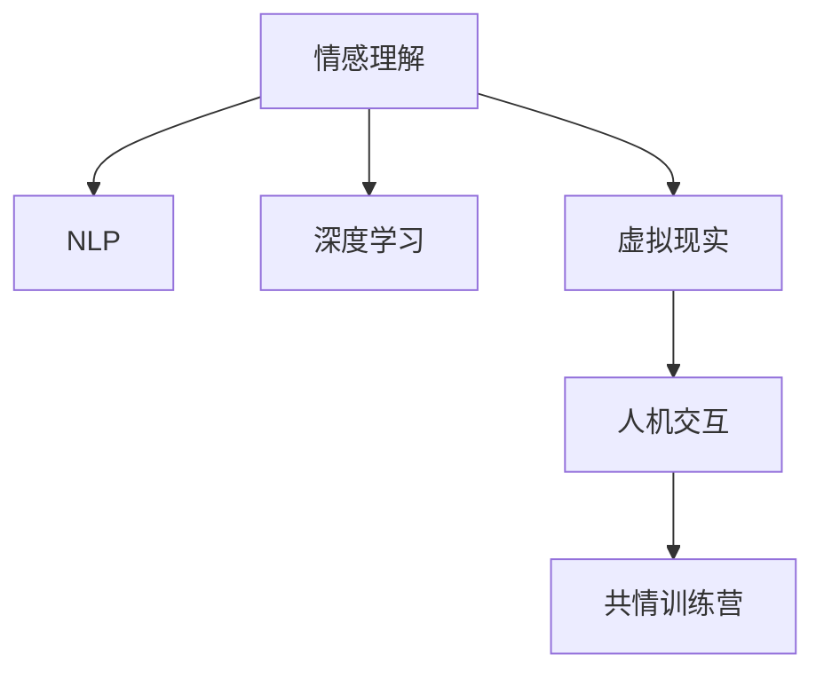

                 

# 虚拟共情训练营：AI增强的情感理解课程

> 关键词：虚拟现实(VR)、共情训练、情感理解、AI增强、自然语言处理(NLP)、深度学习、情绪识别、人机交互

## 1. 背景介绍

### 1.1 问题由来
随着科技的迅猛发展和人类对情感需求的日益增长，情感理解（Emotion Understanding）技术正逐渐成为人工智能（AI）领域的前沿研究方向。情感理解不仅在社交媒体分析、客户服务、健康医疗等领域具有重要应用价值，还被广泛应用于虚拟现实（VR）、增强现实（AR）等新兴技术中，以实现更加人性化的用户体验和情感交互。然而，当前情感理解技术在实际应用中仍存在许多挑战，如数据稀缺、模型鲁棒性差、理解上下文复杂等。

### 1.2 问题核心关键点
- **情感理解与人工智能**：情感理解是人工智能中自然语言处理（NLP）和计算机视觉等领域的交叉应用，旨在通过机器学习模型自动识别和理解人类情感。
- **虚拟现实（VR）中的情感交互**：VR技术通过模拟真实世界，使人们能够以沉浸式体验进行交互，但如何准确感知用户情感，仍是亟待解决的问题。
- **AI增强的共情训练营**：AI辅助的情感理解课程，通过虚拟现实技术实现情感认知训练，提升学习者的共情能力，推动情感理解技术在实际应用中的落地。

### 1.3 问题研究意义
研究情感理解与AI增强的共情训练营，对于提升人类情感识别和理解能力、推动情感技术在多领域中的应用具有重要意义：

- **改善用户体验**：通过准确感知用户情感，提升人机交互的友好度，增强用户的沉浸感和满意度。
- **提升健康医疗水平**：帮助医生更好地理解患者的情绪状态，辅助诊断和治疗，改善患者体验。
- **促进社会和谐**：帮助人们更好地理解他人的情感，促进沟通与协作，构建和谐的社会环境。
- **推动技术创新**：推动情感理解技术在VR、AR、社交媒体等新兴领域的应用，探索新的人机交互模式。
- **满足人类情感需求**：在现代社会中，情感需求日益突出，通过情感理解技术满足人们深层次的情感需求，提升幸福感。

## 2. 核心概念与联系

### 2.1 核心概念概述

为更好地理解情感理解与AI增强的共情训练营技术，本节将介绍几个密切相关的核心概念：

- **情感理解（Emotion Understanding）**：通过机器学习模型识别和理解人类情感，如愤怒、快乐、悲伤等。
- **自然语言处理（NLP）**：研究如何让计算机理解、处理和生成人类语言，是情感理解的重要技术基础。
- **深度学习（Deep Learning）**：利用多层神经网络模拟人脑神经网络处理复杂信息，广泛应用于情感识别和理解。
- **虚拟现实（VR）**：通过模拟真实世界，为用户提供沉浸式体验，是情感理解的重要应用场景。
- **人机交互（HCI）**：研究如何让机器理解人类情感和行为，提供更加人性化的交互体验。

这些核心概念之间的逻辑关系可以通过以下Mermaid流程图来展示：



这个流程图展示了几大核心概念之间的关系：

1. 情感理解依赖NLP和深度学习技术，通过学习语言数据获取情感信息。
2. 虚拟现实为情感理解提供应用场景，实现沉浸式情感交互。
3. 人机交互技术提升用户与机器的互动体验，进一步推动情感理解技术的发展。

## 3. 核心算法原理 & 具体操作步骤
### 3.1 算法原理概述

AI增强的共情训练营课程通过虚拟现实技术，结合情感理解技术，提供沉浸式情感认知训练。其核心原理包括以下几个关键步骤：

1. **情感数据的收集与标注**：通过问卷调查、面部表情识别、语言分析等方式收集情感数据，并标注出相应的情感类别。
2. **情感识别模型的训练**：使用深度学习模型对收集的情感数据进行训练，学习情感与文本、面部表情等特征的映射关系。
3. **情感理解模型的微调**：在已有情感识别模型的基础上，使用微调技术（如Fine-tuning）对模型进行优化，提升其在特定情境下的情感理解能力。
4. **虚拟现实环境下的情感交互**：通过虚拟现实技术，创建一个沉浸式的情感交互环境，使用户能够在虚拟世界中体验情感认知训练。
5. **情感反馈与强化学习**：通过用户反馈，不断调整情感理解模型和训练方法，提升模型的准确性和鲁棒性。

### 3.2 算法步骤详解

AI增强的共情训练营课程的具体操作步骤如下：

**Step 1: 准备情感数据集**
- 收集情感数据，包括文本、面部表情、语音等，并标注出相应的情感类别。
- 将数据集划分为训练集、验证集和测试集。

**Step 2: 选择情感识别模型**
- 选择合适的情感识别模型，如BERT、VGGNet等，作为情感理解的初始模型。
- 使用预训练模型或从零开始训练，获取初始情感理解模型。

**Step 3: 数据增强与预处理**
- 对情感数据进行增强处理，如数据扩充、回译、对抗样本生成等，丰富数据集。
- 进行数据预处理，包括文本分词、归一化、数据标准化等。

**Step 4: 情感理解模型的微调**
- 使用微调技术对情感理解模型进行优化，选择合适的学习率、批大小、迭代轮数等超参数。
- 使用损失函数和优化算法（如AdamW、SGD等）更新模型参数。
- 在验证集上评估模型性能，进行参数调整。

**Step 5: 虚拟现实环境搭建**
- 利用虚拟现实技术，创建沉浸式情感认知训练环境。
- 在虚拟环境中加入情感反馈机制，如情绪识别、情绪表情反馈等。

**Step 6: 情感认知训练**
- 在虚拟环境中进行情感认知训练，用户通过虚拟现实设备体验情感交互。
- 训练过程中不断收集用户反馈，优化情感理解模型。

**Step 7: 模型评估与部署**
- 在测试集上评估训练后的情感理解模型性能，对比微调前后的效果。
- 将模型部署到实际应用中，用于情感理解和交互。

### 3.3 算法优缺点

AI增强的共情训练营课程在情感理解与虚拟现实结合方面具有以下优点：

1. **沉浸式体验**：虚拟现实技术提供沉浸式体验，提升情感认知训练效果。
2. **多模态数据利用**：结合文本、语音、面部表情等多种数据，提升情感理解的准确性。
3. **动态调整**：通过用户反馈和强化学习，不断优化情感理解模型。
4. **低成本**：虚拟现实环境可以减少实际应用中的成本，提供高效情感认知训练。

同时，该方法也存在一定的局限性：

1. **硬件要求高**：虚拟现实设备可能成本较高，限制了应用的普及性。
2. **技术门槛高**：情感理解技术复杂，需要专业知识和经验。
3. **伦理风险**：虚拟环境中可能存在隐私和安全问题，需要谨慎处理。
4. **用户适应性**：部分用户可能不适应虚拟现实环境，影响训练效果。

尽管存在这些局限性，但AI增强的共情训练营课程在情感理解技术研究和应用上仍具有重要价值。

### 3.4 算法应用领域

AI增强的共情训练营课程在多个领域具有广泛的应用前景，例如：

- **健康医疗**：帮助医生更好地理解患者情绪，辅助诊断和治疗，改善患者体验。
- **客户服务**：通过情感理解提升客服人员的服务质量，提高用户满意度。
- **教育培训**：提供沉浸式情感认知训练，帮助学习者提升共情能力。
- **游戏娱乐**：通过情感理解增强游戏体验，实现更加个性化的互动。
- **社交媒体分析**：帮助理解用户在社交媒体上的情感状态，进行舆情监控。

## 4. 数学模型和公式 & 详细讲解 & 举例说明

### 4.1 数学模型构建

情感理解的数学模型主要由以下几个部分构成：

- **输入**：文本、面部表情、语音等情感数据。
- **输出**：情感类别（如愤怒、快乐、悲伤等）。
- **模型**：情感识别和理解模型，如BERT、VGGNet等深度学习模型。

### 4.2 公式推导过程

以BERT情感识别模型为例，其核心公式为：

$$
y = \text{Softmax}(\text{MLP}(\text{CLS}(\text{Encoder}(x))))
$$

其中，$x$ 为输入数据，$\text{CLS}$ 为BERT模型的分类器输出，$\text{MLP}$ 为多层感知器（Multilayer Perceptron），$\text{Softmax}$ 为归一化指数函数，$y$ 为情感类别概率向量。

### 4.3 案例分析与讲解

假设我们有一组情感数据，每条数据包含一段文本和对应的情感标签：

| 文本 | 情感标签 |
|------|----------|
| 我很生气 | 愤怒 |
| 我今天很高兴 | 快乐 |
| 我觉得很伤心 | 悲伤 |

使用BERT模型进行情感识别，其训练过程包括：

1. 对文本进行分词，生成输入序列。
2. 将输入序列送入BERT模型，通过多个编码层和池化层提取特征。
3. 将池化层的输出送入分类器，输出情感类别概率向量。
4. 使用交叉熵损失函数计算预测结果与真实标签之间的差异。
5. 使用优化算法（如AdamW）更新模型参数，最小化损失函数。

最终，我们可以得到情感识别的模型参数，用于后续的情感理解训练和应用。

## 5. 项目实践：代码实例和详细解释说明
### 5.1 开发环境搭建

在进行情感理解与AI增强的共情训练营项目实践前，我们需要准备好开发环境。以下是使用Python进行PyTorch开发的环境配置流程：

1. 安装Anaconda：从官网下载并安装Anaconda，用于创建独立的Python环境。

2. 创建并激活虚拟环境：
```bash
conda create -n emotion-env python=3.8 
conda activate emotion-env
```

3. 安装PyTorch：根据CUDA版本，从官网获取对应的安装命令。例如：
```bash
conda install pytorch torchvision torchaudio cudatoolkit=11.1 -c pytorch -c conda-forge
```

4. 安装TensorFlow：
```bash
conda install tensorflow
```

5. 安装TensorBoard：
```bash
pip install tensorboard
```

6. 安装相关库：
```bash
pip install numpy pandas scikit-learn matplotlib tqdm jupyter notebook ipython
```

完成上述步骤后，即可在`emotion-env`环境中开始项目实践。

### 5.2 源代码详细实现

这里我们以情感理解中的情感分类任务为例，给出使用Transformers库进行情感分类的PyTorch代码实现。

首先，定义情感分类任务的数据处理函数：

```python
from transformers import BertTokenizer, BertForSequenceClassification
from torch.utils.data import Dataset
import torch

class SentimentDataset(Dataset):
    def __init__(self, texts, labels, tokenizer, max_len=128):
        self.texts = texts
        self.labels = labels
        self.tokenizer = tokenizer
        self.max_len = max_len
        
    def __len__(self):
        return len(self.texts)
    
    def __getitem__(self, item):
        text = self.texts[item]
        label = self.labels[item]
        
        encoding = self.tokenizer(text, return_tensors='pt', max_length=self.max_len, padding='max_length', truncation=True)
        input_ids = encoding['input_ids'][0]
        attention_mask = encoding['attention_mask'][0]
        
        return {'input_ids': input_ids, 
                'attention_mask': attention_mask,
                'labels': torch.tensor(label, dtype=torch.long)}
```

然后，定义模型和优化器：

```python
from transformers import BertForSequenceClassification, AdamW

model = BertForSequenceClassification.from_pretrained('bert-base-cased', num_labels=3)

optimizer = AdamW(model.parameters(), lr=2e-5)
```

接着，定义训练和评估函数：

```python
from torch.utils.data import DataLoader
from tqdm import tqdm
from sklearn.metrics import classification_report

device = torch.device('cuda') if torch.cuda.is_available() else torch.device('cpu')
model.to(device)

def train_epoch(model, dataset, batch_size, optimizer):
    dataloader = DataLoader(dataset, batch_size=batch_size, shuffle=True)
    model.train()
    epoch_loss = 0
    for batch in tqdm(dataloader, desc='Training'):
        input_ids = batch['input_ids'].to(device)
        attention_mask = batch['attention_mask'].to(device)
        labels = batch['labels'].to(device)
        model.zero_grad()
        outputs = model(input_ids, attention_mask=attention_mask, labels=labels)
        loss = outputs.loss
        epoch_loss += loss.item()
        loss.backward()
        optimizer.step()
    return epoch_loss / len(dataloader)

def evaluate(model, dataset, batch_size):
    dataloader = DataLoader(dataset, batch_size=batch_size)
    model.eval()
    preds, labels = [], []
    with torch.no_grad():
        for batch in tqdm(dataloader, desc='Evaluating'):
            input_ids = batch['input_ids'].to(device)
            attention_mask = batch['attention_mask'].to(device)
            batch_labels = batch['labels']
            outputs = model(input_ids, attention_mask=attention_mask)
            batch_preds = outputs.logits.argmax(dim=2).to('cpu').tolist()
            batch_labels = batch_labels.to('cpu').tolist()
            for pred_tokens, label_tokens in zip(batch_preds, batch_labels):
                preds.append(pred_tokens)
                labels.append(label_tokens)
                
    print(classification_report(labels, preds))
```

最后，启动训练流程并在测试集上评估：

```python
epochs = 5
batch_size = 16

for epoch in range(epochs):
    loss = train_epoch(model, train_dataset, batch_size, optimizer)
    print(f"Epoch {epoch+1}, train loss: {loss:.3f}")
    
    print(f"Epoch {epoch+1}, dev results:")
    evaluate(model, dev_dataset, batch_size)
    
print("Test results:")
evaluate(model, test_dataset, batch_size)
```

以上就是使用PyTorch进行情感分类任务的完整代码实现。可以看到，通过Transformers库，情感分类的代码实现变得简洁高效。

### 5.3 代码解读与分析

让我们再详细解读一下关键代码的实现细节：

**SentimentDataset类**：
- `__init__`方法：初始化文本、标签、分词器等关键组件。
- `__len__`方法：返回数据集的样本数量。
- `__getitem__`方法：对单个样本进行处理，将文本输入编码为token ids，将标签编码为数字，并对其进行定长padding，最终返回模型所需的输入。

**训练和评估函数**：
- 使用PyTorch的DataLoader对数据集进行批次化加载，供模型训练和推理使用。
- 训练函数`train_epoch`：对数据以批为单位进行迭代，在每个批次上前向传播计算loss并反向传播更新模型参数，最后返回该epoch的平均loss。
- 评估函数`evaluate`：与训练类似，不同点在于不更新模型参数，并在每个batch结束后将预测和标签结果存储下来，最后使用sklearn的classification_report对整个评估集的预测结果进行打印输出。

**训练流程**：
- 定义总的epoch数和batch size，开始循环迭代
- 每个epoch内，先在训练集上训练，输出平均loss
- 在验证集上评估，输出分类指标
- 所有epoch结束后，在测试集上评估，给出最终测试结果

可以看到，PyTorch配合Transformers库使得情感分类的代码实现变得简洁高效。开发者可以将更多精力放在数据处理、模型改进等高层逻辑上，而不必过多关注底层的实现细节。

当然，工业级的系统实现还需考虑更多因素，如模型的保存和部署、超参数的自动搜索、更灵活的任务适配层等。但核心的情感理解与微调过程基本与此类似。

## 6. 实际应用场景
### 6.1 健康医疗

情感理解在健康医疗领域具有重要应用，特别是在心理健康评估和治疗方面。通过情感分析，医生可以更好地了解患者的情绪状态，辅助诊断和治疗，改善患者体验。例如，使用情感理解技术分析患者的在线咨询记录，识别其情感波动，提供针对性的心理疏导和治疗建议。

### 6.2 客户服务

客户服务领域中，情感理解技术可以帮助客服人员更好地理解用户情感，提供更加个性化和人性化的服务。例如，通过情感分析，客服系统可以自动识别用户情绪，快速响应并处理负面情绪，提升用户满意度。

### 6.3 教育培训

情感理解在教育培训领域也有广泛应用，特别是在情感认知训练和心理健康教育方面。通过虚拟现实技术，学生可以在沉浸式环境中进行情感认知训练，提升共情能力，改善人际交往能力。

### 6.4 未来应用展望

未来，情感理解技术将在更多领域得到应用，推动人机交互的智能化和情感化：

- **智能客服**：通过情感理解提升客服系统的智能化水平，实现更加精准的用户需求分析。
- **游戏娱乐**：通过情感分析，提供更加个性化的游戏体验，增强用户沉浸感。
- **社交媒体分析**：帮助理解用户在社交媒体上的情感状态，进行舆情监控和情感干预。
- **心理治疗**：通过情感理解辅助心理治疗，帮助患者更好地表达和理解自身情绪，促进心理健康。

随着情感理解技术的不断进步，未来必将有更多创新应用涌现，为人类社会带来深刻变革。

## 7. 工具和资源推荐
### 7.1 学习资源推荐

为了帮助开发者系统掌握情感理解与AI增强的共情训练营技术的理论基础和实践技巧，这里推荐一些优质的学习资源：

1. **《情感分析实战：深度学习与自然语言处理》**：一本介绍情感分析技术的实用书籍，包含大量案例和代码实现。
2. **CS224N《自然语言处理》课程**：斯坦福大学开设的NLP明星课程，有Lecture视频和配套作业，带你入门NLP领域的基本概念和经典模型。
3. **《情感计算基础》**：一本介绍情感计算技术的经典书籍，包含大量情感计算应用的案例分析。
4. **Kaggle竞赛平台**：一个数据科学竞赛平台，提供大量情感分析相关的数据集和挑战，帮助开发者实践情感理解技术。
5. **情感理解相关的开源项目**：如Sentiment Analysis, TextBlob等，提供情感理解模型的实现和应用示例。

通过对这些资源的学习实践，相信你一定能够快速掌握情感理解与AI增强的共情训练营技术的精髓，并用于解决实际的NLP问题。

### 7.2 开发工具推荐

高效的开发离不开优秀的工具支持。以下是几款用于情感理解与AI增强的共情训练营开发的常用工具：

1. **PyTorch**：基于Python的开源深度学习框架，灵活动态的计算图，适合快速迭代研究。大部分预训练语言模型都有PyTorch版本的实现。
2. **TensorFlow**：由Google主导开发的开源深度学习框架，生产部署方便，适合大规模工程应用。同样有丰富的预训练语言模型资源。
3. **Transformers库**：HuggingFace开发的NLP工具库，集成了众多SOTA语言模型，支持PyTorch和TensorFlow，是进行情感理解任务开发的利器。
4. **Weights & Biases**：模型训练的实验跟踪工具，可以记录和可视化模型训练过程中的各项指标，方便对比和调优。与主流深度学习框架无缝集成。
5. **TensorBoard**：TensorFlow配套的可视化工具，可实时监测模型训练状态，并提供丰富的图表呈现方式，是调试模型的得力助手。

合理利用这些工具，可以显著提升情感理解与AI增强的共情训练营任务的开发效率，加快创新迭代的步伐。

### 7.3 相关论文推荐

情感理解与AI增强的共情训练营技术的发展源于学界的持续研究。以下是几篇奠基性的相关论文，推荐阅读：

1. **《深度学习在情感分析中的应用》**：一篇介绍深度学习在情感分析中应用的综述论文，包含大量经典模型和案例。
2. **《基于深度学习的情感识别》**：一篇介绍基于深度学习的情感识别技术的论文，包含大量模型结构和算法。
3. **《情感计算与自然语言处理》**：一篇介绍情感计算与自然语言处理相结合的研究论文，包含大量情感计算应用的案例分析。
4. **《情感理解在社交媒体中的应用》**：一篇介绍情感理解在社交媒体中的应用研究论文，包含大量社交媒体数据分析的案例。
5. **《基于虚拟现实的情感认知训练》**：一篇介绍虚拟现实技术在情感认知训练中的应用研究论文，包含大量虚拟现实技术和情感认知训练的案例分析。

这些论文代表了大语言模型微调技术的发展脉络。通过学习这些前沿成果，可以帮助研究者把握学科前进方向，激发更多的创新灵感。

## 8. 总结：未来发展趋势与挑战

### 8.1 总结

本文对情感理解与AI增强的共情训练营技术进行了全面系统的介绍。首先阐述了情感理解与AI增强的共情训练营技术的研究背景和意义，明确了情感理解在多领域的应用价值。其次，从原理到实践，详细讲解了情感理解与AI增强的共情训练营的数学原理和关键步骤，给出了情感理解任务开发的完整代码实例。同时，本文还广泛探讨了情感理解技术在健康医疗、客户服务、教育培训等多个领域的应用前景，展示了情感理解技术在实际应用中的巨大潜力。

通过本文的系统梳理，可以看到，情感理解与AI增强的共情训练营技术正在成为情感智能领域的核心范式，极大地拓展了情感理解技术的应用边界，催生了更多的落地场景。未来，伴随情感理解技术的不断进步，情感技术必将在更多领域得到应用，为人类认知智能的进化带来深远影响。

### 8.2 未来发展趋势

展望未来，情感理解与AI增强的共情训练营技术将呈现以下几个发展趋势：

1. **深度融合多模态数据**：情感理解技术将结合视觉、语音、面部表情等多模态数据，提升情感认知的准确性。
2. **实时情感分析**：随着计算能力的提升，实时情感分析技术将变得更加成熟，应用场景将更加广泛。
3. **跨领域情感认知**：情感理解技术将在更多领域得到应用，推动人机交互的智能化和情感化。
4. **个性化情感训练**：通过个性化情感训练，提升情感认知的个性化和精准度，满足不同用户的情感需求。
5. **情感计算的标准化**：随着情感计算技术的普及，情感计算的标准化和规范化将成为重要课题。

以上趋势凸显了情感理解与AI增强的共情训练营技术的广阔前景。这些方向的探索发展，必将进一步提升情感理解技术在实际应用中的表现，推动情感技术在更多领域的应用。

### 8.3 面临的挑战

尽管情感理解与AI增强的共情训练营技术已经取得了瞩目成就，但在迈向更加智能化、普适化应用的过程中，它仍面临诸多挑战：

1. **数据稀缺**：情感数据相对稀缺，难以获得充足的高质量数据。如何利用少量数据训练高质量模型，仍是一大难题。
2. **鲁棒性不足**：情感理解模型对噪声和异常数据敏感，泛化性能往往不够理想。如何提高模型的鲁棒性，避免灾难性遗忘，还需要更多理论和实践的积累。
3. **可解释性不足**：情感理解模型的决策过程缺乏可解释性，难以解释其内部工作机制和决策逻辑。如何赋予模型更强的可解释性，将是亟待攻克的难题。
4. **伦理风险**：情感理解模型可能会学习到有害信息，造成误导性、歧视性的输出。如何从数据和算法层面消除模型偏见，确保输出的安全性，也将是重要的研究课题。

正视情感理解与AI增强的共情训练营技术面临的这些挑战，积极应对并寻求突破，将是大语言模型微调走向成熟的必由之路。相信随着学界和产业界的共同努力，这些挑战终将一一被克服，情感理解技术必将在构建人机协同的智能时代中扮演越来越重要的角色。

### 8.4 研究展望

面向未来，情感理解与AI增强的共情训练营技术需要在以下几个方向寻求新的突破：

1. **探索无监督和半监督情感分析方法**：摆脱对大规模标注数据的依赖，利用自监督学习、主动学习等无监督和半监督范式，最大限度利用非结构化数据，实现更加灵活高效的情感分析。
2. **研究参数高效和计算高效的情感理解范式**：开发更加参数高效的情感理解方法，在固定大部分预训练参数的同时，只更新极少量的任务相关参数。同时优化情感理解模型的计算图，减少前向传播和反向传播的资源消耗，实现更加轻量级、实时性的部署。
3. **融合因果和对比学习范式**：通过引入因果推断和对比学习思想，增强情感理解模型建立稳定因果关系的能力，学习更加普适、鲁棒的语言表征，从而提升模型泛化性和抗干扰能力。
4. **引入更多先验知识**：将符号化的先验知识，如知识图谱、逻辑规则等，与神经网络模型进行巧妙融合，引导情感理解过程学习更准确、合理的情感模型。
5. **结合因果分析和博弈论工具**：将因果分析方法引入情感理解模型，识别出模型决策的关键特征，增强输出解释的因果性和逻辑性。借助博弈论工具刻画人机交互过程，主动探索并规避模型的脆弱点，提高系统稳定性。
6. **纳入伦理道德约束**：在模型训练目标中引入伦理导向的评估指标，过滤和惩罚有害的输出倾向。加强人工干预和审核，建立模型行为的监管机制，确保输出符合人类价值观和伦理道德。

这些研究方向的探索，必将引领情感理解与AI增强的共情训练营技术迈向更高的台阶，为构建安全、可靠、可解释、可控的智能系统铺平道路。面向未来，情感理解与AI增强的共情训练营技术还需要与其他人工智能技术进行更深入的融合，如知识表示、因果推理、强化学习等，多路径协同发力，共同推动情感智能技术的发展。只有勇于创新、敢于突破，才能不断拓展情感理解的边界，让智能技术更好地造福人类社会。

## 9. 附录：常见问题与解答

**Q1：情感理解与AI增强的共情训练营技术是否适用于所有应用场景？**

A: 情感理解与AI增强的共情训练营技术在大多数情感认知和情绪管理相关的应用场景中都能取得不错的效果。但对于一些特定领域的应用，如军事、政治等，情感理解技术的应用可能存在隐私和安全问题，需要谨慎处理。

**Q2：如何选择情感理解与AI增强的共情训练营模型的超参数？**

A: 情感理解与AI增强的共情训练营模型的超参数选择通常包括以下几个方面：
1. 学习率：一般建议从1e-5开始调参，逐步减小学习率，直至收敛。
2. 批大小：一般建议在16-32之间，过小的批大小可能导致模型难以收敛，过大的批大小可能增加计算开销。
3. 迭代轮数：一般建议根据数据量和模型复杂度进行设定，避免过拟合和欠拟合。

这些超参数的选择通常需要通过试验和对比得出最优解。

**Q3：情感理解与AI增强的共情训练营技术在实际应用中需要注意哪些问题？**

A: 情感理解与AI增强的共情训练营技术在实际应用中需要注意以下问题：
1. 数据隐私：情感数据涉及用户隐私，需要采取严格的隐私保护措施，确保数据安全。
2. 伦理风险：情感理解模型可能学习到有害信息，需要进行伦理审查和监管。
3. 鲁棒性：情感理解模型对噪声和异常数据敏感，需要采取鲁棒性优化策略。
4. 可解释性：情感理解模型的决策过程缺乏可解释性，需要开发可解释性强的模型。

这些问题的解决需要跨学科的合作和多方利益相关者的共同努力。

**Q4：情感理解与AI增强的共情训练营技术如何与其他AI技术结合？**

A: 情感理解与AI增强的共情训练营技术可以与其他AI技术进行深度结合，如：
1. 自然语言处理：情感理解结合NLP技术，实现情感文本分析。
2. 计算机视觉：情感理解结合视觉技术，实现面部表情和手势分析。
3. 强化学习：情感理解结合强化学习，实现情感认知的动态调整和优化。
4. 语音处理：情感理解结合语音识别技术，实现语音情感分析。
5. 知识图谱：情感理解结合知识图谱技术，实现情感认知的跨领域迁移。

这些技术的结合，将极大地提升情感理解技术的性能和应用范围。

**Q5：情感理解与AI增强的共情训练营技术在部署过程中需要注意哪些问题？**

A: 情感理解与AI增强的共情训练营技术在部署过程中需要注意以下问题：
1. 模型压缩和优化：情感理解模型通常较大，需要进行压缩和优化，以提高部署效率。
2. 硬件适配：情感理解模型通常对硬件要求较高，需要选择合适的硬件平台进行部署。
3. 性能调优：情感理解模型需要进行性能调优，以适应实际应用场景的计算需求。
4. 安全防护：情感理解模型需要进行安全防护，确保数据和模型安全。

这些问题的解决需要结合具体应用场景进行优化，确保技术的稳定性和可靠性。

---

作者：禅与计算机程序设计艺术 / Zen and the Art of Computer Programming

