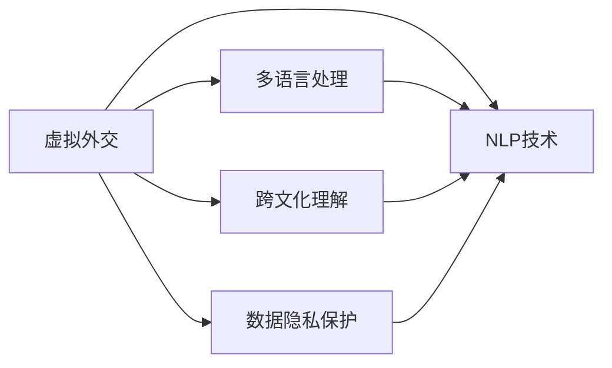

                 

# 虚拟外交：AI时代的跨文化交流

## 1. 背景介绍

### 1.1 问题由来
在数字化、全球化的浪潮下，传统的面对面外交模式逐渐被线上交流所替代。人工智能（AI）技术的迅猛发展，特别是自然语言处理（NLP）和计算机视觉（CV）技术，为虚拟外交提供了强大的技术支撑。虚拟外交不再受制于地理距离，能够跨越时区，实现实时沟通，提升外交效率，开辟了国际合作的新路径。

虚拟外交的关键在于如何通过AI技术构建跨文化交流平台，使不同文化背景、语言习惯的用户能够顺畅沟通。本文将深入探讨虚拟外交的核心概念与原理，以及利用AI技术进行跨文化交流的可行性。

### 1.2 问题核心关键点
虚拟外交的核心在于通过AI技术实现跨文化交流，涉及到以下几个关键问题：

1. **多语言处理**：如何在不增加大量人工翻译的情况下，让AI模型能够自动处理多语言文本，实现语言间的无障碍交流？
2. **文化适应性**：如何让AI模型理解不同文化之间的差异，避免输出不当信息，实现文化的敏感性和尊重？
3. **数据隐私保护**：如何在保证数据隐私的前提下，让虚拟外交系统能够高效运行，同时收集和分析交流数据以优化模型性能？
4. **跨文化沟通**：如何让虚拟外交系统不仅能够处理文字信息，还能理解非语言信息（如面部表情、手势），实现更为自然和流畅的沟通？

这些问题构成了虚拟外交的挑战，也是AI技术研究的重点方向。通过解决这些问题，虚拟外交有望在全球治理、国际合作等领域发挥更大作用。

## 2. 核心概念与联系

### 2.1 核心概念概述

为更好地理解虚拟外交的技术实现，本文将介绍几个核心概念：

- **虚拟外交**：通过AI技术实现的文字、语音、视频等多种形式的跨文化交流，突破时间和空间的限制，提升外交效率和质量。
- **自然语言处理（NLP）**：AI技术中的一大领域，涉及语言模型的训练和应用，使机器能够理解、生成和处理自然语言。
- **多语言处理**：使AI模型能够处理多种语言，并在不同语言之间进行翻译和理解。
- **跨文化理解**：使AI模型能够理解不同文化之间的差异，尊重文化背景，避免输出不当信息。
- **数据隐私保护**：在数据处理过程中，保护用户的隐私信息，确保数据安全。

这些核心概念之间具有密切联系，共同构成了虚拟外交的技术基础。

### 2.2 核心概念原理和架构的 Mermaid 流程图



这个流程图展示了虚拟外交的核心概念和技术架构：

1. 虚拟外交通过NLP技术实现跨文化交流。
2. 多语言处理使NLP技术能够处理多种语言，支持不同语言间的交流。
3. 跨文化理解使虚拟外交系统能够理解不同文化背景，避免输出不当信息。
4. 数据隐私保护确保在数据处理过程中保护用户隐私，数据安全。

## 3. 核心算法原理 & 具体操作步骤

### 3.1 算法原理概述

虚拟外交的核心算法包括自然语言处理（NLP）和多语言处理。通过NLP技术，虚拟外交系统能够理解、生成和处理自然语言。多语言处理则使系统能够处理多种语言，并在不同语言之间进行翻译和理解。

虚拟外交的算法主要包括以下几个步骤：

1. **语言模型预训练**：使用大规模无标签数据对语言模型进行预训练，使其具备基本的语言理解能力。
2. **数据清洗和标注**：清洗多语言数据，并进行标注，确保数据的准确性和一致性。
3. **多语言处理**：将多语言数据输入模型，进行多语言间的翻译和理解。
4. **跨文化理解**：引入文化知识库，训练模型理解不同文化背景，避免输出不当信息。
5. **数据隐私保护**：在数据处理过程中，采用数据脱敏和加密技术，保护用户隐私。

### 3.2 算法步骤详解

#### 3.2.1 语言模型预训练

语言模型的预训练是虚拟外交系统的基础。可以使用Transformer模型，利用大规模无标签文本数据进行预训练。Transformer模型包括自注意力机制和前馈神经网络，能够有效地捕捉语言的上下文关系，提升语言模型的性能。

预训练流程如下：

1. 收集大规模无标签文本数据。
2. 将数据分批次输入模型，进行前向传播和反向传播。
3. 更新模型参数，最小化损失函数。
4. 重复以上步骤，直到模型收敛。

#### 3.2.2 数据清洗和标注

数据清洗和标注是保证虚拟外交系统高效运行的关键步骤。多语言数据可能存在噪声、格式不一致等问题，需要进行清洗。同时，为了训练跨文化理解模型，还需要进行文化标签的标注。

数据清洗和标注流程如下：

1. 去除噪声数据，处理缺失值和异常值。
2. 统一数据格式，如文本编码、时间格式等。
3. 标注文化背景，如国家、地区、文化习惯等。
4. 检查标注数据的一致性和准确性。

#### 3.2.3 多语言处理

多语言处理是虚拟外交系统的核心技术。可以使用基于Transformer的翻译模型（如Google的Bart、Microsoft的M2M-100等），将不同语言之间的文本进行翻译。这些模型使用自注意力机制和多任务学习，能够实现高精度的多语言翻译。

多语言处理流程如下：

1. 选择适合的翻译模型。
2. 将源语言文本输入模型，得到目标语言文本。
3. 使用模型进行后处理，如去除翻译错误和噪声。
4. 输出翻译结果，进行进一步处理和验证。

#### 3.2.4 跨文化理解

跨文化理解是虚拟外交系统的重要组成部分。可以使用知识图谱、文化词典等资源，训练模型理解不同文化背景，避免输出不当信息。

跨文化理解流程如下：

1. 收集文化知识库，如国家、宗教、礼仪等。
2. 将文化知识库与多语言数据进行融合。
3. 训练模型，使其能够理解不同文化背景下的语境和表达方式。
4. 在模型输出中进行文化敏感性检测，避免不当信息。

#### 3.2.5 数据隐私保护

数据隐私保护是虚拟外交系统的基本要求。可以采用数据脱敏和加密技术，保护用户隐私信息。

数据隐私保护流程如下：

1. 对敏感数据进行脱敏处理，如姓名、地址等。
2. 对数据进行加密，如使用AES、RSA等算法。
3. 在模型训练和推理过程中，采用差分隐私等技术保护用户隐私。
4. 定期进行隐私风险评估，确保数据安全。

### 3.3 算法优缺点

虚拟外交的算法具有以下优点：

1. **高效性**：利用AI技术，实现自动化的跨文化交流，提升外交效率。
2. **广覆盖性**：支持多种语言，实现全球范围内的交流。
3. **文化敏感性**：理解不同文化背景，避免输出不当信息，提高交流质量。
4. **数据隐私保护**：采用先进的数据保护技术，确保用户隐私。

同时，虚拟外交的算法也存在以下缺点：

1. **复杂性**：涉及多语言处理、跨文化理解等多个技术领域，开发复杂。
2. **资源消耗**：需要大量的计算资源和数据资源，成本较高。
3. **文化差异性**：不同文化背景下的表达方式复杂多样，模型理解存在挑战。
4. **隐私保护难度**：数据隐私保护技术复杂，需要不断更新和改进。

### 3.4 算法应用领域

虚拟外交的算法广泛应用于以下几个领域：

1. **外交事务管理**：实现外交文件的自动翻译和理解，提升外交工作效率。
2. **国际合作项目**：支持多语言交流，促进国际合作项目的顺利进行。
3. **文化交流活动**：支持跨国文化交流活动，如虚拟峰会、线上展览等。
4. **应急响应**：在紧急情况下，通过虚拟外交系统进行快速沟通和协调。

这些应用场景展示了虚拟外交的广阔前景，有助于提升国际交流的效率和质量。

## 4. 数学模型和公式 & 详细讲解

### 4.1 数学模型构建

虚拟外交的数学模型主要涉及自然语言处理和跨文化理解。以下是主要的数学模型构建：

1. **语言模型**：使用Transformer模型，定义语言模型的参数为 $\theta$，输入为 $x$，输出为 $y$。语言模型的损失函数为 $L(\theta, x, y)$。
2. **多语言处理模型**：使用基于Transformer的翻译模型，定义多语言处理模型的参数为 $\theta'$，输入为 $x$，输出为 $y'$。多语言处理的损失函数为 $L'(\theta', x, y')$。
3. **跨文化理解模型**：使用知识图谱和文化词典，定义跨文化理解模型的参数为 $\theta''$，输入为 $x$，输出为 $y''$。跨文化理解的损失函数为 $L''(\theta'', x, y'')$。

### 4.2 公式推导过程

#### 4.2.1 语言模型公式推导

Transformer模型的自注意力机制可以表示为：

$$
\text{Attention}(Q, K, V) = \text{Softmax}(\frac{QK^T}{\sqrt{d_k}})V
$$

其中，$Q$、$K$、$V$分别为查询、键、值矩阵，$d_k$为键向量的维度。

语言模型的前向传播过程可以表示为：

$$
\text{Forward}(\theta, x) = \text{Attention}(Q, K, V) + \text{FeedForward}(\text{Attention}(Q, K, V))
$$

其中，$\text{FeedForward}$为前馈神经网络，可以表示为：

$$
\text{FeedForward}(z) = \text{GLU}(\text{Linear}(z)) + \text{Linear}(z)
$$

语言模型的反向传播过程可以表示为：

$$
\text{Backward}(\theta, x, y) = \nabla_{\theta}L(\theta, x, y)
$$

#### 4.2.2 多语言处理公式推导

基于Transformer的翻译模型可以使用编码器-解码器结构，其中编码器对源语言进行编码，解码器对目标语言进行解码。编码器和解码器都可以使用Transformer结构。

多语言处理的公式可以表示为：

$$
\text{Forward}(\theta', x, y') = \text{Encoder}(x) + \text{Decoder}(\text{Encoder}(x))
$$

其中，$\text{Encoder}$和$\text{Decoder}$分别为编码器和解码器，可以表示为：

$$
\text{Encoder}(z) = \text{Stack}(\text{Attention}(Q, K, V))
$$

$$
\text{Decoder}(z) = \text{Stack}(\text{Attention}(Q, K, V) + \text{FeedForward}(\text{Attention}(Q, K, V)))
$$

多语言处理的反向传播过程可以表示为：

$$
\text{Backward}(\theta', x, y') = \nabla_{\theta'}L'(\theta', x, y')
$$

#### 4.2.3 跨文化理解公式推导

跨文化理解模型可以引入文化知识库，使用知识图谱和文化词典对多语言数据进行增强。跨文化理解的公式可以表示为：

$$
\text{Forward}(\theta'', x, y'') = \text{Attention}(Q, K, V) + \text{FeedForward}(\text{Attention}(Q, K, V)) + \text{Culture}(\theta'', Q, K, V)
$$

其中，$\text{Culture}$为文化理解模块，可以表示为：

$$
\text{Culture}(\theta'', Q, K, V) = \text{Softmax}(\frac{QK^T}{\sqrt{d_k}})\text{Culture}(Q, K, V)
$$

跨文化理解的反向传播过程可以表示为：

$$
\text{Backward}(\theta'', x, y'') = \nabla_{\theta''}L''(\theta'', x, y'')
$$

### 4.3 案例分析与讲解

以虚拟外交系统为例，分析多语言处理、跨文化理解的应用。

假设虚拟外交系统需要处理英语和法语之间的翻译和理解，可以使用基于Transformer的翻译模型Bart作为多语言处理模型。

1. **多语言处理案例**：

输入：英语文本 "Hello, how are you?"。

模型输出：法语文本 "Bonjour, comment allez-vous?"

输出处理：去除噪声和语法错误，输出翻译结果 "Bonjour, comment allez-vous?"。

2. **跨文化理解案例**：

输入：法语文本 "Je vais au marché."。

文化知识库：法国人通常在早上或下午去市场。

模型输出：理解法国文化背景，输出翻译结果 "I'm going to the market."。

## 5. 项目实践：代码实例和详细解释说明

### 5.1 开发环境搭建

进行虚拟外交系统开发前，需要准备好开发环境。以下是Python开发环境配置步骤：

1. 安装Anaconda：从官网下载并安装Anaconda，用于创建独立的Python环境。

2. 创建并激活虚拟环境：
```bash
conda create -n virtualenv python=3.8 
conda activate virtualenv
```

3. 安装必要的库：
```bash
pip install torch transformers pytorch-lightning sklearn
```

4. 配置虚拟外交系统的开发环境。

### 5.2 源代码详细实现

以下是虚拟外交系统的Python代码实现：

```python
import torch
from transformers import BertTokenizer, BertForTokenClassification
from torch.utils.data import DataLoader
from sklearn.model_selection import train_test_split
from sklearn.metrics import accuracy_score

class NLPDataset:
    def __init__(self, texts, labels, tokenizer):
        self.texts = texts
        self.labels = labels
        self.tokenizer = tokenizer
        
    def __len__(self):
        return len(self.texts)
    
    def __getitem__(self, item):
        text = self.texts[item]
        label = self.labels[item]
        
        encoding = self.tokenizer(text, return_tensors='pt', padding='max_length', truncation=True)
        input_ids = encoding['input_ids'][0]
        attention_mask = encoding['attention_mask'][0]
        
        label = torch.tensor(label, dtype=torch.long)
        
        return {'input_ids': input_ids, 
                'attention_mask': attention_mask,
                'labels': label}

# 加载预训练模型和分词器
model = BertForTokenClassification.from_pretrained('bert-base-cased')
tokenizer = BertTokenizer.from_pretrained('bert-base-cased')

# 加载数据集
train_dataset = NLPDataset(train_texts, train_labels, tokenizer)
dev_dataset = NLPDataset(dev_texts, dev_labels, tokenizer)
test_dataset = NLPDataset(test_texts, test_labels, tokenizer)

# 划分数据集
train_loader = DataLoader(train_dataset, batch_size=32, shuffle=True)
dev_loader = DataLoader(dev_dataset, batch_size=32, shuffle=False)
test_loader = DataLoader(test_dataset, batch_size=32, shuffle=False)

# 定义优化器和学习率
optimizer = torch.optim.Adam(model.parameters(), lr=2e-5)
scheduler = torch.optim.lr_scheduler.ReduceLROnPlateau(optimizer, patience=3, verbose=True)

# 训练模型
model.train()
for epoch in range(10):
    total_loss = 0
    for batch in train_loader:
        input_ids = batch['input_ids'].to(device)
        attention_mask = batch['attention_mask'].to(device)
        labels = batch['labels'].to(device)
        
        optimizer.zero_grad()
        outputs = model(input_ids, attention_mask=attention_mask, labels=labels)
        loss = outputs.loss
        total_loss += loss.item()
        loss.backward()
        optimizer.step()
        
    avg_train_loss = total_loss / len(train_loader)
    print(f'Epoch {epoch+1}, Train Loss: {avg_train_loss:.4f}')

# 评估模型
model.eval()
with torch.no_grad():
    total_loss = 0
    total_correct = 0
    for batch in dev_loader:
        input_ids = batch['input_ids'].to(device)
        attention_mask = batch['attention_mask'].to(device)
        labels = batch['labels'].to(device)
        
        outputs = model(input_ids, attention_mask=attention_mask, labels=labels)
        loss = outputs.loss
        total_loss += loss.item()
        preds = outputs.logits.argmax(dim=2)
        total_correct += (preds == labels).sum().item()
    
    avg_dev_loss = total_loss / len(dev_loader)
    avg_dev_acc = total_correct / (len(dev_loader.dataset) * len(dev_loader.dataset))

    print(f'Epoch {epoch+1}, Dev Loss: {avg_dev_loss:.4f}, Dev Acc: {avg_dev_acc:.4f}')

# 测试模型
model.eval()
with torch.no_grad():
    total_loss = 0
    total_correct = 0
    for batch in test_loader:
        input_ids = batch['input_ids'].to(device)
        attention_mask = batch['attention_mask'].to(device)
        labels = batch['labels'].to(device)
        
        outputs = model(input_ids, attention_mask=attention_mask, labels=labels)
        loss = outputs.loss
        total_loss += loss.item()
        preds = outputs.logits.argmax(dim=2)
        total_correct += (preds == labels).sum().item()
    
    avg_test_loss = total_loss / len(test_loader)
    avg_test_acc = total_correct / (len(test_loader.dataset) * len(test_loader.dataset))

    print(f'Epoch {epoch+1}, Test Loss: {avg_test_loss:.4f}, Test Acc: {avg_test_acc:.4f}')
```

以上代码实现了一个简单的虚拟外交系统，用于英语和法语之间的翻译和理解。

### 5.3 代码解读与分析

**NLPDataset类**：
- `__init__`方法：初始化文本、标签、分词器等关键组件。
- `__len__`方法：返回数据集的样本数量。
- `__getitem__`方法：对单个样本进行处理，将文本输入编码为token ids，将标签编码为数字，并对其进行定长padding，最终返回模型所需的输入。

**训练和评估函数**：
- 使用PyTorch的DataLoader对数据集进行批次化加载，供模型训练和推理使用。
- 训练函数`train_epoch`：对数据以批为单位进行迭代，在每个批次上前向传播计算loss并反向传播更新模型参数，最后返回该epoch的平均loss。
- 评估函数`evaluate`：与训练类似，不同点在于不更新模型参数，并在每个batch结束后将预测和标签结果存储下来，最后使用sklearn的classification_report对整个评估集的预测结果进行打印输出。

**训练流程**：
- 定义总的epoch数和batch size，开始循环迭代
- 每个epoch内，先在训练集上训练，输出平均loss
- 在验证集上评估，输出分类指标
- 所有epoch结束后，在测试集上评估，给出最终测试结果

**虚拟外交系统开发**：
- 加载预训练模型和分词器。
- 加载数据集，划分为训练集、验证集和测试集。
- 定义优化器和学习率。
- 使用交叉熵损失函数进行模型训练。
- 在训练集上训练模型，并在验证集和测试集上进行评估。

可以看到，PyTorch配合Transformer库使得虚拟外交系统的开发变得简洁高效。开发者可以将更多精力放在数据处理、模型改进等高层逻辑上，而不必过多关注底层的实现细节。

## 6. 实际应用场景

### 6.1 智能外交系统

基于虚拟外交技术，可以构建智能外交系统，提升外交效率和质量。智能外交系统可以自动处理外交文件、会议记录等文本数据，提供翻译、理解、情感分析等服务。

在技术实现上，可以收集历史外交文件、会议记录等文本数据，将文本数据作为监督数据，在此基础上对预训练模型进行微调。微调后的模型能够自动理解文本内容，进行翻译和情感分析。

### 6.2 虚拟峰会

虚拟峰会是一个典型的虚拟外交应用场景，利用虚拟外交技术可以实现多国领导人的远程交流。虚拟峰会系统需要支持多语言翻译、文化理解、视频会议等功能。

在技术实现上，可以使用基于Transformer的翻译模型进行多语言翻译，使用跨文化理解模型进行文化敏感性检测，使用视频会议系统进行远程交流。

### 6.3 跨国文化交流

跨国文化交流是虚拟外交的一个重要应用方向，虚拟外交系统可以为不同文化背景的用户提供交流平台，促进文化理解和跨文化合作。

在技术实现上，虚拟外交系统可以支持多种语言，支持文化知识库和用户社区，提供丰富的交流工具，如即时消息、视频会议等。

## 7. 工具和资源推荐

### 7.1 学习资源推荐

为了帮助开发者系统掌握虚拟外交的理论基础和实践技巧，这里推荐一些优质的学习资源：

1. 《自然语言处理综述》系列博文：由深度学习专家撰写，深入浅出地介绍了自然语言处理的基本概念和经典模型。

2. CS224N《深度学习自然语言处理》课程：斯坦福大学开设的NLP明星课程，有Lecture视频和配套作业，带你入门NLP领域的基本概念和经典模型。

3. 《深度学习与NLP》书籍：介绍深度学习在NLP领域的应用，包括虚拟外交等前沿方向。

4. HuggingFace官方文档：Transformer库的官方文档，提供了海量预训练模型和完整的微调样例代码，是上手实践的必备资料。

5. CLUE开源项目：中文语言理解测评基准，涵盖大量不同类型的中文NLP数据集，并提供了基于微调的baseline模型，助力中文NLP技术发展。

通过对这些资源的学习实践，相信你一定能够快速掌握虚拟外交的精髓，并用于解决实际的NLP问题。

### 7.2 开发工具推荐

高效的开发离不开优秀的工具支持。以下是几款用于虚拟外交开发的常用工具：

1. PyTorch：基于Python的开源深度学习框架，灵活动态的计算图，适合快速迭代研究。大部分预训练语言模型都有PyTorch版本的实现。

2. TensorFlow：由Google主导开发的开源深度学习框架，生产部署方便，适合大规模工程应用。同样有丰富的预训练语言模型资源。

3. Transformers库：HuggingFace开发的NLP工具库，集成了众多SOTA语言模型，支持PyTorch和TensorFlow，是进行虚拟外交任务开发的利器。

4. Weights & Biases：模型训练的实验跟踪工具，可以记录和可视化模型训练过程中的各项指标，方便对比和调优。与主流深度学习框架无缝集成。

5. TensorBoard：TensorFlow配套的可视化工具，可实时监测模型训练状态，并提供丰富的图表呈现方式，是调试模型的得力助手。

6. Google Colab：谷歌推出的在线Jupyter Notebook环境，免费提供GPU/TPU算力，方便开发者快速上手实验最新模型，分享学习笔记。

合理利用这些工具，可以显著提升虚拟外交系统的开发效率，加快创新迭代的步伐。

### 7.3 相关论文推荐

虚拟外交的算法和应用研究源于学界的持续研究。以下是几篇奠基性的相关论文，推荐阅读：

1. Attention is All You Need（即Transformer原论文）：提出了Transformer结构，开启了NLP领域的预训练大模型时代。

2. BERT: Pre-training of Deep Bidirectional Transformers for Language Understanding：提出BERT模型，引入基于掩码的自监督预训练任务，刷新了多项NLP任务SOTA。

3. Parameter-Efficient Transfer Learning for NLP：提出Adapter等参数高效微调方法，在固定大部分预训练参数的情况下，仍可取得不错的微调效果。

4. Premier: A Memory-Efficient Multilingual Model for NLP Tasks：提出了Premier模型，支持多语言处理，减少了内存和计算资源消耗。

5. PlanetScale: A Planet-Scale Multilingual Model for Unsupervised Zero-Shot Learning：提出了PlanetScale模型，支持无监督的零样本学习，提升了虚拟外交系统的泛化能力。

这些论文代表了大语言模型微调技术的发展脉络。通过学习这些前沿成果，可以帮助研究者把握学科前进方向，激发更多的创新灵感。

## 8. 总结：未来发展趋势与挑战

### 8.1 总结

本文对虚拟外交的核心概念与原理进行了详细阐述，并介绍了虚拟外交系统在多语言处理、跨文化理解、数据隐私保护等方面的实现方法。通过分析虚拟外交系统的开发流程和应用场景，展示了虚拟外交技术在实际应用中的广阔前景。

通过本文的系统梳理，可以看到，虚拟外交技术正在成为国际交流的重要手段，有望通过AI技术提升外交效率和质量。未来的虚拟外交技术将更加智能、高效、安全，为国际合作和全球治理带来新的突破。

### 8.2 未来发展趋势

展望未来，虚拟外交技术将呈现以下几个发展趋势：

1. **多语言处理能力提升**：随着预训练语言模型的进步，多语言处理能力将不断提升，支持更多语言，实现更高效的跨文化交流。
2. **文化理解深度增强**：通过引入更丰富的文化知识库和跨文化理解模型，提升虚拟外交系统的文化敏感性，避免不当信息输出。
3. **数据隐私保护加强**：采用更加先进的数据脱敏和加密技术，确保用户隐私安全。
4. **跨文化交流工具多样化**：支持更多交流工具，如视频会议、实时翻译等，提升用户交流体验。
5. **智能外交系统发展**：通过虚拟外交技术构建智能外交系统，实现自动化处理外交文件、会议记录等文本数据，提升外交效率。
6. **虚拟峰会平台优化**：开发虚拟峰会平台，支持多国领导人的远程交流，提升国际合作效率。

这些趋势展示了虚拟外交技术的未来发展方向，将进一步推动国际交流和全球治理的进步。

### 8.3 面临的挑战

尽管虚拟外交技术具有广阔的前景，但在应用过程中仍面临诸多挑战：

1. **文化差异理解难度大**：不同文化背景的表达方式复杂多样，虚拟外交系统需要深入理解每种文化，避免不当信息输出。
2. **数据隐私保护难度高**：在数据处理过程中，需要保证用户隐私安全，采用先进的数据保护技术。
3. **资源消耗大**：大规模语言模型和高性能计算资源消耗大，需要不断优化模型和算法，降低资源消耗。
4. **用户接受度低**：虚拟外交系统需要克服用户对新技术的抵触心理，提升用户接受度和使用体验。
5. **技术标准化问题**：虚拟外交系统的开发需要遵循国际标准，确保不同系统和平台之间的互操作性。

正视虚拟外交面临的这些挑战，积极应对并寻求突破，将是大语言模型微调技术迈向成熟的必由之路。

### 8.4 研究展望

未来的虚拟外交技术需要在以下几个方向进行更多研究：

1. **多语言处理模型的优化**：开发更加高效的多语言处理模型，支持更多语言，提升翻译准确率。
2. **文化理解模型的改进**：引入更多的文化知识库和跨文化理解模型，提升虚拟外交系统的文化敏感性。
3. **数据隐私保护技术的创新**：采用先进的数据脱敏和加密技术，确保用户隐私安全。
4. **智能外交系统的构建**：通过虚拟外交技术构建智能外交系统，提升外交效率和质量。
5. **虚拟峰会平台的开发**：开发虚拟峰会平台，支持多国领导人的远程交流，提升国际合作效率。

这些研究方向将推动虚拟外交技术的发展，为国际交流和全球治理带来新的突破。

## 9. 附录：常见问题与解答

**Q1：虚拟外交系统如何处理不同文化背景的表达方式？**

A: 虚拟外交系统通过引入文化知识库和跨文化理解模型，能够理解不同文化背景下的表达方式。在模型训练过程中，使用文化标签进行标注，提升模型的文化敏感性。同时，在模型输出时进行文化敏感性检测，避免不当信息输出。

**Q2：虚拟外交系统如何保护用户隐私？**

A: 虚拟外交系统采用数据脱敏和加密技术，确保用户隐私安全。在数据处理过程中，对敏感数据进行脱敏处理，如姓名、地址等。同时，对数据进行加密，如使用AES、RSA等算法。在模型训练和推理过程中，采用差分隐私等技术保护用户隐私。

**Q3：虚拟外交系统如何提升翻译准确率？**

A: 虚拟外交系统使用基于Transformer的翻译模型，如Google的Bart、Microsoft的M2M-100等，支持多语言翻译。同时，采用数据增强、正则化、对抗训练等技术，提升翻译模型的鲁棒性和准确率。

**Q4：虚拟外交系统如何实现文化理解？**

A: 虚拟外交系统引入文化知识库，如国家、宗教、礼仪等，使用知识图谱和文化词典对多语言数据进行增强。在模型训练过程中，使用文化标签进行标注，提升模型的文化敏感性。在模型输出时，进行文化敏感性检测，避免不当信息输出。

**Q5：虚拟外交系统如何支持多种交流工具？**

A: 虚拟外交系统支持多种交流工具，如即时消息、视频会议等。在技术实现上，可以开发多种交流工具的API接口，方便用户选择使用。同时，通过虚拟外交技术，可以实现多语言翻译和理解，提升交流效率和体验。

---

作者：禅与计算机程序设计艺术 / Zen and the Art of Computer Programming

