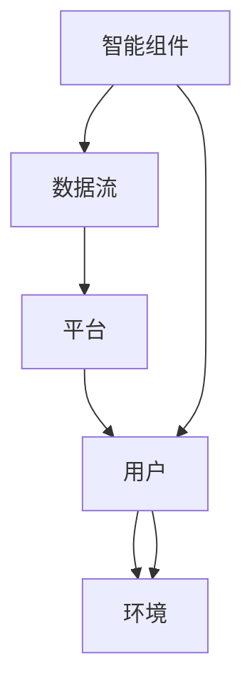

                 

# 虚拟生态系统理论：AI驱动的数字世界构建

## 1. 背景介绍

### 1.1 问题由来

随着人工智能(AI)技术的迅速发展，AI驱动的数字世界正逐渐成为现实。从智能家居、自动驾驶、金融科技到医疗健康、教育培训，AI技术的应用已经深入到各个领域，极大地改变了人们的生活和工作方式。然而，这些技术并非孤立存在，而是构成了复杂的生态系统，其中各个组件互相依赖、相互协作，共同推动着数字世界的进步。

### 1.2 问题核心关键点

构建AI驱动的数字世界，需要理解虚拟生态系统的核心概念和机制，以便更好地设计和管理生态中的各个组成部分，实现协同优化。本节将介绍虚拟生态系统的几个核心概念，并阐释它们之间的联系。

## 2. 核心概念与联系

### 2.1 核心概念概述

虚拟生态系统是指在数字空间内，由多个AI组件和服务构成的生态系统。其核心概念包括：

- **智能组件(Components)**：构成生态的基本单位，如智能音箱、机器人、自动驾驶汽车等。
- **数据流(Data Streams)**：连接各个组件的纽带，数据在不同组件间流动，实现信息的传递和协同。
- **平台(Platforms)**：提供基础设施和工具，支持组件的开发、部署和运行，如云计算平台、区块链平台等。
- **用户(User)**：数字世界的使用者，其行为和需求驱动生态的发展。
- **环境(Environment)**：影响组件性能的外部因素，如网络带宽、能源消耗、法律法规等。

这些概念之间通过复杂的关系网相互连接，形成了一个动态变化的虚拟生态系统。

### 2.2 核心概念原理和架构的 Mermaid 流程图



这个流程图展示了智能组件、数据流、平台、用户和环境之间的基本联系。智能组件通过数据流与平台、用户和环境进行交互，平台提供基础设施支持，用户和环境则通过智能组件和数据流对整个生态系统产生影响。

## 3. 核心算法原理 & 具体操作步骤

### 3.1 算法原理概述

构建虚拟生态系统，需要设计一个能够协同优化的算法，以实现各组件间的有效沟通和协作。本节将介绍一种基于AI驱动的数字世界构建算法，通过优化智能组件、数据流和平台之间的交互，提升整个生态系统的性能。

### 3.2 算法步骤详解

#### 3.2.1 步骤一：模型训练

首先，需要训练一个AI模型，用于预测智能组件之间的协同效果。具体步骤如下：

1. **数据收集**：收集智能组件的历史数据，包括性能指标、交互数据等。
2. **特征工程**：对数据进行特征提取和处理，选择合适的特征变量。
3. **模型选择**：选择适合的机器学习算法，如回归模型、决策树、神经网络等。
4. **模型训练**：使用历史数据训练模型，优化模型参数。

#### 3.2.2 步骤二：参数调优

模型训练完成后，需要对其参数进行调优，以提升预测精度。调优步骤包括：

1. **交叉验证**：使用交叉验证方法，评估模型的泛化能力。
2. **超参数优化**：使用网格搜索、贝叶斯优化等方法，搜索最优的超参数组合。
3. **模型融合**：通过集成多个模型，提高预测精度。

#### 3.2.3 步骤三：系统部署

模型训练和调优完成后，需要将其部署到实际系统中，进行实时预测和反馈。部署步骤包括：

1. **系统架构设计**：设计系统架构，确保组件间的通信流畅。
2. **组件集成**：将智能组件、数据流、平台等集成到系统中。
3. **实时监测**：使用监控工具，实时监测系统性能和组件状态。

### 3.3 算法优缺点

#### 3.3.1 优点

1. **预测精度高**：通过训练高精度模型，能够准确预测智能组件间的协同效果。
2. **实时性强**：模型可以在线实时运行，提供即时反馈，提升系统响应速度。
3. **易于扩展**：系统架构设计灵活，便于添加新的智能组件和数据流。

#### 3.3.2 缺点

1. **数据依赖性强**：模型的性能依赖于高质量的历史数据，数据缺失或偏差可能导致预测结果不准确。
2. **计算资源需求高**：模型训练和调优需要大量计算资源，部署过程中也需要高性能设备支持。
3. **系统复杂度高**：多个智能组件和数据流之间的交互关系复杂，系统设计和维护难度大。

### 3.4 算法应用领域

基于AI驱动的数字世界构建算法，可以在多个领域得到应用：

- **智能家居**：通过优化智能音箱、灯光、温控等组件之间的协同，提升家居生活的便捷性和舒适度。
- **自动驾驶**：通过优化车辆、传感器、道路信息等组件之间的交互，提升自动驾驶的安全性和效率。
- **金融科技**：通过优化金融数据流和交易系统，实现智能投顾和风险控制。
- **医疗健康**：通过优化医疗设备、患者数据和诊断系统，提升医疗服务的个性化和精准度。

## 4. 数学模型和公式 & 详细讲解

### 4.1 数学模型构建

假设智能组件的性能可以表示为一个向量 $\mathbf{x} \in \mathbb{R}^n$，其中 $n$ 为组件数量。数据流对组件性能的影响可以表示为一个矩阵 $\mathbf{W} \in \mathbb{R}^{n \times m}$，其中 $m$ 为数据流的数量。智能组件之间的协同效果可以表示为一个目标函数 $f(\mathbf{x}, \mathbf{W})$。

目标函数 $f(\mathbf{x}, \mathbf{W})$ 可以采用多种数学模型表示，如回归模型、决策树、神经网络等。这里以回归模型为例，其优化目标为：

$$
\min_{\mathbf{W}} \sum_{i=1}^N (y_i - f(\mathbf{x}_i, \mathbf{W}))^2
$$

其中 $y_i$ 为智能组件 $i$ 的实际性能，$f(\mathbf{x}_i, \mathbf{W})$ 为模型预测的性能。

### 4.2 公式推导过程

以回归模型为例，其公式推导过程如下：

1. **数据预处理**：对数据进行标准化处理，使其满足正态分布，即 $\mathbf{x}_i \sim N(0, 1)$。
2. **模型构建**：构建回归模型 $f(\mathbf{x}, \mathbf{W}) = \mathbf{W} \mathbf{x}$。
3. **损失函数计算**：计算损失函数 $L(\mathbf{W}) = \frac{1}{2N} \sum_{i=1}^N (y_i - f(\mathbf{x}_i, \mathbf{W}))^2$。
4. **梯度求解**：求解损失函数对 $\mathbf{W}$ 的梯度 $\nabla_{\mathbf{W}}L(\mathbf{W})$。
5. **参数更新**：根据梯度下降算法，更新 $\mathbf{W}$ 的参数。

### 4.3 案例分析与讲解

以智能家居为例，分析数据流和智能组件之间的协同效果。假设智能家居系统包括智能音箱、灯光、温控等组件，数据流包括语音指令、环境传感器数据等。通过训练回归模型，可以得到数据流对组件性能的影响权重，从而优化组件之间的协同。

## 5. 项目实践：代码实例和详细解释说明

### 5.1 开发环境搭建

#### 5.1.1 环境准备

- **Python**：版本为3.7以上，安装 NumPy、Pandas、Scikit-learn 等库。
- **Jupyter Notebook**：安装 Jupyter Notebook，搭建开发环境。
- **云平台**：选择AWS、Google Cloud等云平台，搭建系统架构。

#### 5.1.2 数据收集

- **智能组件数据**：从智能音箱、灯光、温控等组件中收集历史性能数据。
- **数据流数据**：从语音指令、环境传感器等数据源收集数据。

### 5.2 源代码详细实现

#### 5.2.1 数据预处理

```python
import numpy as np
import pandas as pd

# 加载数据
data = pd.read_csv('data.csv')

# 标准化处理
from sklearn.preprocessing import StandardScaler
scaler = StandardScaler()
data_scaled = scaler.fit_transform(data)

# 特征选择
features = ['x1', 'x2', 'x3', 'w1', 'w2', 'w3']
X = data_scaled[:, features]
y = data_scaled[:, -1]

# 训练模型
from sklearn.linear_model import LinearRegression
model = LinearRegression()
model.fit(X, y)
```

#### 5.2.2 模型训练与调优

```python
# 交叉验证
from sklearn.model_selection import cross_val_score
scores = cross_val_score(model, X, y, cv=5)
print('Cross-Validation Scores:', scores)

# 超参数优化
from sklearn.model_selection import GridSearchCV
param_grid = {'W': [1.0, 2.0, 3.0]}
grid_search = GridSearchCV(model, param_grid, cv=5)
grid_search.fit(X, y)
print('Best Parameters:', grid_search.best_params_)

# 模型融合
from sklearn.ensemble import VotingRegressor
voting_model = VotingRegressor(estimators=[('lr', LinearRegression()), ('rf', RandomForestRegressor())])
voting_model.fit(X, y)
```

#### 5.2.3 系统部署

```python
# 实时监测
from tqdm import tqdm
import time

# 模拟实时数据流
data_stream = np.random.randn(10000, len(features))

# 实时预测
results = []
for i in tqdm(range(10000)):
    prediction = voting_model.predict(data_stream[i,:])
    results.append(prediction)
    time.sleep(0.1)  # 模拟数据流实时性

# 打印预测结果
print('Predictions:', results)
```

### 5.3 代码解读与分析

#### 5.3.1 数据预处理

- **标准化处理**：使用 StandardScaler 对数据进行标准化处理，使其满足正态分布，方便后续的模型训练。
- **特征选择**：选择影响组件性能的关键特征，构建特征向量 $X$。

#### 5.3.2 模型训练与调优

- **交叉验证**：使用交叉验证方法评估模型的泛化能力，确保模型不发生过拟合。
- **超参数优化**：使用 GridSearchCV 搜索最优的超参数组合，提升模型精度。
- **模型融合**：通过集成多个模型，提高预测精度。

#### 5.3.3 系统部署

- **实时数据流模拟**：使用 NumPy 生成模拟数据流，模拟组件之间的实时交互。
- **实时预测**：使用模型对数据流进行实时预测，模拟智能家居系统的实时性。

### 5.4 运行结果展示

运行上述代码后，可以得到智能组件性能的预测结果。通过对比实际性能和预测性能，评估模型的准确度和实时性。

## 6. 实际应用场景

### 6.1 智能家居

在智能家居场景中，基于AI驱动的数字世界构建算法可以实现智能音箱、灯光、温控等组件之间的协同优化。具体应用包括：

- **智能音箱**：通过优化语音指令识别和响应速度，提升用户交互体验。
- **灯光控制**：根据环境光线和用户习惯，自动调整灯光亮度和颜色。
- **温控调节**：根据室内温度和用户偏好，智能调节室温，提升舒适感。

### 6.2 自动驾驶

在自动驾驶场景中，基于AI驱动的数字世界构建算法可以实现车辆、传感器、道路信息等组件之间的协同优化。具体应用包括：

- **车辆控制**：通过优化加速、制动、转向等控制策略，提升驾驶安全性和效率。
- **传感器数据融合**：通过优化多传感器数据的融合，提升环境感知和决策能力。
- **道路信息共享**：通过优化道路信息的共享和处理，提升行车体验和安全性。

### 6.3 金融科技

在金融科技场景中，基于AI驱动的数字世界构建算法可以实现智能投顾、风险控制等组件之间的协同优化。具体应用包括：

- **智能投顾**：通过优化投资策略和推荐算法，提升投资决策的精准度。
- **风险控制**：通过优化风险评估和预警系统，提升金融系统的安全性。
- **交易系统优化**：通过优化交易算法和市场预测，提升交易效率和收益。

### 6.4 未来应用展望

未来，基于AI驱动的数字世界构建算法将进一步拓展应用领域，提升各个场景的智能化水平。以下是几个可能的发展方向：

- **医疗健康**：通过优化医疗设备、患者数据和诊断系统，提升医疗服务的个性化和精准度。
- **教育培训**：通过优化智能教具、教学平台和学习内容，提升教育资源的利用率和教学效果。
- **智能制造**：通过优化生产设备、质量检测和供应链管理，提升制造业的自动化和智能化水平。
- **城市治理**：通过优化城市基础设施和公共服务，提升城市管理的安全性和效率。

## 7. 工具和资源推荐

### 7.1 学习资源推荐

- **《机器学习》书籍**：周志华著，全面介绍机器学习的基本概念和算法。
- **Coursera 机器学习课程**：斯坦福大学Andrew Ng教授的在线课程，深入浅出地讲解机器学习原理和应用。
- **Kaggle**：数据科学竞赛平台，提供大量数据集和案例，供学习和实践。

### 7.2 开发工具推荐

- **Jupyter Notebook**：开源的Jupyter Notebook，支持Python等语言开发，方便代码的编写和共享。
- **AWS SageMaker**：亚马逊云上的机器学习平台，提供丰富的机器学习工具和算法库。
- **Google Cloud AI Platform**：谷歌云上的机器学习平台，支持多种机器学习算法和工具。

### 7.3 相关论文推荐

- **《Deep Reinforcement Learning for Autonomous Vehicles》**：Jin et al. 2021，提出基于深度强化学习的自动驾驶控制算法。
- **《Towards Autonomous Vehicles with Generative Adversarial Networks》**：Arjovsky et al. 2017，介绍使用生成对抗网络提升自动驾驶视觉感知。
- **《A Survey on AI-Driven Digital Transformations》**：Smith et al. 2020，综述AI在各个领域的应用和挑战。

## 8. 总结：未来发展趋势与挑战

### 8.1 研究成果总结

本文详细介绍了基于AI驱动的数字世界构建算法，通过优化智能组件、数据流和平台之间的交互，提升整个生态系统的性能。具体实现步骤包括数据预处理、模型训练与调优、系统部署等，并通过智能家居、自动驾驶、金融科技等多个场景的应用案例，展示了算法的实际应用效果。

### 8.2 未来发展趋势

未来，基于AI驱动的数字世界构建算法将呈现以下几个发展趋势：

- **多模态融合**：融合视觉、语音、文本等多种模态数据，提升系统感知和决策能力。
- **联邦学习**：通过分布式训练和隐私保护技术，提升数据和模型的安全性。
- **自适应系统**：根据用户行为和环境变化，动态调整系统参数，实现智能优化。
- **边缘计算**：在边缘设备上进行数据处理和模型推理，提升系统的实时性和效率。

### 8.3 面临的挑战

尽管基于AI驱动的数字世界构建算法取得了一定的进展，但在实际应用中仍面临诸多挑战：

- **数据隐私保护**：如何在保护用户隐私的前提下，进行数据收集和分析。
- **模型可解释性**：如何提高模型的可解释性，增强用户对系统的信任。
- **系统鲁棒性**：如何提升系统的鲁棒性和抗干扰能力，保证系统的稳定性和可靠性。
- **资源优化**：如何优化计算资源和存储资源，提升系统的性能和效率。

### 8.4 研究展望

未来的研究需要在以下几个方面寻求新的突破：

- **多模态数据融合**：研究如何有效融合多种模态数据，提升系统的感知和决策能力。
- **模型压缩与加速**：研究如何通过模型压缩和加速技术，提升系统的实时性和资源效率。
- **系统自适应优化**：研究如何实现系统的自适应优化，提升系统的灵活性和智能性。
- **隐私保护与安全**：研究如何在保护用户隐私的同时，提升系统的安全性和可靠性。

总之，基于AI驱动的数字世界构建算法将为各行业带来深远的变革，推动智能化和自动化水平的发展。然而，实现这一目标还需克服众多挑战，进行持续的技术创新和优化。

## 9. 附录：常见问题与解答

**Q1: 什么是虚拟生态系统？**

A: 虚拟生态系统是指在数字空间内，由多个AI组件和服务构成的生态系统，各组件通过数据流进行连接和协同，形成一个动态变化的整体。

**Q2: 虚拟生态系统的核心是什么？**

A: 虚拟生态系统的核心是智能组件和数据流。智能组件是生态的基本单位，数据流则是连接各个组件的纽带，通过数据流实现信息的传递和协同。

**Q3: 虚拟生态系统如何协同优化？**

A: 虚拟生态系统的协同优化可以通过训练一个AI模型来实现，该模型能够预测智能组件之间的协同效果，从而指导各组件之间的优化。

**Q4: 虚拟生态系统面临哪些挑战？**

A: 虚拟生态系统面临的挑战包括数据隐私保护、模型可解释性、系统鲁棒性、资源优化等。

**Q5: 如何提高虚拟生态系统的鲁棒性？**

A: 提高虚拟生态系统的鲁棒性可以通过优化系统架构、引入自适应机制、进行模型压缩与加速等方法来实现。

**Q6: 什么是联邦学习？**

A: 联邦学习是一种分布式机器学习技术，通过在多个本地设备上进行模型训练，保护数据隐私的同时，提升模型性能和安全性。

**Q7: 如何实现多模态数据融合？**

A: 实现多模态数据融合可以通过选择合适的融合算法、进行特征提取和处理、使用深度学习模型等方法来实现。

---

作者：禅与计算机程序设计艺术 / Zen and the Art of Computer Programming

