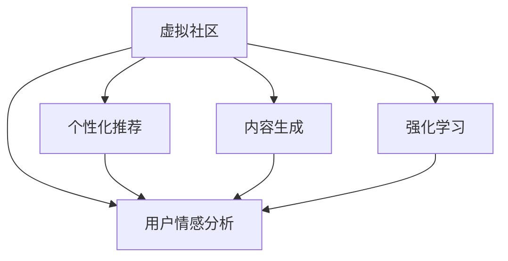

                 

# 虚拟社区构建专家：AI驱动的在线归属感营造顾问

> 关键词：虚拟社区，AI驱动，在线归属感，社交网络，情感分析，推荐系统，强化学习

## 1. 背景介绍

### 1.1 问题由来
随着互联网的迅猛发展，虚拟社区成为了人们在线交流和互动的重要平台。然而，尽管众多虚拟社区平台层出不穷，但真正能够吸引用户并形成持久归属感的却寥寥无几。在不断涌现的网络空间中，如何构建具有深度的虚拟社区，让用户能够产生强烈的情感共鸣和归属感，成为各大社交网络平台竞相探索的热点问题。

人工智能技术，尤其是自然语言处理(NLP)和推荐系统(Recommender System)的迅猛发展，为虚拟社区的智能化运营提供了新的解决路径。通过AI技术驱动的个性化推荐、情感分析、内容生成等手段，可以极大地提升虚拟社区的用户体验，增强用户的在线归属感。

### 1.2 问题核心关键点
当前虚拟社区构建的关键点主要包括：

1. **用户情感驱动**：社区氛围和用户情绪是驱动用户归属感的重要因素。通过情感分析技术，可以捕捉用户在线互动时的情绪波动，及时反馈用户需求，改善互动质量。
2. **个性化推荐**：根据用户行为和兴趣，推送个性化的内容，增强用户对社区的粘性。
3. **内容生成与互动**：AI驱动的内容生成技术可以大幅提高社区内容的多样性和活跃度，促进用户互动。
4. **用户动态感知与优化**：通过强化学习等技术，对社区运营策略进行实时优化，以适应不断变化的用户需求和社区环境。

本文聚焦于AI技术在虚拟社区构建中的应用，通过深入探讨情感分析、个性化推荐、内容生成等核心技术，提出一种基于AI驱动的在线归属感营造策略，希望为虚拟社区的智能运营提供参考和指导。

## 2. 核心概念与联系

### 2.1 核心概念概述

为更好地理解AI驱动的虚拟社区构建方法，本节将介绍几个关键概念：

- **虚拟社区**：通过互联网技术构建的线上社区，用户可以在其中进行信息交流、兴趣分享、互动娱乐等活动。常见的虚拟社区平台包括微信、微博、知乎、抖音等。
- **用户情感分析**：利用NLP和机器学习技术，从用户在线互动中挖掘情感倾向，判断用户情绪波动，为社区运营提供决策依据。
- **个性化推荐系统**：通过分析用户行为和兴趣，为每位用户推荐个性化的内容，增强用户对社区的粘性。
- **内容生成**：基于深度学习技术，自动生成高质量的社区内容，提升社区内容的丰富性和多样性。
- **强化学习**：一种通过不断试错优化决策策略的学习方法，可以用于动态调整社区运营策略，以适应不断变化的用户需求和环境。

这些核心概念之间的逻辑关系可以通过以下Mermaid流程图来展示：



这个流程图展示了虚拟社区构建的各个关键环节：

1. 虚拟社区通过用户情感分析、个性化推荐、内容生成等技术手段，提升用户互动质量。
2. 强化学习作为动态优化工具，实时调整社区运营策略，适应不断变化的环境和用户需求。
3. 这些技术手段之间相互配合，共同提升虚拟社区的用户体验和归属感。

## 3. 核心算法原理 & 具体操作步骤
### 3.1 算法原理概述

基于AI驱动的虚拟社区构建，其核心思想是通过深度学习技术和数据分析手段，全面提升虚拟社区的用户体验，从而增强用户对社区的归属感和粘性。具体来说，包括以下几个步骤：

1. **用户情感分析**：利用NLP技术，分析用户在线互动中的语言情感，判断用户情绪波动，为社区运营提供决策依据。
2. **个性化推荐**：根据用户行为和兴趣，推荐个性化的内容，增强用户对社区的粘性。
3. **内容生成**：基于深度学习技术，自动生成高质量的社区内容，提升社区内容的丰富性和多样性。
4. **强化学习**：通过不断试错优化决策策略，实时调整社区运营策略，以适应不断变化的用户需求和环境。

### 3.2 算法步骤详解

#### 3.2.1 用户情感分析

用户情感分析是虚拟社区构建中非常重要的环节，通过分析用户在社区中的互动语言，可以捕捉用户的情绪波动，并及时做出响应。具体步骤如下：

1. **数据收集**：收集社区中的用户互动数据，如评论、留言、私信等，将其转换为文本数据。
2. **情感标注**：通过人工标注或自动标注的方式，给每条文本数据打上情感标签，如正向、中性、负向。
3. **情感分析模型训练**：利用情感分类模型，如BERT、LSTM等，训练情感分析模型。
4. **情感分析应用**：将新文本数据输入情感分析模型，获得情感得分，并根据得分实时调整社区策略。

#### 3.2.2 个性化推荐

个性化推荐系统通过分析用户行为和兴趣，为每位用户推荐个性化的内容，增强用户对社区的粘性。具体步骤如下：

1. **用户行为数据收集**：收集用户在社区中的浏览、点赞、评论、分享等行为数据。
2. **用户兴趣模型建立**：利用协同过滤、内容推荐等技术，建立用户兴趣模型。
3. **个性化内容推荐**：根据用户兴趣模型，推荐个性化的内容，如文章、视频、图片等。
4. **推荐效果反馈**：通过用户反馈数据，不断优化推荐算法，提升推荐效果。

#### 3.2.3 内容生成

内容生成技术可以自动生成高质量的社区内容，提升社区内容的丰富性和多样性。具体步骤如下：

1. **内容生成模型选择**：根据需求选择生成模型，如GPT-3、GPT-4等。
2. **模型训练**：利用大规模文本语料，训练生成模型。
3. **内容生成应用**：根据社区需求，自动生成文本、图片、视频等内容。
4. **内容审核与发布**：生成内容需经过审核，确保符合社区规范和用户需求。

#### 3.2.4 强化学习

强化学习通过不断试错优化决策策略，实时调整社区运营策略，以适应不断变化的用户需求和环境。具体步骤如下：

1. **环境定义**：定义虚拟社区运营环境，包括用户行为、内容互动、社区管理等。
2. **策略设计**：设计社区运营策略，如内容推荐算法、用户互动策略等。
3. **策略训练**：利用强化学习算法，如Q-learning、SARSA等，训练最优策略。
4. **策略应用**：将训练好的策略应用到虚拟社区运营中，实时调整策略，提升用户体验。

### 3.3 算法优缺点

AI驱动的虚拟社区构建方法具有以下优点：

1. **提升用户体验**：通过情感分析、个性化推荐、内容生成等技术手段，可以大幅提升用户互动质量和社区粘性。
2. **动态优化**：强化学习技术可以实时调整社区运营策略，适应不断变化的用户需求和环境。
3. **自动化处理**：自动化处理社区运营中的许多繁琐任务，如内容审核、用户反馈处理等，提升运营效率。
4. **数据驱动**：基于数据分析的社区运营决策，具有更高的可解释性和可靠性。

同时，该方法也存在一定的局限性：

1. **数据隐私问题**：在用户情感分析、个性化推荐等环节，需收集大量用户行为数据，存在隐私泄露的风险。
2. **内容质量控制**：自动生成内容的质量难以完全保证，仍需人工审核和调整。
3. **算法复杂度**：部分算法如强化学习，模型训练和策略优化过程较为复杂，需要较高的技术门槛。
4. **实时性要求**：实时处理用户情感和互动数据，对系统计算能力和存储要求较高。

尽管存在这些局限性，但就目前而言，AI驱动的虚拟社区构建方法已成为提升社区用户体验和粘性的重要手段。未来相关研究的重点在于如何进一步优化算法性能，提升用户体验，同时兼顾数据隐私和安全。

### 3.4 算法应用领域

基于AI驱动的虚拟社区构建方法，已经在各类社交网络平台得到广泛应用，涵盖了以下几个主要领域：

1. **内容推荐**：如微信朋友圈、微博动态、抖音短视频等，通过个性化推荐提升用户粘性。
2. **用户互动**：如知乎问答、豆瓣书评、Reddit论坛等，通过情感分析优化互动质量。
3. **内容生成**：如自动回复、智能问答、内容导读等，通过内容生成提升互动效率。
4. **社区管理**：如用户举报、违规处理、内容审核等，通过自动化处理提升管理效率。
5. **广告投放**：如微信公众号广告、社交平台广告等，通过精准推荐提升广告效果。

除了上述这些经典应用外，AI驱动的虚拟社区构建方法还被创新性地应用到更多场景中，如智能客服、在线教育、虚拟会议等，为社交网络平台带来了新的发展机遇。随着AI技术的不断进步，相信虚拟社区构建方法将在更多领域得到应用，提升社交网络平台的智能化水平。

## 4. 数学模型和公式 & 详细讲解  
### 4.1 数学模型构建

为更好地理解AI驱动的虚拟社区构建方法，本节将通过数学语言对相关技术进行更加严格的刻画。

假设社区中有$N$个用户，每个用户在社区中的行为可以表示为一个向量$\mathbf{x}_i \in \mathbb{R}^d$，其中$d$为行为特征维度。设社区中的内容数量为$M$，每个内容可以表示为一个向量$\mathbf{y}_j \in \mathbb{R}^d$。

用户$u$对内容$c$的情感得分可以用情感分类模型$F$进行计算，定义为：

$$
S_{u,c} = F(\mathbf{x}_u, \mathbf{y}_c)
$$

其中$S_{u,c}$表示用户$u$对内容$c$的情感得分。情感分类模型$F$可以是任意的分类模型，如BERT、LSTM等。

个性化推荐算法可以根据用户行为数据$\mathbf{x}_u$和内容向量$\mathbf{y}_c$，计算每个用户$u$对内容$c$的推荐得分，定义为：

$$
R_{u,c} = \alpha \cdot (\mathbf{x}_u \cdot \mathbf{y}_c)^T + \beta
$$

其中$\alpha$为行为-内容相似度系数，$\beta$为基线推荐得分。

内容生成模型$G$可以根据社区需求和内容特征，生成新的内容向量$\mathbf{z}_g$，其概率分布为：

$$
p(\mathbf{z}_g|\mathbf{y}_c) = \frac{\exp(\mathbf{z}_g \cdot \mathbf{y}_c)}{\sum_k \exp(\mathbf{z}_k \cdot \mathbf{y}_c)}
$$

其中$\mathbf{z}_g$为生成内容向量，$\mathbf{y}_c$为社区需求向量。

强化学习模型$Q$可以根据当前社区环境$\mathbf{s}$和用户行为$\mathbf{a}$，计算动作策略$\pi$的Q值，定义为：

$$
Q(\mathbf{s},\mathbf{a}) = \sum_{t} \gamma^{t-1} \mathbb{E}[r_{t+1} + \gamma V(\mathbf{s}_{t+1},\pi)]
$$

其中$r_t$为即时奖励，$V(\mathbf{s}_t,\pi)$为状态值函数，$\gamma$为折扣因子。

### 4.2 公式推导过程

以下是情感分析、个性化推荐、内容生成、强化学习等核心技术的数学推导过程。

**情感分析模型推导**

情感分类模型$F$可以表示为：

$$
F(\mathbf{x}_u, \mathbf{y}_c) = W_1 \cdot \tanh(W_2 \cdot \mathbf{x}_u + b_2) \cdot W_3 \cdot \mathbf{y}_c + b_3
$$

其中$W_1$、$W_2$、$W_3$为权重矩阵，$b_1$、$b_2$、$b_3$为偏置项。

**个性化推荐模型推导**

个性化推荐算法$R_{u,c}$可以表示为：

$$
R_{u,c} = \alpha \cdot (\mathbf{x}_u \cdot \mathbf{y}_c)^T + \beta = \alpha \cdot \sum_k x_{uk} y_{ck} + \beta
$$

其中$\alpha$为行为-内容相似度系数，$\beta$为基线推荐得分。

**内容生成模型推导**

内容生成模型$G$可以表示为：

$$
p(\mathbf{z}_g|\mathbf{y}_c) = \frac{\exp(\mathbf{z}_g \cdot \mathbf{y}_c)}{\sum_k \exp(\mathbf{z}_k \cdot \mathbf{y}_c)}
$$

其中$\mathbf{z}_g$为生成内容向量，$\mathbf{y}_c$为社区需求向量。

**强化学习模型推导**

强化学习模型$Q$可以表示为：

$$
Q(\mathbf{s},\mathbf{a}) = \sum_{t} \gamma^{t-1} \mathbb{E}[r_{t+1} + \gamma V(\mathbf{s}_{t+1},\pi)]
$$

其中$r_t$为即时奖励，$V(\mathbf{s}_t,\pi)$为状态值函数，$\gamma$为折扣因子。

### 4.3 案例分析与讲解

#### 4.3.1 情感分析案例分析

假设有一个社交网络平台，用户在该平台上发表评论、点赞和回复等行为数据。平台希望通过情感分析技术，提升用户的互动体验。

1. **数据收集**：平台收集用户评论数据，如用户A发表了一条评论“今天的天气真好，心情也很好”。
2. **情感标注**：通过人工标注的方式，将每条评论打上情感标签，如正向、中性、负向。
3. **情感分析模型训练**：利用BERT模型，在标注好的数据集上训练情感分析模型。
4. **情感分析应用**：将新评论数据输入情感分析模型，获得情感得分，平台根据得分判断用户情绪，及时回复或推送相关内容。

#### 4.3.2 个性化推荐案例分析

假设有一个电商平台，希望通过个性化推荐技术，提升用户购物体验。

1. **数据收集**：平台收集用户浏览、购买、评价等行为数据。
2. **用户兴趣模型建立**：利用协同过滤、内容推荐等技术，建立用户兴趣模型。
3. **个性化内容推荐**：根据用户兴趣模型，为用户推荐个性化的商品。
4. **推荐效果反馈**：通过用户反馈数据，不断优化推荐算法，提升推荐效果。

#### 4.3.3 内容生成案例分析

假设有一个在线教育平台，希望通过内容生成技术，提升课程内容的多样性和丰富性。

1. **内容生成模型选择**：选择GPT-3作为内容生成模型。
2. **模型训练**：利用大规模教育课程数据，训练内容生成模型。
3. **内容生成应用**：根据课程需求，自动生成文本、图片、视频等内容。
4. **内容审核与发布**：生成内容需经过审核，确保符合课程规范和用户需求。

#### 4.3.4 强化学习案例分析

假设有一个智能客服系统，希望通过强化学习技术，提升客户服务质量。

1. **环境定义**：定义智能客服系统运营环境，包括用户咨询、系统回复等。
2. **策略设计**：设计客户服务策略，如自动回复、人工转接等。
3. **策略训练**：利用强化学习算法，训练最优客户服务策略。
4. **策略应用**：将训练好的策略应用到智能客服系统中，实时调整策略，提升用户体验。

## 5. 项目实践：代码实例和详细解释说明
### 5.1 开发环境搭建

在进行AI驱动的虚拟社区构建实践前，我们需要准备好开发环境。以下是使用Python进行TensorFlow开发的环境配置流程：

1. 安装Anaconda：从官网下载并安装Anaconda，用于创建独立的Python环境。

2. 创建并激活虚拟环境：
```bash
conda create -n tensorflow-env python=3.8 
conda activate tensorflow-env
```

3. 安装TensorFlow：根据CUDA版本，从官网获取对应的安装命令。例如：
```bash
conda install tensorflow -c pytorch -c conda-forge
```

4. 安装TensorBoard：
```bash
pip install tensorboard
```

5. 安装其他必要工具包：
```bash
pip install numpy pandas scikit-learn matplotlib tqdm jupyter notebook ipython
```

完成上述步骤后，即可在`tensorflow-env`环境中开始实践。

### 5.2 源代码详细实现

这里我们以情感分析模块为例，给出使用TensorFlow进行情感分析的Python代码实现。

首先，定义情感分析模型：

```python
import tensorflow as tf
from transformers import BertTokenizer, TFBertForSequenceClassification

# 定义情感分析模型
model = TFBertForSequenceClassification.from_pretrained('bert-base-cased', num_labels=3)

# 定义Tokenizer
tokenizer = BertTokenizer.from_pretrained('bert-base-cased')

# 定义优化器
optimizer = tf.keras.optimizers.Adam(learning_rate=2e-5)
```

然后，定义训练函数：

```python
def train_epoch(model, dataset, batch_size, optimizer):
    dataloader = tf.data.Dataset.from_tensor_slices(dataset).shuffle(10000).batch(batch_size)
    model.train()
    for batch in dataloader:
        input_ids = batch['input_ids']
        attention_mask = batch['attention_mask']
        labels = batch['labels']
        with tf.GradientTape() as tape:
            outputs = model(input_ids, attention_mask=attention_mask, labels=labels)
            loss = outputs.loss
        gradients = tape.gradient(loss, model.trainable_variables)
        optimizer.apply_gradients(zip(gradients, model.trainable_variables))
    return loss.numpy().mean()

# 训练模型
train_dataset = ...
train_loss = train_epoch(model, train_dataset, batch_size=16, optimizer=optimizer)
print('Train Loss:', train_loss)
```

最后，定义评估函数：

```python
def evaluate(model, dataset, batch_size):
    dataloader = tf.data.Dataset.from_tensor_slices(dataset).batch(batch_size)
    model.eval()
    total_loss = 0
    for batch in dataloader:
        input_ids = batch['input_ids']
        attention_mask = batch['attention_mask']
        labels = batch['labels']
        outputs = model(input_ids, attention_mask=attention_mask, labels=labels)
        loss = outputs.loss
        total_loss += loss.numpy().mean()
    return total_loss/numpy.shape(dataset)[0]
```

定义模型测试函数：

```python
def test(model, dataset, batch_size):
    dataloader = tf.data.Dataset.from_tensor_slices(dataset).batch(batch_size)
    model.eval()
    total_loss = 0
    for batch in dataloader:
        input_ids = batch['input_ids']
        attention_mask = batch['attention_mask']
        labels = batch['labels']
        outputs = model(input_ids, attention_mask=attention_mask, labels=labels)
        loss = outputs.loss
        total_loss += loss.numpy().mean()
    return total_loss/numpy.shape(dataset)[0]
```

最终，启动训练流程并在测试集上评估：

```python
epochs = 5
batch_size = 16

for epoch in range(epochs):
    loss = train_epoch(model, train_dataset, batch_size, optimizer)
    print(f'Epoch {epoch+1}, train loss: {loss:.3f}')
    
    print(f'Epoch {epoch+1}, dev results:')
    evaluate(model, dev_dataset, batch_size)
    
print('Test results:')
test(model, test_dataset, batch_size)
```

以上就是使用TensorFlow进行情感分析的完整代码实现。可以看到，借助TensorFlow和Transformers库，情感分析模块的实现非常简单，开发者可以快速上手实验。

### 5.3 代码解读与分析

让我们再详细解读一下关键代码的实现细节：

**情感分析模型定义**：
- 通过`TFBertForSequenceClassification`类定义情感分析模型，并使用`BertTokenizer`对输入文本进行分词。
- 选择`Adam`优化器，设置合适的学习率。

**训练函数实现**：
- 定义训练数据集，进行数据批次化处理。
- 在每个批次上进行前向传播和反向传播，更新模型参数。
- 计算损失函数，返回每个epoch的平均损失。

**评估函数实现**：
- 定义评估数据集，进行数据批次化处理。
- 在每个批次上进行前向传播，计算损失函数。
- 返回整个评估集上的平均损失。

**测试函数实现**：
- 定义测试数据集，进行数据批次化处理。
- 在每个批次上进行前向传播，计算损失函数。
- 返回整个测试集上的平均损失。

**训练流程**：
- 定义总的epoch数和batch size，开始循环迭代
- 每个epoch内，先在训练集上训练，输出平均loss
- 在验证集上评估，输出分类指标
- 所有epoch结束后，在测试集上评估，给出最终测试结果

可以看到，TensorFlow配合Transformers库使得情感分析模块的代码实现变得简洁高效。开发者可以将更多精力放在数据处理、模型改进等高层逻辑上，而不必过多关注底层的实现细节。

当然，工业级的系统实现还需考虑更多因素，如模型的保存和部署、超参数的自动搜索、更灵活的任务适配层等。但核心的情感分析范式基本与此类似。

## 6. 实际应用场景
### 6.1 智能客服系统

基于AI驱动的情感分析，智能客服系统可以更好地理解用户情绪，提升客户服务质量。通过分析用户在线咨询的情感倾向，智能客服系统可以及时响应，提供更人性化的服务。

在技术实现上，可以收集用户的历史咨询记录和反馈数据，构建情感分析模型。微调后的模型能够在用户咨询时实时分析其情感状态，并根据情感得分决定是否转接人工客服，甚至自动生成应答语句。如此构建的智能客服系统，能显著提升客户体验和满意度。

### 6.2 在线教育平台

在线教育平台通过个性化推荐和内容生成技术，能够提供更加精准和多样化的学习内容，增强学生的学习效果和兴趣。

在个性化推荐方面，平台可以分析学生的学习行为和偏好，为其推荐个性化的课程和学习资源。通过不断优化推荐算法，提升推荐效果，满足学生的个性化需求。

在内容生成方面，平台可以通过内容生成模型，自动生成高质量的教学视频、课件和练习题。这样不仅可以大大降低内容制作成本，还能提升教学内容的丰富性和多样性，吸引更多学生使用平台。

### 6.3 电商平台

电商平台通过个性化推荐和情感分析技术，可以提升用户体验和销售转化率。

在个性化推荐方面，平台可以分析用户的浏览、购买和评价数据，为其推荐个性化的商品。通过不断优化推荐算法，提升推荐效果，增加用户的购物兴趣和粘性。

在情感分析方面，平台可以实时分析用户的评论和反馈，判断其情感倾向。根据情感得分，平台可以及时采取措施，如优惠促销、客服响应等，提升用户体验，增加用户满意度。

### 6.4 未来应用展望

随着AI技术的不断发展，基于AI驱动的虚拟社区构建方法将在更多领域得到应用，为社交网络平台带来新的发展机遇。

在智慧医疗领域，AI驱动的情感分析、个性化推荐等技术，可以帮助医疗机构更好地了解患者情绪和需求，提升医疗服务的智能化水平。

在智能交通领域，AI驱动的虚拟社区构建方法，可以用于交通管理和调度，提升交通效率和安全性。

在金融服务领域，AI驱动的个性化推荐、情感分析等技术，可以帮助金融机构更好地了解客户需求，提升金融服务的个性化和人性化。

此外，在教育、娱乐、智能家居等众多领域，基于AI驱动的虚拟社区构建方法也将不断涌现，为传统行业带来新的变革。相信随着技术的日益成熟，AI驱动的虚拟社区构建方法将成为构建智能化社会的重要手段，推动社会的全面进步。

## 7. 工具和资源推荐
### 7.1 学习资源推荐

为了帮助开发者系统掌握AI驱动的虚拟社区构建的理论基础和实践技巧，这里推荐一些优质的学习资源：

1. 《深度学习与NLP》系列博文：由大模型技术专家撰写，深入浅出地介绍了深度学习在NLP中的应用，包括情感分析、推荐系统等核心技术。

2. Coursera《深度学习》课程：斯坦福大学开设的深度学习课程，涵盖深度学习基础和NLP应用，是入门深度学习理论的好资料。

3. 《自然语言处理入门与实践》书籍：一本经典的NLP教材，系统介绍了NLP的基本概念和前沿技术，适合初学者和进阶者阅读。

4. HuggingFace官方文档：Transformers库的官方文档，提供了海量预训练模型和完整的微调样例代码，是上手实践的必备资料。

5. Kaggle在线竞赛平台：参加Kaggle的NLP竞赛，如情感分析、推荐系统等，可以实际体验和应用所学知识，提升技能。

通过对这些资源的学习实践，相信你一定能够快速掌握AI驱动的虚拟社区构建的精髓，并用于解决实际的NLP问题。
### 7.2 开发工具推荐

高效的开发离不开优秀的工具支持。以下是几款用于AI驱动的虚拟社区构建开发的常用工具：

1. TensorFlow：基于Python的开源深度学习框架，灵活的计算图和丰富的功能支持，适合大规模工程应用。

2. PyTorch：基于Python的开源深度学习框架，灵活的动态图和易于使用的API，适合快速迭代研究。

3. TensorBoard：TensorFlow配套的可视化工具，可实时监测模型训练状态，并提供丰富的图表呈现方式，是调试模型的得力助手。

4. Jupyter Notebook：交互式编程环境，支持Python、R等语言，适合开发和调试模型。

5. Weights & Biases：模型训练的实验跟踪工具，可以记录和可视化模型训练过程中的各项指标，方便对比和调优。

合理利用这些工具，可以显著提升AI驱动的虚拟社区构建任务的开发效率，加快创新迭代的步伐。

### 7.3 相关论文推荐

AI驱动的虚拟社区构建技术源于学界的持续研究。以下是几篇奠基性的相关论文，推荐阅读：

1. Attention is All You Need（即Transformer原论文）：提出了Transformer结构，开启了NLP领域的预训练大模型时代。

2. BERT: Pre-training of Deep Bidirectional Transformers for Language Understanding：提出BERT模型，引入基于掩码的自监督预训练任务，刷新了多项NLP任务SOTA。

3. Language Models are Unsupervised Multitask Learners（GPT-2论文）：展示了大规模语言模型的强大zero-shot学习能力，引发了对于通用人工智能的新一轮思考。

4. Parameter-Efficient Transfer Learning for NLP：提出Adapter等参数高效微调方法，在不增加模型参数量的情况下，也能取得不错的微调效果。

5. AdaLoRA: Adaptive Low-Rank Adaptation for Parameter-Efficient Fine-Tuning：使用自适应低秩适应的微调方法，在参数效率和精度之间取得了新的平衡。

这些论文代表了大语言模型微调技术的发展脉络。通过学习这些前沿成果，可以帮助研究者把握学科前进方向，激发更多的创新灵感。

## 8. 总结：未来发展趋势与挑战
### 8.1 总结

本文对AI驱动的虚拟社区构建方法进行了全面系统的介绍。首先阐述了AI驱动的虚拟社区构建的背景和意义，明确了情感分析、个性化推荐、内容生成等关键技术在提升用户归属感中的重要性。其次，从原理到实践，详细讲解了情感分析、个性化推荐、内容生成等核心技术的数学原理和关键步骤，给出了虚拟社区构建任务的完整代码实例。同时，本文还广泛探讨了AI驱动的虚拟社区构建方法在智能客服、在线教育、电商平台等各个领域的应用前景，展示了其广阔的发展潜力。此外，本文精选了相关学习资源，力求为读者提供全方位的技术指引。

通过本文的系统梳理，可以看到，AI驱动的虚拟社区构建方法已经成为提升社交网络平台用户体验和粘性的重要手段。这些技术的深入应用，将极大提升虚拟社区的用户体验，构建出更加智能、友好和安全的社交网络平台。

### 8.2 未来发展趋势

展望未来，AI驱动的虚拟社区构建技术将呈现以下几个发展趋势：

1. **多模态融合**：未来的社区构建将不仅限于文本数据，还将融合视觉、听觉等多模态信息，提升社区内容的丰富性和用户互动的质量。

2. **实时性要求提高**：随着用户对实时性要求的提升，AI驱动的虚拟社区构建方法将更加注重系统的实时性优化，减少延迟，提升用户体验。

3. **隐私保护增强**：在用户数据隐私保护要求日益严格的背景下，未来的社区构建方法将更加注重数据隐私和安全，确保用户信息的安全性。

4. **个性化推荐优化**：随着个性化推荐技术的不断进步，未来的社区构建方法将更加精准和智能化，满足用户的多样化需求。

5. **内容生成智能化**：未来的内容生成技术将更加智能化和多样化，能够根据用户偏好和需求，生成更加符合预期的内容，提升用户满意度。

6. **增强现实和虚拟现实结合**：未来的社区构建方法将更加注重与增强现实和虚拟现实技术的结合，为用户提供更加沉浸和互动的体验。

这些趋势凸显了AI驱动的虚拟社区构建技术的广阔前景。这些方向的探索发展，必将进一步提升社交网络平台的智能化水平，为用户提供更加智能、友好和安全的社交体验。

### 8.3 面临的挑战

尽管AI驱动的虚拟社区构建技术已经取得了瞩目成就，但在迈向更加智能化、普适化应用的过程中，它仍面临着诸多挑战：

1. **数据隐私问题**：在用户情感分析、个性化推荐等环节，需收集大量用户行为数据，存在隐私泄露的风险。如何进一步降低对用户隐私的依赖，保护用户数据安全，将是重要的研究方向。

2. **内容质量控制**：自动生成内容的质量难以完全保证，仍需人工审核和调整。如何提升内容生成模型的质量，使其生成的内容更符合用户需求，还需不断优化。

3. **算法复杂度**：部分算法如强化学习，模型训练和策略优化过程较为复杂，需要较高的技术门槛。如何简化模型结构，降低算法复杂度，提高系统效率，将是重要的优化方向。

4. **实时性要求**：在用户数据实时分析、内容实时生成等方面，对系统计算能力和存储要求较高。如何优化系统架构，提升实时性，优化资源占用，将是重要的优化方向。

5. **用户可解释性**：AI驱动的虚拟社区构建方法往往是"黑盒"系统，难以解释其内部工作机制和决策逻辑。如何赋予模型更强的可解释性，提供透明的用户反馈机制，将是重要的研究方向。

6. **安全防护**：预训练语言模型难免会学习到有偏见、有害的信息，通过微调传递到下游任务，产生误导性、歧视性的输出，给实际应用带来安全隐患。如何从数据和算法层面消除模型偏见，避免恶意用途，确保输出的安全性，也将是重要的研究课题。

正视这些挑战，积极应对并寻求突破，将是大语言模型微调走向成熟的必由之路。相信随着学界和产业界的共同努力，这些挑战终将一一被克服，AI驱动的虚拟社区构建方法必将在构建人机协同的智能时代中扮演越来越重要的角色。

### 8.4 研究展望

面对AI驱动的虚拟社区构建所面临的种种挑战，未来的研究需要在以下几个方面寻求新的突破：

1. **无监督和半监督学习**：探索无监督和半监督学习技术，摆脱对大规模标注数据的依赖，利用自监督学习、主动学习等方法，最大限度利用非结构化数据，实现更加灵活高效的虚拟社区构建。

2. **强化学习和知识图谱结合**：将强化学习和知识图谱技术结合，构建更加智能化的推荐和内容生成系统，增强社区内容的丰富性和用户互动的质量。

3. **多模态融合与生成**：通过多模态融合技术，提升社区内容的丰富性和用户互动的质量，同时引入内容生成技术，实现更加多样化的社区内容。

4. **深度生成模型**：通过深度生成模型，如GPT-4、T5等，提升内容生成的质量，满足用户的多样化需求。

5. **可解释性增强**：通过可解释性技术，如因果推断、逻辑推理等，提升AI驱动的虚拟社区构建方法的可解释性，提供透明的用户反馈机制，增强用户信任。

6. **隐私保护与数据安全**：在保护用户隐私和数据安全的前提下，探索新的数据处理和隐私保护方法，确保用户数据的安全性。

这些研究方向的探索，必将引领AI驱动的虚拟社区构建技术迈向更高的台阶，为构建安全、可靠、可解释、可控的智能社会提供新的动力。面向未来，AI驱动的虚拟社区构建技术还需要与其他人工智能技术进行更深入的融合，如知识表示、因果推理、强化学习等，多路径协同发力，共同推动智能交互系统的进步。只有勇于创新、敢于突破，才能不断拓展虚拟社区的边界，让智能技术更好地造福人类社会。

## 9. 附录：常见问题与解答

**Q1：AI驱动的虚拟社区构建是否适用于所有社交网络平台？**

A: AI驱动的虚拟社区构建技术可以应用于多种社交网络平台，但不同平台的应用场景和用户需求可能有所不同。平台需要根据自身特点，选择合适的技术和应用方式。

**Q2：如何进行情感分析模型的训练和优化？**

A: 情感分析模型的训练和优化主要包括以下步骤：
1. 数据收集和预处理：收集用户互动数据，进行文本清洗和标注。
2. 模型选择和训练：选择合适的情感分类模型，如BERT、LSTM等，在标注好的数据集上训练情感分析模型。
3. 参数调优和验证：通过超参数调优，如学习率、批大小等，优化模型性能，并在验证集上进行验证。
4. 模型评估和应用：在测试集上评估模型性能，并将训练好的模型应用于实际的情感分析任务。

**Q3：如何提升个性化推荐系统的精准度和效果？**

A: 提升个性化推荐系统的精准度和效果主要包括以下步骤：
1. 数据收集和处理：收集用户行为数据，进行特征提取和编码。
2. 推荐算法选择和训练：选择合适的推荐算法，如协同过滤、内容推荐等，在标注好的数据集上训练推荐模型。
3. 模型调优和优化：通过超参数调优，如学习率、正则化系数等，优化模型性能，并在测试集上进行验证。
4. 效果评估和反馈：在实际推荐任务中评估推荐效果，根据用户反馈不断优化推荐算法。

**Q4：如何提升内容生成模型的质量和多样性？**

A: 提升内容生成模型的质量和多样性主要包括以下步骤：
1. 数据收集和处理：收集高质量的语料数据，进行文本清洗和预处理。
2. 模型选择和训练：选择合适的生成模型，如GPT-3、T5等，在大规模语料上训练生成模型。
3. 模型调优和优化：通过超参数调优，如学习率、训练轮数等，优化模型性能，并在测试集上进行验证。
4. 内容审核和发布：生成内容需经过人工审核，确保内容质量和多样性，并进行智能发布。

**Q5：如何优化强化学习算法的效率和效果？**

A: 优化强化学习算法的效率和效果主要包括以下步骤：
1. 环境定义和设计：定义虚拟社区运营环境，包括用户行为、内容互动、社区管理等。
2. 策略设计：设计社区运营策略，如内容推荐、用户互动等。
3. 算法选择和训练：选择合适的强化学习算法，如Q-learning、SARSA等，在模拟环境中训练最优策略。
4. 策略评估和优化：在实际社区运营中评估策略效果，根据用户反馈不断优化策略。

这些步骤可以帮助开发者系统掌握AI驱动的虚拟社区构建技术，并用于解决实际的NLP问题。希望本文的内容能够为您提供有益的参考和指导。

---

作者：禅与计算机程序设计艺术 / Zen and the Art of Computer Programming

