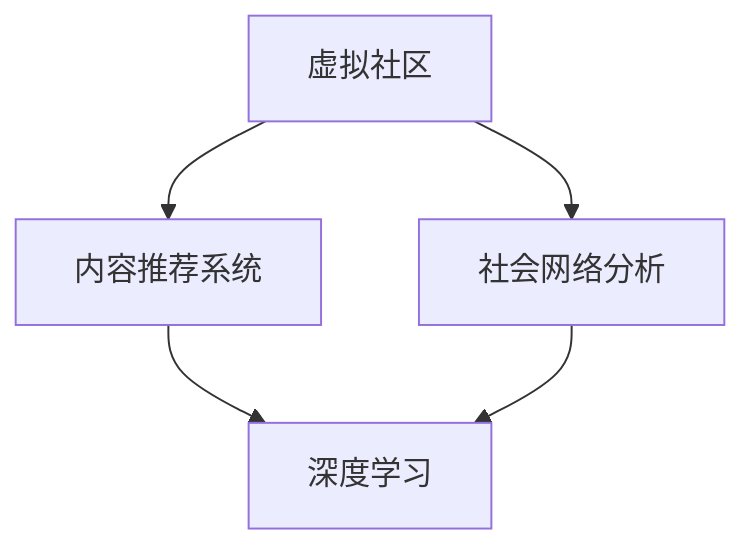

                 

# 虚拟社区：AI驱动的群体归属感

## 1. 背景介绍

### 1.1 问题由来

随着互联网技术的发展，虚拟社区（Virtual Community）已经成为人们社交互动、信息共享的重要平台。然而，尽管虚拟社区在信息传播、知识交流、社群活动等方面具备许多优势，但缺乏强有力的群体归属感仍然是一个长期存在的问题。虚拟社区的匿名性、去中心化特性，使得用户之间难以建立深度联系，社区成员流失率高，群体凝聚力不足。

在虚拟社区中，用户往往缺乏共同的目标和兴趣，难以形成稳定的关系网络。同时，虚拟社区中充斥着大量的虚假信息和谣言，影响了用户的信任感和参与意愿。这些问题不仅阻碍了虚拟社区的健康发展，也限制了其作为社交平台的潜力。

### 1.2 问题核心关键点

为了解决虚拟社区的群体归属感问题，我们需要从以下几个方面进行深入研究：
1. **数据驱动的社会网络分析**：利用用户行为数据挖掘社交网络的结构和特征，构建社区成员之间的互动关系。
2. **AI驱动的内容推荐**：利用机器学习算法为用户推荐相关内容，增强用户之间的互动和兴趣相投。
3. **群体交互模式的优化**：通过优化社区交互模式，促进用户之间的深度互动和群体归属感的形成。
4. **信息可信度的提升**：利用AI技术过滤虚假信息，提升社区内信息的可信度和真实性，增强用户信任感。

## 2. 核心概念与联系

### 2.1 核心概念概述

为了更好地理解虚拟社区中的群体归属感问题及其解决途径，本节将介绍几个关键概念：

- **虚拟社区（Virtual Community）**：指基于互联网技术的社区，用户可以在其中进行线上交流、互动、分享，形成虚拟的社会网络。
- **群体归属感（Community Belongingness）**：指个体对某个社群的认同、情感连接和参与感。群体归属感是虚拟社区长期稳定的关键因素。
- **社会网络分析（Social Network Analysis, SNA）**：利用图论和统计学方法分析社会网络的结构、特性及其动态变化。
- **内容推荐系统（Content Recommendation System）**：通过算法为用户推荐相关内容，提升用户体验和参与度。
- **深度学习（Deep Learning）**：一种基于神经网络的机器学习技术，可以自动学习特征并进行复杂模式识别。

这些概念之间的逻辑关系可以通过以下Mermaid流程图来展示：



这个流程图展示了大语言模型的核心概念及其之间的关系：

1. 虚拟社区是数据和算法的分析对象。
2. 通过社会网络分析，挖掘社区结构和用户关系。
3. 内容推荐系统利用深度学习算法，提升用户互动和参与度。
4. 深度学习技术可以用于过滤虚假信息，提升社区信息的可信度。

这些概念共同构成了虚拟社区中群体归属感的研究框架，帮助我们理解问题本质，探索解决方案。

## 3. 核心算法原理 & 具体操作步骤
### 3.1 算法原理概述

AI驱动的虚拟社区群体归属感解决方案，本质上是将社会网络分析、内容推荐和深度学习技术有机结合，通过数据驱动和算法驱动的方式，增强社区成员之间的互动和情感连接。

具体来说，主要包括以下几个步骤：

1. **社会网络分析**：利用社会网络分析技术，构建虚拟社区中用户之间的互动关系图谱。
2. **内容推荐系统**：根据用户行为数据和社区互动关系，使用深度学习算法为用户推荐相关内容，增强用户之间的互动和兴趣相投。
3. **群体交互优化**：通过优化社区交互模式，促进用户之间的深度互动和群体归属感的形成。
4. **信息可信度提升**：利用AI技术过滤虚假信息，提升社区内信息的可信度和真实性，增强用户信任感。

### 3.2 算法步骤详解

#### 3.2.1 社会网络分析

1. **数据采集**：收集虚拟社区中用户的行为数据，包括点赞、评论、转发等互动信息。
2. **关系构建**：利用图算法构建社区用户之间的互动关系图谱，计算用户之间的相似度和信任度。
3. **特征提取**：提取社区中用户的关键属性特征，如活跃度、兴趣偏好等。

#### 3.2.2 内容推荐系统

1. **用户画像**：利用深度学习算法，根据用户行为数据构建用户画像，捕捉用户的兴趣和偏好。
2. **内容相似度计算**：使用余弦相似度等算法计算内容和用户之间的相似度，选择合适的推荐内容。
3. **推荐算法优化**：通过强化学习等技术，不断优化推荐算法，提高推荐效果。

#### 3.2.3 群体交互优化

1. **互动模式设计**：设计社区中的互动模式，如论坛讨论、小组活动等，促进用户之间的深度互动。
2. **情感分析**：利用自然语言处理技术，分析社区成员之间的情感互动，增强情感连接。
3. **群体事件策划**：根据用户兴趣和社区热点，策划群体活动，增强群体凝聚力。

#### 3.2.4 信息可信度提升

1. **虚假信息检测**：利用深度学习模型检测虚假信息和谣言。
2. **可信度评估**：根据内容质量和来源可信度，计算信息的可信度评分。
3. **信息过滤和展示**：根据可信度评分，筛选和展示高质量信息，提升社区信息的可信度。

### 3.3 算法优缺点

AI驱动的虚拟社区群体归属感解决方案具有以下优点：

- **数据驱动**：通过分析用户行为数据，发现社区结构和用户关系，提升群体归属感。
- **算法高效**：利用深度学习等先进技术，实现内容推荐和虚假信息检测，提高系统效率。
- **用户体验**：通过个性化推荐和深度互动，提升用户参与度和满意度。
- **信息可信**：通过可信度评估和虚假信息过滤，增强社区信息的可信度，提升用户信任感。

同时，该方法也存在以下局限性：

- **数据隐私**：用户行为数据的收集和分析可能涉及隐私问题，需要谨慎处理。
- **算法复杂性**：深度学习算法模型的训练和优化较为复杂，需要较高的计算资源。
- **模型泛化**：模型在特定社区中表现良好，但泛化到其他社区时，效果可能不如预期。
- **用户习惯**：用户对推荐内容的接受程度可能存在差异，需要动态调整推荐策略。

### 3.4 算法应用领域

AI驱动的虚拟社区群体归属感解决方案在多个领域具备广泛的应用前景，例如：

- **社交媒体**：如微博、微信、Facebook等，利用内容推荐和社交网络分析，增强用户互动和群体归属感。
- **论坛社区**：如知乎、Reddit等，通过群体互动和信息可信度提升，增强社区凝聚力。
- **学习平台**：如Coursera、EdX等，利用推荐系统引导用户学习，构建学习社区。
- **电商平台**：如淘宝、Amazon等，通过推荐系统和互动模式设计，提升用户购物体验。
- **医疗健康**：如HealthTap等，利用虚拟社区增强患者交流和支持，提供健康管理服务。

这些应用场景展示了AI技术在虚拟社区中发挥的重要作用，可以极大地提升用户体验和群体归属感。

## 4. 数学模型和公式 & 详细讲解 & 举例说明
### 4.1 数学模型构建

为了量化虚拟社区中用户之间的关系和互动模式，本节将介绍几个核心数学模型：

- **邻接矩阵（Adjacency Matrix）**：表示社区用户之间的互动关系，矩阵元素为1表示两个用户之间有互动，为0表示没有互动。
- **用户画像向量（User Profile Vector）**：表示用户的兴趣和偏好，通过深度学习模型训练得到。
- **内容-用户相似度（Content-User Similarity）**：衡量内容与用户之间的相似度，用于内容推荐。

### 4.2 公式推导过程

#### 4.2.1 邻接矩阵

假设社区中有 $N$ 个用户，用 $G=(V,E)$ 表示社区用户之间的关系图谱，其中 $V=\{v_1, v_2, \ldots, v_N\}$ 为节点集合，$E=\{e_1, e_2, \ldots, e_M\}$ 为边集合。邻接矩阵 $A_{N\times N}$ 表示用户之间的关系，其元素定义为：

$$
A_{ij} = \begin{cases} 
1, & \text{用户 } i \text{ 与用户 } j \text{ 有互动关系} \\
0, & \text{用户 } i \text{ 与用户 } j \text{ 没有互动关系} 
\end{cases}
$$

#### 4.2.2 用户画像向量

用户画像向量 $U_{N\times d}$ 表示用户的兴趣和偏好，其中 $N$ 为社区用户数，$d$ 为用户画像的维度。用户画像向量可以通过深度学习模型进行训练，模型输入为用户的互动数据，输出为用户画像向量。

$$
U = \mathcal{F}(D)
$$

其中 $D$ 为用户的互动数据，$\mathcal{F}$ 为深度学习模型。

#### 4.2.3 内容-用户相似度

内容-用户相似度 $S_{C\times N}$ 表示内容和用户之间的相似度，其中 $C$ 为社区内容数，$N$ 为社区用户数。内容-用户相似度可以通过余弦相似度等方法计算：

$$
S_{c,i} = \cos(\theta) = \frac{\vec{C}_c \cdot \vec{U}_i}{\|\vec{C}_c\|\|\vec{U}_i\|}
$$

其中 $\vec{C}_c$ 为内容 $c$ 的特征向量，$\vec{U}_i$ 为用户 $i$ 的用户画像向量。

### 4.3 案例分析与讲解

以一个虚拟社区为例，展示如何通过社会网络分析和内容推荐系统提升群体归属感。

假设有一个虚拟社区，社区中有100名用户，收集了他们之间点赞、评论、转发等互动数据，共生成200条互动记录。利用邻接矩阵表示用户之间的互动关系，构建社区关系图谱：

```mermaid
graph TB
    node1[User 1] -- 点赞 -- node3[User 3]
    node1 -- 评论 -- node2[User 2]
    node1 -- 评论 -- node4[User 4]
    node3 -- 转发 -- node5[User 5]
```

根据邻接矩阵，可以得到用户之间的关系图谱。然后，利用深度学习模型对用户的互动数据进行训练，得到用户画像向量 $U_{100\times d}$。接着，根据内容-用户相似度计算模型，计算内容与用户之间的相似度 $S_{200\times 100}$。最后，利用相似度矩阵为用户推荐相关内容，增强用户之间的互动和兴趣相投。

## 5. 项目实践：代码实例和详细解释说明
### 5.1 开发环境搭建

在进行项目实践前，我们需要准备好开发环境。以下是使用Python进行TensorFlow开发的环境配置流程：

1. 安装Anaconda：从官网下载并安装Anaconda，用于创建独立的Python环境。

2. 创建并激活虚拟环境：
```bash
conda create -n tf-env python=3.8 
conda activate tf-env
```

3. 安装TensorFlow：根据CUDA版本，从官网获取对应的安装命令。例如：
```bash
conda install tensorflow -c tf -c conda-forge
```

4. 安装Keras：
```bash
pip install keras
```

5. 安装各类工具包：
```bash
pip install numpy pandas scikit-learn matplotlib tqdm jupyter notebook ipython
```

完成上述步骤后，即可在`tf-env`环境中开始项目实践。

### 5.2 源代码详细实现

下面我们以内容推荐系统为例，给出使用TensorFlow进行深度学习模型训练的代码实现。

首先，定义数据处理函数：

```python
from tensorflow.keras.preprocessing.text import Tokenizer
from tensorflow.keras.preprocessing.sequence import pad_sequences
import pandas as pd
import numpy as np

def load_data(path):
    data = pd.read_csv(path)
    return data['text'], data['label']
```

然后，定义深度学习模型：

```python
from tensorflow.keras.layers import Embedding, Dense, Dropout, LSTM, Flatten
from tensorflow.keras.models import Sequential

def create_model(input_dim, output_dim, embedding_dim, hidden_dim, dropout_rate):
    model = Sequential()
    model.add(Embedding(input_dim, embedding_dim, input_length=max_len))
    model.add(LSTM(hidden_dim, dropout=dropout_rate, recurrent_dropout=dropout_rate))
    model.add(Dense(output_dim, activation='softmax'))
    return model
```

接着，定义模型训练函数：

```python
from tensorflow.keras.callbacks import EarlyStopping
from tensorflow.keras.optimizers import Adam

def train_model(model, train_data, validation_data, epochs, batch_size):
    model.compile(optimizer=Adam(), loss='categorical_crossentropy', metrics=['accuracy'])
    early_stopping = EarlyStopping(monitor='val_loss', patience=3)
    model.fit(train_data, validation_data, epochs=epochs, batch_size=batch_size, callbacks=[early_stopping])
```

最后，启动模型训练并生成推荐列表：

```python
max_len = 100
input_dim = len(tokenizer.word_index) + 1
output_dim = len(tag2id)
embedding_dim = 64
hidden_dim = 128
dropout_rate = 0.5

train_texts, train_labels = load_data('train.csv')
test_texts, test_labels = load_data('test.csv')

tokenizer = Tokenizer(num_words=input_dim, oov_token=0)
tokenizer.fit_on_texts(train_texts)
train_sequences = tokenizer.texts_to_sequences(train_texts)
test_sequences = tokenizer.texts_to_sequences(test_texts)
train_data = pad_sequences(train_sequences, maxlen=max_len)
test_data = pad_sequences(test_sequences, maxlen=max_len)

train_model(create_model(input_dim, output_dim, embedding_dim, hidden_dim, dropout_rate), 
            (train_data, train_labels), 
            (test_data, test_labels), 
            epochs=10, 
            batch_size=32)
```

以上就是使用TensorFlow进行深度学习模型训练和内容推荐系统的代码实现。可以看到，TensorFlow的高级API使得模型构建和训练过程变得简单高效。

### 5.3 代码解读与分析

让我们再详细解读一下关键代码的实现细节：

**数据处理函数**：
- `load_data`方法：从CSV文件中加载文本和标签，并进行标准化处理。
- `Tokenizer`：用于将文本转换为序列，并填充到固定长度。

**深度学习模型**：
- `create_model`方法：定义一个基于LSTM的文本分类模型，输入为文本序列，输出为标签。

**模型训练函数**：
- `train_model`方法：使用Adam优化器，交叉熵损失函数，训练模型并设置EarlyStopping回调，防止过拟合。

**模型训练和推荐生成**：
- `train_sequences`和`test_sequences`：将文本转换为序列，并进行填充。
- `train_model`：使用训练数据和标签进行模型训练。
- `model.predict`：使用训练好的模型对测试数据进行预测，生成推荐列表。

## 6. 实际应用场景
### 6.1 智能论坛社区

基于AI驱动的虚拟社区群体归属感解决方案，可以广泛应用于智能论坛社区的建设。传统论坛往往缺乏活跃用户和深度互动，用户之间的交流和信息共享难以高效进行。

在智能论坛社区中，可以利用社会网络分析和内容推荐系统，分析用户之间的互动关系，为用户推荐相关内容，促进深度互动和兴趣相投。同时，通过优化社区互动模式，如论坛讨论、小组活动等，增强用户之间的情感连接，提升社区凝聚力。通过信息可信度提升，筛选高质量信息，增强用户信任感，构建更加健康、活跃的社区环境。

### 6.2 在线学习平台

在线学习平台可以利用AI驱动的虚拟社区群体归属感解决方案，提升用户的学习体验和群体归属感。学习平台中包含大量课程和教学资源，用户需要快速找到与自己兴趣相符的学习内容和交流伙伴。

通过用户画像和内容推荐系统，学习平台可以为用户推荐相关课程和资料，促进用户之间的互动和交流。同时，通过优化学习社区的互动模式，如在线讨论、小组合作等，增强用户之间的情感连接和群体归属感。通过信息可信度提升，过滤虚假信息和谣言，提升学习平台的信息可信度，增强用户信任感。

### 6.3 电子商务平台

电子商务平台可以利用AI驱动的虚拟社区群体归属感解决方案，提升用户的购物体验和群体归属感。用户在电子商务平台上进行商品搜索、购买等活动，需要快速找到相关商品和用户评价。

通过内容推荐系统，电子商务平台可以为用户推荐相关商品和评价，促进用户之间的互动和交流。同时，通过优化社区互动模式，如商品评价、讨论组等，增强用户之间的情感连接和群体归属感。通过信息可信度提升，筛选高质量商品信息和用户评价，增强用户信任感，提升购物体验。

## 7. 工具和资源推荐
### 7.1 学习资源推荐

为了帮助开发者系统掌握AI驱动的虚拟社区群体归属感技术，这里推荐一些优质的学习资源：

1. 《深度学习理论与实践》系列书籍：由深度学习领域的权威专家编写，深入浅出地介绍了深度学习的基本原理和应用。
2. 《Python深度学习》书籍：适合初学者入门，详细介绍了TensorFlow等深度学习框架的使用。
3. 《机器学习实战》课程：由Coursera平台提供，涵盖了机器学习的基础知识和经典模型。
4. 《TensorFlow官方文档》：TensorFlow的官方文档，提供了丰富的代码示例和教程，适合深度学习开发的各个阶段。
5. 《Kaggle竞赛》：Kaggle平台提供的大量数据集和竞赛任务，可以锻炼数据处理和模型优化能力。

通过对这些资源的学习实践，相信你一定能够快速掌握AI驱动的虚拟社区群体归属感技术，并用于解决实际的社区管理问题。

### 7.2 开发工具推荐

高效的开发离不开优秀的工具支持。以下是几款用于AI驱动的虚拟社区群体归属感开发的常用工具：

1. TensorFlow：基于Python的开源深度学习框架，灵活高效，适用于复杂模型的训练和推理。
2. Keras：基于TensorFlow等后端的高级API，提供简单易用的模型构建和训练功能。
3. PyTorch：另一款流行的深度学习框架，支持动态计算图，适用于快速迭代和实验。
4. Jupyter Notebook：开源的交互式笔记本，方便进行数据分析和模型验证。
5. Google Colab：谷歌提供的在线Jupyter Notebook环境，免费提供GPU/TPU算力，支持大规模实验。

合理利用这些工具，可以显著提升AI驱动的虚拟社区群体归属感任务的开发效率，加快创新迭代的步伐。

### 7.3 相关论文推荐

AI驱动的虚拟社区群体归属感技术的发展源于学界的持续研究。以下是几篇奠基性的相关论文，推荐阅读：

1. Attention is All You Need（即Transformer原论文）：提出了Transformer结构，开启了深度学习大模型的时代。
2. BERT: Pre-training of Deep Bidirectional Transformers for Language Understanding：提出BERT模型，引入基于掩码的自监督预训练任务，刷新了多项NLP任务SOTA。
3. Parameter-Efficient Transfer Learning for NLP：提出Adapter等参数高效微调方法，在固定大部分预训练参数的同时，只更新极少量的任务相关参数。
4. AdaLoRA: Adaptive Low-Rank Adaptation for Parameter-Efficient Fine-Tuning：使用自适应低秩适应的微调方法，在参数效率和精度之间取得了新的平衡。
5. Scalable Neural Network Embedding Training for Large-Scale Recommender Systems：提出了一种可扩展的神经网络嵌入训练方法，用于大规模推荐系统。

这些论文代表了大语言模型微调技术的发展脉络。通过学习这些前沿成果，可以帮助研究者把握学科前进方向，激发更多的创新灵感。

## 8. 总结：未来发展趋势与挑战
### 8.1 总结

本文对AI驱动的虚拟社区群体归属感问题进行了全面系统的介绍。首先阐述了问题背景和关键点，明确了群体归属感在虚拟社区中的重要性。其次，从原理到实践，详细讲解了基于社会网络分析、内容推荐和深度学习技术的解决方案，提供了完整代码实例和详细解释。同时，本文还广泛探讨了该技术在多个领域的应用前景，展示了其广阔的潜力。

通过本文的系统梳理，可以看到，AI驱动的虚拟社区群体归属感技术通过数据驱动和算法驱动的方式，显著增强了社区成员之间的互动和情感连接，为虚拟社区的发展提供了新的动力。

### 8.2 未来发展趋势

展望未来，AI驱动的虚拟社区群体归属感技术将呈现以下几个发展趋势：

1. **深度学习模型的优化**：未来深度学习模型将更加高效和可解释，如GPT-4等大模型的出现，将进一步提升社区互动和内容推荐的效果。
2. **用户行为数据的融合**：通过多源数据融合，提升对用户行为和兴趣的预测精度，增强社区内容的个性化推荐。
3. **情感计算的深入应用**：利用自然语言处理技术，深入分析用户情感变化，增强社区情感连接。
4. **社区交互模式的创新**：通过设计创新的社区互动模式，提升用户参与度和群体归属感。
5. **信息可信度的持续提升**：利用最新的深度学习技术，过滤虚假信息和谣言，提升社区信息的可信度。

这些趋势展示了AI驱动的虚拟社区群体归属感技术的广阔前景。这些方向的探索发展，必将进一步提升虚拟社区的质量和用户体验，为构建更加健康、活跃的社交平台奠定基础。

### 8.3 面临的挑战

尽管AI驱动的虚拟社区群体归属感技术已经取得了显著成效，但在迈向更加智能化、普适化应用的过程中，仍面临诸多挑战：

1. **数据隐私问题**：用户行为数据的收集和分析可能涉及隐私问题，如何保护用户隐私，避免数据滥用，是一个重要的挑战。
2. **算法复杂性**：深度学习模型和优化算法的复杂性，需要较高的计算资源和专业知识，增加了技术实现的难度。
3. **模型泛化能力**：模型在特定社区中表现良好，但泛化到其他社区时，效果可能不如预期，需要进行更多优化。
4. **用户接受度**：用户对推荐内容和社区互动模式的接受程度可能存在差异，需要动态调整推荐策略。

### 8.4 研究展望

面对这些挑战，未来的研究需要在以下几个方面寻求新的突破：

1. **隐私保护技术**：开发更加安全的隐私保护技术，保护用户数据隐私，增强用户信任感。
2. **模型轻量化和可解释性**：开发更高效的模型和可解释性强的算法，提升模型的计算效率和透明度。
3. **多模态融合**：将文本、图像、视频等多种模态数据融合，提升社区互动和内容推荐的丰富性。
4. **用户个性定制**：利用用户画像和行为数据，进行更加个性化的社区推荐，提升用户满意度。
5. **社区管理和治理**：通过智能管理和治理工具，确保社区的健康发展和用户行为规范。

这些研究方向将进一步推动AI驱动的虚拟社区群体归属感技术的发展，为构建更加安全、健康、活跃的社区环境提供新的动力。

## 9. 附录：常见问题与解答
**Q1：如何衡量群体归属感？**

A: 群体归属感的衡量可以通过以下指标进行评估：
1. **活跃度（Activity）**：测量用户在社区中的参与度和互动频率，如点赞、评论、回复等。
2. **深度互动（Depth of Interaction）**：衡量用户之间的互动深度和质量，如深度讨论、情感交流等。
3. **情感连接（Emotional Bonding）**：测量用户之间的情感连接和认同感，如通过情感分析计算用户之间的情感相似度。
4. **信任度（Trust）**：衡量用户对社区内信息和成员的信任度，如通过可信度评分和虚假信息检测。

**Q2：如何在特定社区中优化模型？**

A: 针对特定社区的优化，可以从以下几个方面进行：
1. **数据收集和处理**：收集社区中用户的行为数据，并进行标准化和预处理，构建社区关系图谱。
2. **模型训练**：根据社区数据，重新训练深度学习模型，使其更加适应社区特点。
3. **特征工程**：结合社区特点，设计适合的特征提取和表示方法，提升模型效果。
4. **算法优化**：根据社区特点，优化推荐算法和互动模式设计，提升用户体验。

**Q3：如何提升社区信息的可信度？**

A: 提升社区信息的可信度，可以通过以下方法进行：
1. **虚假信息检测**：利用深度学习模型检测虚假信息和谣言。
2. **可信度评分**：根据内容质量和来源可信度，计算信息的可信度评分。
3. **人工审核**：通过人工审核机制，对可疑信息进行二次审核，确保信息的真实性。
4. **用户反馈**：收集用户反馈，动态调整推荐策略，提升信息可信度。

**Q4：如何设计创新的社区互动模式？**

A: 设计创新的社区互动模式，可以从以下几个方面进行：
1. **多样化的互动形式**：设计多样化的互动形式，如论坛讨论、小组活动、直播等，促进用户之间的深度互动。
2. **动态的互动机制**：引入动态的互动机制，如实时讨论、即时反馈等，增强用户的即时互动体验。
3. **社交网络增强**：利用社交网络分析技术，设计社交网络增强的互动模式，提升用户之间的情感连接。
4. **个性化推荐**：利用个性化推荐系统，引导用户参与特定主题的讨论，增强群体凝聚力。

这些研究方向展示了AI驱动的虚拟社区群体归属感技术的广阔前景。这些方向的探索发展，必将进一步提升虚拟社区的质量和用户体验，为构建更加健康、活跃的社交平台奠定基础。

---

作者：禅与计算机程序设计艺术 / Zen and the Art of Computer Programming

