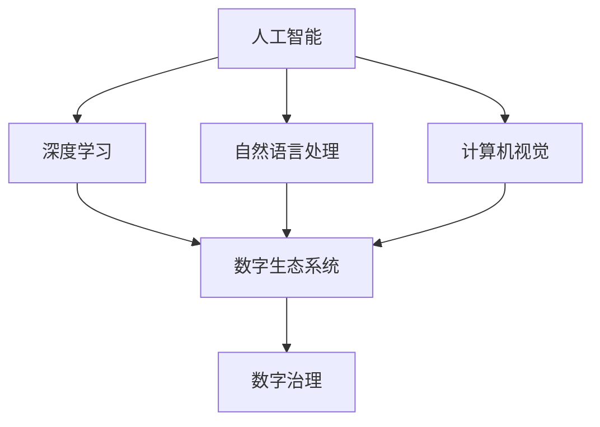

                 

# 虚拟进化：AI驱动的数字生态系统

## 1. 背景介绍

### 1.1 问题由来
近年来，人工智能（AI）技术的迅猛发展，尤其是在深度学习和大数据驱动下，使得AI技术在各行各业得到了广泛应用。从自动驾驶、智能制造到医疗健康、教育娱乐，AI技术正在全面渗透到人们的生活中，塑造着新的产业生态系统。

然而，随着AI技术的普及，也带来了一些新的挑战。比如，数据隐私、算法偏见、技术透明性等问题逐步凸显。这些问题不仅影响了AI技术的广泛应用，也使得人们对其未来发展产生了担忧。

## 2. 核心概念与联系

### 2.1 核心概念概述

为更好地理解AI驱动的数字生态系统，本节将介绍几个关键概念：

- 人工智能（AI）：通过模拟人脑的工作机制，使机器能够完成一些通常需要人类智能才能完成的任务。
- 深度学习（DL）：一种基于神经网络的机器学习技术，通过多层次的非线性变换，能够从原始数据中提取高级特征。
- 自然语言处理（NLP）：研究如何使计算机理解、解释和生成人类语言的技术。
- 计算机视觉（CV）：研究如何让计算机像人类一样“看”世界，从图像、视频等视觉数据中提取信息。
- 数字生态系统：由各种参与者（如消费者、企业、政府等）组成的数字交互网络，其中AI技术起着核心驱动作用。
- 数字治理（Digital Governance）：利用AI技术对数字生态系统进行治理，确保系统运行透明、安全和高效。

这些核心概念之间存在紧密的联系，共同构成了AI驱动的数字生态系统。通过理解这些概念，我们可以更好地把握AI技术的发展方向和应用前景。

### 2.2 核心概念原理和架构的 Mermaid 流程图



## 3. 核心算法原理 & 具体操作步骤

### 3.1 算法原理概述

AI驱动的数字生态系统，本质上是一个由AI技术驱动的复杂动态系统。其核心算法原理基于深度学习和大数据技术，通过学习海量数据中的模式，使AI系统能够实现自适应、自学习和自优化。

具体而言，该系统包括：

- 数据采集：从互联网、传感器、社交媒体等渠道收集数据。
- 数据预处理：清洗、归一化、标注等步骤，确保数据质量。
- 模型训练：基于深度学习算法，在标注数据上训练AI模型。
- 模型评估：在测试集上评估模型性能，确保模型泛化能力强。
- 模型部署：将训练好的模型部署到实际应用场景中。
- 模型监控：实时监测模型性能，进行必要的调整和优化。

通过上述流程，AI驱动的数字生态系统可以实现对数据的实时分析、预测和决策，从而驱动数字经济的发展。

### 3.2 算法步骤详解

以下以自然语言处理（NLP）为例，详细讲解AI驱动的数字生态系统的算法步骤：

#### 3.2.1 数据采集与预处理

首先，需要从互联网、社交媒体、用户行为记录等渠道采集文本数据。然后对数据进行预处理，包括清洗、分词、去除停用词等步骤，得到标准的文本格式。

#### 3.2.2 模型训练

基于预处理后的文本数据，选择合适的深度学习模型（如RNN、LSTM、Transformer等）进行训练。在训练过程中，选择合适的损失函数（如交叉熵、softmax等），使用优化器（如Adam、SGD等）进行参数更新。

#### 3.2.3 模型评估

在测试集上评估模型的性能，计算准确率、召回率、F1值等指标，确保模型泛化能力强。如果模型性能不理想，需要重新调整超参数，重新训练模型。

#### 3.2.4 模型部署

将训练好的模型部署到实际应用场景中，如智能客服、情感分析、舆情监测等。

#### 3.2.5 模型监控与优化

实时监测模型的性能，记录模型在实际应用中的表现，并根据反馈进行模型优化。

### 3.3 算法优缺点

AI驱动的数字生态系统具有以下优点：

1. 自动化与高效性：自动化处理大量数据，快速产生高质量的AI模型。
2. 泛化能力：基于大数据训练的AI模型，能够泛化到新数据上，实现自适应学习。
3. 实时决策：基于AI模型的实时分析，能够快速响应外部环境变化，提高决策效率。

然而，该系统也存在一些缺点：

1. 数据隐私问题：数据采集和处理过程中可能涉及用户隐私，需要采取严格的隐私保护措施。
2. 模型偏见问题：AI模型可能会学习到数据中的偏见，导致输出结果有歧视性。
3. 模型透明性问题：AI模型通常是一个“黑箱”，难以解释其决策过程，缺乏透明度。

### 3.4 算法应用领域

AI驱动的数字生态系统已经在多个领域得到广泛应用，例如：

- 智能制造：通过机器视觉、自然语言处理技术，实现智能检测、质量控制、智能调度等。
- 医疗健康：通过图像识别、自然语言处理技术，实现医学影像诊断、病历分析、智能问诊等。
- 金融科技：通过自然语言处理、机器学习技术，实现智能投顾、风险评估、反欺诈等。
- 智能客服：通过自然语言处理、情感分析技术，实现智能客服、自动化回复等。

## 4. 数学模型和公式 & 详细讲解 & 举例说明

### 4.1 数学模型构建

以文本分类为例，假设输入文本为 $x$，输出标签为 $y$，模型的目标是预测文本 $x$ 属于哪个类别 $y$。

在文本分类任务中，常用的模型包括卷积神经网络（CNN）、递归神经网络（RNN）、长短时记忆网络（LSTM）和Transformer。其中，Transformer模型是目前最先进的文本分类模型之一，其主要原理是自注意力机制和多头注意力机制。

### 4.2 公式推导过程

假设输入文本 $x$ 的长度为 $T$，输出标签 $y$ 为 $C$ 个类别的独热编码向量，模型的输出为 $y$ 的概率向量 $p$。

Transformer模型由编码器和解码器两部分组成，其输入为编码器，输出为解码器。编码器由多个自注意力层和前馈神经网络层组成，解码器由多头注意力机制和输出层组成。

假设模型的参数为 $\theta$，则模型的预测输出 $p$ 可以表示为：

$$
p = softmax(W^Ty + b)
$$

其中，$W$ 和 $b$ 是模型的权重和偏置，$softmax$ 函数将输出向量转化为概率分布。

在训练过程中，模型的损失函数通常采用交叉熵损失，计算公式为：

$$
L = -\frac{1}{N}\sum_{i=1}^{N}y_ilog(p_i)
$$

其中，$y_i$ 是第 $i$ 个样本的真实标签，$p_i$ 是模型对第 $i$ 个样本的预测概率。

### 4.3 案例分析与讲解

以情感分析任务为例，假设输入文本为“这个产品真的很棒！”，模型的目标是判断其情感倾向（正面、负面或中性）。

首先，使用Transformer模型对文本进行编码，得到文本的特征向量 $x$。然后，使用softmax函数将特征向量 $x$ 转化为情感分类的概率分布 $p$。最后，计算损失函数 $L$，并通过反向传播更新模型参数。

假设模型的预测输出为 $p=[0.1,0.9,0.0]$，则表示该文本的情感倾向为正面。在训练过程中，如果实际情感倾向为正面，则损失函数 $L$ 最小化；反之，则 $L$ 最大化。

## 5. 项目实践：代码实例和详细解释说明

### 5.1 开发环境搭建

在进行项目实践前，需要先搭建好开发环境。以下是使用Python进行TensorFlow开发的环境配置流程：

1. 安装Anaconda：从官网下载并安装Anaconda，用于创建独立的Python环境。

2. 创建并激活虚拟环境：
```bash
conda create -n tf-env python=3.8 
conda activate tf-env
```

3. 安装TensorFlow：
```bash
pip install tensorflow==2.3
```

4. 安装各类工具包：
```bash
pip install numpy pandas scikit-learn matplotlib tqdm jupyter notebook ipython
```

完成上述步骤后，即可在`tf-env`环境中开始项目实践。

### 5.2 源代码详细实现

以下是使用TensorFlow进行文本分类的代码实现：

```python
import tensorflow as tf
from tensorflow.keras import layers, models

# 定义模型架构
model = models.Sequential([
    layers.Embedding(input_dim=1000, output_dim=16, input_length=10),
    layers.Conv1D(64, 3, activation='relu'),
    layers.GlobalMaxPooling1D(),
    layers.Dense(64, activation='relu'),
    layers.Dense(3, activation='softmax')
])

# 编译模型
model.compile(optimizer='adam', loss='categorical_crossentropy', metrics=['accuracy'])

# 训练模型
model.fit(train_data, train_labels, epochs=5, validation_data=(test_data, test_labels))

# 评估模型
model.evaluate(test_data, test_labels)
```

在代码中，首先定义了模型的架构，包括嵌入层、卷积层、池化层、全连接层等。然后，使用TensorFlow的Keras API编译模型，设置损失函数、优化器和评价指标。最后，通过`fit`方法训练模型，使用`evaluate`方法评估模型性能。

### 5.3 代码解读与分析

让我们再详细解读一下关键代码的实现细节：

- 嵌入层（Embedding Layer）：将输入的文本序列转化为密集向量表示，用于后续的特征提取。
- 卷积层（Conv1D）：对文本序列进行卷积操作，提取局部特征。
- 池化层（GlobalMaxPooling1D）：对卷积层的输出进行池化操作，保留最有用的特征。
- 全连接层（Dense Layer）：将池化层的输出进行全连接操作，提取全局特征。
- 输出层（Dense Layer）：使用softmax函数将全连接层的输出转化为类别概率分布。

在训练过程中，使用交叉熵损失函数和Adam优化器进行模型训练，通过反向传播更新模型参数。最后，使用测试数据集评估模型性能。

## 6. 实际应用场景

### 6.4 未来应用展望

AI驱动的数字生态系统将在未来的诸多领域得到广泛应用，以下是几个典型的应用场景：

#### 6.4.1 智能制造

在智能制造领域，AI驱动的数字生态系统可以用于生产调度、质量控制、设备维护等。通过机器视觉、自然语言处理技术，实现智能检测、异常预测、自动化调度等功能。

#### 6.4.2 医疗健康

在医疗健康领域，AI驱动的数字生态系统可以用于医学影像诊断、病历分析、智能问诊等。通过图像识别、自然语言处理技术，实现精准诊断、个性化治疗、健康监测等功能。

#### 6.4.3 金融科技

在金融科技领域，AI驱动的数字生态系统可以用于智能投顾、风险评估、反欺诈等。通过自然语言处理、机器学习技术，实现智能分析、自动化决策、风险预警等功能。

#### 6.4.4 智能客服

在智能客服领域，AI驱动的数字生态系统可以用于自动化回复、情感分析、舆情监测等。通过自然语言处理、情感分析技术，实现智能客服、用户反馈分析、舆情监测等功能。

## 7. 工具和资源推荐

### 7.1 学习资源推荐

为了帮助开发者系统掌握AI驱动的数字生态系统的理论基础和实践技巧，这里推荐一些优质的学习资源：

1. 《深度学习》（Ian Goodfellow著）：深度学习领域的经典教材，全面介绍了深度学习的基本概念和算法。
2. Coursera《深度学习专项课程》：由斯坦福大学教授Andrew Ng讲授，系统讲解了深度学习的原理与应用。
3. Udacity《人工智能》课程：涵盖深度学习、计算机视觉、自然语言处理等多个领域的课程，适合初学者和进阶者。
4. GitHub《TensorFlow官方文档》：TensorFlow的官方文档，提供了丰富的API和样例代码，适合深入学习。

通过对这些资源的学习实践，相信你一定能够快速掌握AI驱动的数字生态系统的精髓，并用于解决实际的AI问题。

### 7.2 开发工具推荐

高效的开发离不开优秀的工具支持。以下是几款用于AI开发常用的工具：

1. TensorFlow：Google主导开发的深度学习框架，生产部署方便，适合大规模工程应用。
2. PyTorch：Facebook主导开发的深度学习框架，灵活高效，适合研究和实验。
3. Keras：一个高级神经网络API，易于上手，适合初学者。
4. OpenCV：计算机视觉领域的开源库，提供了丰富的图像处理和分析工具。
5. NLTK：自然语言处理领域的开源库，提供了丰富的文本处理工具。

合理利用这些工具，可以显著提升AI开发任务的开发效率，加快创新迭代的步伐。

### 7.3 相关论文推荐

AI驱动的数字生态系统的发展源于学界的持续研究。以下是几篇奠基性的相关论文，推荐阅读：

1. AlexNet: ImageNet Classification with Deep Convolutional Neural Networks：提出卷积神经网络（CNN），奠定了计算机视觉领域的深度学习基础。
2. RNN: Learning Phrase Representations using RNN Encoder-Decoder for Statistical Machine Translation：提出递归神经网络（RNN），开启了自然语言处理领域的深度学习范式。
3. Attention is All You Need：提出Transformer模型，展示了自注意力机制在自然语言处理任务中的强大性能。
4. BERT: Pre-training of Deep Bidirectional Transformers for Language Understanding：提出BERT模型，展示了预训练语言模型的强大泛化能力。
5. GANs: Generative Adversarial Nets：提出生成对抗网络（GAN），展示了生成模型在图像生成、自然语言生成等任务中的广泛应用。

这些论文代表了大数据和深度学习技术的发展脉络。通过学习这些前沿成果，可以帮助研究者把握学科前进方向，激发更多的创新灵感。

## 8. 总结：未来发展趋势与挑战

### 8.1 总结

本文对AI驱动的数字生态系统的理论基础和实践技巧进行了全面系统的介绍。首先阐述了AI驱动的数字生态系统的背景和意义，明确了其构建的核心算法原理和操作步骤。其次，通过具体的项目实践，展示了AI驱动的数字生态系统的代码实现和运行结果。同时，本文还广泛探讨了AI驱动的数字生态系统在智能制造、医疗健康、金融科技、智能客服等多个领域的应用前景，展示了其广阔的应用前景。此外，本文精选了AI驱动的数字生态系统的各类学习资源，力求为读者提供全方位的技术指引。

通过本文的系统梳理，可以看到，AI驱动的数字生态系统正在成为AI技术应用的重要范式，极大地拓展了AI技术的边界，催生了更多的落地场景。未来，伴随AI技术的持续演进和各行业的深度融合，相信AI驱动的数字生态系统必将在更多的领域大放异彩，为人类社会带来深远影响。

### 8.2 未来发展趋势

展望未来，AI驱动的数字生态系统将呈现以下几个发展趋势：

1. 深度学习技术的持续突破：深度学习技术的不断演进，将带来更高效、更精确的AI模型，进一步推动AI驱动的数字生态系统的发展。
2. 跨领域融合的不断加强：AI驱动的数字生态系统将不断与其他学科和技术进行融合，如物联网、区块链、量子计算等，形成更加全面、先进的技术体系。
3. 数据隐私和安全问题的解决：随着AI技术的普及，数据隐私和安全问题将日益突出。如何保障数据隐私和安全，将是未来的一个重要研究方向。
4. 伦理和社会影响的重视：AI驱动的数字生态系统在带来便利的同时，也可能带来新的社会问题。如何平衡AI技术的利益和风险，将是未来的一个重要课题。
5. 持续学习和动态优化的能力：AI驱动的数字生态系统需要具备持续学习和动态优化的能力，以应对外部环境的变化和复杂性的提升。

以上趋势凸显了AI驱动的数字生态系统的广阔前景。这些方向的探索发展，必将进一步提升AI驱动的数字生态系统的性能和应用范围，为人类社会的智能化进程提供新的动力。

### 8.3 面临的挑战

尽管AI驱动的数字生态系统已经取得了瞩目成就，但在迈向更加智能化、普适化应用的过程中，它仍面临着诸多挑战：

1. 数据隐私问题：数据采集和处理过程中可能涉及用户隐私，需要采取严格的隐私保护措施。
2. 模型偏见问题：AI模型可能会学习到数据中的偏见，导致输出结果有歧视性。
3. 模型透明性问题：AI模型通常是一个“黑箱”，难以解释其决策过程，缺乏透明度。
4. 模型鲁棒性问题：AI模型面对域外数据时，泛化性能往往大打折扣。对于测试样本的微小扰动，模型也容易发生波动。
5. 资源消耗问题：AI模型的训练和推理过程消耗大量的计算资源，如何在资源有限的情况下实现高性能的AI模型，还需要更多的优化。

这些挑战凸显了AI驱动的数字生态系统的复杂性和多样性，需要学界和产业界的共同努力，才能不断提升AI驱动的数字生态系统的性能和应用范围。

### 8.4 研究展望

面对AI驱动的数字生态系统所面临的种种挑战，未来的研究需要在以下几个方面寻求新的突破：

1. 探索无监督和半监督学习范式：摆脱对大规模标注数据的依赖，利用自监督学习、主动学习等无监督和半监督范式，最大限度利用非结构化数据，实现更加灵活高效的AI模型。
2. 开发参数高效的AI模型：开发更加参数高效的AI模型，在固定大部分预训练参数的同时，只更新极少量的任务相关参数。同时优化AI模型的计算图，减少前向传播和反向传播的资源消耗，实现更加轻量级、实时性的部署。
3. 引入因果分析和博弈论工具：将因果分析方法引入AI模型，识别出模型决策的关键特征，增强输出解释的因果性和逻辑性。借助博弈论工具刻画人机交互过程，主动探索并规避模型的脆弱点，提高系统稳定性。
4. 纳入伦理道德约束：在AI模型训练目标中引入伦理导向的评估指标，过滤和惩罚有偏见、有害的输出倾向。同时加强人工干预和审核，建立模型行为的监管机制，确保输出符合人类价值观和伦理道德。
5. 强化跨领域知识融合：将符号化的先验知识，如知识图谱、逻辑规则等，与AI模型进行巧妙融合，引导AI模型学习更准确、合理的知识表示。同时加强不同模态数据的整合，实现视觉、语音等多模态信息与文本信息的协同建模。

这些研究方向将引领AI驱动的数字生态系统迈向更高的台阶，为构建安全、可靠、可解释、可控的智能系统铺平道路。面向未来，AI驱动的数字生态系统还需要与其他人工智能技术进行更深入的融合，如知识表示、因果推理、强化学习等，多路径协同发力，共同推动AI驱动的数字生态系统的进步。只有勇于创新、敢于突破，才能不断拓展AI驱动的数字生态系统的边界，让AI技术更好地造福人类社会。

## 9. 附录：常见问题与解答

**Q1：AI驱动的数字生态系统是否适用于所有行业？**

A: AI驱动的数字生态系统具有高度的通用性和灵活性，已经在多个行业得到广泛应用。然而，不同行业的AI应用场景存在差异，需要根据具体情况进行调整和优化。

**Q2：如何提高AI模型的泛化能力？**

A: 提高AI模型的泛化能力，可以从以下几个方面入手：

1. 数据扩充：增加训练数据的多样性，减少数据偏差。
2. 正则化：使用L2正则、Dropout等技术，防止过拟合。
3. 参数共享：在模型中引入共享参数，增强模型的泛化能力。
4. 迁移学习：利用已有模型的知识，进行知识迁移和适应。

**Q3：AI驱动的数字生态系统面临哪些伦理和法律问题？**

A: AI驱动的数字生态系统面临诸多伦理和法律问题，主要包括：

1. 数据隐私问题：数据采集和处理过程中可能涉及用户隐私，需要采取严格的隐私保护措施。
2. 算法偏见问题：AI模型可能会学习到数据中的偏见，导致输出结果有歧视性。
3. 透明性问题：AI模型通常是一个“黑箱”，难以解释其决策过程，缺乏透明度。
4. 责任归属问题：在AI模型出现错误或误导性输出时，如何确定责任方，还需要进一步明确。

**Q4：如何在有限资源下实现高性能的AI模型？**

A: 在有限资源下实现高性能的AI模型，可以从以下几个方面入手：

1. 模型裁剪：去除不必要的层和参数，减小模型尺寸，加快推理速度。
2. 量化加速：将浮点模型转为定点模型，压缩存储空间，提高计算效率。
3. 模型并行：采用模型并行技术，提高模型的并行度，加速计算过程。
4. 优化器优化：选择高效的优化器，如AdamW、Adafactor等，提高模型训练效率。

这些优化措施可以帮助在有限资源下实现高性能的AI模型，提升AI驱动的数字生态系统的应用效果。

---

作者：禅与计算机程序设计艺术 / Zen and the Art of Computer Programming

