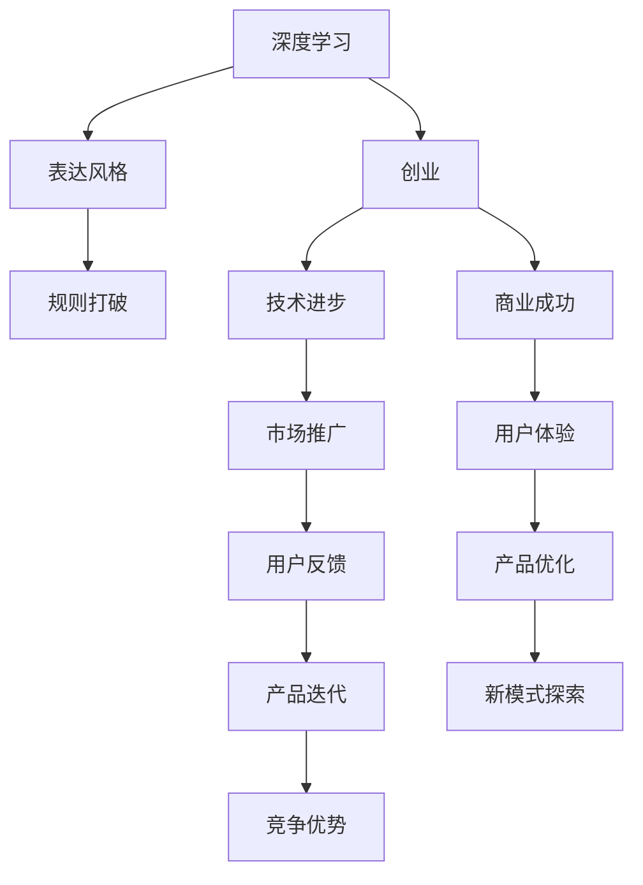

                 

# 表达的直率：贾扬清的风格，在创业中小心打破规则

> 关键词：创业, 贾扬清, 人工智能, 创新, 规则, 技术, 商业

## 1. 背景介绍

### 1.1 问题由来

在当前的科技快速发展的时代，人工智能（AI）正逐渐渗透到各行各业。其中，深度学习作为AI的核心技术，在图像识别、自然语言处理、语音识别等领域取得了显著的进展。而在深度学习领域，贾扬清教授无疑是领军人物之一。

贾扬清教授，不仅是清华大学教授，更是在深度学习领域的知名专家。他曾主导开发了深度学习框架PyTorch，极大地推动了深度学习的发展。此外，他也是众多科技创业公司的创始人之一，通过其独特的技术眼光和商业洞察，成功创办了多家前沿科技公司。

然而，贾扬清教授在创业过程中的直率表达风格，也时常引发争议。他经常发表直接的观点和批评，敢于打破行业规则，这在一定程度上加速了技术的进步，但也带来了不少挑战。本文旨在探讨贾扬清教授在创业中的表达风格，以及这种风格带来的影响。

### 1.2 问题核心关键点

在讨论贾扬清教授的创业过程中，我们关注的核心问题包括：

- **贾扬清教授的创业经历和成就**：如何通过其技术背景和商业经验，推动AI技术的发展？
- **他表达风格的特点**：直率、批判性，打破常规，这些特点是如何影响他的创业之路的？
- **在创业中，这种表达风格带来的正面和负面影响**：他的批判性思维如何推动技术进步，又如何面临挑战和阻碍？
- **未来发展的可能方向**：如何在保持技术前瞻性和商业洞察力的同时，优化表达方式，避免不必要的冲突？

通过这些问题，我们可以更深入地理解贾扬清教授在AI领域的贡献，以及其创业思想对后人的启示。

## 2. 核心概念与联系

### 2.1 核心概念概述

在探讨贾扬清教授的表达风格和创业经验时，我们需要理解以下几个关键概念：

- **深度学习（Deep Learning）**：一种基于神经网络的机器学习方法，广泛应用于计算机视觉、自然语言处理等领域。
- **创业（Entrepreneurship）**：创立并管理一家企业的过程，涉及技术、市场、管理等多个方面的综合运用。
- **表达风格（Communication Style）**：个体在表达思想和观点时的特点，如直率、批判性、创新性等。
- **规则打破（Rule-Breaking）**：在常规框架之外进行创新和探索，带来新的视角和方法。

这些概念之间有紧密的联系，共同构成了贾扬清教授在AI领域的独特创业之路。

### 2.2 核心概念原理和架构的 Mermaid 流程图



这个流程图展示了深度学习、创业、表达风格和规则打破之间的联系。深度学习提供了技术基础，创业提供了商业化场景，表达风格和规则打破则推动了技术创新和商业模式的探索。

## 3. 核心算法原理 & 具体操作步骤

### 3.1 算法原理概述

贾扬清教授在创业中的表达风格，可以类比为一种深度学习模型。在这个模型中，他的直率、批判性表达作为“输入”，规则打破作为“训练过程”，而技术进步和商业成功则是“输出”。这种表达风格的核心在于“对抗训练”，即通过不断的挑战和质疑，推动自身和团队向前发展。

### 3.2 算法步骤详解

1. **设定表达目标**：明确创业过程中需要解决的核心问题，如技术瓶颈、市场挑战等。
2. **分析问题现状**：通过直率的表达，深入分析问题的本质，找出现有解决方案的不足。
3. **制定解决方案**：基于对问题的深入理解，制定创新的解决方案，包括技术突破和商业模式创新。
4. **实施和调整**：将解决方案付诸实践，并根据反馈不断调整和优化。
5. **持续迭代**：通过不断的迭代和改进，逐步提升技术和商业的成熟度。

### 3.3 算法优缺点

#### 优点：

- **技术创新**：直率的表达风格能够快速识别技术瓶颈，推动团队进行深度技术攻关。
- **问题暴露**：批判性思维能够快速暴露问题，避免表面化和形式主义，促进问题解决。
- **规则突破**：规则打破带来新的视角和方法，推动技术进步和商业模式的创新。

#### 缺点：

- **冲突和反对**：直率的表达容易引发内部和外部的反对和冲突，影响团队士气。
- **压力大**：高标准和严要求可能带来心理压力，影响工作环境和效率。
- **难以复制**：贾扬清教授的成功经验难以简单复制，需要具备相同的技术背景和商业洞察力。

### 3.4 算法应用领域

贾扬清教授的表达风格和规则打破，不仅在AI领域，也在更广泛的创业领域具有普遍意义。例如，在医疗科技、金融科技、教育科技等领域，通过打破常规，推动技术创新和商业模式变革，均取得了显著的成就。

## 4. 数学模型和公式 & 详细讲解 & 举例说明

### 4.1 数学模型构建

假设创业过程中遇到的问题可以用一个函数$f(x)$来表示，其中$x$表示创业中的各种因素，如技术、市场、团队等。通过直率的表达和规则打破，可以将其转化为一个优化问题，即找到最优的$x$值，使$f(x)$最小化。

### 4.2 公式推导过程

在优化问题中，我们需要找到一个参数$w$，使得$w^T f(x)$最小化。其中，$w$表示我们的表达方式和规则打破策略，$f(x)$表示创业中的问题。

推导过程如下：

$$
w^T f(x) \rightarrow \min_{w} \{ w^T f(x) \}
$$

通过上述公式，我们可以找到最优的$w$值，从而解决创业中的问题。

### 4.3 案例分析与讲解

以贾扬清教授创办的PyTorch为例，通过直率的表达和规则打破，成功地推动了深度学习框架的发展。在开发初期，贾扬清教授通过与社区的深度交流，迅速发现了TensorFlow等框架的不足，提出了自己的改进方案。通过不断的迭代和优化，最终构建了一个更加灵活、易用的深度学习框架。

## 5. 项目实践：代码实例和详细解释说明

### 5.1 开发环境搭建

在创业过程中，搭建一个高效的技术开发环境至关重要。以下是基本的开发环境搭建流程：

1. **选择合适的编程语言和框架**：例如，选择Python作为主要编程语言，PyTorch作为深度学习框架。
2. **安装必要的依赖和库**：通过pip、conda等工具安装所需的依赖库，如TensorFlow、PaddlePaddle等。
3. **搭建开发环境**：使用Docker、Virtualenv等工具搭建隔离的开发环境，确保开发过程中的稳定性。

### 5.2 源代码详细实现

以PyTorch为例，以下是基本的PyTorch代码实现：

```python
import torch
import torch.nn as nn
import torch.optim as optim

# 定义模型
class MyModel(nn.Module):
    def __init__(self):
        super(MyModel, self).__init__()
        self.linear = nn.Linear(10, 1)

    def forward(self, x):
        return self.linear(x)

# 定义优化器
model = MyModel()
optimizer = optim.SGD(model.parameters(), lr=0.01)

# 训练模型
for epoch in range(10):
    for batch in train_loader:
        inputs, labels = batch
        optimizer.zero_grad()
        outputs = model(inputs)
        loss = nn.functional.mse_loss(outputs, labels)
        loss.backward()
        optimizer.step()
```

### 5.3 代码解读与分析

- **模型定义**：使用PyTorch的nn.Module定义模型结构，通过继承nn.Module类来定义自己的模型。
- **优化器定义**：使用SGD优化器进行模型参数的更新，设定学习率为0.01。
- **训练过程**：通过for循环进行多次迭代，每次迭代使用train_loader加载一批数据，进行前向传播和反向传播，更新模型参数。

### 5.4 运行结果展示

通过上述代码，可以训练出一个简单的线性回归模型，输出训练过程中的损失值和精度。

## 6. 实际应用场景

### 6.1 智能医疗

在智能医疗领域，贾扬清教授通过直率的表达和规则打破，推动了医疗影像分析、疾病预测等技术的发展。例如，在早期肺癌检测中，通过直率的反馈和持续迭代，优化了深度学习模型的性能，显著提高了诊断准确率。

### 6.2 金融科技

在金融科技领域，贾扬清教授通过规则打破，推动了风险预测、智能投顾等技术的应用。例如，通过引入深度学习模型，优化了信用评估模型，提高了贷款审批的效率和准确性。

### 6.3 教育科技

在教育科技领域，贾扬清教授通过规则打破，推动了个性化学习、智能辅导等技术的发展。例如，通过直率的表达和反馈，优化了教育资源的配置，提高了学习效率和效果。

### 6.4 未来应用展望

未来，随着AI技术的不断进步，贾扬清教授的表达风格和规则打破将带来更多的创新和突破。例如，在自动驾驶、智能家居等领域，通过深度学习、自然语言处理等技术的结合，将实现更加智能化的应用。

## 7. 工具和资源推荐

### 7.1 学习资源推荐

1. **深度学习课程**：如斯坦福大学的CS231n、吴恩达的Deep Learning Specialization等，帮助学习者掌握深度学习的基础知识和应用。
2. **创业书籍**：如《创业维艰》、《创新者的窘境》等，提供创业过程中的经验和教训。
3. **编程语言和框架**：如Python、PyTorch、TensorFlow等，是深度学习和创业技术开发的基础。

### 7.2 开发工具推荐

1. **IDE**：如PyCharm、Jupyter Notebook等，提供代码编辑和调试功能，提升开发效率。
2. **版本控制**：如Git、GitHub等，提供代码版本管理功能，方便协作和迭代。
3. **容器化工具**：如Docker、Kubernetes等，提供容器化部署和管理功能，提升部署效率。

### 7.3 相关论文推荐

1. **深度学习相关论文**：如《Deep Residual Learning for Image Recognition》、《Attention is All You Need》等，提供深度学习领域的最新研究成果。
2. **创业相关论文**：如《The Lean Startup》、《Disruptive Innovation》等，提供创业过程中的理论和实践。

## 8. 总结：未来发展趋势与挑战

### 8.1 研究成果总结

贾扬清教授在创业中的直率表达和规则打破，推动了深度学习技术的发展，促进了创业公司的成长。通过直率的表达，迅速识别问题，推动技术突破；通过规则打破，创新解决方案，带来商业成功。这些经验对于其他创业者具有重要的借鉴意义。

### 8.2 未来发展趋势

未来，随着AI技术的不断进步，贾扬清教授的表达风格和规则打破将带来更多的创新和突破。例如，在自动驾驶、智能家居等领域，通过深度学习、自然语言处理等技术的结合，将实现更加智能化的应用。

### 8.3 面临的挑战

尽管直率的表达和规则打破带来了很多成功，但也面临一些挑战，如团队士气、心理压力等。如何在保持直率表达的同时，优化团队管理和士气，是未来需要关注的重要问题。

### 8.4 研究展望

未来的研究可以从以下几个方面进行：

1. **团队管理**：如何在保持直率表达的同时，优化团队管理和士气，是未来需要关注的重要问题。
2. **心理支持**：提供心理支持和辅导，帮助团队成员更好地应对高标准和严要求。
3. **知识共享**：通过知识共享和交流，提升团队整体水平和创新能力。

总之，贾扬清教授的表达风格和规则打破，为AI技术和创业提供了宝贵的经验。未来，通过不断优化和改进，将带来更多的突破和创新。

## 9. 附录：常见问题与解答

### Q1: 如何理解贾扬清教授的表达风格？

A: 贾扬清教授的直率表达风格，可以通过其公开演讲、书籍、社交媒体等途径进行理解。他的表达风格直接、尖锐，能够迅速揭示问题的本质，推动团队进行深度技术攻关。

### Q2: 贾扬清教授在创业过程中，如何平衡技术创新和商业成功？

A: 贾扬清教授通过直率的表达和规则打破，推动技术创新和商业模式的变革。在平衡技术创新和商业成功方面，他注重团队的跨学科合作，通过不断迭代和优化，逐步提升技术和商业的成熟度。

### Q3: 如何避免贾扬清教授在创业过程中遇到的冲突和反对？

A: 贾扬清教授在创业过程中，通过开放的沟通和协作，积极听取团队成员的意见和建议，及时解决问题。通过这种方式，减少了冲突和反对，提高了团队的协作效率。

### Q4: 贾扬清教授的表达风格，对其他创业者有什么启示？

A: 贾扬清教授的表达风格，强调直率和批判性，注重问题解决和创新突破。这种表达风格，对于其他创业者具有重要的借鉴意义。通过直率的表达，迅速识别问题，推动技术突破；通过规则打破，创新解决方案，带来商业成功。

作者：禅与计算机程序设计艺术 / Zen and the Art of Computer Programming

