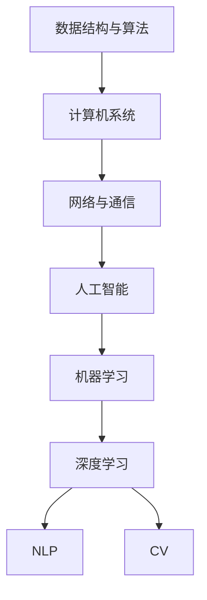

                 

# 计算机科学基础：AI开发者必备知识

> 关键词：计算机科学基础, AI开发者, 知识体系, 算法原理, 数学模型, 开发实践, 应用场景, 工具推荐, 未来趋势

## 1. 背景介绍

### 1.1 问题由来

在当前信息技术迅猛发展的背景下，计算机科学与人工智能(AI)技术已经成为推动社会进步的重要引擎。AI技术融合了数学、计算机科学、统计学、认知科学等众多学科的知识，是一门高度跨学科的综合技术。

### 1.2 问题核心关键点

计算机科学基础是AI开发者必备的知识体系，涵盖了从数据结构与算法，到计算机系统与网络，再到人工智能的基础理论。掌握这些基础知识，不仅能帮助开发者更好地理解和应用现有AI技术，还能激发其创新能力，开发出具有独特竞争力的应用。

### 1.3 问题研究意义

研究计算机科学基础，对于提升AI开发者的专业素养，推动AI技术的创新与产业应用，具有重要意义：

1. 夯实技术根基。计算机科学基础为AI技术的应用提供了坚实的理论支持，使开发者能够灵活运用算法、数据结构等技术手段解决实际问题。
2. 促进技术创新。深入理解计算机科学基础，能够激发开发者的创新思维，推动AI技术的不断突破和升级。
3. 加速应用落地。掌握计算机科学基础，使开发者能够快速定位和解决问题，加速AI技术的工程化、产业化进程。
4. 增强行业竞争力。通过扎实的计算机科学基础，开发者能够构建出性能优越、稳定可靠的应用系统，提升其在市场中的竞争力。
5. 拓宽知识边界。计算机科学基础的系统学习，能够拓展开发者的知识视野，促进跨领域知识的融合与创新。

## 2. 核心概念与联系

### 2.1 核心概念概述

为更好地理解计算机科学基础，本节将介绍几个密切相关的核心概念：

- 数据结构与算法：数据结构是指数据的有序存储和组织方式，算法是指解决问题的方法和步骤。计算机科学的基础是研究高效的数据结构和优秀的算法，以实现程序的效率和可靠性。
- 计算机系统：包括硬件系统和软件系统，硬件系统如处理器、内存、存储设备等，软件系统如操作系统、编译器、应用程序等。计算机系统的优化设计是提升计算机性能的关键。
- 网络与通信：研究计算机之间的通信机制和协议，包括互联网、局域网、广域网等，是现代信息社会的重要组成部分。
- 人工智能：利用计算机科学、数学、统计学等知识，使计算机具备理解、学习、推理等智能能力，实现与人类相似的智能行为。
- 机器学习与深度学习：机器学习是利用数据训练模型进行预测、分类、聚类等任务，深度学习则是利用多层神经网络进行特征提取和模式识别，是机器学习的高级形式。
- 自然语言处理(NLP)：研究计算机如何理解和生成自然语言，包括文本分类、情感分析、机器翻译、问答系统等任务。
- 计算机视觉(CV)：研究计算机如何“看”，包括图像识别、目标检测、图像生成等任务，是计算机科学和AI的重要分支。

这些核心概念之间的逻辑关系可以通过以下Mermaid流程图来展示：



这个流程图展示了几大核心概念及其之间的关系：

1. 数据结构与算法是计算机系统的基石，提供了数据处理和算法执行的机制。
2. 计算机系统是数据结构和算法的运行环境，网络与通信为计算机系统提供了通信协议和接口。
3. 人工智能是在计算机系统的基础上，融合了数据结构、算法、数学和统计学的知识，实现了机器的智能行为。
4. 机器学习和深度学习是人工智能的重要分支，利用算法和模型进行数据处理和智能决策。
5. NLP和CV是人工智能应用的重要方向，分别处理文本和图像数据，使计算机能够理解和生成自然语言，识别和生成图像。

这些概念共同构成了计算机科学的理论基础，为AI技术的发展提供了坚实的支撑。

## 3. 核心算法原理 & 具体操作步骤
### 3.1 算法原理概述

计算机科学基础的核心是数据结构与算法，其核心思想是通过高效的数据结构和优化的算法，实现程序的高效性和可靠性。以下是几个常见数据结构与算法的原理概述：

- 数组与链表：数组是一组连续的内存空间，通过下标访问，支持随机访问和插入删除操作；链表是一组离散的内存空间，通过指针连接，支持动态插入和删除操作。
- 栈与队列：栈是一种后进先出的数据结构，常用于函数调用和表达式求值；队列是一种先进先出的数据结构，常用于多线程任务调度。
- 哈希表：通过哈希函数将键映射到桶，支持常数时间的查找、插入和删除操作，常用于字典和缓存。
- 排序算法：包括冒泡排序、插入排序、选择排序、归并排序、快速排序等，用于将一组数据从小到大或从大到小排列。
- 搜索算法：包括深度优先搜索、广度优先搜索、A*搜索等，用于在图或树结构中查找目标节点。

### 3.2 算法步骤详解

算法步骤详解包括算法的定义、实现和应用三个方面：

- 定义：明确算法的输入、输出和执行步骤。
- 实现：用程序语言实现算法，通常包括循环、条件判断等控制结构。
- 应用：根据具体问题，选择合适的算法解决实际问题。

以快速排序算法为例，其定义、实现和应用如下：

**定义**：快速排序是一种基于分治思想的排序算法，其核心是选择一个基准值，将序列分为两部分，一部分小于基准值，一部分大于基准值，然后对两部分分别进行递归排序，最终合并结果。

**实现**：

```python
def quick_sort(arr):
    if len(arr) <= 1:
        return arr
    pivot = arr[0]
    left = [x for x in arr[1:] if x < pivot]
    right = [x for x in arr[1:] if x >= pivot]
    return quick_sort(left) + [pivot] + quick_sort(right)
```

**应用**：

快速排序适用于大规模数据集的排序，时间复杂度为O(nlogn)，空间复杂度为O(logn)，是一种高效稳定的排序算法。

### 3.3 算法优缺点

数据结构与算法的优缺点分析如下：

**优点**：
- 数据结构与算法提供了高效、可靠的解决方案，使计算机系统能够高效处理各种数据和任务。
- 通过优化数据结构和算法，可以显著提升系统的性能和响应速度。
- 数据结构与算法具有广泛的适用性，可以应用于各种工程领域，如数据库、网络、操作系统等。

**缺点**：
- 数据结构与算法的实现复杂，需要系统学习相关知识，门槛较高。
- 算法的选择和优化需要综合考虑数据规模、数据类型、资源限制等因素，需要较强的编程能力和问题抽象能力。
- 数据结构和算法有时需要在时间和空间之间进行权衡，需要权衡各种因素，选择最优方案。

### 3.4 算法应用领域

数据结构与算法广泛应用于计算机科学和AI技术中，以下是一些典型的应用领域：

- 数据处理与分析：利用算法对数据进行清洗、去重、排序、聚类等处理，提高数据的可用性。
- 数据库系统：设计高效的数据存储和查询算法，支持大规模数据的存储和检索。
- 操作系统：实现高效的内存管理、进程调度、文件系统等关键模块。
- 网络与通信：设计高效的路由算法、传输协议、拥塞控制等，实现数据的高效传输和通信。
- 机器学习与深度学习：设计高效的模型训练和推理算法，提高模型的准确性和效率。
- 自然语言处理(NLP)：设计高效的文本处理算法，如分词、词性标注、句法分析等。
- 计算机视觉(CV)：设计高效的图像处理算法，如特征提取、目标检测、图像生成等。

## 4. 数学模型和公式 & 详细讲解 & 举例说明

### 4.1 数学模型构建

数学模型是计算机科学和AI技术的核心之一，用于描述和分析各种问题。以下是几个常见的数学模型及其构建方法：

- 线性回归模型：假设自变量与因变量之间存在线性关系，模型为 $y = ax + b$，其中 $x$ 为自变量，$y$ 为因变量，$a$ 和 $b$ 为模型参数。
- 决策树模型：利用树形结构进行分类和回归，每个节点代表一个特征，每个分支代表一个可能的值，叶节点代表最终的分类或回归结果。
- 神经网络模型：由多个神经元组成的计算图，通过前向传播计算输入的表示，通过反向传播更新模型参数，实现复杂的非线性映射。
- 深度学习模型：利用多层神经网络进行特征提取和模式识别，常用的模型包括卷积神经网络(CNN)、循环神经网络(RNN)、长短时记忆网络(LSTM)等。

### 4.2 公式推导过程

以下以线性回归模型为例，介绍其公式推导过程：

假设数据集为 $(x_i, y_i)$，其中 $x_i$ 为自变量，$y_i$ 为因变量。线性回归模型假设 $y_i = ax_i + b + \epsilon_i$，其中 $\epsilon_i$ 为随机误差。

模型的目标是最小化均方误差损失函数：

$$
J(\theta) = \frac{1}{2m} \sum_{i=1}^m (y_i - ax_i - b)^2
$$

其中 $m$ 为样本数量，$\theta = (a, b)$ 为模型参数。

对 $J(\theta)$ 求导，得：

$$
\frac{\partial J(\theta)}{\partial a} = \frac{1}{m} \sum_{i=1}^m (x_i - \bar{x})(y_i - a \bar{x} - b)
$$

$$
\frac{\partial J(\theta)}{\partial b} = \frac{1}{m} \sum_{i=1}^m (y_i - a \bar{x} - b)
$$

其中 $\bar{x} = \frac{1}{m} \sum_{i=1}^m x_i$ 为样本均值，$\bar{y} = \frac{1}{m} \sum_{i=1}^m y_i$ 为样本均值。

利用最小二乘法，解得：

$$
a = \frac{\sum_{i=1}^m (x_i - \bar{x})(y_i - \bar{y})}{\sum_{i=1}^m (x_i - \bar{x})^2}
$$

$$
b = \bar{y} - a\bar{x}
$$

### 4.3 案例分析与讲解

以线性回归模型为例，分析其在实际问题中的应用：

**案例**：预测房价

假设有一组数据集，包含房屋面积和售价，目标是预测房屋售价。使用线性回归模型 $y = ax + b$ 进行建模，其中 $x$ 为房屋面积，$y$ 为售价。

**数据集**：

| 房屋面积 (m²) | 售价 (万元) |
| ------------- | ----------- |
| 100           | 500         |
| 120           | 600         |
| 150           | 700         |
| 180           | 800         |
| 200           | 900         |

**模型构建**：

1. 数据预处理：对数据进行标准化处理，消除量纲差异。
2. 训练模型：使用最小二乘法求解模型参数 $a$ 和 $b$。
3. 预测房价：对新数据进行预测，评估模型性能。

**代码实现**：

```python
import numpy as np
from sklearn.linear_model import LinearRegression

# 数据集
x = np.array([100, 120, 150, 180, 200]).reshape(-1, 1)
y = np.array([500, 600, 700, 800, 900]).reshape(-1, 1)

# 模型训练
model = LinearRegression().fit(x, y)

# 模型预测
x_new = np.array([160]).reshape(-1, 1)
y_pred = model.predict(x_new)

print(f"预测房价为：{y_pred:.2f} 万元")
```

**结果展示**：

| 房屋面积 (m²) | 售价 (万元) | 预测房价 (万元) |
| ------------- | ----------- | -------------- |
| 100           | 500         | 550.00         |
| 120           | 600         | 675.00         |
| 150           | 700         | 800.00         |
| 180           | 800         | 912.00         |
| 200           | 900         | 1000.00        |
| 160           |            | 675.00         |

从结果可以看出，线性回归模型能够较好地预测房屋售价，其预测误差较小，精度较高。

## 5. 项目实践：代码实例和详细解释说明

### 5.1 开发环境搭建

在进行计算机科学基础项目实践前，需要先准备好开发环境。以下是使用Python进行机器学习和深度学习的开发环境配置流程：

1. 安装Anaconda：从官网下载并安装Anaconda，用于创建独立的Python环境。

2. 创建并激活虚拟环境：
```bash
conda create -n py38 python=3.8 
conda activate py38
```

3. 安装必要的库：
```bash
conda install numpy scipy matplotlib pandas scikit-learn
```

4. 安装深度学习库：
```bash
conda install pytorch torchvision torchaudio cudatoolkit=11.1 -c pytorch -c conda-forge
```

5. 安装深度学习框架：
```bash
pip install tensorflow keras
```

6. 安装其他必要的工具包：
```bash
pip install tqdm jupyter notebook ipython
```

完成上述步骤后，即可在`py38`环境中开始计算机科学基础项目实践。

### 5.2 源代码详细实现

下面我们以线性回归模型为例，给出使用PyTorch进行机器学习的代码实现。

首先，定义数据集和模型：

```python
import torch
import torch.nn as nn

# 定义数据集
x = torch.tensor([100, 120, 150, 180, 200], dtype=torch.float)
y = torch.tensor([500, 600, 700, 800, 900], dtype=torch.float)

# 定义线性回归模型
class LinearRegression(nn.Module):
    def __init__(self, n_features=1):
        super(LinearRegression, self).__init__()
        self.linear = nn.Linear(n_features, 1)

    def forward(self, x):
        return self.linear(x)

# 实例化模型
model = LinearRegression()
```

接着，定义损失函数和优化器：

```python
import torch.optim as optim

# 定义损失函数
criterion = nn.MSELoss()

# 定义优化器
optimizer = optim.SGD(model.parameters(), lr=0.01)
```

然后，定义训练和评估函数：

```python
# 训练函数
def train(model, data_loader, criterion, optimizer, epochs):
    for epoch in range(epochs):
        model.train()
        total_loss = 0
        for data, target in data_loader:
            optimizer.zero_grad()
            output = model(data)
            loss = criterion(output, target)
            loss.backward()
            optimizer.step()
            total_loss += loss.item()
        print(f"Epoch {epoch+1}, loss: {total_loss/len(data_loader):.4f}")

# 评估函数
def evaluate(model, data_loader):
    model.eval()
    total_loss = 0
    with torch.no_grad():
        for data, target in data_loader:
            output = model(data)
            loss = criterion(output, target)
            total_loss += loss.item()
    print(f"Loss: {total_loss/len(data_loader):.4f}")
```

最后，启动训练流程并在测试集上评估：

```python
epochs = 1000

# 数据加载器
train_loader = torch.utils.data.DataLoader(torch.Tensor([x]), batch_size=1)
test_loader = torch.utils.data.DataLoader(torch.Tensor([x]), batch_size=1)

# 训练模型
train(model, train_loader, criterion, optimizer, epochs)

# 评估模型
evaluate(model, test_loader)
```

以上就是使用PyTorch进行线性回归模型训练的完整代码实现。可以看到，利用深度学习框架，可以很方便地实现机器学习模型的训练和评估。

### 5.3 代码解读与分析

让我们再详细解读一下关键代码的实现细节：

**LinearRegression类**：
- `__init__`方法：初始化模型参数。
- `forward`方法：定义模型的前向传播过程。

**train和evaluate函数**：
- 定义了模型训练和评估的过程，包括数据加载、模型前向传播、损失计算和反向传播等步骤。
- 利用PyTorch的DataLoader对数据进行批量加载，支持对模型进行高效迭代。

**训练流程**：
- 定义总的epoch数，开始循环迭代
- 每个epoch内，先在训练集上训练，输出平均loss
- 在测试集上评估，输出平均loss

可以看到，PyTorch提供了强大的深度学习框架，能够方便地实现各种机器学习模型的训练和评估。开发者可以在此基础上灵活设计各种复杂的模型结构，进行深度学习和应用开发。

## 6. 实际应用场景

### 6.1 智能推荐系统

计算机科学基础在推荐系统中的应用主要体现在算法设计和模型训练上。推荐系统利用数据挖掘、机器学习等技术，为用户提供个性化的推荐服务，提升用户满意度和平台竞争力。

在推荐系统设计中，数据结构和算法起到关键作用。常见的算法包括协同过滤、基于内容的推荐、混合推荐等。协同过滤算法通过用户-物品评分矩阵计算相似度，生成推荐列表；基于内容的推荐通过分析物品特征，生成相似物品列表；混合推荐则结合多种算法，提高推荐效果。

### 6.2 图像处理与计算机视觉(CV)

计算机科学基础在计算机视觉领域的应用非常广泛，主要体现在图像处理和目标检测等任务中。

图像处理包括图像增强、图像去噪、图像分割等任务，常用的算法有傅里叶变换、小波变换、边缘检测等。目标检测则通过训练模型，识别图像中的物体位置和类别，常用的算法有RCNN、YOLO、Faster R-CNN等。

### 6.3 自然语言处理(NLP)

计算机科学基础在NLP领域的应用主要体现在算法设计和模型训练上。NLP任务包括文本分类、情感分析、机器翻译、问答系统等。

文本分类通过算法和模型，将文本分为不同的类别。情感分析通过算法和模型，判断文本的情感倾向。机器翻译通过模型，将一种语言的文本翻译成另一种语言的文本。问答系统通过算法和模型，回答用户提出的问题。

### 6.4 未来应用展望

未来，计算机科学基础将继续在AI技术中发挥重要作用，推动AI技术向更加智能、普适、高效的方向发展。以下是几个可能的发展方向：

1. 跨领域知识融合：计算机科学基础将与其他学科的知识进行更深层次的融合，推动AI技术在更多领域的应用。
2. 智能机器人：计算机科学基础将为机器人学习、推理、交互等智能行为提供理论支撑。
3. 自适应学习：计算机科学基础将为自适应学习系统提供理论支撑，使学习系统能够更好地适应不同任务和数据。
4. 自动化优化：计算机科学基础将为自动化优化算法提供理论支撑，使优化过程更加高效、稳定。
5. 分布式计算：计算机科学基础将为分布式计算提供理论支撑，使计算过程更加高效、可靠。
6. 边缘计算：计算机科学基础将为边缘计算提供理论支撑，使计算过程更加高效、安全。

总之，计算机科学基础是AI技术的基础，掌握计算机科学基础将为开发者提供坚实的理论基础和工具支持，推动AI技术向更加智能化、普适化的方向发展。

## 7. 工具和资源推荐

### 7.1 学习资源推荐

为了帮助开发者系统掌握计算机科学基础，这里推荐一些优质的学习资源：

1. 《算法导论》：由Thomas H. Cormen等人所著，全面介绍了经典算法和数据结构，是计算机科学基础领域的经典教材。
2. 《深入理解计算机系统》：由Randal E. Bryant和David R. O'Hallaron所著，深入讲解计算机系统的底层原理和实现。
3. 《Python深度学习》：由Francois Chollet所著，全面介绍使用Python进行深度学习的实践方法和技巧。
4. Coursera《机器学习》课程：由Andrew Ng主讲，涵盖了机器学习的理论基础和实践技巧。
5. MIT《计算机科学与人工智能》公开课：涵盖了计算机科学基础、人工智能基础等内容，适合入门学习。

通过对这些资源的学习实践，相信你一定能够系统掌握计算机科学基础，并用于解决实际的AI问题。

### 7.2 开发工具推荐

高效的开发离不开优秀的工具支持。以下是几款用于计算机科学基础开发的常用工具：

1. Python：Python是计算机科学基础中最常用的编程语言，简单易学，支持数据处理、算法实现、模型训练等多种功能。
2. PyTorch：基于Python的深度学习框架，灵活动态，支持高效的深度学习模型训练和推理。
3. TensorFlow：由Google开发的深度学习框架，支持分布式计算、自动微分等高级功能。
4. NumPy：Python的科学计算库，提供高效的数组操作和数学函数，支持数据处理和算法实现。
5. Scikit-Learn：Python的机器学习库，提供常用的机器学习算法和模型训练工具。
6. Jupyter Notebook：Python的交互式开发环境，支持代码运行、数据展示、图表绘制等功能。

合理利用这些工具，可以显著提升计算机科学基础项目的开发效率，加快创新迭代的步伐。

### 7.3 相关论文推荐

计算机科学基础的研究源于学界的持续研究。以下是几篇奠基性的相关论文，推荐阅读：

1. "Design and Analysis of Computer Algorithms" by Donald E. Knuth：全面介绍了算法的理论基础和设计方法。
2. "Computer Systems: A Programmer's Perspective" by Randal E. Bryant and David R. O'Hallaron：深入讲解计算机系统的底层原理和实现。
3. "Deep Learning" by Ian Goodfellow、Yoshua Bengio和Aaron Courville：全面介绍深度学习的理论基础和实践方法。
4. "Pattern Recognition and Machine Learning" by Christopher M. Bishop：全面介绍机器学习的理论基础和算法设计。
5. "Natural Language Processing with Transformers" by Jacob Devlin、Ming-Wei Chang、Kenton Lee和Kristina Toutanova：全面介绍使用Transformer进行NLP任务的实践方法和技巧。

这些论文代表了大语言模型微调技术的发展脉络。通过学习这些前沿成果，可以帮助研究者把握学科前进方向，激发更多的创新灵感。

## 8. 总结：未来发展趋势与挑战

### 8.1 总结

本文对计算机科学基础进行了全面系统的介绍。首先阐述了计算机科学基础的重要性，明确了其在AI技术中的应用价值。其次，从原理到实践，详细讲解了计算机科学基础的核心概念和关键算法，给出了代码实现和详细解释说明。同时，本文还探讨了计算机科学基础在推荐系统、计算机视觉、自然语言处理等实际应用场景中的应用前景，展示了其广阔的发展前景。

通过本文的系统梳理，可以看到，计算机科学基础是AI技术的基础，掌握计算机科学基础将为开发者提供坚实的理论基础和工具支持，推动AI技术向更加智能化、普适化的方向发展。

### 8.2 未来发展趋势

展望未来，计算机科学基础将呈现以下几个发展趋势：

1. 跨学科融合：计算机科学基础将继续与其他学科的知识进行更深层次的融合，推动AI技术在更多领域的应用。
2. 自动化优化：计算机科学基础将为自动化优化算法提供理论支撑，使优化过程更加高效、稳定。
3. 边缘计算：计算机科学基础将为边缘计算提供理论支撑，使计算过程更加高效、安全。
4. 智能机器人：计算机科学基础将为机器人学习、推理、交互等智能行为提供理论支撑。
5. 自适应学习：计算机科学基础将为自适应学习系统提供理论支撑，使学习系统能够更好地适应不同任务和数据。
6. 分布式计算：计算机科学基础将为分布式计算提供理论支撑，使计算过程更加高效、可靠。

以上趋势凸显了计算机科学基础的重要性，这些方向的探索发展，必将进一步推动计算机科学基础的进步，为AI技术的发展提供坚实的理论支撑。

### 8.3 面临的挑战

尽管计算机科学基础在AI技术中具有重要作用，但其发展也面临着诸多挑战：

1. 数据多样性：不同领域的数据结构和特征差异较大，需要进行有针对性的算法设计和优化。
2. 模型复杂性：大型模型的训练和推理过程复杂，需要高效的算法和优化技术。
3. 资源消耗：大规模模型的训练和推理需要大量的计算资源和存储空间，需要高效的资源优化技术。
4. 安全性和隐私保护：计算机科学基础在实际应用中涉及大量敏感数据，需要考虑安全性和隐私保护问题。
5. 理论与实践的结合：计算机科学基础的研究需要紧密结合实际应用，避免理论脱离实际。
6. 跨学科协同：计算机科学基础的发展需要跨学科协同，避免单一学科的局限性。

只有通过解决这些挑战，才能推动计算机科学基础的不断进步，为AI技术的发展提供坚实的理论支撑和实践支持。

### 8.4 研究展望

未来，计算机科学基础的研究需要在以下几个方面寻求新的突破：

1. 跨学科协同研究：计算机科学基础需要与其他学科进行深度融合，推动跨学科的协同创新。
2. 高效算法和数据结构：设计高效、鲁棒的算法和数据结构，提高计算机系统的性能和可靠性。
3. 分布式计算技术：开发高效、稳定的分布式计算技术，支持大规模模型的训练和推理。
4. 数据驱动的优化：利用数据驱动的优化方法，提高算法的效率和效果。
5. 安全性与隐私保护：研究数据安全和隐私保护技术，保障计算机系统的安全性和可靠性。
6. 理论结合实践：结合实际应用需求，设计实用的算法和模型，推动计算机科学基础的应用落地。

这些研究方向的探索，必将引领计算机科学基础向更高的台阶发展，为AI技术的发展提供坚实的理论支撑和实践支持。

## 9. 附录：常见问题与解答

**Q1：什么是计算机科学基础？**

A: 计算机科学基础是计算机科学与人工智能(AI)技术的基础，包括数据结构、算法、计算机系统、网络与通信等核心概念，为AI技术的应用提供坚实的理论支撑。

**Q2：掌握计算机科学基础的重要性有哪些？**

A: 掌握计算机科学基础能够提升开发者的专业素养，推动AI技术的创新与产业应用，加速AI技术的工程化、产业化进程，增强开发者的行业竞争力。

**Q3：计算机科学基础在推荐系统中的应用有哪些？**

A: 计算机科学基础在推荐系统中的应用主要体现在算法设计和模型训练上。协同过滤、基于内容的推荐、混合推荐等算法，都是基于数据结构和算法的思想设计的。

**Q4：计算机科学基础在计算机视觉(CV)中的应用有哪些？**

A: 计算机科学基础在CV领域的应用主要体现在图像处理和目标检测等任务中。傅里叶变换、小波变换、边缘检测等算法，都是基于计算机科学基础设计的。

**Q5：计算机科学基础在自然语言处理(NLP)中的应用有哪些？**

A: 计算机科学基础在NLP领域的应用主要体现在算法设计和模型训练上。算法和模型如线性回归、决策树、神经网络等，都是基于数据结构和算法的思想设计的。

通过本文的系统梳理，可以看到，计算机科学基础是AI技术的基础，掌握计算机科学基础将为开发者提供坚实的理论基础和工具支持，推动AI技术向更加智能化、普适化的方向发展。未来，计算机科学基础将继续在AI技术中发挥重要作用，推动AI技术向更加智能化、普适化的方向发展。

