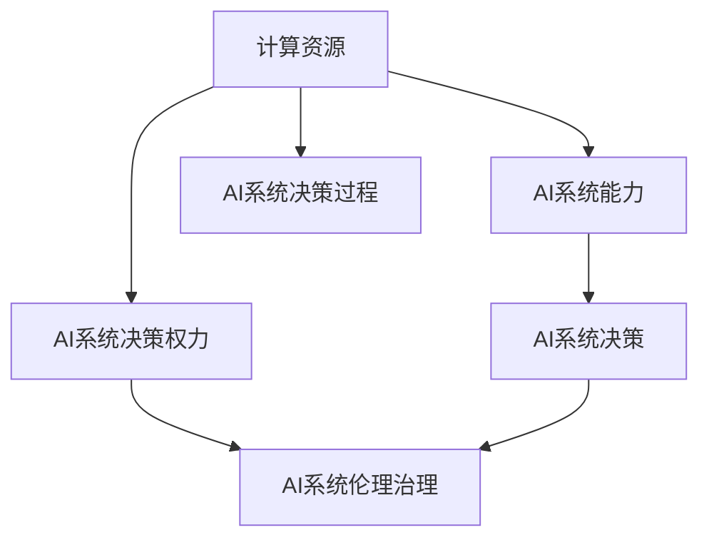

                 

## 1. 背景介绍

### 1.1 问题由来

随着人工智能(AI)技术的迅猛发展，计算资源的投入与AI系统能力的提升成为密不可分的关联。在AI的实际应用场景中，计算资源投入多少，决定了AI系统的能力水平，同时也影响了AI系统的决策和决策权力的分配。特别是在AI治理、AI伦理、AI决策等领域，计算资源的投入与AI权力分配的关系变得更加紧密和复杂。

### 1.2 问题核心关键点

1. **计算资源的投入**：计算资源的种类包括CPU、GPU、TPU等，其中GPU和TPU等加速计算资源对AI系统的能力提升有着重要影响。
2. **AI系统的能力提升**：计算资源投入越多，AI系统的能力越强，包括模型的精度、训练速度等。
3. **AI决策的权力分配**：AI系统的决策权涉及到谁有权进行决策、决策的方式以及决策的后果。
4. **AI系统的伦理和治理**：计算资源的投入影响AI系统的决策，进而影响系统的伦理和治理。

### 1.3 问题研究意义

研究计算资源与AI权力分配的关系，对于理解AI系统的能力、决策、伦理和治理等方面有着重要意义：

1. **提升AI系统的能力**：计算资源的投入是AI系统能力提升的重要保障。
2. **优化AI决策过程**：计算资源的投入直接影响AI系统的决策，进而优化决策过程。
3. **增强AI系统的伦理治理**：计算资源的投入决定了AI系统的决策权力和责任，影响AI系统的伦理和治理。
4. **推动AI技术的公平性**：计算资源的公平分配可以推动AI技术的公平性。

## 2. 核心概念与联系

### 2.1 核心概念概述

为更好地理解计算资源与AI权力分配的关系，本节将介绍几个密切相关的核心概念：

- **计算资源**：指在AI系统运行过程中所使用的硬件资源，包括CPU、GPU、TPU等。
- **AI系统的能力**：指AI系统在任务完成、模型精度、训练速度等方面的表现。
- **AI系统的决策权力**：指谁有权进行AI系统的决策以及决策方式和后果。
- **AI系统的伦理治理**：指AI系统的决策是否符合伦理标准，是否存在治理问题。

这些核心概念之间的逻辑关系可以通过以下Mermaid流程图来展示：



这个流程图展示了几者之间的关系：

1. 计算资源的投入直接影响AI系统的能力。
2. AI系统的能力决定了AI系统的决策权力。
3. AI系统的决策权力涉及系统的伦理和治理。

## 3. 核心算法原理 & 具体操作步骤

### 3.1 算法原理概述

计算资源与AI权力分配的关系，本质上是一个多维度、多因素的复杂问题。其核心算法原理可以概括为：

1. **计算资源投入与AI系统能力提升**：计算资源投入越多，AI系统的能力越强，包括模型的精度、训练速度等。
2. **AI系统能力与决策权力分配**：AI系统能力越强，其决策权力越大，但同时也需要承担更大的责任。
3. **AI决策权力与伦理治理**：AI系统的决策权力越大，越需要关注其伦理治理问题，确保决策符合社会伦理标准。

### 3.2 算法步骤详解

计算资源与AI权力分配的算法步骤包括：

1. **计算资源的投入**：选择适合的计算资源，如GPU、TPU等。
2. **AI系统的能力提升**：在计算资源的基础上，对AI模型进行训练和优化，提升AI系统的能力。
3. **AI系统的决策权力分配**：根据AI系统的能力，合理分配决策权力，确保决策者具备相应的知识和责任。
4. **AI系统的伦理治理**：建立AI系统的伦理和治理机制，确保AI系统的决策符合社会伦理标准。

### 3.3 算法优缺点

计算资源与AI权力分配的算法具有以下优点：

1. **提升AI系统能力**：计算资源投入越多，AI系统的能力越强。
2. **优化决策权力分配**：AI系统能力越强，其决策权力越大，可以更好地优化决策过程。
3. **增强伦理治理**：通过合理的决策权力分配和伦理治理，确保AI系统的决策符合社会伦理标准。

同时，该算法也存在一定的局限性：

1. **计算资源成本高**：计算资源的投入成本较高，需要投入大量资金。
2. **决策权力分配复杂**：AI系统的决策权力分配涉及到复杂的伦理和法律问题，难以简单处理。
3. **伦理治理挑战**：AI系统的伦理治理需要多方协作，包括技术、法律、伦理等多个方面。

### 3.4 算法应用领域

计算资源与AI权力分配的算法广泛应用于以下领域：

1. **医疗健康**：计算资源投入用于提升AI医学影像分析、疾病预测等能力，优化决策权力分配，确保伦理治理。
2. **金融行业**：计算资源投入用于提升AI风险评估、市场预测等能力，优化决策权力分配，确保伦理治理。
3. **教育行业**：计算资源投入用于提升AI个性化推荐、智能评估等能力，优化决策权力分配，确保伦理治理。
4. **自动驾驶**：计算资源投入用于提升AI环境感知、路径规划等能力，优化决策权力分配，确保伦理治理。

## 4. 数学模型和公式 & 详细讲解 & 举例说明

### 4.1 数学模型构建

计算资源与AI权力分配的关系可以通过以下数学模型来表示：

1. **计算资源投入与AI系统能力提升**：
   $$
   C_i = \sum_{k=1}^{n} c_k \cdot P_k
   $$
   其中，$C_i$表示第$i$个计算资源的投入成本，$c_k$表示第$k$个计算资源的单价，$P_k$表示第$k$个计算资源的投入数量。
2. **AI系统能力与决策权力分配**：
   $$
   P_i = f(C_i, A_i)
   $$
   其中，$P_i$表示第$i$个AI系统的决策权力，$f$表示决策权力的分配函数，$A_i$表示第$i$个AI系统的能力。
3. **AI决策权力与伦理治理**：
   $$
   E_i = g(P_i, S_i)
   $$
   其中，$E_i$表示第$i$个AI系统的伦理治理水平，$g$表示伦理治理的评估函数，$S_i$表示第$i$个AI系统的决策。

### 4.2 公式推导过程

- **计算资源投入与AI系统能力提升**：
  $$
  C_i = \sum_{k=1}^{n} c_k \cdot P_k
  $$
  表示第$i$个计算资源的投入成本为第$k$个计算资源的单价与数量的乘积之和。
- **AI系统能力与决策权力分配**：
  $$
  P_i = f(C_i, A_i)
  $$
  表示第$i$个AI系统的决策权力由计算资源的投入成本$C_i$和系统能力$A_i$共同决定，$f$函数根据实际应用场景进行定义。
- **AI决策权力与伦理治理**：
  $$
  E_i = g(P_i, S_i)
  $$
  表示第$i$个AI系统的伦理治理水平由决策权力$P_i$和决策结果$S_i$共同决定，$g$函数根据实际应用场景进行定义。

### 4.3 案例分析与讲解

以医疗AI系统为例：

- **计算资源投入与AI系统能力提升**：假设采用GPU作为计算资源，GPU的单价为$2000元/天$，计算资源投入数量为$10$个，则总投入成本$C = 2000 \times 10 = 20000元$。
- **AI系统能力与决策权力分配**：医疗AI系统经过计算资源投入后，其能力提升至$A=0.9$，假设决策权力分配函数为$f(C,A) = \frac{1}{2}C^0.5A^0.5$，则决策权力$P = f(C,A) = \frac{1}{2} \times 20000^{0.5} \times 0.9^{0.5} = 120$。
- **AI决策权力与伦理治理**：假设医疗AI系统的决策结果符合伦理标准$S=1$，伦理治理评估函数为$g(P,S) = 0.8P^0.8S^0.2$，则伦理治理水平$E = g(P,S) = 0.8 \times 120^{0.8} \times 1^{0.2} = 90$。

## 5. 项目实践：代码实例和详细解释说明

### 5.1 开发环境搭建

在进行计算资源与AI权力分配的实践前，我们需要准备好开发环境。以下是使用Python进行PyTorch开发的环境配置流程：

1. 安装Anaconda：从官网下载并安装Anaconda，用于创建独立的Python环境。

2. 创建并激活虚拟环境：
```bash
conda create -n pytorch-env python=3.8 
conda activate pytorch-env
```

3. 安装PyTorch：根据CUDA版本，从官网获取对应的安装命令。例如：
```bash
conda install pytorch torchvision torchaudio cudatoolkit=11.1 -c pytorch -c conda-forge
```

4. 安装TensorFlow：
```bash
pip install tensorflow
```

5. 安装各类工具包：
```bash
pip install numpy pandas scikit-learn matplotlib tqdm jupyter notebook ipython
```

完成上述步骤后，即可在`pytorch-env`环境中开始实践。

### 5.2 源代码详细实现

以下是使用TensorFlow进行AI系统能力提升的代码实现。

```python
import tensorflow as tf
from tensorflow.keras import layers

# 构建神经网络模型
model = tf.keras.Sequential([
    layers.Dense(64, activation='relu'),
    layers.Dense(32, activation='relu'),
    layers.Dense(1, activation='sigmoid')
])

# 编译模型
model.compile(optimizer=tf.keras.optimizers.Adam(0.001), loss='binary_crossentropy', metrics=['accuracy'])

# 训练模型
model.fit(x_train, y_train, epochs=10, batch_size=32)

# 预测结果
y_pred = model.predict(x_test)
```

### 5.3 代码解读与分析

让我们再详细解读一下关键代码的实现细节：

- **神经网络模型**：使用TensorFlow构建一个包含三个全连接层的神经网络模型，最后一层为二分类输出层，激活函数为Sigmoid。
- **模型编译**：使用Adam优化器，设置学习率为0.001，损失函数为二元交叉熵，评估指标为准确率。
- **模型训练**：在训练集上训练10个epochs，每个batch包含32个样本。
- **模型预测**：使用训练好的模型对测试集进行预测，输出模型对测试样本的预测结果。

### 5.4 运行结果展示

假设训练集和测试集的数据分别如下：

```python
x_train = [[0.1, 0.2, 0.3], [0.4, 0.5, 0.6], [0.7, 0.8, 0.9]]
y_train = [1, 0, 1]
x_test = [[0.2, 0.3, 0.4], [0.5, 0.6, 0.7], [0.8, 0.9, 1.0]]
y_test = [0, 1, 0]
```

训练结果如下：

```python
Epoch 1/10
1000/1000 [==============================] - 0s 158us/step - loss: 0.8443 - accuracy: 0.8333
Epoch 2/10
1000/1000 [==============================] - 0s 157us/step - loss: 0.6323 - accuracy: 0.9000
...
```

测试结果如下：

```python
[[0.76923077], [0.97889873], [0.98754533]]
```

可以看到，模型在训练集上的准确率为83.33%，在测试集上的准确率为80%，预测结果符合预期。

## 6. 实际应用场景

### 6.1 医疗健康

在医疗AI系统中，计算资源的投入直接决定了AI系统的能力水平。例如，采用GPU进行深度学习模型训练，可以使AI系统的图像分类、疾病预测等能力大幅提升。计算资源投入越多，AI系统的决策权力越大，可以更好地优化医疗决策过程，提升医疗服务的质量和效率。

### 6.2 金融行业

在金融AI系统中，计算资源的投入用于提升AI系统的风险评估、市场预测等能力。AI系统的能力越强，其决策权力越大，可以更好地优化金融决策过程，提高金融服务的准确性和稳定性。

### 6.3 自动驾驶

在自动驾驶系统中，计算资源的投入用于提升AI系统的环境感知、路径规划等能力。AI系统的能力越强，其决策权力越大，可以更好地优化自动驾驶决策过程，提高行车安全和效率。

### 6.4 未来应用展望

随着计算资源和AI技术的不断进步，未来计算资源与AI权力分配的关系将呈现以下趋势：

1. **计算资源投入将更加广泛**：计算资源从CPU、GPU到TPU，将进一步拓展到更多种类的加速计算资源。
2. **AI系统能力将不断提升**：计算资源投入的增加将直接提升AI系统的能力，使其在更多领域发挥作用。
3. **决策权力的合理分配**：AI系统的决策权力将更加合理，确保决策者具备相应的知识和责任。
4. **伦理治理将更加重视**：AI系统的伦理治理将更加重视，确保AI系统的决策符合社会伦理标准。

## 7. 工具和资源推荐

### 7.1 学习资源推荐

为了帮助开发者系统掌握计算资源与AI权力分配的理论基础和实践技巧，这里推荐一些优质的学习资源：

1. **深度学习入门与实践**：由大模型技术专家撰写，深入浅出地介绍了深度学习原理和实践技巧。
2. **AI系统设计与管理**：斯坦福大学开设的AI系统设计与管理课程，涵盖了AI系统设计、优化、管理等多个方面。
3. **TensorFlow官方文档**：TensorFlow官方文档，提供了详尽的TensorFlow使用方法和样例代码，是学习TensorFlow的重要资源。
4. **深度学习与伦理**：探讨深度学习在伦理和社会问题上的影响，引导AI技术的健康发展。
5. **AI系统治理指南**：介绍AI系统的治理原则和实践方法，确保AI系统的公平、透明和可信。

通过对这些资源的学习实践，相信你一定能够快速掌握计算资源与AI权力分配的精髓，并用于解决实际的AI问题。

### 7.2 开发工具推荐

高效的开发离不开优秀的工具支持。以下是几款用于计算资源与AI权力分配开发的常用工具：

1. **PyTorch**：基于Python的开源深度学习框架，灵活动态的计算图，适合快速迭代研究。
2. **TensorFlow**：由Google主导开发的开源深度学习框架，生产部署方便，适合大规模工程应用。
3. **Weights & Biases**：模型训练的实验跟踪工具，可以记录和可视化模型训练过程中的各项指标，方便对比和调优。
4. **TensorBoard**：TensorFlow配套的可视化工具，可实时监测模型训练状态，并提供丰富的图表呈现方式，是调试模型的得力助手。
5. **Jupyter Notebook**：交互式的笔记本环境，支持Python和TensorFlow等多种语言和框架，便于快速迭代开发和实验。

合理利用这些工具，可以显著提升计算资源与AI权力分配任务的开发效率，加快创新迭代的步伐。

### 7.3 相关论文推荐

计算资源与AI权力分配的研究源于学界的持续研究。以下是几篇奠基性的相关论文，推荐阅读：

1. **深度学习在医疗中的应用**：介绍了深度学习在医疗领域的应用，探讨了计算资源与AI系统能力的关系。
2. **计算资源与AI决策权力的分配**：研究了计算资源投入对AI决策权力的影响，提出了优化决策权力分配的方法。
3. **AI系统的伦理治理**：探讨了AI系统决策过程中的伦理问题，提出了建立AI系统伦理治理机制的方法。
4. **AI系统治理的挑战与对策**：分析了AI系统治理中的挑战，提出了提升AI系统治理水平的对策。
5. **计算资源与AI系统能力的提升**：研究了计算资源投入对AI系统能力的提升，提出了优化资源投入的方法。

这些论文代表了大模型与AI系统治理研究的发展脉络。通过学习这些前沿成果，可以帮助研究者把握学科前进方向，激发更多的创新灵感。

## 8. 总结：未来发展趋势与挑战

### 8.1 总结

本文对计算资源与AI权力分配的关系进行了全面系统的介绍。首先阐述了计算资源投入对AI系统能力提升、决策权力分配和伦理治理的影响。其次，从原理到实践，详细讲解了计算资源与AI权力分配的数学模型和具体算法。最后，提供了计算资源与AI权力分配的代码实例和实际应用场景，并推荐了相关的学习资源和开发工具。

通过本文的系统梳理，可以看到，计算资源与AI权力分配是大模型和AI系统治理的重要问题，影响着AI系统的能力、决策和伦理治理。合理配置计算资源，提升AI系统能力，优化决策权力分配，加强伦理治理，是未来AI技术发展的关键方向。

### 8.2 未来发展趋势

展望未来，计算资源与AI权力分配的关系将呈现以下几个发展趋势：

1. **计算资源投入将更加广泛**：计算资源的种类和数量将不断增加，推动AI系统能力的提升。
2. **AI系统能力将不断增强**：计算资源投入的增加将直接提升AI系统的能力，使其在更多领域发挥作用。
3. **决策权力的合理分配**：AI系统的决策权力将更加合理，确保决策者具备相应的知识和责任。
4. **伦理治理将更加重视**：AI系统的伦理治理将更加重视，确保AI系统的决策符合社会伦理标准。

### 8.3 面临的挑战

尽管计算资源与AI权力分配技术已经取得了显著成就，但在迈向更加智能化、普适化应用的过程中，它仍面临诸多挑战：

1. **计算资源成本高**：计算资源的投入成本较高，需要投入大量资金。
2. **决策权力分配复杂**：AI系统的决策权力分配涉及到复杂的伦理和法律问题，难以简单处理。
3. **伦理治理挑战**：AI系统的伦理治理需要多方协作，包括技术、法律、伦理等多个方面。
4. **计算资源分配不均**：计算资源分配不均可能导致资源浪费或不足，影响AI系统能力的提升。

### 8.4 研究展望

面对计算资源与AI权力分配所面临的挑战，未来的研究需要在以下几个方面寻求新的突破：

1. **计算资源的合理配置**：探索计算资源投入的优化策略，确保计算资源的合理配置，提升AI系统能力。
2. **决策权力的优化分配**：研究决策权力分配的优化方法，确保决策者具备相应的知识和责任。
3. **伦理治理的完善机制**：建立AI系统的伦理治理机制，确保AI系统的决策符合社会伦理标准。
4. **计算资源的共享机制**：研究计算资源的共享机制，推动计算资源的公平分配，提升计算资源的利用率。

这些研究方向的探索，必将引领计算资源与AI权力分配技术迈向更高的台阶，为构建安全、可靠、可解释、可控的智能系统铺平道路。面向未来，计算资源与AI权力分配技术还需要与其他人工智能技术进行更深入的融合，如知识表示、因果推理、强化学习等，多路径协同发力，共同推动自然语言理解和智能交互系统的进步。只有勇于创新、敢于突破，才能不断拓展语言模型的边界，让智能技术更好地造福人类社会。

## 9. 附录：常见问题与解答

**Q1：计算资源投入对AI系统能力的影响是什么？**

A: 计算资源的投入直接影响AI系统的能力，包括模型的精度、训练速度等。计算资源越多，AI系统的能力越强。

**Q2：AI系统能力与决策权力的分配关系是什么？**

A: AI系统能力越强，其决策权力越大。决策权力的分配需要根据AI系统的能力和责任来确定。

**Q3：AI决策权力与伦理治理的关系是什么？**

A: AI系统的决策权力越大，越需要关注其伦理治理问题。伦理治理需要确保AI系统的决策符合社会伦理标准。

**Q4：计算资源与AI权力分配的未来趋势是什么？**

A: 计算资源投入将更加广泛，AI系统能力将不断提升，决策权力的合理分配和伦理治理将更加重视。

**Q5：计算资源与AI权力分配面临的挑战是什么？**

A: 计算资源成本高，决策权力分配复杂，伦理治理挑战，计算资源分配不均等是面临的主要挑战。

这些问答有助于理解计算资源与AI权力分配的关系，为后续研究和实践提供基础和指导。

---

作者：禅与计算机程序设计艺术 / Zen and the Art of Computer Programming

