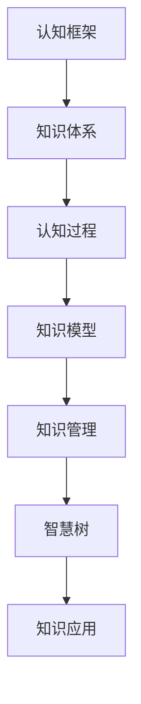

                 

# 认知框架：如何构建个人知识体系

> 关键词：认知框架,知识体系构建,个人学习与发展,认知科学,认知模型,知识管理,智慧树

## 1. 背景介绍

### 1.1 问题由来
在信息爆炸和知识碎片化的今天，构建一个系统化、结构化的个人知识体系显得尤为重要。这对于个人成长、职业发展、终身学习都具有重要意义。同时，信息技术的飞速发展也为知识体系的构建提供了新的工具和平台，如笔记软件、知识图谱等。

### 1.2 问题核心关键点
构建个人知识体系的核心关键点包括：
1. 理解知识的本质：知识不仅仅是信息，更是经验、智慧和创新的源泉。
2. 把握认知过程：了解知识的吸收、加工和应用的全流程。
3. 选择合适的知识体系结构：如网状、树状或层状等，根据个人习惯和需求灵活选择。
4. 确定关键领域：关注与个人职业、兴趣和生活紧密相关的知识领域。
5. 利用技术手段：借助AI、大数据等技术提升知识体系的构建和管理效率。
6. 实践与反思：不断实践和反思，动态调整知识体系，保持其时效性和实用性。

### 1.3 问题研究意义
构建个人知识体系不仅有助于提升个人能力，还能提高生活质量和工作效率，适应快速变化的社会和环境。同时，良好的知识体系构建方法可以推广至团队协作、企业知识管理，推动组织智慧的共享与创新。

## 2. 核心概念与联系

### 2.1 核心概念概述

构建个人知识体系涉及多个关键概念，包括：

- **认知框架**：用于组织和表示个人知识体系的基本结构，是认知科学和心理学研究的成果。
- **知识体系**：个人或组织所掌握的知识的集合，包括事实性、概念性、程序性和决策性知识。
- **认知过程**：包括感知、记忆、思维和应用等环节，是知识吸收、处理和应用的核心过程。
- **知识模型**：表示知识结构的模型，如专家系统、本体、概念图等。
- **知识管理**：通过系统化的方法和工具，管理和应用个人或组织知识的过程。
- **智慧树**：将知识体系比作智慧树的形象比喻，强调知识的根、枝、叶和果，代表知识从源头到应用的全面视角。

### 2.2 核心概念原理和架构的 Mermaid 流程图



这个流程图展示了核心概念之间的联系：认知框架是知识体系的基础，认知过程是知识吸收和应用的核心，知识模型和知识管理是知识表示和应用的工具，智慧树则是知识体系形象化的表达，知识应用则是最终目标。

## 3. 核心算法原理 & 具体操作步骤
### 3.1 算法原理概述

构建个人知识体系的基本原理包括以下几个方面：

1. **知识分类**：将知识分为不同的类别和子类别，便于管理和检索。
2. **关联建立**：通过关联不同知识点，建立知识网络，提高知识间的联系和协同作用。
3. **结构化表示**：使用结构化的模型（如树状、网状）来表示知识体系，便于理解和应用。
4. **动态调整**：根据新知识和新经验，动态调整和优化知识体系，保持其时效性和实用性。
5. **知识应用**：将知识应用到具体实践中，如问题解决、创新应用等，检验和完善知识体系。

### 3.2 算法步骤详解

构建个人知识体系的一般步骤包括：

1. **识别知识领域**：根据个人兴趣、职业、生活等需求，识别出需要掌握的关键知识领域。
2. **知识分类与命名**：对每个领域内的知识进行分类和命名，如将“机器学习”分为“算法”、“数据处理”等子领域。
3. **建立关联**：通过思维导图、概念图等工具，建立知识之间的关联，形成知识网络。
4. **选择知识模型**：根据需要选择合适的知识模型，如树状模型、网状模型等，构建知识体系的基本结构。
5. **补充和扩展**：不断补充新知识，扩展已有知识，保持知识体系的丰富性和深度。
6. **应用和实践**：将知识体系应用于具体实践中，通过实践反馈优化知识体系。

### 3.3 算法优缺点

构建个人知识体系的优点包括：

1. **系统化管理**：通过分类、关联和结构化表示，系统化管理个人知识，提高效率。
2. **易于检索**：构建的知识体系可以方便地通过关键词、关联等方式进行检索。
3. **动态更新**：可以动态调整和更新知识体系，保持其时效性和实用性。
4. **结构化思维**：有助于培养结构化思维和系统化处理复杂问题的能力。

缺点包括：

1. **初期投入大**：构建知识体系需要花费大量时间和精力进行分类、命名、关联等操作。
2. **工具依赖**：需要借助专业的知识管理工具，增加了初期投入。
3. **易受干扰**：知识体系构建过程中，容易受到外界干扰和影响，需要持续维护和调整。
4. **个性化不足**：通用的知识体系构建方法可能不适合所有人，需要根据个人习惯和需求灵活调整。

### 3.4 算法应用领域

构建个人知识体系的应用领域广泛，包括：

1. **学术研究**：构建个人学术知识体系，帮助研究者系统化管理和应用专业知识。
2. **职业发展**：通过职业知识体系构建，提升职业能力和竞争力，加速职业成长。
3. **个人学习**：系统化管理和应用个人学习知识，提升学习效果和效率。
4. **生活管理**：构建生活知识体系，提高生活质量和幸福感。
5. **团队协作**：在团队中推广知识体系构建方法，提升团队智慧和创新能力。

## 4. 数学模型和公式 & 详细讲解 & 举例说明

### 4.1 数学模型构建

构建个人知识体系的基本数学模型可以用图论中的图来表示。每个知识点可以表示为一个节点，节点之间的连接表示知识间的关联。数学模型可以描述为：

$$ G = (V, E) $$

其中 $V$ 是节点集合，表示所有知识点；$E$ 是边集合，表示知识之间的关联。

### 4.2 公式推导过程

知识节点之间的关系可以用图的邻接矩阵 $A$ 来表示：

$$ A = [a_{ij}]_{n \times n} $$

其中 $a_{ij}=1$ 表示节点 $i$ 和节点 $j$ 之间有边连接，否则为 $0$。

知识体系的演化可以用动态图论中的图演化模型来描述，例如：

$$ G_{t+1} = \mathcal{F}(G_t, E_t) $$

其中 $\mathcal{F}$ 是演化函数，描述知识体系随时间的动态变化。

### 4.3 案例分析与讲解

以一个简单的“机器学习”知识体系为例，我们可以用以下图形来表示：

```
机器学习
├── 监督学习
│   ├── 回归
│   ├── 分类
│   └── 异常检测
├── 无监督学习
│   ├── 聚类
│   └── 降维
└── 强化学习
```

这个知识体系中，“机器学习”是根节点，其下分为监督学习、无监督学习和强化学习三个子领域。每个子领域下还可以细分为更具体的知识点。

## 5. 项目实践：代码实例和详细解释说明

### 5.1 开发环境搭建

构建个人知识体系需要借助专业的知识管理工具，常用的包括：

1. **Notion**：一个多功能的笔记应用，可以创建和编辑知识图谱。
2. **MindMeister**：一款在线思维导图工具，支持多人协作编辑。
3. **Lucidchart**：一个专业的图表和流程图工具，支持复杂的知识体系构建。
4. **Coggle**：一个易于使用的思维导图工具，支持实时协作和分享。

### 5.2 源代码详细实现

以下是使用Notion构建个人知识体系的一个简要步骤：

1. 登录Notion账户，创建新笔记，输入“机器学习”作为笔记标题。
2. 在笔记内添加子笔记，输入“监督学习”、“无监督学习”、“强化学习”等子领域名称。
3. 为每个子领域添加更多的子笔记，输入更具体的知识点名称。
4. 使用“链接”功能，在知识点之间建立关联，形成一个完整的知识体系。

### 5.3 代码解读与分析

Notion的API支持自动化构建知识体系，开发者可以使用Python编写脚本，实现知识体系的动态生成和维护。以下是一个简要的Python代码实现：

```python
from notion.client import NotionClient
from notion.block import Block
from notion.collection import Collection

# 登录Notion账户，创建客户端
client = NotionClient(token='your_notion_token')
database = client.get_database('your_database_id')

# 创建根节点
root_block = Block(database, 'Machine Learning')
database.add_block(root_block)

# 添加子节点
supervised_learning = Block(root_block, 'Supervised Learning')
database.add_block(supervised_learning)
unsupervised_learning = Block(root_block, 'Unsupervised Learning')
database.add_block(unsupervised_learning)
reinforcement_learning = Block(root_block, 'Reinforcement Learning')
database.add_block(reinforcement_learning)

# 添加子子节点
regression = Block(supervised_learning, 'Regression')
database.add_block(regression)
classification = Block(supervised_learning, 'Classification')
database.add_block(classification)
anomaly_detection = Block(supervised_learning, 'Anomaly Detection')
database.add_block(anomaly_detection)

clustering = Block(unsupervised_learning, 'Clustering')
database.add_block(clustering)
dimensionality_reduction = Block(unsupervised_learning, 'Dimensionality Reduction')
database.add_block(dimensionality_reduction)

# 添加关联
database.add_relation(root_block, supervised_learning, 'Supervised Learning')
database.add_relation(root_block, unsupervised_learning, 'Unsupervised Learning')
database.add_relation(root_block, reinforcement_learning, 'Reinforcement Learning')
database.add_relation(supervised_learning, regression, 'Regression')
database.add_relation(supervised_learning, classification, 'Classification')
database.add_relation(supervised_learning, anomaly_detection, 'Anomaly Detection')
database.add_relation(unsupervised_learning, clustering, 'Clustering')
database.add_relation(unsupervised_learning, dimensionality_reduction, 'Dimensionality Reduction')
```

### 5.4 运行结果展示

运行上述代码后，Notion中的知识体系结构如下：

```
机器学习
├── 监督学习
│   ├── 回归
│   ├── 分类
│   └── 异常检测
├── 无监督学习
│   ├── 聚类
│   └── 降维
└── 强化学习
```

可以看到，通过Python脚本，我们成功地构建了一个层次分明的知识体系，并建立了节点之间的关联。

## 6. 实际应用场景

### 6.1 学术研究

在学术研究中，构建个人知识体系有助于研究人员系统化管理研究方向和成果。例如，通过将相关论文、研究方法和工具等知识点进行分类和关联，形成知识图谱，便于查找和引用。

### 6.2 职业发展

在职业发展中，构建个人知识体系可以帮助专业人士提升职业能力。例如，通过构建“软件工程”知识体系，系统化学习编程语言、算法、架构设计等知识，加速技术成长和经验积累。

### 6.3 个人学习

在学习过程中，构建个人知识体系有助于提升学习效率。例如，通过将课程笔记、书籍章节、学习资料等知识点进行分类和关联，形成一个结构化的知识框架，便于理解和记忆。

### 6.4 生活管理

在生活中，构建个人知识体系有助于提高生活质量。例如，通过构建“健康管理”知识体系，系统化学习饮食、运动、睡眠等知识，提升健康水平和生活质量。

### 6.5 团队协作

在团队协作中，构建个人知识体系有助于提升团队智慧和创新能力。例如，通过在团队内推广知识体系构建方法，系统化管理团队知识，促进知识共享和创新应用。

## 7. 工具和资源推荐

### 7.1 学习资源推荐

构建个人知识体系需要系统化的学习和实践。以下是一些推荐的学习资源：

1. **《认知心理学》**：一本经典的认知心理学书籍，深入浅出地介绍了认知过程和认知模型。
2. **Coursera《认知科学导论》课程**：斯坦福大学开设的课程，介绍了认知科学的基本理论和应用。
3. **EdX《人工智能基础》课程**：麻省理工学院开设的课程，介绍了人工智能的基本概念和应用。
4. **《信息科学与人工智能》书籍**：一本综合性的信息科学与人工智能书籍，介绍了各类知识体系构建方法。
5. **Medium博客**：众多关于知识管理、认知科学和人工智能的文章，适合快速获取最新知识。

### 7.2 开发工具推荐

构建个人知识体系需要借助专业的知识管理工具，以下是一些推荐的开发工具：

1. **Notion**：多功能的笔记应用，支持创建和编辑知识图谱，便于系统化管理知识。
2. **MindMeister**：在线思维导图工具，支持多人协作编辑，适合团队知识管理。
3. **Lucidchart**：专业的图表和流程图工具，支持复杂的知识体系构建，适用于详细规划。
4. **Coggle**：易于使用的思维导图工具，支持实时协作和分享，适合个人知识管理。
5. **Miro**：在线白板工具，支持多人协作，适合团队知识共享和讨论。

### 7.3 相关论文推荐

以下是一些关于知识体系构建和认知科学的经典论文，推荐阅读：

1. **《认知框架》**：一篇关于认知框架的综述性论文，介绍了各类认知框架的基本结构和应用。
2. **《知识管理》**：一篇关于知识管理的综述性论文，介绍了各类知识管理方法的基本原理和应用。
3. **《认知心理学》**：一篇关于认知心理学的综述性论文，介绍了认知过程和认知模型。
4. **《机器学习知识图谱》**：一篇关于机器学习知识图谱的论文，介绍了知识图谱在机器学习中的应用。
5. **《智慧树构建》**：一篇关于智慧树构建的论文，介绍了各类智慧树构建方法的基本原理和应用。

## 8. 总结：未来发展趋势与挑战

### 8.1 总结

本文对构建个人知识体系的方法进行了系统介绍。通过理解知识的本质、把握认知过程、选择合适的知识体系结构等关键点，我们可以系统化地构建和管理个人知识，提升个人能力和生活质量。

### 8.2 未来发展趋势

未来，构建个人知识体系将呈现以下几个发展趋势：

1. **智能化**：通过AI技术辅助构建和维护知识体系，提升效率和准确性。
2. **数据驱动**：利用大数据技术分析个人知识体系中的知识分布和关联，优化知识结构。
3. **跨领域融合**：将不同领域的知识进行跨领域融合，形成更全面的知识体系。
4. **终身学习**：将知识体系构建与终身学习结合，动态调整和优化知识体系，保持其时效性和实用性。
5. **多模态融合**：结合视觉、听觉等多模态信息，提升知识体系的丰富性和深度。

### 8.3 面临的挑战

尽管构建个人知识体系具有诸多优势，但也面临着以下挑战：

1. **知识碎片化**：当前信息爆炸导致知识碎片化，难以系统化构建完整的知识体系。
2. **技术门槛高**：构建知识体系需要掌握一定的技术工具和方法，对技术能力有一定要求。
3. **个性化不足**：通用的知识体系构建方法可能不适合所有人，需要根据个人需求灵活调整。
4. **动态调整困难**：知识体系需要动态调整以适应新知识和新经验，但调整难度较大。
5. **工具选择困难**：众多知识管理工具，难以选择最适合的工具进行知识体系构建。

### 8.4 研究展望

未来，构建个人知识体系的研究可以从以下几个方向进行：

1. **智能化知识管理**：利用AI技术辅助知识管理，提升效率和准确性。
2. **知识图谱构建**：研究知识图谱构建方法，提升知识体系的丰富性和深度。
3. **跨领域融合**：研究跨领域知识融合方法，提升知识体系的全面性和实用性。
4. **多模态融合**：研究多模态知识融合方法，提升知识体系的丰富性和深度。
5. **动态调整机制**：研究知识体系的动态调整机制，提高知识体系的灵活性和适应性。

## 9. 附录：常见问题与解答

**Q1：如何选择合适的知识体系结构？**

A: 选择合适的知识体系结构需要考虑个人习惯和需求。一般来说，可以采用树状结构、网状结构或层状结构，根据具体需求灵活选择。

**Q2：如何系统化管理个人知识？**

A: 系统化管理个人知识需要借助专业的知识管理工具，如Notion、MindMeister等，支持创建和编辑知识图谱，便于管理和检索。

**Q3：如何动态调整知识体系？**

A: 动态调整知识体系需要定期回顾和更新，根据新知识和经验进行补充和扩展。可以通过定期复查和更新节点、关系和子节点等方式实现。

**Q4：如何利用AI技术辅助知识管理？**

A: 利用AI技术辅助知识管理可以通过构建知识图谱、分类、关联等方式实现。可以使用Python脚本和API，自动化构建和管理知识体系。

**Q5：如何提高知识体系的丰富性和深度？**

A: 提高知识体系的丰富性和深度需要不断补充新知识，进行跨领域融合和多模态融合。可以使用多模态数据源，如视频、音频等，丰富知识体系的内容。

总之，构建个人知识体系是一个系统化、动态化的过程，需要不断学习和实践，才能构建一个高效、实用的知识体系。通过本文的系统介绍，希望能为读者提供全面的指导和启示。

---

作者：禅与计算机程序设计艺术 / Zen and the Art of Computer Programming

