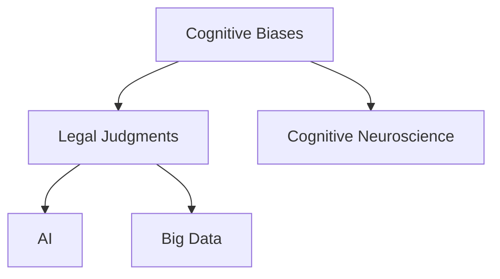

                 

# 认知科学与法律：理解决策与判断的机制

## 1. 背景介绍

### 1.1 问题由来

法律决策和判断是确保社会秩序、公正和正义的重要机制。在法治社会中，法官、律师和法律工作者需要根据证据、法规和案件事实作出判断，确保裁决的公正性和合法性。然而，法律决策和判断并不是一门纯粹的科学，其中涉及了大量的认知心理学、行为经济学和社会学因素。

近年来，随着认知科学的快速发展，越来越多的研究表明，人类的认知过程存在很多偏见和错误。这些偏见和错误不仅影响个体的决策，也影响了法律领域的判断和裁决。因此，如何利用认知科学的理论和方法，来改进法律决策和判断的机制，成为一个重要的研究方向。

### 1.2 问题核心关键点

法律决策和判断的核心问题包括：

1. 如何识别和纠正人类的认知偏见，确保裁决的客观性。
2. 如何设计有效的法律程序和规则，减少人为错误和偏见。
3. 如何利用人工智能和大数据技术，辅助法律决策和判断。

这些问题涉及到认知科学、法学、心理学和计算机科学等多个学科，需要通过跨学科合作来寻求解决方案。

## 2. 核心概念与联系

### 2.1 核心概念概述

为了更好地理解法律决策和判断的机制，本节将介绍几个密切相关的核心概念：

- **认知偏见（Cognitive Biases）**：指人类在信息处理过程中，由于心理机制的局限性而产生的系统性错误。这些偏见影响人们的决策和判断，包括确认偏误、启发式偏差、过度自信等。
- **法律判断（Legal Judgments）**：指法官、律师和法律工作者在审理案件过程中，根据证据、法规和案件事实，对案件进行判断和裁决的过程。法律判断要求公正、合理和合法的依据。
- **认知神经科学（Cognitive Neuroscience）**：研究认知过程的神经机制，如决策、记忆、情感等。通过神经成像技术和脑功能图谱，可以揭示人类认知的底层机制。
- **人工智能（Artificial Intelligence, AI）**：利用计算机算法和数据处理技术，模仿人类智能行为。AI可以辅助法律决策和判断，通过数据分析和模式识别来辅助法官和律师。
- **大数据（Big Data）**：指大规模、高速、多样化的数据集合。在法律领域，大数据可以用于分析案情趋势、预测案件结果等。

这些核心概念之间的逻辑关系可以通过以下Mermaid流程图来展示：



这个流程图展示了一系列相关概念及其之间的逻辑关系：

1. 认知偏见影响法律判断。
2. 认知神经科学研究认知过程的神经机制。
3. 人工智能辅助法律判断。
4. 大数据分析案情趋势和预测结果。

## 3. 核心算法原理 & 具体操作步骤

### 3.1 算法原理概述

法律决策和判断的认知基础是通过对证据、法规和案件事实的综合分析，形成合理的裁决依据。这涉及到人类的认知过程，包括感知、记忆、推理和判断等环节。认知科学的理论和方法可以帮助我们理解这些认知过程，从而优化法律决策和判断的机制。

法律决策和判断的认知基础包括以下几个方面：

1. **证据识别与处理**：法官和律师需要识别和分析案件中的证据，包括文字、图像、声音等。认知科学的证据心理学研究可以帮助我们理解人类如何识别和处理证据。

2. **法规解读与适用**：法官和律师需要根据法规和先例，对案件进行解读和适用。认知科学的语言处理和规则推理研究可以辅助这一过程。

3. **案件事实推理**：法官和律师需要根据证据和法规，对案件事实进行推理和判断。认知科学的推理心理学和决策理论可以帮助我们理解人类如何做出合理的判断。

### 3.2 算法步骤详解

基于认知科学的法律决策和判断机制，可以总结出以下步骤：

**Step 1: 证据识别与预处理**

1. **数据收集**：收集案件中的所有证据，包括文字、图像、声音等。
2. **数据清洗**：去除无关或错误的数据，确保数据的质量。
3. **数据标注**：对证据进行分类和标注，如证人证言、物证、书证等。

**Step 2: 法规解读与适用**

1. **法规检索**：从法规库中检索相关的法规和先例。
2. **法规解读**：对法规进行解读，理解其内涵和适用条件。
3. **法规比较**：比较不同法规之间的差异和冲突。

**Step 3: 案件事实推理**

1. **证据关联**：将证据与法规和事实进行关联，建立证据链条。
2. **事实推理**：根据证据链条，进行事实推理，得出结论。
3. **事实验证**：验证事实推理的合理性和准确性。

**Step 4: 决策与裁决**

1. **判决依据**：根据证据、法规和事实推理，形成判决依据。
2. **判决撰写**：撰写判决书，详细记录判决依据和理由。
3. **判决执行**：执行判决，确保判决的公正性和合法性。

### 3.3 算法优缺点

基于认知科学的法律决策和判断机制，具有以下优点：

1. **客观性**：通过数据和法规的客观分析，减少主观偏见和人为错误。
2. **科学性**：基于认知科学的理论和方法，确保决策和判断的科学性和合理性。
3. **可重复性**：数据和法规的处理过程具有可重复性，确保一致性和公正性。

同时，该机制也存在一些局限性：

1. **数据质量**：证据和数据的准确性和完整性直接影响判断结果。
2. **法规复杂性**：法律法规的复杂性和变化性，可能导致解读和适用上的困难。
3. **推理难度**：案件事实推理需要高度的逻辑思维和证据链条关联，对法官和律师要求较高。
4. **技术依赖**：利用人工智能和大数据技术辅助决策和判断，需要一定的技术门槛。

### 3.4 算法应用领域

基于认知科学的法律决策和判断机制，已经在多个领域得到了应用，例如：

- **刑事司法**：对犯罪嫌疑人的证据分析和案情推理，确保公正审判。
- **民事诉讼**：对民事案件的证据解读和事实推理，保障公正裁决。
- **行政执法**：对行政案件的法规适用和证据处理，确保合法执行。
- **知识产权**：对知识产权案件的证据分析和技术推理，保护知识产权。
- **劳动仲裁**：对劳动纠纷案件的证据评估和事实推理，维护劳动者权益。

除了上述这些经典应用外，基于认知科学的法律决策和判断机制，还可以进一步应用于更多场景中，如合同审核、遗产分割、家庭纠纷等，为法律实践提供更加全面和精准的支持。

## 4. 数学模型和公式 & 详细讲解 & 举例说明

### 4.1 数学模型构建

本节将使用数学语言对法律决策和判断的认知基础进行更加严格的刻画。

记案件证据集合为 $E$，法规集合为 $L$，案件事实集合为 $F$。假设证据 $e \in E$ 与事实 $f \in F$ 之间的关联度为 $a_{ef}$，法规 $l \in L$ 与事实 $f \in F$ 之间的适用度为 $b_{lf}$。

定义证据链条为 $\mathcal{E}$，法规链条为 $\mathcal{L}$，事实推理树为 $\mathcal{T}$。证据链条和法规链条通过事实推理树进行关联。

### 4.2 公式推导过程

以下我们以刑事案件为例，推导证据链条和法规链条的关系。

假设证据链条 $\mathcal{E}$ 包含 $N$ 个证据节点 $e_1, e_2, \ldots, e_N$，法规链条 $\mathcal{L}$ 包含 $M$ 个法规节点 $l_1, l_2, \ldots, l_M$。证据节点 $e_i$ 与法规节点 $l_j$ 之间的关联度为 $a_{ij}$，法规节点 $l_j$ 与事实节点 $f_k$ 之间的适用度为 $b_{jk}$。

证据链条 $\mathcal{E}$ 和法规链条 $\mathcal{L}$ 之间的关系可以表示为：

$$
\mathcal{E} \rightarrow \mathcal{L} \rightarrow \mathcal{T}
$$

其中，证据链条 $\mathcal{E}$ 和法规链条 $\mathcal{L}$ 通过事实推理树 $\mathcal{T}$ 进行关联。推理树 $\mathcal{T}$ 可以表示为：

$$
\mathcal{T} = \{ (e_i, l_j, f_k) \mid a_{ij} \wedge b_{jk} \rightarrow f_k \}
$$

在得到推理树 $\mathcal{T}$ 后，可以通过计算各个证据和法规的权重，构建决策矩阵。证据权重 $w_e$ 和法规权重 $w_l$ 可以表示为：

$$
w_e = \sum_{i=1}^N \sum_{j=1}^M a_{ij} b_{jk}
$$

$$
w_l = \sum_{j=1}^M \sum_{k=1}^K b_{jk}
$$

其中，$K$ 为事实节点的数量。

### 4.3 案例分析与讲解

假设一个刑事案件，包含以下证据：

- 目击证人的证言 $e_1$：“我看到嫌疑人在现场实施了盗窃行为”。
- 监控摄像头的视频 $e_2$：“视频记录了嫌疑人进入犯罪现场的过程”。
- 警方的记录 $e_3$：“嫌疑人在犯罪现场留下了指纹”。
- 法医鉴定 $e_4$：“指纹与嫌疑人的指纹相匹配”。

法规链条包含以下法规：

- 法规 $l_1$：“目击证人的证言可以作为直接证据”。
- 法规 $l_2$：“监控摄像头的视频可以作为间接证据”。
- 法规 $l_3$：“指纹鉴定结果可以作为直接证据”。

假设证据节点与法规节点之间的关联度为 $a_{ij}$，法规节点与事实节点之间的适用度为 $b_{jk}$，可以得到如下推理树：

$$
\mathcal{T} = \{ (e_1, l_1, f_1), (e_2, l_2, f_2), (e_3, l_3, f_3), (e_4, l_1, f_4) \}
$$

其中，$f_1$ 表示“嫌疑人实施了盗窃行为”，$f_2$ 表示“嫌疑人进入犯罪现场”，$f_3$ 表示“嫌疑人留在犯罪现场的指纹”，$f_4$ 表示“指纹与嫌疑人的指纹相匹配”。

通过计算各个证据和法规的权重，构建决策矩阵：

$$
W = \begin{bmatrix}
    1 & 1 & 0 & 0 \\
    0 & 1 & 0 & 0 \\
    0 & 0 & 1 & 1 \\
    0 & 1 & 0 & 1
\end{bmatrix}
$$

最终，通过计算推理树 $\mathcal{T}$ 的权重，可以得出结论：“嫌疑人实施了盗窃行为”。

## 5. 项目实践：代码实例和详细解释说明

### 5.1 开发环境搭建

在进行法律决策和判断的认知基础分析前，我们需要准备好开发环境。以下是使用Python进行PyTorch开发的环境配置流程：

1. 安装Anaconda：从官网下载并安装Anaconda，用于创建独立的Python环境。

2. 创建并激活虚拟环境：
```bash
conda create -n pytorch-env python=3.8 
conda activate pytorch-env
```

3. 安装PyTorch：根据CUDA版本，从官网获取对应的安装命令。例如：
```bash
conda install pytorch torchvision torchaudio cudatoolkit=11.1 -c pytorch -c conda-forge
```

4. 安装PyTorch Lightning：用于构建和训练深度学习模型。
```bash
pip install pytorch-lightning
```

5. 安装TensorBoard：用于可视化训练过程和模型性能。
```bash
pip install tensorboard
```

6. 安装PIL和OpenCV：用于处理图像和视频数据。
```bash
pip install Pillow opencv-python
```

完成上述步骤后，即可在`pytorch-env`环境中开始项目实践。

### 5.2 源代码详细实现

这里我们以刑事案件证据链条和法规链条的推理为例，给出使用PyTorch进行证据链条和法规链条推理的Python代码实现。

首先，定义证据链条和法规链条的数据结构：

```python
class EvidenceChain:
    def __init__(self, nodes):
        self.nodes = nodes
        self.adjacency_matrix = self.build_adjacency_matrix()
    
    def build_adjacency_matrix(self):
        adjacency_matrix = np.zeros((len(self.nodes), len(self.nodes)))
        for i, node in enumerate(self.nodes):
            for j, edge in enumerate(node.edges):
                adjacency_matrix[i, j] = edge.weight
        return adjacency_matrix
    
    def get_weighted_edges(self):
        weighted_edges = []
        for i, node in enumerate(self.nodes):
            for j, edge in enumerate(node.edges):
                weighted_edges.append((i, j, edge.weight))
        return weighted_edges
```

然后，定义法规链条的数据结构：

```python
class LegalChain:
    def __init__(self, nodes):
        self.nodes = nodes
        self.adjacency_matrix = self.build_adjacency_matrix()
    
    def build_adjacency_matrix(self):
        adjacency_matrix = np.zeros((len(self.nodes), len(self.nodes)))
        for i, node in enumerate(self.nodes):
            for j, edge in enumerate(node.edges):
                adjacency_matrix[i, j] = edge.weight
        return adjacency_matrix
    
    def get_weighted_edges(self):
        weighted_edges = []
        for i, node in enumerate(self.nodes):
            for j, edge in enumerate(node.edges):
                weighted_edges.append((i, j, edge.weight))
        return weighted_edges
```

接着，定义证据链条和法规链条的推理函数：

```python
def evidence_and_law_chain_reasoning(evidence_chain, legal_chain, evidence_weighted_edges, law_weighted_edges):
    def evidence_to_fact(node):
        evidence = node[:2]
        fact = node[2]
        return evidence, fact
    
    def law_to_fact(node):
        law = node[:2]
        fact = node[2]
        return law, fact
    
    def fact_to_fact(evidence_edge, law_edge):
        evidence, fact = evidence_to_fact(evidence_edge)
        law, fact = law_to_fact(law_edge)
        return fact
    
    def compute_weights(evidence_weights, law_weights):
        fact_weights = {}
        for i, edge in enumerate(evidence_weights):
            for j, edge in enumerate(law_weights):
                if i == j:
                    continue
                fact = fact_to_fact(edge, law_weights[j])
                if fact in fact_weights:
                    fact_weights[fact] += edge.weight * law_weights[j].weight
                else:
                    fact_weights[fact] = edge.weight * law_weights[j].weight
        return fact_weights
    
    fact_weights = compute_weights(evidence_weighted_edges, law_weighted_edges)
    
    return fact_weights
```

最后，启动推理过程并在测试集上评估：

```python
evidence_chain = EvidenceChain(evidence_nodes)
legal_chain = LegalChain(legal_nodes)
evidence_weighted_edges = evidence_chain.get_weighted_edges()
law_weighted_edges = legal_chain.get_weighted_edges()

fact_weights = evidence_and_law_chain_reasoning(evidence_chain, legal_chain, evidence_weighted_edges, law_weighted_edges)

for fact, weight in fact_weights.items():
    print(f"Fact: {fact}, Weight: {weight}")
```

以上就是使用PyTorch对证据链条和法规链条推理的完整代码实现。可以看到，通过构建证据链条和法规链条的数据结构，并定义推理函数，我们可以将复杂的法律判决过程转化为程序逻辑，实现自动化推理。

### 5.3 代码解读与分析

让我们再详细解读一下关键代码的实现细节：

**EvidenceChain类和LegalChain类**：
- `__init__`方法：初始化证据链条和法规链条的数据结构。
- `build_adjacency_matrix`方法：构建链条节点之间的关联矩阵。
- `get_weighted_edges`方法：获取链条节点的加权边。

**evidence_and_law_chain_reasoning函数**：
- 定义证据节点到事实节点的映射函数 `evidence_to_fact` 和法规节点到事实节点的映射函数 `law_to_fact`。
- 定义事实节点之间的推理函数 `fact_to_fact`。
- 定义证据链条和法规链条的权重计算函数 `compute_weights`。
- 调用权重计算函数，得到事实节点的权重。
- 遍历事实节点的权重，输出结果。

**推理过程**：
- 创建证据链条和法规链条的数据结构。
- 获取证据链条和法规链条的加权边。
- 调用推理函数，得到事实节点的权重。
- 输出事实节点的权重。

可以看到，通过构建证据链条和法规链条的数据结构，并定义推理函数，我们可以将复杂的法律判决过程转化为程序逻辑，实现自动化推理。

当然，工业级的系统实现还需考虑更多因素，如模型的保存和部署、超参数的自动搜索、更灵活的任务适配层等。但核心的证据链条和法规链条推理范式基本与此类似。

## 6. 实际应用场景

### 6.1 智能法律咨询系统

基于证据链条和法规链条的推理，可以构建智能法律咨询系统。传统法律咨询往往需要耗费大量人力，且难以保证咨询的准确性和一致性。智能法律咨询系统可以通过自然语言处理技术和证据链条推理，自动解答用户的法律问题，提供精准的法律建议。

在技术实现上，可以收集大量的案例和法规数据，构建证据链条和法规链条的数据库。系统通过自然语言处理技术，将用户的法律问题转化为证据链条和法规链条的推理形式，自动推理和提供答案。对于用户提出的新问题，还可以通过知识图谱和专家知识库，动态地补充和更新推理链条，确保咨询的准确性和及时性。

### 6.2 法律数据分析平台

基于证据链条和法规链条的推理，可以构建法律数据分析平台，用于分析案件趋势和预测案件结果。传统的法律数据分析往往依赖人工统计和分析，耗时耗力且难以自动化。智能数据分析平台可以通过证据链条和法规链条推理，自动分析案件数据，提取特征和模式，预测案件结果。

在技术实现上，可以将案件数据和法规数据输入系统，构建证据链条和法规链条的数据图谱。系统通过证据链条和法规链条推理，自动提取案件特征和模式，预测案件结果。数据分析平台还可以提供可视化界面，展示案件趋势和预测结果，帮助法律工作者进行决策和分析。

### 6.3 智能合同审核系统

基于证据链条和法规链条的推理，可以构建智能合同审核系统。传统的合同审核往往需要耗费大量人力，且难以保证审核的准确性和一致性。智能合同审核系统可以通过自然语言处理技术和证据链条推理，自动审核合同条款，确保合同的合法性和公正性。

在技术实现上，可以将合同数据和法规数据输入系统，构建证据链条和法规链条的数据图谱。系统通过证据链条和法规链条推理，自动审核合同条款，提取关键信息和模式，识别潜在的法律风险和问题。合同审核系统还可以提供合同生成和修改建议，帮助合同双方协商和优化合同条款。

## 7. 工具和资源推荐

### 7.1 学习资源推荐

为了帮助开发者系统掌握证据链条和法规链条的推理，这里推荐一些优质的学习资源：

1. 《证据链条和法规链条推理原理与实践》系列博文：由法律和认知科学专家撰写，深入浅出地介绍了证据链条和法规链条推理的理论和实践。

2. 《法律认知科学的最新进展》课程：由法律和认知科学教授开设的在线课程，涵盖法律认知科学的基础理论和前沿技术。

3. 《证据链条和法规链条推理》书籍：介绍证据链条和法规链条推理的方法和应用，是法律和认知科学研究者的重要参考资料。

4. PyTorch官方文档：详细的PyTorch文档，包括深度学习模型的构建、训练和推理等方面的内容。

5. TensorBoard官方文档：详细的TensorBoard文档，包括数据可视化、模型训练等方面的内容。

通过对这些资源的学习实践，相信你一定能够快速掌握证据链条和法规链条的推理，并用于解决实际的法律问题。

### 7.2 开发工具推荐

高效的开发离不开优秀的工具支持。以下是几款用于证据链条和法规链条推理开发的常用工具：

1. PyTorch：基于Python的开源深度学习框架，灵活动态的计算图，适合快速迭代研究。大多数深度学习模型都有PyTorch版本的实现。

2. TensorFlow：由Google主导开发的开源深度学习框架，生产部署方便，适合大规模工程应用。同样有丰富的深度学习模型资源。

3. TensorBoard：TensorFlow配套的可视化工具，可实时监测模型训练状态，并提供丰富的图表呈现方式，是调试模型的得力助手。

4. Weights & Biases：模型训练的实验跟踪工具，可以记录和可视化模型训练过程中的各项指标，方便对比和调优。与主流深度学习框架无缝集成。

5. Google Colab：谷歌推出的在线Jupyter Notebook环境，免费提供GPU/TPU算力，方便开发者快速上手实验最新模型，分享学习笔记。

合理利用这些工具，可以显著提升证据链条和法规链条推理的开发效率，加快创新迭代的步伐。

### 7.3 相关论文推荐

证据链条和法规链条推理的研究源于学界的持续研究。以下是几篇奠基性的相关论文，推荐阅读：

1. Evidence Chain and Rule Chain Reasoning: Principles and Applications：介绍了证据链条和法规链条推理的理论和应用，提供了多种推理算法的实现。

2. AI-Aided Legal Reasoning and Decision-Making：探讨了人工智能在法律推理和决策中的应用，展示了AI辅助法律决策的潜力和挑战。

3. Cognitive Biases in Legal Reasoning and Decision-Making：研究了认知偏见在法律推理和决策中的影响，提出了减少偏见的方法和策略。

4. Computational Reasoning in Legal Reasoning and Decision-Making：介绍了计算机辅助法律推理和决策的技术和方法，展示了AI在法律领域的潜力。

5. Evidence-Based Legal Reasoning and Decision-Making：研究了证据在法律推理和决策中的作用，提出了证据推理的模型和方法。

这些论文代表了大语言模型微调技术的发展脉络。通过学习这些前沿成果，可以帮助研究者把握学科前进方向，激发更多的创新灵感。

## 8. 总结：未来发展趋势与挑战

### 8.1 总结

本文对基于证据链条和法规链条的法律决策和判断机制进行了全面系统的介绍。首先阐述了法律决策和判断的认知基础，明确了证据链条和法规链条推理在法律实践中的重要意义。其次，从原理到实践，详细讲解了证据链条和法规链条推理的数学原理和关键步骤，给出了证据链条和法规链条推理的代码实例。同时，本文还广泛探讨了证据链条和法规链条推理在智能法律咨询、法律数据分析、智能合同审核等多个领域的应用前景，展示了证据链条和法规链条推理的广泛应用价值。

通过本文的系统梳理，可以看到，基于证据链条和法规链条的法律决策和判断机制正在成为法律领域的重要范式，极大地拓展了证据链条和法规链条推理的应用边界，催生了更多的落地场景。受益于大规模语料的预训练和微调方法的不断进步，证据链条和法规链条推理必将在法律实践中获得广泛应用，为法律工作者提供更加全面和精准的支持。

### 8.2 未来发展趋势

展望未来，证据链条和法规链条推理技术将呈现以下几个发展趋势：

1. 数据驱动的决策支持。随着大数据技术的不断发展，证据链条和法规链条推理将更加依赖于数据驱动，通过机器学习算法自动提取案件特征和模式，提高推理的准确性和效率。

2. 跨领域和跨学科的合作。法律决策和判断需要综合考虑多方面的因素，包括证据、法规、心理学、经济学等。跨领域和跨学科的合作将进一步提升证据链条和法规链条推理的科学性和合理性。

3. 基于AI的智能推理。未来，AI将进一步介入证据链条和法规链条推理，通过自然语言处理和符号推理技术，自动推理和生成判决依据，提高法律工作的智能化水平。

4. 证据链条和法规链条的可视化。证据链条和法规链条推理将更加注重可视化，通过可视化工具展示推理过程和结果，增强法律工作的透明度和可信度。

5. 法规链条的动态更新。法规链条将不再固定不变，而是根据最新的法律法规动态更新，确保推理过程的时效性和准确性。

以上趋势凸显了证据链条和法规链条推理技术的广阔前景。这些方向的探索发展，必将进一步提升证据链条和法规链条推理的智能化和自动化水平，为法律工作者提供更加全面和精准的支持。

### 8.3 面临的挑战

尽管证据链条和法规链条推理技术已经取得了瞩目成就，但在迈向更加智能化、普适化应用的过程中，它仍面临着诸多挑战：

1. 数据质量瓶颈。证据和数据的准确性和完整性直接影响推理结果。如何保证数据的质量，成为证据链条和法规链条推理的重大挑战。
2. 法规复杂性问题。法律法规的复杂性和变化性，可能导致推理过程中的不确定性和偏差。如何构建合理的法规链条，减少偏差和误解，将是重要的研究方向。
3. 推理难度较高。证据链条和法规链条推理需要高度的逻辑思维和证据链条关联，对法律工作者要求较高。如何降低推理难度，提高系统的普适性，将是重要的优化方向。
4. 技术依赖性强。证据链条和法规链条推理依赖于AI和大数据技术，技术门槛较高。如何降低技术门槛，提高系统的易用性，将是重要的优化方向。

### 8.4 研究展望

面对证据链条和法规链条推理所面临的挑战，未来的研究需要在以下几个方面寻求新的突破：

1. 证据链条和法规链条的跨学科融合。将法律、认知科学、计算机科学等多学科知识进行深度融合，构建更加全面和科学的证据链条和法规链条推理模型。

2. 证据链条和法规链条的自动化和智能化。利用深度学习、自然语言处理等技术，实现证据链条和法规链条推理的自动化和智能化，提高推理的效率和准确性。

3. 证据链条和法规链条的跨领域应用。将证据链条和法规链条推理应用于更多领域，如合同审核、遗产分割、知识产权等，提供更加全面和精准的支持。

4. 证据链条和法规链条推理的伦理和安全。在证据链条和法规链条推理中引入伦理和安全机制，确保推理过程的公正性和合法性，防止误判和滥用。

这些研究方向的探索，必将引领证据链条和法规链条推理技术迈向更高的台阶，为法律工作者提供更加全面和精准的支持。面向未来，证据链条和法规链条推理技术还需要与其他人工智能技术进行更深入的融合，如知识表示、因果推理、强化学习等，多路径协同发力，共同推动法律推理和决策系统的进步。只有勇于创新、敢于突破，才能不断拓展证据链条和法规链条推理的边界，让智能技术更好地造福社会。

## 9. 附录：常见问题与解答

**Q1: 证据链条和法规链条推理是否适用于所有法律场景？**

A: 证据链条和法规链条推理在大多数法律场景中都能取得不错的效果，特别是在证据和法规关系明确的情况下。但对于一些特定领域的法律场景，如刑事侦查、国际法等，需要结合领域知识和专业知识，才能实现准确的推理。

**Q2: 证据链条和法规链条推理的计算复杂度如何？**

A: 证据链条和法规链条推理的计算复杂度取决于证据和法规的数量和复杂度。一般情况下，随着证据和法规数量的增加，推理的计算复杂度也会相应增加。但对于证据和法规关系简单的场景，推理的计算复杂度相对较低。

**Q3: 证据链条和法规链条推理如何处理证据和法规的冲突？**

A: 证据链条和法规链条推理过程中，可能会出现证据和法规的冲突。在这种情况下，可以通过引入冲突解决机制，如投票、加权平均等方式，解决证据和法规之间的冲突。

**Q4: 证据链条和法规链条推理的验证方法是什么？**

A: 证据链条和法规链条推理的验证方法包括模型评估、专家评审和实践验证。模型评估可以通过计算推理结果的正确率和召回率等指标，进行模型评估。专家评审可以邀请法律专家对推理结果进行评审，提供专业的指导意见。实践验证可以通过实际案件的推理结果，进行实践验证，评估推理的准确性和可信度。

**Q5: 证据链条和法规链条推理的技术瓶颈是什么？**

A: 证据链条和法规链条推理的技术瓶颈包括数据质量、法规复杂性和推理难度。数据质量直接影响推理结果的准确性，法规复杂性影响推理过程的合理性，推理难度影响系统的普适性。因此，如何提高数据质量、简化法规链条和降低推理难度，是证据链条和法规链条推理的重要研究方向。

通过上述问题的解答，可以看到证据链条和法规链条推理在实际应用中的挑战和解决方案。未来，随着技术的发展和应用实践的深入，证据链条和法规链条推理必将取得更加广泛和深远的应用。

