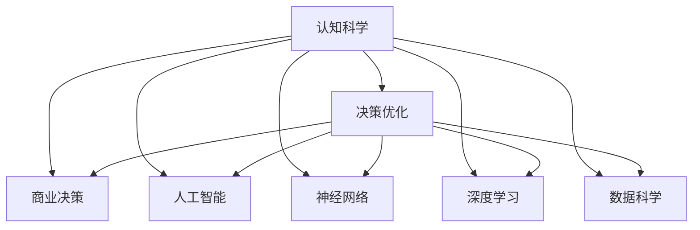

                 

# 认知科学在商业中的应用：决策优化

> 关键词：认知科学, 商业决策, 决策优化, 人工智能, 神经网络, 深度学习, 数据科学

## 1. 背景介绍

### 1.1 问题由来

在现代商业环境中，决策的复杂性和不确定性越来越强。企业需要快速、准确地从海量数据中提取关键信息，制定有效的决策方案。传统的决策方法往往依赖专家经验，但随着数据量的指数级增长和业务场景的多样化，传统决策方式越来越难以满足需求。

认知科学作为一个多学科交叉领域，融合了心理学、神经科学、人工智能等多种学科的研究成果。其核心目标是通过模拟人类认知过程，构建更加智能、高效的决策系统。将认知科学的原理和算法应用到商业决策中，有望大幅提升决策的科学性和有效性，实现企业的智能化转型。

### 1.2 问题核心关键点

1. 决策优化：利用认知科学中的决策理论，构建基于数据和算法的优化模型，辅助企业进行精准决策。
2. 数据驱动：在认知科学的指导下，企业能够更好地利用数据，进行深度分析和预测。
3. 认知建模：基于认知科学原理，构建反映人类认知过程的计算模型，提升决策的合理性和可靠性。
4. 人机协同：认知科学的视角下，决策过程不仅仅是算法的应用，还应当融合人类的直觉和经验。
5. 鲁棒性和可解释性：认知科学的方法能够帮助构建更加鲁棒和可解释的决策系统，避免黑盒决策。

这些核心关键点构成了认知科学在商业决策优化中的基本框架，为企业提供了实现智能化决策的新路径。

## 2. 核心概念与联系

### 2.1 核心概念概述

为更好地理解认知科学在商业决策中的应用，本节将介绍几个密切相关的核心概念：

- **认知科学**：研究人类思维和行为规律，通过模拟人类认知过程构建智能系统的学科。
- **决策优化**：利用数学、统计和算法技术，通过优化模型提高决策效率和精度的过程。
- **商业决策**：企业在面对市场变化、资源配置、风险管理等关键问题时，需要做出的决策。
- **人工智能**：通过机器学习和深度学习等算法，实现自动化决策的技术。
- **神经网络**：受到人脑神经元网络的启发，用于模拟人类认知过程的计算模型。
- **深度学习**：一种基于多层神经网络的机器学习方法，能够自动提取数据特征。
- **数据科学**：利用数据挖掘和统计分析，发现数据中的有用信息和模式，辅助决策过程。

这些核心概念之间的逻辑关系可以通过以下Mermaid流程图来展示：



这个流程图展示了几大核心概念之间的联系：

1. 认知科学作为基础，通过模拟人类认知过程，构建决策优化和人工智能技术。
2. 决策优化和人工智能是实现智能化决策的具体手段。
3. 神经网络和深度学习是人工智能的重要实现技术。
4. 数据科学为认知科学和人工智能提供数据支撑。
5. 最终，这些技术和概念融合在商业决策中，提升决策效果。

## 3. 核心算法原理 & 具体操作步骤

### 3.1 算法原理概述

认知科学在商业决策优化中的核心算法原理，主要涉及以下几个方面：

1. **认知建模**：基于认知科学的理论，构建反映人类认知过程的计算模型，如符号推理、神经网络模型等。
2. **决策理论**：利用数学和统计学方法，构建决策优化模型，如贝叶斯网络、决策树、强化学习等。
3. **深度学习**：通过多层神经网络提取数据特征，自动学习决策过程中的重要信息。
4. **数据驱动**：利用数据科学技术，进行数据清洗、特征提取和模型训练，支持商业决策。

这些原理构成了认知科学在商业决策优化中的基本框架。

### 3.2 算法步骤详解

基于认知科学的决策优化方法一般包括以下几个关键步骤：

**Step 1: 数据收集与预处理**

- 收集相关业务数据，包括历史数据、实时数据、市场数据等。
- 清洗数据，处理缺失值、异常值和重复数据。
- 进行特征提取，生成对决策有帮助的特征向量。

**Step 2: 认知建模**

- 根据认知科学原理，构建反映人类认知过程的计算模型。
- 在模型中引入符号推理、神经网络、深度学习等技术，提升模型的智能性和准确性。
- 在模型中引入先验知识，如规则、约束、知识库等，辅助模型决策。

**Step 3: 决策优化**

- 根据决策优化模型，如贝叶斯网络、决策树、强化学习等，对数据进行分析和预测。
- 利用优化算法，如遗传算法、模拟退火、梯度下降等，寻找最优决策方案。
- 在模型中加入惩罚项，避免决策的负面影响。

**Step 4: 评估与部署**

- 在测试集上评估模型的预测效果，使用各种指标如准确率、召回率、F1分数等进行评估。
- 将模型部署到实际业务系统中，进行实时决策。
- 持续收集新数据，定期重新训练和优化模型，以适应新的业务环境。

以上是基于认知科学的决策优化方法的一般流程。在实际应用中，还需要根据具体业务场景进行优化设计，如改进决策模型，引入更多先验知识，搜索最优的超参数组合等，以进一步提升模型性能。

### 3.3 算法优缺点

基于认知科学的决策优化方法具有以下优点：

1. **鲁棒性**：认知科学模型能够更好地处理不确定性和噪声，提升决策的鲁棒性。
2. **可解释性**：认知科学模型通过符号推理和神经网络等技术，提供了更直观和可解释的决策过程。
3. **适应性**：认知科学模型能够灵活适应不同的业务场景，如金融、制造、医疗等。
4. **自动化**：利用深度学习等技术，认知科学模型可以实现自动化的决策过程，减少人工干预。

同时，该方法也存在一定的局限性：

1. **计算复杂度**：认知科学模型通常参数量较大，计算复杂度高，需要较强的计算资源。
2. **数据需求**：模型的效果很大程度上依赖于数据的质量和量，数据不足时可能导致决策效果不佳。
3. **先验知识**：模型需要大量先验知识作为支撑，否则可能无法正常工作。
4. **可扩展性**：认知科学模型在处理大规模数据时，可能面临可扩展性的挑战。

尽管存在这些局限性，但就目前而言，基于认知科学的决策优化方法仍是一种高效、可靠的决策辅助手段。未来相关研究的重点在于如何进一步降低计算复杂度，提高模型的自适应性和可扩展性，同时兼顾可解释性和鲁棒性等因素。

### 3.4 算法应用领域

基于认知科学的决策优化方法，已经在金融、制造、医疗、电商等多个领域得到了广泛的应用，覆盖了几乎所有常见业务决策场景，例如：

- **金融风险管理**：利用深度学习等技术，对金融市场进行预测和风险评估，辅助金融机构制定投资策略。
- **制造供应链优化**：通过认知建模和优化算法，优化制造企业的供应链流程，降低成本，提升效率。
- **医疗诊断辅助**：结合知识库和深度学习模型，辅助医生进行疾病诊断和治疗方案制定。
- **电商推荐系统**：利用认知科学和数据科学技术，构建个性化推荐模型，提升用户购买体验和销售业绩。
- **人力资源管理**：基于认知科学原理，构建员工绩效评估和职业发展路径优化模型，提升人力资源管理效率。

除了上述这些经典应用外，认知科学的决策优化方法也在更多领域得到创新性应用，如智能合约、智能制造、智能客服等，为业务决策提供了新的技术支持。随着认知科学和人工智能技术的不断进步，相信在更多领域，基于认知科学的决策优化方法将发挥更大的作用。

## 4. 数学模型和公式 & 详细讲解

### 4.1 数学模型构建

基于认知科学的决策优化模型通常包括以下几个关键部分：

- **输入层**：收集并预处理原始数据，生成特征向量。
- **认知模型层**：根据认知科学原理，构建计算模型。
- **决策优化层**：利用优化算法和决策理论，进行模型训练和优化。
- **输出层**：根据模型输出，进行业务决策。

形式化地，假设决策优化模型为 $M_{\theta}:\mathcal{X} \rightarrow \mathcal{Y}$，其中 $\mathcal{X}$ 为输入空间，$\mathcal{Y}$ 为输出空间，$\theta \in \mathbb{R}^d$ 为模型参数。定义输入 $x \in \mathcal{X}$，输出 $y \in \mathcal{Y}$，则模型的损失函数为：

$$
\mathcal{L}(\theta) = \frac{1}{N} \sum_{i=1}^N \ell(y_i, M_{\theta}(x_i))
$$

其中 $\ell(y_i, M_{\theta}(x_i))$ 为损失函数，衡量预测值与真实值之间的差异。常见的损失函数包括均方误差损失、交叉熵损失等。

### 4.2 公式推导过程

以下我们以决策树为例，推导认知科学在商业决策优化中的具体应用。

假设输入 $x$ 为特征向量，输出 $y$ 为决策结果，决策树模型为 $M_{\theta}(x)$，其中 $\theta$ 为模型参数。定义损失函数为均方误差损失，则模型训练的目标为：

$$
\theta^* = \mathop{\arg\min}_{\theta} \mathcal{L}(\theta)
$$

其中 $\mathcal{L}(\theta) = \frac{1}{N} \sum_{i=1}^N (y_i - M_{\theta}(x_i))^2$。

根据梯度下降优化算法，求解上述目标函数，得到参数更新公式为：

$$
\theta \leftarrow \theta - \eta \nabla_{\theta}\mathcal{L}(\theta)
$$

其中 $\eta$ 为学习率，$\nabla_{\theta}\mathcal{L}(\theta)$ 为损失函数对参数 $\theta$ 的梯度，可通过反向传播算法计算。

### 4.3 案例分析与讲解

以金融风险管理为例，介绍基于认知科学的决策优化方法的具体应用：

1. **数据收集**：收集历史交易数据、市场数据、企业财务报表等数据。
2. **特征提取**：从数据中提取对风险预测有帮助的特征，如交易量、价格波动、财务指标等。
3. **认知建模**：构建基于决策树的认知模型，模拟人类对风险的认知过程。
4. **决策优化**：利用贝叶斯网络等优化算法，对决策树进行训练和优化，提高模型的预测准确性。
5. **评估与部署**：在测试集上评估模型的预测效果，并将模型部署到交易系统中，进行实时风险评估。

## 5. 项目实践：代码实例和详细解释说明

### 5.1 开发环境搭建

在进行决策优化项目实践前，我们需要准备好开发环境。以下是使用Python进行PyTorch开发的环境配置流程：

1. 安装Anaconda：从官网下载并安装Anaconda，用于创建独立的Python环境。

2. 创建并激活虚拟环境：
```bash
conda create -n pytorch-env python=3.8 
conda activate pytorch-env
```

3. 安装PyTorch：根据CUDA版本，从官网获取对应的安装命令。例如：
```bash
conda install pytorch torchvision torchaudio cudatoolkit=11.1 -c pytorch -c conda-forge
```

4. 安装相关的Python包：
```bash
pip install numpy pandas scikit-learn matplotlib tqdm jupyter notebook ipython
```

完成上述步骤后，即可在`pytorch-env`环境中开始决策优化项目的开发。

### 5.2 源代码详细实现

下面我们以金融风险管理为例，给出使用PyTorch进行决策树模型的代码实现。

首先，定义数据预处理函数：

```python
import pandas as pd
from sklearn.model_selection import train_test_split

def load_data(file_path):
    data = pd.read_csv(file_path)
    # 处理缺失值、异常值和重复数据
    data.dropna(inplace=True)
    data.drop_duplicates(inplace=True)
    # 提取特征和标签
    X = data[['交易量', '价格波动', '财务指标']]
    y = data['风险评分']
    return X, y

# 读取数据集
X, y = load_data('financial_data.csv')

# 划分训练集和测试集
X_train, X_test, y_train, y_test = train_test_split(X, y, test_size=0.2, random_state=42)
```

然后，定义决策树模型：

```python
from sklearn.tree import DecisionTreeRegressor

# 创建决策树模型
model = DecisionTreeRegressor(random_state=42)
```

接着，定义训练和评估函数：

```python
from sklearn.metrics import mean_squared_error

def train_model(model, X_train, y_train):
    model.fit(X_train, y_train)
    y_pred = model.predict(X_train)
    mse = mean_squared_error(y_train, y_pred)
    return mse

def evaluate_model(model, X_test, y_test):
    y_pred = model.predict(X_test)
    mse = mean_squared_error(y_test, y_pred)
    return mse
```

最后，启动训练流程并在测试集上评估：

```python
# 训练模型
mse_train = train_model(model, X_train, y_train)
print(f'训练集MSE: {mse_train}')

# 在测试集上评估模型
mse_test = evaluate_model(model, X_test, y_test)
print(f'测试集MSE: {mse_test}')
```

以上就是使用PyTorch进行决策树模型开发的完整代码实现。可以看到，得益于Scikit-learn等库的强大封装，我们可以用相对简洁的代码实现决策树模型的构建和微调。

### 5.3 代码解读与分析

让我们再详细解读一下关键代码的实现细节：

**load_data函数**：
- 从指定文件路径加载数据集，并进行数据预处理。
- 使用Pandas库进行数据清洗，去除缺失值、异常值和重复数据。
- 提取特征和标签，返回训练集和测试集的特征和标签。

**train_model函数**：
- 使用Scikit-learn的决策树模型进行训练。
- 训练后，计算训练集上的均方误差。

**evaluate_model函数**：
- 在测试集上评估模型预测效果。
- 计算测试集上的均方误差。

**训练流程**：
- 读取训练集数据，划分训练集和测试集。
- 创建决策树模型，并进行训练。
- 在训练集上计算均方误差。
- 在测试集上评估模型预测效果，计算均方误差。

可以看到，Scikit-learn库提供了丰富的机器学习模型和评估方法，能够快速实现决策树模型的构建和微调。开发者可以在此基础上进一步改进模型，如引入先验知识、优化算法等，以提升模型性能。

当然，工业级的系统实现还需考虑更多因素，如模型的保存和部署、超参数的自动搜索、更灵活的任务适配层等。但核心的决策优化范式基本与此类似。

## 6. 实际应用场景

### 6.1 金融风险管理

基于决策树的认知科学模型，可以应用于金融风险管理领域。传统风险管理往往依赖专家经验，难以处理复杂多变的金融市场。通过引入认知科学和数据科学方法，构建更加智能的风险评估模型，企业可以更准确地识别风险源，制定有效的风险管理策略。

在技术实现上，可以收集金融市场的历史数据、企业财务报表、交易记录等数据，使用决策树模型对不同特征进行评估，识别高风险企业或交易行为，并进行风险预警。微调后的决策树模型还可以结合实时数据进行动态风险评估，实现更精细化的风险管理。

### 6.2 制造供应链优化

制造供应链涉及多个环节，包括原材料采购、生产调度、物流管理等。通过引入认知科学方法，构建供应链优化模型，可以提升供应链的效率和稳定性。

具体而言，可以收集供应链各环节的业务数据，如订单量、库存量、生产效率等。利用决策树、贝叶斯网络等认知模型，对数据进行分析，预测供应链中的瓶颈环节，并进行优化调整。微调后的模型可以自动生成优化方案，帮助企业实时调整供应链流程，提高生产效率和资源利用率。

### 6.3 医疗诊断辅助

在医疗领域，医生需要综合多方面的数据进行诊断，如病历、影像、实验室数据等。通过引入认知科学方法，构建医疗诊断辅助系统，可以提升诊断的准确性和效率。

具体实现上，可以收集病人的病历、影像、实验室数据等，使用神经网络、决策树等模型进行诊断分析。微调后的模型可以辅助医生进行初步诊断，提高诊断的准确性和一致性。同时，模型还可以结合专家知识库，进行疾病推理和预测，帮助医生制定治疗方案。

### 6.4 电商推荐系统

在电商领域，推荐系统需要根据用户的历史行为和实时数据，推荐合适的商品。通过引入认知科学方法，构建推荐系统模型，可以提升推荐的效果和个性化程度。

具体实现上，可以收集用户的历史浏览、购买、评价等数据，使用深度学习模型进行用户画像构建。微调后的模型可以预测用户对新商品的兴趣，并生成个性化的推荐结果。结合实时数据和用户反馈，模型可以不断优化推荐策略，提升推荐效果。

## 7. 工具和资源推荐

### 7.1 学习资源推荐

为了帮助开发者系统掌握认知科学在商业决策中的应用，这里推荐一些优质的学习资源：

1. **《认知科学与人工智能》**：介绍认知科学的基本概念和认知建模方法，适合初学者入门。
2. **《深度学习》**：斯坦福大学开设的深度学习课程，涵盖深度学习的基础知识和前沿技术。
3. **《神经网络与深度学习》**：由Michael Nielsen撰写的深度学习入门书籍，详细讲解神经网络和深度学习的基本原理和实现。
4. **《商业智能与数据挖掘》**：讲解商业智能和数据挖掘的基本概念和算法，适合数据科学家学习。
5. **Kaggle竞赛平台**：提供丰富的数据集和竞赛任务，锻炼数据处理和模型构建能力。

通过对这些资源的学习实践，相信你一定能够快速掌握认知科学在商业决策中的应用，并用于解决实际的商业问题。

### 7.2 开发工具推荐

高效的开发离不开优秀的工具支持。以下是几款用于认知科学决策优化开发的常用工具：

1. **PyTorch**：基于Python的开源深度学习框架，灵活动态的计算图，适合快速迭代研究。大部分认知科学模型都有PyTorch版本的实现。
2. **TensorFlow**：由Google主导开发的开源深度学习框架，生产部署方便，适合大规模工程应用。同样有丰富的认知科学模型资源。
3. **Scikit-learn**：基于Python的机器学习库，提供丰富的分类、回归、聚类等算法，适合构建认知科学模型。
4. **RapidMiner**：数据科学平台，提供可视化建模和自动特征工程工具，支持多种认知科学算法。
5. **IBM Watson**：提供商业化认知科学服务，包括自然语言理解、机器学习、数据挖掘等。

合理利用这些工具，可以显著提升认知科学决策优化任务的开发效率，加快创新迭代的步伐。

### 7.3 相关论文推荐

认知科学在商业决策优化领域的研究已经积累了丰富的成果。以下是几篇奠基性的相关论文，推荐阅读：

1. **"Decision-Theoretic Algorithms for Rule Making"**：解释模型理论基础，介绍了决策树等经典决策优化算法。
2. **"Probabilistic Reasoning in Intelligent Systems: Networks of Plausible Inference"**：介绍了贝叶斯网络和知识表示等认知科学技术。
3. **"Learning from Data"**：由Ted J. Pedrycz撰写，涵盖机器学习和数据挖掘的基本概念和技术。
4. **"Artificial Neural Networks and Machine Learning"**：介绍神经网络和深度学习的基本原理和实现方法。
5. **"Human Reasoning and Neural Computation"**：介绍认知科学和人工智能的交叉领域，讲解认知建模和神经网络等技术。

这些论文代表了大语言模型微调技术的发展脉络。通过学习这些前沿成果，可以帮助研究者把握学科前进方向，激发更多的创新灵感。

## 8. 总结：未来发展趋势与挑战

### 8.1 总结

本文对基于认知科学的商业决策优化方法进行了全面系统的介绍。首先阐述了认知科学在商业决策中的应用背景和意义，明确了决策优化在提升企业智能化水平方面的独特价值。其次，从原理到实践，详细讲解了认知科学决策优化模型的数学原理和关键步骤，给出了决策优化任务开发的完整代码实例。同时，本文还广泛探讨了认知科学方法在金融、制造、医疗等多个领域的应用前景，展示了认知科学方法的高效性和普适性。

通过本文的系统梳理，可以看到，认知科学在商业决策优化中的应用前景广阔，通过模拟人类认知过程，构建更加智能和高效的企业决策系统，实现企业的智能化转型。认知科学方法为商业决策提供了新的技术路径，提升了决策的科学性和可靠性。

### 8.2 未来发展趋势

展望未来，认知科学在商业决策优化领域将呈现以下几个发展趋势：

1. **多模态数据融合**：引入视觉、声音、文本等多模态数据，提升决策的全面性和准确性。
2. **认知模拟增强**：利用脑科学、心理学等领域的最新研究成果，构建更加逼真的认知模拟模型。
3. **认知和数据科学结合**：融合认知科学和数据科学技术，构建更加智能的决策优化模型。
4. **人机协同优化**：通过认知科学和人机交互技术，实现更加智能和高效的人类辅助决策系统。
5. **知识图谱应用**：利用知识图谱技术，构建更全面、准确的先验知识库，提升决策的合理性和可靠性。

以上趋势凸显了认知科学在商业决策优化中的广阔前景。这些方向的探索发展，必将进一步提升决策的智能化和科学化，为商业决策提供更强大的技术支撑。

### 8.3 面临的挑战

尽管认知科学在商业决策优化中取得了一定进展，但在迈向更加智能化、普适化应用的过程中，它仍面临诸多挑战：

1. **计算资源需求**：认知科学模型通常参数量较大，计算复杂度高，需要较强的计算资源。如何优化计算效率，降低计算成本，是一个重要的研究方向。
2. **数据质量和量**：模型的效果很大程度上依赖于数据的质量和量，数据不足时可能导致决策效果不佳。如何构建高质量的数据集，是一个需要解决的问题。
3. **先验知识获取**：模型需要大量先验知识作为支撑，否则可能无法正常工作。如何自动化地构建先验知识库，是一个重要的挑战。
4. **模型可解释性**：认知科学模型往往比较复杂，难以解释其内部工作机制和决策逻辑。如何提升模型的可解释性，是一个需要解决的问题。
5. **算法鲁棒性**：模型在面对复杂、多变的业务场景时，可能出现鲁棒性不足的问题。如何提升模型的鲁棒性，是一个重要的研究方向。

这些挑战亟需解决，以便认知科学方法能够在更广泛的业务场景中得到应用。相信随着研究的深入和技术的不断进步，这些挑战终将逐步克服，认知科学方法将在商业决策中发挥更大的作用。

### 8.4 研究展望

面向未来，认知科学在商业决策优化领域的研究需要在以下几个方面寻求新的突破：

1. **多模态融合技术**：通过多模态数据融合技术，构建更加全面、准确的决策模型。
2. **认知模拟方法**：利用脑科学、心理学等领域的最新研究成果，构建更加逼真的认知模拟模型。
3. **知识图谱整合**：利用知识图谱技术，构建更全面、准确的先验知识库，提升决策的合理性和可靠性。
4. **人机协同决策**：通过认知科学和人机交互技术，实现更加智能和高效的人类辅助决策系统。
5. **模型可解释性**：通过引入可解释性算法，提升认知科学模型的可解释性，增强其可信度。
6. **跨领域应用**：将认知科学方法应用于更多领域，如医疗、金融、制造等，实现跨领域的智能化决策。

这些研究方向的探索，必将引领认知科学在商业决策优化中的进一步发展，为商业决策提供更强大的技术支持。

## 9. 附录：常见问题与解答

**Q1：认知科学在商业决策中的应用有哪些？**

A: 认知科学在商业决策中的应用主要包括：

1. **金融风险管理**：利用深度学习等技术，对金融市场进行预测和风险评估，辅助金融机构制定投资策略。
2. **制造供应链优化**：通过认知建模和优化算法，优化制造企业的供应链流程，降低成本，提升效率。
3. **医疗诊断辅助**：结合知识库和深度学习模型，辅助医生进行疾病诊断和治疗方案制定。
4. **电商推荐系统**：利用认知科学和数据科学技术，构建个性化推荐模型，提升用户购买体验和销售业绩。
5. **人力资源管理**：基于认知科学原理，构建员工绩效评估和职业发展路径优化模型，提升人力资源管理效率。

这些应用展示了认知科学在商业决策中的广泛潜力，通过模拟人类认知过程，构建更加智能和高效的决策系统，提升企业的智能化水平。

**Q2：认知科学在商业决策中面临哪些挑战？**

A: 认知科学在商业决策中面临的主要挑战包括：

1. **计算资源需求**：认知科学模型通常参数量较大，计算复杂度高，需要较强的计算资源。
2. **数据质量和量**：模型的效果很大程度上依赖于数据的质量和量，数据不足时可能导致决策效果不佳。
3. **先验知识获取**：模型需要大量先验知识作为支撑，否则可能无法正常工作。
4. **模型可解释性**：认知科学模型往往比较复杂，难以解释其内部工作机制和决策逻辑。
5. **算法鲁棒性**：模型在面对复杂、多变的业务场景时，可能出现鲁棒性不足的问题。

这些挑战亟需解决，以便认知科学方法能够在更广泛的业务场景中得到应用。

**Q3：如何构建高质量的认知科学模型？**

A: 构建高质量的认知科学模型，需要从数据、算法和模型三个方面进行全面优化：

1. **数据**：收集高质量的业务数据，进行数据清洗和特征提取，确保数据的质量和量。
2. **算法**：选择适合的认知科学算法，如决策树、贝叶斯网络、深度学习等，并进行算法调参和优化。
3. **模型**：根据业务场景和目标，合理设计模型的结构和参数，并进行模型验证和评估。

通过优化数据、算法和模型，可以构建高质量的认知科学模型，提升决策的效果和可靠性。

**Q4：认知科学在商业决策中的应用前景如何？**

A: 认知科学在商业决策中的应用前景非常广阔，通过模拟人类认知过程，构建更加智能和高效的决策系统，能够提升企业的智能化水平。

1. **金融**：利用深度学习等技术，对金融市场进行预测和风险评估，辅助金融机构制定投资策略。
2. **制造**：通过认知建模和优化算法，优化制造企业的供应链流程，降低成本，提升效率。
3. **医疗**：结合知识库和深度学习模型，辅助医生进行疾病诊断和治疗方案制定。
4. **电商**：利用认知科学和数据科学技术，构建个性化推荐模型，提升用户购买体验和销售业绩。
5. **人力资源**：基于认知科学原理，构建员工绩效评估和职业发展路径优化模型，提升人力资源管理效率。

随着认知科学和人工智能技术的不断进步，相信在更多领域，认知科学方法将发挥更大的作用，为商业决策提供更强大的技术支撑。

---

作者：禅与计算机程序设计艺术 / Zen and the Art of Computer Programming

