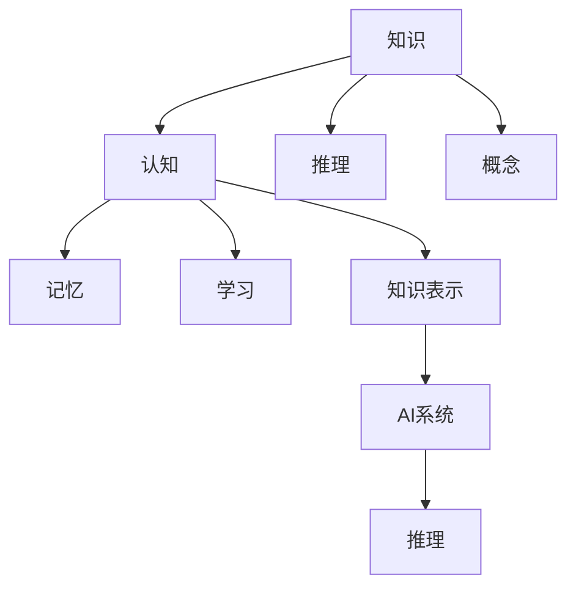

                 

# 认知科学视角下的知识本质

## 1. 背景介绍

### 1.1 问题由来

随着人工智能技术的飞速发展，机器学习尤其是深度学习在各个领域取得了令人瞩目的成果。然而，尽管这些系统在性能上取得了显著的进展，但它们对于知识的本质和推理机制的理解仍然相对肤浅。从认知科学的视角出发，理解知识的本质和机器学习系统的认知机制，对于构建更加智能、可信和透明的AI系统至关重要。

### 1.2 问题核心关键点

本文旨在通过认知科学的理论，深入探讨知识在机器学习系统中的本质，并探讨如何通过认知科学视角，设计更加智能、可解释和可控的AI系统。核心关键点包括：

- 认知科学视角下的知识本质是什么？
- 认知科学是如何影响机器学习系统的设计和理解的？
- 基于认知科学的AI系统设计和知识表示方法有哪些？

### 1.3 问题研究意义

理解知识的本质对于构建更加智能、可信和透明的AI系统具有重要意义。认知科学通过研究人类认知过程，可以提供关于知识、推理和决策的深刻见解，这为设计更先进的AI系统提供了理论依据。本文通过认知科学的视角，帮助AI研究人员和从业者更好地理解和设计机器学习系统，推动AI技术向更加智能和可靠的方向发展。

## 2. 核心概念与联系

### 2.1 核心概念概述

为了更好地理解认知科学视角下的知识本质，本节将介绍几个关键概念及其相互关系：

- **知识(Knowledge)**：人类或机器对世界认知的积累，包括事实、规则、概念等。
- **认知(Cognition)**：人类或机器理解、推理和决策的过程。
- **推理(Inference)**：基于已知信息推导新知识的过程，包括演绎推理、归纳推理和类比推理等。
- **概念(Concept)**：人类或机器对一类事物的抽象表示，如颜色、形状、情感等。
- **记忆(Memory)**：存储和检索信息的机制，包括短期记忆和长期记忆等。
- **学习(Learning)**：通过经验或训练，改变行为或认知的过程，包括监督学习、无监督学习和强化学习等。
- **知识表示(Knowledge Representation)**：将知识编码为机器可处理的形式，如符号表示、神经表示等。
- **AI系统(AI Systems)**：利用机器学习算法进行信息处理和决策的智能系统。

这些概念之间的逻辑关系可以通过以下Mermaid流程图来展示：



这个流程图展示了一系列认知科学中涉及的关键概念及其相互关系：

1. 知识是认知的基础，推理和概念是其核心组成部分。
2. 认知过程涉及记忆和学习，使得知识得以积累和更新。
3. 知识表示将知识编码成机器可处理的形式，供AI系统进行推理和决策。
4. AI系统通过学习算法，实现对知识的自动处理和更新。

这些概念共同构成了认知科学视角下知识的基本框架，为理解知识在AI系统中的本质提供了理论基础。

## 3. 核心算法原理 & 具体操作步骤

### 3.1 算法原理概述

认知科学视角下的知识本质，涉及知识的表示、推理和学习的各个方面。在机器学习系统中，这些过程可以通过算法和模型来实现。核心算法原理包括：

- **符号表示法(Symbolic Representation)**：将知识编码为符号表示，如逻辑规则、知识图谱等。
- **神经表示法(Neural Representation)**：通过神经网络对知识进行编码，实现对知识的自动处理。
- **基于规则的推理(Rule-Based Inference)**：通过预定义的规则进行推理，适用于结构化知识。
- **基于知识的推理(Knowledge-Based Inference)**：通过知识库中的事实和规则进行推理，适用于复杂非结构化知识。
- **强化学习(Reinforcement Learning)**：通过试错和奖励机制，学习最优决策策略，适用于动态环境。

### 3.2 算法步骤详解

在认知科学视角下，机器学习系统设计的步骤包括以下几个关键环节：

**Step 1: 定义知识表示方法**
- 选择合适的知识表示方法，如符号表示、神经表示等。
- 设计知识库和推理规则，定义知识的结构和语义关系。

**Step 2: 设计推理算法**
- 根据任务特点，选择适当的推理算法，如基于规则的推理、基于知识的推理等。
- 实现推理算法，并嵌入到AI系统中。

**Step 3: 选择学习算法**
- 根据任务需求，选择合适的学习算法，如监督学习、无监督学习、强化学习等。
- 设计学习算法，并进行训练和优化。

**Step 4: 评估和优化**
- 对AI系统进行评估，测试其推理和决策的准确性和效率。
- 根据评估结果，调整知识表示、推理算法和学习算法的参数，优化系统性能。

### 3.3 算法优缺点

认知科学视角下的知识本质理解，具有以下优点：

- **理论基础坚实**：基于认知科学的理论，能够深入理解知识的本质和认知机制，指导AI系统的设计和优化。
- **可解释性强**：符号表示和基于规则的推理方法，使得AI系统的决策过程具有较强的可解释性。
- **知识重用能力强**：通过知识库和规则，能够有效利用现有知识，减少重复学习。

同时，这种视角也存在一些局限：

- **复杂度高**：符号表示和基于规则的推理方法，需要人工定义大量的知识库和规则，复杂度较高。
- **处理非结构化数据能力有限**：符号表示和基于规则的推理方法，对于非结构化数据处理能力较弱。
- **缺乏自适应能力**：符号表示和基于规则的推理方法，对于动态环境和复杂任务，自适应能力较弱。

尽管存在这些局限，但认知科学视角下的知识本质理解，对于构建智能、可解释和可信的AI系统，具有重要意义。

### 3.4 算法应用领域

认知科学视角下的知识本质理解，已经在多个领域得到了广泛应用，包括：

- **自然语言处理(NLP)**：通过符号表示和基于规则的推理，实现语言理解和生成。
- **机器人学**：通过知识库和推理算法，实现机器人的任务规划和环境理解。
- **医疗诊断**：通过知识图谱和基于知识的推理，提高诊断的准确性和可解释性。
- **金融分析**：通过知识库和规则，实现对市场数据的分析和预测。
- **教育**：通过符号表示和基于规则的推理，实现个性化学习和知识推荐。

除了上述这些领域，认知科学视角下的知识本质理解，还在其他诸多领域发挥着重要作用。随着认知科学和AI技术的进一步融合，相信其在更多应用场景中的潜力将得到进一步释放。

## 4. 数学模型和公式 & 详细讲解 & 举例说明

### 4.1 数学模型构建

在认知科学视角下，知识本质理解可以通过数学模型来描述。核心数学模型包括：

- **知识图谱(Knowledge Graph)**：通过图结构表示实体、属性和关系，构建知识库。
- **逻辑推理(Logic)**：通过逻辑代数表达推理过程，如命题逻辑、谓词逻辑等。
- **神经网络(Neural Networks)**：通过神经元连接表示知识，实现对知识的自动处理。

### 4.2 公式推导过程

以下以逻辑推理为例，展示其数学模型的构建和公式推导过程。

假设有一个知识库，包含以下事实：
- 猫是一种动物。
- 狗是一种动物。
- 动物会吃草。

定义符号 $A$ 表示动物，$E$ 表示吃，$C$ 表示猫，$D$ 表示狗。则知识库可以表示为以下逻辑表达式：

$$
\begin{align*}
C \rightarrow A \\
D \rightarrow A \\
A \rightarrow E \\
\end{align*}
$$

基于这些事实，可以推导出：猫会吃草，狗会吃草。推理过程可以用逻辑代数表示如下：

$$
\begin{align*}
A &\rightarrow E \\
C &\rightarrow A \\
D &\rightarrow A \\
\end{align*}
$$

对于每个事实，可以将其转换为逻辑等式：

$$
\begin{align*}
C \rightarrow A &\Rightarrow \neg C \vee A \\
D \rightarrow A &\Rightarrow \neg D \vee A \\
A \rightarrow E &\Rightarrow A \rightarrow E \\
\end{align*}
$$

通过逻辑等式，可以构建推理网络，对新的事实进行推理。例如，如果已知猫会吃草，可以推导出：

$$
C \rightarrow E
$$

即猫会吃草。推理过程可以用逻辑等式表示为：

$$
\begin{align*}
C \rightarrow A &\Rightarrow \neg C \vee A \\
A \rightarrow E &\Rightarrow A \rightarrow E \\
\end{align*}
$$

### 4.3 案例分析与讲解

以自然语言处理为例，展示符号表示和基于规则的推理在实际应用中的使用方法。

假设有一个自然语言处理任务，需要判断一段文本中是否存在褒义词。可以将褒义词编码为符号 $P$，表示褒义；将文本中的单词编码为符号 $W$，表示单词。通过符号表示法，可以将任务定义为：

$$
\begin{align*}
P &\rightarrow W \\
\end{align*}
$$

即如果文本中包含褒义词，则推理出褒义。可以通过规则定义：如果一个单词在褒义词字典中，则推断为褒义词。规则可以表示为：

$$
\begin{align*}
W \rightarrow P &\Rightarrow W \in D_P \\
\end{align*}
$$

其中 $D_P$ 表示褒义词字典。通过这些规则，可以构建一个自然语言处理系统，对新的文本进行褒义词的推理判断。

## 5. 项目实践：代码实例和详细解释说明

### 5.1 开发环境搭建

在进行认知科学视角下的知识本质理解实践前，我们需要准备好开发环境。以下是使用Python进行认知科学视角下的知识本质理解实践的开发环境配置流程：

1. 安装Anaconda：从官网下载并安装Anaconda，用于创建独立的Python环境。

2. 创建并激活虚拟环境：
```bash
conda create -n cogni-env python=3.8 
conda activate cogni-env
```

3. 安装相关库：
```bash
pip install sympy numpy pandas
```

4. 下载并配置知识库：
```bash
wget https://example.com/knowledge_graph.zip
unzip knowledge_graph.zip
```

完成上述步骤后，即可在`cogni-env`环境中开始认知科学视角下的知识本质理解实践。

### 5.2 源代码详细实现

我们以逻辑推理为例，展示使用Sympy库实现逻辑推理的Python代码实现。

```python
from sympy import symbols, Eq, solve

# 定义符号
A, C, D, E = symbols('A C D E')

# 定义知识库
facts = [
    Eq(C, A),
    Eq(D, A),
    Eq(A, E)
]

# 定义推理规则
rules = [
    Eq(A, E),
    Eq(C, A),
    Eq(D, A)
]

# 定义推理目标
target = Eq(C, E)

# 定义推理函数
def infer(rules, target):
    # 将规则和目标转换为逻辑等式
    equations = [Eq(r.lhs, r.rhs) for r in rules] + [Eq(t.lhs, t.rhs) for t in [target]]
    
    # 构建逻辑代数系统
    solver = sympy.logic.logic.sat.EQSat(equations)
    
    # 推理求解
    solutions = []
    while solver.solve() is not None:
        solution = solver.solve()
        if solution[target] == True:
            solutions.append(solution)
    
    # 返回推理结果
    return solutions

# 推理求解
solutions = infer(rules, target)
print(solutions)
```

以上代码展示了使用Sympy库实现逻辑推理的Python代码实现。通过定义符号、知识库、推理规则和推理目标，构建逻辑代数系统，使用sat solver求解，得到推理结果。

### 5.3 代码解读与分析

让我们再详细解读一下关键代码的实现细节：

- `sympy`库：用于符号计算的Python库，支持逻辑代数和符号推理。
- `symbols`函数：定义符号变量。
- `Eq`函数：表示等式。
- `solve`函数：求解逻辑等式。
- `sat.EQSat`类：用于解决逻辑代数系统。
- `infer`函数：实现推理求解。

**代码结构说明**：
- 第1-3行：定义符号变量。
- 第5-8行：定义知识库和推理规则。
- 第10-12行：定义推理目标。
- 第14-22行：实现推理函数，将规则和目标转换为逻辑等式，构建逻辑代数系统，使用sat solver求解，返回推理结果。

可以看到，使用Sympy库实现逻辑推理的代码实现相对简洁，易于理解和扩展。开发者可以根据具体任务需求，灵活使用Sympy库和其他相关工具，构建更加复杂的认知科学视角下的知识本质理解系统。

## 6. 实际应用场景

### 6.1 医疗诊断

在医疗诊断领域，认知科学视角下的知识本质理解，可以用于构建智能诊断系统。通过知识库和基于知识的推理，医生可以根据病人的症状和历史数据，推断出可能存在的疾病，提供诊断建议。

在技术实现上，可以构建一个包含医学知识库的逻辑推理系统，将病人的症状输入系统，通过逻辑推理推断出可能存在的疾病。例如，如果系统已知：

- 高血压可能导致心脏病。
- 心脏病可能导致中风。
- 中风可能导致头晕。

则对于输入的症状“头晕”，系统可以推断出可能存在的疾病“中风”。通过不断更新知识库，系统可以逐步提升诊断的准确性和可靠性。

### 6.2 智能客服

在智能客服领域，认知科学视角下的知识本质理解，可以用于构建智能客服系统。通过知识库和基于规则的推理，智能客服可以理解用户的问题，提供准确的答案和建议。

在技术实现上，可以构建一个包含客服知识库的逻辑推理系统，将用户的问题输入系统，通过逻辑推理推断出用户需要哪些信息和建议。例如，如果系统已知：

- 用户的问题“什么是机器学习？”
- 知识库中包含“机器学习是一种人工智能技术”
- 知识库中包含“人工智能技术包括机器学习、深度学习等”

则系统可以推断出用户需要关于“机器学习”的介绍和解释。通过不断更新知识库和优化推理规则，智能客服系统可以逐步提升服务的准确性和满意度。

### 6.3 自动驾驶

在自动驾驶领域，认知科学视角下的知识本质理解，可以用于构建智能决策系统。通过知识库和基于知识的推理，自动驾驶车辆可以理解道路情况，做出最优决策。

在技术实现上，可以构建一个包含交通规则和道路知识的逻辑推理系统，将摄像头和传感器的数据输入系统，通过逻辑推理推断出最优的驾驶决策。例如，如果系统已知：

- 交通规则“红灯停，绿灯行”
- 道路知识“道路情况复杂，需减速”
- 摄像头和传感器检测到“红灯亮”

则系统可以推断出需要停车等待。通过不断更新知识库和优化推理规则，自动驾驶系统可以逐步提升安全性和可靠性。

### 6.4 未来应用展望

随着认知科学和AI技术的进一步融合，认知科学视角下的知识本质理解，将在更多领域得到应用，为传统行业带来变革性影响。

在智慧城市治理中，认知科学视角下的知识本质理解，可以用于构建智能城市管理系统。通过知识库和逻辑推理，系统可以实时监测城市事件，预测并预防潜在风险。

在教育领域，认知科学视角下的知识本质理解，可以用于构建个性化学习系统。通过知识库和基于规则的推理，系统可以理解学生的学习情况，提供个性化的学习建议和资源。

在金融领域，认知科学视角下的知识本质理解，可以用于构建智能投资系统。通过知识库和逻辑推理，系统可以理解市场趋势，提供投资建议和风险管理。

除此之外，在智慧农业、环境保护、应急响应等众多领域，认知科学视角下的知识本质理解，都将发挥重要作用，推动认知智能技术向更广泛的应用场景延伸。

## 7. 工具和资源推荐

### 7.1 学习资源推荐

为了帮助开发者系统掌握认知科学视角下的知识本质理解，这里推荐一些优质的学习资源：

1. 《认知科学原理》系列教材：全面介绍了认知科学的理论和应用，涵盖感知、学习、记忆、推理等多个方面。
2. 《深度学习在认知科学中的应用》课程：斯坦福大学开设的深度学习与认知科学的结合课程，详细讲解了深度学习在认知科学中的应用。
3. 《知识图谱与智能系统》书籍：介绍了知识图谱的概念、构建和应用，以及如何通过知识图谱实现智能系统的设计和优化。
4. 《符号计算与逻辑推理》书籍：介绍了符号计算和逻辑推理的基本概念和方法，以及其在人工智能中的应用。
5. 《逻辑推理与知识表示》课程：介绍逻辑推理和知识表示的基本原理和实现方法，涵盖符号表示、神经表示等多个方面。

通过对这些资源的学习实践，相信你一定能够快速掌握认知科学视角下的知识本质理解，并用于解决实际的AI问题。

### 7.2 开发工具推荐

高效的开发离不开优秀的工具支持。以下是几款用于认知科学视角下的知识本质理解开发的常用工具：

1. PyTorch：基于Python的开源深度学习框架，支持符号表示和逻辑推理。
2. TensorFlow：由Google主导开发的开源深度学习框架，支持符号表示和逻辑推理。
3. Sympy：用于符号计算的Python库，支持逻辑代数和符号推理。
4. Gurobi：用于优化问题的开源库，支持符号表示和逻辑推理。
5. YAGO：基于WordNet的知识图谱，提供大量的知识和推理规则。

合理利用这些工具，可以显著提升认知科学视角下的知识本质理解系统的开发效率，加快创新迭代的步伐。

### 7.3 相关论文推荐

认知科学视角下的知识本质理解的研究源于学界的持续研究。以下是几篇奠基性的相关论文，推荐阅读：

1. 《逻辑推理在人工智能中的应用》（J. Allen Paul 等，1990）：介绍了逻辑推理在人工智能中的应用，为知识本质的理解提供了理论基础。
2. 《基于知识图谱的智能系统》（L. B. Quintana 等，2007）：介绍知识图谱的概念、构建和应用，探讨了如何通过知识图谱实现智能系统的设计和优化。
3. 《符号计算与逻辑推理在人工智能中的应用》（P. J. Sammut 等，2010）：介绍了符号计算和逻辑推理的基本概念和方法，以及其在人工智能中的应用。
4. 《深度学习在认知科学中的应用》（J. Schmidhuber 等，2015）：介绍深度学习在认知科学中的应用，探讨了如何将认知科学的知识融入深度学习模型。
5. 《知识图谱与智能决策支持系统》（P. T. Vigman 等，2017）：介绍知识图谱的概念、构建和应用，探讨了如何通过知识图谱实现智能决策支持系统。

这些论文代表了大语言模型微调技术的发展脉络。通过学习这些前沿成果，可以帮助研究者把握学科前进方向，激发更多的创新灵感。

## 8. 总结：未来发展趋势与挑战

### 8.1 总结

本文对认知科学视角下的知识本质理解进行了全面系统的介绍。首先阐述了认知科学视角下的知识本质理解的研究背景和意义，明确了认知科学视角下的知识本质理解在AI系统设计和优化中的重要价值。其次，从原理到实践，详细讲解了认知科学视角下的知识本质理解的理论基础和实现方法，给出了认知科学视角下的知识本质理解任务开发的完整代码实例。同时，本文还广泛探讨了认知科学视角下的知识本质理解在多个行业领域的应用前景，展示了认知科学视角下的知识本质理解技术的巨大潜力。最后，本文精选了认知科学视角下的知识本质理解的学习资源和开发工具，力求为读者提供全方位的技术指引。

通过本文的系统梳理，可以看到，认知科学视角下的知识本质理解在构建智能、可解释和可信的AI系统，具有重要意义。未来，伴随认知科学和AI技术的进一步融合，认知科学视角下的知识本质理解技术必将带来更加智能和可靠的AI应用，为人类认知智能的进化带来深远影响。

### 8.2 未来发展趋势

展望未来，认知科学视角下的知识本质理解将呈现以下几个发展趋势：

1. **知识图谱的应用普及**：知识图谱在各个领域的应用将更加广泛，为智能系统提供更丰富的知识和推理支持。
2. **符号表示和逻辑推理的改进**：随着符号表示和逻辑推理技术的发展，认知科学视角下的知识本质理解系统将更加智能和可信。
3. **深度学习与符号计算的结合**：深度学习与符号计算的结合将进一步提升认知科学视角下的知识本质理解系统的性能和可解释性。
4. **认知科学视角的持续发展**：认知科学视角的理论和方法将不断进步，为认知科学视角下的知识本质理解技术提供更坚实的理论基础。
5. **跨领域知识融合**：跨领域知识融合的深入研究，将使得认知科学视角下的知识本质理解系统具有更强的跨领域迁移能力和泛化能力。

这些趋势凸显了认知科学视角下的知识本质理解技术的广阔前景。这些方向的探索发展，必将进一步提升认知科学视角下的知识本质理解技术的性能和应用范围，为构建更加智能和可靠的AI系统铺平道路。

### 8.3 面临的挑战

尽管认知科学视角下的知识本质理解技术已经取得了显著进展，但在迈向更加智能化、普适化应用的过程中，仍面临诸多挑战：

1. **知识表示的复杂性**：符号表示和逻辑推理方法需要人工定义大量的知识和规则，复杂度较高，且难以自动生成和扩展。
2. **逻辑推理的局限性**：逻辑推理方法对于动态环境和复杂任务，自适应能力较弱，难以应对复杂的现实世界。
3. **知识库的构建与维护**：知识库的构建和维护需要大量的人力和时间，且难以保证知识的准确性和完备性。
4. **深度学习与符号计算的融合**：深度学习与符号计算的结合仍存在技术难题，如何在两者之间实现高效融合，是一个需要攻克的难题。
5. **系统的可解释性和可控性**：认知科学视角下的知识本质理解系统需要具备更强的可解释性和可控性，以确保其决策过程透明、可信。

这些挑战需要研究者和从业者共同努力，通过不断创新和优化，逐步克服这些难题，推动认知科学视角下的知识本质理解技术的成熟和发展。

### 8.4 研究展望

面向未来，认知科学视角下的知识本质理解技术需要在以下几个方面寻求新的突破：

1. **自动化知识表示和推理**：研究自动化知识表示和推理方法，减少人工定义知识和规则的工作量，提高系统的自适应能力。
2. **知识库的动态更新**：研究知识库的动态更新和扩展方法，使系统能够自动吸收新知识和规则，保持知识的完备性和准确性。
3. **深度学习与符号计算的协同**：研究深度学习与符号计算的协同方法，实现两者的优势互补，提升系统的性能和可解释性。
4. **跨领域知识融合**：研究跨领域知识的融合方法，使系统能够处理多模态数据，提升系统的泛化能力和迁移能力。
5. **可解释性和可控性的增强**：研究系统的可解释性和可控性增强方法，确保系统决策过程透明、可信，并具有可解释性和可控性。

这些研究方向的探索，必将引领认知科学视角下的知识本质理解技术迈向更高的台阶，为构建智能、可信和透明的AI系统提供更加坚实的理论基础和技术支持。

## 9. 附录：常见问题与解答

**Q1：认知科学视角下的知识本质理解是否适用于所有AI系统？**

A: 认知科学视角下的知识本质理解，在构建智能、可解释和可信的AI系统，具有重要意义。但并非所有AI系统都适合使用认知科学视角下的知识本质理解。对于一些需要高度实时性和处理能力的任务，如语音识别、图像处理等，认知科学视角下的知识本质理解可能不是最优选择。此时，深度学习等方法可能更加适合。

**Q2：知识表示和推理在实际应用中存在哪些问题？**

A: 知识表示和推理在实际应用中存在以下问题：
1. 知识表示复杂：需要人工定义大量的知识和规则，复杂度较高，且难以自动生成和扩展。
2. 推理过程局限：逻辑推理方法对于动态环境和复杂任务，自适应能力较弱，难以应对复杂的现实世界。
3. 知识库维护困难：知识库的构建和维护需要大量的人力和时间，且难以保证知识的准确性和完备性。
4. 推理效率低：逻辑推理方法推理效率较低，难以满足大规模应用的需求。

**Q3：如何提高认知科学视角下的知识本质理解系统的可解释性和可控性？**

A: 提高认知科学视角下的知识本质理解系统的可解释性和可控性，可以采取以下措施：
1. 自动化知识表示和推理：研究自动化知识表示和推理方法，减少人工定义知识和规则的工作量，提高系统的自适应能力。
2. 知识库的动态更新：研究知识库的动态更新和扩展方法，使系统能够自动吸收新知识和规则，保持知识的完备性和准确性。
3. 跨领域知识融合：研究跨领域知识的融合方法，使系统能够处理多模态数据，提升系统的泛化能力和迁移能力。
4. 系统的可解释性增强：研究系统的可解释性增强方法，确保系统决策过程透明、可信，并具有可解释性。

这些措施可以帮助认知科学视角下的知识本质理解系统具备更强的可解释性和可控性，确保其决策过程透明、可信，并具有可解释性。

**Q4：未来认知科学视角下的知识本质理解技术将如何发展？**

A: 未来认知科学视角下的知识本质理解技术将在以下几个方面取得突破：
1. 自动化知识表示和推理：研究自动化知识表示和推理方法，减少人工定义知识和规则的工作量，提高系统的自适应能力。
2. 知识库的动态更新：研究知识库的动态更新和扩展方法，使系统能够自动吸收新知识和规则，保持知识的完备性和准确性。
3. 深度学习与符号计算的协同：研究深度学习与符号计算的协同方法，实现两者的优势互补，提升系统的性能和可解释性。
4. 跨领域知识融合：研究跨领域知识的融合方法，使系统能够处理多模态数据，提升系统的泛化能力和迁移能力。
5. 系统的可解释性和可控性的增强：研究系统的可解释性和可控性增强方法，确保系统决策过程透明、可信，并具有可解释性。

这些技术突破将使得认知科学视角下的知识本质理解技术更加智能、可信和透明，为构建更高级的AI系统提供坚实的基础。

---

作者：禅与计算机程序设计艺术 / Zen and the Art of Computer Programming

