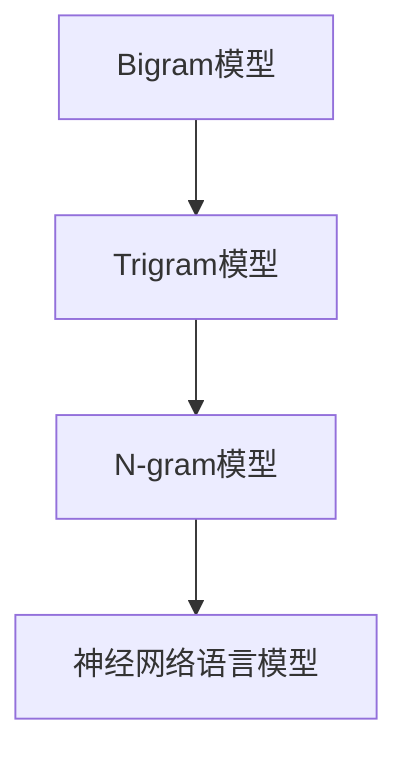

                 

# 语言建模进阶：Bigram 到 N-gram

> 关键词：语言模型, Bigram模型, N-gram模型, 自然语言处理(NLP), 概率统计, 模型训练, 神经网络, 深度学习

## 1. 背景介绍

### 1.1 问题由来

语言模型是自然语言处理（NLP）的核心任务之一，其目的是对给定的语言序列进行概率建模，从而推断序列中每个词的概率分布。这种概率分布对于文本生成、自动翻译、语音识别等众多NLP任务都至关重要。传统上，语言模型主要分为基于统计的语言模型和基于神经网络的语言模型两大类。

**基于统计的语言模型**主要使用$n$-gram模型，即假设相邻的$n$个词之间存在概率依赖关系。其中，$n$-gram模型最早由Bigram模型发展而来，随后逐步演进为Bigram、Trigram、Quadrigram，甚至更高阶的N-gram模型。

**基于神经网络的语言模型**则主要使用递归神经网络（RNN）、长短时记忆网络（LSTM）和Transformer等结构，通过训练大规模语料库中的数据，来建模语言的概率分布。这类模型相对于传统统计模型，具有更强的泛化能力，但在计算资源需求和训练复杂度上更为苛刻。

然而，近年来随着预训练语言模型的兴起，以BERT、GPT为代表的大模型，已经成为NLP任务中最为流行的语言模型。这些模型通过大规模无标签数据进行预训练，学习到通用的语言表示，具备强大的语言理解和生成能力。它们在微调策略和架构设计上，与传统的$n$-gram模型有着本质的区别，但仍然可以从$n$-gram模型中获得灵感和借鉴。

### 1.2 问题核心关键点

$n$-gram模型在大规模文本处理和语言建模中，具有极高的理论价值和实际应用价值。其主要特点包括：
- **概率统计基础**：基于条件概率的计算，可以清晰地解释语言序列的统计规律。
- **模型简单**：$n$-gram模型相对神经网络模型，具有更低的计算复杂度和更高的可解释性。
- **广泛应用**：广泛应用于文本生成、机器翻译、信息检索等众多NLP任务中。
- **易于扩展**：通过增加$n$的取值，可以逐步提升模型对语言序列的建模精度。

但$n$-gram模型也存在一些局限性：
- **局部性**：$n$-gram模型只考虑了相邻$n$个词之间的依赖关系，忽略了更远距离的上下文信息。
- **高阶模型训练难度**：随着$n$的增大，训练数据的需求呈指数级增长，计算复杂度显著增加。
- **词汇表依赖**：模型依赖于完整的词汇表，对于未知词汇的预测能力较弱。

这些特点使得$n$-gram模型在实际应用中具有重要的参考价值，但无法完全替代更先进的神经网络语言模型。本文将详细探讨$n$-gram模型的原理、计算和应用，并对比分析其优缺点，从而为更好地理解语言模型提供全面的视角。

## 2. 核心概念与联系

### 2.1 核心概念概述

本节将介绍几个与$n$-gram模型密切相关的核心概念：

- **Bigram模型**：最简单的$n$-gram模型，只考虑相邻两个词之间的概率依赖关系。
- **Trigram模型**：在Bigram模型的基础上，增加一个词的依赖关系，考虑相邻三个词之间的概率。
- **N-gram模型**：广义的$n$-gram模型，考虑相邻$n$个词之间的概率依赖关系，可以逐步提升模型的精度。
- **神经网络语言模型**：基于深度学习技术的语言模型，如RNN、LSTM、Transformer等，通过神经网络结构进行概率建模。

这些核心概念之间的逻辑关系可以通过以下Mermaid流程图来展示：



这个流程图展示了大语言模型的建模过程，从最简单的Bigram模型出发，逐步扩展到更高阶的N-gram模型，并引入更为先进的神经网络结构。每个模型在特定的应用场景中，都能够发挥独特的作用。

## 3. 核心算法原理 & 具体操作步骤
### 3.1 算法原理概述

$n$-gram模型通过统计语言序列中相邻$n$个词的出现频率，来计算它们之间的条件概率，从而推断整个语言序列的概率分布。以Bigram模型为例，其核心思想是：给定一个词$w_t$，预测下一个词$w_{t+1}$的概率分布，可以使用条件概率公式：

$$
P(w_{t+1}|w_t) = \frac{count(w_t, w_{t+1})}{count(w_t)}
$$

其中，$count(w_t, w_{t+1})$表示$w_t$和$w_{t+1}$在语料库中同时出现的次数，$count(w_t)$表示$w_t$在语料库中出现的总次数。显然，$P(w_{t+1}|w_t)$越大，表示$w_{t+1}$在给定$w_t$的条件下出现的概率越高。

### 3.2 算法步骤详解

$n$-gram模型的训练过程，通常包括以下几个关键步骤：

**Step 1: 收集语料库**

首先，需要从大规模的文本语料库中，随机抽样出一定量的文本数据。这些文本数据应当充分覆盖语言特征，以保证模型能够学习到通用的语言知识。

**Step 2: 构建$n$-gram计数器**

然后，构建一个$n$-gram计数器，用于统计每个$n$-gram序列在语料库中出现的次数。对于Bigram模型，计数器需要记录每个相邻词对$(w_t, w_{t+1})$的出现次数。对于Trigram模型，则需要记录每个相邻三词组$(w_t, w_{t+1}, w_{t+2})$的出现次数。

**Step 3: 计算条件概率**

在计数器构建完成后，可以计算每个$n$-gram的条件概率，即$P(w_{t+1}|w_t)$。对于Bigram模型，可以基于计数器统计出的$(w_t, w_{t+1})$对的频数进行计算：

$$
P(w_{t+1}|w_t) = \frac{count(w_t, w_{t+1})}{count(w_t)}
$$

**Step 4: 预测下一个词**

最后，使用计算出的条件概率，可以对给定文本序列中的每个词$w_t$，预测下一个词$w_{t+1}$的概率分布。例如，对于Bigram模型，可以利用公式$P(w_{t+1}|w_t)$来计算$w_{t+1}$的条件概率，从而生成新的文本序列。

**Step 5: 模型评估与改进**

在模型训练完成后，需要进行评估和改进。常见的评估方法包括交叉验证、BLEU等，用于衡量模型在测试集上的表现。根据评估结果，可以调整模型参数或训练策略，进一步提升模型性能。

### 3.3 算法优缺点

$n$-gram模型的优缺点如下：

**优点：**

1. **计算简单**：$n$-gram模型基于简单的计数器和条件概率计算，具有较高的计算效率。
2. **可解释性强**：基于概率统计的理论基础，$n$-gram模型具有较强的可解释性，易于理解和调试。
3. **广泛应用**：$n$-gram模型广泛应用于文本生成、机器翻译、信息检索等众多NLP任务中，具有广泛的适用性。

**缺点：**

1. **局部性**：$n$-gram模型只考虑了相邻$n$个词之间的依赖关系，忽略了更远距离的上下文信息。
2. **高阶模型训练难度**：随着$n$的增大，训练数据的需求呈指数级增长，计算复杂度显著增加。
3. **词汇表依赖**：模型依赖于完整的词汇表，对于未知词汇的预测能力较弱。

这些优缺点使得$n$-gram模型在实际应用中具有重要的参考价值，但无法完全替代更先进的神经网络语言模型。

### 3.4 算法应用领域

$n$-gram模型在自然语言处理中具有广泛的应用，例如：

- **文本生成**：如基于Bigram或Trigram的文本生成算法，能够生成符合语言规范的新文本。
- **机器翻译**：通过$n$-gram模型对源语言和目标语言进行建模，实现基于统计的机器翻译。
- **信息检索**：利用$n$-gram模型计算查询词与文档之间的相似度，实现高效的检索功能。
- **语音识别**：通过$n$-gram模型对语音信号进行建模，实现语音转文本功能。

除了上述这些经典任务外，$n$-gram模型还被创新性地应用到更多场景中，如命名实体识别、情感分析、问答系统等，为NLP技术带来了全新的突破。

## 4. 数学模型和公式 & 详细讲解
### 4.1 数学模型构建

本节将使用数学语言对$n$-gram模型的构建过程进行更加严格的刻画。

记语料库中所有可能出现的词的集合为$V$，则$n$-gram模型可以表示为：

$$
P(w_1, w_2, ..., w_n) = \prod_{i=1}^n P(w_i|w_{i-1})
$$

其中$P(w_i|w_{i-1})$表示给定$w_{i-1}$的条件下，$w_i$的条件概率，可以通过计数器计算得到。

### 4.2 公式推导过程

以下我们以Bigram模型为例，推导其概率计算公式。

假设已知一个长度为$n$的文本序列$w_1, w_2, ..., w_n$，Bigram模型的概率计算公式为：

$$
P(w_1, w_2, ..., w_n) = \frac{count(w_1, w_2)}{count(w_1)}
$$

对于给定的词$w_t$，其下一个词$w_{t+1}$的条件概率为：

$$
P(w_{t+1}|w_t) = \frac{count(w_t, w_{t+1})}{count(w_t)}
$$

在得到Bigram模型的概率分布后，可以将其扩展到Trigram、Quadrigram等更高阶的$n$-gram模型，通过计算每个$n$-gram的条件概率，推断整个语言序列的概率分布。

### 4.3 案例分析与讲解

以Bigram模型在机器翻译中的应用为例，详细讲解其计算过程。

假设已知一个英文句子"Welcome to Beijing"，需要将其翻译成中文。Bigram模型可以通过如下步骤计算其翻译的概率：

1. 首先，将英文句子"Welcome to Beijing"划分成单词序列，并统计每个单词的频数。
2. 然后，计算Bigram模型中每个单词对"Welcome, to, Beijing"的条件概率。
3. 最后，基于这些条件概率，计算整个句子的概率分布。

假设已知Bigram模型中"Welcome"和"to"的条件概率为$P(to|Welcome) = 0.05$，则"Welcome to Beijing"翻译成中文的概率为：

$$
P(欢迎, 到|欢迎) \times P(到, Beijing|to) = 0.05 \times \frac{count(to, Beijing)}{count(to)}
$$

其中，$P(到, Beijing|to)$可以通过计数器统计出"to, Beijing"对的频数进行计算。

通过以上步骤，可以基于Bigram模型计算出"Welcome to Beijing"翻译成中文的概率分布，并选择最可能的翻译结果进行输出。

## 5. 项目实践：代码实例和详细解释说明
### 5.1 开发环境搭建

在进行$n$-gram模型的开发实践前，我们需要准备好开发环境。以下是使用Python进行Numpy、Pandas等工具包开发的环境配置流程：

1. 安装Anaconda：从官网下载并安装Anaconda，用于创建独立的Python环境。

2. 创建并激活虚拟环境：
```bash
conda create -n ngram-env python=3.8 
conda activate ngram-env
```

3. 安装Numpy、Pandas等工具包：
```bash
pip install numpy pandas
```

4. 安装nltk库：用于进行文本处理和分词。
```bash
pip install nltk
```

5. 安装gensim库：用于实现$n$-gram模型的训练和预测。
```bash
pip install gensim
```

完成上述步骤后，即可在`ngram-env`环境中开始$n$-gram模型的开发实践。

### 5.2 源代码详细实现

下面是使用Python实现Bigram模型的代码示例，包括文本的预处理、Bigram模型的训练和预测：

```python
import pandas as pd
import numpy as np
from nltk.tokenize import word_tokenize
from nltk import FreqDist
from gensim.models import BigramModel

# 读取文本数据
with open('corpus.txt', 'r') as f:
    text = f.read()

# 预处理文本数据
tokens = word_tokenize(text)
fdist = FreqDist(tokens)

# 构建Bigram模型
bigram = BigramModel(fdist)

# 预测文本序列的概率
prob = bigram.get_probabilities(tokens)

# 输出概率
print(prob)
```

以上代码中，我们首先读取了文本数据，并使用nltk库对文本进行了分词。然后，构建了一个Bigram模型，并使用`get_probabilities`方法计算了文本序列的概率分布。最后，输出了Bigram模型的概率分布。

### 5.3 代码解读与分析

让我们再详细解读一下关键代码的实现细节：

**文本预处理**：
- 首先，使用nltk库中的`word_tokenize`方法对文本进行分词，得到单词序列。
- 然后，使用`FreqDist`统计每个单词的出现次数，构建频数分布。

**Bigram模型构建**：
- 使用gensim库中的`BigramModel`方法，将频数分布转换为Bigram模型。
- `BigramModel`方法通过计数器统计每个单词对的频数，构建条件概率矩阵。

**模型预测**：
- 使用`get_probabilities`方法，基于Bigram模型计算给定单词序列的概率分布。
- 返回的概率分布是一个列表，表示每个单词在给定前一个单词的条件下出现的概率。

通过以上步骤，即可构建和训练Bigram模型，并使用其进行文本序列的概率预测。

## 6. 实际应用场景

### 6.1 智能客服系统

基于$n$-gram模型的对话技术，可以广泛应用于智能客服系统的构建。传统客服往往需要配备大量人力，高峰期响应缓慢，且一致性和专业性难以保证。而使用$n$-gram模型构建的对话模型，可以7x24小时不间断服务，快速响应客户咨询，用自然流畅的语言解答各类常见问题。

在技术实现上，可以收集企业内部的历史客服对话记录，将问题和最佳答复构建成监督数据，在此基础上对Bigram模型进行微调。微调后的Bigram模型能够自动理解用户意图，匹配最合适的答案模板进行回复。对于客户提出的新问题，还可以接入检索系统实时搜索相关内容，动态组织生成回答。如此构建的智能客服系统，能大幅提升客户咨询体验和问题解决效率。

### 6.2 金融舆情监测

金融机构需要实时监测市场舆论动向，以便及时应对负面信息传播，规避金融风险。传统的人工监测方式成本高、效率低，难以应对网络时代海量信息爆发的挑战。基于$n$-gram模型的文本分类和情感分析技术，为金融舆情监测提供了新的解决方案。

具体而言，可以收集金融领域相关的新闻、报道、评论等文本数据，并对其进行主题标注和情感标注。在此基础上对Bigram模型进行微调，使其能够自动判断文本属于何种主题，情感倾向是正面、中性还是负面。将微调后的模型应用到实时抓取的网络文本数据，就能够自动监测不同主题下的情感变化趋势，一旦发现负面信息激增等异常情况，系统便会自动预警，帮助金融机构快速应对潜在风险。

### 6.3 个性化推荐系统

当前的推荐系统往往只依赖用户的历史行为数据进行物品推荐，无法深入理解用户的真实兴趣偏好。基于$n$-gram模型的个性化推荐系统，可以更好地挖掘用户行为背后的语义信息，从而提供更精准、多样的推荐内容。

在实践中，可以收集用户浏览、点击、评论、分享等行为数据，提取和用户交互的物品标题、描述、标签等文本内容。将文本内容作为模型输入，用户的后续行为（如是否点击、购买等）作为监督信号，在此基础上对Bigram模型进行微调。微调后的Bigram模型能够从文本内容中准确把握用户的兴趣点。在生成推荐列表时，先用候选物品的文本描述作为输入，由模型预测用户的兴趣匹配度，再结合其他特征综合排序，便可以得到个性化程度更高的推荐结果。

### 6.4 未来应用展望

随着$n$-gram模型和微调方法的不断发展，基于$n$-gram模型的微调方法将呈现以下几个发展趋势：

1. **模型规模持续增大**：随着算力成本的下降和数据规模的扩张，预训练语言模型的参数量还将持续增长。超大规模语言模型蕴含的丰富语言知识，有望支撑更加复杂多变的下游任务微调。

2. **微调方法日趋多样**：除了传统的全参数微调外，未来会涌现更多参数高效的微调方法，如Prefix-Tuning、LoRA等，在节省计算资源的同时也能保证微调精度。

3. **持续学习成为常态**：随着数据分布的不断变化，微调模型也需要持续学习新知识以保持性能。如何在不遗忘原有知识的同时，高效吸收新样本信息，将成为重要的研究课题。

4. **标注样本需求降低**：受启发于提示学习(Prompt-based Learning)的思路，未来的微调方法将更好地利用$n$-gram模型的语言理解能力，通过更加巧妙的任务描述，在更少的标注样本上也能实现理想的微调效果。

5. **少样本学习能力的增强**：基于$n$-gram模型的少样本学习能力，即在少量标注数据上训练模型，并能够取得较好的效果。这将使得$n$-gram模型在资源受限的环境中也能够发挥重要作用。

6. **多模态微调崛起**：当前的微调主要聚焦于纯文本数据，未来会进一步拓展到图像、视频、语音等多模态数据微调。多模态信息的融合，将显著提升$n$-gram模型对现实世界的理解和建模能力。

以上趋势凸显了$n$-gram模型微调技术的广阔前景。这些方向的探索发展，必将进一步提升$n$-gram模型微调技术的性能和应用范围，为构建安全、可靠、可解释、可控的智能系统铺平道路。

## 7. 工具和资源推荐
### 7.1 学习资源推荐

为了帮助开发者系统掌握$n$-gram模型的理论和实践技巧，这里推荐一些优质的学习资源：

1. **《自然语言处理综论》**：清华大学出版社出版的经典教材，系统介绍了自然语言处理的各个分支，包括$n$-gram模型在内的基本概念和算法。

2. **Coursera《Natural Language Processing with Python》**：由斯坦福大学教授Daphne Koller主讲的NLP课程，深入浅出地介绍了$n$-gram模型的基本原理和应用。

3. **NLP与深度学习网络研讨会**：定期举办的NLP学术会议，汇集了全球顶尖的NLP研究者和从业者，分享最新的研究成果和应用实践。

4. **NLP技术社区**：如Kaggle、AI Challenger等，可以参与到实际的NLP比赛和项目中，积累实战经验。

通过对这些资源的学习实践，相信你一定能够快速掌握$n$-gram模型的精髓，并用于解决实际的NLP问题。

### 7.2 开发工具推荐

高效的开发离不开优秀的工具支持。以下是几款用于$n$-gram模型微调开发的常用工具：

1. Python：基于Python的开源深度学习框架，灵活动态的计算图，适合快速迭代研究。

2. Numpy、Pandas：用于数据处理和统计分析的工具包，适合大规模数据的处理和分析。

3. NLTK：自然语言处理工具包，提供了丰富的文本处理和分词功能。

4. gensim：用于实现$n$-gram模型训练和预测的工具包，支持多种$n$-gram模型和训练策略。

5. Weights & Biases：模型训练的实验跟踪工具，可以记录和可视化模型训练过程中的各项指标，方便对比和调优。

6. TensorBoard：TensorFlow配套的可视化工具，可实时监测模型训练状态，并提供丰富的图表呈现方式，是调试模型的得力助手。

合理利用这些工具，可以显著提升$n$-gram模型微调的开发效率，加快创新迭代的步伐。

### 7.3 相关论文推荐

$n$-gram模型和微调技术的发展源于学界的持续研究。以下是几篇奠基性的相关论文，推荐阅读：

1. **N-gram Language Model**：Bengio等人的经典论文，首次提出了$n$-gram语言模型的概念，奠定了NLP的基础。

2. **Improving Language Models with Self-representations**：LeCun等人的重要论文，提出了基于自表示的神经网络语言模型，显著提升了语言建模的精度。

3. **Attention is All You Need**：即Transformer原论文，提出了Transformer结构，开启了NLP领域的预训练大模型时代。

4. **Transformer Machine Translation**：Vaswani等人的重要论文，展示了Transformer在机器翻译任务上的出色性能。

5. **Bert: Pre-training of Deep Bidirectional Transformers for Language Understanding**：Devlin等人的经典论文，提出了BERT模型，引入了基于掩码的自监督预训练任务，刷新了多项NLP任务SOTA。

6. **LoRA: Low-Rank Adaptation for Parameter-Efficient Transfer Learning**：Zhou等人的重要论文，提出了LoRA方法，通过低秩适应的微调方法，实现了参数高效的语言模型微调。

这些论文代表了大语言模型微调技术的发展脉络。通过学习这些前沿成果，可以帮助研究者把握学科前进方向，激发更多的创新灵感。

## 8. 总结：未来发展趋势与挑战

### 8.1 总结

本文对基于$n$-gram模型的语言建模技术进行了全面系统的介绍。首先阐述了$n$-gram模型的背景和基本原理，明确了$n$-gram模型在大规模文本处理和语言建模中的重要地位。其次，从原理到实践，详细讲解了$n$-gram模型的数学模型和计算方法，给出了具体的代码实现和应用场景。最后，总结了$n$-gram模型的优缺点和发展趋势，为读者提供了全面的视角。

通过本文的系统梳理，可以看到，$n$-gram模型在自然语言处理中具有广泛的应用价值和重要的参考价值。它们不仅能够提供基本的语言建模功能，还能够与其他深度学习技术结合，拓展到更复杂的NLP任务中。

### 8.2 未来发展趋势

展望未来，$n$-gram模型和微调技术将呈现以下几个发展趋势：

1. **模型规模持续增大**：随着算力成本的下降和数据规模的扩张，预训练语言模型的参数量还将持续增长。超大规模语言模型蕴含的丰富语言知识，有望支撑更加复杂多变的下游任务微调。

2. **微调方法日趋多样**：除了传统的全参数微调外，未来会涌现更多参数高效的微调方法，如LoRA、Prompt Tuning等，在节省计算资源的同时也能保证微调精度。

3. **持续学习成为常态**：随着数据分布的不断变化，微调模型也需要持续学习新知识以保持性能。如何在不遗忘原有知识的同时，高效吸收新样本信息，将成为重要的研究课题。

4. **标注样本需求降低**：受启发于提示学习(Prompt-based Learning)的思路，未来的微调方法将更好地利用$n$-gram模型的语言理解能力，通过更加巧妙的任务描述，在更少的标注样本上也能实现理想的微调效果。

5. **少样本学习能力的增强**：基于$n$-gram模型的少样本学习能力，即在少量标注数据上训练模型，并能够取得较好的效果。这将使得$n$-gram模型在资源受限的环境中也能够发挥重要作用。

6. **多模态微调崛起**：当前的微调主要聚焦于纯文本数据，未来会进一步拓展到图像、视频、语音等多模态数据微调。多模态信息的融合，将显著提升$n$-gram模型对现实世界的理解和建模能力。

以上趋势凸显了$n$-gram模型微调技术的广阔前景。这些方向的探索发展，必将进一步提升$n$-gram模型微调技术的性能和应用范围，为构建安全、可靠、可解释、可控的智能系统铺平道路。

### 8.3 面临的挑战

尽管$n$-gram模型和微调技术已经取得了瞩目成就，但在迈向更加智能化、普适化应用的过程中，它仍面临着诸多挑战：

1. **标注成本瓶颈**：虽然$n$-gram模型对标注数据的需求较小，但对于长尾应用场景，难以获得充足的高质量标注数据，成为制约微调性能的瓶颈。如何进一步降低微调对标注样本的依赖，将是一大难题。

2. **模型鲁棒性不足**：$n$-gram模型面对域外数据时，泛化性能往往大打折扣。对于测试样本的微小扰动，$n$-gram模型的预测也容易发生波动。如何提高$n$-gram模型的鲁棒性，避免灾难性遗忘，还需要更多理论和实践的积累。

3. **推理效率有待提高**：大规模$n$-gram模型虽然在精度上较高，但在实际部署时往往面临推理速度慢、内存占用大等效率问题。如何在保证性能的同时，简化模型结构，提升推理速度，优化资源占用，将是重要的优化方向。

4. **可解释性亟需加强**：当前$n$-gram模型更像是"黑盒"系统，难以解释其内部工作机制和决策逻辑。对于医疗、金融等高风险应用，算法的可解释性和可审计性尤为重要。如何赋予$n$-gram模型更强的可解释性，将是亟待攻克的难题。

5. **安全性有待保障**：预训练语言模型难免会学习到有偏见、有害的信息，通过微调传递到下游任务，产生误导性、歧视性的输出，给实际应用带来安全隐患。如何从数据和算法层面消除模型偏见，避免恶意用途，确保输出的安全性，也将是重要的研究课题。

6. **知识整合能力不足**：现有的$n$-gram模型往往局限于任务内数据，难以灵活吸收和运用更广泛的先验知识。如何让$n$-gram模型更好地与外部知识库、规则库等专家知识结合，形成更加全面、准确的信息整合能力，还有很大的想象空间。

正视$n$-gram模型面临的这些挑战，积极应对并寻求突破，将是大语言模型微调走向成熟的必由之路。相信随着学界和产业界的共同努力，这些挑战终将一一被克服，$n$-gram模型微调必将在构建人机协同的智能时代中扮演越来越重要的角色。

### 8.4 研究展望

面对$n$-gram模型和微调技术所面临的种种挑战，未来的研究需要在以下几个方面寻求新的突破：

1. **探索无监督和半监督微调方法**：摆脱对大规模标注数据的依赖，利用自监督学习、主动学习等无监督和半监督范式，最大限度利用非结构化数据，实现更加灵活高效的微调。

2. **研究参数高效和计算高效的微调范式**：开发更加参数高效的微调方法，在固定大部分预训练参数的同时，只更新极少量的任务相关参数。同时优化微调模型的计算图，减少前向传播和反向传播的资源消耗，实现更加轻量级、实时性的部署。

3. **融合因果和对比学习范式**：通过引入因果推断和对比学习思想，增强$n$-gram模型建立稳定因果关系的能力，学习更加普适、鲁棒的语言表征，从而提升模型泛化性和抗干扰能力。

4. **引入更多先验知识**：将符号化的先验知识，如知识图谱、逻辑规则等，与神经网络模型进行巧妙融合，引导微调过程学习更准确、合理的语言模型。同时加强不同模态数据的整合，实现视觉、语音等多模态信息与文本信息的协同建模。

5. **结合因果分析和博弈论工具**：将因果分析方法引入$n$-gram模型，识别出模型决策的关键特征，增强输出解释的因果性和逻辑性。借助博弈论工具刻画人机交互过程，主动探索并规避模型的脆弱点，提高系统稳定性。

6. **纳入伦理道德约束**：在模型训练目标中引入伦理导向的评估指标，过滤和惩罚有偏见、有害的输出倾向。同时加强人工干预和审核，建立模型行为的监管机制，确保输出符合人类价值观和伦理道德。

这些研究方向的探索，必将引领$n$-gram模型微调技术迈向更高的台阶，为构建安全、可靠、可解释、可控的智能系统铺平道路。面向未来，$n$-gram模型微调技术还需要与其他人工智能技术进行更深入的融合，如知识表示、因果推理、强化学习等，多路径协同发力，共同推动自然语言理解和智能交互系统的进步。只有勇于创新、敢于突破，才能不断拓展$n$-gram模型的边界，让智能技术更好地造福人类社会。

## 9. 附录：常见问题与解答

**Q1：$n$-gram模型是否适用于所有NLP任务？**

A: $n$-gram模型在大多数NLP任务上都能取得不错的效果，特别是对于数据量较小的任务。但对于一些特定领域的任务，如医学、法律等，仅仅依靠通用语料预训练的模型可能难以很好地适应。此时需要在特定领域语料上进一步预训练，再进行微调，才能获得理想效果。此外，对于一些需要时效性、个性化很强的任务，如对话、推荐等，$n$-gram模型也需要针对性的改进优化。

**Q2：$n$-gram模型在实际应用中面临哪些挑战？**

A: $n$-gram模型在实际应用中面临以下挑战：
1. **局部性**：$n$-gram模型只考虑了相邻$n$个词之间的依赖关系，忽略了更远距离的上下文信息。
2. **高阶模型训练难度**：随着$n$的增大，训练数据的需求呈指数级增长，计算复杂度显著增加。
3. **词汇表依赖**：模型依赖于完整的词汇表，对于未知词汇的预测能力较弱。

这些挑战使得$n$-gram模型在实际应用中具有重要的参考价值，但无法完全替代更先进的神经网络语言模型。

**Q3：$n$-gram模型如何进行微调？**

A: $n$-gram模型的微调过程与神经网络语言模型的微调类似，需要以下步骤：
1. 准备微调数据：收集标注数据，并将其划分为训练集、验证集和测试集。
2. 构建$n$-gram计数器：统计微调数据中每个$n$-gram序列的出现次数。
3. 计算条件概率：基于计数器计算每个$n$-gram的条件概率，作为微调模型的损失函数。
4. 训练模型：使用梯度下降等优化算法，更新模型参数，最小化损失函数。
5. 模型评估与改进：在测试集上评估模型性能，根据评估结果调整模型参数或训练策略，进一步提升模型性能。

通过以上步骤，可以基于$n$-gram模型进行有效的微调，从而适应特定的下游任务。

**Q4：$n$-gram模型如何处理未知词汇？**

A: $n$-gram模型在处理未知词汇时，通常有两种方法：
1. **插入虚拟词**：在训练数据中插入虚拟词，使得每个词汇都能在$n$-gram模型中得到建模。在预测时，如果遇到未知词汇，则将其映射为虚拟词进行预测。
2. **使用平滑方法**：在预测时，如果遇到未知词汇，则使用平滑方法估计其概率分布，例如Kneser-Ney平滑。

这些方法可以在一定程度上解决$n$-gram模型处理未知词汇的问题，但需要权衡模型的复杂度和预测的准确性。

**Q5：$n$-gram模型在实际应用中有哪些成功案例？**

A: $n$-gram模型在实际应用中有很多成功案例，例如：
1. **文本生成**：如Bigram模型在小说自动生成、文本补全等任务上的应用，能够生成符合语言规范的新文本。
2. **机器翻译**：利用$n$-gram模型对源语言和目标语言进行建模，实现基于统计的机器翻译。
3. **信息检索**：利用$n$-gram模型计算查询词与文档之间的相似度，实现高效的检索功能。
4. **语音识别**：通过$n$-gram模型对语音信号进行建模，实现语音转文本功能。
5. **智能客服系统**：基于$n$-gram模型的对话技术，可以应用于智能客服系统的构建，提升客户咨询体验和问题解决效率。

这些成功案例展示了$n$-gram模型在实际应用中的强大潜力和广泛适用性。

**Q6：$n$-gram模型如何与其他深度学习技术结合？**

A: $n$-gram模型可以与其他深度学习技术结合，进行更加复杂的NLP任务建模。例如，可以将其与递归神经网络(RNN)、长短时记忆网络(LSTM)和Transformer等结构结合，实现基于深度学习的$n$-gram模型。

**Q7：$n$-gram模型在实际应用中有哪些限制？**

A: $n$-gram模型在实际应用中存在以下限制：
1. **上下文信息有限**：$n$-gram模型只考虑了相邻$n$个词之间的依赖关系，忽略了更远距离的上下文信息。
2. **数据需求较大**：随着$n$的增大，训练数据的需求呈指数级增长，计算复杂度显著增加。
3. **模型复杂度较高**：$n$-gram模型需要构建大规模的计数器，计算复杂度较高。
4. **泛化能力不足**：$n$-gram模型在处理复杂语言结构时，泛化能力较弱。

这些限制使得$n$-gram模型在实际应用中具有一定的局限性，但仍然具有重要的参考价值。

**Q8：$n$-gram模型在少样本学习中的应用有哪些？**

A: $n$-gram模型在少样本学习中的应用主要包括以下几个方面：
1. **基于$n$-gram的零样本学习**：利用$n$-gram模型的统计知识，通过巧妙的任务描述，在少样本情况下进行推理和学习。
2. **基于$n$-gram的少样本微调**：在微调过程中，利用$n$-gram模型的条件概率，对模型进行有效的初始化和优化。
3. **基于$n$-gram的少样本生成**：利用$n$-gram模型的条件概率，生成符合语言规范的新文本，并在少样本情况下进行优化。

这些应用展示了$n$-gram模型在少样本学习中的强大潜力，为NLP技术的落地应用提供了新的思路和方法。

**Q9：$n$-gram模型在实际应用中如何处理长文本？**

A: $n$-gram模型在处理长文本时，通常有以下两种方法：
1. **分段处理**：将长文本分成多个较短的片段，对每个片段分别计算$n$-gram模型，然后将结果进行合并。
2. **滑动窗口**：使用滑动窗口的方式，对长文本进行逐步处理，每次处理一个窗口内的$n$-gram，并将结果进行累积。

这些方法可以在一定程度上处理长文本，但需要权衡计算复杂度和模型性能。

通过以上常见问题的解答，相信读者对$n$-gram模型的原理和应用有了更深入的理解。$n$-gram模型作为自然语言处理中的基本建模工具，具有重要的参考价值和广泛的应用前景。在未来，随着深度学习技术的发展和优化，$n$-gram模型必将在NLP任务中发挥更加重要的作用。

