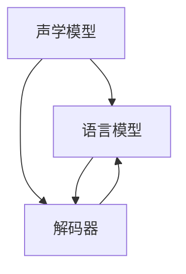

                 

## 1. 背景介绍

### 1.1 问题由来
语音识别技术（Automatic Speech Recognition, ASR）旨在将人类语音转换成文本，是实现人机交互的重要手段。自20世纪50年代以来，语音识别技术经历了从传统模拟信号处理到现代数字信号处理、从基于模板匹配到基于统计模型的演变。特别是近年来，基于深度学习的端到端语音识别模型（End-to-End Speech Recognition Models）不断刷新性能极限，推动了语音识别技术的飞速发展。

### 1.2 问题核心关键点
语音识别技术是计算机科学、信号处理、机器学习等多学科交叉的前沿领域。其核心挑战包括：
- 噪声抑制：处理各种环境下的噪声，如背景声、风噪、人为干扰等。
- 语义理解：区分同音词、多义词，正确识别出语音中的语义信息。
- 端到端建模：将声学特征映射到文本，避免人工提取特征和手工设计声学模型的繁琐步骤。
- 实时性要求：实时语音流需要高效、低延迟的识别引擎。
- 用户个性化：不同用户的语音特征差异显著，模型需具备一定的可适配性。

这些关键问题驱动了语音识别技术的研究和实践不断向前发展，推动了其在智能家居、车载导航、客服系统、医疗诊断等众多应用场景的落地。

### 1.3 问题研究意义
研究语音识别技术对于推动智能交互、促进社会信息化具有重要意义：
- 提升用户体验：语音识别技术使得人机交互更加自然高效，提升了用户体验。
- 解放人力资源：自动语音识别可以解放人力资源，应用于客服、翻译、记录等场景。
- 推动产业升级：语音技术在医疗、金融、交通等领域的应用，助力产业数字化转型。
- 助力AI普及：语音识别是人工智能技术落地应用的重要基石，推动了人工智能的普及。

## 2. 核心概念与联系

### 2.1 核心概念概述

语音识别技术通过将语音信号转化为文本，使得计算机能够理解和处理人类语言。其核心流程包括：

- **声学模型（Acoustic Model）**：负责将语音信号转化为声学特征，即通过捕捉语音信号的频谱、能量等特征，建立声学模型。
- **语言模型（Language Model）**：用于处理语音信号中的语义信息，通过预测文本序列的概率，生成文本输出。
- **解码器（Decoder）**：基于声学模型和语言模型，生成文本序列。

这些核心组件通过深度学习模型协同工作，共同完成语音识别任务。

### 2.2 核心概念联系

语音识别技术的核心组件通过以下方式协同工作：



- **声学模型**通过捕捉语音信号的声学特征，将语音转化为可处理的信号。
- **语言模型**则负责对声学特征序列进行语义处理，生成文本输出。
- **解码器**通过声学模型和语言模型，生成最终的文本序列。

这些组件之间的联系通过深度学习模型实现。声学模型和语言模型通常使用循环神经网络（RNN）或卷积神经网络（CNN）进行建模，解码器则常使用解码器网络或CTC（Connectionist Temporal Classification）等技术。

## 3. 核心算法原理 & 具体操作步骤
### 3.1 算法原理概述

语音识别技术的核心算法原理主要基于深度学习和统计学原理。其核心流程如下：

1. **特征提取**：将语音信号转化为频谱图、梅尔倒谱系数（MFCCs）等声学特征。
2. **声学建模**：通过深度神经网络（如RNN、CNN、Transformer等）建立声学模型，用于捕捉语音信号的特征。
3. **语言建模**：利用N-gram模型、循环神经网络（RNN）、Transformer等技术，建立语言模型，用于预测文本序列。
4. **端到端建模**：直接使用深度神经网络进行声学特征到文本序列的映射，无需手工设计声学模型。

### 3.2 算法步骤详解

语音识别技术的核心算法步骤如下：

**Step 1: 数据预处理**
- 数据收集：收集大量语音数据和相应的文本数据。
- 数据清洗：去除噪声、去除静音、归一化语音信号等。
- 数据标注：对语音数据进行人工标注，生成对应的文本。

**Step 2: 特征提取**
- 时域信号转换：将语音信号从时域转换到频域，如通过快速傅里叶变换（FFT）。
- 频谱特征提取：计算频谱图、MFCCs等声学特征。

**Step 3: 声学建模**
- 声学模型训练：使用深度神经网络（如RNN、CNN、Transformer等）对声学模型进行训练。
- 模型验证：在验证集上评估声学模型的性能。
- 模型保存：将训练好的声学模型保存，以备后续使用。

**Step 4: 语言建模**
- 语言模型训练：使用N-gram模型、RNN、Transformer等技术对语言模型进行训练。
- 模型验证：在验证集上评估语言模型的性能。
- 模型保存：将训练好的语言模型保存，以备后续使用。

**Step 5: 解码器设计**
- 解码器选择：选择合适的解码器网络，如Beam Search、CTC Decoding等。
- 解码器训练：对解码器进行训练，确保其能够正确生成文本序列。

**Step 6: 端到端建模**
- 模型训练：使用深度神经网络对端到端模型进行训练。
- 模型验证：在验证集上评估端到端模型的性能。
- 模型保存：将训练好的端到端模型保存，以备后续使用。

### 3.3 算法优缺点

语音识别技术的核心算法具有以下优点：
- 高精度：深度学习模型通过大量数据训练，可以捕获复杂的语音特征和语义信息。
- 端到端：直接从声学信号到文本序列的映射，减少了手工设计声学模型的繁琐步骤。
- 可扩展性：深度学习模型可以通过堆叠更多层，提高识别精度和泛化能力。

同时，也存在一些缺点：
- 数据需求大：高质量语音数据和文本数据是深度学习模型的基础，数据标注成本高。
- 计算资源需求高：深度学习模型需要强大的计算资源进行训练和推理。
- 鲁棒性不足：在噪声环境或口音差异大的情况下，识别性能可能下降。
- 解释性不足：深度学习模型通常被视为"黑盒"，难以解释其内部工作机制。

### 3.4 算法应用领域

语音识别技术在多个领域得到了广泛应用，例如：

- 智能家居：语音控制家电、调整室内环境。
- 车载导航：语音输入目的地、调整导航设置。
- 客服系统：语音识别客户来电，自动转接或回拨。
- 医疗诊断：语音记录病史、辅助医生诊疗。
- 教育培训：语音识别学生回答问题，评估学习效果。
- 语音翻译：实时语音翻译，辅助语言交流。
- 信息检索：语音搜索文档、音乐、视频等。

此外，语音识别技术还在安防、交通、娱乐等众多领域得到了应用，成为推动智能化社会的重要技术手段。

## 4. 数学模型和公式 & 详细讲解 & 举例说明

### 4.1 数学模型构建

语音识别技术的主要数学模型包括：

- **声学模型**：使用深度神经网络对语音信号进行建模。
- **语言模型**：使用N-gram模型或循环神经网络对文本序列进行建模。
- **端到端模型**：使用深度神经网络直接将声学特征映射到文本序列。

### 4.2 公式推导过程

以最简单的CTC模型为例，推导其基本公式：

假设声学模型输出序列为 $Y$，文本序列为 $X$，目标文本序列为 $T$，则CTC模型的目标函数为：

$$
\mathcal{L} = -\log P(T|Y)
$$

其中 $P(T|Y)$ 表示在声学模型输出 $Y$ 的情况下，文本序列 $T$ 出现的概率。CTC模型的核心思想是通过解码器 $T$，在声学模型 $Y$ 的输出中寻找最接近的文本序列。

### 4.3 案例分析与讲解

以百度AISpeech模型为例，其采用了Transformer模型进行声学建模，利用CTC作为解码器，训练端到端模型。具体步骤如下：

1. **数据预处理**：将语音信号转换为MFCCs特征，并生成文本标注。
2. **声学模型训练**：使用Transformer模型对声学模型进行训练，学习频谱图和MFCCs的映射关系。
3. **语言模型训练**：使用RNN或Transformer对语言模型进行训练，学习文本序列的概率分布。
4. **端到端模型训练**：使用Transformer模型直接对声学特征和文本序列进行映射，学习两者之间的映射关系。
5. **模型验证**：在验证集上评估模型性能，调整超参数。
6. **模型保存**：保存训练好的模型，用于实际识别任务。

## 5. 项目实践：代码实例和详细解释说明
### 5.1 开发环境搭建

在开发语音识别系统前，需要搭建相应的开发环境。以下是基本的Python开发环境配置步骤：

1. 安装Python：从官网下载安装最新版本的Python。
2. 安装TensorFlow或PyTorch：使用pip安装相应的深度学习框架。
3. 安装Numpy、Pandas、Matplotlib等工具包：用于数据处理和可视化。
4. 安装百度AISpeech模型库：通过pip安装百度官方提供的语音识别模型库。

### 5.2 源代码详细实现

以下是使用百度AISpeech模型进行语音识别的示例代码：

```python
import aispeech
import numpy as np

# 加载模型
model = aispeech.load_model('model.zip')

# 加载音频文件
audio_file = 'audio.wav'
wav_data = aispeech.load_wav(audio_file)

# 预处理音频数据
wav_data = aispeech.augment_and_preprocess(wav_data)

# 进行语音识别
results = model.infer(audio_data)

# 解析识别结果
for result in results:
    text = result['text']
    confidence = result['confidence']
    print(f'识别结果：{text}，置信度：{confidence}')
```

这段代码通过百度AISpeech模型库，加载模型、加载音频文件、预处理音频数据、进行语音识别、解析识别结果等步骤，完成了语音识别的基本流程。

### 5.3 代码解读与分析

在上述代码中，`aispeech.load_model`函数用于加载预训练的语音识别模型。`aispeech.load_wav`函数用于加载音频文件，并返回音频数据。`aispeech.augment_and_preprocess`函数用于对音频数据进行增强和预处理，包括去噪、归一化等操作。`model.infer`函数用于进行语音识别，返回识别结果和置信度。

代码的核心在于音频数据的预处理和模型的调用。通过预处理函数，对音频数据进行增强和归一化，可以提高模型的鲁棒性和识别精度。通过调用模型函数进行识别，获取识别结果和置信度，可以进一步分析识别结果的可靠性。

### 5.4 运行结果展示

在实际运行上述代码后，将得到识别结果和对应的置信度。例如，识别结果可能为“你好，百度”，置信度为0.95，表示模型对这一结果的识别结果高度自信。

## 6. 实际应用场景
### 6.1 智能家居

智能家居系统通过语音识别技术，实现语音控制家电、调整室内环境等功能。用户只需简单说出指令，如“打开电视”、“调节温度”，即可实现自动化操作。这极大提升了用户的便利性和生活舒适度。

### 6.2 车载导航

车载导航系统利用语音识别技术，实现语音输入目的地、调整导航设置等功能。用户在驾驶过程中，可以通过语音命令进行操作，避免了手动操作带来的安全隐患。

### 6.3 客服系统

客服系统通过语音识别技术，自动识别客户来电，自动转接或回拨。这大幅提升了客服效率，减少了人力成本。同时，通过语音识别技术，客户还可以进行语音反馈，提高客户满意度。

### 6.4 医疗诊断

医疗诊断系统利用语音识别技术，记录病史、辅助医生诊疗。医生可以通过语音识别技术，快速获取患者的病情描述，提高诊疗效率和准确性。

### 6.5 教育培训

教育培训系统利用语音识别技术，记录学生回答问题，评估学习效果。通过语音识别技术，系统可以实时获取学生的语音输入，并自动分析其回答的正确性和深度。

### 6.6 语音翻译

语音翻译系统利用语音识别技术，实现实时语音翻译，辅助语言交流。用户只需简单说出需要翻译的内容，即可得到目标语言的翻译结果。

### 6.7 信息检索

信息检索系统利用语音识别技术，语音搜索文档、音乐、视频等。用户可以通过语音命令，快速找到需要的信息，提升搜索效率。

## 7. 工具和资源推荐
### 7.1 学习资源推荐

1. **《深度学习》课程**：斯坦福大学提供的深度学习课程，涵盖了深度学习的基础理论和实践技能。
2. **百度AISpeech模型库**：百度官方提供的语音识别模型库，包含大量预训练模型和实用工具。
3. **PyTorch官方文档**：PyTorch官方文档，详细介绍了深度学习框架的使用方法和实践技巧。
4. **NLP书籍**：《自然语言处理综论》、《Speech and Language Processing》等经典书籍，系统讲解了NLP技术的理论和实践。
5. **Kaggle竞赛**：参加Kaggle语音识别竞赛，可以实践和提升语音识别技能。

### 7.2 开发工具推荐

1. **TensorFlow**：由Google开发的深度学习框架，提供了强大的模型构建和训练功能。
2. **PyTorch**：由Facebook开发的深度学习框架，提供了灵活的模型构建和高效计算能力。
3. **百度AISpeech模型库**：百度官方提供的语音识别模型库，包含大量预训练模型和实用工具。
4. **Wavesurfer**：音频信号处理工具，支持音频信号的读取、分析和可视化。
5. **librosa**：音频处理库，支持音频信号的特征提取、时频分析等操作。

### 7.3 相关论文推荐

1. **《端到端深度学习在语音识别中的应用》**：详细介绍了端到端语音识别模型的构建和训练方法。
2. **《CTC: A Simple Neural Network Model for Sequence Prediction》**：CTC算法的详细推导和应用实例。
3. **《Transformer模型在语音识别中的应用》**：Transformer模型在语音识别中的应用，包括声学建模和端到端建模。
4. **《深度学习在自然语言处理中的应用》**：深度学习在自然语言处理中的应用，包括语音识别、文本分类、机器翻译等。

## 8. 总结：未来发展趋势与挑战

### 8.1 总结

本文对语音识别技术进行了系统介绍，从信号处理到深度学习，详细讲解了语音识别的核心算法和操作步骤。通过实例代码和案例分析，帮助读者更好地理解语音识别技术的原理和实践。

语音识别技术是推动智能化社会的重要技术手段，其在智能家居、车载导航、客服系统、医疗诊断等领域得到了广泛应用。未来的发展将进一步提升识别精度、增强鲁棒性和可扩展性，推动语音识别技术在更多领域的应用。

### 8.2 未来发展趋势

语音识别技术的未来发展趋势包括：

1. **模型规模增大**：随着计算资源和数据资源的不断丰富，语音识别模型的规模将不断增大，捕捉更丰富的语音特征和语义信息。
2. **端到端模型优化**：通过改进网络结构、引入注意力机制等方法，提升端到端模型的识别精度和鲁棒性。
3. **多模态融合**：将语音识别与图像、视频等模态信息结合，提高识别系统的整体性能。
4. **隐私保护**：采用差分隐私、联邦学习等技术，保护用户隐私，增强系统的安全性和可靠性。
5. **实时性优化**：通过优化模型结构、改进解码算法等方法，提高语音识别的实时性和响应速度。

这些趋势将进一步推动语音识别技术的进步，提升其在智能交互、信息处理等领域的应用效果。

### 8.3 面临的挑战

语音识别技术在未来的发展过程中，仍面临一些挑战：

1. **数据标注成本高**：高质量语音数据的获取和标注需要耗费大量时间和资源。
2. **噪声抑制不足**：在复杂噪声环境下，语音识别系统的鲁棒性仍需进一步提升。
3. **计算资源需求大**：深度学习模型的训练和推理需要强大的计算资源，成本较高。
4. **可解释性不足**：语音识别系统的内部工作机制难以解释，难以满足高风险应用的需求。
5. **隐私保护问题**：语音识别系统需保护用户隐私，避免数据泄露和滥用。

### 8.4 研究展望

未来，语音识别技术的研究将更加注重以下几个方向：

1. **多模态融合**：将语音识别与其他模态信息结合，提高系统的整体性能。
2. **隐私保护**：采用差分隐私、联邦学习等技术，保护用户隐私，增强系统的安全性和可靠性。
3. **实时性优化**：通过优化模型结构、改进解码算法等方法，提高语音识别的实时性和响应速度。
4. **个性化适配**：针对不同用户的语音特征，设计可适配的识别系统，提升用户体验。
5. **低资源设备适配**：在资源受限的设备上实现高效、低延迟的语音识别，拓展应用场景。

这些研究方向将推动语音识别技术的进一步发展，提升其在智能交互、信息处理等领域的应用效果，为构建更加智能和便捷的社会做出贡献。

## 9. 附录：常见问题与解答

### Q1：语音识别系统如何处理噪声干扰？

A：语音识别系统通过以下方式处理噪声干扰：
1. 噪声抑制算法：如基于短时能量、频谱子带处理的谱减法，利用麦克风阵列进行空间滤波等。
2. 信号增强算法：如短时傅里叶变换（STFT）、小波变换等，对信号进行增强和去噪。
3. 模型自适应：通过自适应滤波器、神经网络等方法，适应不同的噪声环境，提升鲁棒性。

### Q2：语音识别系统如何处理口音差异？

A：语音识别系统通过以下方式处理口音差异：
1. 多样性数据集：收集不同口音和方言的语音数据，建立多样性数据集，提升模型的泛化能力。
2. 多说话人模型：使用多说话人模型，捕捉不同说话人的语音特征，提高系统的鲁棒性。
3. 自适应学习：通过自适应学习算法，动态调整模型参数，适应不同的口音和方言。

### Q3：语音识别系统的识别精度如何提升？

A：语音识别系统的识别精度可以通过以下方式提升：
1. 数据增强：通过回译、混杂等方式，丰富训练集的多样性，提升模型的鲁棒性。
2. 模型优化：通过优化网络结构、引入注意力机制等方法，提升模型的识别精度和鲁棒性。
3. 超参数调优：通过调整学习率、批次大小等超参数，优化模型性能。

### Q4：语音识别系统如何进行实时识别？

A：语音识别系统通过以下方式进行实时识别：
1. 轻量化模型：使用轻量化模型，减少模型参数和计算资源需求。
2. 高效解码算法：使用高效的解码算法，如束搜索（Beam Search）、动态规划（Dynamic Programming）等，提高识别速度。
3. 分布式计算：通过分布式计算框架，将计算任务分解到多个设备上，提升识别效率。

### Q5：语音识别系统如何进行个性化适配？

A：语音识别系统进行个性化适配可以通过以下方式：
1. 多说话人模型：使用多说话人模型，捕捉不同说话人的语音特征，提高系统的鲁棒性。
2. 个性化训练：根据用户的语音特征，进行个性化训练，生成适配用户的模型。
3. 反馈机制：通过用户反馈，动态调整模型参数，提升识别精度。

本文通过系统介绍语音识别技术的原理和实践，希望为读者提供全面的技术指引。未来，语音识别技术将在更多领域得到应用，为智能社会的发展做出贡献。

