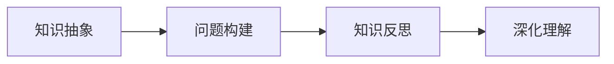

                 

# 费曼提问法:开启管理者思维升级

费曼，这个名字在物理学界如雷贯耳，然而他的一生并非只贡献于科学，在教学与思维训练上也有独到的见解。费曼提问法就是他对教学与学习的反思。方法论影响了后世无数的学者，是认知心理学的奠基之一。而在管理学中，费曼提问法同样能够带来深远的思考。

## 1. 背景介绍

费曼（Richard Feynman），著名的物理学家、诺贝尔奖得主，他不仅在科学领域有着非凡的成就，更在教育领域留下深刻的痕迹。费曼强调知识的理解和应用，认为真正的学习应该是主动地、深入地理解和掌握知识，而非被动地、机械地记忆。

费曼提问法是一种学习与教学方法，它强调利用问题引导思考，帮助学习者深入理解概念。这种方法最初来源于费曼对物理学教学的反思，后来广泛应用于各类学科教学，尤其在科学教育中，它帮助学生从理解现象的表层，深入到掌握理论的层次。

## 2. 核心概念与联系

### 2.1 核心概念概述

费曼提问法以费曼本人在教学和研究中使用的提问方式为原型，是一种通过提问和回答来深化理解的教学与学习策略。它由三个关键步骤构成：
1. **问题构建**：将知识点抽象为问题，促使学习者主动思考。
2. **知识反思**：通过回答问题的过程，反思已有知识是否充分，是否能够解决当前问题。
3. **深化理解**：在反思的基础上，进一步学习新的知识，完善自己的理解。

这种提问方法的核心在于：问题导向，强调主动性和反思性。

### 2.2 核心概念原理和架构的 Mermaid 流程图

这种架构清晰地展示了费曼提问法的核心流程，从知识的抽象到问题的构建，再到反思与深化，形成了完整的学习闭环。

## 3. 核心算法原理 & 具体操作步骤

### 3.1 算法原理概述

费曼提问法的原理主要基于认知负荷理论，即人类记忆和思维受限于认知资源的有限性，需要策略性地分配和利用认知资源，以提高学习效率。通过提问和回答的方式，可以引导学习者集中注意力，主动地投入思考，从而提升学习效果。

具体到管理领域，费曼提问法可以帮助管理者：
1. **提高问题解决能力**：通过构建问题，引导员工深入理解问题本质。
2. **促进知识共享**：通过回答问题，使知识在团队内部得到传播和应用。
3. **强化学习动机**：通过互动，激发员工的求知欲和成就动机。
4. **优化决策过程**：通过问题导向，使决策过程更加系统和有序。

### 3.2 算法步骤详解

#### 3.2.1 问题构建

1. **知识定位**：首先明确需要学习的知识点。如项目管理中的风险管理，或产品开发中的需求分析。
2. **问题抽象**：将知识点抽象为具体问题。如“如何识别项目的主要风险？”或“如何获取用户的关键需求？”
3. **问题细化**：将问题细分为小问题，便于逐步解答。如针对“如何识别项目风险”，可以细化为“如何识别技术风险？”“如何识别市场风险？”等。

#### 3.2.2 知识反思

1. **自问自答**：每个小问题由团队成员独立回答，并记录下自己的思考过程和答案。
2. **交流讨论**：将答案分享给其他成员，并开放讨论，通过讨论发现理解不足和认知盲点。
3. **反馈修正**：根据反馈修正自己的答案，或提出新的问题，进一步深化理解。

#### 3.2.3 深化理解

1. **寻找答案**：针对存在的问题，进一步学习相关的理论知识或案例研究。
2. **实践应用**：将新知识应用到实际工作中，验证和巩固理解。
3. **迭代更新**：不断进行反思和深化，使知识更加系统化和全面化。

### 3.3 算法优缺点

#### 3.3.1 优点

1. **主动性**：通过提问，激发学习者的主动思考，减少被动接受。
2. **系统性**：问题导向，有助于系统地掌握知识，避免零碎和片面。
3. **反思性**：通过反思，不断修正和深化理解，提高学习效果。
4. **互动性**：通过讨论和反馈，促进知识共享和团队协作。

#### 3.3.2 缺点

1. **时间成本**：问题构建和讨论需要较多时间，可能会影响工作进度。
2. **难度控制**：问题设计难度须适中，避免过于复杂或过于简单。
3. **参与度**：需要确保所有成员都能积极参与，否则效果大打折扣。

### 3.4 算法应用领域

费曼提问法在多个领域都有应用，尤其在科学教育、工程管理、产品开发和团队建设中，帮助管理者更系统地思考和解决问题。

## 4. 数学模型和公式 & 详细讲解 & 举例说明

### 4.1 数学模型构建

费曼提问法主要关注问题构建和知识反思的过程，并不涉及具体的数学模型。但可以类比心理学中的认知负荷模型，来理解其原理。

**认知负荷模型**：
$$
C = M + P + K
$$

其中，$C$表示总认知负荷，$M$表示处理新信息所需的认知负荷，$P$表示处理已有信息所需的认知负荷，$K$表示执行任务所需的认知负荷。

通过提问和反思，管理者的认知负荷分布在处理新信息和已有信息上，从而提高了学习效率和效果。

### 4.2 公式推导过程

在项目管理中的风险识别问题为例，可以构建以下问题链：

1. **问题1**：如何识别项目的主要风险？
2. **问题2**：项目的主要风险包括哪些类型？
3. **问题3**：如何识别技术风险？
4. **问题4**：如何识别市场风险？

通过对每个小问题的逐步解答和反思，团队成员可以逐步掌握风险识别的知识和技能。

### 4.3 案例分析与讲解

在产品开发中，设计团队可以使用费曼提问法来提升对用户需求的理解。具体步骤如下：

1. **问题构建**：如何获取用户的关键需求？
2. **知识反思**：团队成员分别回答自己获取需求的方法和思路。
3. **深化理解**：通过对比和讨论，进一步完善获取需求的方法。

最终，团队能够系统地理解用户需求，提升产品的竞争力。

## 5. 项目实践：代码实例和详细解释说明

由于费曼提问法是一种思想方法而非具体的技术实现，因此没有代码实例。但我们可以用它来指导项目管理的实践，以下是一个项目管理中的实际应用示例。

**项目风险识别**：

1. **问题构建**：
   - 如何识别项目的主要风险？
   - 项目的主要风险包括哪些类型？
   - 如何识别技术风险？
   - 如何识别市场风险？

2. **知识反思**：
   - 每位成员独立回答每个小问题，并记录下来。
   - 团队内部讨论每个答案，提出问题或建议。

3. **深化理解**：
   - 收集并整理所有答案和讨论结果，形成风险识别报告。
   - 根据报告中的不足，进一步学习和提升风险识别技能。

通过这种过程，团队可以系统地识别项目风险，提升项目的成功率。

## 6. 实际应用场景

### 6.1 企业管理培训

在企业内部培训中，可以使用费曼提问法来帮助员工系统地掌握新知识和技能。如在IT部门进行项目管理培训时，可以构建以下问题：

1. **问题1**：项目管理的基本流程是什么？
2. **问题2**：项目管理的常见工具有哪些？
3. **问题3**：如何制定项目计划？
4. **问题4**：如何监控项目进度？

通过这些问题，员工能够系统地掌握项目管理的基础知识和实践技能。

### 6.2 产品开发团队协作

在产品开发中，团队成员可以围绕需求分析、功能设计、技术实现等环节构建问题，并通过反思和讨论深化理解。如在构建一个新功能时，可以构建以下问题：

1. **问题1**：如何理解用户需求？
2. **问题2**：该功能有哪些关键点？
3. **问题3**：该功能的技术难点有哪些？
4. **问题4**：该功能如何与其他模块交互？

通过这些问题，团队能够系统地理解新功能的各个方面，提高开发效率和质量。

### 6.3 跨部门沟通

在跨部门协作中，费曼提问法可以帮助各部门的沟通更加系统化和深入化。如在市场部和产品部沟通时，可以构建以下问题：

1. **问题1**：产品的核心价值是什么？
2. **问题2**：市场需求的主要变化趋势是什么？
3. **问题3**：如何设计产品的定价策略？
4. **问题4**：如何提高产品的用户粘性？

通过这些问题，各部门能够系统地理解对方的需求和关注点，促进协作。

### 6.4 未来应用展望

费曼提问法作为思维工具，在未来将有更广泛的应用前景。随着组织结构和业务形态的不断变化，对于系统的思维和问题解决能力的要求将越来越高。费曼提问法能够帮助管理者系统地思考和解决问题，适应复杂多变的管理环境。

## 7. 工具和资源推荐

### 7.1 学习资源推荐

1. **《费曼学习法》**：这是一本介绍费曼学习法的经典书籍，详细讲解了费曼提问法的基本原理和应用方法。
2. **《深度工作》**：在书中，作者提出了一种高效的思维方法，强调主动思考和系统性思维，对费曼提问法有深入的讲解。
3. **在线课程**：Coursera、edX等平台上有许多关于学习方法和认知心理学的课程，可以系统地了解费曼提问法。

### 7.2 开发工具推荐

1. **思维导图软件**：如MindManager、XMind等，可以帮助管理者构建和整理问题链。
2. **项目管理工具**：如Jira、Trello等，可以帮助团队系统地跟踪和执行问题的解答。
3. **协作工具**：如Slack、Microsoft Teams等，可以促进团队成员之间的互动和讨论。

### 7.3 相关论文推荐

1. **《费曼学习法：一个全面系统的方法》**：详细讲解了费曼学习法的基本原理和应用案例。
2. **《费曼教学法的心理学原理》**：从心理学的角度探讨了费曼教学法的设计原理和方法。
3. **《费曼提问法在管理中的应用》**：介绍了费曼提问法在企业管理中的具体应用案例和效果。

## 8. 总结：未来发展趋势与挑战

### 8.1 研究成果总结

费曼提问法作为一种基于问题导向的思维方法，已经广泛应用于科学教育、工程管理等多个领域，帮助学习者和管理者系统地思考和解决问题。它在提升学习效率、促进知识共享、强化学习动机、优化决策过程等方面有显著效果。

### 8.2 未来发展趋势

1. **技术融合**：费曼提问法可以与AI、大数据等技术结合，提高问题构建和知识反思的效率。
2. **跨领域应用**：费曼提问法不仅可以应用于管理领域，还可以扩展到教育、医疗、金融等多个领域。
3. **智能化提升**：通过算法和数据驱动，自动构建和优化问题链，提升问题解决的效果。
4. **社区化协作**：建立费曼提问法社区，共享问题和解决方案，促进跨组织和跨团队的协作。

### 8.3 面临的挑战

1. **问题设计难度**：如何设计高质量、难度适中的问题链，是费曼提问法应用的关键。
2. **参与度**：如何激励团队成员积极参与，避免形式主义。
3. **反馈机制**：如何建立有效的反馈机制，确保问题的解答和反思能够产生实际效果。
4. **时间管理**：如何在保证效果的前提下，合理分配时间，避免过度占用工作时间。

### 8.4 研究展望

1. **算法优化**：开发自动构建问题链的算法，提升问题构建的效率和质量。
2. **工具创新**：开发智能化的提问和反思工具，提升工具的易用性和智能化水平。
3. **跨学科应用**：将费曼提问法与其他学科的知识和方法结合，形成综合性的解决方案。
4. **用户体验**：关注用户的使用体验，提升工具的互动性和反馈性。

## 9. 附录：常见问题与解答

**Q1: 费曼提问法是否适用于所有领域的项目管理？**

A: 费曼提问法是一种通用的思维工具，适用于任何领域的项目管理。但具体应用时，需要结合项目的特点和需求，设计合适的问题链。例如，在软件开发中，可以构建关于代码编写、测试、集成等方面的问题链。

**Q2: 如何设计高质量的问题链？**

A: 设计高质量的问题链需要考虑以下原则：
1. **系统性**：问题应覆盖项目的各个环节和方面。
2. **层次性**：问题应由浅入深，从具体到抽象。
3. **可操作性**：问题应能引导学习者进行深入思考和实践。
4. **互动性**：问题应设计为团队讨论和反思的起点。

**Q3: 费曼提问法是否需要大量时间和精力？**

A: 费曼提问法的确需要较多的时间和精力，但它是系统思考和深度学习的重要工具。如果能够合理安排时间，效果会远超传统培训方法。

**Q4: 如何激励团队成员积极参与？**

A: 可以通过以下方式激励团队成员：
1. **设定目标**：明确学习目标和反馈机制。
2. **提供奖励**：对积极参与和有贡献的成员给予奖励。
3. **建立文化**：在团队内部建立学习和反思的文化，形成共同的学习氛围。

**Q5: 如何平衡问题构建和实际工作？**

A: 可以通过以下方式平衡：
1. **分段实施**：将问题构建和实际工作分开进行，确保不影响工作进度。
2. **小步快跑**：采用小步快跑的策略，逐步推进问题构建和反思。
3. **灵活调整**：根据实际情况灵活调整时间分配，确保效果。

---

作者：禅与计算机程序设计艺术 / Zen and the Art of Computer Programming

