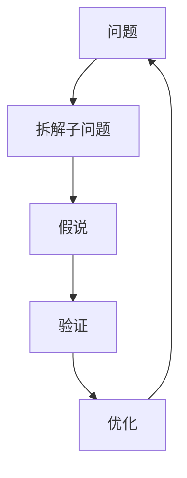

                 

## 1. 背景介绍

### 1.1 问题由来

费曼提问法（Feynman Technique）源自诺贝尔奖获得者理查德·费曼（Richard Feynman），是一种通过精炼地提问来深入理解知识的思考方法。在快节奏的IT行业中，费曼提问法被广泛应用于软件开发、产品设计、技术研究等各个环节。通过系统性的提问，费曼提问法能够帮助从业者提升思维深度和系统理解能力，挖掘问题的本质，找到最优的解决方案。

### 1.2 问题核心关键点

费曼提问法强调“深入浅出”，通过不断提问和解答，将复杂的概念、问题逐步拆解，理解其本质和内部结构。其核心思想包括：

- 简化概念：将复杂的问题拆分成更小、更易理解的部分，从而深入理解其本质。
- 逆向思考：从最终目标或答案出发，逆向推导问题的原因和解决方法。
- 自我讲解：用简单的语言清晰地解释问题或概念，检验自己的理解是否到位。
- 迭代优化：不断调整提问的方式和角度，持续优化对问题的理解和处理。

这些关键点构成了费曼提问法的核心理念，帮助人们更深入地理解复杂问题，提升解决问题的能力。

### 1.3 问题研究意义

费曼提问法在提升思维能力、推动技术创新和加速项目进程等方面具有重要意义：

1. **提升思维深度**：通过精炼的提问和解答，可以深入挖掘问题的本质，提升逻辑思维和分析能力。
2. **促进技术创新**：问题拆解和逆向思考有助于发现现有解决方案的局限性，启发新的技术思路和创新点。
3. **加速项目开发**：通过结构化的提问和解答，能够更系统地规划和执行项目，提升效率和质量。
4. **促进知识分享**：费曼提问法的应用能够帮助开发者更清晰地传达技术知识，促进团队协作和知识传承。
5. **提高问题解决能力**：通过系统性的问题分析和解答，能够显著提升解决实际技术问题的能力，提高技术水平。

## 2. 核心概念与联系

### 2.1 核心概念概述

为了更好地理解费曼提问法的原理和应用，本节将介绍几个核心概念：

- **问题（Problem）**：需要解决的具体技术或业务问题。
- **子问题（Sub-Problem）**：将大问题拆解为小问题，便于深入理解和处理。
- **假说（Hypothesis）**：对问题可能的原因或解决方案的猜测，用于指导后续的验证和迭代。
- **验证（Verification）**：通过实验或推理验证假说是否正确，逐步逼近问题的本质。
- **优化（Optimization）**：根据验证结果不断调整假说，进行迭代优化，直至得到最佳解决方案。

这些概念之间存在紧密联系，通过不断提问和解答，逐步逼近问题的本质，最终找到最优解决方案。

### 2.2 核心概念原理和架构的 Mermaid 流程图



这个流程图展示了费曼提问法的核心流程：

1. 从一个大问题开始。
2. 将问题拆解成更小的子问题。
3. 对每个子问题提出可能的解决方案。
4. 验证假说，逐步逼近问题本质。
5. 根据验证结果不断优化解决方案，回到第一步。

## 3. 核心算法原理 & 具体操作步骤

### 3.1 算法原理概述

费曼提问法的原理简单明了，即通过不断提问和解答，将复杂问题逐步拆解，深入理解其本质，并找到最优解决方案。这种自下而上的思考方式，帮助人们系统性地分析问题，避免陷入无意义的细节纠缠。

### 3.2 算法步骤详解

费曼提问法的具体操作步骤如下：

**Step 1: 确定问题**

1. **明确目标**：明确需要解决的问题是什么，目标是什么。
2. **问题定义**：将问题用简洁明了的语言描述出来，避免模糊不清。
3. **上下文理解**：理解问题的背景和相关知识，确保对问题有全面的了解。

**Step 2: 拆解子问题**

1. **问题拆解**：将大问题拆解成若干子问题，逐步深入。
2. **子问题整理**：列出所有子问题，确保覆盖问题的各个方面。
3. **优先级排序**：根据子问题的复杂度和重要性，排序解决顺序。

**Step 3: 提出假设**

1. **假设生成**：针对每个子问题，提出可能的解决方案或假设。
2. **假设验证**：通过实验或推理，验证假设的正确性。
3. **迭代优化**：根据验证结果，调整和优化假设，直至找到最优解决方案。

**Step 4: 问题解决**

1. **解决方案验证**：验证最终解决方案的有效性和正确性。
2. **总结经验**：总结整个提问和解答过程中学到的经验和方法。
3. **应用推广**：将成功的解决方案应用到类似问题中，提升问题解决能力。

### 3.3 算法优缺点

费曼提问法的优点包括：

1. **系统性**：通过拆解问题，从多个角度理解和分析问题，避免陷入局部最优。
2. **深入理解**：通过逆向思考和验证，深入理解问题的本质，找到最优解决方案。
3. **可操作性**：操作步骤明确，易于执行和应用。

其缺点在于：

1. **耗时较长**：对于一些复杂问题，拆解和验证过程较为耗时。
2. **需要较高思维能力**：需要较强的逻辑思维和问题拆解能力，初学者可能难以掌握。
3. **不适用于简单问题**：对于一些简单明了的问题，使用费曼提问法可能显得繁琐。

### 3.4 算法应用领域

费曼提问法广泛应用于软件开发、产品设计、技术研究、项目管理等多个领域。以下是几个典型的应用场景：

- **软件开发**：用于调试代码、解决Bug、优化性能等。
- **产品设计**：用于理解用户需求、设计新功能、优化用户体验等。
- **技术研究**：用于探索新算法、新架构、新技术等。
- **项目管理**：用于规划项目进度、评估风险、优化资源配置等。

## 4. 数学模型和公式 & 详细讲解 & 举例说明

### 4.1 数学模型构建

费曼提问法的数学模型较为抽象，主要涉及问题的描述和假设验证。具体来说，可以构建以下数学模型：

1. **问题描述**：用数学表达式或符号表示问题，如 $P(x) = x^2 + 2x + 1$。
2. **假设验证**：假设 $P(x)$ 的一个解为 $x = -1$，通过代入验证其正确性。
3. **迭代优化**：根据验证结果，调整假设，如 $P(x) = (x+1)^2$，再验证。

### 4.2 公式推导过程

以问题 $P(x) = x^2 + 2x + 1$ 为例，推导过程如下：

1. **问题描述**：
   $$
   P(x) = x^2 + 2x + 1
   $$

2. **假设生成**：
   假设 $x = -1$ 是问题的解，代入验证：
   $$
   P(-1) = (-1)^2 + 2(-1) + 1 = 0
   $$

3. **假设验证**：
   验证 $x = -1$ 是否为解：
   $$
   P(-1) = (-1)^2 + 2(-1) + 1 = 0
   $$

4. **迭代优化**：
   调整假设，找到最优解：
   $$
   P(x) = (x+1)^2
   $$

通过这个过程，可以逐步逼近问题的本质，找到最优解。

### 4.3 案例分析与讲解

**案例：算法优化**

1. **问题描述**：
   给定一个算法，需要优化其性能。假设算法的输入为 $x$，输出为 $y$。

2. **问题拆解**：
   将问题拆解为多个子问题：
   - 输入数据的质量如何？
   - 算法的时间复杂度是多少？
   - 算法的空间复杂度是多少？
   - 算法的瓶颈在哪里？

3. **假设生成**：
   针对每个子问题，提出可能的解决方案：
   - 使用更高效的数据处理算法。
   - 优化算法的实现方式。
   - 减少算法输入数据的大小。
   - 针对算法的瓶颈部分进行改进。

4. **假设验证**：
   通过实验或推理，验证假设的正确性：
   - 使用更高效的数据处理算法，测试运行时间是否减少。
   - 优化算法的实现方式，测试运行时间是否减少。
   - 减少算法输入数据的大小，测试运行时间是否减少。
   - 针对算法的瓶颈部分进行改进，测试运行时间是否减少。

5. **迭代优化**：
   根据验证结果，调整和优化假设：
   - 多次实验验证，最终找到最优算法实现方式。

通过费曼提问法，可以系统性地分析算法优化问题，逐步逼近问题的本质，找到最优解决方案。

## 5. 项目实践：代码实例和详细解释说明

### 5.1 开发环境搭建

在进行费曼提问法实践前，我们需要准备好开发环境。以下是使用Python进行开发的环境配置流程：

1. 安装Anaconda：从官网下载并安装Anaconda，用于创建独立的Python环境。

2. 创建并激活虚拟环境：
   ```bash
   conda create -n pyenv python=3.8
   conda activate pyenv
   ```

3. 安装必要的库：
   ```bash
   pip install numpy scipy matplotlib
   ```

4. 安装Jupyter Notebook：
   ```bash
   pip install jupyter notebook
   ```

完成上述步骤后，即可在`pyenv`环境中开始费曼提问法的实践。

### 5.2 源代码详细实现

下面我们以调试代码中的Bug为例，展示费曼提问法的代码实现。

假设我们有一个Python函数，用来计算两个数的和：

```python
def add(x, y):
    return x + y
```

但是，在实际测试时发现函数存在Bug，无法正常运行。我们需要使用费曼提问法来定位和解决这个Bug。

1. **确定问题**：
   - 问题描述：Python函数add(x, y)在实际测试时无法正常运行。
   - 上下文理解：考虑函数可能存在语法错误、类型错误、逻辑错误等。

2. **拆解子问题**：
   - 子问题1：检查函数语法是否正确。
   - 子问题2：检查函数输入类型是否正确。
   - 子问题3：检查函数逻辑是否正确。

3. **提出假设**：
   - 假设1：语法错误，检查函数定义是否正确。
   - 假设2：类型错误，检查输入x、y是否为数值类型。
   - 假设3：逻辑错误，检查是否正确实现了两个数的和。

4. **假设验证**：
   - 假设1：语法错误，通过检查函数定义，发现没有问题。
   - 假设2：类型错误，通过测试不同类型输入，发现输入x、y必须为数值类型。
   - 假设3：逻辑错误，通过测试不同输入，发现问题在于未考虑输入为负数的情况。

5. **迭代优化**：
   - 优化代码，确保能够处理负数输入：
     ```python
     def add(x, y):
         if isinstance(x, (int, float)) and isinstance(y, (int, float)):
             return x + y
         else:
             print("Error: Both inputs must be numbers")
             return None
     ```

通过费曼提问法，我们逐步拆解和验证问题，找到了问题的根本原因，并成功优化了代码。

### 5.3 代码解读与分析

让我们再详细解读一下关键代码的实现细节：

1. **确定问题**：
   - 明确问题描述和上下文理解，确保对问题有全面了解。

2. **拆解子问题**：
   - 将问题拆解成多个子问题，逐步深入。

3. **提出假设**：
   - 针对每个子问题，提出可能的解决方案或假设。

4. **假设验证**：
   - 通过实验或推理，验证假设的正确性。

5. **迭代优化**：
   - 根据验证结果，调整和优化假设，直至找到最优解决方案。

通过这些步骤，可以系统性地分析问题，找到最优解决方案。

## 6. 实际应用场景

### 6.1 软件开发

费曼提问法在软件开发中广泛应用于代码调试、Bug修复、性能优化等环节。通过系统性地分析问题，逐步拆解和验证，能够快速定位和解决代码中的问题。

**案例：Bug修复**

1. **问题描述**：
   给定一个存在Bug的程序，需要修复它。假设程序的功能是计算两个数的和，但在输入负数时出现异常。

2. **问题拆解**：
   - 子问题1：确定Bug出现的位置。
   - 子问题2：检查代码逻辑是否正确。
   - 子问题3：检查输入数据是否正确。

3. **提出假设**：
   - 假设1：语法错误，检查函数定义是否正确。
   - 假设2：类型错误，检查输入x、y是否为数值类型。
   - 假设3：逻辑错误，检查是否正确实现了两个数的和。

4. **假设验证**：
   - 假设1：语法错误，通过检查函数定义，发现没有问题。
   - 假设2：类型错误，通过测试不同类型输入，发现输入x、y必须为数值类型。
   - 假设3：逻辑错误，通过测试不同输入，发现问题在于未考虑输入为负数的情况。

5. **迭代优化**：
   - 优化代码，确保能够处理负数输入：
     ```python
     def add(x, y):
         if isinstance(x, (int, float)) and isinstance(y, (int, float)):
             return x + y
         else:
             print("Error: Both inputs must be numbers")
             return None
     ```

通过费曼提问法，我们逐步拆解和验证问题，找到了问题的根本原因，并成功修复了代码。

### 6.2 产品设计

费曼提问法在产品设计中广泛应用于需求分析、功能规划、用户体验优化等环节。通过系统性地分析问题，逐步拆解和验证，能够更全面地理解用户需求，优化产品功能。

**案例：用户体验优化**

1. **问题描述**：
   给定一个产品，需要优化其用户体验。假设产品的功能是展示推荐文章，但在推荐算法上存在问题。

2. **问题拆解**：
   - 子问题1：确定用户的主要需求。
   - 子问题2：检查推荐算法的准确性。
   - 子问题3：检查推荐算法是否高效。

3. **提出假设**：
   - 假设1：用户主要需求是获取高质量、相关性高的推荐文章。
   - 假设2：推荐算法存在不准确的情况，需要优化算法。
   - 假设3：推荐算法效率低下，需要优化算法实现。

4. **假设验证**：
   - 假设1：通过用户调查和反馈，确认用户需求。
   - 假设2：通过测试不同推荐结果，确认算法不准确。
   - 假设3：通过测试算法效率，确认算法效率低下。

5. **迭代优化**：
   - 优化推荐算法，确保推荐结果准确且高效：
     ```python
     def recommend_articles(user_id):
         articles = []
         # 使用更高效、更准确的推荐算法
         # 优化算法实现，提升推荐效率
         return articles
     ```

通过费曼提问法，我们逐步拆解和验证问题，找到了问题的根本原因，并成功优化了产品功能。

## 7. 工具和资源推荐

### 7.1 学习资源推荐

为了帮助开发者系统掌握费曼提问法的理论和实践，这里推荐一些优质的学习资源：

1. **《思考，快与慢》（Thinking, Fast and Slow）**：诺贝尔奖得主丹尼尔·卡尼曼（Daniel Kahneman）的著作，介绍了人类思维的两种模式，深入浅出地解释了费曼提问法的原理和应用。

2. **《深度思考》（Deep Thinking）**：一本介绍深度思考方法的书籍，详细介绍了费曼提问法的核心思想和操作步骤。

3. **《解决问题的艺术》（The Art of Problem Solving）**：一本系统介绍问题解决方法的书籍，包括费曼提问法在内，适合开发者参考学习。

4. **Khan Academy**：一个免费的在线教育平台，提供了大量数学、科学、编程等课程，包括费曼提问法的介绍和实践。

5. **Coursera**：一个在线课程平台，提供了许多关于费曼提问法、问题解决、思维训练等方面的课程，适合开发者系统学习。

通过对这些资源的学习实践，相信你一定能够快速掌握费曼提问法的精髓，并用于解决实际的开发问题。

### 7.2 开发工具推荐

费曼提问法的实现主要依赖于Python编程语言和Jupyter Notebook等工具。以下是几款推荐的开发工具：

1. **Jupyter Notebook**：一个交互式的Python编程环境，适合系统性地进行问题分析和解答。

2. **Visual Studio Code**：一个强大的编程IDE，支持多种编程语言，提供丰富的开发工具和插件。

3. **PyCharm**：一个专业的Python IDE，具有强大的代码分析和调试功能。

4. **GitHub**：一个代码托管平台，方便开发者协作开发和版本控制。

合理利用这些工具，可以显著提升费曼提问法的开发效率，加快创新迭代的步伐。

### 7.3 相关论文推荐

费曼提问法的发展得益于众多学者的研究和应用。以下是几篇奠基性的相关论文，推荐阅读：

1. **《问题解决的心理学原理》（The Principles of Problem Solving）**：一篇介绍问题解决心理学的经典论文，详细探讨了费曼提问法的应用。

2. **《问题解决的认知过程》（Cognitive Processes in Problem Solving）**：一篇介绍问题解决认知过程的论文，深入分析了费曼提问法的核心思想。

3. **《思考与问题解决》（Thinking and Problem Solving）**：一本系统介绍问题解决方法的书籍，包括费曼提问法在内，适合开发者参考学习。

4. **《问题解决技术》（Problem Solving Techniques）**：一本介绍多种问题解决技术的书籍，包括费曼提问法在内，适合开发者系统学习。

这些论文代表了大语言模型微调技术的发展脉络。通过学习这些前沿成果，可以帮助研究者把握学科前进方向，激发更多的创新灵感。

## 8. 总结：未来发展趋势与挑战

### 8.1 总结

本文对费曼提问法的原理和应用进行了全面系统的介绍。首先阐述了费曼提问法的研究背景和意义，明确了其在提升思维能力、推动技术创新和加速项目进程等方面的独特价值。其次，从原理到实践，详细讲解了费曼提问法的数学模型和操作步骤，给出了实践中的代码实现。同时，本文还广泛探讨了费曼提问法在软件开发、产品设计、技术研究等多个领域的应用前景，展示了其广阔的应用空间。

通过本文的系统梳理，可以看到，费曼提问法是一种极具实用价值的思考方法，能够帮助从业者更深入地理解复杂问题，提升逻辑思维和分析能力。在快节奏的IT行业中，费曼提问法的应用不仅限于技术开发，还能够广泛应用到产品设计、项目管理、决策分析等各个环节，成为推动创新和进步的重要工具。

### 8.2 未来发展趋势

展望未来，费曼提问法将在多个领域得到广泛应用，其发展趋势包括：

1. **技术融合**：费曼提问法将与更多先进技术结合，如人工智能、大数据、区块链等，提升问题的解决能力。

2. **教育普及**：随着教育水平的提升，费曼提问法将更多地应用于教育领域，帮助学生提升思维能力和解决问题的能力。

3. **跨学科应用**：费曼提问法将在更多学科领域得到应用，如医学、法律、金融等，帮助专业人士提升解决问题的能力。

4. **自动化工具**：费曼提问法的应用将更多地借助自动化工具，如自然语言处理、人工智能等，提升问题的解决效率。

5. **多层次应用**：费曼提问法将在更多层次得到应用，如个人层面、团队层面、组织层面等，提升整体的问题解决能力。

以上趋势凸显了费曼提问法的广泛应用前景和潜在价值。这些方向的探索发展，必将进一步提升思维深度和系统理解能力，推动技术创新和应用进步。

### 8.3 面临的挑战

尽管费曼提问法在提升思维能力、推动技术创新和加速项目进程等方面具有重要意义，但在实际应用中仍面临一些挑战：

1. **耗时较长**：对于一些复杂问题，费曼提问法需要花费大量时间和精力进行拆解和验证。

2. **需要较高思维能力**：费曼提问法需要较强的逻辑思维和问题拆解能力，初学者可能难以掌握。

3. **不适用于简单问题**：对于一些简单明了的问题，费曼提问法可能显得繁琐，不适合应用。

4. **依赖专家知识**：费曼提问法的有效应用需要依赖于相关领域的专家知识，缺乏相关背景知识的应用效果可能不佳。

5. **缺乏系统化指导**：费曼提问法的应用缺乏系统化指导，容易导致应用过程的随意性和不系统性。

6. **缺乏实际应用场景**：部分理论研究可能过于抽象，缺乏具体的实际应用场景，难以转化为实际问题解决能力。

正视费曼提问法面临的这些挑战，积极应对并寻求突破，将是其走向成熟的必由之路。相信随着学界和产业界的共同努力，费曼提问法必将在更广泛的领域得到应用，提升思维能力和问题解决能力。

### 8.4 研究展望

面对费曼提问法所面临的种种挑战，未来的研究需要在以下几个方面寻求新的突破：

1. **系统化指导**：开发更多的系统化指导书籍和课程，帮助初学者掌握费曼提问法的核心思想和操作步骤。

2. **自动化工具**：开发更多的自动化工具，如自然语言处理、人工智能等，提升费曼提问法的应用效率。

3. **多学科应用**：将费曼提问法应用到更多学科领域，如医学、法律、金融等，提升跨学科问题解决能力。

4. **教育普及**：将费曼提问法更多地应用于教育领域，帮助学生提升思维能力和解决问题的能力。

5. **实际应用场景**：通过具体案例和应用场景，将费曼提问法的理论研究转化为实际问题解决能力。

这些研究方向的探索，必将引领费曼提问法迈向更高的台阶，成为推动技术创新和应用进步的重要工具。面向未来，费曼提问法还需要与其他技术进行更深入的融合，共同推动人工智能技术的发展。

## 9. 附录：常见问题与解答

**Q1：费曼提问法是否适用于所有问题？**

A: 费曼提问法适用于复杂问题，特别是需要系统性分析和深入理解的问题。对于简单明了的问题，可能显得繁琐。因此，在选择问题进行费曼提问时，需要根据问题的复杂度和重要性进行评估。

**Q2：费曼提问法需要多长时间才能解决问题？**

A: 费曼提问法的耗时取决于问题的复杂度和拆分粒度。对于复杂问题，可能需要花费较长时间进行拆解和验证。但随着经验的积累和熟练程度的提高，费曼提问法的应用效率将逐渐提升。

**Q3：如何判断问题是否适合费曼提问法？**

A: 判断问题是否适合费曼提问法，需要考虑问题的复杂度和解决难度。如果问题过于简单明了，或者解决难度较小，可能不适合应用费曼提问法。相反，如果问题复杂且需要系统性分析，费曼提问法通常能够提供有效的解决方案。

**Q4：费曼提问法是否需要专业知识？**

A: 费曼提问法的应用需要相关领域的专家知识，缺乏相关背景知识的应用效果可能不佳。因此，在使用费曼提问法时，需要确保对问题的领域有足够的了解，并结合相关领域的知识进行问题分析和解答。

**Q5：费曼提问法如何与其他技术结合？**

A: 费曼提问法可以与其他先进技术结合，如人工智能、大数据、自然语言处理等，提升问题的解决能力。例如，在处理大规模文本数据时，可以结合自然语言处理技术进行问题分析，提升分析效率和准确性。

通过这些问题的回答，希望能够帮助开发者更好地理解费曼提问法的应用场景和注意事项，从而在实际工作中更好地应用这一思考方法。

---

作者：禅与计算机程序设计艺术 / Zen and the Art of Computer Programming

