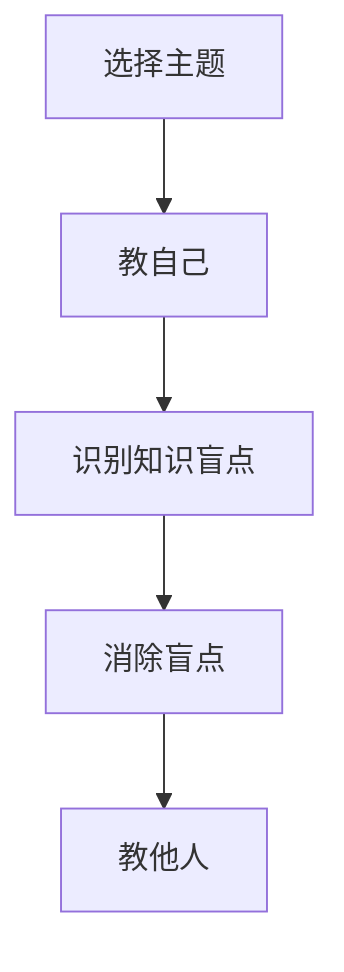

                 

# 费曼提问法:管理者思维升级的利器

> 关键词：费曼学习法、管理者思维、问题驱动、持续改进、知识共享

## 1. 背景介绍

在知识爆炸的今天，如何高效地学习新知、提升思维能力成为了每个管理者必须面对的挑战。费曼学习法（Feynman Technique）作为一种经典的学习方法，以其独特的提问和解释方式，成为了许多知识工作者特别是管理者的首选。本文将从费曼学习法入手，深入探讨其原理与实际应用，特别是在管理者思维升级上的独特优势。

### 1.1 问题由来

费曼学习法由诺贝尔物理学奖得主理查德·费曼提出，其核心理念是通过向他人解释、教学，来加深自己对知识的理解和掌握。在当今快速变化的管理环境中，管理者需要不断学习新知识、新技能，以应对日益复杂的内外部环境挑战。传统的学习方法如听讲、阅读、做笔记等，难以真正将知识转化为实际应用。费曼学习法以其主动的、互动式的提问与解释方式，能够帮助管理者更深入、更系统地掌握知识，从而提升自身思维能力，助力团队和企业的发展。

### 1.2 问题核心关键点

费曼学习法的核心在于“教别人”，即通过“教”的过程来检验和强化自己的理解。这种方法不仅能加深学习者对知识的掌握，还能通过教学互动，形成正向的反馈和持续的改进。在管理者思维升级中，费曼学习法尤其适用于以下三个方面：

- **深度理解**：通过向他人解释、教学，深入理解知识的本质和应用。
- **思维拓展**：在提问和解释过程中，拓展思维的广度和深度，形成创新性思考。
- **知识传递**：将个人所学转化为团队共享的知识，提升团队的协作和执行能力。

### 1.3 问题研究意义

费曼学习法在管理者的思维升级上具有重要的指导意义：

- **提升个人能力**：通过主动学习、提问、教学，管理者可以不断提升自己的专业技能和问题解决能力。
- **促进团队学习**：费曼学习法强调知识共享，能够提升团队的协作和创新能力，形成持续的组织学习氛围。
- **激发变革动力**：通过持续的学习和改进，管理者能够更好地适应和引领组织变革，驱动企业发展。

## 2. 核心概念与联系

### 2.1 核心概念概述

费曼学习法是一种以问题为导向的学习方法，通过主动提问和向他人解释，来检验和强化对知识的理解和掌握。其核心步骤包括四个环节：

1. **选择主题**：从个人感兴趣的领域或当前工作需求中选择一个主题。
2. **教自己**：假装自己已经掌握了该主题，并能够向他人清晰地解释。
3. **识别知识盲点**：在解释过程中，识别出自己尚未完全理解的部分。
4. **消除盲点**：回到教材或资料中，进一步学习这些未掌握的内容，直到能够自信地解释。

在管理者思维升级中，费曼学习法的关键在于将问题驱动的思维模式应用于管理实践，通过主动提问和教学，持续改进管理决策和团队执行。

### 2.2 核心概念原理和架构的 Mermaid 流程图

这个流程图展示了费曼学习法的基本流程，每个环节都是相互关联、相互促进的。通过“教自己”和“教他人”的互动，管理者能够深入理解问题，形成系统的知识体系，并通过不断消除知识盲点，不断提升自身的管理能力。

## 3. 核心算法原理 & 具体操作步骤

### 3.1 算法原理概述

费曼学习法的核心在于通过提问和解释的方式，检验和强化对知识的理解和掌握。具体来说，它包括以下几个关键步骤：

1. **设定问题**：明确要学习的主题，并围绕主题设定一系列问题。
2. **自我解释**：使用简单的语言和例子，向自己解释这些问题的答案。
3. **识别漏洞**：在解释过程中，识别出自己无法清楚表达或理解的部分。
4. **深入学习**：针对这些漏洞，回到教材或资料中深入学习，直到能够自信地解释。
5. **反复练习**：通过多次重复以上步骤，直到能够流畅地解释主题。

### 3.2 算法步骤详解

#### 步骤1：设定问题

管理者首先需要明确要学习的主题，并围绕该主题设定一系列问题。这些问题的设计应该涵盖主题的各个方面，确保全面理解主题。

#### 步骤2：自我解释

管理者应使用简单的语言和例子，向自己解释这些问题。这一过程可以采用写下来的形式，也可以通过口头表达的方式。

#### 步骤3：识别漏洞

在自我解释的过程中，管理者应识别出自己无法清楚表达或理解的部分，即知识盲点。这一步是费曼学习法中最为关键的环节，因为它直接决定了学习的效果。

#### 步骤4：深入学习

管理者需要回到教材或资料中，深入学习这些知识盲点，直到能够自信地解释。这一过程可能需要查阅更多的资料，进行更深入的思考和研究。

#### 步骤5：反复练习

最后，管理者需要多次重复以上步骤，直到能够流畅地解释主题。这一过程是费曼学习法中最为耗时，但也是效果最为显著的环节。

### 3.3 算法优缺点

费曼学习法的优点包括：

- **主动学习**：通过主动提问和解释，加深对知识的理解和掌握。
- **系统性思考**：通过系统性的问题设计，形成全面、深入的思考框架。
- **知识共享**：通过教学互动，促进知识的传递和共享。

其缺点包括：

- **时间成本高**：反复练习和深入学习的过程较为耗时，不适合时间紧迫的情况。
- **依赖基础知识**：对于某些基础薄弱的学习者，可能难以完成整个学习过程。

### 3.4 算法应用领域

费曼学习法在多个领域均有广泛应用，特别是在管理者的思维升级上，其独特优势体现在以下几个方面：

- **战略决策**：通过提问和解释，管理者可以更深入地理解市场环境、竞争态势等，形成更为科学和系统的战略决策。
- **团队管理**：通过知识共享和教学互动，提升团队成员的学习能力和执行能力，形成高效的团队协作。
- **创新思维**：在提问和解释过程中，管理者可以激发创新思维，形成新的商业模式和业务流程。

## 4. 数学模型和公式 & 详细讲解 & 举例说明

### 4.1 数学模型构建

费曼学习法的数学模型可以表述为一个迭代过程，其中每次迭代包括以下步骤：

1. **设定问题**：$\text{QuestionSet}=\{Q_1, Q_2, ..., Q_n\}$
2. **自我解释**：$\text{Explain}(Q_i)$
3. **识别漏洞**：$\text{IdentifyGap}(Q_i)$
4. **深入学习**：$\text{Learn}(Q_i)$
5. **反复练习**：$\text{Repeat}(1-5)$

其中，$\text{QuestionSet}$ 表示问题的集合，$Q_i$ 表示第 $i$ 个问题，$\text{Explain}(Q_i)$ 表示对问题 $Q_i$ 的自我解释，$\text{IdentifyGap}(Q_i)$ 表示识别漏洞，$\text{Learn}(Q_i)$ 表示深入学习漏洞部分，$\text{Repeat}(1-5)$ 表示重复执行以上步骤。

### 4.2 公式推导过程

由于费曼学习法是一个迭代过程，因此没有具体的公式推导。然而，我们可以通过实际案例来说明这一过程的详细步骤和应用。

### 4.3 案例分析与讲解

#### 案例1：战略决策

假设一家公司需要进行新市场的拓展，管理者设定以下问题：

1. 市场环境分析：当前市场的竞争态势如何？有哪些主要的竞争对手？
2. 客户需求分析：目标客户的需求是什么？他们有哪些痛点？
3. 资源配置：如何进行资源配置，以支持市场拓展？
4. 风险评估：市场拓展可能面临哪些风险？

管理者首先对这些问题进行自我解释，识别出知识盲点，如市场数据的获取和分析方法，然后再深入学习相关知识，最后通过多次重复练习，形成系统性的战略决策。

#### 案例2：团队管理

假设管理者需要提升团队的工作效率，设定以下问题：

1. 团队结构分析：当前团队的结构是否合理？有哪些优化建议？
2. 激励机制设计：如何设计有效的激励机制，激发团队成员的积极性？
3. 知识共享：如何促进团队成员之间的知识共享，提升团队协作能力？

管理者通过自我解释和识别漏洞，深入学习相关知识，如团队管理理论、激励心理学等，最终形成有效的团队管理方案。

## 5. 项目实践：代码实例和详细解释说明

### 5.1 开发环境搭建

为了实践费曼学习法，我们需要搭建一个支持在线协作和知识共享的平台。常见的工具包括Confluence、Trello、Slack等。这里以Confluence为例，简要介绍开发环境搭建流程：

1. 在Confluence中创建项目空间，设置相应的权限和角色。
2. 添加团队成员，并设置相应的权限，确保每个人都能访问和管理项目空间。
3. 在项目空间中创建知识库（Wiki），用于存储和共享知识。
4. 创建问题库（Issues），用于记录和跟踪问题。
5. 配置Confluence的插件（如Jira插件），方便问题管理和任务分配。

### 5.2 源代码详细实现

#### 1. 问题设定

在Confluence中创建问题库，设定问题。每个问题应包含以下内容：

- 问题描述：清晰明确地描述问题。
- 相关知识：列出与问题相关的知识库链接。
- 任务分配：指定负责解决该问题的团队成员。

#### 2. 自我解释

在问题库中创建自我解释页面，记录自己对问题的理解和思考。这一过程可以使用简单的文字、图表、图片等多种形式。

#### 3. 识别漏洞

在自我解释页面上，识别出自己无法清楚表达或理解的部分，并记录下来。

#### 4. 深入学习

针对识别出的漏洞，回到知识库中查找相关的资料和信息，进行深入学习。这一过程可以使用文档、视频、书籍等多种形式。

#### 5. 反复练习

在问题库中更新自我解释页面，记录新的理解和思考。反复执行以上步骤，直到能够自信地解释问题。

### 5.3 代码解读与分析

在Confluence中进行知识管理和协作，并不需要复杂的代码实现。但为了进一步提升知识共享的效果，可以考虑开发一些辅助工具，如知识图谱、自动推荐系统等。这些工具需要结合自然语言处理、推荐算法等技术，通过编程实现。

### 5.4 运行结果展示

运行结果展示可以通过以下方式：

1. 创建知识库：使用知识管理工具（如Confluence）创建知识库，存储和共享知识。
2. 问题跟踪：在问题库中记录和跟踪问题，确保每个问题都有明确的解决方案和负责人。
3. 团队协作：通过在线协作工具（如Slack）进行实时沟通和协作，提升团队效率。
4. 知识图谱：使用图形化工具（如Lucidchart）创建知识图谱，展示知识之间的关联关系。

## 6. 实际应用场景

### 6.1 智能客服系统

在智能客服系统中，费曼学习法可以用于提升客服人员的知识储备和问题解决能力。通过设定客户常见问题、客户反馈、政策变化等问题，客服人员可以系统性地学习和掌握相关知识，提升服务质量和客户满意度。

### 6.2 金融舆情监测

在金融舆情监测中，费曼学习法可以帮助金融分析师理解市场动态、识别潜在风险。通过设定市场趋势、政策变化、竞争对手动态等问题，分析师可以系统性地学习相关知识，提升决策的科学性和准确性。

### 6.3 个性化推荐系统

在个性化推荐系统中，费曼学习法可以帮助推荐工程师深入理解用户需求、产品特性和推荐算法。通过设定用户行为数据、产品特点、算法效果等问题，推荐工程师可以系统性地学习和掌握相关知识，提升推荐系统的精准性和用户满意度。

### 6.4 未来应用展望

未来，费曼学习法将在更多领域得到应用，为管理者思维升级提供新的工具和方法。例如：

- **人工智能**：在AI模型的开发和训练中，通过设定问题、识别漏洞、深入学习等步骤，提升模型的训练效果和应用效果。
- **项目管理**：在项目管理中，通过设定项目进展、问题识别、风险评估等问题，提升项目管理的系统性和科学性。
- **组织变革**：在组织变革中，通过设定变革目标、变革路径、变革效果等问题，提升变革的顺利度和成效。

## 7. 工具和资源推荐

### 7.1 学习资源推荐

1. **《费曼学习法：如何学习得更好更快更深入》**：作者理查德·费曼，介绍了费曼学习法的原理和实践方法。
2. **《深度工作：如何有效利用每一点脑力》**：作者卡尔·纽波特，介绍了如何通过深度工作提升学习和工作效率。
3. **《思考，快与慢》**：作者丹尼尔·卡尼曼，介绍了人类思维的两种系统，提升决策的科学性和合理性。
4. **Coursera和edX上的相关课程**：提供系统性的学习资源和课程，帮助管理者提升思维能力和问题解决能力。

### 7.2 开发工具推荐

1. **Confluence**：知识管理和协作工具，支持在线协作和知识共享。
2. **Slack**：即时通信工具，支持团队协作和实时沟通。
3. **Jira**：任务管理工具，支持问题跟踪和任务分配。
4. **Lucidchart**：图形化工具，支持创建知识图谱和协作图。

### 7.3 相关论文推荐

1. **《如何使费曼学习法高效化》**：介绍如何通过技术手段提升费曼学习法的效率和效果。
2. **《团队学习与知识共享》**：探讨团队学习的重要性，以及如何通过知识共享提升团队绩效。
3. **《知识管理的科学和艺术》**：介绍知识管理的理论和实践，提升知识管理的系统性和科学性。

## 8. 总结：未来发展趋势与挑战

### 8.1 研究成果总结

费曼学习法通过主动提问和教学，帮助学习者深入理解知识，提升思维能力。在管理者思维升级中，费曼学习法具有独特的优势，能够提升战略决策、团队管理和创新思维等方面的能力。

### 8.2 未来发展趋势

未来，费曼学习法将在更多领域得到应用，其发展趋势包括：

1. **技术化应用**：通过技术手段提升费曼学习法的效率和效果，如知识图谱、自动推荐系统等。
2. **平台化普及**：通过在线平台和工具，促进费曼学习法的普及和应用。
3. **跨学科应用**：将费曼学习法应用到更多学科和领域，提升管理者的综合能力。

### 8.3 面临的挑战

尽管费曼学习法在管理者思维升级中具有显著优势，但仍面临以下挑战：

1. **时间成本高**：反复练习和深入学习的过程较为耗时，不适合时间紧迫的情况。
2. **依赖基础知识**：对于某些基础薄弱的学习者，可能难以完成整个学习过程。
3. **实施难度大**：需要系统性的工具和平台支持，实施难度较大。

### 8.4 研究展望

未来，针对费曼学习法的挑战，可以从以下几个方向进行研究：

1. **技术工具的开发**：开发支持费曼学习法的在线平台和工具，降低实施难度。
2. **问题设计的优化**：研究如何设计更系统、更高效的问题，提升学习效果。
3. **跨学科应用的研究**：将费曼学习法应用到更多学科和领域，提升管理者的综合能力。

总之，费曼学习法作为一种高效的学习方法，在管理者思维升级中具有独特优势。通过系统性的应用和优化，费曼学习法将为管理者提供更强大的思维工具，助力组织和企业的发展。

## 9. 附录：常见问题与解答

### 附录A: 费曼学习法的基本步骤

费曼学习法的基本步骤包括以下四个环节：

1. **设定问题**：明确要学习的主题，并围绕该主题设定一系列问题。
2. **自我解释**：使用简单的语言和例子，向自己解释这些问题。
3. **识别漏洞**：在解释过程中，识别出自己无法清楚表达或理解的部分。
4. **深入学习**：针对这些漏洞，回到教材或资料中深入学习，直到能够自信地解释。

### 附录B: 费曼学习法的注意事项

在使用费曼学习法时，需要注意以下事项：

1. **设定问题的难度适中**：问题的难度应该适中，既不能过于简单，也不能过于复杂。
2. **自我解释要简洁明了**：尽量使用简单的语言和例子，避免过于复杂和抽象的解释。
3. **识别漏洞要全面细致**：在解释过程中，要全面细致地识别漏洞，不要遗漏任何细节。
4. **深入学习要系统深入**：针对识别出的漏洞，要系统深入地进行学习，确保彻底掌握相关知识。

### 附录C: 费曼学习法的优势和局限

费曼学习法的优势包括：

- **主动学习**：通过主动提问和解释，加深对知识的理解和掌握。
- **系统性思考**：通过系统性的问题设计，形成全面、深入的思考框架。
- **知识共享**：通过教学互动，促进知识的传递和共享。

其局限包括：

- **时间成本高**：反复练习和深入学习的过程较为耗时，不适合时间紧迫的情况。
- **依赖基础知识**：对于某些基础薄弱的学习者，可能难以完成整个学习过程。

### 附录D: 费曼学习法的实际应用案例

1. **战略决策**：通过设定市场环境分析、客户需求分析、资源配置、风险评估等问题，管理者可以系统性地学习和掌握相关知识，提升战略决策的科学性和系统性。
2. **团队管理**：通过设定团队结构分析、激励机制设计、知识共享等问题，管理者可以系统性地学习和掌握相关知识，提升团队协作和执行能力。
3. **创新思维**：在提问和解释过程中，管理者可以激发创新思维，形成新的商业模式和业务流程。

### 附录E: 费曼学习法的学习资源推荐

1. **《费曼学习法：如何学习得更好更快更深入》**：作者理查德·费曼，介绍了费曼学习法的原理和实践方法。
2. **《深度工作：如何有效利用每一点脑力》**：作者卡尔·纽波特，介绍了如何通过深度工作提升学习和工作效率。
3. **《思考，快与慢》**：作者丹尼尔·卡尼曼，介绍了人类思维的两种系统，提升决策的科学性和合理性。
4. **Coursera和edX上的相关课程**：提供系统性的学习资源和课程，帮助管理者提升思维能力和问题解决能力。

### 附录F: 费曼学习法的开发工具推荐

1. **Confluence**：知识管理和协作工具，支持在线协作和知识共享。
2. **Slack**：即时通信工具，支持团队协作和实时沟通。
3. **Jira**：任务管理工具，支持问题跟踪和任务分配。
4. **Lucidchart**：图形化工具，支持创建知识图谱和协作图。

### 附录G: 费曼学习法的相关论文推荐

1. **《如何使费曼学习法高效化》**：介绍如何通过技术手段提升费曼学习法的效率和效果。
2. **《团队学习与知识共享》**：探讨团队学习的重要性，以及如何通过知识共享提升团队绩效。
3. **《知识管理的科学和艺术》**：介绍知识管理的理论和实践，提升知识管理的系统性和科学性。

---

作者：禅与计算机程序设计艺术 / Zen and the Art of Computer Programming

