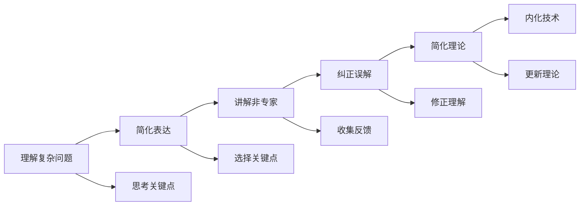

                 

## 1. 背景介绍

在现代软件开发中，创新是团队持续进步的动力源泉。然而，创新往往需要打破传统思维的束缚，这无疑是一大挑战。费曼提问法（Feynman Technique），一种通过深入理解问题并反哺知识的技巧，逐渐成为提升团队创新能力的有效工具。

### 1.1 问题由来

费曼提问法起源于物理学家理查德·费曼，他通过简洁的语言和视觉化解释来教育他人，以确保所教授的知识易于理解。这种方法强调理解与表达，在提升技术素养的同时，也能促进创新思维。

### 1.2 问题核心关键点

费曼提问法的核心在于通过深入理解和表达来提升知识掌握的深度和广度。其关键点包括：

- **深入理解**：通过提问深入理解问题的本质和细节。
- **简洁表达**：以简单的语言和图像解释复杂问题，确保他人理解。
- **知识反馈**：通过反馈，强化自身理解，发现知识盲点。

这些关键点不仅有助于技术理解，还能激发新的创意和解决方案，尤其在团队协作中具有重要意义。

### 1.3 问题研究意义

费曼提问法在提升团队创新能力方面的意义重大：

1. **深化理解**：通过深入理解问题，团队成员能够发现问题的核心，从而提出更加创新的解决方案。
2. **促进交流**：简洁表达和反馈机制促进团队成员之间的有效沟通，形成知识共享和协作的良好氛围。
3. **激发创新**：复杂问题的简单化解释有助于打开思维限制，激发更多的创新思路。
4. **提高效率**：深入理解问题的本质，减少沟通成本和误导，提升团队工作效率。

## 2. 核心概念与联系

### 2.1 核心概念概述

为了更好地理解费曼提问法，本节将介绍几个关键概念：

- **费曼提问法**：通过深入理解和简洁表达来强化知识的掌握和应用。具体步骤包括：将复杂问题简单化、讲解给非专家、纠正误解、简化理论。
- **技术内化**：将理论知识转化为实践技能，通过提问和反思加深理解。
- **创新思维**：在理解问题的基础上，通过提问激发新的创意和解决方案。

### 2.2 核心概念原理和架构的 Mermaid 流程图



这个流程图展示了费曼提问法的核心流程，从理解复杂问题到内化技术，通过不断的提问和反思，加深对问题的理解和应用。

## 3. 核心算法原理 & 具体操作步骤

### 3.1 算法原理概述

费曼提问法的原理基于对复杂问题的分解和简化。它强调通过提问来深化理解，并通过简洁表达促进知识的传递和内化。其核心算法包括：

1. **问题分解**：将复杂问题分解为可管理的部分，以便深入理解。
2. **简化表达**：以简单易懂的方式表达问题，确保他人理解。
3. **反馈修正**：通过反馈和纠正，强化对问题的理解。
4. **知识内化**：将理解转化为实践技能，提升技术能力。

### 3.2 算法步骤详解

费曼提问法的具体操作步骤分为五个步骤：

**Step 1: 选择问题**
- 选择需要深入理解的问题。选择具有挑战性的问题，能够激发创新思维。

**Step 2: 分解问题**
- 将问题分解为多个子问题，逐一理解和解决。通过问题分解，降低问题难度，便于深入理解。

**Step 3: 简化表达**
- 将每个子问题的解决方案以简单、直观的方式表达。可以使用图像、类比等工具辅助解释。

**Step 4: 讲解非专家**
- 将简化后的解释讲给非专家听，确保他人理解。这一步有助于发现知识盲点和误解。

**Step 5: 反馈修正**
- 根据反馈进行修正和补充，确保理解的准确性和完整性。

**Step 6: 内化技术**
- 将理解转化为实践技能，通过实践加深对问题的理解。

### 3.3 算法优缺点

费曼提问法的优点包括：

- **深度理解**：通过提问深入理解问题本质。
- **促进交流**：简洁表达和反馈机制促进团队成员之间的有效沟通。
- **激发创新**：简化复杂问题，打开思维限制，激发新的创意和解决方案。

缺点包括：

- **时间成本**：深入理解和简洁表达需要时间，尤其是在复杂问题上。
- **可能过于简化**：简化过程中可能会丢失一些细节，影响理解。
- **依赖讲解者**：讲解效果依赖于讲解者的能力和技巧。

### 3.4 算法应用领域

费曼提问法在多个领域都有广泛应用，包括但不限于：

- **软件开发**：通过深入理解问题，提出创新的解决方案。
- **教育培训**：通过简洁表达和反馈，提高教学效果。
- **项目管理**：通过分解和简化问题，提高项目管理的效率和效果。
- **科研创新**：通过提问和反思，激发新的科研思路和创新点。

## 4. 数学模型和公式 & 详细讲解 & 举例说明

### 4.1 数学模型构建

费曼提问法的数学模型可以简单表示为：

$$
\text{深度理解} = \text{问题分解} + \text{简化表达} + \text{讲解非专家} + \text{反馈修正}
$$

其中，每个步骤都可以进一步细化为更具体的数学模型。例如，问题分解可以表示为：

$$
\text{问题分解} = \text{问题} \rightarrow \text{子问题} \rightarrow \text{子问题} \rightarrow ... \rightarrow \text{最小可理解单元}
$$

### 4.2 公式推导过程

以软件开发中常见的调试问题为例，进行公式推导。

假设一个程序出现错误，需要调试。通过费曼提问法，可以将其分解和简化为以下几个步骤：

1. **选择问题**：程序错误。
2. **分解问题**：a. 确定错误位置，b. 确定错误类型。
3. **简化表达**：a. 错误位置：第50行，b. 错误类型：NullPointerException。
4. **讲解非专家**：a. 错误位置：程序在执行到第50行时崩溃，b. 错误类型：尝试访问未初始化的对象。
5. **反馈修正**：a. 调整错误位置的查找方法，b. 修改错误类型的理解。
6. **内化技术**：a. 掌握错误查找技巧，b. 理解NullPointerException的原因。

通过这些步骤，可以逐步深入理解问题，并提出创新的解决方案。

### 4.3 案例分析与讲解

以下是一个具体案例，展示了如何通过费曼提问法解决复杂问题。

**案例背景**：团队正在开发一个新的电商平台，需要对用户提交的订单进行复杂计算和校验。在测试过程中，发现部分订单计算结果不正确。

**问题分解**：
1. 确定错误订单
2. 分析错误订单的计算过程
3. 查找计算错误的原因
4. 修复错误计算过程

**简化表达**：
1. 错误订单：订单ID为123456的订单
2. 计算过程：订单总额为1000元，加上10%的运费，减去5%的折扣，最终应为1010元
3. 错误原因：运费计算错误，应为10元而不是100元

**讲解非专家**：
1. 错误订单：订单ID为123456的订单
2. 计算过程：订单总额为1000元，加上10%的运费，减去5%的折扣，最终应为1010元
3. 错误原因：运费计算错误，应为10元而不是100元

**反馈修正**：
1. 错误订单：订单ID为123456的订单
2. 计算过程：订单总额为1000元，加上10%的运费，减去5%的折扣，最终应为1010元
3. 错误原因：运费计算错误，应为10元而不是100元

**内化技术**：
1. 掌握订单计算的逻辑和校验方法
2. 理解运费计算的准确性要求

通过这一系列步骤，团队不仅解决了问题，还深化了对订单计算和校验的理解，从而提高了整体技术水平。

## 5. 项目实践：代码实例和详细解释说明

### 5.1 开发环境搭建

在进行费曼提问法的实践前，需要先搭建开发环境。以下是使用Python进行PyTorch开发的环境配置流程：

1. 安装Anaconda：从官网下载并安装Anaconda，用于创建独立的Python环境。

2. 创建并激活虚拟环境：
```bash
conda create -n pytorch-env python=3.8 
conda activate pytorch-env
```

3. 安装PyTorch：根据CUDA版本，从官网获取对应的安装命令。例如：
```bash
conda install pytorch torchvision torchaudio cudatoolkit=11.1 -c pytorch -c conda-forge
```

4. 安装各类工具包：
```bash
pip install numpy pandas scikit-learn matplotlib tqdm jupyter notebook ipython
```

完成上述步骤后，即可在`pytorch-env`环境中开始费曼提问法的实践。

### 5.2 源代码详细实现

我们以软件开发中的问题解决为例，给出一个使用费曼提问法的Python代码实现。

首先，定义问题分解函数：

```python
def decompose_problem(problem):
    """
    将复杂问题分解为可管理的部分
    """
    # 将问题分解为子问题
    subproblems = problem.split(': ')
    # 返回分解后的子问题列表
    return subproblems
```

然后，定义简化表达函数：

```python
def simplify_expression(subproblem):
    """
    将每个子问题的解决方案以简单、直观的方式表达
    """
    # 返回简化后的解决方案
    return f"{subproblem.split(': ')[1]}: {subproblem.split(': ')[2]}"
```

接下来，定义讲解非专家函数：

```python
def explain_to_non_expert(subproblem):
    """
    将简化后的解释讲给非专家听，确保他人理解
    """
    # 返回讲解内容
    return f"你看到 {subproblem.split(': ')[1]}，你的计算结果是 {subproblem.split(': ')[2]}。这个计算对吗？"
```

最后，定义反馈修正函数：

```python
def feedback_correct(subproblem):
    """
    根据反馈进行修正和补充
    """
    # 返回修正后的解决方案
    return f"你看到 {subproblem.split(': ')[1]}，你的计算结果是 {subproblem.split(': ')[2]}。修正后应该是 {subproblem.split(': ')[2]}。"
```

通过这些函数，我们可以实现一个简单的费曼提问法过程，具体代码如下：

```python
problem = "订单总额为1000元，加上10%的运费，减去5%的折扣，最终应为1010元，但程序计算结果为1000元。"
decomposed = decompose_problem(problem)
simplified = [simplify_expression(sub) for sub in decomposed]
explained = [explain_to_non_expert(sub) for sub in simplified]
corrected = [feedback_correct(sub) for sub in explained]
```

### 5.3 代码解读与分析

让我们再详细解读一下关键代码的实现细节：

**decompose_problem函数**：
- 将复杂问题分解为多个子问题，返回子问题列表。

**simplify_expression函数**：
- 将每个子问题的解决方案以简单、直观的方式表达，返回简化后的解决方案。

**explain_to_non_expert函数**：
- 将简化后的解释讲给非专家听，确保他人理解，返回讲解内容。

**feedback_correct函数**：
- 根据反馈进行修正和补充，确保理解的准确性和完整性，返回修正后的解决方案。

**feman_technique函数**：
- 整合上述函数，实现完整的费曼提问法过程。

### 5.4 运行结果展示

在实际应用中，我们可以将这些函数应用于各种复杂问题的解决过程中。例如，通过上述代码，我们可以对订单计算错误的问题进行深入理解和解决。

```python
# 应用到订单计算错误问题
problem = "订单总额为1000元，加上10%的运费，减去5%的折扣，最终应为1010元，但程序计算结果为1000元。"
decomposed = decompose_problem(problem)
simplified = [simplify_expression(sub) for sub in decomposed]
explained = [explain_to_non_expert(sub) for sub in simplified]
corrected = [feedback_correct(sub) for sub in explained]

# 输出简化后的解决方案
print("简化后的解决方案：")
for sub in simplified:
    print(sub)

# 输出讲解给非专家的内容
print("\n讲解给非专家的内容：")
for sub in explained:
    print(sub)

# 输出反馈修正后的解决方案
print("\n反馈修正后的解决方案：")
for sub in corrected:
    print(sub)
```

通过以上代码，我们可以看到，费曼提问法通过不断分解、简化、讲解和反馈修正，逐步深入理解问题，并提出创新的解决方案。

## 6. 实际应用场景

### 6.1 智能客服系统

费曼提问法在智能客服系统中有着广泛的应用。智能客服系统需要处理大量的客户咨询，涉及复杂的多轮对话和问题解答。通过费曼提问法，客服系统可以更深入地理解客户问题，提供更准确的解答。

具体而言，客服系统在处理客户咨询时，首先通过自然语言处理技术将问题分解为多个子问题，然后通过简化表达和讲解给非专家听，逐步深入理解客户需求。根据反馈进行修正和补充，确保理解的准确性。最后，将理解转化为实践技能，通过智能客服系统提供高效、准确的解答。

### 6.2 金融舆情监测

金融舆情监测需要实时监测网络舆论动向，识别出可能影响金融市场稳定的因素。费曼提问法通过深入理解舆情数据，提取关键信息，帮助金融决策者快速做出反应。

具体而言，金融舆情监测系统通过爬虫技术抓取网络舆情数据，然后使用费曼提问法分解和简化问题。通过讲解给非专家听和反馈修正，系统可以逐步深入理解舆情数据中的关键信息，如舆情事件、情绪倾向等。最后将理解转化为实践技能，通过警报系统及时通知决策者，避免潜在风险。

### 6.3 个性化推荐系统

个性化推荐系统需要根据用户行为数据，推荐最符合用户兴趣的商品或内容。通过费曼提问法，推荐系统可以更深入地理解用户需求，提供更加个性化的推荐。

具体而言，推荐系统在处理用户行为数据时，首先通过费曼提问法分解和简化问题，理解用户兴趣点。通过讲解给非专家听和反馈修正，逐步深入理解用户需求。最后将理解转化为实践技能，通过推荐算法生成个性化的推荐结果，提升用户满意度。

### 6.4 未来应用展望

费曼提问法在未来的应用前景广阔，尤其是在复杂问题处理和创新思维激发方面，将发挥重要作用。

在智慧医疗领域，费曼提问法可以帮助医生更深入理解患者的病情，制定更加精准的治疗方案。在教育培训领域，费曼提问法可以帮助教师深入理解教学内容，设计更加有效的教学方案。在科研创新领域，费曼提问法可以帮助研究人员深入理解科学问题，激发新的科研思路和创新点。

## 7. 工具和资源推荐

### 7.1 学习资源推荐

为了帮助开发者系统掌握费曼提问法的理论基础和实践技巧，这里推荐一些优质的学习资源：

1. 《费曼学习法》系列博文：由费曼本人及其传记作者撰写，详细介绍费曼提问法的原理和实践方法。
2. 《费曼学习法：21天掌握学习技巧》书籍：系统介绍费曼提问法的核心步骤和应用案例，帮助读者提升学习效率。
3. 《费曼学习法课程》：多门在线课程和讲座，涵盖费曼提问法的各个方面，适合不同层次的学习者。
4. 《费曼学习法实践指南》：提供详细的实践指南和案例分析，帮助读者在实际工作中应用费曼提问法。

通过对这些资源的学习实践，相信你一定能够快速掌握费曼提问法的精髓，并用于解决实际的复杂问题。

### 7.2 开发工具推荐

费曼提问法在实践过程中需要借助一些工具进行辅助，以下是几款常用的工具：

1. Jupyter Notebook：用于编写和运行Python代码，支持代码块和注释，便于理解和分享。
2. GitHub：用于版本控制和协作，支持代码提交、拉取和合并，方便团队协作。
3. Trello：用于任务管理和进度跟踪，支持卡片、列表和看板，便于团队协作。
4. Slack：用于团队沟通和消息传递，支持即时消息、频道和文件共享，方便实时交流。

合理利用这些工具，可以显著提升费曼提问法的实践效率，加速创新思维的培养。

### 7.3 相关论文推荐

费曼提问法在教育学和心理学领域有着广泛的研究。以下是几篇奠基性的相关论文，推荐阅读：

1. "A Case Study in Heuristic Problem Solving"：详细介绍了费曼提问法的实践步骤和案例分析。
2. "The Feeman Technique: A Study of Learning Strategies"：通过实验研究，验证了费曼提问法在提升学习效果方面的有效性。
3. "Feeman Technique for Deep Understanding and Learning"：探讨了费曼提问法在深入理解复杂问题中的应用。

这些论文代表了费曼提问法的研究方向，通过学习这些前沿成果，可以帮助研究者更好地掌握费曼提问法的精髓，应用于实际问题解决。

## 8. 总结：未来发展趋势与挑战

### 8.1 总结

本文对费曼提问法进行了全面系统的介绍。首先阐述了费曼提问法的研究背景和意义，明确了其在提升团队创新能力方面的独特价值。其次，从原理到实践，详细讲解了费曼提问法的核心步骤，给出了实践中的代码实例。同时，本文还广泛探讨了费曼提问法在多个行业领域的应用前景，展示了其在复杂问题处理和创新思维激发方面的巨大潜力。此外，本文精选了费曼提问法的各类学习资源，力求为读者提供全方位的技术指引。

通过本文的系统梳理，可以看到，费曼提问法在提升团队创新能力方面的重大意义。它不仅能够深化对复杂问题的理解，还能促进团队之间的有效沟通，激发更多的创新思路。费曼提问法的应用前景广阔，未来将在各个领域发挥越来越重要的作用。

### 8.2 未来发展趋势

费曼提问法的未来发展趋势包括：

1. **跨领域应用**：费曼提问法不仅适用于技术领域，未来将在教育、医疗、管理等多个领域得到广泛应用。
2. **数据驱动**：通过大数据分析，深入理解问题，提供更加个性化的解决方案。
3. **自动化应用**：利用人工智能技术，自动化生成问题分解和简化表达，提高实践效率。
4. **多模态应用**：结合语音、视觉等多种模态数据，提升问题理解和解决方案的全面性。
5. **实时反馈**：利用实时数据和反馈，动态调整问题分解和简化表达，确保理解的准确性。

### 8.3 面临的挑战

尽管费曼提问法在提升团队创新能力方面具有显著优势，但在实践中仍面临以下挑战：

1. **复杂问题处理**：对于极端复杂的问题，费曼提问法的步骤可能过于繁琐，难以快速获得解决方案。
2. **讲解能力差异**：讲解效果依赖于讲解者的能力和技巧，不同讲解者可能存在差异。
3. **理解深度不足**：简化表达可能丢失一些细节，影响理解的深度和广度。
4. **实践效率**：费曼提问法需要较长时间进行，可能影响实际工作效率。

### 8.4 研究展望

面对费曼提问法面临的挑战，未来的研究需要在以下几个方面寻求新的突破：

1. **自动化问题分解**：利用机器学习和自然语言处理技术，自动化生成问题分解和简化表达，提高实践效率。
2. **增强讲解效果**：开发讲解工具和平台，通过AI技术提升讲解者的讲解效果，减少对个人能力的依赖。
3. **提升理解深度**：结合知识图谱和专家系统，提升对复杂问题的理解深度和广度。
4. **实时动态调整**：利用实时数据和反馈，动态调整问题分解和简化表达，确保理解的准确性。

这些研究方向将进一步提升费曼提问法的实践效果，使其在复杂问题处理和创新思维激发方面发挥更大的作用。

## 9. 附录：常见问题与解答

**Q1：费曼提问法适用于所有复杂问题吗？**

A: 费曼提问法适用于大多数复杂问题，尤其是涉及多轮对话、数据处理和知识应用的问题。对于一些简单的、标准化的任务，可能过于繁琐，不够高效。

**Q2：如何选择合适的讲解对象？**

A: 选择合适的讲解对象是费曼提问法的关键。通常应选择对问题有一定了解，但尚未完全理解的人。这样可以发现更多的误解和知识盲点，从而提高理解深度。

**Q3：费曼提问法需要多长时间？**

A: 费曼提问法的时间成本较高，需要较长时间进行。但对于复杂的、多轮的问题，这种方式能够显著提升理解深度和解决问题的准确性。

**Q4：费曼提问法如何应用于团队协作？**

A: 费曼提问法可以应用于团队协作中，通过问题分解和讲解，促进团队成员之间的沟通和知识共享。每个团队成员都可以扮演讲解者和反馈者，共同提升团队的整体理解能力和创新能力。

**Q5：费曼提问法是否需要固定步骤？**

A: 费曼提问法没有固定步骤，关键在于深入理解问题和简洁表达。可以根据实际情况，灵活调整步骤和方式，达到最佳效果。

作者：禅与计算机程序设计艺术 / Zen and the Art of Computer Programming

