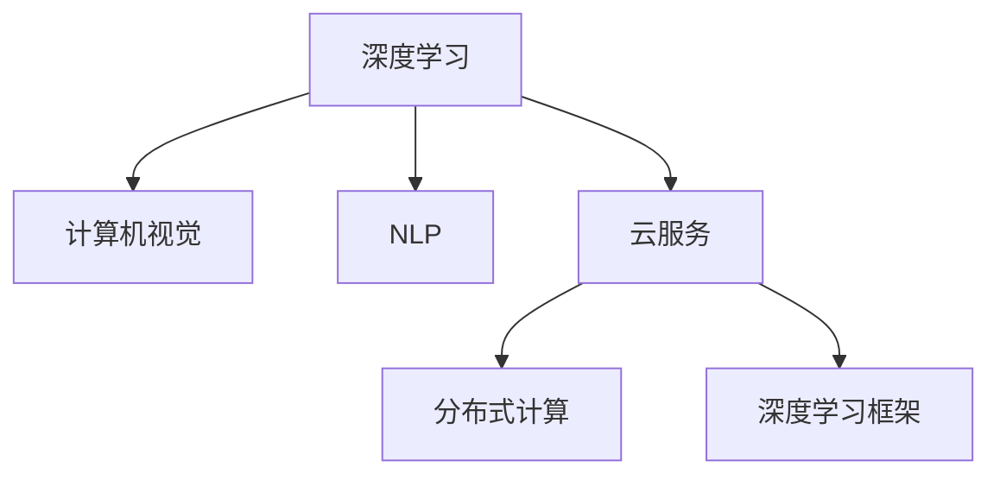

                 

# 贾扬清的创业机遇：AI计算需求的演进，云服务的整合之道

## 1. 背景介绍

### 1.1 问题由来
在过去的十年里，人工智能(AI)领域经历了翻天覆地的变化。从最初的机器学习、深度学习，到当前的自然语言处理(NLP)、计算机视觉(CV)、机器人学等，AI技术的应用边界不断扩展，对计算需求也呈现出爆炸式增长。如何高效地支持AI计算，成为了数据中心、云服务提供商、AI企业等需要共同面对的重要挑战。

作为AI领域的杰出人物之一，贾扬清博士在深度学习和计算机视觉领域有着深厚的积累和丰富的实践经验。在清华大学担任教授期间，他领导了多个国家级科研课题，并创办了深度视觉公司，成功将科研成果转化为商业价值。近期，贾扬清又加入了AWS云服务，担任全球副总裁兼人工智能云服务首席架构师，致力于推动AI计算需求的演进，以及云服务对AI计算需求的整合。

本文将深入探讨贾扬清博士的创业经历，结合当前AI计算需求的变化，探讨其在云服务领域的整合之道。通过分析贾扬清的研究和实践，希望能为AI创业者提供一些启示，同时也为云服务提供商提供一些方向。

### 1.2 问题核心关键点
AI计算需求演进的核心关键点包括：

- **数据量爆炸性增长**：海量数据是AI模型训练和推理的基础，数据量的增长驱动了对计算资源的需求。
- **模型复杂度提升**：深度神经网络等复杂模型对计算资源的需求更大，如GPU、TPU等。
- **训练推理一体化**：AI应用从训练到推理的全生命周期管理，对计算资源的需求变得更加复杂。
- **AI生态的整合**：AI技术的应用需要多种软硬件支持，如何实现各种AI组件之间的协同工作，是整合的重要环节。

本文将围绕这些关键点，深入探讨AI计算需求的演进，以及云服务如何支持这些需求。

## 2. 核心概念与联系

### 2.1 核心概念概述

为更好地理解AI计算需求的演进以及云服务的整合之道，本节将介绍几个关键概念：

- **深度学习**：一种基于神经网络的机器学习技术，通过多层神经元的非线性变换，实现对复杂数据的高效表示和处理。
- **计算机视觉(CV)**：AI领域的重要分支，专注于通过算法使计算机具备人眼一样的视觉感知能力。
- **自然语言处理(NLP)**：AI领域另一个重要分支，目标是使计算机能够理解、解释和生成自然语言。
- **云服务**：基于互联网的计算资源和服务的提供，如AWS、阿里云等。
- **分布式计算**：将一个大问题分解成多个小问题，在多台计算机上并行计算，以提高计算效率。
- **深度学习框架**：如TensorFlow、PyTorch等，提供了高效的AI模型训练和推理环境。

这些核心概念之间的逻辑关系可以通过以下Mermaid流程图来展示：



这个流程图展示了几大核心概念之间的相互关系：

1. 深度学习是计算机视觉和自然语言处理的基础，是AI技术的核心。
2. 云服务提供了计算资源和分布式计算环境，是深度学习和AI技术得以应用的基础。
3. 深度学习框架提供了高效的工具和平台，加速了深度学习的开发和部署。
4. 分布式计算是处理大规模计算需求的重要手段，与云服务密切相关。

## 3. 核心算法原理 & 具体操作步骤
### 3.1 算法原理概述

AI计算需求的演进，本质上是深度学习和分布式计算需求的变化。云服务通过提供计算资源和分布式计算环境，满足了这些需求的变化。

当前，AI计算需求呈现以下特点：

1. **数据规模巨大**：AI模型的训练和推理需要处理海量数据，对计算资源的需求巨大。
2. **模型复杂度高**：深度神经网络等复杂模型对计算资源的需求更大，如GPU、TPU等。
3. **训练推理一体化**：AI应用从训练到推理的全生命周期管理，对计算资源的需求变得更加复杂。

基于这些需求，云服务提供商必须提供强大的计算能力、灵活的资源调度、高效的计算框架等支持，才能满足AI计算的需求。

### 3.2 算法步骤详解

AI计算需求演进和云服务整合的主要步骤如下：

**Step 1: 数据中心建设**
- 建设高性能数据中心，提供GPU、TPU等高性能计算资源。
- 构建分布式计算环境，支持大规模计算任务的分布式调度。

**Step 2: 计算框架优化**
- 优化深度学习框架，支持多GPU、多TPU等分布式计算环境。
- 提供高效的计算库和工具，加速模型的训练和推理。

**Step 3: 资源调度优化**
- 实现资源自动调度，根据任务需求动态调整计算资源。
- 提供多种计算资源选择，满足不同任务的需求。

**Step 4: 服务化封装**
- 将计算服务封装为标准化的API，便于用户调用。
- 提供弹性伸缩、持续监控等云服务功能。

**Step 5: 用户反馈优化**
- 收集用户反馈，优化计算资源和调度策略。
- 定期更新计算资源，保持高性能和低成本。

通过以上步骤，云服务提供商可以满足AI计算的需求变化，提供高效、灵活、可靠的计算服务。

### 3.3 算法优缺点

云服务整合AI计算需求的主要优点包括：

1. **计算资源灵活调配**：根据任务需求动态调整计算资源，避免资源浪费。
2. **高效计算框架支持**：提供优化后的计算框架和工具，加速模型的训练和推理。
3. **服务化封装**：将计算服务封装为标准化的API，便于用户调用。
4. **弹性伸缩**：支持弹性伸缩，根据负载动态调整计算资源。

同时，云服务整合AI计算需求也存在一些缺点：

1. **成本高**：高性能计算资源成本较高，会增加企业的运营成本。
2. **数据隐私风险**：数据中心集中存储大量敏感数据，可能存在数据泄露的风险。
3. **管理复杂**：分布式计算环境的管理和维护复杂，需要专业的运维团队。

尽管存在这些缺点，但就目前而言，云服务整合AI计算需求仍是主流趋势。未来相关研究的重点在于如何降低成本，提高安全性，简化管理流程，使AI计算需求更好地整合到云服务中。

### 3.4 算法应用领域

基于云服务整合AI计算需求的算法和实践，已经在以下几个领域得到了广泛应用：

- **大规模深度学习模型训练**：如Google的BERT、T5等大规模语言模型，在云上高效训练。
- **计算机视觉任务**：如图像分类、目标检测、图像分割等，通过云服务实现高效的模型训练和推理。
- **自然语言处理任务**：如机器翻译、对话系统、文本摘要等，通过云服务实现高效的模型训练和推理。
- **人工智能中台建设**：通过云服务构建AI中台，提供模型训练、推理、部署等全生命周期管理。

除了上述这些经典应用外，云服务整合AI计算需求还被创新性地应用到更多场景中，如AI应用开发平台、AI服务等，为AI技术的落地应用提供了新的解决方案。

## 4. 数学模型和公式 & 详细讲解 & 举例说明

### 4.1 数学模型构建

AI计算需求演进和云服务整合主要涉及的数学模型包括：

- **深度学习模型**：如卷积神经网络(CNN)、循环神经网络(RNN)等，用于处理图像、语音、文本等数据。
- **分布式计算模型**：如MapReduce、Spark等，用于支持大规模计算任务的分布式调度。
- **优化算法**：如随机梯度下降(SGD)、Adam等，用于深度学习模型的训练和优化。

以卷积神经网络为例，其数学模型构建如下：

假设输入为 $x$，输出为 $y$，卷积神经网络的结构如图1所示：

```
             X   +-----+   +-----+   +-----+   +-----+
             x                 W1            W2            W3   +-----+   y
             I  +-----+  +-----+  +-----+  +-----+  +-----+  +-----+
             |                |                |                |    |
             |              +-----+  +-----+  +-----+  +-----+  +-----+
             |                |                |                |    |
             |                |                |                |    |
             |      +-----+  +-----+  +-----+  +-----+  +-----+  +-----+
             |      x  W1  W2  W3   W4  W5  W6  W7  W8   W9  W10  W11   W12
             |      I1  I2  I3   I4  I5  I6  I7  I8   I9  I10 I11   I12
             |   +-----+  +-----+  +-----+  +-----+  +-----+  +-----+
             |   I1  +-----+  I2  +-----+  I3   I4  I5  I6  I7  I8   I9  I10
             |   W1  +-----+  W2  +-----+  W3   W4  W5  W6  W7  W8   W9  W10
             |   I1  +-----+  I2  +-----+  I3   I4  I5  I6  I7  I8   I9  I10
             |   W1  +-----+  W2  +-----+  W3   W4  W5  W6  W7  W8   W9  W10
             |   I1  +-----+  I2  +-----+  I3   I4  I5  I6  I7  I8   I9  I10
             +-----+      +-----+      +-----+      +-----+      +-----+
```

其中，$W$ 表示权重矩阵，$I$ 表示输入数据，$y$ 表示输出数据。

### 4.2 公式推导过程

以卷积神经网络为例，假设输入为 $x$，输出为 $y$，其计算过程如图2所示：

```
            I1   W1  W2   W3  +-----+      +-----+      +-----+
            I2   W4  W5   W6  +-----+  +-----+  +-----+  +-----+
            I3   W7  W8   W9  +-----+      +-----+      +-----+
            I4   W10 W11  W12 +-----+  +-----+  +-----+  +-----+
             x      +-----+  +-----+  +-----+  +-----+  +-----+
             I     +-----+  +-----+  +-----+  +-----+  +-----+
             +-----+  +-----+  +-----+  +-----+  +-----+  +-----+
```

根据卷积神经网络的计算过程，可以得到公式1：

$$
y = W1x + W2(I-W1x) + W3((I-W1x)-W2(I-W1x)) + \ldots
$$

### 4.3 案例分析与讲解

以大规模语言模型训练为例，以下是基于云服务进行模型训练的案例分析：

1. **数据准备**：准备大规模文本数据，存储在云存储中。
2. **计算资源分配**：根据任务需求，分配适当的GPU、TPU等高性能计算资源。
3. **分布式计算**：使用Spark等分布式计算框架，将计算任务并行化处理。
4. **优化算法**：使用Adam等优化算法，加速模型训练。
5. **模型保存和部署**：保存训练好的模型，并部署到云服务中，供用户调用。

以下是一个具体的案例：

**案例**：Google使用云服务进行BERT模型的训练

- **数据准备**：收集大规模语料数据，存储在云存储中。
- **计算资源分配**：分配16000个TPU芯片，用于模型训练。
- **分布式计算**：使用Spark等分布式计算框架，将计算任务并行化处理。
- **优化算法**：使用Adam等优化算法，加速模型训练。
- **模型保存和部署**：保存训练好的BERT模型，并部署到云服务中，供用户调用。

## 5. 项目实践：代码实例和详细解释说明

### 5.1 开发环境搭建

在进行AI计算需求演进和云服务整合的实践前，我们需要准备好开发环境。以下是使用Python进行TensorFlow开发的环境配置流程：

1. 安装Anaconda：从官网下载并安装Anaconda，用于创建独立的Python环境。

2. 创建并激活虚拟环境：
```bash
conda create -n tf-env python=3.8 
conda activate tf-env
```

3. 安装TensorFlow：根据CUDA版本，从官网获取对应的安装命令。例如：
```bash
conda install tensorflow -c tensorflow -c conda-forge
```

4. 安装各类工具包：
```bash
pip install numpy pandas scikit-learn matplotlib tqdm jupyter notebook ipython
```

完成上述步骤后，即可在`tf-env`环境中开始实践。

### 5.2 源代码详细实现

这里我们以卷积神经网络为例，使用TensorFlow框架进行代码实现。

```python
import tensorflow as tf

# 定义模型结构
model = tf.keras.Sequential([
    tf.keras.layers.Conv2D(32, (3, 3), activation='relu', input_shape=(28, 28, 1)),
    tf.keras.layers.MaxPooling2D((2, 2)),
    tf.keras.layers.Flatten(),
    tf.keras.layers.Dense(10, activation='softmax')
])

# 编译模型
model.compile(optimizer='adam',
              loss='sparse_categorical_crossentropy',
              metrics=['accuracy'])

# 训练模型
model.fit(x_train, y_train, epochs=10, validation_data=(x_val, y_val))

# 评估模型
model.evaluate(x_test, y_test)
```

### 5.3 代码解读与分析

让我们再详细解读一下关键代码的实现细节：

**Sequential模型定义**：
```python
model = tf.keras.Sequential([
    tf.keras.layers.Conv2D(32, (3, 3), activation='relu', input_shape=(28, 28, 1)),
    tf.keras.layers.MaxPooling2D((2, 2)),
    tf.keras.layers.Flatten(),
    tf.keras.layers.Dense(10, activation='softmax')
])
```
定义了一个包含卷积层、池化层、全连接层的卷积神经网络模型。

**模型编译**：
```python
model.compile(optimizer='adam',
              loss='sparse_categorical_crossentropy',
              metrics=['accuracy'])
```
使用Adam优化器，交叉熵损失函数，准确率作为评价指标。

**模型训练**：
```python
model.fit(x_train, y_train, epochs=10, validation_data=(x_val, y_val))
```
使用训练集进行模型训练，设置10个epoch，并使用验证集进行验证。

**模型评估**：
```python
model.evaluate(x_test, y_test)
```
使用测试集进行模型评估，输出模型的准确率等指标。

## 6. 实际应用场景

### 6.1 智能客服系统

基于AI计算需求演进和云服务整合的对话技术，可以广泛应用于智能客服系统的构建。传统客服往往需要配备大量人力，高峰期响应缓慢，且一致性和专业性难以保证。而使用云服务整合的对话模型，可以7x24小时不间断服务，快速响应客户咨询，用自然流畅的语言解答各类常见问题。

在技术实现上，可以收集企业内部的历史客服对话记录，将问题和最佳答复构建成监督数据，在此基础上对预训练对话模型进行微调。微调后的对话模型能够自动理解用户意图，匹配最合适的答案模板进行回复。对于客户提出的新问题，还可以接入检索系统实时搜索相关内容，动态组织生成回答。如此构建的智能客服系统，能大幅提升客户咨询体验和问题解决效率。

### 6.2 金融舆情监测

金融机构需要实时监测市场舆论动向，以便及时应对负面信息传播，规避金融风险。传统的人工监测方式成本高、效率低，难以应对网络时代海量信息爆发的挑战。基于云服务整合的文本分类和情感分析技术，为金融舆情监测提供了新的解决方案。

具体而言，可以收集金融领域相关的新闻、报道、评论等文本数据，并对其进行主题标注和情感标注。在此基础上对预训练语言模型进行微调，使其能够自动判断文本属于何种主题，情感倾向是正面、中性还是负面。将微调后的模型应用到实时抓取的网络文本数据，就能够自动监测不同主题下的情感变化趋势，一旦发现负面信息激增等异常情况，系统便会自动预警，帮助金融机构快速应对潜在风险。

### 6.3 个性化推荐系统

当前的推荐系统往往只依赖用户的历史行为数据进行物品推荐，无法深入理解用户的真实兴趣偏好。基于云服务整合的个性化推荐系统，可以更好地挖掘用户行为背后的语义信息，从而提供更精准、多样的推荐内容。

在实践中，可以收集用户浏览、点击、评论、分享等行为数据，提取和用户交互的物品标题、描述、标签等文本内容。将文本内容作为模型输入，用户的后续行为（如是否点击、购买等）作为监督信号，在此基础上微调预训练语言模型。微调后的模型能够从文本内容中准确把握用户的兴趣点。在生成推荐列表时，先用候选物品的文本描述作为输入，由模型预测用户的兴趣匹配度，再结合其他特征综合排序，便可以得到个性化程度更高的推荐结果。

### 6.4 未来应用展望

随着AI计算需求演进和云服务整合的不断深入，基于微调范式将在更多领域得到应用，为传统行业带来变革性影响。

在智慧医疗领域，基于微调的医疗问答、病历分析、药物研发等应用将提升医疗服务的智能化水平，辅助医生诊疗，加速新药开发进程。

在智能教育领域，微调技术可应用于作业批改、学情分析、知识推荐等方面，因材施教，促进教育公平，提高教学质量。

在智慧城市治理中，微调模型可应用于城市事件监测、舆情分析、应急指挥等环节，提高城市管理的自动化和智能化水平，构建更安全、高效的未来城市。

此外，在企业生产、社会治理、文娱传媒等众多领域，基于微调范式的人工智能应用也将不断涌现，为NLP技术带来全新的突破。相信随着预训练模型和微调方法的不断进步，大语言模型微调必将在更广阔的应用领域大放异彩，深刻影响人类的生产生活方式。

## 7. 工具和资源推荐
### 7.1 学习资源推荐

为了帮助开发者系统掌握AI计算需求演进和云服务整合的理论基础和实践技巧，这里推荐一些优质的学习资源：

1. 《深度学习》系列博文：由深度学习领域专家撰写，深入浅出地介绍了深度学习的基本概念和应用。

2. 《计算机视觉：原理与实践》课程：由斯坦福大学开设的计算机视觉课程，内容涵盖了计算机视觉的基础理论和实际应用。

3. 《自然语言处理》书籍：深入浅出地介绍了自然语言处理的基本原理和常用算法。

4. 《TensorFlow官方文档》：TensorFlow的官方文档，提供了详尽的使用指南和示例代码。

5. 《深度学习框架与实践》书籍：深入浅出地介绍了多种深度学习框架的使用方法和应用场景。

通过这些资源的学习实践，相信你一定能够快速掌握AI计算需求演进和云服务整合的精髓，并用于解决实际的AI问题。
###  7.2 开发工具推荐

高效的开发离不开优秀的工具支持。以下是几款用于AI计算需求演进和云服务整合开发的常用工具：

1. TensorFlow：Google开源的深度学习框架，提供了灵活的计算图和自动微分功能。

2. PyTorch：Facebook开源的深度学习框架，提供了动态计算图和高效的张量操作。

3. Keras：基于TensorFlow和Theano等后端的高级API，提供了简单易用的深度学习模型定义和训练接口。

4. Jupyter Notebook：开源的交互式编程环境，支持多种编程语言和科学计算库，方便开发和调试。

5. TensorBoard：TensorFlow配套的可视化工具，可以实时监测模型训练状态，提供丰富的图表呈现方式。

6. Weights & Biases：模型训练的实验跟踪工具，可以记录和可视化模型训练过程中的各项指标，方便对比和调优。

合理利用这些工具，可以显著提升AI计算需求演进和云服务整合的开发效率，加快创新迭代的步伐。

### 7.3 相关论文推荐

AI计算需求演进和云服务整合的研究源于学界的持续研究。以下是几篇奠基性的相关论文，推荐阅读：

1. "ImageNet Classification with Deep Convolutional Neural Networks"（深度卷积神经网络在ImageNet分类中的应用）：展示了深度卷积神经网络在图像分类任务上的强大能力。

2. "Large Scale Distributed Deep Learning"（大规模分布式深度学习）：介绍了在大规模数据上分布式训练深度学习模型的最佳实践。

3. "TensorFlow: A System for Large-Scale Machine Learning"（TensorFlow：大规模机器学习系统）：介绍了TensorFlow的架构和设计思想。

4. "A Survey of Recent Techniques for Parameter-Efficient Transfer Learning in NLP"（NLP领域参数高效迁移学习的最新技术综述）：介绍了NLP领域参数高效迁移学习的最新技术进展。

5. "Towards Adaptive Computation and Communication: A Look at the Future of Distributed Deep Learning"（适应性计算与通信：分布式深度学习未来展望）：探讨了未来分布式深度学习的发展方向。

这些论文代表了大规模深度学习、分布式计算和深度学习框架的最新研究进展，为AI计算需求演进和云服务整合提供了理论基础。

## 8. 总结：未来发展趋势与挑战

### 8.1 总结

本文对基于AI计算需求演进和云服务整合的微调方法进行了全面系统的介绍。首先阐述了AI计算需求演进的核心关键点，明确了云服务整合在AI计算中的重要作用。其次，从原理到实践，详细讲解了云服务如何满足AI计算的需求变化，提供了具体的实践示例。最后，探讨了云服务整合面临的挑战和未来发展趋势，希望能为AI创业者提供一些启示，同时也为云服务提供商提供一些方向。

通过本文的系统梳理，可以看到，基于云服务整合AI计算需求的方法正在成为AI计算需求演进的重要范式，极大地拓展了深度学习模型的应用边界，催生了更多的落地场景。受益于云服务提供的强大计算能力和灵活资源调度，AI技术得以在更多领域实现大规模应用，深刻影响着人类的生产生活方式。未来，伴随AI计算需求的变化和云服务整合的不断演进，AI技术必将在更多行业得到广泛应用，为各行各业带来变革性影响。

### 8.2 未来发展趋势

展望未来，AI计算需求演进和云服务整合将呈现以下几个发展趋势：

1. **计算资源更灵活**：云服务将提供更灵活的计算资源选择，满足不同任务的需求。

2. **计算效率更高**：通过优化计算框架和工具，提供更高效率的计算服务。

3. **模型训练更便捷**：提供更便捷的模型训练环境，降低AI应用的开发门槛。

4. **服务化封装更好**：提供更标准化的服务接口，支持更广泛的应用场景。

5. **持续学习机制**：提供持续学习机制，使AI模型能够不断从新数据中学习，保持性能。

以上趋势凸显了云服务在AI计算需求演进中的重要作用，为AI技术的落地应用提供了坚实的基础。

### 8.3 面临的挑战

尽管云服务整合AI计算需求已取得显著进展，但仍面临诸多挑战：

1. **计算成本高**：高性能计算资源成本较高，增加了企业的运营成本。

2. **数据隐私风险**：数据中心集中存储大量敏感数据，可能存在数据泄露的风险。

3. **管理复杂**：分布式计算环境的管理和维护复杂，需要专业的运维团队。

4. **模型鲁棒性不足**：模型面对域外数据时，泛化性能往往大打折扣。

尽管存在这些挑战，但云服务整合AI计算需求仍是主流趋势。未来相关研究的重点在于如何降低成本，提高安全性，简化管理流程，使AI计算需求更好地整合到云服务中。

### 8.4 研究展望

面向未来，AI计算需求演进和云服务整合需要从以下几个方面进行深入研究：

1. **优化计算框架**：开发更高效的计算框架和工具，降低计算成本，提升计算效率。

2. **增强模型鲁棒性**：开发鲁棒性更强的模型，提高模型泛化性能。

3. **简化管理流程**：提供更灵活的资源管理和调度策略，降低运维成本。

4. **保护数据隐私**：采用数据脱敏、加密等技术，保护数据隐私。

5. **探索新计算范式**：探索新型的计算范式，如量子计算、边缘计算等，支持未来计算需求的变化。

这些研究方向将引领AI计算需求演进和云服务整合技术迈向更高的台阶，为构建高效、安全、可靠的AI应用提供新的突破。

## 9. 附录：常见问题与解答

**Q1：AI计算需求演进的核心关键点是什么？**

A: AI计算需求演进的核心关键点包括数据量爆炸性增长、模型复杂度提升、训练推理一体化、AI生态的整合。

**Q2：如何选择合适的学习率？**

A: 微调的学习率一般要比预训练时小1-2个数量级，如果使用过大的学习率，容易破坏预训练权重，导致过拟合。一般建议从1e-5开始调参，逐步减小学习率，直至收敛。也可以使用warmup策略，在开始阶段使用较小的学习率，再逐渐过渡到预设值。

**Q3：采用云服务整合AI计算需求时会面临哪些资源瓶颈？**

A: 高性能计算资源成本较高，增加企业的运营成本。数据中心集中存储大量敏感数据，可能存在数据泄露的风险。分布式计算环境的管理和维护复杂，需要专业的运维团队。

**Q4：如何缓解微调过程中的过拟合问题？**

A: 数据增强、正则化、对抗训练、参数高效微调等策略可以缓解微调过程中的过拟合问题。

**Q5：AI计算需求演进和云服务整合在落地部署时需要注意哪些问题？**

A: 模型裁剪、量化加速、服务化封装、弹性伸缩、监控告警等是AI计算需求演进和云服务整合在落地部署时需要注意的问题。

**Q6：贾扬清加入AWS云服务后，将如何推动AI计算需求的演进？**

A: 贾扬清加入AWS云服务后，将通过优化计算资源和计算框架，提供更高效、更灵活的计算服务，推动AI计算需求的演进。

**Q7：基于云服务整合AI计算需求的优势是什么？**

A: 计算资源灵活调配、高效计算框架支持、服务化封装、弹性伸缩等是基于云服务整合AI计算需求的优势。

通过本文的系统梳理，可以看到，基于云服务整合AI计算需求的方法正在成为AI计算需求演进的重要范式，极大地拓展了深度学习模型的应用边界，催生了更多的落地场景。受益于云服务提供的强大计算能力和灵活资源调度，AI技术得以在更多领域实现大规模应用，深刻影响着人类的生产生活方式。未来，伴随AI计算需求的变化和云服务整合的不断演进，AI技术必将在更多行业得到广泛应用，为各行各业带来变革性影响。

