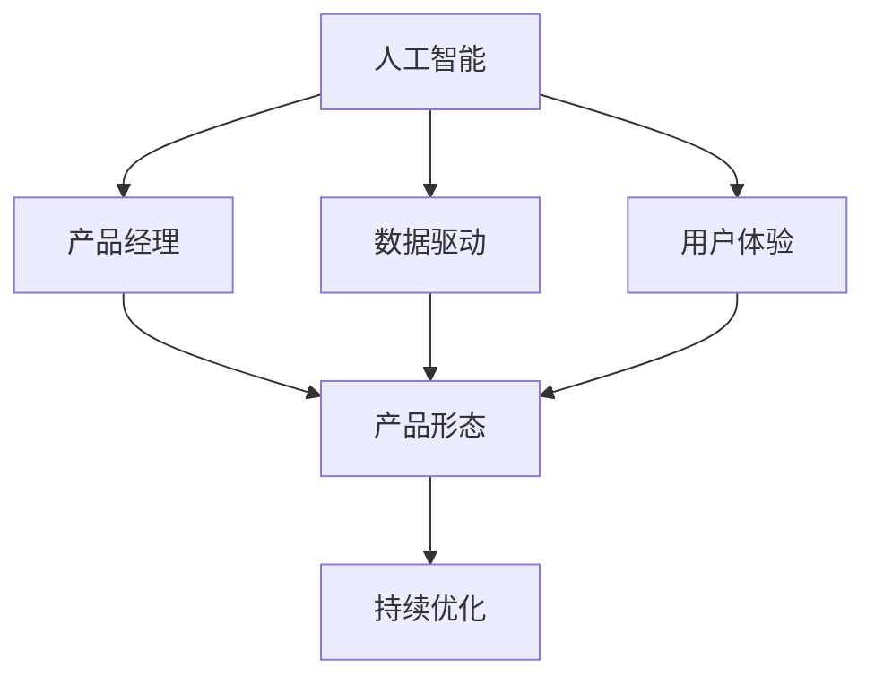

                 

# 贾扬清的期待：产品经理与AI的结合，创新产品形态与应用

## 1. 背景介绍

在当今数字化时代，人工智能（AI）技术正以前所未有的速度发展，并逐渐融入各行各业，成为驱动创新的关键力量。作为一位知名的AI技术专家，贾扬清不断探索和推动AI技术在产品开发中的创新应用，力图通过与产品经理的紧密合作，将AI技术与实际业务深度结合，开创出更多具有创新性的产品形态。

### 1.1 问题由来

随着AI技术的普及，越来越多的企业和组织开始尝试将其应用于产品的开发中。然而，AI技术虽然强大，但其应用却面临诸多挑战，如数据获取难度大、模型训练周期长、产品效果不理想等。同时，AI技术的黑盒特性也使得产品经理在实际应用中难以把控。

为了解决这些问题，贾扬清提出了一种新的AI应用模式，即产品经理与AI的深度融合，通过创新的方法，让AI技术更好地服务于业务，提升产品竞争力和用户体验。

### 1.2 问题核心关键点

贾扬清的AI应用模式主要关注以下几个关键点：

- 数据驱动：AI技术的应用离不开高质量的数据，产品经理需要对数据获取、处理和利用有深刻的理解。
- 用户体验：AI技术的应用需要关注用户体验，产品经理需与技术团队紧密合作，确保产品设计符合用户需求。
- 产品效果：AI技术的实际效果需要产品经理进行验证和评估，确保技术应用的可行性和实用性。
- 技术与业务的融合：产品经理需具备跨领域的知识，能够理解技术和业务的双重要求，实现二者的有效融合。
- 持续优化：AI技术的应用需要持续的优化和改进，产品经理需对产品的迭代过程进行跟踪和管理。

## 2. 核心概念与联系

### 2.1 核心概念概述

为了更好地理解贾扬清的AI应用模式，本节将介绍几个密切相关的核心概念：

- **人工智能（AI）**：利用计算机模拟人的智能行为，包括感知、学习、推理、决策等能力，其核心在于数据驱动和算法创新。
- **产品经理**：负责产品的市场调研、需求分析、产品设计、用户体验优化等工作，需具备对技术的深入理解。
- **产品形态**：指产品的外在表现形式，包括界面设计、功能实现、用户体验等，需与AI技术深度结合，实现创新应用。
- **数据驱动**：基于大量数据训练出的AI模型，能够更好地理解和预测用户行为，从而提升产品效果。
- **用户体验**：AI技术在产品中的应用，需符合用户需求和心理预期，提升用户满意度和忠诚度。
- **持续优化**：AI技术在产品中的部署不是一劳永逸的，需不断优化和调整，以适应市场变化和用户需求。

这些核心概念之间的逻辑关系可以通过以下Mermaid流程图来展示：



这个流程图展示了大语言模型的核心概念及其之间的关系：

1. 产品经理使用AI技术进行数据分析和模型训练。
2. 基于AI技术，设计创新性的产品形态。
3. 产品经理需关注用户体验，优化产品设计。
4. AI技术的实际效果需经过持续优化和迭代。

这些概念共同构成了贾扬清AI应用模式的工作框架，使得AI技术能够更好地服务于产品开发和市场应用。

## 3. 核心算法原理 & 具体操作步骤
### 3.1 算法原理概述

贾扬清的AI应用模式，主要基于监督学习和迁移学习的原理。其核心思想是：

- **数据驱动**：利用大量标注数据训练AI模型，提取用户行为模式和特征，指导产品设计。
- **迁移学习**：将AI模型在其他领域的成功应用经验迁移到新领域，减少模型训练时间和成本。
- **持续优化**：通过持续收集用户反馈和数据，不断优化和调整AI模型，提升产品效果。

### 3.2 算法步骤详解

基于监督学习和迁移学习的AI应用模式，一般包括以下几个关键步骤：

**Step 1: 数据准备**

- 收集相关领域的数据，进行数据清洗和预处理。
- 对数据进行标注，形成训练集、验证集和测试集。

**Step 2: 模型训练**

- 选择适合的AI模型，如深度神经网络、强化学习等，并进行预训练。
- 在标注数据上对模型进行微调，使其适应特定领域的需求。
- 在验证集上评估模型效果，调整超参数，避免过拟合。

**Step 3: 产品设计**

- 根据用户需求和数据特征，设计创新的产品形态。
- 将AI模型集成到产品中，实现功能优化和用户体验提升。

**Step 4: 用户反馈**

- 收集用户使用数据，进行模型评估和优化。
- 根据用户反馈，不断迭代和改进产品，提升用户满意度和忠诚度。

**Step 5: 持续优化**

- 定期收集新数据，更新AI模型，提升模型效果。
- 通过A/B测试等方法，评估产品效果，指导后续优化。

### 3.3 算法优缺点

贾扬清的AI应用模式具有以下优点：

1. **高效性**：利用迁移学习和预训练技术，能够快速构建高性能AI模型，减少开发周期。
2. **灵活性**：AI模型的迁移学习特性，使得产品经理可以根据不同领域需求快速调整模型。
3. **用户驱动**：产品经理与AI技术的深度融合，能够更好地理解用户需求，提升用户体验。
4. **可解释性**：通过数据驱动和模型优化，产品经理可以更直观地理解和调整AI模型的决策过程。
5. **持续优化**：持续的数据收集和模型更新，使得产品能够适应市场变化和用户需求。

同时，该方法也存在一定的局限性：

1. **数据依赖**：高质量标注数据是AI模型训练的基础，获取和处理成本较高。
2. **技术门槛**：产品经理需要具备一定的技术知识，才能与技术团队有效沟通和协作。
3. **模型泛化**：AI模型在不同领域和场景下的泛化能力有限，可能需要重新训练和调整。
4. **隐私风险**：大量数据的收集和处理可能带来隐私风险，需确保数据安全。

尽管存在这些局限性，但就目前而言，基于数据驱动和迁移学习的AI应用模式仍是大规模应用的主流范式。未来相关研究的重点在于如何进一步降低数据依赖，提高模型的泛化能力，同时兼顾用户隐私和数据安全等因素。

### 3.4 算法应用领域

贾扬清的AI应用模式已经在多个领域得到应用，如智能推荐系统、语音助手、智能客服、智慧医疗等，为各行各业带来了新的创新和突破。

- **智能推荐系统**：通过AI模型分析用户行为和偏好，实现个性化推荐，提升用户满意度和转化率。
- **语音助手**：利用语音识别和自然语言处理技术，提供语音交互和智能建议，提升用户体验。
- **智能客服**：通过AI模型理解用户意图，自动解答问题，提升客服效率和用户满意度。
- **智慧医疗**：利用AI模型分析医学影像和病历数据，辅助医生诊断和治疗，提升医疗服务质量。

## 4. 数学模型和公式 & 详细讲解
### 4.1 数学模型构建

本节将使用数学语言对基于监督学习的大语言模型微调过程进行更加严格的刻画。

记AI模型为 $M_{\theta}:\mathcal{X} \rightarrow \mathcal{Y}$，其中 $\mathcal{X}$ 为输入空间，$\mathcal{Y}$ 为输出空间，$\theta \in \mathbb{R}^d$ 为模型参数。假设AI模型的训练集为 $D=\{(x_i,y_i)\}_{i=1}^N, x_i \in \mathcal{X}, y_i \in \mathcal{Y}$。

定义模型 $M_{\theta}$ 在数据样本 $(x,y)$ 上的损失函数为 $\ell(M_{\theta}(x),y)$，则在数据集 $D$ 上的经验风险为：

$$
\mathcal{L}(\theta) = \frac{1}{N} \sum_{i=1}^N \ell(M_{\theta}(x_i),y_i)
$$

微调的优化目标是最小化经验风险，即找到最优参数：

$$
\theta^* = \mathop{\arg\min}_{\theta} \mathcal{L}(\theta)
$$

在实践中，我们通常使用基于梯度的优化算法（如SGD、Adam等）来近似求解上述最优化问题。设 $\eta$ 为学习率，$\lambda$ 为正则化系数，则参数的更新公式为：

$$
\theta \leftarrow \theta - \eta \nabla_{\theta}\mathcal{L}(\theta) - \eta\lambda\theta
$$

其中 $\nabla_{\theta}\mathcal{L}(\theta)$ 为损失函数对参数 $\theta$ 的梯度，可通过反向传播算法高效计算。

### 4.2 公式推导过程

以下我们以推荐系统为例，推导基于协同过滤算法的推荐模型。

记用户行为数据为 $R_{u,i}$，表示用户 $u$ 对物品 $i$ 的评分。记用户与物品的评分矩阵为 $R \in \mathbb{R}^{U \times I}$，其中 $U$ 为用户数，$I$ 为物品数。则协同过滤算法的目标是最小化以下损失函数：

$$
\ell(R) = \frac{1}{U} \sum_{u=1}^U \frac{1}{2} \sum_{i=1}^I (r_{u,i} - \hat{r}_{u,i})^2
$$

其中 $\hat{r}_{u,i} = \sum_{j=1}^I \alpha_{u,j} r_{j,i}$，$\alpha_{u,j}$ 为用户 $u$ 对物品 $j$ 的偏好向量，可以通过SVD分解得到。

通过求解上述优化问题，可得到推荐模型的用户偏好向量 $\alpha_{u,j}$，进而实现个性化推荐。

## 5. 项目实践：代码实例和详细解释说明
### 5.1 开发环境搭建

在进行AI应用模式实践前，我们需要准备好开发环境。以下是使用Python进行TensorFlow开发的环境配置流程：

1. 安装Anaconda：从官网下载并安装Anaconda，用于创建独立的Python环境。

2. 创建并激活虚拟环境：
```bash
conda create -n tf-env python=3.8 
conda activate tf-env
```

3. 安装TensorFlow：根据CUDA版本，从官网获取对应的安装命令。例如：
```bash
conda install tensorflow==2.7
```

4. 安装TensorBoard：
```bash
pip install tensorboard
```

5. 安装各类工具包：
```bash
pip install numpy pandas scikit-learn matplotlib tqdm jupyter notebook ipython
```

完成上述步骤后，即可在`tf-env`环境中开始AI应用模式的实践。

### 5.2 源代码详细实现

这里我们以智能推荐系统为例，给出使用TensorFlow进行协同过滤算法的PyTorch代码实现。

首先，定义协同过滤算法的目标函数：

```python
import tensorflow as tf
import numpy as np
import tensorflow.keras as keras

def collaborative_filtering_loss(R, R_hat):
    U, V, W = tf.linalg.svd(R_hat)
    U = U[:, :10]
    V = V[:, :10]
    W = W[:10, :10]
    R_reconstructed = np.dot(U, np.dot(W, V))
    loss = tf.reduce_mean(tf.reduce_sum(tf.square(R - R_reconstructed)))
    return loss

# 创建数据集
R = np.array([[5, 4, 0, 0],
              [0, 0, 5, 4],
              [4, 0, 0, 5],
              [0, 5, 4, 0]])
```

然后，定义模型和优化器：

```python
# 定义协同过滤算法
def collaborative_filtering_model(R):
    U = keras.layers.Dense(10, input_shape=(4,), activation='relu', name='U')
    V = keras.layers.Dense(10, activation='relu', name='V')
    W = keras.layers.Dense(10, activation='relu', name='W')
    R_hat = U * W * V
    loss = collaborative_filtering_loss(R, R_hat)
    optimizer = keras.optimizers.Adam(learning_rate=0.01)
    model = keras.Model(inputs=U.input, outputs=loss)
    model.compile(optimizer=optimizer, loss='mse')
    return model

# 训练模型
model = collaborative_filtering_model(R)
model.fit(x=R, y=R_hat, epochs=50, verbose=1)
```

最后，运行模型并进行测试：

```python
# 预测
R_pred = model.predict(R)

# 输出结果
print(R_pred)
```

以上就是使用TensorFlow进行协同过滤算法的完整代码实现。可以看到，TensorFlow提供的高阶API使得模型训练变得简洁高效。开发者可以将更多精力放在模型设计和数据处理上，而不必过多关注底层的实现细节。

### 5.3 代码解读与分析

让我们再详细解读一下关键代码的实现细节：

**collaborative_filtering_loss函数**：
- 该函数定义了协同过滤算法的目标函数，通过SVD分解用户评分矩阵，得到用户和物品的权重矩阵，计算重构误差损失。

**collaborative_filtering_model函数**：
- 该函数定义了协同过滤算法的模型，包括用户偏好向量、物品偏好向量、权重矩阵的计算，以及重构误差损失的计算。
- 使用TensorFlow的高级API，方便地定义了神经网络模型，并通过compile方法设置损失函数和优化器。

**训练模型**：
- 通过fit方法训练模型，设置训练次数和输出细节，自动更新模型参数以最小化损失函数。
- 使用mse损失函数，方便地处理回归问题。

**预测**：
- 使用predict方法进行预测，返回模型对新数据的预测值。
- 输出预测结果，便于后续分析和验证。

## 6. 实际应用场景
### 6.1 智能推荐系统

基于AI应用模式，智能推荐系统可以应用于电商、音乐、视频等众多领域。通过分析用户行为和偏好，推荐系统能够提供个性化的商品或内容，提升用户满意度和转化率。

在技术实现上，可以收集用户的历史行为数据，包括浏览记录、购买记录、评分记录等，作为训练数据。通过协同过滤算法、矩阵分解等方法，构建推荐模型，实现个性化推荐。

**实际应用**：
- 电商平台：推荐系统通过分析用户浏览和购买记录，推荐相关商品，提升用户购买率和销售额。
- 音乐和视频平台：推荐系统根据用户听歌和观影记录，推荐类似作品，提升用户使用时长和满意度。

### 6.2 语音助手

基于AI应用模式，语音助手可以应用于家庭、车载、客服等多个场景。通过语音识别和自然语言处理技术，语音助手能够理解用户指令，提供智能建议，提升用户交互体验。

在技术实现上，可以收集用户的语音输入和回复数据，进行标注和预处理。通过构建基于深度神经网络的语音识别和自然语言处理模型，实现语音助手的对话生成和自然交互。

**实际应用**：
- 家庭和车载场景：语音助手通过识别用户的语音指令，控制智能家居设备和车辆功能，提升生活便捷性。
- 客服场景：语音助手通过自然语言处理技术，理解用户问题，自动提供解决方案，提升客服效率和用户满意度。

### 6.3 智能客服

基于AI应用模式，智能客服可以应用于电商、金融、医疗等多个领域。通过语音识别和自然语言处理技术，智能客服能够理解用户意图，提供自动化回复，提升客服效率和用户满意度。

在技术实现上，可以收集用户与客服的对话记录，进行标注和预处理。通过构建基于深度神经网络的自然语言处理模型，实现智能客服的对话生成和自然交互。

**实际应用**：
- 电商领域：智能客服通过理解用户查询，自动提供商品信息和购买建议，提升客户体验和转化率。
- 金融领域：智能客服通过理解用户咨询，自动提供金融信息和理财建议，提升客户信任度和满意度。
- 医疗领域：智能客服通过理解用户症状，自动提供医疗信息和咨询建议，提升医疗服务的便捷性和可及性。

### 6.4 未来应用展望

随着AI技术的不断进步，基于AI应用模式的产品形态和应用场景将更加多样和丰富。未来，AI技术将进一步融入各行各业，带来更加智能、便捷、高效的用户体验。

在医疗领域，AI应用模式将帮助医生进行疾病诊断和治疗，提升医疗服务的智能化水平。在教育领域，AI应用模式将帮助学生进行个性化学习，提升学习效果和效率。在城市治理领域，AI应用模式将帮助城市管理者进行智能交通、环境监测等，提升城市管理的智能化水平。

## 7. 工具和资源推荐
### 7.1 学习资源推荐

为了帮助开发者系统掌握AI应用模式的理论基础和实践技巧，这里推荐一些优质的学习资源：

1. 《深度学习》系列书籍：由大专家撰写，全面介绍了深度学习的基本概念和算法原理。
2. Coursera《深度学习》课程：斯坦福大学开设的深度学习课程，涵盖了深度学习的基本概念和前沿技术。
3. 《TensorFlow实战Google深度学习》书籍：TensorFlow官方指南，适合初学者和中级开发者学习。
4. GitHub上的AI项目：收集了大量的AI项目代码，包括推荐系统、语音助手、智能客服等。
5. Kaggle数据集：收集了大量的公开数据集，适合数据驱动的AI应用模式实践。

通过对这些资源的学习实践，相信你一定能够快速掌握AI应用模式的精髓，并用于解决实际的AI问题。
###  7.2 开发工具推荐

高效的开发离不开优秀的工具支持。以下是几款用于AI应用模式开发的常用工具：

1. TensorFlow：由Google主导开发的深度学习框架，生产部署方便，适合大规模工程应用。
2. PyTorch：基于Python的开源深度学习框架，灵活性高，适合研究和实验。
3. Jupyter Notebook：免费的交互式笔记本环境，方便开发者进行数据处理、模型训练和结果展示。
4. Kaggle：数据科学竞赛平台，提供大量的数据集和竞赛机会，适合学习和实践。
5. Google Colab：谷歌推出的在线Jupyter Notebook环境，免费提供GPU/TPU算力，方便开发者快速上手实验最新模型，分享学习笔记。

合理利用这些工具，可以显著提升AI应用模式的开发效率，加快创新迭代的步伐。

### 7.3 相关论文推荐

AI应用模式的探索源于学界的持续研究。以下是几篇奠基性的相关论文，推荐阅读：

1. Deep Collaborative Filtering Model：提出了基于协同过滤算法的推荐系统，成为推荐系统领域的经典方法。
2. Deep Neural Network for Contextual Sentiment Classification：提出了基于深度神经网络的情感分类模型，在自然语言处理领域取得了突破性进展。
3. Attention is All You Need：提出了基于注意力机制的Transformer模型，开启了NLP领域的预训练大模型时代。
4. Evolving Latent Representation in Synergistic Adapter-based Fine-Tuning：提出了基于适配器(Adapters)的参数高效微调方法，在不增加模型参数量的情况下，也能取得不错的微调效果。

这些论文代表了大语言模型微调技术的发展脉络。通过学习这些前沿成果，可以帮助研究者把握学科前进方向，激发更多的创新灵感。

## 8. 总结：未来发展趋势与挑战
### 8.1 总结

本文对基于监督学习的大语言模型微调方法进行了全面系统的介绍。首先阐述了大语言模型和微调技术的研究背景和意义，明确了微调在拓展预训练模型应用、提升下游任务性能方面的独特价值。其次，从原理到实践，详细讲解了监督微调的数学原理和关键步骤，给出了AI应用模式的完整代码实例。同时，本文还广泛探讨了AI应用模式在智能推荐系统、语音助手、智能客服等多个行业领域的应用前景，展示了AI应用模式的巨大潜力。此外，本文精选了AI应用模式的各类学习资源，力求为读者提供全方位的技术指引。

通过本文的系统梳理，可以看到，基于AI应用模式的大语言模型微调方法，正在成为AI技术落地应用的重要范式，极大地拓展了AI模型的应用边界，催生了更多的落地场景。受益于预训练语言模型和微调方法的不断进步，相信AI技术将在更广阔的应用领域大放异彩，深刻影响人类的生产生活方式。

### 8.2 未来发展趋势

展望未来，AI应用模式将呈现以下几个发展趋势：

1. **模型规模持续增大**：随着算力成本的下降和数据规模的扩张，预训练语言模型的参数量还将持续增长。超大规模语言模型蕴含的丰富语言知识，有望支撑更加复杂多变的下游任务微调。
2. **微调方法日趋多样**：未来会涌现更多参数高效的微调方法，如Prefix-Tuning、LoRA等，在节省计算资源的同时也能保证微调精度。
3. **持续学习成为常态**：随着数据分布的不断变化，AI应用模式需要持续学习新知识以保持性能。如何在不遗忘原有知识的同时，高效吸收新样本信息，将成为重要的研究课题。
4. **标注样本需求降低**：受启发于提示学习(Prompt-based Learning)的思路，未来的AI应用模式将更好地利用AI模型的语言理解能力，通过更加巧妙的任务描述，在更少的标注样本上也能实现理想的微调效果。
5. **多模态微调崛起**：当前的AI应用模式主要聚焦于纯文本数据，未来会进一步拓展到图像、视频、语音等多模态数据微调。多模态信息的融合，将显著提升AI模型对现实世界的理解和建模能力。
6. **模型通用性增强**：经过海量数据的预训练和多领域任务的微调，未来的AI应用模式将具备更强大的常识推理和跨领域迁移能力，逐步迈向通用人工智能(AGI)的目标。

以上趋势凸显了AI应用模式的广阔前景。这些方向的探索发展，必将进一步提升AI技术的应用范围和性能，为人类认知智能的进化带来深远影响。

### 8.3 面临的挑战

尽管AI应用模式已经取得了瞩目成就，但在迈向更加智能化、普适化应用的过程中，它仍面临着诸多挑战：

1. **标注成本瓶颈**：高质量标注数据是AI模型训练的基础，获取和处理成本较高。如何进一步降低微调对标注样本的依赖，将是一大难题。
2. **模型鲁棒性不足**：当前AI应用模式面对域外数据时，泛化性能往往大打折扣。对于测试样本的微小扰动，AI应用模式的预测也容易发生波动。如何提高AI应用模式的鲁棒性，避免灾难性遗忘，还需要更多理论和实践的积累。
3. **推理效率有待提高**：大规模AI模型虽然精度高，但在实际部署时往往面临推理速度慢、内存占用大等效率问题。如何在保证性能的同时，简化模型结构，提升推理速度，优化资源占用，将是重要的优化方向。
4. **可解释性亟需加强**：当前AI应用模式更像是"黑盒"系统，难以解释其内部工作机制和决策逻辑。对于医疗、金融等高风险应用，算法的可解释性和可审计性尤为重要。如何赋予AI应用模式更强的可解释性，将是亟待攻克的难题。
5. **安全性有待保障**：预训练语言模型难免会学习到有偏见、有害的信息，通过AI应用模式传递到下游任务，产生误导性、歧视性的输出，给实际应用带来安全隐患。如何从数据和算法层面消除模型偏见，避免恶意用途，确保输出的安全性，也将是重要的研究课题。
6. **知识整合能力不足**：现有的AI应用模式往往局限于任务内数据，难以灵活吸收和运用更广泛的先验知识。如何让AI应用模式更好地与外部知识库、规则库等专家知识结合，形成更加全面、准确的信息整合能力，还有很大的想象空间。

正视AI应用模式面临的这些挑战，积极应对并寻求突破，将是大语言模型微调走向成熟的必由之路。相信随着学界和产业界的共同努力，这些挑战终将一一被克服，AI应用模式必将在构建人机协同的智能时代中扮演越来越重要的角色。

### 8.4 研究展望

面向未来，AI应用模式的研究需要在以下几个方面寻求新的突破：

1. **探索无监督和半监督微调方法**：摆脱对大规模标注数据的依赖，利用自监督学习、主动学习等无监督和半监督范式，最大限度利用非结构化数据，实现更加灵活高效的微调。
2. **研究参数高效和计算高效的微调范式**：开发更加参数高效的微调方法，在固定大部分预训练参数的同时，只更新极少量的任务相关参数。同时优化AI应用模式的计算图，减少前向传播和反向传播的资源消耗，实现更加轻量级、实时性的部署。
3. **融合因果和对比学习范式**：通过引入因果推断和对比学习思想，增强AI应用模型建立稳定因果关系的能力，学习更加普适、鲁棒的语言表征，从而提升模型泛化性和抗干扰能力。
4. **引入更多先验知识**：将符号化的先验知识，如知识图谱、逻辑规则等，与神经网络模型进行巧妙融合，引导AI应用模型的微调过程学习更准确、合理的语言模型。同时加强不同模态数据的整合，实现视觉、语音等多模态信息与文本信息的协同建模。
5. **结合因果分析和博弈论工具**：将因果分析方法引入AI应用模型，识别出模型决策的关键特征，增强输出解释的因果性和逻辑性。借助博弈论工具刻画人机交互过程，主动探索并规避模型的脆弱点，提高系统稳定性。
6. **纳入伦理道德约束**：在AI应用模型的训练目标中引入伦理导向的评估指标，过滤和惩罚有偏见、有害的输出倾向。同时加强人工干预和审核，建立模型行为的监管机制，确保输出符合人类价值观和伦理道德。

这些研究方向的探索，必将引领AI应用模式的持续演进，推动AI技术向更加智能、普适、安全、可信的方向发展。面向未来，AI应用模式需要在数据、算法、工程、业务等多个维度协同发力，共同推动AI技术在各行各业的深入应用，为人类社会带来更多福祉。

