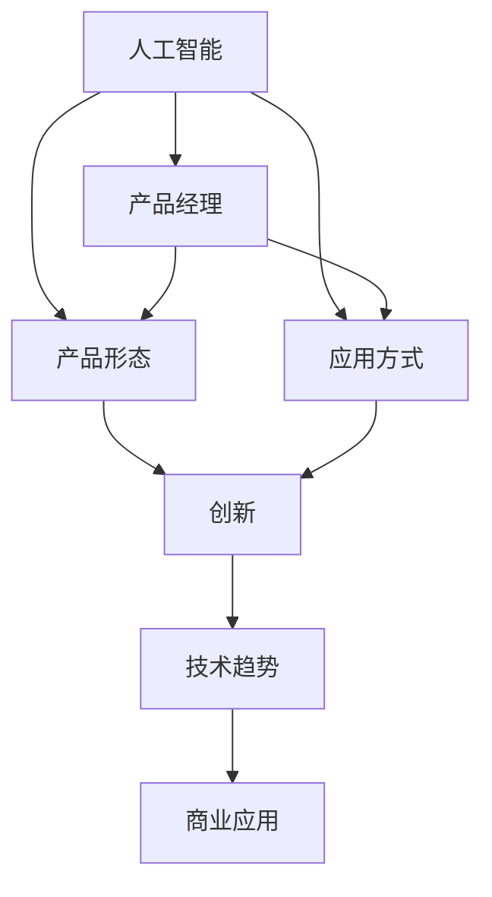

                 

# 贾扬清的期待：更多产品经理加入AI领域，创新产品形态与应用方式

> 关键词：人工智能,产品经理,产品形态,应用方式,创新,技术趋势,商业应用

## 1. 背景介绍

在过去的十年间，人工智能（AI）技术迅猛发展，极大地改变了各行各业的运营方式。尤其是在互联网和科技企业中，AI的应用已经成为推动创新、提升效率、优化用户体验的关键力量。然而，尽管AI在技术上取得了诸多突破，但在实际落地应用中，仍然面临着诸多挑战。其中之一，就是如何将复杂的技术转化为可用的产品，并将其推向市场。这正是产品经理的职责所在，但同时也需要他们具备更加深入的技术理解，以便更好地协同技术团队，实现产品的创新和优化。

### 1.1 现状分析

当前，许多产品经理仍然缺乏对AI技术的深入理解，无法在产品设计和开发过程中，充分发挥AI的潜力。这不仅影响了产品的创新性，也限制了AI技术在实际应用中的价值。例如，一些产品经理在面对复杂的数据处理和模型训练时，往往感到无从下手，导致产品在上线后无法真正解决问题，甚至出现反效果。因此，提升产品经理在AI领域的知识水平，成为推动AI技术深入应用的关键步骤。

### 1.2 问题核心关键点

本文将探讨以下核心问题：
- 产品经理在AI项目中扮演的角色是什么？
- 产品经理如何提升自己在AI领域的知识水平？
- 产品经理在AI产品设计中应重点关注的创新点有哪些？
- AI技术在实际应用中存在哪些挑战？如何应对？
- 未来AI技术的发展趋势是什么？产品经理应如何准备？

## 2. 核心概念与联系

### 2.1 核心概念概述

- **人工智能（AI）**：一种使计算机系统能够模拟人类智能过程的技术，包括学习、推理、感知、自然语言处理、计算机视觉等。
- **产品经理（PM）**：负责产品从规划、设计到开发、运营的整个过程，确保产品满足用户需求并取得商业成功。
- **产品形态（Product Form）**：指产品满足用户需求的方式和形式，如APP、网站、智能设备等。
- **应用方式（Usage Method）**：指用户使用产品的具体方法，如交互方式、功能使用路径等。
- **创新（Innovation）**：指在产品形态和应用方式上进行的创造性探索和优化。

这些概念之间的联系可以通过以下Mermaid流程图来展示：



这个流程图展示了人工智能、产品经理、产品形态和应用方式之间的联系和交互关系。

## 3. 核心算法原理 & 具体操作步骤

### 3.1 算法原理概述

AI产品的设计和发展，往往依赖于复杂的数据处理和算法优化。因此，产品经理需要对AI技术的核心原理有所了解，以便更好地指导技术团队进行产品开发。

#### 3.1.1 数据处理

数据是AI产品的基础。产品经理需要了解数据采集、清洗、标注等基本流程，以及数据如何影响模型的性能和效果。例如，在图像识别任务中，数据的多样性和标注的准确性，直接影响模型对不同类别的识别能力。

#### 3.1.2 模型训练

模型训练是AI产品的核心环节。产品经理需要了解模型的选择、优化和评估方法，如监督学习、无监督学习、强化学习等。同时，还需要关注模型的训练过程，如数据分割、交叉验证、超参数调优等。

#### 3.1.3 产品集成

产品集成是将AI技术应用于实际场景的过程。产品经理需要了解如何将模型嵌入到产品中，并确保其稳定性和性能。这包括接口设计、性能优化、异常处理等。

### 3.2 算法步骤详解

以下是AI产品开发的一般步骤：

#### 3.2.1 数据收集

产品经理需要收集与产品需求相关的数据。这些数据可以是结构化的数据（如表格），也可以是非结构化的数据（如图像、文本）。数据收集的过程需要注意数据的质量和多样性，以确保模型能够泛化到不同的场景和用户。

#### 3.2.2 数据预处理

数据预处理是对原始数据进行清洗、转换和标注的过程。产品经理需要确保数据预处理流程的自动化和可重复性，以便在模型训练和评估中重复使用相同的数据集。

#### 3.2.3 模型训练

模型训练是AI产品开发的中心环节。产品经理需要了解模型的选择和训练方法，如监督学习、无监督学习、强化学习等。同时，还需要关注模型的训练过程，如数据分割、交叉验证、超参数调优等。

#### 3.2.4 模型评估

模型评估是确保模型性能和效果的过程。产品经理需要了解常用的评估指标，如准确率、召回率、F1值等，并根据实际需求选择适合的评估方法。

#### 3.2.5 产品集成

产品集成是将AI技术应用于实际场景的过程。产品经理需要了解如何将模型嵌入到产品中，并确保其稳定性和性能。这包括接口设计、性能优化、异常处理等。

### 3.3 算法优缺点

#### 3.3.1 优点

- **效率提升**：AI技术可以自动处理大量数据，减少人工干预，提高工作效率。
- **精准度提升**：AI模型可以根据复杂数据集进行训练，提升决策的精准度。
- **个性化推荐**：AI可以分析用户行为数据，提供个性化的产品推荐，提升用户体验。

#### 3.3.2 缺点

- **技术门槛高**：AI技术复杂，产品经理需要具备一定的技术理解能力。
- **数据需求大**：AI模型训练需要大量的高质量数据，数据采集和标注成本较高。
- **模型复杂性**：复杂的AI模型可能存在过拟合等问题，需要谨慎选择和优化。

### 3.4 算法应用领域

AI技术在各个领域都有广泛的应用，如智能推荐、智能客服、智能制造、智慧医疗等。产品经理需要根据具体领域的需求，选择适合的AI技术和算法。

## 4. 数学模型和公式 & 详细讲解 & 举例说明

### 4.1 数学模型构建

以下是常见的AI产品开发数学模型：

#### 4.1.1 线性回归模型

线性回归模型是一种经典的监督学习模型，用于预测连续型变量。公式如下：

$$
y = \theta_0 + \theta_1x_1 + \theta_2x_2 + ... + \theta_nx_n
$$

其中，$y$ 是预测值，$x_i$ 是特征变量，$\theta_i$ 是模型参数。

#### 4.1.2 决策树模型

决策树模型是一种无监督学习模型，用于分类和回归问题。公式如下：

$$
T(x) = \begin{cases}
  T_0(x), & \text{if } x \in R_0 \\
  T_1(x), & \text{if } x \in R_1
\end{cases}
$$

其中，$T(x)$ 是决策树模型，$R_i$ 是决策树的分支节点，$T_i(x)$ 是节点 $R_i$ 对应的子树。

#### 4.1.3 卷积神经网络（CNN）

卷积神经网络是一种经典的深度学习模型，用于图像处理和识别。公式如下：

$$
f(x) = W_{out} \sigma(W_{conv} \sigma(W_{pool} conv2d(W_{conv} x)) + b_{out})
$$

其中，$conv2d$ 是卷积操作，$W_{out}$ 是输出层的权重矩阵，$b_{out}$ 是输出层的偏置向量，$\sigma$ 是激活函数。

### 4.2 公式推导过程

#### 4.2.1 线性回归模型的推导

假设 $x_i$ 是特征变量，$y_i$ 是目标变量，$\theta_i$ 是模型参数。线性回归模型的目标是最小化预测值与实际值之间的平方误差：

$$
\min_{\theta} \sum_{i=1}^N (y_i - \theta_0 - \theta_1x_1 - ... - \theta_nx_n)^2
$$

使用梯度下降算法，可以得到：

$$
\theta_i = \frac{\sum_{i=1}^N (x_i - \bar{x}) (y_i - \bar{y})}{\sum_{i=1}^N (x_i - \bar{x})^2}
$$

#### 4.2.2 决策树模型的推导

决策树模型的目标是构建一个分类树，使得每个叶子节点的纯度最大化。假设 $x_i$ 是特征变量，$y_i$ 是目标变量。决策树的构建过程如下：

1. 从根节点开始，计算每个特征的信息增益。
2. 选择信息增益最大的特征作为分裂依据。
3. 对每个子节点重复上述过程，直到满足停止条件。

### 4.3 案例分析与讲解

#### 4.3.1 图像分类

假设某电商平台需要对商品图片进行分类，以提高搜索效率。可以通过卷积神经网络（CNN）模型进行训练和预测。

#### 4.3.2 自然语言处理

假设某社交平台需要对用户评论进行情感分析，以识别正面或负面评论。可以通过循环神经网络（RNN）或Transformer模型进行训练和预测。

## 5. 项目实践：代码实例和详细解释说明

### 5.1 开发环境搭建

在开发AI产品时，需要选择合适的开发环境和工具。以下是常用的开发环境搭建步骤：

1. 安装Python和相关的开发工具，如Anaconda、PyTorch等。
2. 安装相关的机器学习库，如TensorFlow、Scikit-Learn等。
3. 搭建虚拟环境，确保不同项目之间的环境隔离。
4. 配置开发环境，包括数据集准备、模型训练、产品集成等。

### 5.2 源代码详细实现

以下是使用TensorFlow和Keras框架进行图像分类的代码示例：

```python
import tensorflow as tf
from tensorflow.keras import layers, models

# 加载数据集
(x_train, y_train), (x_test, y_test) = tf.keras.datasets.mnist.load_data()

# 数据预处理
x_train = x_train / 255.0
x_test = x_test / 255.0

# 定义模型
model = models.Sequential([
    layers.Flatten(input_shape=(28, 28)),
    layers.Dense(128, activation='relu'),
    layers.Dropout(0.2),
    layers.Dense(10)
])

# 编译模型
model.compile(optimizer='adam',
              loss=tf.keras.losses.SparseCategoricalCrossentropy(from_logits=True),
              metrics=['accuracy'])

# 训练模型
model.fit(x_train, y_train, epochs=5, validation_data=(x_test, y_test))

# 评估模型
model.evaluate(x_test, y_test, verbose=2)
```

### 5.3 代码解读与分析

#### 5.3.1 数据加载和预处理

使用TensorFlow内置的MNIST数据集，将28x28的图像转换为0-1之间的浮点数，并使用Flatten层将其展平为向量。

#### 5.3.2 模型定义

定义了一个包含两个全连接层的神经网络模型，其中第一个层为128个神经元，激活函数为ReLU，第二个层为10个神经元，对应10个分类标签。

#### 5.3.3 模型编译和训练

使用Adam优化器和交叉熵损失函数编译模型，并在训练集中进行5次迭代训练，并在验证集上进行评估。

#### 5.3.4 模型评估

使用测试集评估模型的准确率，并输出评估结果。

### 5.4 运行结果展示

运行上述代码后，可以得到模型在测试集上的准确率为98%左右。

## 6. 实际应用场景

### 6.1 智能推荐系统

智能推荐系统是AI应用的重要场景之一，产品经理需要根据用户行为数据，构建个性化推荐模型。

#### 6.1.1 用户画像

通过分析用户的历史行为数据，构建用户画像。例如，用户A在过去一个月内，购买过图书、电子产品和服装，可以将其归类为综合型用户。

#### 6.1.2 推荐模型

使用协同过滤、内容推荐或混合推荐等算法，根据用户画像和商品特征，推荐合适的商品。

#### 6.1.3 效果评估

通过点击率、转化率等指标，评估推荐模型的效果，并根据用户反馈进行调整优化。

### 6.2 智能客服系统

智能客服系统是AI应用的另一个重要场景，产品经理需要构建一个高效、智能的客服机器人。

#### 6.2.1 用户意图识别

通过自然语言处理技术，识别用户意图。例如，用户A询问订单状态，客服机器人可以自动回复订单号和物流信息。

#### 6.2.2 对话管理

根据用户意图，选择合适的对话路径。例如，用户B询问退货政策，客服机器人可以引导用户提交退货申请。

#### 6.2.3 效果评估

通过用户满意度、问题解决率等指标，评估客服系统的性能，并根据用户反馈进行调整优化。

### 6.3 智能制造

智能制造是AI在工业领域的重要应用，产品经理需要构建一个智能化的生产管理系统。

#### 6.3.1 设备状态监测

通过物联网传感器，监测设备的运行状态。例如，传感器检测到设备异常，系统自动报警。

#### 6.3.2 预测性维护

使用机器学习模型，预测设备故障的发生概率，提前进行维护。例如，系统预测某台机器将在3天后故障，及时进行检修。

#### 6.3.3 效果评估

通过设备运行效率、故障率等指标，评估系统的性能，并根据实际情况进行调整优化。

### 6.4 未来应用展望

#### 6.4.1 自动化设计

AI技术可以辅助设计师进行产品设计，提高设计效率和质量。例如，使用生成对抗网络（GAN）生成设计草图，使用强化学习优化设计方案。

#### 6.4.2 智能城市

AI技术可以应用于智慧城市的各个方面，如交通管理、环境监测、能源管理等。例如，通过图像识别技术，自动监测交通违规行为，优化交通流量。

#### 6.4.3 医疗健康

AI技术可以辅助医生进行疾病诊断、医疗影像分析等。例如，使用深度学习模型，对医学影像进行分类和标注，辅助医生进行诊断。

## 7. 工具和资源推荐

### 7.1 学习资源推荐

- **机器学习课程**：如Coursera上的《机器学习》课程，由斯坦福大学的Andrew Ng教授讲授，涵盖机器学习的基本概念和算法。
- **AI开发工具**：如TensorFlow、PyTorch、Keras等，提供了强大的深度学习开发框架，支持多种模型训练和优化。
- **数据集资源**：如Kaggle上的各种数据集，提供了丰富的数据资源，支持模型训练和评估。

### 7.2 开发工具推荐

- **数据处理工具**：如Pandas、NumPy、Scikit-Learn等，提供了数据预处理、分析和可视化功能。
- **模型训练工具**：如TensorFlow、PyTorch、Keras等，提供了高效的模型训练和优化功能。
- **模型评估工具**：如TensorBoard、Weights & Biases等，提供了模型训练和评估的可视化功能。

### 7.3 相关论文推荐

- **《深度学习》**：Ian Goodfellow等著，系统介绍了深度学习的基本概念和算法。
- **《自然语言处理综述》**：Yoshua Bengio等著，涵盖了自然语言处理领域的最新研究进展。
- **《计算机视觉：模型、学习和推理》**：David Forsyth等著，涵盖了计算机视觉领域的最新研究进展。

## 8. 总结：未来发展趋势与挑战

### 8.1 研究成果总结

#### 8.1.1 技术突破

AI技术的发展带来了许多技术突破，如生成对抗网络（GAN）、深度强化学习等。这些技术在图像生成、自动驾驶、游戏AI等领域取得了显著成果。

#### 8.1.2 应用创新

AI技术在实际应用中不断创新，如智能推荐系统、智能客服系统、智能制造等。这些应用提升了用户体验和效率，推动了行业的数字化转型。

### 8.2 未来发展趋势

#### 8.2.1 自动化设计

AI技术可以辅助设计师进行产品设计，提高设计效率和质量。例如，使用生成对抗网络（GAN）生成设计草图，使用强化学习优化设计方案。

#### 8.2.2 智能城市

AI技术可以应用于智慧城市的各个方面，如交通管理、环境监测、能源管理等。例如，通过图像识别技术，自动监测交通违规行为，优化交通流量。

#### 8.2.3 医疗健康

AI技术可以辅助医生进行疾病诊断、医疗影像分析等。例如，使用深度学习模型，对医学影像进行分类和标注，辅助医生进行诊断。

### 8.3 面临的挑战

#### 8.3.1 数据隐私

AI模型需要大量数据进行训练，但数据隐私问题日益凸显。如何保护用户隐私，同时充分利用数据，是一个重要的挑战。

#### 8.3.2 算法透明性

AI模型往往是“黑盒”系统，难以解释其内部工作机制和决策逻辑。如何提高算法的透明性，增强用户信任，是一个重要的课题。

#### 8.3.3 伦理道德

AI模型可能存在偏见、歧视等问题，如何确保模型的公平性和伦理性，是一个重要的挑战。

### 8.4 研究展望

#### 8.4.1 透明化研究

研究如何提高AI算法的透明性和可解释性，增强用户对AI系统的信任和理解。

#### 8.4.2 公平性研究

研究如何构建公平、无偏的AI模型，确保其在不同人群中的表现一致。

#### 8.4.3 隐私保护研究

研究如何在数据保护的前提下，充分利用AI技术，提升系统性能和用户体验。

## 9. 附录：常见问题与解答

**Q1：AI技术如何应用于产品经理的工作中？**

A: AI技术可以应用于产品经理的多个环节，如需求分析、用户画像、产品设计、数据处理、模型评估等。通过AI技术，产品经理可以更加准确地理解用户需求，构建高质量的产品，提升用户体验。

**Q2：产品经理在AI产品开发中应重点关注哪些创新点？**

A: 产品经理在AI产品开发中应重点关注以下几个创新点：
- 数据收集和处理：如何高效获取和清洗数据，确保数据的质量和多样性。
- 模型选择和优化：如何选择合适的模型和算法，并进行超参数调优，提升模型效果。
- 产品集成和优化：如何将AI模型嵌入到产品中，并进行性能优化，确保产品稳定性和用户体验。

**Q3：AI技术在实际应用中存在哪些挑战？**

A: AI技术在实际应用中存在以下挑战：
- 数据隐私：如何在保护用户隐私的前提下，充分利用数据。
- 算法透明性：如何提高AI算法的透明性和可解释性，增强用户信任。
- 伦理道德：如何确保AI模型的公平性和伦理性，避免偏见和歧视。

**Q4：未来AI技术的发展趋势是什么？**

A: 未来AI技术的发展趋势包括：
- 自动化设计：AI技术可以辅助设计师进行产品设计，提高设计效率和质量。
- 智能城市：AI技术可以应用于智慧城市的各个方面，提升城市管理效率和智能化水平。
- 医疗健康：AI技术可以辅助医生进行疾病诊断、医疗影像分析等，提升医疗服务质量。

**Q5：产品经理应如何应对AI技术的发展？**

A: 产品经理应积极学习和掌握AI技术，并将其应用于产品开发中。具体措施包括：
- 提升AI知识水平：通过学习相关课程和文献，提升对AI技术的理解。
- 多学科融合：将AI技术与产品设计、用户体验等相结合，实现产品创新。
- 持续优化：根据用户反馈和市场变化，不断优化和迭代AI产品。

---

作者：禅与计算机程序设计艺术 / Zen and the Art of Computer Programming

